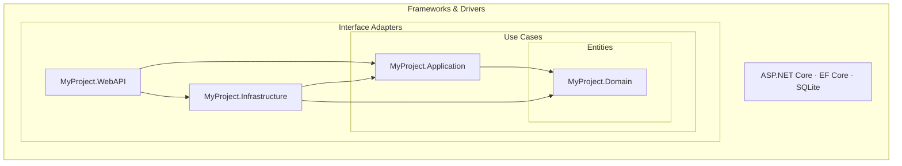
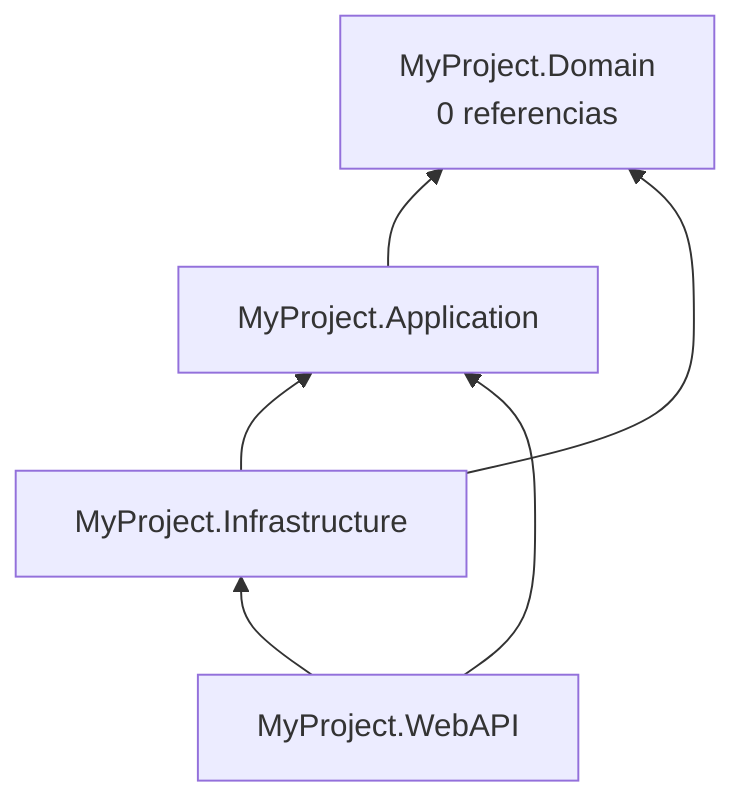
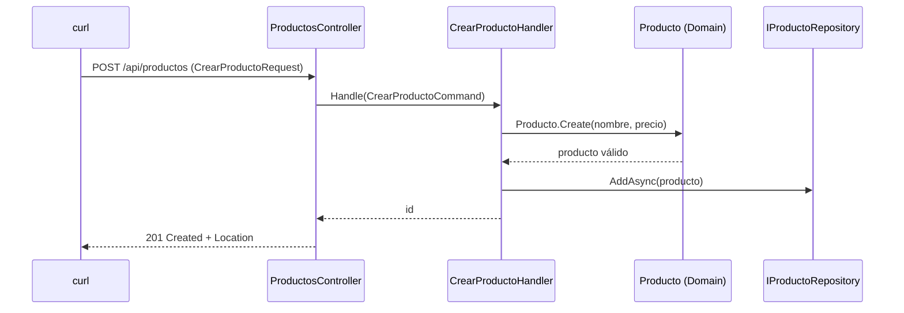
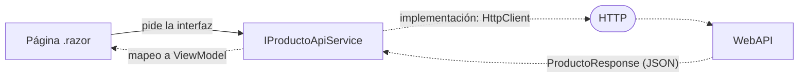
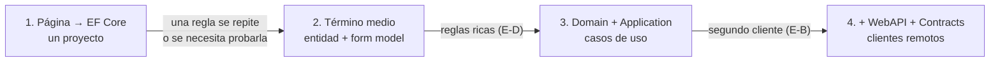

# Arquitectura de soluciones .NET

Guía de estudio para construir, capa por capa, una solución .NET organizada según la regla de dependencia de Clean Architecture, comprobar cada concepto con comandos reales y, al final, disponer de criterios para decidir qué estructura necesita un problema concreto. Todo lo que la guía muestra como salida de un comando fue ejecutado y está registrado; lo que no se ejecutó está rotulado.

## Índice

- **[0. Cómo usar esta guía](#0-cómo-usar-esta-guía)**: alcance, conocimientos previos, las dos maneras de leerla, el problema conductor y el entorno.
- ***Parte I — Fundamentos***
- **[1. Qué se está armando: solución, proyecto, referencia y paquete](#1-qué-se-está-armando-solución-proyecto-referencia-y-paquete)**: las piezas físicas de .NET y por qué una referencia tiene dirección.
- **[2. La regla de dependencia](#2-la-regla-de-dependencia)**: Clean Architecture, inversión e inyección de dependencias, y el esqueleto de cuatro proyectos.
- ***Parte II — Construcción: el ejemplo crece capítulo a capítulo***
- **[3. Domain: lo que es verdad en el negocio](#3-domain-lo-que-es-verdad-en-el-negocio)**: entidades, value objects e invariantes.
- **[4. Application: lo que quiere hacer el usuario](#4-application-lo-que-quiere-hacer-el-usuario)**: casos de uso, mensajes Command y Query, pruebas sin base de datos.
- **[5. Infrastructure y WebAPI: el borde con el mundo](#5-infrastructure-y-webapi-el-borde-con-el-mundo)**: la API en marcha, el cambio de almacenamiento y los errores HTTP.
- **[6. Los clientes](#6-los-clientes)**: cómo consume la API una aplicación .NET y dónde nace `Contracts`.
- ***Parte III — Criterio: se puede abrir directamente***
- **[7. Cada objeto responde una pregunta](#7-cada-objeto-responde-una-pregunta)**: los siete tipos de objeto, cuándo existe cada uno y por qué no alcanza una sola clase.
- **[8. La estructura física y los nombres](#8-la-estructura-física-y-los-nombres)**: el árbol de la solución, las referencias permitidas y la convención de nombres.
- **[9. Del problema a la estructura](#9-del-problema-a-la-estructura-criterios-para-una-solución-real)**: mapa de entrada por escenario, escalera de opciones y evaluación de dependencias.
- **[Anexo A. Hoja de ruta del laboratorio](#anexo-a-hoja-de-ruta-del-laboratorio)**: los 25 pasos con su sección, su comando, lo que confirman y su captura.
- **[Anexo B. Lista de verificación](#anexo-b-lista-de-verificación-para-diseñar-una-solución-nueva)**: las preguntas de §9 como plantilla para una solución nueva.
- **[Anexo C. Versiones, soporte y licencias](#anexo-c-versiones-soporte-y-licencias-verificadas)**: datos volátiles con fuente y fecha de consulta.
- **[Anexo D. Glosario](#anexo-d-glosario)**: cada término con su equivalente y la sección donde se define.
- **[Anexo E. Referencias](#anexo-e-referencias)**: fuentes citadas, en formato autor-fecha.

---

## 0. Cómo usar esta guía

### 0.1 Qué promete y qué no cubre

La guía enseña a organizar el código de una aplicación .NET en proyectos con responsabilidades separadas, a comprobar con el compilador que esa separación se respeta y a elegir cuánta separación necesita un caso real. El laboratorio construye y ejecuta un backend completo (dominio, casos de uso, persistencia con EF Core y una API HTTP) y un cliente de consola que lo consume.

Quedan fuera, y se tratan en otros documentos o en la bibliografía: microservicios (ver `Microservicios-Guide.md` en esta misma carpeta), despliegue e integración continua, la implementación completa de clientes Blazor y MAUI (se muestran como fragmentos ilustrativos, §6.5), la seguridad en profundidad y la enseñanza de C# desde cero.

### 0.2 Qué se supone que sabe quien lee

Se supone C# básico: qué es una clase, un método y una propiedad, y cómo se ejecuta un comando en una terminal. Todo lo demás —interfaces, `record`, constructores privados, `async`/`await`, peticiones HTTP, códigos de estado, JSON, bases de datos relacionales— se define la primera vez que aparece, y cada definición figura en el [Anexo D](#anexo-d-glosario).

### 0.3 Dos maneras de leerla

| Lectura | Recorrido | Para quién |
| --- | --- | --- |
| **Recorrido** | §1 → §9, ejecutando cada paso de laboratorio en orden | Quien estudia el tema por primera vez |
| **Consulta** | Directo a [§9.1](#91-mapa-de-entrada-dónde-está-el-problema) (mapa de entrada) y de ahí al capítulo que corresponda; [§7](#7-cada-objeto-responde-una-pregunta) para decidir qué clase usar | Quien ya diseña y necesita un criterio puntual |

Dentro de cada capítulo el orden es fijo: prerrequisitos, definiciones, decisiones formuladas como pregunta —con la respuesta en una línea en negrita, su porqué y, cuando la pregunta admite más de una manera de resolverla, ejemplos que cumplen (✅) y que no cumplen (❌); cuando se responde con un experimento, el contraste lo da la salida registrada—, práctica y una pregunta de cierre sobre cuándo no aplica lo visto.

### 0.4 El problema conductor

Una **tienda** vende productos. Quien **administra el catálogo** da de alta productos con nombre y precio, y quien **compra** consulta la lista. Hay una sola regla de negocio al comienzo: un producto no puede tener precio cero ni negativo. Más adelante aparecen clientes, pedidos y otras aplicaciones que consumen el catálogo.

La guía no resuelve ese problema de una sola manera, porque la estructura correcta depende del escenario. Estos son los cuatro que se usan en todo el documento:

| Escenario | Situación | Pregunta que plantea |
| --- | --- | --- |
| **E-A** | Una sola aplicación Blazor que corre en el servidor; operaciones de alta, baja, modificación y consulta con pocas reglas | ¿Hace falta separar en capas? |
| **E-B** | Una API HTTP con uno o más clientes .NET remotos (web, móvil, consola); si los clientes no son .NET, la estructura es la misma sin `Contracts` (§8.5, §9.1) | ¿Dónde vive lo que comparten la API y sus clientes? |
| **E-C** | Base de datos heredada, con un esquema fijo que no se puede cambiar | ¿La entidad puede mapear la tabla directamente? |
| **E-D** | Reglas de negocio ricas que se repiten en varios lugares | ¿Dónde se escribe una regla para que no se duplique? |

Los escenarios describen situaciones, no estructuras: la estructura de partida de cada uno está en el [§9.1](#91-mapa-de-entrada-dónde-está-el-problema) y puede crecer sin que cambie el rótulo; en particular, E-A empieza con un solo proyecto y suma `Domain` y `Application` cuando aparecen reglas que proteger (§6.4 y §8.3 tratan ese caso). La guía construye la versión más completa de la solución —cuatro proyectos de backend, un contrato compartido y un cliente remoto— porque el enunciado incluye «otras aplicaciones que consumen el catálogo», que es la señal del escenario E-B. No es la estructura que conviene siempre: cada capítulo cierra con la pregunta de cuándo lo construido no hace falta, y el [§9.2](#92-la-escalera-de-opciones) ordena esas respuestas en una escalera de cuatro escalones, desde un solo proyecto hasta la API con clientes remotos. El problema se resuelve en [§9.5](#95-el-problema-conductor-resuelto).

### 0.5 Marcas de procedencia

| Marca | Significado |
| --- | --- |
| *Salida registrada: `capturas/Lnn-….txt`, SDK 10.0.400* | La salida mostrada es un extracto literal de una ejecución real, guardada en [`Dot-NET-Arquitectura-Lab/`](Dot-NET-Arquitectura-Lab/) junto a esta guía |
| **[Compilado: `MyProject/src/…`]** | El bloque de código es un extracto textual del archivo indicado, que compiló en el laboratorio con cero advertencias. La ruta `MyProject/…` es la del código publicado en `Dot-NET-Arquitectura-Lab/` y coincide con la carpeta que se crea en L01 |
| **[Fragmento ilustrativo: motivo]** | El bloque no forma parte del código final del laboratorio: o no se compiló, o se compiló solo para provocar un error y se eliminó; el motivo se declara |
| **Criterio de esta guía** | Recomendación propia, no una norma ni un dato externo |
| [Autor, año](#anexo-e-referencias) | Afirmación respaldada por la fuente citada en el Anexo E |
| Tipo nombrado sin código | Cuando la guía nombra un tipo (`IProductoRepository`, `ProductoDto`, `FakeProductoRepository`, `Program.cs`…) sin mostrar su código, el archivo completo está en [`Dot-NET-Arquitectura-Lab/MyProject/`](Dot-NET-Arquitectura-Lab/MyProject/), en la carpeta que indica su espacio de nombres (`MyProject.Domain.Productos` → `src/Backend/MyProject.Domain/Productos/`); se copia desde ahí antes de compilar el paso |

Qué recorta un extracto: los bloques de salida omiten líneas que no hacen al punto (encabezados HTTP, avisos de restauración) y acortan las rutas absolutas con `...`; una línea larga puede partirse en dos con sangría; una línea `...` sola marca líneas quitadas dentro de un bloque. Nunca se altera el texto de una línea mostrada. Los bloques **[Compilado]** omiten la declaración de la clase, los `using` y los miembros que no hacen al punto, y no reescriben ninguna expresión.

Los pasos marcados con ⚠ en el [Anexo A](#anexo-a-hoja-de-ruta-del-laboratorio) conviene **predecirlos antes de ejecutarlos**: escribir qué va a pasar y después comparar.

### 0.6 Preparar el entorno (L00)

El laboratorio usa el SDK de .NET 10, la versión con soporte de largo plazo vigente ([Microsoft, 2026a](#ref-microsoft-2026a)). Hay dos formas de tenerlo: instalarlo desde `dotnet.microsoft.com`, o usar la imagen oficial de contenedor sin instalar nada:

```bash
docker run --rm -it -v "$PWD":/w -w /w mcr.microsoft.com/dotnet/sdk:10.0 bash
dotnet --info
```

Lo que importa de la salida es la primera sección:

```text
.NET SDK:
 Version:           10.0.400
 ...
Host:
  Version:      10.0.11
```

*Salida registrada: `capturas/L00-entorno.txt`, SDK 10.0.400.* La línea `Version` del SDK es la de la herramienta que compila; la del `Host` es la del runtime que ejecuta. **Qué puede cambiar en tu equipo:** el número de parche (`10.0.4xx`, `10.0.1x`) y el sistema operativo. Cualquier SDK `10.0.*` reproduce el laboratorio ejecutando `lab.sh` o los comandos de cada paso, porque L01 genera `global.json` con la versión instalada. El `MyProject/` publicado junto a esta guía fija `10.0.400` con `rollForward: latestFeature`, que acepta esa banda de características o una superior ([Microsoft, 2026k](#ref-microsoft-2026k)); con un SDK `10.0.1xx`–`10.0.3xx` hay que editar `version` en `global.json` antes de compilarlo. El guion completo, que ejecuta los 25 pasos y verifica cada resultado, está en `Dot-NET-Arquitectura-Lab/lab.sh`.

---

## 1. Qué se está armando: solución, proyecto, referencia y paquete

*Prerrequisitos: §0.6.*

### 1.1 Definiciones

- **SDK y CLI `dotnet`.** El SDK (*software development kit*) es el conjunto de herramientas que crea, compila, prueba y ejecuta código .NET. Se usa a través de un único comando, `dotnet`, la interfaz de línea de comandos (CLI).
- **Proyecto.** Un archivo `.csproj` y los archivos de código de su carpeta. Es la **unidad de compilación**: `dotnet build` convierte cada proyecto en un **ensamblado**, un archivo `.dll` con el código compilado.
- **Solución.** Un archivo que enumera proyectos para trabajar con ellos juntos. No compila nada por sí mismo. Con el SDK 10, `dotnet new sln` crea un archivo `.slnx`, en formato XML (L01); el formato anterior es `.sln`.
- **Referencia de proyecto.** Una línea `<ProjectReference>` en un `.csproj` que dice «este proyecto puede usar los tipos públicos de aquel». Es la forma física de una **dependencia** entre partes del código.
- **Paquete NuGet.** Código de terceros distribuido como archivo `.nupkg` desde `nuget.org`. Se declara con `<PackageReference>` y es una dependencia hacia afuera de la solución.
- **Espacio de nombres (*namespace*).** Nombre lógico que agrupa tipos (`MyProject.Domain.Productos`). Por convención coincide con el proyecto y la carpeta, pero **no crea ninguna dependencia**: eso lo hace solo la referencia.
- **Plantilla.** Punto de partida que usa `dotnet new` para generar un proyecto: `classlib` (biblioteca de clases), `webapi`, `console`, `xunit`, entre otras.

### 1.2 Crear una solución con dos proyectos (L01, L02)

```bash
mkdir MyProject && cd MyProject      # todo el laboratorio se ejecuta desde esta carpeta
dotnet new sln -n MyProject
dotnet new globaljson --sdk-version "$(dotnet --version)" --roll-forward latestFeature
dotnet new classlib -n MyProject.Domain -o src/Backend/MyProject.Domain
dotnet new classlib -n MyProject.Infrastructure -o src/Backend/MyProject.Infrastructure
dotnet sln add src/Backend/MyProject.Domain src/Backend/MyProject.Infrastructure
dotnet add src/Backend/MyProject.Infrastructure reference src/Backend/MyProject.Domain
dotnet list src/Backend/MyProject.Infrastructure reference
dotnet build
```

`global.json` fija la versión del SDK con la que se trabaja, para que todas las personas del equipo compilen con la misma herramienta. El resto de la salida confirma cada paso:

```text
Reference `..\MyProject.Domain\MyProject.Domain.csproj` added to the project.
Project reference(s)
--------------------
../MyProject.Domain/MyProject.Domain.csproj
  MyProject.Domain -> .../src/Backend/MyProject.Domain/bin/Debug/net10.0/MyProject.Domain.dll
  MyProject.Infrastructure -> .../bin/Debug/net10.0/MyProject.Infrastructure.dll
Build succeeded.
    0 Warning(s)
    0 Error(s)
```

*Salida registrada: `capturas/L01-nueva-solucion.txt` y `capturas/L02-dos-proyectos.txt`, SDK 10.0.400.* Cómo leerla: hay un `.dll` por proyecto, y el orden de compilación no es casual: `Domain` se compila antes porque `Infrastructure` lo necesita. Desde el SDK 10 los comandos de referencias y de paquetes tienen además una forma con el sustantivo primero (`dotnet reference add`, `dotnet package add`), que Microsoft recomienda para guiones y documentación; son alias de la forma usada aquí, que es la que se ejecutó en el laboratorio ([Microsoft, 2026b](#ref-microsoft-2026b)).

### 1.3 ¿Por qué una referencia es una flecha con dirección?

**Respuesta: porque el compilador deja usar los tipos del proyecto referenciado, y nunca al revés.**

`Infrastructure → Domain` significa que el código de `Infrastructure` puede nombrar clases de `Domain`. El compilador de `Domain`, en cambio, no sabe que `Infrastructure` existe. Esa asimetría es la herramienta con la que se construye toda la arquitectura de esta guía: decidir **quién puede conocer a quién** se reduce a decidir hacia dónde apuntan las flechas.

### 1.4 ¿Alcanza con escribir `using` para usar otro proyecto? (L03)

**Respuesta: no. `using` abrevia nombres que el proyecto ya puede ver; no agrega nada que no pueda ver.**

El paso crea primero, en `src/Backend/MyProject.Infrastructure/Persistence/ConexionSql.cs`, una clase vacía que simula el acceso a datos (`public class ConexionSql { public void Ejecutar(string sql) { } }`, en el espacio de nombres `MyProject.Infrastructure.Persistence`), y después escribe en `src/Backend/MyProject.Domain/Producto.cs` una clase que la usa, sin referencia en esa dirección:

**[Fragmento ilustrativo: compilado en L03 para provocar el error; los dos archivos se eliminan en L05.]**

```csharp
using MyProject.Infrastructure.Persistence;

namespace MyProject.Domain;

public class Producto
{
    public string Nombre { get; set; } = "";

    public void Guardar(ConexionSql conexion) =>
        conexion.Ejecutar($"INSERT INTO Productos VALUES ('{Nombre}')");
}
```

```text
Producto.cs(1,17): error CS0234: The type or namespace name 'Infrastructure' does not exist
    in the namespace 'MyProject' (are you missing an assembly reference?)
Producto.cs(9,25): error CS0246: The type or namespace name 'ConexionSql' could not be found
    (are you missing a using directive or an assembly reference?)
Build FAILED.
```

*Salida registrada: `capturas/L03-using-sin-referencia.txt`, SDK 10.0.400.* Cómo leerla: el primer error dice que, **para `Domain`**, el espacio de nombres `MyProject.Infrastructure` no existe, aunque la carpeta esté al lado y el nombre empiece igual. El segundo es consecuencia del primero. El número entre paréntesis es (línea, columna). La pista está al final de ambos mensajes: *assembly reference*.

### 1.5 ¿Qué pasa si dos proyectos se referencian mutuamente? (L04, L05)

**Respuesta: el comando que agrega la referencia la acepta; el error aparece recién al compilar.**

| Acción | Salida | Código de salida |
| --- | --- | --- |
| `dotnet add src/Backend/MyProject.Domain reference src/Backend/MyProject.Infrastructure` | ``Reference `..\MyProject.Infrastructure\MyProject.Infrastructure.csproj` added to the project.`` | 0 |
| `dotnet build` | `error MSB4006: There is a circular dependency in the target dependency graph involving target "_GenerateRestoreProjectPathWalk".` | 1 |

*Salida registrada: `capturas/L04-ciclo-agregar.txt` y `capturas/L04-ciclo-compilar.txt`, SDK 10.0.400.* El error no lo emite el compilador de C# (sus códigos empiezan con `CS`) sino MSBuild (`MSB`), el motor que ordena la compilación, y aparece en la fase de restauración que corre antes de compilar (la captura lo ubica en `NuGet.targets`): al recorrer el grafo de proyectos encuentra que cada uno necesita al otro y no puede decidir cuál va primero.

Deshacer el ciclo (L05) deja una segunda lección sobre leer salidas. El comando inverso de `add … reference` es `dotnet remove <proyecto> reference <referencia>`. Con la ruta de la carpeta, **no encuentra** la referencia y aun así termina con código 0:

```bash
dotnet remove src/Backend/MyProject.Domain reference src/Backend/MyProject.Infrastructure
```

```text
Project reference `../../MyProject.Infrastructure/MyProject.Infrastructure.csproj` could not be found.
código: 0
4:    <ProjectReference Include="..\MyProject.Infrastructure\MyProject.Infrastructure.csproj" />
```

Con la ruta al archivo `.csproj` la quita (`Project reference … removed.`); después se borran los dos archivos de L03 y la solución vuelve a compilar:

```bash
dotnet remove src/Backend/MyProject.Domain reference src/Backend/MyProject.Infrastructure/MyProject.Infrastructure.csproj
rm src/Backend/MyProject.Domain/Producto.cs src/Backend/MyProject.Infrastructure/Persistence/ConexionSql.cs
dotnet build
```

*Salida registrada: `capturas/L05-quitar-con-carpeta.txt` y `capturas/L05-quitar-con-csproj.txt`, SDK 10.0.400.* Regla práctica: **leer el mensaje, no solo el código de salida**, y pasar la ruta al `.csproj` para quitar una referencia.

### 1.6 Pregunta de cierre

**¿Cuándo no hace falta más de un proyecto?** Cuando nada en el código necesita estar protegido de otra parte: un prototipo, un script, una aplicación del escenario E-A con pocas reglas. Un proyecto solo impide lo que su referencia no permite; si no hay nada que impedir, un segundo proyecto no aporta. El [§2.2](#22-qué-cambia-al-partir-un-proyecto-en-capas-l06-l07) muestra qué se pierde con esa decisión.

---

## 2. La regla de dependencia

*Prerrequisitos: §1.1, §1.3.*

### 2.1 Definiciones

- **Dependencia.** El código A depende de B si A no compila o no funciona sin B. En .NET, entre proyectos, se declara con una referencia (§1.1).
- **Interfaz.** Tipo de C# que declara métodos sin implementarlos (`interface IProductoRepository`). Quien la usa depende de la declaración, no de una implementación concreta.
- **Regla de dependencia.** Principio de Clean Architecture: las dependencias del código fuente apuntan solo hacia adentro, hacia las políticas de mayor nivel; nada de un círculo interior puede nombrar algo de un círculo exterior ([Martin, 2012](#ref-martin-2012)).
- **Inversión de dependencias.** Cuando el código de adentro necesita algo de afuera (guardar datos), declara una interfaz adentro y la implementación vive afuera. La flecha del código queda apuntando hacia adentro aunque la llamada vaya hacia afuera ([Martin, 2012](#ref-martin-2012)).
- **Inyección de dependencias (DI).** Mecanismo por el cual un **contenedor** entrega a cada clase las implementaciones de las interfaces que pide en su constructor. En ASP.NET Core viene incluido (`builder.Services`).
- **Composition root.** El único lugar del programa que conoce todas las piezas y registra en el contenedor qué implementación corresponde a cada interfaz. En esta guía es `Program.cs` de la WebAPI.

Martin describe cuatro círculos. Su correspondencia con los proyectos de la guía es esta, y el anidamiento de los círculos expresa **dependencia, no ubicación**: los proyectos son hermanos en disco y en espacios de nombres; la cebolla existe solo en sus referencias.

| Círculo ([Martin, 2012](#ref-martin-2012)) | Proyecto | Contiene |
| --- | --- | --- |
| Entities | `MyProject.Domain` | Entidades, value objects, reglas, interfaces de repositorio |
| Use Cases | `MyProject.Application` | Casos de uso, mensajes, modelos de lectura |
| Interface Adapters | `MyProject.Infrastructure`, controllers de `MyProject.WebAPI` | Repositorios, configuración de EF Core, controllers |
| Frameworks & Drivers | Bibliotecas externas: ASP.NET Core, EF Core, SQLite | Lo que se usa, no se escribe |

Los términos de la columna «Contiene» se definen en el capítulo de su proyecto: entidad y value object en §3.1; caso de uso, mensaje, modelo de lectura y repositorio en §4.1; controller y EF Core en §5.1. Por ahora alcanza con saber que **EF Core** es la biblioteca de Microsoft que guarda objetos de C# en una base de datos, y que **ASP.NET Core** es el marco de Microsoft para construir aplicaciones web y API HTTP en .NET.



*Diagrama 1. Leyenda: cada caja contenida en otra es un círculo interior; línea continua = `ProjectReference`, siempre hacia adentro.*

### 2.2 ¿Qué cambia al partir un proyecto en capas? (L06, L07)

**Respuesta: la regla deja de ser una intención y pasa a ser un error de compilación.**

En L06 la clase `Producto` y la clase de acceso a datos `ConexionSql` están en el mismo proyecto, `TodoJunto`. La entidad llama a la base directamente y **compila sin advertencias** (`Build succeeded`, *salida registrada: `capturas/L06-todo-junto.txt`, SDK 10.0.400*): nada impide mezclar reglas de negocio con SQL. En L07 el mismo código se reparte entre `MyProject.Domain` y `MyProject.Infrastructure`, y el uso se vuelve imposible con los mismos `CS0234` y `CS0246` de L03 (*salida registrada: `capturas/L07-separado.txt`, SDK 10.0.400*).

| | |
| --- | --- |
| ✅ | La entidad no nombra ningún tipo de persistencia, y el compilador lo garantiza porque `Domain` no tiene referencias |
| ❌ | «Por convención, las entidades no usan la base»: sin un proyecto aparte, la convención depende de la memoria del equipo |
| ❌ | Separar en carpetas dentro de un mismo proyecto: una carpeta no restringe nada (§8.2) |

### 2.3 ¿Por qué Infrastructure depende de Domain, si es el dominio el que necesita guardar?

**Respuesta: porque el dominio declara lo que necesita como interfaz, e Infrastructure lo implementa.**

`Domain` declara `IProductoRepository` («necesito guardar y recuperar productos») sin saber cómo se hace. `Infrastructure` referencia a `Domain` e implementa esa interfaz con EF Core. En ejecución la llamada va de adentro hacia afuera; en el código fuente la flecha va de afuera hacia adentro. Esa es la inversión de dependencias, y es la razón por la cual en el §5.3 se reemplaza el almacenamiento sin recompilar `Domain`.

| | |
| --- | --- |
| ✅ | `IProductoRepository` en `Domain`, `ProductoRepository` en `Infrastructure` |
| ❌ | `IProductoRepository` en `Infrastructure`: `Domain` tendría que referenciarlo para usarla y se forma el ciclo de L04 |
| ❌ | `Producto.Guardar(ConexionSql)`, como en L03: la entidad conoce la base |

### 2.4 ¿Por qué la WebAPI referencia Infrastructure, si «no debería conocerla»?

**Respuesta: la conoce solo para registrar en el contenedor qué implementación usar; no la llama.**

`Program.cs` es el composition root: alguien tiene que decir «cuando se pida `IProductoRepository`, entregá `ProductoRepository`». Los controllers y los casos de uso piden la interfaz. El paso L17 lo comprueba buscando la palabra `Infrastructure` en el código de la WebAPI: aparece solo en `Program.cs`.

### 2.5 ¿Qué se gana y qué se paga?

**Respuesta: se gana poder cambiar y probar cada parte por separado; se paga con más proyectos y más traducciones entre objetos.**

| Se gana | Se paga |
| --- | --- |
| Reglas de negocio que se prueban sin base de datos ni HTTP (§4.3) | Cuatro proyectos donde antes había uno |
| Cambiar el almacenamiento sin tocar el dominio (§5.3) | Objetos que se parecen y se copian entre capas (§7) |
| Errores de diseño que el compilador detecta (§2.2) | Más conceptos que aprender antes de ser productivo |

Si el problema no tiene reglas que proteger ni partes que vayan a cambiar, el costo supera al beneficio. El [§9](#9-del-problema-a-la-estructura-criterios-para-una-solución-real) da las señales para decidir.

### 2.6 El esqueleto del backend (L08)

```bash
dotnet new classlib -n MyProject.Application -o src/Backend/MyProject.Application
dotnet new webapi --use-controllers --no-https -n MyProject.WebAPI -o src/Backend/MyProject.WebAPI
dotnet sln add src/Backend/MyProject.Application src/Backend/MyProject.WebAPI
dotnet add src/Backend/MyProject.Application reference src/Backend/MyProject.Domain
dotnet add src/Backend/MyProject.Infrastructure reference src/Backend/MyProject.Application
dotnet add src/Backend/MyProject.WebAPI reference src/Backend/MyProject.Application src/Backend/MyProject.Infrastructure
dotnet build
```

`--use-controllers` genera la API con clases controller (la plantilla, sin esa opción, usa *minimal APIs*); `--no-https` evita configurar certificados en el laboratorio. De la plantilla se borran `Class1.cs` y el ejemplo `WeatherForecast`. El listado de referencias de cada proyecto es el grafo real de la solución:

```text
== MyProject.Domain
There are no Project to Project references in project src/Backend/MyProject.Domain.
== MyProject.Application
../MyProject.Domain/MyProject.Domain.csproj
== MyProject.Infrastructure
../MyProject.Domain/MyProject.Domain.csproj
../MyProject.Application/MyProject.Application.csproj
== MyProject.WebAPI
../MyProject.Application/MyProject.Application.csproj
../MyProject.Infrastructure/MyProject.Infrastructure.csproj
Build succeeded.
    0 Warning(s)
```

*Salida registrada: `capturas/L08-esqueleto.txt`, SDK 10.0.400.*



*Diagrama 2. Grafo de referencias de L08. Línea continua = `ProjectReference`. Ninguna flecha sale de `Domain`.*

`Infrastructure` referencia también a `Application` para poder implementar las interfaces de servicios técnicos (correo, usuario actual; §4.1) que una solución real declara en esa capa. En el laboratorio esa referencia queda declarada pero sin uso: ningún archivo de `Infrastructure` nombra un tipo de `Application` (se comprueba con `grep -rn Application src/Backend/MyProject.Infrastructure --include=*.cs`, que no devuelve nada), porque el ejemplo no llega a necesitar un servicio técnico. Con el criterio del §9.6, en una solución real esa flecha se agrega cuando aparece la primera interfaz que la necesita. Las referencias de .NET son **transitivas**: la WebAPI puede usar tipos de `Domain` sin referenciarlo, porque lo alcanza a través de `Application`. El §8.2 explica cómo cortarlo si hiciera falta.

### 2.7 Pregunta de cierre

**¿Cuándo no conviene la regla de dependencia completa?** En el escenario E-A, con una sola aplicación y pocas reglas, el esquema página → servicio → EF Core en un único proyecto es una arquitectura legítima (§9.2). La regla empieza a pagar cuando aparecen reglas que proteger (E-D) o una segunda forma de acceder a los mismos datos (E-B). En la escalera del §9.2, adoptar la regla completa es subir del escalón 1 al 3.

---

## 3. Domain: lo que es verdad en el negocio

*Prerrequisitos: §2.1, §2.6.*

### 3.1 Definiciones

- **Entidad (*Entity*).** Objeto del negocio con **identidad** propia (un `Id`) que se conserva aunque cambien sus datos, y con **comportamiento**: métodos que aplican las reglas. `Producto` es una entidad.
- **Invariante.** Condición que tiene que cumplirse siempre para que un objeto sea válido: «el precio es mayor a cero».
- **Método de fábrica.** Método `static` que crea instancias y es el único camino para hacerlo, porque el constructor es privado. Permite verificar las invariantes antes de que el objeto exista.
- **Value object.** Objeto **sin identidad**: dos value objects con los mismos datos son el mismo valor. `Dinero(10, "ARS")` es igual a otro `Dinero(10, "ARS")`. En C# se modelan bien con `record`, un tipo cuya igualdad compara datos en lugar de referencias.
- **Excepción de dominio.** Tipo de excepción propio (`DomainException`) que señala que una operación violaría una regla del negocio, para distinguirla de un error técnico.
- **Setter privado.** `{ get; private set; }`: la propiedad se lee desde cualquier lugar y se modifica solo desde dentro de la clase.
- **`Guid`.** Identificador único global: un número de 128 bits que .NET genera con `Guid.NewGuid()` y que sirve como `Id` sin necesidad de que una base de datos lo asigne.
- **`CancellationToken`.** Parámetro que reciben las operaciones que esperan (base de datos, red) para poder interrumpirse si quien las pidió ya no espera el resultado, por ejemplo porque el cliente cerró la conexión. En esta guía se llama `ct` y `= default` permite omitirlo.

> **Nombres.** Los términos de arquitectura y de patrones van en inglés y dan el sufijo (`Repository`, `Handler`, `Command`, `Exception`); los conceptos del problema van en español (`Producto`, `Dinero`, `Crear…`). Las operaciones estándar de un patrón también van en inglés (`Create`, `AddAsync`, `GetById`). El §8.4 desarrolla la convención.

### 3.2 `Producto` y `Dinero` (L09)

**[Compilado: `MyProject/src/Backend/MyProject.Domain/Productos/Producto.cs`]**

```csharp
public class Producto
{
    public Guid Id { get; private set; }
    public string Nombre { get; private set; } = string.Empty;
    public decimal Precio { get; private set; }
    public bool Activo { get; private set; }

    // Constructor privado: la única forma de crear un Producto es Create.
    private Producto() { }

    public static Producto Create(string nombre, decimal precio)
    {
        if (string.IsNullOrWhiteSpace(nombre))
            throw new DomainException("El nombre es obligatorio.");
        if (precio <= 0)
            throw new DomainException("El precio debe ser mayor a cero.");

        return new Producto { Id = Guid.NewGuid(), Nombre = nombre, Precio = precio, Activo = true };
    }

    public void Desactivar() => Activo = false;
}
```

**[Compilado: `MyProject/src/Backend/MyProject.Domain/Common/Dinero.cs`]**

```csharp
public record Dinero(decimal Monto, string Moneda)
{
    public Dinero Sumar(Dinero otro)
    {
        if (Moneda != otro.Moneda)
            throw new DomainException("No se pueden sumar montos de monedas distintas.");
        return this with { Monto = Monto + otro.Monto };
    }
}
```

`Domain` contiene además `DomainException` (una clase que hereda de `Exception` y recibe el mensaje de la regla incumplida) y la interfaz que declara lo que el dominio necesita del almacenamiento (§4.1); sus métodos devuelven `Task` porque esperan a la base o a la red (§4.1):

**[Compilado: `MyProject/src/Backend/MyProject.Domain/Productos/IProductoRepository.cs`]**

```csharp
public interface IProductoRepository
{
    Task<Producto?> GetByIdAsync(Guid id, CancellationToken ct = default);
    Task<IReadOnlyList<Producto>> GetAllAsync(CancellationToken ct = default);
    Task AddAsync(Producto producto, CancellationToken ct = default);
}
```

`Domain` compila sin ninguna referencia (*salida registrada: `capturas/L09-domain.txt`, SDK 10.0.400*). `Dinero` no se usa todavía en `Producto`: aparece para mostrar la diferencia entre entidad y value object, y su igualdad se comprueba en las pruebas de L11.

### 3.3 ¿Por qué el precio no tiene setter público? (L10)

**Respuesta: para que la única forma de fijar un precio sea pasar por la regla que lo valida.**

El paso crea `src/Backend/MyProject.Application/Productos/Intento.cs` con un método estático cualquiera (`public static class Intento { public static void BajarPrecio() { … } }`) que intenta bajar el precio de un producto ya creado:

**[Fragmento ilustrativo: compilado en L10 para provocar el error; el archivo se elimina a continuación.]**

```csharp
var producto = Producto.Create("Mate", 3500m);
producto.Precio = -1m;
```

```text
Intento.cs(10,9): error CS0200: Property or indexer 'Producto.Precio' cannot be assigned to -- it is read only
Build FAILED.
```

*Salida registrada: `capturas/L10-setter-privado.txt`, SDK 10.0.400.* Para el código de otro proyecto, `Precio` es de solo lectura: el setter privado no está disponible fuera de la clase. La invariante queda protegida por el compilador, no por la disciplina de quien programa.

| | |
| --- | --- |
| ✅ | `Producto.Create(nombre, precio)` valida y es el único camino; cambiar el precio requeriría un método `CambiarPrecio` que aplique la misma regla |
| ❌ | `public decimal Precio { get; set; }` con la validación en el formulario: otra pantalla, un proceso por lotes o una prueba pueden saltearla |
| ❌ | Validar en el caso de uso y dejar la entidad abierta: la regla se repite en cada caso de uso que toque el precio (escenario E-D) |

### 3.4 ¿Y si la entidad no tiene ninguna regla?

**Respuesta: entonces no hay invariante que proteger, y una clase con propiedades públicas es honesta.**

Una entidad sin reglas —un catálogo de rubros con código y descripción, por ejemplo— no gana nada con constructor privado y fábrica. Fowler llama *Domain Model* al objeto que reúne datos y comportamiento, y *Transaction Script* a organizar la lógica como procedimientos, uno por cada petición ([Fowler, 2002](#ref-fowler-2002)); los dos son legítimos, y el segundo es la opción natural cuando el comportamiento es poco (escenario E-A). La señal para pasar de uno a otro es que la misma validación empiece a escribirse en más de un lugar.

### 3.5 Pregunta de cierre

**¿Cuándo no conviene el value object?** Cuando el valor no tiene comportamiento ni reglas propias. `Dinero` se justifica porque sumar montos de monedas distintas es un error de negocio; un `Nombre` que solo es texto no necesita un tipo propio. En el escenario E-A, con pocas reglas, un value object rara vez tiene comportamiento que proteger; en E-D es el lugar donde una regla sobre un valor se escribe una sola vez. **Criterio de esta guía.**

---

## 4. Application: lo que quiere hacer el usuario

*Prerrequisitos: §3.*

### 4.1 Definiciones

- **Caso de uso.** Una intención concreta del usuario o del sistema —crear un producto, listar el catálogo— implementada como una unidad de código. Orquesta: obtiene entidades, les pide que apliquen sus reglas y guarda el resultado. **No decide reglas**; esas viven en el dominio.
- **Mensaje.** Objeto que transporta los datos de una intención. Un **Command** pide cambiar algo (`CrearProductoCommand`); una **Query** pide datos sin cambiar nada (`ObtenerProductosQuery`).
- **Handler.** Clase que recibe un mensaje y ejecuta el caso de uso (`CrearProductoHandler`).
- **Modelo de lectura.** Objeto plano que devuelve una Query (`ProductoDto`). Se construye a partir de la entidad con una copia campo a campo, escrita a mano.
- **Repositorio.** Objeto que media entre el dominio y el almacenamiento con una interfaz parecida a una colección en memoria ([Fowler, 2002](#ref-fowler-2002)). Su interfaz, `IProductoRepository`, vive en `Domain`; su implementación, en `Infrastructure`.
- **Interfaz de servicio técnico.** Declaración, en `Application`, de una capacidad técnica que el caso de uso necesita y que no es del negocio: enviar un correo (`IEmailService`), saber qué usuario está conectado (`ICurrentUserService`). Se implementa en `Infrastructure`.
- **`async` / `await` y `Task`.** Forma de C# de escribir operaciones que esperan (base de datos, red) sin bloquear el hilo. Un método `async Task<Guid>` devuelve, cuando termina, un `Guid`.

### 4.2 Crear y listar productos con handlers inyectados

**[Compilado: `MyProject/src/Backend/MyProject.Application/Productos/Commands/CrearProducto/`]**

```csharp
public record CrearProductoCommand(string Nombre, decimal Precio);

public class CrearProductoHandler
{
    private readonly IProductoRepository _repository;

    public CrearProductoHandler(IProductoRepository repository) => _repository = repository;

    public async Task<Guid> Handle(CrearProductoCommand command, CancellationToken ct = default)
    {
        var producto = Producto.Create(command.Nombre, command.Precio); // la regla vive en el dominio
        await _repository.AddAsync(producto, ct);
        return producto.Id;
    }
}
```

El handler pide `IProductoRepository` en su constructor y no sabe qué implementación recibirá: eso lo decide el composition root (§5.2). Las dos Queries siguen el mismo patrón: `ObtenerProductosHandler` llama a `GetAllAsync` y convierte cada entidad en `ProductoDto` con `ProductoDto.From(producto)`; `ObtenerProductoPorIdHandler` recibe `ObtenerProductoPorIdQuery(Id)`, llama a `GetByIdAsync` y devuelve `ProductoDto?` (nulo si no existe). La segunda es la que usa la API para responder la consulta de un producto por su `Id` (§5.2). Las carpetas siguen el concepto del negocio y después el tipo de mensaje: `Productos/Commands/CrearProducto/`, `Productos/Queries/ObtenerProductos/`.

### 4.3 ¿Cómo se prueba la regla sin base de datos? (L11, L12)

**Respuesta: con un repositorio falso escrito en el proyecto de pruebas, que el handler recibe igual que recibiría el real.**

Aquí nacen los proyectos de pruebas, uno por proyecto probado, en `tests/Backend/`. Se crean con la plantilla `xunit`, referencian al proyecto que prueban y se ejecutan con `dotnet test`, que compila y corre todas las pruebas de la solución:

```bash
dotnet new xunit -n MyProject.Domain.Tests -o tests/Backend/MyProject.Domain.Tests
dotnet new xunit -n MyProject.Application.Tests -o tests/Backend/MyProject.Application.Tests
dotnet sln add tests/Backend/MyProject.Domain.Tests tests/Backend/MyProject.Application.Tests
dotnet add tests/Backend/MyProject.Domain.Tests reference src/Backend/MyProject.Domain
dotnet add tests/Backend/MyProject.Application.Tests reference src/Backend/MyProject.Application
dotnet test
```

Una **prueba unitaria** es un método marcado con `[Fact]` (en la biblioteca xUnit, que la plantilla ya incluye) que ejecuta una porción de código y verifica el resultado con `Assert`. El repositorio falso, `FakeProductoRepository`, está escrito en el proyecto de pruebas de `Application` y guarda los productos en una lista, `Guardados`, que la prueba inspecciona.

**[Compilado: `MyProject/tests/Backend/MyProject.Application.Tests/CrearProductoHandlerTests.cs`]**

```csharp
[Fact]
public async Task Handle_con_precio_negativo_no_guarda_nada()
{
    var repository = new FakeProductoRepository();
    var handler = new CrearProductoHandler(repository);

    await Assert.ThrowsAsync<DomainException>(() => handler.Handle(new CrearProductoCommand("Yerba 1 kg", -5m)));
    Assert.Empty(repository.Guardados);
}
```

```text
Passed!  - Failed:     0, Passed:     3, Skipped:     0, Total:     3, Duration: 64 ms - MyProject.Domain.Tests.dll (net10.0)
Passed!  - Failed:     0, Passed:     2, Skipped:     0, Total:     2, Duration: 39 ms - MyProject.Application.Tests.dll (net10.0)
```

*Salida registrada: `capturas/L11-tests.txt`, SDK 10.0.400.* Una prueba en verde vale solo si se la vio fallar. L12 borra de `Producto.Create` las dos líneas que validan el precio y vuelve a ejecutar:

```text
  Failed MyProject.Domain.Tests.ProductoTests.Create_con_precio_negativo_lanza_DomainException [4 ms]
  Error Message:
   Assert.Throws() Failure: No exception was thrown
...
Failed!  - Failed:     1, Passed:     2, Skipped:     0, Total:     3, Duration: 49 ms - MyProject.Domain.Tests.dll (net10.0)
  Failed MyProject.Application.Tests.CrearProductoHandlerTests.Handle_con_precio_negativo_no_guarda_nada [16 ms]
...
Failed!  - Failed:     1, Passed:     1, Skipped:     0, Total:     2, Duration: 77 ms - MyProject.Application.Tests.dll (net10.0)
```

*Salida registrada: `capturas/L12-regresion.txt`, SDK 10.0.400.* Cómo leerla: fallan exactamente las dos pruebas que dependen de la regla, una por proyecto; el mensaje dice qué se esperaba (`DomainException`) y qué pasó (ninguna excepción). **Qué puede cambiar en tu equipo:** las duraciones en milisegundos.

### 4.4 ¿Esto es CQRS?

**Respuesta: no. Son casos de uso con mensajes Command y Query sobre un mismo modelo; CQRS es separar el modelo de escritura del de lectura.**

Fowler describe CQRS (*Command Query Responsibility Segregation*) como el uso de modelos distintos para actualizar y para leer, y advierte que agrega complejidad y conviene solo en partes específicas de un sistema ([Fowler, 2011](#ref-fowler-2011)). En este ejemplo el Command y la Query leen y escriben la misma entidad a través del mismo repositorio. Llamar CQRS a eso induce a creer que se adoptó un patrón que no se adoptó.

| | |
| --- | --- |
| ✅ | «Casos de uso con mensajes Command y Query» para describir este ejemplo |
| ❌ | «Usamos CQRS» porque existen clases llamadas `…Command` y `…Query` |
| ❌ | Separar en dos bases de datos una aplicación del escenario E-A para «hacer CQRS» |

### 4.5 ¿Hace falta MediatR para tener casos de uso?

**Respuesta: no. Un handler es una clase que el contenedor de dependencias inyecta; una biblioteca mediadora es opcional.**

MediatR es una biblioteca que interpone un objeto mediador entre quien envía el mensaje y el handler que lo atiende. Su aporte real es poder envolver todos los handlers con comportamiento común —validación, registro de actividad— sin repetirlo. Ese mismo efecto se obtiene con un **decorador**: una clase que implementa la misma interfaz que el handler (para eso el handler tiene que declarar una, cosa que este ejemplo no necesita), hace su trabajo adicional y delega en el handler original. Desde la versión 13.0.0 MediatR se distribuye con licencia dual (RPL-1.5 o comercial), y la última versión con licencia Apache-2.0 es la 12.5.0 ([Bogard, 2025](#ref-bogard-2025); datos en el Anexo C). La guía no la usa: **Criterio de esta guía**, porque el ejemplo no necesita comportamiento transversal y cada dependencia agregada se evalúa con las preguntas del §9.4.

### 4.6 Pregunta de cierre

**¿Cuándo no hace falta un handler por caso de uso?** Cuando la operación es una lectura o escritura directa sin reglas ni orquestación, como en el escenario E-A: ahí el handler solo reenvía la llamada al repositorio, y una capa que solo reenvía es costo sin beneficio.

---

## 5. Infrastructure y WebAPI: el borde con el mundo

*Prerrequisitos: §4.*

### 5.1 Definiciones

- **Petición HTTP.** Mensaje que un cliente envía a un servidor por la red, con un **verbo** que dice la intención (`GET` leer, `POST` crear, `PUT` reemplazar, `DELETE` borrar), una ruta (`/api/productos`), encabezados y, a veces, un cuerpo.
- **Código de estado.** Número de tres cifras en la respuesta: `2xx` salió bien (`200 OK`, `201 Created`), `4xx` el cliente pidió algo inválido (`400 Bad Request`; `404 Not Found` cuando el recurso no existe, L15), `5xx` falló el servidor (`500 Internal Server Error`).
- **JSON.** Formato de texto para datos estructurados: `{"nombre":"Yerba 1 kg","precio":4500}`.
- **`curl`.** Programa de línea de comandos que envía una petición HTTP y muestra la respuesta; viene instalado en la imagen del SDK (L00). Opciones usadas en la guía: `-X` fija el verbo (`POST`; sin `-X`, `curl` envía `GET`), `-H` agrega un encabezado (`Content-Type: application/json` avisa que el cuerpo es JSON), `-d` envía el cuerpo, `-i` muestra también la línea de estado (`HTTP/1.1 201 Created`) y los encabezados de la respuesta, `-s` silencia la barra de progreso ([curl, 2026](#ref-curl-2026)).
- **DTO (*Data Transfer Object*).** Objeto sin comportamiento que transporta datos entre procesos ([Fowler, 2002](#ref-fowler-2002)). En la API, los DTO forman el **contrato**: `CrearProductoRequest` (lo que entra) y `ProductoResponse` (lo que sale).
- **Controller.** Clase que recibe peticiones HTTP de una ruta y devuelve respuestas. En esta guía es delgado: traduce entre contrato y mensajes, y delega en los handlers.
- **Middleware.** Componente por el que pasa cada petición, en cadena, antes y después del controller: registro, autenticación, manejo de errores.
- **OpenAPI.** Documento JSON que describe los recursos y operaciones de la API. La plantilla de .NET 10 lo genera en `/openapi/v1.json`; no incluye una página web interactiva para explorarla ([Microsoft, 2026d](#ref-microsoft-2026d)).
- **EF Core y `DbContext`.** Entity Framework Core es la biblioteca de Microsoft que traduce objetos a filas de una base relacional. `DbContext` representa una sesión con la base: registra los cambios y los confirma todos juntos con `SaveChanges`. Una **base relacional** guarda los datos en tablas con columnas fijas; SQLite es una base relacional contenida en un archivo.
- **Configuración Fluent API.** Clase que le indica a EF Core cómo mapear una entidad (tabla, clave, longitudes) sin modificar la entidad.
- **Unidad de trabajo.** Conjunto de cambios que se confirman en una sola transacción; en EF Core la implementa el `DbContext` con `SaveChanges` ([Microsoft, 2018](#ref-microsoft-2018)).
- **ProblemDetails.** Formato estándar de cuerpo JSON para describir un error de una API HTTP (RFC 9457), con `type`, `title`, `status` y `detail` ([Microsoft, 2026e](#ref-microsoft-2026e)).

### 5.2 La API en marcha con un repositorio en memoria (L13–L15)

El controller recibe el contrato, construye el mensaje y devuelve el contrato; nunca expone la entidad.

**[Compilado: `MyProject/src/Backend/MyProject.WebAPI/Controllers/ProductosController.cs`]**

```csharp
[ApiController]
[Route("api/productos")]
public class ProductosController : ControllerBase
{
    [HttpPost]
    public async Task<IActionResult> Create(
        CrearProductoRequest request, [FromServices] CrearProductoHandler handler, CancellationToken ct)
    {
        var id = await handler.Handle(new CrearProductoCommand(request.Nombre, request.Precio), ct);
        return CreatedAtAction(nameof(GetById), new { id }, null);
    }

    // El contrato expone solo lo que promete: Activo no viaja.
    private static ProductoResponse ToResponse(ProductoDto producto) =>
        new(producto.Id, producto.Nombre, producto.Precio);
}
```

Las acciones `GetAll` y `GetById` siguen el mismo patrón con sus handlers (`ObtenerProductosHandler` y `ObtenerProductoPorIdHandler`; `GetById` responde `404 Not Found` cuando el handler devuelve nulo); `CreatedAtAction(nameof(GetById), …)` arma la URL del recurso creado a partir de esa acción. `[FromServices]` le indica al controller que ese parámetro no viene de la petición sino del contenedor de dependencias (§2.1), e `IActionResult` es el tipo que representa cualquier respuesta HTTP. En esta etapa `CrearProductoRequest` y `ProductoResponse` viven dentro de la WebAPI, en la carpeta `Contracts/`; en §6.3 se mudan a su propio proyecto. `Program.cs` es el composition root: registra `InMemoryProductoRepository` (un diccionario en memoria, en Infrastructure) como implementación de `IProductoRepository`, y los tres handlers (`CrearProductoHandler`, `ObtenerProductosHandler`, `ObtenerProductoPorIdHandler`) con `AddScoped`. La versión de `Program.cs` de esta etapa compiló en L13, se reemplaza en L16 y se conserva en `lab.sh`.

La API se arranca con una receta fija, para que el puerto no dependa de la configuración del equipo. Se ejecuta desde la carpeta del proyecto WebAPI, y el `&` final la deja corriendo en segundo plano para seguir usando la misma terminal (para detenerla: `kill %1`):

```bash
cd src/Backend/MyProject.WebAPI
ASPNETCORE_ENVIRONMENT=Development dotnet run --no-launch-profile --urls http://127.0.0.1:5180 &
cd ../../..
```

```text
      Overriding HTTP_PORTS '8080' and HTTPS_PORTS ''. Binding to values defined by URLS instead 'http://127.0.0.1:5180'.
      Now listening on: http://127.0.0.1:5180
      Hosting environment: Development
```

*Salida registrada: `capturas/L13-arranque.txt`, SDK 10.0.400.* Sin `--urls` ni `--no-launch-profile`, el puerto sale de `Properties/launchSettings.json`, que la plantilla genera para cada proyecto. **Qué puede cambiar en tu equipo:** la advertencia `Overriding HTTP_PORTS` aparece solo dentro del contenedor, cuya imagen define `HTTP_PORTS=8080`; confirma que `--urls` tiene prioridad. Con la API escuchando (la línea `Now listening on`), en la misma terminal:

```bash
curl -s -i -X POST http://127.0.0.1:5180/api/productos \
  -H 'Content-Type: application/json' -d '{"nombre":"Yerba 1 kg","precio":4500}'
curl -s -i http://127.0.0.1:5180/api/productos
```

```text
HTTP/1.1 201 Created
Location: http://127.0.0.1:5180/api/productos/ac7fa981-7a2b-4c64-a4f7-1ca49fac3365

HTTP/1.1 200 OK
Content-Type: application/json; charset=utf-8

[{"id":"ac7fa981-7a2b-4c64-a4f7-1ca49fac3365","nombre":"Yerba 1 kg","precio":4500}]
```

*Salida registrada: `capturas/L14-post.txt` y `capturas/L15-get.txt`, SDK 10.0.400.* Cómo leerla: `201` confirma la creación y `Location` dice dónde consultar el recurso nuevo (la acción `GetById`). El JSON trae `id`, `nombre` y `precio`: **no trae `activo`**, aunque la entidad lo tiene, porque el contrato no lo promete. `GET /openapi/v1.json` devuelve el documento OpenAPI (`"openapi": "3.1.1"`), y un `GET` a `/api/productos/` con un `Guid` que no existe responde `404 Not Found` (misma captura). **Qué puede cambiar en tu equipo:** el `Guid` y las fechas.



*Diagrama 4. Secuencia de una petición en tiempo de ejecución. Todas las flechas son llamadas en ejecución (equivalen a la línea punteada de los otros diagramas); ninguna es una referencia entre proyectos.*

### 5.3 ¿Se puede cambiar el almacenamiento sin tocar Domain? (L16, L17)

**Respuesta: sí. Se reemplaza la implementación del repositorio en Infrastructure y el registro en `Program.cs`; Domain no se recompila.**

L16 agrega el paquete `Microsoft.EntityFrameworkCore.Sqlite` con `dotnet add src/Backend/MyProject.Infrastructure package Microsoft.EntityFrameworkCore.Sqlite` (se resolvió la versión `10.0.12`; *salida registrada: `capturas/L16-paquete-agregar-efcore.txt`, SDK 10.0.400*), crea `AppDbContext`, `ProductoConfiguration` y `ProductoRepository`, y agrupa el registro en el método de extensión `AddInfrastructure` (`MyProject/src/Backend/MyProject.Infrastructure/DependencyInjection.cs`), que llama a `AddDbContext<AppDbContext>(o => o.UseSqlite(...))` y registra `ProductoRepository` como `IProductoRepository`. En `Program.cs` el registro en memoria se reemplaza por `builder.Services.AddInfrastructure(...)`, se ajustan los `using` y se agrega, después de `builder.Build()`, `app.Services.EnsureDatabaseCreated();`: otro método de extensión de `Infrastructure` que llama a `Database.EnsureCreated()` para crear el archivo y la tabla si no existen (en un proyecto real se usan migraciones). Sin esa línea la tabla no existe y el primer `POST` falla; la versión completa está en `MyProject/src/Backend/MyProject.WebAPI/Program.cs`. Antes de agregar el paquete, el paso guarda la huella SHA-256 de `MyProject.Domain.dll` con `sha256sum src/Backend/MyProject.Domain/bin/Debug/net10.0/MyProject.Domain.dll`; después compila con detalle (`dotnet build -v n`) y vuelve a calcularla. La compilación con detalle imprime cientos de líneas; el extracto conserva las que corresponden a `Domain` y las dos huellas (el comando completo figura en la cabecera de la captura):

```text
       Skipping target "CoreCompile" because all output files are up-to-date with respect to the input files.
     6>Done Building Project ".../src/Backend/MyProject.Domain/MyProject.Domain.csproj" (default targets).
Build succeeded.
sha256 Domain.dll antes : 7ce966b2e3debc58e5a961670e453d181bab076856f5610bf8a6c0317150987a
sha256 Domain.dll despues: 7ce966b2e3debc58e5a961670e453d181bab076856f5610bf8a6c0317150987a
```

*Salida registrada: `capturas/L16-compilar-con-efcore.txt`, SDK 10.0.400.* Cómo leerla: `Skipping target "CoreCompile"` dice que MSBuild no volvió a compilar un proyecto porque ninguno de sus archivos cambió, y la línea `Done Building Project` que sigue identifica ese proyecto: `Domain`. La huella SHA-256 es un número calculado a partir del contenido del archivo; si coincide, el archivo es el mismo. `Domain.dll` es el mismo archivo, byte por byte, antes y después de cambiar la base de datos. **Qué puede cambiar en tu equipo:** el valor de la huella, que depende del directorio de compilación y del parche exacto del compilador; lo que no cambia es que las dos líneas sean iguales entre sí. L17 repite el `POST` y el `GET` contra SQLite y obtiene `[{"id":"592827de-…","nombre":"Yerba 1 kg","precio":4500.0}]` (*salida registrada: `capturas/L17-mismo-contrato.txt`, SDK 10.0.400*). Los campos del contrato son los mismos. El precio llega como `4500.0` en lugar de `4500`: el valor numérico es igual. SQLite no tiene un tipo decimal, así que el proveedor guarda el `decimal` como texto con el formato `0.0###…`, siempre con al menos un dígito decimal ([Microsoft, 2026j](#ref-microsoft-2026j)); al releerlo, el `decimal` conserva esa escala y el JSON la reproduce. Un cliente que compare textos en lugar de números notaría la diferencia, y por eso la prueba de un contrato compara valores. La búsqueda de `Infrastructure` en el código de la WebAPI (`grep -rn Infrastructure --include=*.cs`) encuentra solo dos líneas, ambas en `Program.cs`: el composition root es el único que la conoce (§2.4).

### 5.4 ¿No es la entidad la que mapea la base de datos?

**Respuesta: sí, EF Core guarda la entidad; pero el mapeo se declara afuera, y la entidad no se entera.**

**[Compilado: `MyProject/src/Backend/MyProject.Infrastructure/Persistence/Configurations/ProductoConfiguration.cs`]**

```csharp
public class ProductoConfiguration : IEntityTypeConfiguration<Producto>
{
    public void Configure(EntityTypeBuilder<Producto> builder)
    {
        builder.ToTable("Productos");
        builder.HasKey(p => p.Id);
        builder.Property(p => p.Nombre).IsRequired().HasMaxLength(200);
        builder.Property(p => p.Precio).HasPrecision(18, 2);
    }
}
```

`Producto` no tiene atributos de base de datos ni setters públicos, y EF Core la guarda y la recupera igual (L17): usa el constructor privado y asigna las propiedades por su cuenta. Poner `[Table("Productos")]` y `[Key]` en la entidad haría que `Domain` dependa de EF Core. Un modelo de persistencia separado solo hace falta cuando el esquema no se puede adaptar (escenario E-C, §7.2 g). `HasPrecision(18, 2)` documenta la intención y rige en proveedores con tipo decimal nativo (SQL Server, PostgreSQL); en SQLite la columna se crea como `TEXT` y la base no aplica precisión ni escala ([Microsoft, 2026j](#ref-microsoft-2026j)), por eso en L17 el precio vuelve con un solo decimal y no con dos.

### 5.5 ¿Dónde se confirma la escritura, y hace falta un repositorio si ya está EF Core? (L18)

**Respuesta: la escritura se confirma con `SaveChangesAsync`; el repositorio es opcional y se justifica por las pruebas y por aislar el dominio.**

L18 reemplaza en el repositorio la llamada a `SaveChangesAsync` por un `await Task.CompletedTask` que no confirma nada, y deja `_db.Productos.Add(producto)` como única operación sobre la base:

`HTTP/1.1 201 Created` seguido de `HTTP/1.1 200 OK` con cuerpo `[]` (*salida registrada: `capturas/L18-sin-savechanges.txt`, SDK 10.0.400*). La API responde `201` porque el caso de uso terminó sin errores, pero la lista queda vacía: `Add` solo marca la entidad para insertar, y nada confirmó el cambio. Con la línea restituida el producto aparece (*salida registrada: `capturas/L18-corregido-con-savechanges.txt`, SDK 10.0.400*). Se usa `Add` y no `AddAsync`: la documentación de EF Core indica que la versión asíncrona existe solo para generadores de valores especiales que consultan la base, y que en los demás casos corresponde la sincrónica ([Microsoft, 2026f](#ref-microsoft-2026f)). En este ejemplo, cada `AddAsync` del repositorio confirma su propio cambio; cuando un caso de uso modifica varias entidades que deben guardarse juntas, la confirmación se sube al caso de uso como unidad de trabajo.

Microsoft sostiene que los repositorios propios son útiles pero no obligatorios, porque `DbContext` ya implementa los patrones Repository y Unit of Work ([Microsoft, 2018](#ref-microsoft-2018)). El ejemplo conserva `IProductoRepository` porque gracias a él las pruebas de L11 no necesitan base y `Domain` declara lo que necesita sin nombrar EF Core.

| | |
| --- | --- |
| ✅ | Repositorio cuando hay reglas que probar sin base o más de un almacenamiento posible |
| ✅ | `DbContext` directo en un caso de uso de lectura simple del escenario E-A |
| ❌ | Un repositorio genérico que solo reenvía cada método de `DbSet` |

### 5.6 ¿Qué devuelve la API cuando se rompe una regla? (L19–L21)

**Respuesta: un 400 con ProblemDetails, pero solo si alguien traduce la excepción del dominio; si no, un 500.**

Hay dos clases de error del cliente y la API las trata distinto:

| Paso | Petición | Respuesta | Quién la produce |
| --- | --- | --- | --- |
| L19 ⚠ | `{"nombre":"Mate","precio":}` (JSON mal formado) | `400`, `application/problem+json`, con `"errors"` | `[ApiController]`, automáticamente |
| L20 ⚠ | `{"nombre":"Mate","precio":-5}`, sin traductor | `500` con la traza de `DomainException: El precio debe ser mayor a cero.` | Nadie tradujo la regla |
| L21 | La misma petición, con el manejador | `400`, `"title":"Regla de negocio incumplida"`, `"detail":"El precio debe ser mayor a cero."` | `DomainExceptionHandler` |

*Salidas registradas: `capturas/L19-json-mal-formado.txt`, `capturas/L20-regla-sin-traducir.txt`, `capturas/L21-regla-traducida.txt`, SDK 10.0.400.* El 500 de L20 trae la traza completa porque la produce la *página de excepciones del desarrollador* (`DeveloperExceptionPageMiddleware`), que `WebApplication.CreateBuilder` activa por sí sola cuando la variable de entorno `ASPNETCORE_ENVIRONMENT` vale `Development`; el `Program.cs` del laboratorio no la nombra, y la receta de §5.2 arranca la API con ese valor (L13: `Hosting environment: Development`). Esa traza expone rutas del sistema de archivos, nombres de clases internas y, según el caso, encabezados y cookies de la petición, por lo que no debe estar activa fuera de `Development`: alcanza con no fijar ese valor en producción, y Microsoft indica no compartir públicamente el detalle de las excepciones ([Microsoft, 2026e](#ref-microsoft-2026e)). Con el manejador de L21 la excepción del dominio ya no llega a esa página. La traducción vive en el borde, en la WebAPI:

**[Compilado: `MyProject/src/Backend/MyProject.WebAPI/ExceptionHandlers/DomainExceptionHandler.cs`]**

```csharp
public async ValueTask<bool> TryHandleAsync(HttpContext httpContext, Exception exception, CancellationToken ct)
{
    if (exception is not DomainException)
        return false; // otras excepciones siguen su curso (500)

    httpContext.Response.StatusCode = StatusCodes.Status400BadRequest;
    return await _problemDetails.TryWriteAsync(new ProblemDetailsContext
    {
        HttpContext = httpContext,
        Exception = exception,
        ProblemDetails =
        {
            Status = StatusCodes.Status400BadRequest,
            Title = "Regla de negocio incumplida",
            Detail = exception.Message,
        },
    });
}
```

Se registra en `Program.cs` con `AddProblemDetails()`, `AddExceptionHandler<DomainExceptionHandler>()` y `app.UseExceptionHandler()`. Usar 400 para las dos clases de error, distinguidas por el cuerpo, es **Criterio de esta guía**; responder `422 Unprocessable Content` (definido en RFC 9110, §15.5.21, [IETF, 2022](#ref-ietf-2022)) a las reglas de negocio es otra convención posible.

### 5.7 Pregunta de cierre

**¿Cuándo no hace falta una API?** Cuando no hay un segundo proceso que consuma los datos: en el escenario E-A la aplicación Blazor en el servidor llama a su servicio o, si ya tiene `Application`, a los casos de uso dentro del mismo proceso, sin HTTP ni contrato (§8.3). En la escalera del §9.2 es la diferencia entre los escalones 1 a 3 y el escalón 4.

---

## 6. Los clientes

*Prerrequisitos: §5.*

### 6.1 Definiciones

- **Cliente.** Aplicación que consume la API por HTTP. Es un programa aparte, que se despliega por su cuenta.
- **Blazor.** Tecnología de Microsoft para construir páginas web con componentes C# (`.razor`). La plantilla *Blazor Web App* permite que los componentes se ejecuten en el servidor, en el navegador (WebAssembly) o de forma combinada; la plantilla *Blazor WebAssembly Standalone* genera una aplicación que corre entera en el navegador.
- **MAUI Blazor Hybrid.** Aplicación nativa de escritorio o móvil hecha con .NET MAUI en la que los componentes Razor corren de forma nativa en el dispositivo y se dibujan en un control *Web View* incrustado; no corren en el navegador ni usan WebAssembly ([Microsoft, 2026g](#ref-microsoft-2026g)).
- **Razor Class Library (RCL).** Proyecto que empaqueta componentes `.razor`, estilos y recursos para reutilizarlos en varias aplicaciones Blazor y MAUI.
- **Servicio de API del cliente.** Clase del cliente que encapsula las llamadas HTTP a la API detrás de una interfaz (`IProductoApiService`).
- **ViewModel y form model.** Objetos del cliente preparados para una pantalla y para un formulario (§7.2 e y f).

### 6.2 ¿Por qué la página no llama a `HttpClient` directamente?

**Respuesta: porque la página debe depender de lo que necesita (productos), no de cómo se obtienen (HTTP).**

`HttpClient` es la clase de .NET que envía peticiones HTTP. Si una página la usa directamente, la URL, la serialización y el manejo de errores quedan repartidos en cada pantalla, y la página no se puede probar sin un servidor. Con un servicio inyectado por interfaz, la página pide `IProductoApiService` y recibe una implementación real o un **doble de prueba**: una implementación falsa, escrita para las pruebas, como el repositorio falso de §4.3.



*Diagrama 5. Línea continua = dependencia de código; punteada = llamada en ejecución.*

| | |
| --- | --- |
| ✅ | La página pide `IProductoApiService`; en las pruebas recibe un doble que devuelve una lista fija |
| ❌ | La página crea un `HttpClient` y arma la URL `api/productos` en su propio código |
| ❌ | Cada página repite la lectura del JSON y el manejo del código de estado |

### 6.3 ¿De dónde saca el cliente los DTOs? (L22)

**Respuesta: de `Contracts`, un proyecto que comparten la API y los clientes .NET, y que nace cuando aparece el primer cliente.**

Hasta L21 los DTO vivían dentro de la WebAPI. Un cliente remoto no puede referenciar la WebAPI (§8.3), así que L22 crea `src/Contracts/MyProject.Contracts`, **mueve** los dos archivos, agrega la referencia desde la WebAPI y crea un cliente de consola que referencia solo `Contracts`:

```text
Project reference(s)
--------------------
../../Contracts/MyProject.Contracts/MyProject.Contracts.csproj
```

*Salida registrada: `capturas/L22-contracts-nace-contracts.txt`, SDK 10.0.400.* La WebAPI compiló sin cambiar una línea de código (*salida registrada: `capturas/L22-build-compilar-solucion.txt`, SDK 10.0.400*, 0 advertencias): los archivos ya declaraban el espacio de nombres `MyProject.Contracts`, y lo único que cambió fue qué proyecto los compila. Es la misma lección de §1.4 vista desde el otro lado: el espacio de nombres es un nombre; el proyecto es el límite.

**[Compilado: `MyProject/src/Clients/MyProject.ConsoleClient/Program.cs`]**

```csharp
var baseUrl = args.Length > 0 ? args[0] : "http://127.0.0.1:5180";
using var http = new HttpClient { BaseAddress = new Uri(baseUrl) };

var respuesta = await http.PostAsJsonAsync("api/productos", new CrearProductoRequest("Mate de calabaza", 12000m));
Console.WriteLine($"POST api/productos -> {(int)respuesta.StatusCode} {respuesta.Headers.Location}");

var productos = await http.GetFromJsonAsync<List<ProductoResponse>>("api/productos") ?? new();
foreach (var p in productos)
    Console.WriteLine($"{p.Id}  {p.Nombre,-20} {p.Precio,10}");
```

Con la API de L21 escuchando, `dotnet run --project src/Clients/MyProject.ConsoleClient -- http://127.0.0.1:5180` compila el cliente y lo ejecuta:

```text
POST api/productos -> 201 http://127.0.0.1:5180/api/productos/a6e64956-3cb2-4b6b-805a-4d383060111e
a6e64956-3cb2-4b6b-805a-4d383060111e  Mate de calabaza        12000.0
```

*Salida registrada: `capturas/L22-cliente-consola.txt`, SDK 10.0.400.* El cliente crea y lista productos sin conocer `Producto`, los handlers ni EF Core. **Qué puede cambiar en tu equipo:** el `Guid`, y el separador decimal del número (`12000.0` o `12000,0`) según la cultura regional del equipo; el dígito decimal viene de SQLite (§5.3).

### 6.4 Si el Blazor corre en el servidor y es el único cliente, ¿por qué no llamar directamente a Application?

**Respuesta: en ese caso se puede; es el escenario E-A cuando ya tiene `Application` (escalón 3 del §9.2), y la condición deja de cumplirse cuando aparece un cliente remoto.**

Una aplicación Blazor que ejecuta sus componentes en el servidor corre en el mismo proceso que el backend, así que puede inyectar los handlers de `Application` sin HTTP. Es una simplificación legítima con una invariante: la página nunca referencia `Infrastructure`. Cuando se suma un cliente MAUI o una aplicación de otro equipo, nace la API y la página pasa a consumirla como cualquier cliente (§8.3).

| | |
| --- | --- |
| ✅ | Blazor en el servidor, único cliente, inyecta `CrearProductoHandler` |
| ❌ | Blazor WebAssembly que referencia `Application`: corre en el navegador y no tiene la base ni el servidor |
| ❌ | Cualquier cliente que referencia `Infrastructure` para «ahorrar una capa» |

### 6.5 Ampliaciones ilustrativas

Estas piezas completan una solución real, pero no se ejecutaron en el laboratorio: requieren cargas de trabajo (MAUI), navegador o credenciales que exceden su alcance.

- **Shared.UI (RCL).** Contiene los componentes idénticos para el cliente web y el MAUI; ninguno llama a la API, eso es tarea del servicio de cada cliente.
- **MAUI Blazor Hybrid.** El proyecto `MyProject.Maui` referencia `Shared.UI` y `Contracts`. Las pantallas se cargan sin red porque los componentes viajan dentro de la aplicación; los datos, no, porque siguen en la API.
- **Configuración de Blazor WebAssembly.** La URL de la API se lee de `wwwroot/appsettings.json`, un archivo que se descarga al navegador: quien usa la aplicación puede leerlo y modificarlo, así que no debe contener secretos ([Microsoft, 2026h](#ref-microsoft-2026h)).
- **Refit.** Biblioteca con licencia MIT que genera, en tiempo de compilación mediante generadores de código ([ReactiveUI, 2026](#ref-reactiveui-2026)), la implementación de una interfaz decorada con atributos HTTP (`[Get("/api/productos")]`), en lugar de escribir el servicio con `HttpClient` a mano. Las versiones anteriores a 7.2.22 tienen una vulnerabilidad crítica (Anexo C).
- **Autenticación.** Un `DelegatingHandler` es un eslabón de la cadena por la que pasa cada petición de `HttpClient` antes de salir; el de este ejemplo agrega el encabezado `Authorization` con un token portador (*bearer*). Un token portador sirve a quien lo tenga, así que el handler debe agregarlo solo a las peticiones dirigidas a la API propia y nunca a otros orígenes; en Blazor WebAssembly el framework ya provee `AuthorizationMessageHandler` y `BaseAddressAuthorizationMessageHandler`, que lo agregan únicamente cuando la URL de la petición está bajo una lista de URLs autorizadas ([Microsoft, 2026i](#ref-microsoft-2026i)). Qué emite el token y cómo se valida es tema de seguridad y queda fuera de esta guía.

**[Fragmento ilustrativo: no compilado en el laboratorio.]**

```csharp
public class ApiTokenHandler : DelegatingHandler
{
    private readonly Func<Task<string?>> _obtenerToken;
    private readonly Uri _baseDeLaApi; // solo a esta URL se le envía el token

    public ApiTokenHandler(Func<Task<string?>> obtenerToken, Uri baseDeLaApi)
        => (_obtenerToken, _baseDeLaApi) = (obtenerToken, baseDeLaApi);

    protected override async Task<HttpResponseMessage> SendAsync(HttpRequestMessage request, CancellationToken ct)
    {
        var token = await _obtenerToken();
        if (!string.IsNullOrEmpty(token) && _baseDeLaApi.IsBaseOf(request.RequestUri!))
            request.Headers.Authorization = new AuthenticationHeaderValue("Bearer", token);
        return await base.SendAsync(request, ct);
    }
}
```

### 6.6 Pregunta de cierre

**¿Cuándo no hace falta un servicio de API en el cliente?** Cuando el cliente no habla HTTP con nadie: en el escenario E-A la página inyecta el servicio o los casos de uso directamente (§6.4), y un servicio de API intermedio que solo reenvía sería una capa sin trabajo.

---

## 7. Cada objeto responde una pregunta

*Prerrequisitos para el recorrido: §3–§6. Para la consulta, cada respuesta remite al paso de laboratorio donde el objeto se vio funcionando; el ViewModel y el form model no se construyeron en el laboratorio (§6.5) y sus respuestas remiten al paso que muestra la necesidad que resuelven.*

Las clases que viajan entre capas se parecen mucho al principio —tienen los mismos campos— y por eso parecen duplicadas. Se separan porque cada una responde una pregunta distinta y cambia por un motivo distinto. Cuando dos de ellas cambiarían siempre juntas y por el mismo motivo, sobra una.

### 7.1 La tabla

| Objeto | Ejemplo | Pregunta que responde | Dónde vive | Cambia cuando… | Existe solo si… |
| --- | --- | --- | --- | --- | --- |
| **Entity** | `Producto` | ¿Qué es verdad en el negocio? | Domain | cambian las reglas del negocio | hay reglas que proteger (§3.4) |
| **Value Object** | `Dinero` | ¿Qué valor tiene sentido por sí mismo, sin identidad? | Domain | cambia el concepto | el valor tiene comportamiento o reglas propias |
| **Command / Query** | `CrearProductoCommand`, `ObtenerProductosQuery` | ¿Qué quiere hacer el usuario? | Application | cambia el caso de uso | hay un caso de uso que orquestar (§4.6) |
| **Response DTO** | `ProductoResponse` | ¿Qué se le promete al consumidor de la API? | Contracts | cambia el contrato, con cuidado porque rompe a los clientes | hay una API consumida por otro proceso (E-B) |
| **ViewModel** | `ProductoListItemViewModel` | ¿Qué necesita mostrar esta pantalla? | Cliente | cambia el diseño de la pantalla | la pantalla muestra algo distinto de lo que recibe |
| **Form model** | `ProductoFormModel` | ¿Qué edita el usuario en el formulario? | Cliente | cambia el formulario | hay un formulario con enlace de datos |
| **Persistence model** | `ProductoDbModel` | ¿Qué forma tiene la tabla? | Infrastructure | cambia el esquema | el esquema no se puede adaptar a la entidad (E-C) |

### 7.2 Las siete preguntas, respondidas

#### a. Entity: ¿qué es verdad en el negocio?

**Respuesta: lo que la entidad permite; si el objeto admite un estado inválido, la regla no está en la entidad.**

`Producto` no se puede crear con precio negativo ni modificar desde afuera (L10), y eso es lo que el negocio sostiene como verdadero. La entidad cambia solo cuando cambia una regla, nunca porque cambie una pantalla o una tabla.

| | |
| --- | --- |
| ✅ | `Producto.Create` valida el precio; las pruebas lo confirman sin base de datos (L11) |
| ❌ | Una entidad con setters públicos y la validación repartida en formularios y controllers |
| ❌ | Una entidad con atributos de la base (`[Table]`, `[Column]`): cambia cuando cambia el esquema |

#### b. Value Object: ¿qué valor tiene sentido por sí mismo?

**Respuesta: el que se compara por su contenido y lleva sus propias reglas.**

Dos `Dinero(10, "ARS")` son el mismo valor (prueba de L11), y sumar pesos con dólares es un error que `Dinero` detecta. Un value object no tiene `Id` ni se guarda por separado: viaja dentro de una entidad.

| | |
| --- | --- |
| ✅ | `Dinero` con `Sumar` que rechaza monedas distintas |
| ❌ | `decimal monto` y `string moneda` sueltos en cada clase, con la comparación de monedas repetida |

#### c. Command / Query: ¿qué quiere hacer el usuario?

**Respuesta: una intención con nombre del negocio y solo los datos que esa intención necesita.**

`CrearProductoCommand(Nombre, Precio)` no tiene `Id` ni `Activo`, porque quien crea un producto no los decide. El mensaje cambia cuando cambia el caso de uso, y no cuando cambia la API: el controller lo construye a partir de `CrearProductoRequest` (§5.2, L14), y el handler lo recibe sin saber que existe HTTP (L11, donde la prueba lo construye a mano).

| | |
| --- | --- |
| ✅ | Un mensaje por intención, con nombre del negocio: `CrearProducto`, `ObtenerProductos` |
| ❌ | Un `ProductoCommand` genérico con un campo `Accion = "crear" \| "borrar"` |
| ❌ | Recibir el Command directamente como cuerpo HTTP: el contrato público queda atado al caso de uso interno |

#### d. Response DTO: ¿qué se le promete al consumidor?

**Respuesta: exactamente los campos del contrato, y ninguno más.**

`ProductoResponse` tiene `Id`, `Nombre` y `Precio`; la entidad y el modelo de lectura también tienen `Activo`, y en L15 el JSON no lo incluye. Agregar un campo al contrato es fácil; quitarlo rompe a cada cliente que lo usaba. Por eso el contrato vive en su propio proyecto (§6.3) y cambia con cuidado.

| | |
| --- | --- |
| ✅ | El controller traduce `ProductoDto` a `ProductoResponse` y decide qué se publica |
| ❌ | Devolver la entidad: cualquier campo nuevo de la tabla (un costo interno) llega al cliente sin que nadie lo decida |

#### e. ViewModel: ¿qué necesita mostrar esta pantalla?

**Respuesta: los datos ya preparados para la vista, incluido lo que solo existe para la pantalla.**

Una lista puede necesitar `PrecioFormateado` («$ 4.500,00») o la clase de estilo de una etiqueta «Inactivo»; nada de eso pertenece al contrato ni al dominio. El ViewModel cambia cuando cambia el diseño. Es el único objeto de la tabla que el laboratorio no construye: el cliente de consola de L22 imprime `ProductoResponse` directamente porque no tiene pantalla, y muestra la necesidad: el precio sale como `12000.0`, y presentarlo como «$ 12.000,00» es trabajo de la pantalla, no del contrato. El ViewModel aparece con el cliente Blazor de §6.5, que es ilustrativo.

| | |
| --- | --- |
| ✅ | `ProductoListItemViewModel` construido desde `ProductoResponse` por un mapeo del cliente |
| ❌ | Agregar `PrecioFormateado` a `ProductoResponse` porque una pantalla lo pidió |

#### f. Form model: ¿qué edita el usuario?

**Respuesta: un objeto mutable, con setters públicos, que el formulario enlaza y valida antes de enviar.**

El enlace de datos de Blazor —la sintaxis `@bind-Value`, que copia lo que el usuario escribe en un campo a una propiedad del objeto— necesita escribir en las propiedades; la entidad, en cambio, las protege (L10). Las dos necesidades chocan, y por eso son dos clases. El form model se convierte en `CrearProductoRequest` al enviar.

| | |
| --- | --- |
| ✅ | `ProductoFormModel` con `{ get; set; }` y atributos de validación del formulario |
| ❌ | Enlazar el formulario a la entidad y abrirle los setters para que el enlace funcione |

#### g. Persistence model: ¿qué forma tiene la tabla?

**Respuesta: casi nunca hace falta; EF Core mapea la entidad desde afuera con la configuración Fluent API.**

En L16–L17 `Producto` se guarda en SQLite sin cambiar una línea del dominio: `ProductoConfiguration`, en Infrastructure, le dice a EF Core cómo mapearla (§5.4). Un modelo de persistencia aparte se justifica en el escenario E-C, cuando una base heredada tiene nombres (`prod_id`, `prod_precio`) o estructuras que no conviene arrastrar al dominio.

| | |
| --- | --- |
| ✅ | Sin `ProductoDbModel`: la entidad se mapea con `IEntityTypeConfiguration<Producto>` |
| ✅ | Con `ProductoDbModel` en E-C, y una traducción en el repositorio |
| ❌ | Un `ProductoDbModel` idéntico a la entidad «por si acaso»: una copia sin motivo de cambio distinto |

### 7.3 El recorrido de un producto, de ida y de vuelta

```mermaid
flowchart LR
    F["ProductoFormModel<br/>(cliente)"] -.->|"se convierte en"| RQ["CrearProductoRequest<br/>(Contracts)"]
    RQ -.->|"HTTP POST"| C["Controller"]
    C -.->|"construye"| CMD["CrearProductoCommand"]
    CMD -.-> H["CrearProductoHandler"]
    H -.->|"Producto.Create: valida"| E["Producto"]
    E -.->|"EF Core"| DB[("tabla Productos")]
    DB -.->|"EF Core"| E2["Producto"]
    E2 -.->|"ProductoDto.From"| DTO["ProductoDto"]
    DTO -.->|"el controller traduce"| RS["ProductoResponse<br/>(Contracts)"]
    RS -.->|"HTTP 200 JSON"| VM["ProductoListItemViewModel<br/>(cliente)"]
```



*Diagrama 3. Línea punteada = el dato pasa de un objeto a otro en ejecución (no es una referencia entre proyectos).*

La entidad nunca sale del backend: el cliente trabaja con el contrato y con sus propios modelos. La excepción está en el §7.5.

### 7.4 ¿Por qué no alcanza con una sola clase plana?

**Respuesta: porque la pantalla y el negocio le piden a la clase cosas opuestas, y lo que viaja a la pantalla es un contrato.**

Dos necesidades chocan. La primera: el formulario necesita setters públicos para enlazar `Precio`, y la entidad necesita setters privados para que nadie ponga un precio negativo sin pasar por `Create` (L10). Una misma clase no puede cumplir las dos. La segunda: si la pantalla recibe la entidad, cualquier campo nuevo de la tabla llega al cliente sin que nadie lo haya decidido (L15 muestra el contrato filtrando `Activo`). En un cliente Blazor WebAssembly, además, el código corre en el navegador: para que la página recibiera la entidad habría que descargar el ensamblado de `Domain` al cliente, y aun así no habría base ni repositorio que la respalden (§6.4).

### 7.5 ¿Cuándo la clase única es la correcta, y cuál es el término medio?

**Respuesta: en el escenario E-A la clase única es legítima; el término medio separa solo la entidad de lo que la pantalla enlaza.**

Con una sola aplicación Blazor que corre en el servidor, sin API aparte y con pocas reglas, el esquema **página → servicio → EF Core** con una misma clase es la organización por procedimientos que Fowler llama *Transaction Script* ([Fowler, 2002](#ref-fowler-2002)). Seis objetos por concepto serían ceremonia. El costo aparece cuando se suma un segundo cliente —ahí nace la API, y con ella los DTOs— o cuando las reglas empiezan a repetirse en varias páginas —ahí conviene una entidad con comportamiento—.

El término medio que suele funcionar: **la entidad mapeada por EF Core, por un lado, y lo que la página enlaza (un DTO o un form model), por otro**. Esa sola separación resuelve el choque de los setters y el filtrado de campos sin montar las cuatro capas. Es el escalón 2 de la escalera del [§9.2](#92-la-escalera-de-opciones). **Criterio de esta guía.**

| Escenario | Clases por concepto |
| --- | --- |
| E-A, sin reglas | Una: la clase que EF Core mapea y la página muestra |
| E-A con reglas que proteger | Dos: entidad + form model (término medio) |
| E-B | Entidad, mensajes, modelo de lectura, contrato; ViewModel y form model en cada cliente que los necesite |
| E-C | Las de E-B + persistence model |

---

## 8. La estructura física y los nombres

*Prerrequisitos: §2, §6.3. Se puede consultar por separado.*

### 8.1 El árbol de la solución (L23)

La carpeta de primer nivel dice **qué se despliega junto**; la regla de dependencia no la dicen las carpetas sino las referencias.

```text
MyProject.slnx
global.json
src/
├── Backend/                         se despliega como una unidad: la API
│   ├── MyProject.Domain/
│   ├── MyProject.Application/
│   ├── MyProject.Infrastructure/
│   └── MyProject.WebAPI/
├── Clients/                         cada cliente se despliega por su cuenta
│   ├── MyProject.ConsoleClient/     (laboratorio)
│   ├── MyProject.WebFront/          (ilustrativo, §6.5)
│   ├── MyProject.Maui/              (ilustrativo, §6.5)
│   └── MyProject.Shared.UI/         (ilustrativo, §6.5)
└── Contracts/
    └── MyProject.Contracts/         lo comparten la API y los clientes .NET
tests/
└── Backend/
    ├── MyProject.Domain.Tests/
    └── MyProject.Application.Tests/
```

El listado real que produce `dotnet sln list` en el laboratorio contiene los ocho proyectos compilados (*salida registrada: `capturas/L23-estructura.txt`, SDK 10.0.400*). `Contracts` no está dentro de `Backend` ni de `Clients` porque no pertenece a ninguno: es el acuerdo entre ambos.

| | |
| --- | --- |
| ✅ | `src/Backend/`, `src/Clients/`, `src/Contracts/`: la carpeta refleja la unidad de despliegue |
| ❌ | `src/presentation/` con la WebAPI junto al WebFront: sugiere que el front es la capa exterior del backend, cuando solo habla HTTP con él |
| ❌ | `src/Backend/Core/Domain/…` anidando carpetas según los círculos: vuelve a leer la cebolla como contención (§2.1) |

### 8.2 ¿Las carpetas hacen cumplir la regla?

**Respuesta: no. Solo las referencias entre proyectos la hacen cumplir; las carpetas y las *solution folders* ordenan la vista.**

Mover un proyecto de carpeta no cambia qué puede usar. Hay un matiz: las referencias de proyecto son **transitivas**, así que la WebAPI puede usar tipos de `Domain` porque los alcanza a través de `Application` (§2.6). En el laboratorio eso es deseado (`DomainExceptionHandler` usa `DomainException`). Si un proyecto no debe ver lo que sus referencias ven, MSBuild permite desactivar la transitividad con la propiedad `DisableTransitiveProjectReferences`. Esta propiedad no se ejercitó en el laboratorio.

### 8.3 Referencias permitidas entre proyectos

Esta tabla es la única fuente de la regla en la guía; los demás capítulos remiten a ella.

| Proyecto | Puede referenciar | No puede referenciar |
| --- | --- | --- |
| `Domain` | nada | todo lo demás |
| `Application` | `Domain` | `Infrastructure`, `WebAPI`, `Contracts`¹, clientes |
| `Infrastructure` | `Domain`, `Application` | `WebAPI`, `Contracts`, clientes |
| `WebAPI` | `Application`, `Infrastructure` (solo para el contenedor), `Contracts` | clientes |
| `Contracts` | nada | todo lo demás |
| Cliente remoto (E-B) | `Contracts` | `Domain`, `Application`, `Infrastructure`, `WebAPI` |
| Cliente en el mismo proceso, único (E-A con `Application`, §6.4) | `Application`² | `Infrastructure`, `Domain` por fuera de `Application` |

¹ Apartamiento válido: si la API es la única puerta de entrada a `Application`, los casos de uso pueden devolver directamente los tipos de `Contracts` y ahorrar la traducción del controller. El costo es que un cambio de contrato obliga a tocar los casos de uso.
² Solo si el cliente corre en el mismo proceso que el backend (Blazor en el servidor) y es el único. La señal para dejar de hacerlo es la aparición de un cliente remoto: en ese momento se introduce la API y el cliente pasa a la fila anterior. **Invariante en todos los casos:** ningún cliente referencia `Infrastructure`.

### 8.4 ¿En qué idioma se nombra y con qué sufijo?

**Respuesta: el patrón en inglés y da el sufijo; el concepto del problema en español y da la raíz.**

Los nombres de arquitecturas, capas y patrones marcados por un estándar se escriben en inglés porque son vocabulario compartido de la industria, y terminan los nombres de clases y de espacios de nombres. Los nombres del dominio del problema se escriben en el idioma del negocio. Las operaciones estándar de un patrón también son vocabulario del patrón, no del problema. La capitalización sigue las convenciones de .NET: `PascalCase` para espacios de nombres, tipos y miembros públicos ([Cwalina y Abrams, 2008](#ref-cwalina-2008)).

| Nombre | Parte de patrón (inglés) | Parte de negocio (español) |
| --- | --- | --- |
| `CrearProductoCommand` | `Command` | `CrearProducto`: la intención del usuario |
| `IProductoRepository.AddAsync` | `Repository`, `AddAsync` | `Producto` |
| `ProductosController.GetById` | `Controller`, `GetById` | `Productos` |
| `ProductoListItemViewModel` | `ListItem`, `ViewModel` | `Producto` |
| `Productos/Commands/CrearProducto/` | `Commands` | `Productos`, `CrearProducto` |

| | |
| --- | --- |
| ✅ | `ObtenerProductosQuery`: intención en español, patrón en inglés |
| ❌ | `ProductRepository`: el concepto del negocio traducido al inglés |
| ❌ | `IProductoRepositorio.Agregar`: el patrón y su operación estándar traducidos |

### 8.5 ¿Contracts desde el primer día o cuando aparece el cliente?

**Respuesta: cuando aparece el primer cliente .NET que consume la API; sin clientes .NET, el contrato es el documento OpenAPI.**

`Contracts` existe para que la API y sus clientes .NET compartan los mismos tipos de petición y respuesta sin que el cliente referencie el backend. Si los consumidores están escritos en otro lenguaje, un proyecto .NET no les sirve: el contrato que usan es el documento OpenAPI que publica la API (L15). En el laboratorio, `Contracts` nace en L22 y la API no necesita cambiar una línea de código para usarlo (§6.3).

### 8.6 Pregunta de cierre

**¿Cuándo no hace falta el árbol completo de §8.1?** Cuando la solución tiene un solo proyecto (escenario E-A en el escalón 1 de §9.2): no hay `src/Backend/`, `src/Clients/` ni `src/Contracts/` porque no hay nada que se despliegue por separado ni ningún contrato compartido. El árbol crece con la solución: `tests/` aparece en L11, y `src/Contracts/` y `src/Clients/` en L22, con el primer cliente remoto (E-B). La tabla de §8.3 sigue siendo la referencia para cualquier proyecto que se agregue.

---

## 9. Del problema a la estructura: criterios para una solución real

*Este capítulo se puede leer sin los anteriores; cada fila remite al fundamento.*

### 9.1 Mapa de entrada: ¿dónde está el problema?

| Si la situación es… | Estructura de partida | Objetos por concepto | Leer | Señal para subir de escalón |
| --- | --- | --- | --- | --- |
| **E-A** una app Blazor en el servidor, alta, baja, modificación y consulta (CRUD) con pocas reglas | Un proyecto: página → servicio → EF Core | 1 (o 2 con el término medio) | §7.5, §3.4 | Aparece un segundo cliente, o una regla se repite |
| **E-B** una API con clientes .NET remotos | Cuatro proyectos de backend + `Contracts` + clientes | Entidad, mensaje, modelo de lectura, contrato; modelos de pantalla en cada cliente | §2, §5, §6, §8 | — |
| Una API cuyos clientes no son .NET (navegador con JavaScript, móvil nativo, otro equipo) | La de E-B sin `Contracts`: el contrato es el documento OpenAPI que publica la API | Entidad, mensaje, modelo de lectura, DTOs de la WebAPI | §5, §8.5 | Aparece el primer cliente .NET: nace `Contracts` (§6.3) |
| **E-C** base heredada con esquema fijo | La de E-A o E-B + persistence model en Infrastructure | + `…DbModel` | §7.2 g | — |
| **E-D** reglas de negocio ricas y repetidas | Domain y Application separados, aunque haya un solo cliente | Entidad con comportamiento + mensajes | §3, §4 | — |

### 9.2 La escalera de opciones



*Diagrama 6. Cada flecha es una señal observable, no una fecha. Se sube un escalón cuando aparece la señal, y no antes.* **Criterio de esta guía**, construido sobre la distinción entre Transaction Script y Domain Model ([Fowler, 2002](#ref-fowler-2002)) y la regla de dependencia ([Martin, 2012](#ref-martin-2012)).

### 9.3 ¿Cuándo subir un escalón y cuándo es sobreingeniería?

**Respuesta: se sube cuando el escalón actual obliga a repetir una regla o a romper un contrato; es sobreingeniería cuando una capa solo reenvía.**

| Señal | Qué indica |
| --- | --- |
| La misma validación aparece en dos pantallas | Falta una entidad con comportamiento (escalón 2); si las reglas son muchas y se repiten en varios casos de uso (E-D), escalón 3 |
| Se quiere probar una regla y hace falta levantar la base | Falta una entidad que contenga la regla y se pruebe sola (escalón 2: `Producto.Create` se prueba sin base, como en L11); si además hace falta que el compilador impida que la regla dependa de EF Core (§2.2), falta separar `Domain` (escalón 3) |
| Otra aplicación necesita los mismos datos | Falta una API y un contrato (escalón 4) |
| Un handler solo llama al repositorio y devuelve | Capa sin trabajo: sobra en ese caso de uso |
| Un mapeo copia campo a campo entre dos clases que siempre cambian juntas | Una de las dos clases sobra |
| Se agregó un repositorio encima de EF Core «por las dudas» | Microsoft aclara que los repositorios no son obligatorios; se justifican por las pruebas y por aislar el dominio ([Microsoft, 2018](#ref-microsoft-2018)) |

### 9.4 ¿Qué mirar antes de adoptar una versión o un paquete? (L24)

**Respuesta: soporte, licencia, vulnerabilidades conocidas, alternativa nativa y costo de salida; las cinco antes de agregar la primera línea que dependa del paquete.**

**Versión de .NET.** Microsoft publica una versión mayor cada noviembre; las pares son LTS con tres años de soporte y las impares STS con dos ([Microsoft, 2026a](#ref-microsoft-2026a)). Para una solución que tiene que durar se elige la LTS vigente. EF Core y ASP.NET Core siguen la misma versión mayor que el runtime ([Microsoft, 2026c](#ref-microsoft-2026c)).

**Paquetes.** Dos comprobaciones se pueden hacer desde la terminal, en un proyecto descartable: `dotnet list package --vulnerable` consulta la base de avisos de seguridad de nuget.org, y `curl -s https://api.nuget.org/v3-flatcontainer/automapper/14.0.0/automapper.nuspec` descarga el archivo de metadatos del paquete, donde el elemento `<license>` declara la licencia. El paso L24 las aplica a AutoMapper, una biblioteca que copia automáticamente los datos entre objetos de clases distintas:

```text
Project `EvaluarDependencia` has the following vulnerable packages
   [net10.0]:
   Top-level Package      Requested   Resolved   Severity   Advisory URL
   > AutoMapper           14.0.0      14.0.0     High       https://github.com/advisories/GHSA-rvv3-g6hj-g44x
```

*Salida registrada: `capturas/L24-evaluar-dependencia.txt`, SDK 10.0.400.* La versión 14.0.0 es la última con licencia MIT; desde la 15.0.0 la licencia es dual, RPL-1.5 o comercial ([Bogard, 2025](#ref-bogard-2025)). La vulnerabilidad informada (GHSA-rvv3-g6hj-g44x, CVE-2026-32933, severidad alta) es una denegación de servicio: el mapeo recurre sin límite de profundidad y un objeto anidado unas 25 000 veces desborda la pila y termina el proceso. Afecta a toda versión menor que 15.1.1 y a las 16.0.0–16.1.0; está corregida en 15.1.1 y 16.1.1 ([GitHub, 2026](#ref-github-2026)), es decir, solo en versiones con licencia dual. La misma captura muestra el elemento `<license>` de cada versión leído de nuget.org: en 14.0.0 es la expresión `MIT`; en 15.0.0 pasa a ser un archivo, `LICENSE.md`, cuyo contenido es la licencia dual que describe Bogard. Lo mismo ocurre con MediatR entre 12.5.0 (`Apache-2.0`) y 13.0.0 (`LICENSE.md`).

| Pregunta | AutoMapper en 2026-09 | Mapeo manual |
| --- | --- | --- |
| ¿Tiene soporte? | Sí, en la rama con licencia dual | No aplica |
| ¿Qué licencia? | MIT hasta 14.0.0; RPL-1.5 o comercial desde 15.0.0 | Código propio |
| ¿Vulnerabilidades conocidas? | Alta (DoS) en toda versión < 15.1.1 y en 16.0.0–16.1.0; corregida en 15.1.1 y 16.1.1 (L24; [GitHub, 2026](#ref-github-2026)) | Ninguna agregada |
| ¿Hay alternativa nativa? | Constructores y métodos `From` escritos a mano | — |
| ¿Cuánto cuesta salir? | Reescribir cada perfil de mapeo | — |

La guía no adopta AutoMapper ni MediatR (§4.5): el caso no necesita lo que aportan, y las preguntas de la tabla no quedan respondidas a su favor. **Criterio de esta guía.**

### 9.5 El problema conductor, resuelto

La tienda del §0.4 empieza con una regla y un solo tipo de usuario. Si se construye como una aplicación Blazor en el servidor para uso interno, es el escenario E-A: escalón 1, con el término medio (escalón 2) desde que la regla del precio se quiere probar. La guía la construye en el escalón 4 porque el enunciado incluye «otras aplicaciones que consumen el catálogo»: esa frase es la señal del escenario E-B, y con ella la API, `Contracts` y el cliente remoto de L22. Si más adelante los pedidos traen reglas de stock y de descuentos que se repiten, es E-D: esas reglas van a `Domain` como comportamiento de `Pedido`, con sus pruebas, sin tocar la API.

### 9.6 El criterio, en una línea

**Cada capa y cada clase se agrega cuando aparece la señal que la justifica, y el compilador —no la convención— hace cumplir las que se agregaron.**

---

## Anexo A. Hoja de ruta del laboratorio

El guion `Dot-NET-Arquitectura-Lab/lab.sh` ejecuta todos los pasos dentro del contenedor del SDK, guarda cada salida en `capturas/` y verifica lo que no cambia entre equipos en `aserciones.log`. El código final está en `Dot-NET-Arquitectura-Lab/MyProject/`. La columna «Comando» resume el que produjo la captura; el comando completo, con sus rutas, está en la primera línea `# comando:` de cada archivo de `capturas/`. Todos los comandos se ejecutan desde la carpeta `MyProject/` creada en L01, salvo L00, L06 y L24. La columna «Captura» da el nombre del archivo sin la extensión `.txt`.

| Paso | § | Comando | Qué confirma | Captura |
| --- | --- | --- | --- | --- |
| L00 | 0.6 | `dotnet --info`; `curl --version` | El SDK disponible | `L00-entorno` |
| L01 | 1.2 | `dotnet new sln -n MyProject`; `dotnet new globaljson …` | La solución se crea como `.slnx` | `L01-nueva-solucion` |
| L02 | 1.2 | `dotnet new classlib …` ×2; `dotnet sln add …`; `dotnet add … reference …`; `dotnet list … reference`; `dotnet build` | La referencia es una flecha | `L02-dos-proyectos` |
| L03 ⚠ | 1.4 | `dotnet build src/Backend/MyProject.Domain` con un `using` sin referencia | CS0234 y CS0246: el espacio de nombres no crea dependencias | `L03-using-sin-referencia` |
| L04 ⚠ | 1.5 | `dotnet add src/Backend/MyProject.Domain reference src/Backend/MyProject.Infrastructure`; `dotnet build` | Se agrega con código 0; MSB4006 al compilar | `L04-ciclo-agregar`, `L04-ciclo-compilar` |
| L05 | 1.5 | `dotnet remove … reference <carpeta>`; después `… reference <ruta>.csproj`; `dotnet build` | Con la carpeta avisa que no la encuentra pero devuelve 0; con el `.csproj` la quita | `L05-quitar-con-carpeta`, `L05-quitar-con-csproj` |
| L06 | 2.2 | `dotnet build` en el proyecto `TodoJunto` | Nada impide mezclar | `L06-todo-junto` |
| L07 ⚠ | 2.2 | `dotnet build src/Backend/MyProject.Domain` con el mismo código separado | La separación hace cumplir la regla | `L07-separado` |
| L08 | 2.6 | `dotnet new classlib …`; `dotnet new webapi --use-controllers --no-https …`; referencias; `dotnet list … reference`; `dotnet build` | `Domain` sin referencias | `L08-esqueleto` |
| L09 | 3.2 | `dotnet build src/Backend/MyProject.Domain` | `Domain` compila solo | `L09-domain` |
| L10 ⚠ | 3.3 | `dotnet build src/Backend/MyProject.Application` con `producto.Precio = -1m` | CS0200: el setter privado protege la invariante | `L10-setter-privado` |
| L11 | 4.3 | `dotnet new xunit …` ×2; `dotnet sln add …`; `dotnet add … reference …`; `dotnet test` | La regla se prueba sin base ni HTTP | `L11-tests` |
| L12 ⚠ | 4.3 | Quitar las dos líneas que validan el precio; `dotnet test` | Las pruebas la detectan | `L12-regresion` |
| L13 | 5.2 | `dotnet build`; `ASPNETCORE_ENVIRONMENT=Development dotnet run --no-launch-profile --urls http://127.0.0.1:5180 &` | Composition root en marcha | `L13-build-compilar-api`, `L13-arranque` |
| L14 | 5.2 | `curl -s -i -X POST …/api/productos -H 'Content-Type: application/json' -d '{"nombre":"Yerba 1 kg","precio":4500}'` | 201 con `Location` | `L14-post` |
| L15 | 5.2 | `curl -s -i …/api/productos`; `curl -s -i <Location>`; `curl -s …/openapi/v1.json`; `curl -s -i …/api/productos/<Guid inexistente>` | El contrato filtra `Activo`; 404 si el recurso no existe | `L15-get` |
| L16 | 5.3 | `sha256sum …/MyProject.Domain.dll`; `dotnet add src/Backend/MyProject.Infrastructure package Microsoft.EntityFrameworkCore.Sqlite`; `dotnet build -v n`; `sha256sum` otra vez | `Domain.dll` idéntico | `L16-paquete-agregar-efcore`, `L16-compilar-con-efcore` |
| L17 | 5.3 | Repetir L14 y L15; `grep -rn Infrastructure src/Backend/MyProject.WebAPI --include=*.cs` | Mismo contrato; `Infrastructure` solo en `Program.cs` | `L17-mismo-contrato` |
| L18 ⚠ | 5.5 | Reemplazar `SaveChangesAsync` por `Task.CompletedTask`; repetir L14 y L15; restituir; repetir | 201 y lista vacía; después, el producto presente | `L18-sin-savechanges`, `L18-corregido-con-savechanges` |
| L19 ⚠ | 5.6 | `curl … -d '{"nombre":"Mate","precio":}'` | 400 automático | `L19-json-mal-formado` |
| L20 ⚠ | 5.6 | `curl … -d '{"nombre":"Mate","precio":-5}'` | 500 | `L20-regla-sin-traducir` |
| L21 | 5.6 | Registrar `DomainExceptionHandler`; `dotnet build src/Backend/MyProject.WebAPI`; repetir L20 | 400 con ProblemDetails | `L21-build-compilar-manejador`, `L21-regla-traducida` |
| L22 | 6.3 | `dotnet new classlib -n MyProject.Contracts …`; mover los DTO; `dotnet new console -n MyProject.ConsoleClient …`; `dotnet list … reference`; `dotnet build`; `dotnet run --project src/Clients/MyProject.ConsoleClient -- http://127.0.0.1:5180` | Un cliente remoto vive con el contrato | `L22-contracts-nace-contracts`, `L22-build-compilar-solucion`, `L22-cliente-consola` |
| L23 | 8.1 | `dotnet sln list` | La estructura física | `L23-estructura` |
| L24 | 9.4 | En un proyecto descartable: `dotnet add package AutoMapper --version 14.0.0`; `dotnet list package --vulnerable`; `curl -s https://api.nuget.org/v3-flatcontainer/<paquete>/<versión>/<paquete>.nuspec` | Evaluar una dependencia antes de adoptarla | `L24-evaluar-dependencia` |

**Qué puede cambiar en tu equipo en todos los pasos:** rutas absolutas, identificadores `Guid`, fechas, duraciones, el valor de la huella SHA-256 de L16 y el número de parche del SDK. Lo que no cambia —códigos de error, códigos de estado HTTP, códigos de salida— es lo que verifica `aserciones.log`. El registro incluye una aserción que falla a propósito, para demostrar que el mecanismo detecta.

---

## Anexo B. Lista de verificación para diseñar una solución nueva

| # | Pregunta | Si la respuesta es sí | Ver |
| --- | --- | --- | --- |
| 1 | ¿Hay más de una aplicación que use los mismos datos, o la habrá en el horizonte previsible? | API + `Contracts` (E-B) | §6, §8.5 |
| 2 | ¿Hay reglas de negocio ricas que se repiten en varios casos de uso? (Si es una regla que solo se quiere probar sin base, alcanza el término medio del §7.5.) | `Domain` y `Application` separados (E-D) | §3, §4, §7.5 |
| 3 | ¿La base de datos ya existe y no se puede cambiar su esquema? | Persistence model (E-C) | §7.2 g |
| 4 | ¿Los consumidores de la API son .NET? | `Contracts` como proyecto; si no, el documento OpenAPI | §8.5 |
| 5 | ¿Alguna capa planificada solo reenviaría llamadas? | Quitarla de ese caso | §9.3 |
| 6 | ¿La versión de .NET elegida es la LTS vigente? | Fijarla en `global.json` | §9.4 |
| 7 | ¿Cada paquete de terceros pasó las cinco preguntas del §9.4? | Adoptarlo; si no, alternativa nativa | §9.4 |
| 8 | ¿Algún cliente referencia `Infrastructure`? | Corregir: rompe la invariante | §8.3 |
| 9 | ¿Hay una prueba que se vio fallar por cada regla importante? | — | §4.3 |

---

## Anexo C. Versiones, soporte y licencias verificadas

Datos volátiles, consultados el 2026-09-18. Antes de usarlos en una decisión, volver a verificarlos en la fuente.

| Componente | Dato | Fuente |
| --- | --- | --- |
| .NET 10 | LTS, soporte hasta 2028-11-14 | [Microsoft, 2026a](#ref-microsoft-2026a) |
| .NET 9 | STS, soporte hasta 2026-11-10 | [Microsoft, 2026a](#ref-microsoft-2026a) |
| .NET 8 | LTS, soporte hasta 2026-11-10 | [Microsoft, 2026a](#ref-microsoft-2026a) |
| EF Core 10 | Requiere .NET 10; soporte alineado con .NET 10 | [Microsoft, 2026c](#ref-microsoft-2026c) |
| Plantilla `webapi` (SDK 9 y 10) | Incluye `Microsoft.AspNetCore.OpenApi`; no incluye Swashbuckle ni una interfaz interactiva | [Microsoft, 2026d](#ref-microsoft-2026d); L15 |
| MediatR | 12.5.0 Apache-2.0; desde 13.0.0 RPL-1.5 o comercial | [Bogard, 2025](#ref-bogard-2025); L24 (la licencia pasa de expresión `Apache-2.0` a archivo `LICENSE.md`) |
| AutoMapper | 14.0.0 es la última MIT; GHSA-rvv3-g6hj-g44x (CVE-2026-32933, alta, denegación de servicio) afecta a < 15.1.1 y a 16.0.0–16.1.0, corregida en 15.1.1 y 16.1.1; desde 15.0.0 RPL-1.5 o comercial | [Bogard, 2025](#ref-bogard-2025); [GitHub, 2026](#ref-github-2026); L24 (la licencia pasa de expresión `MIT` a archivo `LICENSE.md`) |
| Licencia comunitaria de Lucky Penny Software (documento v2.0) | Gratuita para personas y para organizaciones con ingresos brutos anuales menores a USD 5 millones (§4.2.g.3.1) que nunca recibieron más de USD 10 millones de capital externo (§4.2.g.3.2). No disponible para agencias de gobierno ni cuasi gubernamentales (§4.2.g.1) ni para universidades en software institucional u operativo; estudiantes y docentes pueden usarla con fines educativos (§4.2.g.3.3) | [Lucky Penny Software, 2025](#ref-luckypenny-2025) |
| Refit | MIT; genera la implementación con generadores de código; versiones < 7.2.22 con vulnerabilidad crítica GHSA-3hxg-fxwm-8gf7 (CVE-2024-51501, inyección CRLF en encabezados), corregida en 7.2.22 | [ReactiveUI, 2026](#ref-reactiveui-2026); [GitHub, 2024](#ref-github-2024) |

---

## Anexo D. Glosario

| Término | Equivalente en inglés o alias | Definición | § |
| --- | --- | --- | --- |
| ASP.NET Core | — | Marco de Microsoft para construir aplicaciones web y API HTTP en .NET | 2.1 |
| `async` / `await` | `Task` | Forma de escribir operaciones que esperan sin bloquear el hilo | 4.1 |
| Blazor | — | Tecnología de Microsoft para construir páginas web con componentes C# (`.razor`) | 6.1 |
| `CancellationToken` | — | Parámetro con el que una operación que espera puede interrumpirse si quien la pidió ya no espera el resultado | 3.1 |
| Caso de uso | *use case* | Intención del usuario implementada como una unidad de código que orquesta el dominio | 4.1 |
| CLI `dotnet` | *command-line interface* | Interfaz de línea de comandos del SDK: el comando `dotnet` | 1.1 |
| Cliente | *client* | Aplicación que consume la API por HTTP | 6.1 |
| Código de estado HTTP | *status code* | Número de tres cifras que resume el resultado de una petición (201, 400, 404, 500) | 5.1 |
| Command | comando (un tipo de mensaje) | Mensaje que pide cambiar algo | 4.1 |
| Composition root | raíz de composición | Único lugar que registra qué implementación corresponde a cada interfaz | 2.1 |
| Configuración Fluent API | *Fluent API configuration* | Clase que indica a EF Core cómo mapear una entidad sin modificarla | 5.1 |
| Contrato | *contract* | Tipos de petición y respuesta de la API HTTP, en el proyecto `Contracts` | 5.1, 8.5 |
| Controller | controlador | Clase que recibe peticiones HTTP de una ruta y devuelve respuestas | 5.1 |
| CQRS | *Command Query Responsibility Segregation* | Separar el modelo de escritura del de lectura; no es lo que hace este ejemplo | 4.4 |
| CRUD | alta, baja, modificación y consulta | Las cuatro operaciones básicas sobre datos (*create, read, update, delete*) | 0.4, 9.1 |
| `curl` | — | Programa de línea de comandos que envía peticiones HTTP y muestra la respuesta | 5.1 |
| DbContext | — | Clase de EF Core que representa una sesión con la base y confirma los cambios con `SaveChanges` | 5.1 |
| Decorador | *decorator* | Clase que implementa la misma interfaz que otra, agrega un trabajo y delega en la original | 4.5 |
| Dependencia | *dependency* | Relación en la que un código no compila o no funciona sin otro | 2.1 |
| Doble de prueba | *test double*, *fake* | Implementación falsa escrita para las pruebas, como `FakeProductoRepository` | 4.3, 6.2 |
| DTO | *Data Transfer Object* | Objeto sin comportamiento que transporta datos entre procesos o capas | 5.1 |
| EF Core | Entity Framework Core | Biblioteca de Microsoft que traduce objetos a filas de una base relacional | 2.1, 5.1 |
| Ensamblado | *assembly* | Archivo `.dll` que produce la compilación de un proyecto | 1.1 |
| Entidad | *Entity* | Objeto del negocio con identidad y comportamiento | 3.1 |
| Espacio de nombres | *namespace* | Nombre lógico de un grupo de tipos; no crea dependencias | 1.1 |
| Excepción de dominio | *domain exception* | Excepción propia (`DomainException`) que señala una regla de negocio incumplida | 3.1 |
| Form model | modelo de formulario | Objeto mutable que enlaza un formulario | 6.1, 7.2 f |
| `Guid` | *globally unique identifier* | Identificador único de 128 bits que .NET genera con `Guid.NewGuid()` | 3.1 |
| Handler | manejador | Clase que ejecuta el caso de uso de un mensaje | 4.1 |
| Interfaz | *interface* | Tipo de C# que declara métodos sin implementarlos | 2.1 |
| Interfaz de servicio técnico | — | Declaración, en `Application`, de una capacidad técnica (correo, usuario actual) que `Infrastructure` implementa | 4.1 |
| Invariante | *invariant* | Condición que un objeto debe cumplir siempre | 3.1 |
| Inversión de dependencias | *dependency inversion* | Declarar la interfaz adentro e implementarla afuera | 2.1 |
| Inyección de dependencias | DI, *dependency injection* | Mecanismo que entrega implementaciones a quien pide interfaces | 2.1 |
| JSON | *JavaScript Object Notation* | Formato de texto para datos estructurados que usan las API HTTP | 5.1 |
| MAUI Blazor Hybrid | — | Aplicación nativa .NET MAUI cuyos componentes Razor corren en el dispositivo y se dibujan en un *Web View* incrustado | 6.1 |
| Mensaje | *message* | Objeto que transporta los datos de una intención: un Command o una Query | 4.1 |
| Método de fábrica | *factory method* | Método `static` que es el único camino para crear instancias y verifica las invariantes | 3.1 |
| Middleware | — | Componente que procesa cada petición HTTP en cadena | 5.1 |
| Modelo de lectura | *read model* | Objeto plano que devuelve una Query (`ProductoDto`) | 4.1 |
| OpenAPI | — | Documento que describe los recursos y operaciones de una API HTTP | 5.1 |
| Paquete NuGet | *NuGet package* | Código de terceros distribuido desde nuget.org | 1.1 |
| Persistence model | modelo de persistencia | Clase con la forma de una tabla, separada de la entidad | 7.2 g |
| Petición HTTP | *HTTP request* | Mensaje de un cliente a un servidor con verbo, ruta, encabezados y, a veces, cuerpo | 5.1 |
| Plantilla | *template* | Punto de partida de `dotnet new` (`classlib`, `webapi`, `console`, `xunit`) | 1.1 |
| ProblemDetails | — | Formato estándar de cuerpo de error en APIs HTTP (RFC 9457) | 5.1, 5.6 |
| Proyecto | *project* | Unidad de compilación: un `.csproj` y sus archivos | 1.1 |
| Prueba unitaria | *unit test* | Método `[Fact]` que ejecuta una porción de código y verifica el resultado con `Assert` | 4.3 |
| Query | consulta (un tipo de mensaje) | Mensaje que pide datos sin cambiar nada | 4.1 |
| Razor Class Library | RCL | Proyecto que empaqueta componentes `.razor`, estilos y recursos para reutilizarlos en varias aplicaciones | 6.1 |
| `record` | — | Tipo de C# cuya igualdad compara los datos | 3.1 |
| Referencia de proyecto | `ProjectReference` | Declaración de que un proyecto puede usar los tipos públicos de otro | 1.1 |
| Regla de dependencia | *Dependency Rule* | Las dependencias del código apuntan solo hacia adentro | 2.1 |
| Repositorio | *Repository* | Objeto que media entre el dominio y el almacenamiento como si fuera una colección | 4.1 |
| SDK | *software development kit* | Herramientas para crear, compilar, probar y ejecutar código .NET | 1.1 |
| Servicio de API del cliente | — | Clase del cliente que encapsula las llamadas HTTP a la API detrás de una interfaz | 6.1 |
| Setter privado | `private set` | Propiedad que se lee desde cualquier lugar y se modifica solo dentro de la clase | 3.1 |
| Solución | *solution* | Archivo (`.slnx` o `.sln`) que agrupa proyectos | 1.1 |
| Transaction Script | — | Organización de la lógica en procedimientos, uno por petición | 3.4 |
| Unidad de trabajo | *Unit of Work* | Grupo de cambios que se confirman juntos; en EF Core, `SaveChanges` | 5.1, 5.5 |
| Value object | objeto de valor | Objeto sin identidad que se compara por su contenido | 3.1 |
| ViewModel | modelo de vista | Datos preparados para una pantalla | 6.1, 7.2 e |

---

## Anexo E. Referencias

<a id="ref-bogard-2025"></a>Bogard, J. (2025, 2 de julio). *AutoMapper and MediatR commercial editions launch today*. https://www.jimmybogard.com/automapper-and-mediatr-commercial-editions-launch-today/ (consultado el 2026-09-18).

<a id="ref-cwalina-2008"></a>Cwalina, K. y Abrams, B. (2008). *Framework Design Guidelines* (2.ª ed.). Addison-Wesley. Capítulo «Capitalization conventions», reproducido en https://learn.microsoft.com/en-us/dotnet/standard/design-guidelines/capitalization-conventions (consultado el 2026-09-18).

<a id="ref-fowler-2002"></a>Fowler, M. (2002). *Patterns of Enterprise Application Architecture*. Addison-Wesley. Catálogo en línea: https://martinfowler.com/eaaCatalog/ (consultado el 2026-09-18).

<a id="ref-fowler-2011"></a>Fowler, M. (2011, 14 de julio). *CQRS*. https://martinfowler.com/bliki/CQRS.html (consultado el 2026-09-18).

<a id="ref-github-2024"></a>GitHub Advisory Database. (2024). *GHSA-3hxg-fxwm-8gf7: CRLF injection in Refit's [Header], [HeaderCollection] and [Authorize] attributes*. https://github.com/advisories/GHSA-3hxg-fxwm-8gf7 (consultado el 2026-09-18).

<a id="ref-github-2026"></a>GitHub Advisory Database. (2026). *GHSA-rvv3-g6hj-g44x: AutoMapper*. https://github.com/advisories/GHSA-rvv3-g6hj-g44x (consultado el 2026-09-18).

<a id="ref-ietf-2022"></a>IETF. (2022). *RFC 9110: HTTP Semantics*, §15.5.21 «422 Unprocessable Content». https://www.rfc-editor.org/rfc/rfc9110.html#section-15.5.21 (consultado el 2026-09-18).

<a id="ref-luckypenny-2025"></a>Lucky Penny Software. (2025). *License agreement*. https://luckypennysoftware.com/license (consultado el 2026-09-18).

<a id="ref-martin-2012"></a>Martin, R. C. (2012, 13 de agosto). *The Clean Architecture*. https://blog.cleancoder.com/uncle-bob/2012/08/13/the-clean-architecture.html (consultado el 2026-09-18).

<a id="ref-microsoft-2018"></a>Microsoft. (2018). *Designing the infrastructure persistence layer*. .NET Microservices Architecture for Containerized .NET Applications. https://learn.microsoft.com/en-us/dotnet/architecture/microservices/microservice-ddd-cqrs-patterns/infrastructure-persistence-layer-design (consultado el 2026-09-18).

<a id="ref-microsoft-2026a"></a>Microsoft. (2026a). *.NET and .NET Core support policy*. https://dotnet.microsoft.com/en-us/platform/support/policy/dotnet-core (consultado el 2026-09-18).

<a id="ref-microsoft-2026b"></a>Microsoft. (2026b). *What's new in the SDK and tooling for .NET 10*. https://learn.microsoft.com/en-us/dotnet/core/whats-new/dotnet-10/sdk (consultado el 2026-09-18).

<a id="ref-microsoft-2026c"></a>Microsoft. (2026c). *What's new in EF Core* (tabla de versiones y soporte). https://learn.microsoft.com/en-us/ef/core/what-is-new/ (consultado el 2026-09-18).

<a id="ref-microsoft-2026d"></a>Microsoft. (2026d). *Generate OpenAPI documents*. https://learn.microsoft.com/en-us/aspnet/core/fundamentals/openapi/aspnetcore-openapi (consultado el 2026-09-18).

<a id="ref-microsoft-2026e"></a>Microsoft. (2026e). *Handle errors in ASP.NET Core APIs*. https://learn.microsoft.com/en-us/aspnet/core/fundamentals/error-handling-api?view=aspnetcore-10.0 (consultado el 2026-09-18).

<a id="ref-microsoft-2026f"></a>Microsoft. (2026f). *DbSet<TEntity>.AddAsync*. https://learn.microsoft.com/en-us/dotnet/api/microsoft.entityframeworkcore.dbset-1.addasync (consultado el 2026-09-18).

<a id="ref-microsoft-2026g"></a>Microsoft. (2026g). *ASP.NET Core Blazor Hybrid*. https://learn.microsoft.com/en-us/aspnet/core/blazor/hybrid/ (consultado el 2026-09-18).

<a id="ref-microsoft-2026h"></a>Microsoft. (2026h). *ASP.NET Core Blazor configuration*. https://learn.microsoft.com/en-us/aspnet/core/blazor/fundamentals/configuration?view=aspnetcore-10.0 (consultado el 2026-09-18).

<a id="ref-microsoft-2026i"></a>Microsoft. (2026i). *ASP.NET Core Blazor WebAssembly additional security scenarios*. https://learn.microsoft.com/en-us/aspnet/core/blazor/security/webassembly/additional-scenarios?view=aspnetcore-10.0 (consultado el 2026-09-18).

<a id="ref-microsoft-2026j"></a>Microsoft. (2026j). *Data types — Microsoft.Data.Sqlite*. https://learn.microsoft.com/en-us/dotnet/standard/data/sqlite/types (consultado el 2026-09-18).

<a id="ref-microsoft-2026k"></a>Microsoft. (2026k). *global.json overview* (sección «rollForward»). https://learn.microsoft.com/en-us/dotnet/core/tools/global-json#rollforward (consultado el 2026-09-18).

<a id="ref-curl-2026"></a>curl project. (2026). *curl.1 the man page*. https://curl.se/docs/manpage.html (consultado el 2026-09-18).

<a id="ref-reactiveui-2026"></a>ReactiveUI. (2026). *Refit* (README del repositorio). https://github.com/reactiveui/refit (consultado el 2026-09-18).
