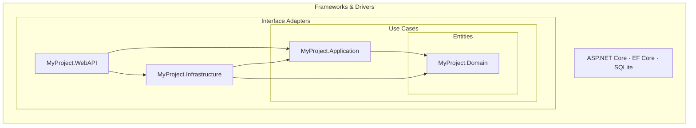
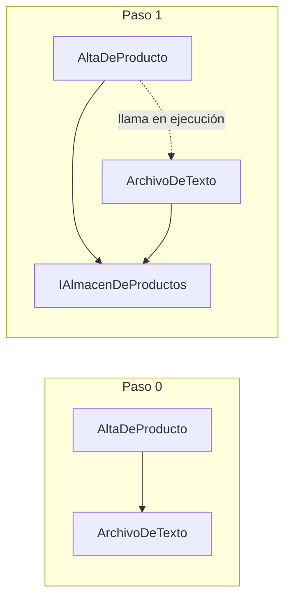
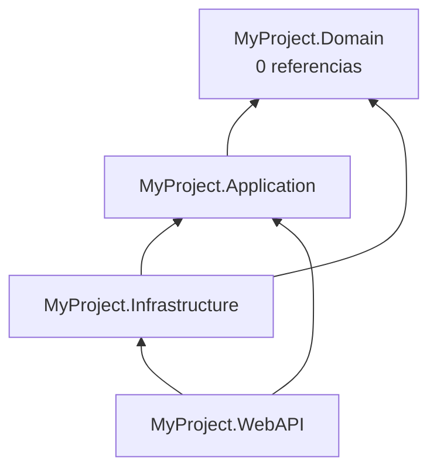
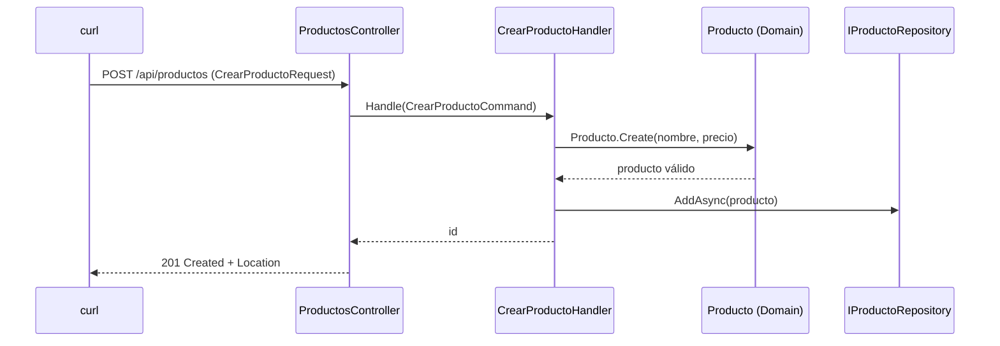
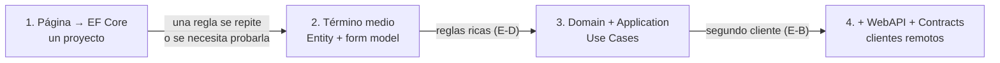

# Arquitectura de soluciones .NET

Guía de estudio para construir, capa por capa, una solución .NET organizada según la regla de dependencia de Clean Architecture, comprobar cada concepto con comandos reales y, al final, disponer de criterios para decidir qué estructura necesita un problema concreto. Todo lo que la guía muestra como salida de un comando fue ejecutado y está registrado; lo que no se ejecutó está rotulado.

## Índice

- **[0. Cómo usar esta guía](#0-cómo-usar-esta-guía)**: alcance, conocimientos previos, las dos maneras de leerla, el problema conductor y el entorno.
- ***Parte I — Fundamentos***
- **[1. Qué se está armando: solución, proyecto, referencia y paquete](#1-qué-se-está-armando-solución-proyecto-referencia-y-paquete)**: las piezas físicas de .NET y por qué una referencia tiene dirección.
- **[2. La regla de dependencia](#2-la-regla-de-dependencia)**: Clean Architecture, inversión e inyección de dependencias, y el esqueleto de cuatro proyectos.
- ***Parte II — Construcción: el ejemplo crece capítulo a capítulo***
- **[3. Domain: lo que es verdad en el negocio](#3-domain-lo-que-es-verdad-en-el-negocio)**: *Entities*, *Value Objects*, *Business Rules* e *Invariants*; dónde vive cada tipo de regla y cuándo una regla es una *Precondition*.
- **[4. Application: lo que quiere hacer el usuario](#4-application-lo-que-quiere-hacer-el-usuario)**: *Use Cases*, Command, Handler y *Repository*, pruebas sin base de datos y un *Use Case* con dos *Entities*.
- **[5. Infrastructure y WebAPI: el borde con el mundo](#5-infrastructure-y-webapi-el-borde-con-el-mundo)**: la API en marcha, el cambio de almacenamiento y los errores HTTP.
- **[6. Los clientes](#6-los-clientes)**: cómo consume la API una aplicación .NET y dónde nace `Contracts`.
- ***Parte III — Criterio: se puede abrir directamente***
- **[7. Cada objeto responde una pregunta](#7-cada-objeto-responde-una-pregunta)**: los siete tipos de objeto, cuándo existe cada uno, cómo se traduce el vocabulario de las clases planas de siempre y por qué no alcanza una sola clase.
- **[8. La estructura física y los nombres](#8-la-estructura-física-y-los-nombres)**: el árbol de la solución, las referencias permitidas y la convención de nombres.
- **[9. Del problema a la estructura](#9-del-problema-a-la-estructura-criterios-para-una-solución-real)**: mapa de entrada por escenario, escalera de opciones, evaluación de dependencias, la escalera en código, del dato a los *Use Cases*, y dos ejercicios de transferencia con respuesta diferida.
- **[Anexo A. Hoja de ruta del laboratorio](#anexo-a-hoja-de-ruta-del-laboratorio)**: los 25 pasos con su sección, su comando, lo que confirman y su captura, y las tres corridas de las variantes.
- **[Anexo B. Lista de verificación](#anexo-b-lista-de-verificación-para-diseñar-una-solución-nueva)**: las preguntas de §9 como plantilla para una solución nueva.
- **[Anexo C. Versiones, soporte y licencias](#anexo-c-versiones-soporte-y-licencias-verificadas)**: datos volátiles con fuente y fecha de consulta.
- **[Anexo D. Glosario](#anexo-d-glosario)**: cada término con su equivalente y la sección donde se define.
- **[Anexo E. Referencias](#anexo-e-referencias)**: fuentes citadas, en formato autor-fecha.

---

## 0. Cómo usar esta guía

### 0.1 Qué promete y qué no cubre

La guía enseña a organizar el código de una aplicación .NET en proyectos con responsabilidades separadas, a comprobar con el compilador que esa separación se respeta y a elegir cuánta separación necesita un caso real. El laboratorio construye y ejecuta un backend completo (dominio, Use Cases, persistencia con EF Core y una API HTTP) y un cliente de consola que lo consume.

Quedan fuera, y se tratan en otros documentos o en la bibliografía: microservicios (ver `Microservicios-Guide.md` en esta misma carpeta), despliegue e integración continua, la implementación completa de clientes Blazor y MAUI (se muestran como fragmentos ilustrativos, §6.5), la seguridad en profundidad y la enseñanza de C# desde cero.

### 0.2 Qué se supone que sabe quien lee

Se supone C# básico: qué es una clase, un método y una propiedad, y cómo se ejecuta un comando en una terminal. Todo lo demás —interfaces, `record`, constructores privados, `async`/`await`, peticiones HTTP, códigos de estado, JSON, bases de datos relacionales— se define la primera vez que aparece, y cada definición figura en el [Anexo D](#anexo-d-glosario).

### 0.3 Dos maneras de leerla

| Lectura | Recorrido | Para quién |
| --- | --- | --- |
| **Recorrido** | §1 → §9, ejecutando cada paso de laboratorio en orden | Quien estudia el tema por primera vez |
| **Consulta** | Directo a [§9.1](#91-mapa-de-entrada-dónde-está-el-problema) (mapa de entrada) y de ahí al capítulo que corresponda; [§7](#7-cada-objeto-responde-una-pregunta) para decidir qué clase usar | Quien ya diseña y necesita un criterio puntual |

En las Partes I y II el orden de cada capítulo es fijo: prerrequisitos, definiciones —cada una con la remisión al bloque de código que la materializa—, decisiones formuladas como pregunta —con la respuesta en una línea en negrita, su porqué y, cuando la pregunta admite más de una manera de resolverla, ejemplos que cumplen (✅) y que no cumplen (❌); cuando se responde con un experimento, el contraste lo da la salida registrada—, práctica y una pregunta de cierre sobre cuándo no aplica lo visto. Debajo de los bloques **[Compilado]** que materializan una definición, una tabla «línea → concepto» dice qué definición encarna cada línea. La Parte III no define: entra por una tabla (§7.1, §9.1), sigue con preguntas y termina en un criterio de una línea (§9.8) y en ejercicios (§9.7).

### 0.4 El problema conductor

Una **tienda** vende productos. Quien **administra el catálogo** da de alta productos con nombre y precio, y quien **compra** consulta la lista. Hay una sola [*Business Rule*](#32-cómo-se-reconoce-una-business-rule) al comienzo, y es una decisión de **esta** tienda para el laboratorio: un producto se da de alta con su precio, y el precio no puede ser cero ni negativo. Otra tienda puede recibir mercadería antes que la lista de precios; el [§3.7](#37-vale-siempre-o-solo-antes-de-una-acción-el-producto-sin-precio) muestra esa variante y qué cambia en el código. Más adelante aparecen clientes, pedidos y otras aplicaciones que consumen el catálogo.

La guía no resuelve ese problema de una sola manera, porque la estructura correcta depende del escenario. Estos son los cuatro que se usan en todo el documento:

| Escenario | Situación | Pregunta que plantea |
| --- | --- | --- |
| **E-A** | Una sola aplicación Blazor que corre en el servidor; operaciones de alta, baja, modificación y consulta con pocas reglas | ¿Hace falta separar en capas? |
| **E-B** | Una API HTTP con uno o más clientes .NET remotos (web, móvil, consola); si los clientes no son .NET, la estructura es la misma sin `Contracts` (§8.5, §9.1) | ¿Dónde vive lo que comparten la API y sus clientes? |
| **E-C** | Base de datos heredada, con un esquema fijo que no se puede cambiar | ¿La Entity puede mapear la tabla directamente? |
| **E-D** | Business Rules ricas que se repiten en varios lugares | ¿Dónde se escribe una regla para que no se duplique? |

Los escenarios describen situaciones, no estructuras: la estructura de partida de cada uno está en el [§9.1](#91-mapa-de-entrada-dónde-está-el-problema) y puede crecer sin que cambie el rótulo; en particular, E-A empieza con un solo proyecto y suma `Domain` y `Application` cuando aparecen reglas que proteger (§6.4 y §8.3 tratan ese caso). La guía construye la versión más completa de la solución —cuatro proyectos de backend, un contrato compartido y un cliente remoto— porque el enunciado incluye «otras aplicaciones que consumen el catálogo», que es la señal del escenario E-B. No es la estructura que conviene siempre: cada capítulo cierra con la pregunta de cuándo lo construido no hace falta, y el [§9.2](#92-la-escalera-de-opciones) ordena esas respuestas en una escalera de cuatro escalones, desde un solo proyecto hasta la API con clientes remotos. El problema se resuelve en [§9.5](#95-el-problema-conductor-resuelto).

### 0.5 Marcas de procedencia

| Marca | Significado |
| --- | --- |
| *Salida registrada: `capturas/Lnn-….txt`, SDK 10.0.400* | La salida mostrada es un extracto literal de una ejecución real, guardada en [`Examples/Dot-NET-Arquitectura-Lab/`](Examples/Dot-NET-Arquitectura-Lab/) junto a esta guía. Las salidas de las variantes (`Variantes/capturas/Vnn-….txt`) tienen el mismo formato |
| **[Compilado: `MyProject/src/…`]** | El bloque de código es un extracto textual del archivo indicado, que compiló en el laboratorio con cero advertencias. La ruta `MyProject/…` es la del código publicado en `Examples/Dot-NET-Arquitectura-Lab/` y coincide con la carpeta que se crea en L01. La ruta `Variantes/…` es la de un programa aparte, en [`Examples/Dot-NET-Arquitectura-Lab/Variantes/`](Examples/Dot-NET-Arquitectura-Lab/Variantes/), que muestra una alternativa al laboratorio sin modificarlo: no forma parte de `MyProject/` ni de `lab.sh`, compila con cero advertencias y lo ejecuta `variantes.sh` (§3.7, §4.10, §5.5) |
| **[Compilado sin captura: `Conceptos-DI/…`]** | Programa aparte que compiló con SDK 10.0.400 y cero advertencias y se ejecutó con `dotnet run`, pero que ningún guion corre y no tiene salida versionada (§2.2) |
| **[Fragmento ilustrativo: motivo]** | El bloque no forma parte del código final del laboratorio: o no se compiló, o se compiló solo para provocar un error y se eliminó, o es un programa aparte que ilustra un concepto; el motivo se declara. `[Fragmento ilustrativo: contraejemplo]` marca el código que muestra lo que **no** conviene hacer |
| **Criterio de esta guía** | Recomendación propia, no una norma ni un dato externo |
| [Autor, año](#anexo-e-referencias) | Afirmación respaldada por la fuente citada en el Anexo E |
| Tipo nombrado sin código | Los tipos que dan nombre a una definición se muestran en la sección donde se usan; los auxiliares (`DomainException`, `DependencyInjection.cs`, `ObtenerProductoPorIdHandler`…) se nombran sin código y su archivo completo está en [`Examples/Dot-NET-Arquitectura-Lab/MyProject/`](Examples/Dot-NET-Arquitectura-Lab/MyProject/), en la carpeta que indica su espacio de nombres (`MyProject.Domain.Productos` → `src/Backend/MyProject.Domain/Productos/`); se copia desde ahí antes de compilar el paso. Los archivos intermedios que un paso reemplaza (`InMemoryProductoRepository`, el `Program.cs` de L13, `Intento.cs`) no están en `MyProject/`: viven en `lab.sh`, con el número de línea indicado donde se los nombra |

Qué recorta un extracto: los bloques de salida omiten líneas que no hacen al punto (encabezados HTTP, avisos de restauración) y acortan las rutas absolutas con `...`; una línea larga puede partirse en dos con sangría; una línea `...` sola marca líneas quitadas dentro de un bloque. Nunca se altera el texto de una línea mostrada. Los bloques **[Compilado]** omiten la declaración de la clase, los `using` y los miembros que no hacen al punto, y no reescriben ninguna expresión.

Los pasos marcados con ⚠ en el [Anexo A](#anexo-a-hoja-de-ruta-del-laboratorio) conviene **predecirlos antes de ejecutarlos**: escribir qué va a pasar y después comparar.

### 0.6 Preparar el entorno (L00)

El laboratorio usa el SDK de .NET 10, la versión con soporte de largo plazo vigente ([Microsoft, 2026a](#ref-microsoft-2026a)). Hay dos formas de tenerlo: instalarlo desde `dotnet.microsoft.com`, o usar la imagen oficial de contenedor sin instalar nada:

```bash
docker run --rm -it -v "$PWD":/w -w /w mcr.microsoft.com/dotnet/sdk:10.0 bash
dotnet --info
```

Lo que importa de la salida es la primera sección:

```text
.NET SDK:
 Version:           10.0.400
 ...
Host:
  Version:      10.0.11
```

*Salida registrada: `capturas/L00-entorno.txt`, SDK 10.0.400.* La línea `Version` del SDK es la de la herramienta que compila; la del `Host` es la del runtime que ejecuta. **Qué puede cambiar en tu equipo:** el número de parche (`10.0.4xx`, `10.0.1x`) y el sistema operativo. Cualquier SDK `10.0.*` reproduce el laboratorio ejecutando `lab.sh` o los comandos de cada paso, porque L01 genera `global.json` con la versión instalada. El `MyProject/` publicado junto a esta guía fija `10.0.400` con `rollForward: latestFeature`, que acepta esa banda de características o una superior ([Microsoft, 2026k](#ref-microsoft-2026k)); con un SDK `10.0.1xx`–`10.0.3xx` hay que editar `version` en `global.json` antes de compilarlo. El guion completo, que ejecuta los 25 pasos y verifica cada resultado, está en `Examples/Dot-NET-Arquitectura-Lab/lab.sh`.

---

## 1. Qué se está armando: solución, proyecto, referencia y paquete

*Prerrequisitos: §0.6.*

### 1.1 Definiciones

Todos estos términos se ven en los comandos y la salida de §1.2: cada viñeta remite a la línea donde aparece.

- **SDK y CLI `dotnet`.** El SDK (*software development kit*) es el conjunto de herramientas que crea, compila, prueba y ejecuta código .NET. Se usa a través de un único comando, `dotnet`, la interfaz de línea de comandos (CLI). → §0.6, `dotnet --info`; §1.2, `dotnet new`, `dotnet build`.
- **Proyecto.** Un archivo `.csproj` y los archivos de código de su carpeta. Es la **unidad de compilación**: `dotnet build` convierte cada proyecto en un **ensamblado**, un archivo `.dll` con el código compilado. → §1.2, `MyProject.Domain -> .../MyProject.Domain.dll`.
- **Solución.** Un archivo que enumera proyectos para trabajar con ellos juntos. No compila nada por sí mismo. Con el SDK 10, `dotnet new sln` crea un archivo `.slnx`, en formato XML (L01); el formato anterior es `.sln`. → §1.2, `dotnet new sln -n MyProject`; §8.1, `MyProject.slnx`.
- **Referencia de proyecto.** Una línea `<ProjectReference>` en un `.csproj` que dice «este proyecto puede usar los tipos públicos de aquel». Es la forma física de una **dependencia** entre partes del código. → §1.2, `dotnet add … reference …`; §1.5, `<ProjectReference Include="..\MyProject.Infrastructure\…" />`.
- **Paquete NuGet.** Código de terceros distribuido como archivo `.nupkg` desde `nuget.org`. Se declara con `<PackageReference>` y es una dependencia hacia afuera de la solución. → §5.3, `dotnet add … package Microsoft.EntityFrameworkCore.Sqlite` (`MyProject.Infrastructure.csproj`).
- **Espacio de nombres (*namespace*).** Nombre lógico que agrupa tipos (`MyProject.Domain.Productos`). Por convención coincide con el proyecto y la carpeta, pero **no crea ninguna dependencia**: eso lo hace solo la referencia. → §1.4, `using MyProject.Infrastructure.Persistence;` sin referencia (CS0234); §6.3, `MyProject.Contracts` cambia de proyecto sin cambiar de nombre.
- **Plantilla.** Punto de partida que usa `dotnet new` para generar un proyecto: `classlib` (biblioteca de clases), `webapi`, `console`, `xunit`, entre otras. → §1.2, `dotnet new classlib`; §2.7, `dotnet new webapi --use-controllers`; §4.6, `dotnet new xunit`.

### 1.2 Crear una solución con dos proyectos (L01, L02)

```bash
mkdir MyProject && cd MyProject      # todo el laboratorio se ejecuta desde esta carpeta
dotnet new sln -n MyProject
dotnet new globaljson --sdk-version "$(dotnet --version)" --roll-forward latestFeature
dotnet new classlib -n MyProject.Domain -o src/Backend/MyProject.Domain
dotnet new classlib -n MyProject.Infrastructure -o src/Backend/MyProject.Infrastructure
dotnet sln add src/Backend/MyProject.Domain src/Backend/MyProject.Infrastructure
dotnet add src/Backend/MyProject.Infrastructure reference src/Backend/MyProject.Domain
dotnet list src/Backend/MyProject.Infrastructure reference
dotnet build
```

`global.json` fija la versión del SDK con la que se trabaja, para que todas las personas del equipo compilen con la misma herramienta. El resto de la salida confirma cada paso:

```text
Reference `..\MyProject.Domain\MyProject.Domain.csproj` added to the project.
Project reference(s)
--------------------
../MyProject.Domain/MyProject.Domain.csproj
  MyProject.Domain -> .../src/Backend/MyProject.Domain/bin/Debug/net10.0/MyProject.Domain.dll
  MyProject.Infrastructure -> .../bin/Debug/net10.0/MyProject.Infrastructure.dll
Build succeeded.
    0 Warning(s)
    0 Error(s)
```

*Salida registrada: `capturas/L01-nueva-solucion.txt` y `capturas/L02-dos-proyectos.txt`, SDK 10.0.400.* Cómo leerla: hay un `.dll` por proyecto, y el orden de compilación no es casual: `Domain` se compila antes porque `Infrastructure` lo necesita. Desde el SDK 10 los comandos de referencias y de paquetes tienen además una forma con el sustantivo primero (`dotnet reference add`, `dotnet package add`), que Microsoft recomienda para guiones y documentación; son alias de la forma usada aquí, que es la que se ejecutó en el laboratorio ([Microsoft, 2026b](#ref-microsoft-2026b)).

### 1.3 ¿Por qué una referencia es una flecha con dirección?

**Respuesta: porque el compilador deja usar los tipos del proyecto referenciado, y nunca al revés.**

`Infrastructure → Domain` significa que el código de `Infrastructure` puede nombrar clases de `Domain`. El compilador de `Domain`, en cambio, no sabe que `Infrastructure` existe. Esa asimetría es la herramienta con la que se construye toda la arquitectura de esta guía: decidir **quién puede conocer a quién** se reduce a decidir hacia dónde apuntan las flechas.

### 1.4 ¿Alcanza con escribir `using` para usar otro proyecto? (L03)

⚠ **Antes de ejecutar L03, anotá:** ¿compila? Si no, ¿quién emite el error (el compilador de C#, `CS`, o MSBuild, `MSB`) y qué dice?

**Respuesta: no. `using` abrevia nombres que el proyecto ya puede ver; no agrega nada que no pueda ver.**

El paso crea primero, en `src/Backend/MyProject.Infrastructure/Persistence/ConexionSql.cs`, una clase vacía que simula el acceso a datos (`public class ConexionSql { public void Ejecutar(string sql) { } }`, en el espacio de nombres `MyProject.Infrastructure.Persistence`), y después escribe en `src/Backend/MyProject.Domain/Producto.cs` una clase que la usa, sin referencia en esa dirección:

**[Fragmento ilustrativo: compilado en L03 para provocar el error; los dos archivos se eliminan en L05.]**

```csharp
using MyProject.Infrastructure.Persistence;

namespace MyProject.Domain;

public class Producto
{
    public string Nombre { get; set; } = "";

    public void Guardar(ConexionSql conexion) =>
        conexion.Ejecutar($"INSERT INTO Productos VALUES ('{Nombre}')");
}
```

```text
Producto.cs(1,17): error CS0234: The type or namespace name 'Infrastructure' does not exist
    in the namespace 'MyProject' (are you missing an assembly reference?)
Producto.cs(9,25): error CS0246: The type or namespace name 'ConexionSql' could not be found
    (are you missing a using directive or an assembly reference?)
Build FAILED.
```

*Salida registrada: `capturas/L03-using-sin-referencia.txt`, SDK 10.0.400.* Cómo leerla: el primer error dice que, **para `Domain`**, el espacio de nombres `MyProject.Infrastructure` no existe, aunque la carpeta esté al lado y el nombre empiece igual. El segundo es consecuencia del primero. El número entre paréntesis es (línea, columna). La pista está al final de ambos mensajes: *assembly reference*.

### 1.5 ¿Qué pasa si dos proyectos se referencian mutuamente? (L04, L05)

⚠ **Antes de ejecutar L04, anotá:** ¿el comando que agrega la segunda referencia falla, o falla el `dotnet build`? ¿Con qué código de salida cada uno?

**Respuesta: el comando que agrega la referencia la acepta; el error aparece recién al compilar.**

| Acción | Salida | Código de salida |
| --- | --- | --- |
| `dotnet add src/Backend/MyProject.Domain reference src/Backend/MyProject.Infrastructure` | ``Reference `..\MyProject.Infrastructure\MyProject.Infrastructure.csproj` added to the project.`` | 0 |
| `dotnet build` | `error MSB4006: There is a circular dependency in the target dependency graph involving target "_GenerateRestoreProjectPathWalk".` | 1 |

*Salida registrada: `capturas/L04-ciclo-agregar.txt` y `capturas/L04-ciclo-compilar.txt`, SDK 10.0.400.* El error no lo emite el compilador de C# (sus códigos empiezan con `CS`) sino MSBuild (`MSB`), el motor que ordena la compilación, y aparece en la fase de restauración que corre antes de compilar (la captura lo ubica en `NuGet.targets`): al recorrer el grafo de proyectos encuentra que cada uno necesita al otro y no puede decidir cuál va primero.

Deshacer el ciclo (L05) deja una segunda lección sobre leer salidas. El comando inverso de `add … reference` es `dotnet remove <proyecto> reference <referencia>`. Con la ruta de la carpeta, **no encuentra** la referencia y aun así termina con código 0:

```bash
dotnet remove src/Backend/MyProject.Domain reference src/Backend/MyProject.Infrastructure
```

```text
Project reference `../../MyProject.Infrastructure/MyProject.Infrastructure.csproj` could not be found.
código: 0
4:    <ProjectReference Include="..\MyProject.Infrastructure\MyProject.Infrastructure.csproj" />
```

Con la ruta al archivo `.csproj` la quita (`Project reference … removed.`); después se borran los dos archivos de L03 y la solución vuelve a compilar:

```bash
dotnet remove src/Backend/MyProject.Domain reference src/Backend/MyProject.Infrastructure/MyProject.Infrastructure.csproj
rm src/Backend/MyProject.Domain/Producto.cs src/Backend/MyProject.Infrastructure/Persistence/ConexionSql.cs
dotnet build
```

*Salida registrada: `capturas/L05-quitar-con-carpeta.txt` y `capturas/L05-quitar-con-csproj.txt`, SDK 10.0.400.* Regla práctica: **leer el mensaje, no solo el código de salida**, y pasar la ruta al `.csproj` para quitar una referencia.

### 1.6 Pregunta de cierre

**¿Cuándo no hace falta más de un proyecto?** Cuando nada en el código necesita estar protegido de otra parte: un prototipo, un script, una aplicación del escenario E-A con pocas reglas. Un proyecto solo impide lo que su referencia no permite; si no hay nada que impedir, un segundo proyecto no aporta. El [§2.3](#23-qué-cambia-al-partir-un-proyecto-en-capas-l06-l07) muestra qué se pierde con esa decisión.

---

## 2. La regla de dependencia

*Prerrequisitos: §1.1, §1.3.*

### 2.1 Definiciones

- **Dependencia.** El código A depende de B si A no compila o no funciona sin B. En .NET, entre proyectos, se declara con una referencia (§1.1).
- **Interfaz.** Tipo de C# que declara métodos sin implementarlos (`interface IProductoRepository`). Quien la usa depende de la declaración, no de una implementación concreta.
- **Regla de dependencia.** Principio de Clean Architecture: las dependencias del código fuente apuntan solo hacia adentro, hacia las políticas de mayor nivel; nada de un círculo interior puede nombrar algo de un círculo exterior ([Martin, 2012](#ref-martin-2012)).
- **Inversión de dependencias.** Cuando el código de adentro necesita algo de afuera (guardar datos), declara una interfaz adentro y la implementación vive afuera. La flecha del código queda apuntando hacia adentro aunque la llamada vaya hacia afuera ([Martin, 2012](#ref-martin-2012)).
- **Inyección de dependencias (DI).** Mecanismo por el cual un **contenedor** entrega a cada clase las implementaciones de las interfaces que pide en su constructor. En ASP.NET Core viene incluido (`builder.Services`).
- **Composition root.** El único lugar del programa que conoce todas las piezas y registra en el contenedor qué implementación corresponde a cada interfaz. En esta guía es `Program.cs` de la WebAPI. → §2.5, `Program.cs`, l. 14–18; el ciclo de vida de cada registro, en la tabla que lo sigue.

Martin describe cuatro círculos. Su correspondencia con los proyectos de la guía es esta, y el anidamiento de los círculos expresa **dependencia, no ubicación**: los proyectos son hermanos en disco y en espacios de nombres; la cebolla existe solo en sus referencias.

| Círculo ([Martin, 2012](#ref-martin-2012)) | Proyecto | Contiene |
| --- | --- | --- |
| Entities | `MyProject.Domain` | Entities, Value Objects, reglas, interfaces de Repository |
| Use Cases | `MyProject.Application` | Use Cases, mensajes, modelos de lectura |
| Interface Adapters | `MyProject.Infrastructure`, controllers de `MyProject.WebAPI` | Repositories, configuración de EF Core, controllers |
| Frameworks & Drivers | Bibliotecas externas: ASP.NET Core, EF Core, SQLite | Lo que se usa, no se escribe |

Los términos de la columna «Contiene» se definen en el capítulo de su proyecto: Entity y Value Object en §3.1; Use Case, mensaje, modelo de lectura y Repository en §4.1; controller y EF Core en §5.1. Por ahora alcanza con saber que **EF Core** es la biblioteca de Microsoft que guarda objetos de C# en una base de datos, y que **ASP.NET Core** es el marco de Microsoft para construir aplicaciones web y API HTTP en .NET.



*Diagrama 2.1. Leyenda: cada caja contenida en otra es un círculo interior; línea continua = `ProjectReference`, siempre hacia adentro.*

### 2.2 Los tres conceptos en un programa de consola

*Los tres pasos son **[Compilado sin captura: [`Conceptos-DI/Paso0`, `Paso1`, `Paso2/Program.cs`](Examples/Dot-NET-Arquitectura-Lab/Conceptos-DI/)]**: programas de consola aparte, que compilaron con SDK 10.0.400 y cero advertencias y se ejecutaron con `dotnet run`; ningún guion los corre. Omiten las líneas que solo imprimen el resultado.*

Antes de llevarlos a proyectos, los tres conceptos caben en un archivo. El ejemplo tiene una *Business Rule* (el precio es mayor a cero; §3.2) y un detalle técnico (guardar en un archivo de texto). «Adentro» y «afuera» son aquí comentarios, no proyectos: el compilador todavía no los hace cumplir; eso llega en el §2.3. Cada paso resuelve el problema que deja el anterior.

**Paso 0 — Sin inversión: la regla nombra el detalle.**

```csharp
// Adentro: la regla del negocio.
class AltaDeProducto
{
    public void Ejecutar(string nombre, decimal precio)
    {
        if (precio <= 0)
            throw new InvalidOperationException("El precio debe ser mayor a cero.");

        var archivo = new ArchivoDeTexto();   // la regla nombra un detalle de afuera
        archivo.Guardar(nombre, precio);
    }
}

// Afuera: un detalle técnico.
class ArchivoDeTexto
{
    public void Guardar(string nombre, decimal precio) =>
        File.AppendAllText("productos.txt", $"{nombre};{precio}\n");
}
```

Funciona, pero `AltaDeProducto` escribe `new ArchivoDeTexto()`: el código de adentro nombra algo de afuera, que es exactamente lo que prohíbe la **regla de dependencia**. El costo es concreto: guardar en una base obliga a editar la clase que tiene la regla, y probar que el precio cero se rechaza escribe en el disco. Una salvedad que vale para los tres pasos: el `if` del precio está en `AltaDeProducto`, la clase que ejecuta la operación, para que «adentro» sea una sola clase; el §3 lleva esa regla al objeto que conoce el dato (`Producto.Create`) y el §4.3 explica por qué no debe quedar en la clase que ejecuta el caso.

**Paso 1 — Inversión: la regla declara lo que necesita.**

```csharp
var alta = new AltaDeProducto(new ArchivoDeTexto());   // composition root: el único que conoce las dos piezas
alta.Ejecutar("Mate", 3500m);

var prueba = new AltaDeProducto(new AlmacenEnMemoria()); // en una prueba: sin disco
prueba.Ejecutar("Yerba", 4200m);

// Adentro: la regla y la interfaz que declara lo que la regla necesita.
interface IAlmacenDeProductos
{
    void Guardar(string nombre, decimal precio);
}

class AltaDeProducto
{
    private readonly IAlmacenDeProductos _almacen;

    public AltaDeProducto(IAlmacenDeProductos almacen) => _almacen = almacen;

    public void Ejecutar(string nombre, decimal precio)
    {
        if (precio <= 0)
            throw new InvalidOperationException("El precio debe ser mayor a cero.");

        _almacen.Guardar(nombre, precio);   // llama hacia afuera sin nombrar nada de afuera
    }
}

// Afuera: implementa la interfaz de adentro.
class ArchivoDeTexto : IAlmacenDeProductos
{
    public void Guardar(string nombre, decimal precio) =>
        File.AppendAllText("productos.txt", $"{nombre};{precio}\n");
}
```

`AlmacenEnMemoria` es otra implementación de la misma interfaz que guarda en una lista; su código completo está en la carpeta del ejemplo. Ahora `AltaDeProducto` nombra solo a `IAlmacenDeProductos`, que está adentro, y es `ArchivoDeTexto` el que nombra algo de adentro al escribir `: IAlmacenDeProductos`. En ejecución la llamada sigue yendo de la regla al archivo; en el código, la flecha va del archivo a la regla. Esa es la **inversión**: la dependencia del código apunta al revés que la llamada.



*Diagrama 2.2. Línea continua = «este tipo nombra a aquel en su código»; línea punteada = llamada en ejecución. En el paso 0 las dos coinciden; en el paso 1 la continua que llega a `ArchivoDeTexto` desaparece y la punteada queda.*

Quién declara la interfaz importa tanto como que exista. La declara quien la necesita, con sus palabras: `Guardar(nombre, precio)`, no `EscribirLinea(string)`. Si la interfaz viviera afuera, junto al archivo, la regla tendría que nombrar algo de afuera para usarla, y no se habría invertido nada (§2.4).

**Paso 2 — Inyección: alguien tiene que hacer el `new`.**

El paso 1 deja una consecuencia: `AltaDeProducto` ya no puede crear su almacén, porque para escribir `new ArchivoDeTexto()` tendría que nombrarlo. Entonces lo **recibe** en el constructor, ya creado, en lugar de ir a buscarlo. Recibir la dependencia desde afuera en lugar de crearla es la **inyección**. En el paso 1 la hacen a mano las primeras líneas del programa; con eso alcanza cuando las piezas son pocas. Cuando son muchas, un **contenedor** lo automatiza:

```csharp
using Microsoft.Extensions.DependencyInjection;

var services = new ServiceCollection();
services.AddSingleton<IAlmacenDeProductos, ArchivoDeTexto>();   // «cuando pidan la interfaz, entregá esto»
services.AddTransient<AltaDeProducto>();

using var provider = services.BuildServiceProvider();
var alta = provider.GetRequiredService<AltaDeProducto>();       // el contenedor hace los new
alta.Ejecutar("Mate", 3500m);
```

El contenedor lee el constructor de `AltaDeProducto`, ve que pide un `IAlmacenDeProductos`, busca qué se registró para esa interfaz, crea un `ArchivoDeTexto` y se lo pasa. Las clases de adentro no cambian respecto del paso 1. En una consola hace falta el paquete `Microsoft.Extensions.DependencyInjection`; en ASP.NET Core ya viene incluido y `builder.Services` es una colección del mismo tipo (`IServiceCollection`), donde se registra igual. Las líneas que registran son el **composition root** (§2.5); `AddSingleton` y `AddTransient` son dos de los tres ciclos de vida que el §2.5 define.

Los tres conceptos se confunden porque suelen aparecer juntos, pero responden preguntas distintas y uno puede estar sin los otros:

| Concepto | Pregunta que responde | Se puede tener sin los otros |
| --- | --- | --- |
| Regla de dependencia | ¿Quién puede nombrar a quién? | Es la meta. Mientras adentro no necesite nada de afuera, se cumple sin interfaces ni contenedor: `Producto` en §3 no usa ninguna |
| Inversión de dependencias | ¿Dónde se declara la interfaz? | Sí, sin contenedor: el paso 1 invierte y arma las piezas con `new` a mano |
| Inyección de dependencias | ¿Quién crea la implementación y se la entrega? | Sí, sin inversión: registrar `services.AddSingleton<ArchivoDeTexto>()` y pedir `ArchivoDeTexto` en el constructor es inyectar, pero la regla sigue nombrando el detalle y la regla de dependencia sigue rota |

### 2.3 ¿Qué cambia al partir un proyecto en capas? (L06, L07)

⚠ **Antes de ejecutar L07, anotá:** el mismo código que compiló en L06, repartido en dos proyectos, ¿compila? ¿Qué errores esperás y en qué proyecto?

**Respuesta: la regla deja de ser una intención y pasa a ser un error de compilación.**

En L06 la clase `Producto` y la clase de acceso a datos `ConexionSql` están en el mismo proyecto, `TodoJunto`. La Entity llama a la base directamente y **compila sin advertencias** (`Build succeeded`, *salida registrada: `capturas/L06-todo-junto.txt`, SDK 10.0.400*): nada impide mezclar Business Rules con SQL. En L07 el mismo código se reparte entre `MyProject.Domain` y `MyProject.Infrastructure`, y el uso se vuelve imposible con los mismos `CS0234` y `CS0246` de L03 (*salida registrada: `capturas/L07-separado.txt`, SDK 10.0.400*).

| | |
| --- | --- |
| ✅ | La Entity no nombra ningún tipo de persistencia, y el compilador lo garantiza porque `Domain` no tiene referencias |
| ❌ | «Por convención, las Entities no usan la base»: sin un proyecto aparte, la convención depende de la memoria del equipo |
| ❌ | Separar en carpetas dentro de un mismo proyecto: una carpeta no restringe nada (§8.2) |

### 2.4 ¿Por qué Infrastructure depende de Domain, si es el dominio el que necesita guardar?

**Respuesta: porque el dominio declara lo que necesita como interfaz, e Infrastructure lo implementa.**

`Domain` declara `IProductoRepository` («necesito guardar y recuperar productos») sin saber cómo se hace. `Infrastructure` referencia a `Domain` e implementa esa interfaz con EF Core. En ejecución la llamada va de adentro hacia afuera; en el código fuente la flecha va de afuera hacia adentro. Esa es la inversión de dependencias, y es la razón por la cual en el §5.3 se reemplaza el almacenamiento sin recompilar `Domain`.

| | |
| --- | --- |
| ✅ | `IProductoRepository` en `Domain`, `ProductoRepository` en `Infrastructure` |
| ❌ | `IProductoRepository` en `Infrastructure`: `Domain` tendría que referenciarlo para usarla y se forma el ciclo de L04 |
| ❌ | `Producto.Guardar(ConexionSql)`, como en L03: la Entity conoce la base |

### 2.5 ¿Por qué la WebAPI referencia Infrastructure, si «no debería conocerla»?

**Respuesta: la conoce solo para registrar en el contenedor qué implementación usar; no la llama.**

`Program.cs` es el composition root: alguien tiene que decir «cuando se pida `IProductoRepository`, entregá `ProductoRepository`». Los controllers y los Use Cases piden la interfaz. El paso L17 lo comprueba buscando la palabra `Infrastructure` en el código de la WebAPI: aparece solo en `Program.cs`. Así queda al final del laboratorio (L16 en adelante):

**[Compilado: `MyProject/src/Backend/MyProject.WebAPI/Program.cs`, l. 14–18]**

```csharp
// Composition root: cambió la implementación del repositorio; Domain y Application no se tocaron.
builder.Services.AddInfrastructure(builder.Configuration.GetConnectionString("MyProject") ?? "Data Source=myproject.db");
builder.Services.AddScoped<CrearProductoHandler>();
builder.Services.AddScoped<ObtenerProductosHandler>();
builder.Services.AddScoped<ObtenerProductoPorIdHandler>();
```

| Línea o miembro | Concepto | Dónde se define |
| --- | --- | --- |
| `builder.Services` | El contenedor de ASP.NET Core: la `IServiceCollection` de §2.2, paso 2 | §2.1 |
| `AddInfrastructure(...)` | El único punto donde la WebAPI nombra a `Infrastructure`; adentro registra `AddDbContext` y `AddScoped<IProductoRepository, ProductoRepository>` (`DependencyInjection.cs`) | §2.5, §5.3 |
| `AddScoped<CrearProductoHandler>()` | Inyección: el contenedor crea el handler y le entrega el `IProductoRepository` que pide | §2.1, §4.5 |

Cada registro fija además un **ciclo de vida** (*lifetime*): cuántas instancias crea el contenedor y cuánto duran. Son tres, y en el laboratorio se ven los tres:

| Ciclo de vida | Cuántas instancias | En el laboratorio |
| --- | --- | --- |
| `AddSingleton` | Una para todo el programa | `InMemoryProductoRepository` en L13 (`lab.sh`): el diccionario tiene que sobrevivir a la petición, o el `GET` de L15 devolvería `[]`; `ArchivoDeTexto` en §2.2; `TimeProvider.System` en la variante de §4.10 |
| `AddScoped` | Una por *scope*; en ASP.NET Core, por petición HTTP | `AddDbContext` (Scoped por defecto: una sesión con la base por petición), `ProductoRepository` y los handlers, que comparten ese `DbContext` |
| `AddTransient` | Una por cada vez que alguien la pide | `AltaDeProducto` en §2.2 |

La regla práctica: un handler que recibe un `DbContext` no puede ser Singleton, porque retendría una sesión con la base para siempre; el Repository en memoria de L13 no puede ser Scoped, porque perdería los datos al terminar la petición.

### 2.6 ¿Qué se gana y qué se paga?

**Respuesta: se gana poder cambiar y probar cada parte por separado; se paga con más proyectos y más traducciones entre objetos.**

| Se gana | Se paga |
| --- | --- |
| Business Rules que se prueban sin base de datos ni HTTP (§4.6) | Cuatro proyectos donde antes había uno |
| Cambiar el almacenamiento sin tocar el dominio (§5.3) | Objetos que se parecen y se copian entre capas (§7) |
| Errores de diseño que el compilador detecta (§2.3) | Más conceptos que aprender antes de ser productivo |

Si el problema no tiene reglas que proteger ni partes que vayan a cambiar, el costo supera al beneficio. El [§9](#9-del-problema-a-la-estructura-criterios-para-una-solución-real) da las señales para decidir.

### 2.7 El esqueleto del backend (L08)

```bash
dotnet new classlib -n MyProject.Application -o src/Backend/MyProject.Application
dotnet new webapi --use-controllers --no-https -n MyProject.WebAPI -o src/Backend/MyProject.WebAPI
dotnet sln add src/Backend/MyProject.Application src/Backend/MyProject.WebAPI
dotnet add src/Backend/MyProject.Application reference src/Backend/MyProject.Domain
dotnet add src/Backend/MyProject.Infrastructure reference src/Backend/MyProject.Application
dotnet add src/Backend/MyProject.WebAPI reference src/Backend/MyProject.Application src/Backend/MyProject.Infrastructure
dotnet build
```

`--use-controllers` genera la API con clases controller (la plantilla, sin esa opción, usa *minimal APIs*); `--no-https` evita configurar certificados en el laboratorio. De la plantilla se borran `Class1.cs` y el ejemplo `WeatherForecast`. El listado de referencias de cada proyecto es el grafo real de la solución:

```text
== MyProject.Domain
There are no Project to Project references in project src/Backend/MyProject.Domain.
== MyProject.Application
../MyProject.Domain/MyProject.Domain.csproj
== MyProject.Infrastructure
../MyProject.Domain/MyProject.Domain.csproj
../MyProject.Application/MyProject.Application.csproj
== MyProject.WebAPI
../MyProject.Application/MyProject.Application.csproj
../MyProject.Infrastructure/MyProject.Infrastructure.csproj
Build succeeded.
    0 Warning(s)
```

*Salida registrada: `capturas/L08-esqueleto.txt`, SDK 10.0.400.*



*Diagrama 2.3. Grafo de referencias de L08. Línea continua = `ProjectReference`. Ninguna flecha sale de `Domain`.*

`Infrastructure` referencia también a `Application` para poder implementar las interfaces de servicios técnicos (§4.1) que una solución real declara en esa capa; la variante de §4.10 tiene una, `IUnitOfWork`, y su `AppDbContext` la implementa. En el laboratorio esa referencia queda declarada pero sin uso: ningún archivo de `Infrastructure` nombra un tipo de `Application` (se comprueba con `grep -rn Application src/Backend/MyProject.Infrastructure --include=*.cs`, que no devuelve nada), porque el ejemplo no llega a necesitar un servicio técnico. Con el criterio del §9.8, en una solución real esa flecha se agrega cuando aparece la primera interfaz que la necesita. Las referencias de .NET son **transitivas**: la WebAPI puede usar tipos de `Domain` sin referenciarlo, porque lo alcanza a través de `Application`. El §8.2 explica cómo cortarlo si hiciera falta.

### 2.8 Pregunta de cierre

**¿Cuándo no conviene la regla de dependencia completa?** En el escenario E-A, con una sola aplicación y pocas reglas, el esquema página → servicio → EF Core en un único proyecto es una arquitectura legítima (§9.2). La regla empieza a pagar cuando aparecen reglas que proteger (E-D) o una segunda forma de acceder a los mismos datos (E-B). En la escalera del §9.2, adoptar la regla completa es subir del escalón 1 al 3.

---

## 3. Domain: lo que es verdad en el negocio

*Prerrequisitos: §2.1, §2.7.*

### 3.1 Definiciones

Todos estos términos se ven en los tres bloques de §3.3 (`Producto.cs`, `Dinero.cs`, `IProductoRepository.cs`) y en la prueba que los acompaña; cada viñeta remite a la línea que lo materializa, y la tabla debajo de cada bloque hace el camino inverso.

- **Entity.** Objeto del negocio con **identidad** propia (un `Id`) que se conserva aunque cambien sus datos, y con **comportamiento**: métodos que aplican las reglas ([Evans, 2015](#ref-evans-2015)). `Producto` es una *Entity*. Los términos de la literatura (*Entity*, *Value Object*, *Business Rule*, *Invariant*, *Use Case*…) se escriben en inglés, en cursiva la primera vez, y no se traducen; el [Anexo D](#anexo-d-glosario) da su equivalente en castellano. → §3.3, `Producto.cs`: `public Guid Id { get; private set; }` y `Desactivar()`.
- **Business Rule.** Condición o procedimiento que el negocio impone por sus propias razones y que valdría aunque no hubiera software que lo ejecute ([Martin, 2017](#ref-martin-2017)): «no se vende un producto sin precio». El §3.2 da el criterio para reconocerla y el §3.6 la clasifica. → §3.3, `Producto.cs`: `if (precio <= 0) throw new DomainException(...)`.
- **Invariant.** *Business Rule* que se verifica mirando un solo objeto y que tiene que cumplirse **siempre**, desde que el objeto se crea: en el laboratorio, «el precio es mayor a cero». → §3.3, `Producto.cs`, la misma guarda dentro de `Create`; §3.7, `AsignarPrecio`.
- **Precondition y Postcondition.** Lo que tiene que ser cierto antes de ejecutar un método y lo que el método garantiza al terminar ([Meyer, 1988](#ref-meyer-1988)). Una regla que vale solo antes de una acción —«no se vende sin precio»— es la *Precondition* de esa acción, no una *Invariant* (§3.7). → §3.7, `PrecioDeVenta()`; la *Postcondition* de `Create` está escrita como prueba: §3.3, `ProductoTests.cs`, `Assert.True(producto.Activo)`.
- **Factory Method.** Método `static` que crea instancias y es el único camino para hacerlo, porque el constructor es privado. Evans describe la *Factory* como la operación que crea el objeto o el agregado entero haciendo cumplir sus *Invariants* ([Evans, 2015](#ref-evans-2015)), que es lo que hace `Create` con un método estático en lugar del constructor. (En el catálogo de [Gamma et al., 1994](#ref-gamma-1994) *Factory Method* designa otro patrón, basado en subclases.) → §3.3, `Producto.cs`: `private Producto() { }` + `public static Producto Create(string nombre, decimal precio)`.
- **Value Object.** Objeto **sin identidad**: dos *Value Objects* con los mismos datos son el mismo valor, «like money or a date range, whose equality isn't based on identity» ([Fowler, 2002](#ref-fowler-2002); [Evans, 2015](#ref-evans-2015)). `Dinero(10, "ARS")` es igual a otro `Dinero(10, "ARS")`. En C# se modelan bien con `record`, un tipo cuya igualdad compara los datos miembro a miembro en lugar de la referencia. → §3.3, `Dinero.cs`: `public record Dinero(decimal Monto, string Moneda)`; la igualdad, en `ProductoTests.cs`.
- **Excepción de dominio.** Tipo de excepción propio (`DomainException`) que señala que una operación violaría una regla del negocio, para distinguirla de un error técnico. → §3.3, `Producto.cs`, `throw new DomainException(...)`; §5.6, quien la traduce a HTTP.
- **Setter privado.** `{ get; private set; }`: la propiedad se lee desde cualquier lugar y se modifica solo desde dentro de la clase. → §3.3, `Producto.cs`, `public decimal Precio { get; private set; }`; §3.4, el error CS0200 que lo prueba.
- **`Guid`.** Identificador único global: un número de 128 bits que .NET genera con `Guid.NewGuid()` y que sirve como `Id` sin necesidad de que una base de datos lo asigne. → §3.3, `Producto.cs`, `Id = Guid.NewGuid()`.
- **`CancellationToken`.** Parámetro que reciben las operaciones que esperan (base de datos, red) para poder interrumpirse si quien las pidió ya no espera el resultado, por ejemplo porque el cliente cerró la conexión. En esta guía se llama `ct` y `= default` permite omitirlo. → §3.3, `IProductoRepository.cs`, `CancellationToken ct = default`; §5.2, el `ct` que el controller recibe del framework y pasa al handler.

> **Nombres.** Los términos de arquitectura y de patrones van en inglés y dan el sufijo (`Repository`, `Handler`, `Command`, `Exception`); los conceptos del problema van en español (`Producto`, `Dinero`, `Crear…`). Las operaciones estándar de un patrón también van en inglés (`Create`, `AddAsync`, `GetById`). El §8.4 desarrolla la convención.

### 3.2 ¿Cómo se reconoce una Business Rule?

**Respuesta: es Business Rule si seguiría valiendo aunque el negocio se llevara en papel; si su razón es la base de datos, la pantalla o el protocolo, no lo es.**

Martin define las Business Rules como las reglas o procedimientos con los que el negocio gana o ahorra dinero, y agrega que existirían aunque no hubiera una computadora que las ejecute ([Martin, 2017](#ref-martin-2017)). Esa segunda parte es la prueba práctica, la **prueba del papel**: el cuaderno del depósito sí anota «llegaron 12 cajas de yerba, sin precio todavía», pero quien atiende el mostrador no vende esa yerba hasta tener el precio. Una restricción que existe solo por la tecnología —el largo de una columna, que el precio llegue como número en el JSON— es real y hay que cumplirla, pero no es del negocio y no va en `Domain`. La prueba dice si una regla es del negocio, pero no **cuándo** vale; de eso se ocupa la tercera pregunta.

Cuatro preguntas, en orden:

| # | Pregunta | Si la respuesta es sí | Si es no |
| --- | --- | --- | --- |
| 1 | ¿Seguiría valiendo si el negocio se llevara en papel? | Es Business Rule; seguir con la 2 | Es una restricción técnica: va en la capa de la tecnología que la impone (Infrastructure, WebAPI, cliente) |
| 2 | ¿Tiene que cumplirse llegue por donde llegue el dato (API, pantalla, proceso por lotes, prueba)? | Va en `Domain`: en la Entity, si habla de un objeto (`Producto`), o en el Value Object, si habla de un valor que se usa en varios lugares (`Dinero`) | Es un paso de un Use Case: va en el handler (§4) |
| 3 | ¿Vale siempre, o solo antes de una acción (vender, facturar, despachar)? | Si vale siempre, es una *Invariant*: se verifica al crear el objeto y en cada método que cambia el dato | Es la *Precondition* de esa acción: va en el método de la acción, no en la creación (§3.7) |
| 4 | Si se incumple, ¿el mensaje de error lo entiende quien administra el catálogo? | Confirma la 1: «El precio debe ser mayor a cero» | Revisar la 1: «String or binary data would be truncated» es de la base, no del negocio |

Lo que decide no es el texto de la condición sino su razón. El mismo «el nombre admite hasta *n* caracteres» puede ser cualquiera de las dos cosas:

| Condición | ¿Business Rule? | Dónde va |
| --- | --- | --- |
| El precio es mayor a cero | Sí: vale en papel y por cualquier entrada; en esta tienda, además, vale desde el alta (§0.4) | `Producto.Create` (§3.3); en la variante del §3.7, `AsignarPrecio` |
| No se vende un producto sin precio | Sí, pero vale antes de vender, no siempre | `Producto.PrecioDeVenta`, en la variante del §3.7 |
| No se suman montos de monedas distintas | Sí, y habla de un valor, no de un producto | `Dinero.Sumar` (§3.3) |
| Un pedido confirmado no se modifica | Sí; aparece con los pedidos (§0.4) | La *Entity* `Pedido` (§4.10) |
| El nombre admite hasta 40 caracteres porque es lo que entra en la etiqueta de la góndola | Sí: la pide el negocio | `Producto.Create` |
| El nombre admite hasta 200 caracteres porque la columna es `nvarchar(200)` | No: la impone la base | Configuración de EF Core (Infrastructure) |
| El precio llega como número en el JSON | No: la impone el formato del transporte | WebAPI; `[ApiController]` responde 400 (§5.6, L19) |
| Al dar de alta un producto se avisa por correo al administrador | No en el sentido de esta guía: es un paso de este Use Case, y otra aplicación que cargue productos puede no avisar | `CrearProductoHandler`, a través de un `IEmailService` hipotético (§4.1) que este laboratorio no llega a necesitar |

Martin distingue dos clases de reglas: las que valen para toda la empresa, que viven en las Entities, y las específicas de una aplicación, que viven en los Use Cases ([Martin, 2012](#ref-martin-2012)). Esta guía llama *Business Rule* solo a las primeras y trata las segundas como pasos del Use Case, como el aviso por correo de la última fila; por eso el §4.1 dice que el Use Case no decide reglas. **Criterio de esta guía.**

### 3.3 `Producto` y `Dinero` (L09)

**[Compilado: `MyProject/src/Backend/MyProject.Domain/Productos/Producto.cs`, l. 5–26]**

```csharp
public class Producto
{
    public Guid Id { get; private set; }
    public string Nombre { get; private set; } = string.Empty;
    public decimal Precio { get; private set; }
    public bool Activo { get; private set; }

    // Constructor privado: la única forma de crear un Producto es Create.
    private Producto() { }

    public static Producto Create(string nombre, decimal precio)
    {
        if (string.IsNullOrWhiteSpace(nombre))
            throw new DomainException("El nombre es obligatorio.");
        if (precio <= 0)
            throw new DomainException("El precio debe ser mayor a cero.");

        return new Producto { Id = Guid.NewGuid(), Nombre = nombre, Precio = precio, Activo = true };
    }

    public void Desactivar() => Activo = false;
}
```

| Línea o miembro | Concepto | Dónde se define |
| --- | --- | --- |
| `public Guid Id { get; private set; }` + `Desactivar()` | *Entity*: identidad propia (`Guid.NewGuid()`, sin esperar a la base) y comportamiento | §3.1 |
| `private Producto() { }` + `public static Producto Create(...)` | *Factory Method*: el constructor privado deja un solo camino de creación | §3.1 |
| `if (precio <= 0) throw new DomainException(...)` | *Invariant* «el precio es mayor a cero», verificada antes de que el objeto exista; la excepción es la de dominio | §3.1, §3.2 |
| `{ get; private set; }` | Setter privado: la *Invariant* no se rompe desde afuera (L10) | §3.1, §3.4 |

**[Compilado: `MyProject/src/Backend/MyProject.Domain/Common/Dinero.cs`, l. 4–12]**

```csharp
public record Dinero(decimal Monto, string Moneda)
{
    public Dinero Sumar(Dinero otro)
    {
        if (Moneda != otro.Moneda)
            throw new DomainException("No se pueden sumar montos de monedas distintas.");
        return this with { Monto = Monto + otro.Monto };
    }
}
```

| Línea o miembro | Concepto | Dónde se define |
| --- | --- | --- |
| `public record Dinero(decimal Monto, string Moneda)` | *Value Object*: `record` compara miembro a miembro, no por referencia | §3.1 |
| `if (Moneda != otro.Moneda) throw …` | *Business Rule* sobre un valor, escrita una sola vez | §3.2, §3.6 |

`Dinero` es el núcleo del patrón *Money* de PoEAA: un *Value Object* con moneda cuya suma rechaza monedas distintas (el patrón completo también multiplica y reparte) ([Fowler, 2002](#ref-fowler-2002), `money.html`). Lo que distingue al *Value Object* de la *Entity* —la igualdad por datos— y la *Postcondition* de `Create` —el producto queda activo, con el precio dado— no se ven en `Producto.cs` ni en `Dinero.cs`: están escritas como pruebas, que es lo que Evans indica cuando el lenguaje no tiene cláusulas para las aserciones (§3.6):

**[Compilado: `MyProject/tests/Backend/MyProject.Domain.Tests/ProductoTests.cs`, l. 12–23]**

```csharp
[Fact]
public void Create_con_datos_validos_devuelve_un_producto_activo()
{
    var producto = Producto.Create("Mate", 3500m);

    Assert.True(producto.Activo);
    Assert.Equal(3500m, producto.Precio);
}

[Fact]
public void Dos_Dinero_con_los_mismos_datos_son_iguales() =>
    Assert.Equal(new Dinero(10m, "ARS"), new Dinero(10m, "ARS"));
```

| Línea o miembro | Concepto | Dónde se define |
| --- | --- | --- |
| `Assert.True(producto.Activo)` + `Assert.Equal(3500m, producto.Precio)` | *Postcondition* de `Create`, escrita como prueba | §3.1, §3.6 |
| `Assert.Equal(new Dinero(...), new Dinero(...))` | Igualdad por datos: dos `Dinero` iguales son el mismo valor; una `class` fallaría esta prueba | §3.1 |

`Domain` contiene además `DomainException` (una clase que hereda de `Exception` y recibe el mensaje de la regla incumplida) y la interfaz que declara lo que el dominio necesita del almacenamiento (§4.1); sus métodos devuelven `Task` porque esperan a la base o a la red (§4.1):

**[Compilado: `MyProject/src/Backend/MyProject.Domain/Productos/IProductoRepository.cs`, l. 3–9]**

```csharp
public interface IProductoRepository
{
    Task<Producto?> GetByIdAsync(Guid id, CancellationToken ct = default);
    Task<IReadOnlyList<Producto>> GetAllAsync(CancellationToken ct = default);
    Task AddAsync(Producto producto, CancellationToken ct = default);
}
```

`Domain` compila sin ninguna referencia (*salida registrada: `capturas/L09-domain.txt`, SDK 10.0.400*). `Dinero` no se usa todavía en `Producto`: aparece para mostrar la diferencia entre Entity y Value Object, y la prueba de arriba es la que L11 ejecuta.

### 3.4 ¿Por qué el precio no tiene setter público? (L10)

⚠ **Antes de ejecutar L10, anotá:** `producto.Precio = -1m` desde `Application`, ¿falla al compilar o al ejecutar? ¿Qué código de error?

**Respuesta: para que la única forma de fijar un precio sea pasar por la regla que lo valida.**

El paso crea `src/Backend/MyProject.Application/Productos/Intento.cs` con un método estático cualquiera (`public static class Intento { public static void BajarPrecio() { … } }`) que intenta bajar el precio de un producto ya creado:

**[Fragmento ilustrativo: compilado en L10 para provocar el error; el archivo se elimina a continuación.]**

```csharp
var producto = Producto.Create("Mate", 3500m);
producto.Precio = -1m;
```

```text
Intento.cs(10,9): error CS0200: Property or indexer 'Producto.Precio' cannot be assigned to -- it is read only
Build FAILED.
```

*Salida registrada: `capturas/L10-setter-privado.txt`, SDK 10.0.400.* Para el código de otro proyecto, `Precio` es de solo lectura: el setter privado no está disponible fuera de la clase. La Invariant queda protegida por el compilador, no por la disciplina de quien programa.

| | |
| --- | --- |
| ✅ | `Producto.Create(nombre, precio)` valida y es el único camino; cambiar el precio requeriría un método `CambiarPrecio` que aplique la misma regla (la variante del §3.7 lo concreta con `AsignarPrecio`) |
| ❌ | `public decimal Precio { get; set; }` con la validación en el formulario: otra pantalla, un proceso por lotes o una prueba pueden saltearla |
| ❌ | Validar en el Use Case y dejar la Entity abierta: la regla se repite en cada Use Case que toque el precio (escenario E-D) |

### 3.5 ¿Y si la Entity no tiene ninguna regla?

**Respuesta: entonces no hay Invariant que proteger, y una clase con propiedades públicas es honesta.**

Una Entity sin reglas —un catálogo de rubros con código y descripción, por ejemplo— no gana nada con constructor privado y Factory Method. Fowler llama *Domain Model* al objeto que reúne datos y comportamiento, y *Transaction Script* a organizar la lógica como procedimientos, uno por cada petición ([Fowler, 2002](#ref-fowler-2002)); los dos son legítimos, y el segundo es la opción natural cuando el comportamiento es poco (escenario E-A). La señal para pasar de uno a otro es que la misma validación empiece a escribirse en más de un lugar: Fowler nombra esa duplicación entre transacciones como un problema típico del *Transaction Script* y avisa que el punto de corte no se puede cuantificar ([Fowler, 2002, p. 111](#ref-fowler-2002)); la señal es observable y el umbral lo fija cada equipo (**Criterio de esta guía**).

### 3.6 ¿Dónde vive una Business Rule en un programa orientado a objetos?

**Respuesta: en el objeto que conoce los datos que la regla necesita; la estructura va en clases y atributos, las restricciones en los métodos que cambian el estado y los cálculos en miembros sin setter.**

La definición del §3.1 dice **de dónde viene** una regla, pero no de qué **tipo** es, **dónde vive** ni **cuándo vale**. El Business Rules Group la define desde el sistema de información: «A business rule is a statement that defines or constrains some aspect of the business. It is intended to assert business structure or to control or influence the behavior of the business» ([Business Rules Group, 2000](#ref-brg-2000)), y distingue tres tipos:

- ***Structural Assertion***: afirma que algo existe o se relaciona con otra cosa («todo producto tiene un nombre»). En objetos es **estructura**: clases, atributos, asociaciones y multiplicidad.
- ***Action Assertion***: «a statement of a constraint or condition that limits or controls the actions of the enterprise». Incluye la *integrity constraint*, «an assertion that must always be true»; la *condition*, que aplica otra regla si algo es cierto, y la *authorization*, de la forma «(Only) x may do y». En objetos son **restricciones sobre el comportamiento**.
- ***Derivation***: conocimiento que se obtiene de otro por *mathematical calculation* o por *inference*. En objetos es **comportamiento que calcula**: un método o una propiedad sin setter.

El informe marca la diferencia entre los dos primeros: «Where the STRUCTURAL ASSERTIONS describe possibilities, ACTION ASSERTIONS impose constraints» ([Business Rules Group, 2000](#ref-brg-2000)). Los tres pasan la prueba del papel del §3.2.

**Por qué la regla va en el objeto.** Una regla sobre los valores de los atributos de un objeto es una regla sobre su estado, y solo el comportamiento puede garantizarla, porque es lo único que cambia el estado (la terna estado, comportamiento e identidad con la que se describe un objeto es de [Booch, 1994](#ref-booch-1994)). Los objetos colaboran enviándose un *Message*: Kay escribió que «The big idea is "messaging"» ([Kay, 1998](#ref-kay-1998)). Por el encapsulamiento, quien envía no toca el estado: pide, y el que recibe decide si acepta; **ese es el momento en que se aplica la regla**. En C#, `producto.Precio = -1m` también es un mensaje (el compilador lo traduce a una llamada al setter), y un setter público acepta cualquier valor: por eso el §3.4 lo cierra.

**El contrato.** El *Design by Contract* de [Meyer (1988)](#ref-meyer-1988) escribe una *Action Assertion* como *Precondition* (lo que el método exige al entrar), *Postcondition* (lo que garantiza al salir) y *Class Invariant*, «an assertion describing a property which holds of all instances of a class» ([Eiffel Software, s. f.](#ref-eiffel-sf)): quien llama asegura la *Precondition* y a cambio obtiene la *Postcondition*. C# no tiene cláusulas para eso; la *Precondition* se escribe como una guarda que lanza `DomainException` y la *Invariant* se protege cerrando los setters, que es exactamente lo que hacen `Producto.Create` y el setter privado (§3.3, §3.4). Evans usa el mismo vocabulario: «State post-conditions of operations and invariants of classes and aggregates» ([Evans, 2015](#ref-evans-2015)). Meyer prefiere no verificar dos veces una *Precondition*; la guía la verifica igual en el objeto, porque sus clientes (el controller, las pruebas, un proceso por lotes) reciben datos de afuera y no son de confianza. **Criterio de esta guía.**

**Quién conoce lo necesario.** Wirfs-Brock define la *Responsibility* como «an obligation to perform a task or know information» y propone pensarla como «knowing», «doing» y «deciding» ([Wirfs-Brock, 2006](#ref-wirfsbrock-2006)). Una regla solo puede cumplirla el objeto que conoce los datos que necesita: «el precio es mayor a cero» es de `Producto`; «no hay dos productos con el mismo nombre» no puede serlo, porque un producto no conoce a los demás, y la cumple el *Use Case* a través del *Repository*, con un índice único en la base como respaldo. Evans marca el mismo límite: los objetos «are supposed to maintain their own internal consistent state, but they can be blindsided by changes in other objects» ([Evans, 2015](#ref-evans-2015)). Si la misma regla aparece en varias clases, le falta una clase propia: es el caso del *Value Object* (§3.8).

| Tipo de regla | Pregunta que la reconoce | ¿Cuándo vale? | Dónde vive | Ejemplo en la tienda |
| --- | --- | --- | --- | --- |
| *Structural Assertion* | ¿Afirma que algo existe o se relaciona? | Siempre | Clase, atributo, asociación | `Producto` tiene `Nombre`; un `Pedido` tiene ítems (§4.10) |
| *Integrity constraint* sobre un objeto | ¿Alcanza con mirar este objeto? | Siempre | *Invariant*, protegida por el *Factory Method* y los métodos | El precio es mayor a cero (§3.3) |
| *Precondition* de una acción | ¿Solo impide un acto concreto? | Antes de esa acción | El método de esa acción, o el *Use Case* | No se vende sin precio (§3.7) |
| *Integrity constraint* sobre varias instancias | ¿Hay que mirar otros objetos? | Siempre | *Use Case* con *Repository*; restricción en la base como respaldo | Nombre no repetido (hipotético en la tienda); «DNI no repetido» en §9.6, pasos 3 y 7 |
| *Condition* | ¿Es «si pasa esto, se aplica aquella regla»? | Cuando se cumple la condición | Guarda en el método del objeto que conoce el dato | Un pedido confirmado no se modifica (§4.10) |
| *Authorization* | ¿Depende de quién pide? | Antes de la acción | *Use Case* o borde, que conocen al usuario | Hipotético: solo quien administra el catálogo da de alta |
| *Derivation* | ¿Se calcula o se infiere de otros datos? | Cada vez que se pide | Método o propiedad sin setter; no se guarda | `Pedido.Total` (§4.10) |

Un *Domain Model*, en el que datos y comportamiento viven juntos ([Fowler, 2002](#ref-fowler-2002)), es un modelo donde las *Action Assertions* y las *Derivations* viven en los objetos que conocen los datos. Si las clases tienen solo la estructura y las reglas están en los servicios, el resultado es lo que Fowler llama *Anemic Domain Model* ([Fowler, 2003](#ref-fowler-2003)); el §9.6 muestra la señal que lo delata.

| | |
| --- | --- |
| ✅ | `Pedido.Total` como propiedad calculada: una *Derivation* no se guarda, porque sería un segundo dato capaz de contradecir al primero |
| ❌ | `Producto` con setters públicos y un `ProductoValidator` en `Application`: la regla existe, pero cualquier mensaje la puede saltear |

### 3.7 ¿Vale siempre o solo antes de una acción? El producto sin precio

**Respuesta: si vale siempre, es una Invariant de la Entity; si vale solo antes de una acción, es la Precondition de esa acción, y ponerla en la creación del objeto bloquea casos legítimos.**

El ejemplo de la guía trata «el precio es mayor a cero» como *Invariant* de `Producto` desde el alta, porque así lo decidió la tienda del §0.4. Otra tienda puede objetarlo: la mercadería llega a veces sin el manifiesto de precios, y hay que registrarla igual. La objeción no invalida la prueba del papel —el cuaderno del depósito anota la yerba sin precio— sino que muestra que la regla del laboratorio junta dos:

| Regla | Cuándo vale | Tipo |
| --- | --- | --- |
| El producto puede no tener precio todavía | Siempre | *Structural Assertion* |
| Si tiene precio, es mayor a cero | Siempre | *Invariant* de la *Entity* |
| No se vende un producto sin precio | Antes de vender | *Precondition* del acto de vender |

Fowler plantea el mismo problema, la *validación contextual*: lo que confunde es pensar la validez de un objeto sin contexto, como sugiere un método `isValid`. Su propuesta: «I think it's much more useful to think of validation as something that's bound to a context - typically an action that you want to do [...] So rather than have methods like isValid have methods like isValidForCheckIn». Guardar también es una acción, y cada verificación tiene que pasar la pregunta «should failing this test prevent saving?» ([Fowler, 2005b](#ref-fowler-2005b)). Aquí, no: el producto sin precio se tiene que poder registrar.

La variante no modifica el laboratorio: es un programa aparte, en `Examples/Dot-NET-Arquitectura-Lab/Variantes/ProductoSinPrecio/`, con el mismo espacio de nombres que `MyProject.Domain`.

**[Compilado: `Variantes/ProductoSinPrecio/Domain/Productos/Producto.cs`]**

```csharp
public decimal? Precio { get; private set; }   // Structural Assertion: el precio puede faltar

public static Producto Create(string nombre, decimal? precio = null)
{
    if (string.IsNullOrWhiteSpace(nombre))
        throw new DomainException("El nombre es obligatorio.");

    var producto = new Producto { Id = Guid.NewGuid(), Nombre = nombre, Activo = true };
    if (precio is not null)
        producto.AsignarPrecio(precio.Value);
    return producto;
}

// Invariant: si hay precio, es mayor a cero.
public void AsignarPrecio(decimal precio)
{
    if (precio <= 0)
        throw new DomainException("El precio debe ser mayor a cero.");
    Precio = precio;
}

// Precondition del acto de vender: quien vende pide este precio, no lee Precio.
public decimal PrecioDeVenta() =>
    Precio ?? throw new DomainException($"'{Nombre}' no tiene precio: no se puede vender.");
```

`Variantes/ProductoSinPrecio/Demo/Program.cs` ejercita los cinco casos:

```text
1. Alta sin precio: Precio = null
2. Vender sin precio: DomainException: 'Yerba 1 kg' no tiene precio: no se puede vender.
3. Asignar precio -5: DomainException: El precio debe ser mayor a cero.
4. Vender con precio: 4500
5. Alta con precio 0: DomainException: El precio debe ser mayor a cero.
```

*Salida registrada: `Variantes/capturas/V01-producto-sin-precio.txt`, SDK 10.0.400; compilación con 0 advertencias en `Variantes/capturas/V01-build-producto-sin-precio.txt`.* Cómo leerla: el alta sin precio ya no falla (1); la venta sí, con un mensaje que nombra el producto (2); la *Invariant* sigue rechazando un precio cero o negativo, llegue por `AsignarPrecio` (3) o por `Create` (5). Por eso la prueba de L11 que crea un producto con precio negativo seguiría pasando con esta variante. `AsignarPrecio` es el `CambiarPrecio` que anticipaba el ✅ del §3.4.

Quien vende —la *Entity* `Pedido` del §4.10 o cualquier *Use Case* de venta— llama a `PrecioDeVenta()` y no lee `Precio`, así que la regla se escribe una sola vez. La *Precondition* también podría quedar en el *Use Case*, que es donde Martin ubica las reglas propias de una aplicación ([Martin, 2012](#ref-martin-2012)); si todo canal de venta la necesita, conviene que viva en el dominio. **Criterio de esta guía.** Adoptar la variante en el laboratorio arrastraría otros cambios que no se ejecutaron: `decimal?` en `ProductoDto` y en `ProductoResponse` (el contrato cambia, §7.2 d) y `decimal?` en la *Entity*, que EF Core traduce por convención a una columna opcional sin tocar `ProductoConfiguration`.

| | |
| --- | --- |
| ✅ | `Precio` que puede faltar, `AsignarPrecio` que protege la *Invariant* y `PrecioDeVenta` como *Precondition* de vender |
| ❌ | «El precio es obligatorio» en `Create` cuando el negocio registra mercadería sin precio: la regla bloquea un caso legítimo |
| ❌ | Precio `0` como marca de «sin precio»: un valor inventado con el que la venta sale a precio cero sin que nada lo impida |

### 3.8 Pregunta de cierre

**¿Cuándo no conviene el Value Object?** Cuando el valor no tiene comportamiento ni reglas propias. `Dinero` se justifica porque sumar montos de monedas distintas es un error de negocio; un `Nombre` que solo es texto no necesita un tipo propio. En el escenario E-A, con pocas reglas, un Value Object rara vez tiene comportamiento que proteger; en E-D es el lugar donde una regla sobre un valor se escribe una sola vez. **Criterio de esta guía.**

---

## 4. Application: lo que quiere hacer el usuario

*Prerrequisitos: §3.*

### 4.1 Definiciones

Todos estos términos se ven en los bloques de §4.5 (`CrearProductoCommand.cs`, `CrearProductoHandler.cs`, `ProductoDto.cs`) y de §4.10 (`Pedido.cs`, `ItemPedido.cs`, `IUnitOfWork.cs`); cada viñeta remite a la línea que lo materializa.

- **Use Case.** Una intención concreta del usuario o del sistema —crear un producto, listar el catálogo— implementada como una unidad de código. Orquesta: obtiene *Entities*, les pide que apliquen sus reglas y guarda el resultado. **No decide reglas**; esas viven en el dominio. En PoEAA es el *Service Layer* en su forma *operation script*: clases que «directly implement application logic but delegate to encapsulated domain object classes for domain logic» ([Stafford, en Fowler, 2002, p. 133 y 135](#ref-fowler-2002)). El §4.2 muestra cómo se pasa de un método de servicio a un *Use Case* con Command y Handler. → §4.5, `CrearProductoHandler.cs`, `Handle(...)`: `Producto.Create` → `AddAsync` → `return producto.Id`.
- **Mensaje.** Objeto que transporta los datos de una intención. Un **Command** pide cambiar algo (`CrearProductoCommand`); una **Query** pide datos sin cambiar nada (`ObtenerProductosQuery`). → §4.5, `public record CrearProductoCommand(string Nombre, decimal Precio);` y `public record ObtenerProductosQuery;`.
- **Handler.** Clase que recibe un mensaje y ejecuta el *Use Case* (`CrearProductoHandler`). Poner cada operación en su propia clase es la segunda forma que PoEAA da de organizar los *Transaction Scripts*, «each Transaction Script in its own class […] using the Command pattern» ([Fowler, 2002, p. 111](#ref-fowler-2002)). El §4.3 da las señales para reconocer uno y otro. → §4.5, `CrearProductoHandler.cs`: constructor con `IProductoRepository` y un solo método `Handle`.
- **Modelo de lectura.** Objeto plano que devuelve una Query (`ProductoDto`). Se construye a partir de la Entity con una copia campo a campo, escrita a mano. Fowler desaconseja los DTO dentro del mismo proceso ([Fowler, 2004](#ref-fowler-2004)); la guía conserva un modelo de lectura para que el controller no reciba la *Entity* y el sufijo `Dto` del laboratorio se usa en ese sentido amplio, no en el de §5.1. **Criterio de esta guía.** → §4.5, `ProductoDto.cs`, `From(Producto producto)`.
- **Repository.** Objeto que media entre el dominio y la capa de mapeo a datos con una interfaz parecida a una colección en memoria ([Fowler, 2002](#ref-fowler-2002)). Su interfaz, `IProductoRepository`, vive en `Domain`; su implementación, en `Infrastructure`. El §4.4 da el criterio para reconocerlo. → §3.3, `IProductoRepository.cs`; §4.6, `FakeProductoRepository.cs`; §5.5, `ProductoRepository.cs`.
- **Aggregate y Aggregate Root.** Grupo de *Entities* y *Value Objects* que se modifica como una unidad, con una *Entity* raíz que es la única que se referencia desde afuera y que hace cumplir las reglas del conjunto ([Evans, 2015](#ref-evans-2015)). `Pedido` y sus `ItemPedido` son un *Aggregate*; `Pedido` es su raíz (§4.10). → §4.10, `Pedido.cs`, `private readonly List<ItemPedido> _items` + `IReadOnlyList<ItemPedido> Items => _items`; `ItemPedido.cs`, el constructor `internal`.
- **Interfaz de servicio técnico.** Declaración, en `Application`, de una capacidad técnica que el Use Case necesita y que no es del negocio; la implementa `Infrastructure`. En el laboratorio hay una: `IUnitOfWork`, que confirma los cambios. Otras que una solución real suele tener —enviar un correo (`IEmailService`), saber qué usuario está conectado (`ICurrentUserService`)— son ejemplos hipotéticos: no existen en el código de la guía. → §4.10, `IUnitOfWork.cs`, `Task<int> SaveChangesAsync(CancellationToken ct = default)`.
- **`async` / `await` y `Task`.** Forma de C# de escribir operaciones que esperan (base de datos, red) sin bloquear el hilo. Un método `async Task<Guid>` devuelve, cuando termina, un `Guid`. → §4.5, `CrearProductoHandler.cs`, `public async Task<Guid> Handle(...)` y `await _repository.AddAsync(producto, ct)`.

### 4.2 ¿Cómo se pasa de un Use Case a un Command y un Handler?

**Respuesta: desde el método de servicio que ya se sabe escribir: ese método es el Use Case; su firma, puesta en una clase, es el Command, y su cuerpo, puesto en otra, es el Handler.**

El punto de partida es el método de servicio que cualquiera escribe para «vender»; su cuerpo son, línea por línea, las del `Handle` compilado de §4.10:

**[Fragmento ilustrativo: el método de servicio que precede al Handler de §4.10; no compilado. El «después» es el bloque de `RegistrarPedidoHandler.cs` en §4.10.]**

```csharp
// Antes: un método de servicio. Este método ya es el Use Case.
public class VentasService
{
    public async Task<PedidoRegistrado> RegistrarPedido(IReadOnlyList<RegistrarPedidoItem> items, CancellationToken ct)
    {                                                                  // ↑ la firma → record RegistrarPedidoCommand(Items)
        var pedido = Pedido.Create(_reloj.GetUtcNow().UtcDateTime);   // ↓ el cuerpo → Handle, sin cambiar una línea
        foreach (var item in items)
        {
            var producto = await _productos.GetByIdAsync(item.ProductoId, ct)
                ?? throw new DomainException($"No existe el producto {item.ProductoId}.");
            pedido.AgregarItem(producto, item.Cantidad);
        }
        pedido.Confirmar();
        _pedidos.Add(pedido);
        await _unitOfWork.SaveChangesAsync(ct);
        return new PedidoRegistrado(pedido.Id, pedido.Total);
    }
}
```

**Command y Handler son la firma y el cuerpo de un método, cada uno en su clase.** Los parámetros de `RegistrarPedido` pasan a ser las propiedades de `RegistrarPedidoCommand`; el cuerpo pasa a `RegistrarPedidoHandler.Handle` con `command.Items` en lugar de `items`, y los campos del servicio (`_productos`, `_pedidos`, `_unitOfWork`, `_reloj`) pasan a ser el constructor del Handler. Se separan porque cambian de mano: el *qué* es un dato, que se arma en el controller, se registra en un log, viaja y se construye a mano en una prueba; el *cómo* necesita dependencias (los *Repositories*), que solo el contenedor sabe entregar. Ninguno de los dos es una *Entity*: son clases de `Application`. El §4.10 muestra el resultado compilado, y el §9.6 (paso 7) repite la misma transformación sobre otro dominio, `PersonasService.Add` → `CrearPersonaHandler`.

La frase «tengo un producto y quiero venderlo» contiene todas las piezas:

| En la frase | Pieza | Dónde vive | Pregunta que la reconoce |
| --- | --- | --- | --- |
| «un producto» | *Entity* `Producto` | `Domain` | ¿El negocio lo conoce, lo recuerda y tiene reglas sobre él? |
| «venderlo», como hecho que queda registrado | *Entity* `Pedido` | `Domain` | ¿Hay que recordar que ocurrió? |
| «quiero venderlo»: la intención y sus datos | Command `RegistrarPedidoCommand` | `Application` | ¿Qué pide quien pide, y con qué datos? |
| «venderlo», como pasos que alguien ejecuta | Handler `RegistrarPedidoHandler` | `Application` | ¿Qué hay que hacer, en qué orden y con qué ayuda? |
| «tengo»: ¿dónde está el producto y dónde queda el pedido? | *Repository* (`IProductoRepository`, `IPedidoRepository`) | Interfaz en `Domain`, implementación en `Infrastructure` | ¿De dónde sale y adónde va? (§4.4) |

En el orden en que conviene pensarlo:

1. **El producto.** ¿Qué es verdad sobre él siempre? Eso es su *Entity* y sus *Invariants* (§3).
2. **La intención.** ¿Qué quiere hacer alguien con él? Eso es el *Use Case*: su firma es el Command y sus pasos, el Handler (§4.3).
3. **Encontrar y guardar.** ¿De dónde sale el producto y adónde va el resultado? Eso es el *Repository* (§4.4).
4. **El registro del acto.** Si hay que recordar la venta, aparece `Pedido` con sus `ItemPedido` (§4.10).
5. **Las reglas.** Cada regla va en la *Entity* que conoce los datos (§3.6); el Handler la invoca, no la escribe.

### 4.3 ¿Cómo se reconoce un Command y un Handler?

**Respuesta: el Command es un dato inmutable con nombre de orden y sin dependencias; el Handler es la clase que lo recibe, con dependencias inyectadas y un único método `Handle`.**

**[Fragmento ilustrativo: firmas del código compilado del §4.5, con los cuerpos omitidos.]**

```csharp
public record CrearProductoCommand(string Nombre, decimal Precio);        // qué se pide

public class CrearProductoHandler                                        // quién lo atiende
{
    public CrearProductoHandler(IProductoRepository repository) { … }     // dependencias
    public async Task<Guid> Handle(CrearProductoCommand command, CancellationToken ct = default) { … }
}
```

Lo que hace decir «esto es un **Command**»:

- Tiene **solo datos**: es un `record` inmutable, sin dependencias ni lógica.
- Se nombra en **imperativo**, verbo más sustantivo del negocio, con el sufijo del patrón: `CrearProducto` + `Command` (§8.4).
- Lleva **solo lo que decide quien pide**: no tiene `Id` ni `Activo` (§7.2 c).
- Lo crea **quien pide**: el controller, a partir del contrato (§5.2), o una prueba (§4.6).
- Pide un **cambio**. Si pidiera datos sería una Query, con la misma forma: `ObtenerProductoPorIdQuery(Id)`. Se llama *Command* porque es una orden; el §4.7 cuenta de dónde vienen los dos nombres.

Lo que hace decir «esto es un **Handler**»:

- Recibe sus **dependencias por constructor** y lo crea el contenedor (§2.1), no quien pide.
- Tiene **un solo método público**, `Handle(TCommand)`, y se empareja uno a uno con su mensaje: mismo nombre, sufijo `Handler`.
- **No guarda estado** entre llamadas: todo lo que necesita llega en el mensaje o en sus dependencias.
- **No decide reglas; orquesta**: busca, delega en las *Entities*, guarda y devuelve (§4.1).
- Se llama *Handler* porque **atiende** un mensaje, en el mismo sentido que un *event handler* de .NET (`boton.Click += OnClick`): quien pide no sabe quién atiende, y quien atiende no sabe si el pedido vino por HTTP, por consola o desde una prueba.

Analogía: el Command es la **orden de trabajo**, completa y firmada; el Handler es **quien la recibe y la ejecuta** con sus herramientas. La orden no sabe quién la va a ejecutar, y quien la ejecuta no la redacta.

Prueba rápida:

| Pregunta | Command | Handler |
| --- | --- | --- |
| ¿Tiene dependencias? | No | Sí, por constructor |
| ¿Tiene comportamiento? | No | Un método: `Handle` |
| ¿Quién lo crea? | Quien pide (controller, prueba) | El contenedor de dependencias |
| ¿Se puede serializar, registrar en un log o comparar por valor? | Sí: es un `record` de datos; la igualdad es miembro a miembro, así que dos Commands con una colección adentro (`RegistrarPedidoCommand`, §4.10) comparan la lista por referencia | No: es un servicio |
| Nombre | Intención + `Command` (o `Query`) | Intención + `Handler` |

Con qué se confunde:

| Se confunde | Con | Diferencia |
| --- | --- | --- |
| Command | Request DTO (`CrearProductoRequest`) | El Request es el contrato HTTP público y el único de los dos que es un DTO en el sentido de Fowler (§5.1); el Command es la intención interna, un mensaje que no sale del proceso. El controller traduce uno en otro (§7.2 c, §7.2 d); el §7.4 traduce el vocabulario |
| Handler | Servicio de aplicación (`VentasService`) | El servicio agrupa muchas operaciones; el Handler es una sola: **un Handler es un método del servicio convertido en clase** (§4.2; §9.6, paso 7). Los dos son *Service Layer* en PoEAA: varios scripts en una clase, o uno por clase ([Fowler, 2002, p. 111](#ref-fowler-2002)) |
| Handler | Método de la *Entity* (`Producto.Create`) | La *Entity* aplica la regla; el Handler la invoca. Si el Handler tiene el `if` del precio, la regla está en el lugar equivocado (§3.4) |

La última fila, en código, para tenerla al lado del `Handle` compilado de §4.5:

**[Fragmento ilustrativo: contraejemplo; no compilado.]**

```csharp
public async Task<Guid> Handle(CrearProductoCommand command, CancellationToken ct = default)
{
    if (command.Precio <= 0)                                   // ❌ la regla en el Handler:
        throw new DomainException("El precio debe ser mayor a cero.");   // otro Use Case que cree productos no la ve
    var producto = new Producto { Nombre = command.Nombre, Precio = command.Precio };   // y la Entity tuvo que abrir sus setters
    await _repository.AddAsync(producto, ct);
    return producto.Id;
}
```

Compila y pasa la prueba de §4.6; lo que cambia es que la regla vive en un lugar por cada *Use Case* que toque el precio (E-D) y la *Entity* ya no la protege: L10 dejaría de fallar.

### 4.4 ¿Cómo se reconoce un Repository?

**Respuesta: habla de objetos del negocio como si estuvieran en una colección en memoria —se le agregan y se le piden Entities— y no decide ninguna regla.**

Fowler lo define como el objeto que «Mediates between the domain and data mapping layers using a collection-like interface for accessing domain objects» ([Fowler, 2002](#ref-fowler-2002); en el libro, el patrón lo firman Edward Hieatt y Rob Mee), y Evans le pide lo mismo desde el dominio: un servicio que dé «the illusion of an in-memory collection of all objects of that aggregate's root type» ([Evans, 2015](#ref-evans-2015)). En la guía, `IProductoRepository` (§3.3) declara en `Domain` lo que el dominio necesita (`GetByIdAsync`, `GetAllAsync`, `AddAsync`); `FakeProductoRepository` lo implementa con una lista para las pruebas (§4.6) y `ProductoRepository` lo implementa con EF Core en `Infrastructure` (§5.3, L16).

| Pregunta | Respuesta | Por qué |
| --- | --- | --- |
| ¿Habla de objetos del negocio o de tablas? | De objetos: recibe y devuelve `Producto`, no filas ni SQL | Un objeto que expone filas o sentencias SQL es otro patrón: un DAO, o en el catálogo de Fowler un *Table Data Gateway*, «An object that acts as a gateway to a database table» ([Fowler, 2002](#ref-fowler-2002)) |
| ¿Hay uno por *Entity*? | No: uno por *Aggregate Root* | `IPedidoRepository` guarda el `Pedido` con sus ítems; `ItemPedido` no tiene *Repository* propio, porque solo existe dentro del pedido. Evans: «Provide repositories only for aggregate roots that actually need direct access» ([Evans, 2015](#ref-evans-2015)) |
| ¿Dónde vive? | La interfaz en `Domain`, la implementación en `Infrastructure` | Es la inversión de dependencias del §2.4: el dominio declara lo que necesita sin nombrar EF Core |
| ¿Tiene reglas? | No | Puede responder una pregunta que una regla necesita (¿existe otro producto con este nombre?), pero la decisión la toma el *Use Case* o la *Entity* (§3.6) |
| ¿Hace falta si ya está EF Core? | No siempre | `DbSet` ya es un *Repository*; el propio se justifica por las pruebas sin base y por aislar el dominio (§5.5) |

Con qué se confunde:

| Se confunde con | Diferencia |
| --- | --- |
| Un servicio | El servicio **hace** cosas (un *Use Case*, un cálculo); el *Repository* **guarda y encuentra** |
| El `DbContext` | No es otra cosa: el `DbContext` ya implementa *Repository* y *Unit of Work* juntos ([Microsoft, 2018](#ref-microsoft-2018)); el *Repository* propio es una interfaz más angosta encima |
| «Uno por tabla» | Se define por *Aggregate Root*, no por tabla: el pedido y sus ítems pueden ocupar dos tablas y tener un solo *Repository* |

### 4.5 Crear y listar productos con handlers inyectados

**[Compilado: `MyProject/src/Backend/MyProject.Application/Productos/Commands/CrearProducto/CrearProductoCommand.cs`, l. 3, y `CrearProductoHandler.cs`, l. 5–17]**

```csharp
// — CrearProductoCommand.cs —
public record CrearProductoCommand(string Nombre, decimal Precio);

// — CrearProductoHandler.cs —
public class CrearProductoHandler
{
    private readonly IProductoRepository _repository;

    public CrearProductoHandler(IProductoRepository repository) => _repository = repository;

    public async Task<Guid> Handle(CrearProductoCommand command, CancellationToken ct = default)
    {
        var producto = Producto.Create(command.Nombre, command.Precio); // la regla vive en el dominio
        await _repository.AddAsync(producto, ct);
        return producto.Id;
    }
}
```

| Línea o miembro | Concepto | Dónde se define |
| --- | --- | --- |
| `record CrearProductoCommand(string Nombre, decimal Precio)` | Command: solo datos, en imperativo, sin `Id` ni `Activo` | §4.1, §4.3 |
| `private readonly IProductoRepository _repository` + constructor + `Handle(...)` | Handler: dependencias por constructor y un solo método público, `async Task<Guid>` | §4.1, §4.3 |
| `Producto.Create(...)  // la regla vive en el dominio` | El Handler invoca la *Invariant*; no la escribe | §3.6, §4.3 |
| `await _repository.AddAsync(producto, ct)` | El *Repository* como colección: se le agrega la *Entity* | §4.4 |

El handler pide `IProductoRepository` en su constructor y no sabe qué implementación recibirá: eso lo decide el composition root (§2.5, §5.2). El constructor explícito con campo `readonly` es una elección de la guía: C# 12 permite escribir lo mismo como *primary constructor* (`public class CrearProductoHandler(IProductoRepository repository)`, con el parámetro usable en toda la clase y sin campo declarado); aquí se prefiere la forma larga porque muestra el campo y la asignación, que es lo que se está enseñando. **Criterio de esta guía.** Las dos Queries siguen el mismo patrón, con un modelo de lectura como salida:

**[Compilado: `MyProject/src/Backend/MyProject.Application/Productos/Queries/ObtenerProductos/ObtenerProductosQuery.cs`, l. 3, `ObtenerProductosHandler.cs`, l. 11–15, y `MyProject/src/Backend/MyProject.Application/Productos/ProductoDto.cs`, l. 6–10]**

```csharp
// — ObtenerProductosQuery.cs —
public record ObtenerProductosQuery;

// — ObtenerProductosHandler.cs —
public async Task<IReadOnlyList<ProductoDto>> Handle(ObtenerProductosQuery query, CancellationToken ct = default)
{
    var productos = await _repository.GetAllAsync(ct);
    return productos.Select(ProductoDto.From).ToList();
}

// — ProductoDto.cs —
public record ProductoDto(Guid Id, string Nombre, decimal Precio, bool Activo)
{
    public static ProductoDto From(Producto producto) =>
        new(producto.Id, producto.Nombre, producto.Precio, producto.Activo);
}
```

| Línea o miembro | Concepto | Dónde se define |
| --- | --- | --- |
| `public record ObtenerProductosQuery;` | Query: pide datos sin cambiar nada; un `record` sin parámetros compila | §4.1, §4.7 |
| `productos.Select(ProductoDto.From)` | El Handler de lectura trabaja: convierte cada *Entity* en modelo de lectura (contrastar con §4.11) | §4.1 |
| `record ProductoDto(...)` + `From(Producto producto)` | Modelo de lectura: la copia campo a campo, escrita a mano (§9.4 la opone a AutoMapper) | §4.1 |

`ObtenerProductoPorIdHandler` recibe `ObtenerProductoPorIdQuery(Id)`, llama a `GetByIdAsync` y devuelve `ProductoDto?` (nulo si no existe); es la que usa la API para responder la consulta de un producto por su `Id` (§5.2). Las carpetas siguen el concepto del negocio y después el tipo de mensaje: `Productos/Commands/CrearProducto/`, `Productos/Queries/ObtenerProductos/`.

### 4.6 ¿Cómo se prueba la regla sin base de datos? (L11, L12)

**Respuesta: con un Repository falso escrito en el proyecto de pruebas, que el handler recibe igual que recibiría el real.**

Aquí nacen los proyectos de pruebas, uno por proyecto probado, en `tests/Backend/`. Se crean con la plantilla `xunit`, referencian al proyecto que prueban y se ejecutan con `dotnet test`, que compila y corre todas las pruebas de la solución:

```bash
dotnet new xunit -n MyProject.Domain.Tests -o tests/Backend/MyProject.Domain.Tests
dotnet new xunit -n MyProject.Application.Tests -o tests/Backend/MyProject.Application.Tests
dotnet sln add tests/Backend/MyProject.Domain.Tests tests/Backend/MyProject.Application.Tests
dotnet add tests/Backend/MyProject.Domain.Tests reference src/Backend/MyProject.Domain
dotnet add tests/Backend/MyProject.Application.Tests reference src/Backend/MyProject.Application
dotnet test
```

Una **prueba unitaria** es un método marcado con `[Fact]` (en la biblioteca xUnit, que la plantilla ya incluye) que ejecuta una porción de código y verifica el resultado con `Assert`. El Repository falso, `FakeProductoRepository`, está escrito en el proyecto de pruebas de `Application` y guarda los productos en una lista, `Guardados`, que la prueba inspecciona:

**[Compilado: `MyProject/tests/Backend/MyProject.Application.Tests/FakeProductoRepository.cs`, l. 5–8 y 16–20]**

```csharp
/// <summary>Doble de prueba: guarda en una lista. Vive en el proyecto de tests, no en Infrastructure.</summary>
public class FakeProductoRepository : IProductoRepository
{
    public List<Producto> Guardados { get; } = new();

    public Task AddAsync(Producto producto, CancellationToken ct = default)
    {
        Guardados.Add(producto);
        return Task.CompletedTask;
    }
```

**[Compilado: `MyProject/tests/Backend/MyProject.Application.Tests/CrearProductoHandlerTests.cs`, l. 20–28]**

```csharp
[Fact]
public async Task Handle_con_precio_negativo_no_guarda_nada()
{
    var repository = new FakeProductoRepository();
    var handler = new CrearProductoHandler(repository);

    await Assert.ThrowsAsync<DomainException>(() => handler.Handle(new CrearProductoCommand("Yerba 1 kg", -5m)));
    Assert.Empty(repository.Guardados);
}
```

| Línea o miembro | Concepto | Dónde se define |
| --- | --- | --- |
| `class FakeProductoRepository : IProductoRepository` + `List<Producto> Guardados` | Doble de prueba: la misma interfaz de `Domain`, la colección en memoria que el *Repository* promete ser, a la vista de la prueba | §4.4, §6.2 |
| `new CrearProductoHandler(repository)` | La prueba hace el trabajo del contenedor: inyecta a mano; quien pide construye el Command | §2.2, §4.3 |
| `Assert.Empty(repository.Guardados)` | La *Minimal Guarantee* del *Use Case*: si la regla falla, no se guarda nada | §4.10 |

```text
Passed!  - Failed:     0, Passed:     3, Skipped:     0, Total:     3, Duration: 64 ms - MyProject.Domain.Tests.dll (net10.0)
Passed!  - Failed:     0, Passed:     2, Skipped:     0, Total:     2, Duration: 39 ms - MyProject.Application.Tests.dll (net10.0)
```

*Salida registrada: `capturas/L11-tests.txt`, SDK 10.0.400.* Una prueba en verde vale solo si se la vio fallar. ⚠ **Antes de ejecutar L12, anotá:** si se quitan las dos líneas que validan el precio, ¿cuántas pruebas fallan, en qué proyectos y con qué mensaje? L12 borra de `Producto.Create` las dos líneas que validan el precio y vuelve a ejecutar:

```text
  Failed MyProject.Domain.Tests.ProductoTests.Create_con_precio_negativo_lanza_DomainException [4 ms]
  Error Message:
   Assert.Throws() Failure: No exception was thrown
...
Failed!  - Failed:     1, Passed:     2, Skipped:     0, Total:     3, Duration: 49 ms - MyProject.Domain.Tests.dll (net10.0)
  Failed MyProject.Application.Tests.CrearProductoHandlerTests.Handle_con_precio_negativo_no_guarda_nada [16 ms]
...
Failed!  - Failed:     1, Passed:     1, Skipped:     0, Total:     2, Duration: 77 ms - MyProject.Application.Tests.dll (net10.0)
```

*Salida registrada: `capturas/L12-regresion.txt`, SDK 10.0.400.* Cómo leerla: fallan exactamente las dos pruebas que dependen de la regla, una por proyecto; el mensaje dice qué se esperaba (`DomainException`) y qué pasó (ninguna excepción). **Qué puede cambiar en tu equipo:** las duraciones en milisegundos.

### 4.7 ¿De dónde vienen los nombres Command y Query?

**Respuesta: la distinción viene de la Command-Query Separation de Meyer; la idea de convertir una petición en un objeto, del patrón Command de Gamma et al.**

La *Command-Query Separation* (CQS) divide los métodos de un objeto en dos categorías: las *queries* «Return a result and do not change the observable state of the system» y los *commands* «Change the state of a system but do not return a value». La acuñó Meyer en *Object-Oriented Software Construction* ([Meyer, 1988](#ref-meyer-1988)), y Fowler, que la resume, advierte que prefiere llamar *modifiers* a los commands «because the term 'command' is widely used in other contexts» ([Fowler, 2005a](#ref-fowler-2005a)). También la relaja cuando conviene, con el ejemplo de sacar un elemento de una pila: «I prefer to follow this principle when I can, but I'm prepared to break it to get my pop». `CrearProductoHandler` devuelve el `Id` del producto creado: es una excepción consciente del mismo tipo.

El otro sentido de *Command* es el patrón del catálogo de [Gamma et al. (1994)](#ref-gamma-1994): una petición encapsulada como objeto, que conoce a su receptor y se ejecuta con un método `Execute`; es el `ICommand` de WPF y MAUI. En esta guía ese objeto se parte en dos: los datos en el `record` y la ejecución en el Handler, con dependencias inyectadas. Por la forma se parece más al *Command Message* de Hohpe y Woolf, «simply a regular message that happens to contain a command» ([Hohpe y Woolf, 2003](#ref-hohpe-2003)), aunque sin mensajería: es una llamada dentro del mismo proceso. De Gamma et al. queda que una intención convertida en objeto se puede envolver con un decorador (§4.9).

CQS habla de métodos; CQRS, de modelos. Usar mensajes Command y Query sobre el mismo modelo no es CQRS (§4.8).

### 4.8 ¿Esto es CQRS?

**Respuesta: no. Son Use Cases con mensajes Command y Query sobre un mismo modelo; CQRS es separar el modelo de escritura del de lectura.**

Fowler describe CQRS (*Command Query Responsibility Segregation*) como el uso de modelos distintos para actualizar y para leer, y advierte que agrega complejidad y conviene solo en partes específicas de un sistema ([Fowler, 2011](#ref-fowler-2011)). En este ejemplo el Command y la Query leen y escriben la misma Entity a través del mismo Repository. Llamar CQRS a eso induce a creer que se adoptó un patrón que no se adoptó.

| | |
| --- | --- |
| ✅ | «Use Cases con mensajes Command y Query» para describir este ejemplo |
| ❌ | «Usamos CQRS» porque existen clases llamadas `…Command` y `…Query` |
| ❌ | Separar en dos bases de datos una aplicación del escenario E-A para «hacer CQRS» |

### 4.9 ¿Hace falta MediatR para tener Use Cases?

**Respuesta: no. Un handler es una clase que el contenedor de dependencias inyecta; una biblioteca mediadora es opcional.**

MediatR es una biblioteca que interpone un objeto mediador entre quien envía el mensaje y el handler que lo atiende. Su aporte real es poder envolver todos los handlers con comportamiento común —validación, registro de actividad— sin repetirlo. Ese mismo efecto se obtiene con un **decorador**: una clase que implementa la misma interfaz que el handler (para eso el handler tiene que declarar una, cosa que este ejemplo no necesita), hace su trabajo adicional y delega en el handler original. Desde la versión 13.0.0 MediatR se distribuye con licencia dual (RPL-1.5 o comercial), y la última versión con licencia Apache-2.0 es la 12.5.0 ([Bogard, 2025](#ref-bogard-2025); datos en el Anexo C). La guía no la usa: **Criterio de esta guía**, porque el ejemplo no necesita comportamiento transversal y cada dependencia agregada se evalúa con las preguntas del §9.4.

### 4.10 Un Use Case con dos Entities: RegistrarPedido

Los pedidos que anuncia el §0.4 traen el primer *Use Case* que toca más de una *Entity*. El ejemplo es un programa aparte, en `Examples/Dot-NET-Arquitectura-Lab/Variantes/Pedidos/`, que usa el `Producto` de la variante del §3.7 y llega hasta `Infrastructure` con EF Core sobre SQLite.

**¿Producto y Pedido son Entities?** Sí: los dos tienen identidad y reglas propias. `Pedido` tiene además ítems (`ItemPedido`) que no existen fuera de él. Evans llama *Aggregate* a ese conjunto: «Choose one entity to be the root of each aggregate, and allow external objects to hold references to the root only» ([Evans, 2015](#ref-evans-2015)). `Pedido` es el *Aggregate Root*: los ítems se agregan y se leen solo a través de él, y el constructor de `ItemPedido` es `internal` —visible solo dentro del proyecto `Domain`— para que nadie de afuera lo invoque; el bloque de `ItemPedido`, más abajo, lo muestra.

**¿Hay una Entity para el acto de vender?**

**Respuesta: no. «Vender» es un verbo, y los verbos son Use Cases; Pedido es el acto de pedir, registrado.**

Martin separa las dos clases de regla por capa: «Entities encapsulate Enterprise wide business rules», mientras que la capa de *Use Cases* «contains application specific business rules» y sus casos de uso «orchestrate the flow of data to and from the entities» ([Martin, 2012](#ref-martin-2012)). Cuando el negocio necesita recordar que un acto ocurrió, el acto se vuelve sustantivo: el pedido registrado es una *Entity* con reglas propias; el acto de registrarlo es un *Use Case*.

| Pieza | Qué es | Capa |
| --- | --- | --- |
| `RegistrarPedido` | El acto: la intención de quien vende y sus pasos | `Application` (*Use Case*: Command + Handler) |
| `Pedido` | El registro del acto, con sus reglas | `Domain` (*Entity*, *Aggregate Root*) |
| `ItemPedido` | Parte del pedido; copia el precio del día | `Domain` (dentro del *Aggregate*) |

Si la tienda también facturara, aparecería otra *Entity* (`Factura`) y otro *Use Case* (`FacturarPedido`).

**El enunciado.** Para Cockburn, «A use case captures a contract between the stakeholders of a system about its behavior»; el *Main Success Scenario* es el caso en que nada sale mal, y cada *Extension* se numera con el paso donde se detecta la situación (2a, 3a, 3b) ([Cockburn, 2001](#ref-cockburn-2001)). En formato completo:

```text
Use Case: Registrar pedido
Scope: el backend de la tienda
Level: User goal
Primary Actor: Vendedor
Precondition: ninguna (el sistema verifica cada producto en el paso 2).
Minimal Guarantee: si el pedido se rechaza, no se guarda nada.
Success Guarantee: el pedido queda guardado con sus ítems, sus precios y su total.

Main Success Scenario:
  1. El vendedor indica los productos y la cantidad de cada uno.
  2. El sistema busca cada producto.
  3. El sistema agrega cada ítem al pedido con el precio de venta vigente.
  4. El sistema confirma el pedido y lo guarda.
  5. El sistema devuelve el número de pedido y el total.

Extensions:
  2a. Un producto no existe: se rechaza el pedido completo.
  3a. Un producto no tiene precio: se rechaza, indicando cuál. (Producto.PrecioDeVenta)
  3b. La cantidad es cero o negativa: se rechaza. (Pedido.AgregarItem)
  4a. El pedido no tiene ítems: se rechaza. (Pedido.Confirmar)
```

Cada extensión dice entre paréntesis qué objeto hace cumplir la regla: esa es la conexión entre el enunciado y el código.

**[Compilado: `Variantes/Pedidos/Domain/Pedidos/Pedido.cs`]**

```csharp
// Aggregate Root: los ítems se crean y se leen solo a través del Pedido.
public class Pedido
{
    private readonly List<ItemPedido> _items = new();

    public Guid Id { get; private set; }
    public DateTime Fecha { get; private set; }
    public bool Confirmado { get; private set; }
    public IReadOnlyList<ItemPedido> Items => _items;
    public decimal Total => _items.Sum(i => i.Subtotal);    // Derivation: se calcula, no se guarda

    public void AgregarItem(Producto producto, int cantidad)
    {
        if (Confirmado)
            throw new DomainException("Un pedido confirmado no se modifica.");
        if (cantidad <= 0)
            throw new DomainException("La cantidad debe ser mayor a cero.");

        _items.Add(new ItemPedido(producto.Id, producto.Nombre, producto.PrecioDeVenta(), cantidad));
    }

    public void Confirmar()
    {
        if (_items.Count == 0)
            throw new DomainException("No se confirma un pedido sin ítems.");
        Confirmado = true;
    }
}
```

| Línea o miembro | Concepto | Dónde se define |
| --- | --- | --- |
| `private readonly List<ItemPedido> _items` + `IReadOnlyList<ItemPedido> Items => _items` | *Aggregate Root*: los ítems se leen a través del `Pedido` y nadie los agrega desde afuera | §4.1 |
| `if (Confirmado) throw …` | *Condition*: «un pedido confirmado no se modifica» | §3.6 |
| `if (cantidad <= 0) throw …`, `producto.PrecioDeVenta()` | *Preconditions* de agregar un ítem (3b) y de vender (3a, escrita en `Producto` e invocada por el pedido) | §3.7 |
| `Total => _items.Sum(...)` | *Derivation*: se calcula, no se guarda | §3.6 |

`Pedido` tiene además un constructor privado y `Create(DateTime fecha)`, como `Producto`. El ítem **copia** el precio en lugar de apuntar al `Producto`, y eso también es una *Business Rule* que pasa la prueba del papel: la nota de pedido guarda el precio del día; si mañana cambia la lista, el pedido de ayer no cambia.

**[Compilado: `Variantes/Pedidos/Domain/Pedidos/ItemPedido.cs`, l. 7 y 13–14]**

```csharp
public decimal PrecioUnitario { get; private set; }   // copia del precio al momento de vender

// internal: fuera de Domain nadie crea un ítem sin pasar por Pedido.AgregarItem.
internal ItemPedido(Guid productoId, string descripcion, decimal precioUnitario, int cantidad)
```

`internal` es lo que convierte a `Pedido` en *Aggregate Root*: es la única puerta. El único `new ItemPedido(...)` del programa está en `Pedido.AgregarItem` (✅); un Handler que escribiera `new ItemPedido(...)` no compila, y un `IItemPedidoRepository` (❌) no tiene qué guardar, porque EF Core persiste los ítems con el pedido (`OwnsMany` en `PedidoConfiguration.cs`); si el ítem viviera fuera del pedido, la regla «un pedido confirmado no se modifica» ya no lo alcanzaría.

**[Compilado: `Variantes/Pedidos/Application/Pedidos/Commands/RegistrarPedido/RegistrarPedidoCommand.cs`, l. 3–7, y `RegistrarPedidoHandler.cs`, l. 19–34]**

```csharp
// — RegistrarPedidoCommand.cs —
public record RegistrarPedidoItem(Guid ProductoId, int Cantidad);

public record RegistrarPedidoCommand(IReadOnlyList<RegistrarPedidoItem> Items);

public record PedidoRegistrado(Guid PedidoId, decimal Total);

// — RegistrarPedidoHandler.cs —
public async Task<PedidoRegistrado> Handle(RegistrarPedidoCommand command, CancellationToken ct = default)
{
    var pedido = Pedido.Create(_reloj.GetUtcNow().UtcDateTime);

    foreach (var item in command.Items)                                    // pasos 2 y 3
    {
        var producto = await _productos.GetByIdAsync(item.ProductoId, ct)
            ?? throw new DomainException($"No existe el producto {item.ProductoId}."); // 2a
        pedido.AgregarItem(producto, item.Cantidad);                       // 3a y 3b, en Domain
    }

    pedido.Confirmar();                                                    // 4a, en Domain
    _pedidos.Add(pedido);
    await _unitOfWork.SaveChangesAsync(ct);                                // una sola confirmación
    return new PedidoRegistrado(pedido.Id, pedido.Total);                  // paso 5
}
```

| Línea o miembro | Concepto | Dónde se define |
| --- | --- | --- |
| `record RegistrarPedidoCommand(...)` / `record PedidoRegistrado(...)` | Command: la entrada del enunciado (paso 1); la salida (paso 5) es un modelo de lectura | §4.1, §4.3 |
| `?? throw new DomainException(...)  // 2a` | La única regla que el *Use Case* decide: la que necesita un identificador de afuera | §3.2, §4.1 |
| `pedido.AgregarItem(...)`, `pedido.Confirmar()` | El Handler invoca las reglas; las decide la *Entity* (3a, 3b, 4a) | §3.6 |
| `_pedidos.Add(pedido)` + `await _unitOfWork.SaveChangesAsync(ct)` | *Repository* que marca y *Unit of Work* que confirma, una vez | §4.4, §5.1 |

`RegistrarPedidoHandler` recibe por constructor `IProductoRepository`, `IPedidoRepository`, `IUnitOfWork` y `TimeProvider`, el reloj de .NET, para que la fecha se pueda fijar en una prueba. El Handler no decide ninguna regla del negocio: 3a, 3b y 4a están en las *Entities*; 2a es propia del *Use Case*, porque solo él recibe identificadores que pueden no existir, y se lanza como `DomainException` a propósito —«no se vende lo que no está en el catálogo» pasa la prueba del papel— para que el borde la traduzca a `400` como a las demás (§5.6); una excepción de aplicación aparte sería otra convención válida. *Success Guarantee* y *Minimal Guarantee* son las *Postconditions* del *Use Case* (§3.1): los contadores de la salida las verifican. `Variantes/Pedidos/Demo/Program.cs` lo ejecuta con EF Core sobre una base SQLite en memoria, un escenario del enunciado por vez:

```text
Escenario principal: registrado, total 21000
   pedidos guardados: 1, confirmaciones: 1
2a producto inexistente: DomainException: No existe el producto 00000000-0000-0000-0000-000000000000.
   pedidos guardados: 1, confirmaciones: 1
3a producto sin precio: DomainException: 'Bombilla' no tiene precio: no se puede vender.
   pedidos guardados: 1, confirmaciones: 1
3b cantidad cero: DomainException: La cantidad debe ser mayor a cero.
   pedidos guardados: 1, confirmaciones: 1
4a pedido sin ítems: DomainException: No se confirma un pedido sin ítems.
   pedidos guardados: 1, confirmaciones: 1
3a después de asignar precio: registrado, total 2700
   pedidos guardados: 2, confirmaciones: 2
```

*Salida registrada: `Variantes/capturas/V02-registrar-pedido.txt`, SDK 10.0.400; compilación con 0 advertencias en `Variantes/capturas/V02-build-pedidos.txt`.* Cómo leerla: cada extensión termina en `DomainException` y los dos contadores no se mueven, que es la *Minimal Guarantee* del enunciado; el caso 2a rechaza el pedido aunque el primer ítem fuera válido. «Confirmaciones» cuenta llamadas a `SaveChangesAsync` hechas por este *Use Case* (un interceptor de EF Core las observa), no pedidos con `Confirmado = true`: el estado del negocio y el *commit* técnico son dos cosas y la salida cuenta la segunda. La última línea muestra la variante del §3.7 en funcionamiento: la bombilla llegó sin precio, no se pudo vender, y se vende en cuanto `CambiarPrecioProductoHandler` (§5.5) le asigna uno.

**¿Cuándo `SaveChanges` sube del Repository al Handler?**

**Respuesta: cuando un Use Case modifica más de un Aggregate, o más de una instancia, que deben quedar guardados juntos; con una sola escritura, el Repository puede confirmar. Criterio de esta guía:** la *Unit of Work* de PoEAA no se define por cantidad de escrituras.

Las dos políticas existen en el código de la guía, con la misma operación y dos firmas:

**[Compilado: `MyProject/src/Backend/MyProject.Infrastructure/Persistence/Repositories/ProductoRepository.cs`, l. 18–22, y `Variantes/Pedidos/Infrastructure/Persistence/Repositories/PedidoRepository.cs`, l. 11]**

```csharp
// — MyProject: ProductoRepository.cs — el Repository confirma
public async Task AddAsync(Producto producto, CancellationToken ct = default)
{
    _db.Productos.Add(producto);        // marca la entidad para insertar
    await _db.SaveChangesAsync(ct);     // confirma la escritura en la base
}

// — Variantes/Pedidos: PedidoRepository.cs — el Repository marca; confirma el Handler
public void Add(Pedido pedido) => _db.Pedidos.Add(pedido);     // marca para insertar (con sus ítems); confirma IUnitOfWork
```

En `MyProject/` cada `AddAsync` es toda la escritura del *Use Case* y confirmar ahí no deja nada a medias. En la variante el *Repository* es una colección que marca y no confirma (Evans, §4.4), y la *Unit of Work* «coordinates the writing out of changes» ([Fowler, 2002](#ref-fowler-2002), `unitOfWork.html`): por eso `SaveChangesAsync` está en el Handler tanto en `RegistrarPedido` como en `CambiarPrecioProducto` (§5.5), que modifica una *Entity* que obtuvo. `IUnitOfWork` es la *interfaz de servicio técnico* del §4.1: declarada en `Application`, implementada por `AppDbContext` en `Infrastructure`.

**[Compilado: `Variantes/Pedidos/Application/Common/IUnitOfWork.cs`, l. 3–9]**

```csharp
// Interfaz de servicio técnico: la implementa el AppDbContext en Infrastructure.
// La firma es la de DbContext.SaveChangesAsync, que devuelve la cantidad de filas afectadas,
// para que el DbContext la satisfaga sin adaptador.
public interface IUnitOfWork
{
    Task<int> SaveChangesAsync(CancellationToken ct = default);
}
```

**[Compilado: `Variantes/Pedidos/Infrastructure/Persistence/AppDbContext.cs`, l. 8–14]**

```csharp
// Unit of Work real: el DbContext ya tiene Task<int> SaveChangesAsync(CancellationToken), así que IUnitOfWork se satisface sin adaptador.
public class AppDbContext : DbContext, IUnitOfWork
{
    public AppDbContext(DbContextOptions<AppDbContext> options) : base(options) { }

    public DbSet<Producto> Productos => Set<Producto>();
    public DbSet<Pedido> Pedidos => Set<Pedido>();
```

| Línea o miembro | Concepto | Dónde se define |
| --- | --- | --- |
| `interface IUnitOfWork` en `Application/Common` | Interfaz de servicio técnico: la declara quien la necesita, con la firma que le conviene | §4.1 |
| `Task<int> SaveChangesAsync(CancellationToken ct = default)` | La firma de `DbContext.SaveChangesAsync`: filas afectadas | §5.1 |
| `class AppDbContext : DbContext, IUnitOfWork` | *Unit of Work* real, sin adaptador: alcanza con declarar la interfaz | §5.1 |

El composition root de la variante (`Variantes/Pedidos/Demo/Program.cs`) registra `AppDbContext`, `IUnitOfWork` —como el mismo `AppDbContext` del *scope*—, los dos Repositories y los Handlers con ciclo de vida *Scoped* (§2.5), y abre un *scope* por *Use Case*, como hace la API por cada petición. Queda abierta, para una próxima regla, la del stock: «no se vende más de lo que hay» cruza dos *Aggregates*, y la pregunta del §3.7 decide si vale al registrar el pedido o al despacharlo; el §9.7 la deja como ejercicio.

### 4.11 Pregunta de cierre

**¿Cuándo no hace falta un handler por Use Case?** Cuando la operación es una lectura o escritura directa sin reglas ni orquestación, como en el escenario E-A: ahí el handler solo reenvía la llamada al Repository, y una capa que solo reenvía es costo sin beneficio. Así se ve la señal, al lado del `ObtenerProductosHandler` de §4.5, que sí trabaja (convierte a `ProductoDto`):

**[Fragmento ilustrativo: contraejemplo; no compilado.]**

```csharp
public Task<IReadOnlyList<Producto>> Handle(ObtenerProductosQuery query, CancellationToken ct = default) =>
    _repository.GetAllAsync(ct);          // ❌ ni regla, ni orquestación, ni traducción: el controller podría llamar al Repository
```

Es la misma señal del §6.6, del §7.4 y de la tabla del §9.3 («un handler solo llama al Repository y devuelve»): una clase que no separa nada.

---

## 5. Infrastructure y WebAPI: el borde con el mundo

*Prerrequisitos: §4.*

### 5.1 Definiciones

Todos estos términos se ven en los bloques de §5.2 (`ProductosController.cs`), §5.4 (`ProductoConfiguration.cs`), §5.5 (`ProductoRepository.cs`) y §5.6 (`DomainExceptionHandler.cs`), y en los `curl` de §5.2; cada viñeta remite a la línea que lo materializa.

- **Petición HTTP.** Mensaje que un cliente envía a un servidor por la red, con un **verbo** que dice la intención (`GET` leer, `POST` crear, `PUT` reemplazar, `DELETE` borrar), una ruta (`/api/productos`), encabezados y, a veces, un cuerpo. → §5.2, `curl -s -i -X POST http://127.0.0.1:5180/api/productos …`.
- **Código de estado.** Número de tres cifras en la respuesta: `2xx` salió bien (`200 OK`, `201 Created`), `4xx` el cliente pidió algo inválido (`400 Bad Request`; `404 Not Found` cuando el recurso no existe, L15), `5xx` falló el servidor (`500 Internal Server Error`). → §5.2, `HTTP/1.1 201 Created`; `ProductosController.cs`, `NotFound()`; §5.6, `Status400BadRequest`.
- **JSON.** Formato de texto para datos estructurados: `{"nombre":"Yerba 1 kg","precio":4500}`. → §5.2, el cuerpo del `POST` y la respuesta del `GET`.
- **`curl`.** Programa de línea de comandos que envía una petición HTTP y muestra la respuesta; viene instalado en la imagen del SDK (L00). Opciones usadas en la guía: `-X` fija el verbo (`POST`; sin `-X`, `curl` envía `GET`), `-H` agrega un encabezado (`Content-Type: application/json` avisa que el cuerpo es JSON), `-d` envía el cuerpo, `-i` muestra también la línea de estado (`HTTP/1.1 201 Created`) y los encabezados de la respuesta, `-s` silencia la barra de progreso ([curl, 2026](#ref-curl-2026)). → §5.2, los dos comandos de L14 y L15.
- **DTO (*Data Transfer Object*).** Objeto sin comportamiento que transporta datos entre procesos ([Fowler, 2002](#ref-fowler-2002)). En la API, los DTO forman el **contrato**: `CrearProductoRequest` (lo que entra) y `ProductoResponse` (lo que sale). Son los únicos objetos de la guía que cumplen la definición al pie de la letra: cruzan el proceso; el Command y el modelo de lectura no salen de él y se llaman mensaje y modelo de lectura (§4.1, §7.4). → §6.3, `public record CrearProductoRequest(string Nombre, decimal Precio);` y `public record ProductoResponse(Guid Id, string Nombre, decimal Precio);` (`MyProject/src/Contracts/MyProject.Contracts/`).
- **Controller.** Clase que recibe peticiones HTTP de una ruta y devuelve respuestas. En esta guía es delgado: traduce entre contrato y mensajes, y delega en los handlers. → §5.2, `ProductosController.cs`, `Create(...)`: `new CrearProductoCommand(request.Nombre, request.Precio)`.
- **Middleware.** Componente por el que pasa cada petición, en cadena, antes y después del controller: registro, autenticación, manejo de errores. → §5.6, `DomainExceptionHandler.cs`, registrado con `app.UseExceptionHandler()` (`Program.cs`, l. 24).
- **OpenAPI.** Documento JSON que describe los recursos y operaciones de la API. La plantilla de .NET 10 lo genera en `/openapi/v1.json`; no incluye una página web interactiva para explorarla ([Microsoft, 2026d](#ref-microsoft-2026d)). → §5.2, `GET /openapi/v1.json` (L15); `Program.cs`, `AddOpenApi()` y `MapOpenApi()`.
- **EF Core y `DbContext`.** Entity Framework Core es la biblioteca de Microsoft que traduce objetos a filas de una base relacional. `DbContext` representa una sesión con la base: registra los cambios y los confirma todos juntos con `SaveChanges`. Una **base relacional** guarda los datos en tablas con columnas fijas; SQLite es una base relacional contenida en un archivo. → §4.10, `AppDbContext.cs`, `DbSet<Producto> Productos => Set<Producto>();`; §5.5, `_db.Productos.Add(producto)`.
- **Configuración Fluent API.** Clase que le indica a EF Core cómo mapear una Entity (tabla, clave, longitudes) sin modificar la Entity. → §5.4, `ProductoConfiguration.cs`, `builder.ToTable("Productos")`.
- **Unit of Work.** Conjunto de cambios que se confirman en una sola transacción; en EF Core la implementa el `DbContext` con `SaveChanges` ([Microsoft, 2018](#ref-microsoft-2018)). → §5.5, `await _db.SaveChangesAsync(ct)`; §4.10, `class AppDbContext : DbContext, IUnitOfWork`.
- **ProblemDetails.** Formato estándar de cuerpo JSON para describir un error de una API HTTP (RFC 9457), con `type`, `title`, `status` y `detail` ([Microsoft, 2026e](#ref-microsoft-2026e)). → §5.6, `DomainExceptionHandler.cs`, `Title = "Regla de negocio incumplida"`, `Detail = exception.Message`.

### 5.2 La API en marcha con un Repository en memoria (L13–L15)

El controller recibe el contrato, construye el mensaje y devuelve el contrato; nunca expone la Entity.

**[Compilado: `MyProject/src/Backend/MyProject.WebAPI/Controllers/ProductosController.cs`, l. 10–13, 22–28 y 30–40]**

```csharp
[ApiController]
[Route("api/productos")]
public class ProductosController : ControllerBase
{
    [HttpGet("{id:guid}")]
    public async Task<ActionResult<ProductoResponse>> GetById(
        Guid id, [FromServices] ObtenerProductoPorIdHandler handler, CancellationToken ct)
    {
        var producto = await handler.Handle(new ObtenerProductoPorIdQuery(id), ct);
        return producto is null ? NotFound() : Ok(ToResponse(producto));
    }

    [HttpPost]
    public async Task<IActionResult> Create(
        CrearProductoRequest request, [FromServices] CrearProductoHandler handler, CancellationToken ct)
    {
        var id = await handler.Handle(new CrearProductoCommand(request.Nombre, request.Precio), ct);
        return CreatedAtAction(nameof(GetById), new { id }, null);
    }

    // El contrato expone solo lo que promete: Activo no viaja.
    private static ProductoResponse ToResponse(ProductoDto producto) =>
        new(producto.Id, producto.Nombre, producto.Precio);
}
```

| Línea o miembro | Concepto | Dónde se define |
| --- | --- | --- |
| `[ApiController]`, `[Route("api/productos")]`, `[HttpPost]` | Controller: una ruta y un verbo HTTP por acción | §5.1 |
| `CrearProductoRequest request` → `new CrearProductoCommand(...)` | El contrato entra y el controller lo traduce al mensaje; `[FromServices]` trae el handler del contenedor y `ct` viene del framework | §5.1, §7.2 c |
| `producto is null ? NotFound() : Ok(...)` | El `404` de L15: el handler devuelve nulo, el borde decide el código | §5.1 |
| `ToResponse(...)` | Modelo de lectura → Response DTO: `Activo` no viaja | §4.1, §7.2 d |

`GetAll` sigue el mismo patrón con `ObtenerProductosHandler`; `CreatedAtAction(nameof(GetById), …)` arma la URL del recurso creado a partir de esa acción. `[FromServices]` dice que ese parámetro viene del contenedor de dependencias (§2.1) y no de la petición; desde ASP.NET Core 7 el atributo se infiere para los tipos registrados ([Microsoft, 2026l](#ref-microsoft-2026l)) y la guía lo escribe igual para que se lea de dónde sale cada parámetro (**Criterio de esta guía**). `IActionResult` representa cualquier respuesta HTTP; `ActionResult<T>` es la variante tipada que usan `GetAll` y `GetById`, y permite devolver `Ok(valor)` o `NotFound()` desde la misma acción. En esta etapa `CrearProductoRequest` y `ProductoResponse` viven dentro de la WebAPI, en la carpeta `Contracts/`; en §6.3 se mudan a su propio proyecto. `Program.cs` es el composition root (§2.5): registra `InMemoryProductoRepository` (un diccionario en memoria, en Infrastructure) como implementación de `IProductoRepository` con `AddSingleton` —si fuera Scoped, cada petición recibiría un diccionario nuevo y el `GET` de L15 devolvería `[]`—, y los tres handlers (`CrearProductoHandler`, `ObtenerProductosHandler`, `ObtenerProductoPorIdHandler`) con `AddScoped`. La versión de `Program.cs` de esta etapa compiló en L13, se reemplaza en L16 y se conserva en `lab.sh` (l. 530–556), igual que `InMemoryProductoRepository` (l. 451–474).

La API se arranca con una receta fija, para que el puerto no dependa de la configuración del equipo. Se ejecuta desde la carpeta del proyecto WebAPI, y el `&` final la deja corriendo en segundo plano para seguir usando la misma terminal (para detenerla: `kill %1`):

```bash
cd src/Backend/MyProject.WebAPI
ASPNETCORE_ENVIRONMENT=Development dotnet run --no-launch-profile --urls http://127.0.0.1:5180 &
cd ../../..
```

```text
      Overriding HTTP_PORTS '8080' and HTTPS_PORTS ''. Binding to values defined by URLS instead 'http://127.0.0.1:5180'.
      Now listening on: http://127.0.0.1:5180
      Hosting environment: Development
```

*Salida registrada: `capturas/L13-arranque.txt`, SDK 10.0.400.* Sin `--urls` ni `--no-launch-profile`, el puerto sale de `Properties/launchSettings.json`, que la plantilla genera para cada proyecto. **Qué puede cambiar en tu equipo:** la advertencia `Overriding HTTP_PORTS` aparece solo dentro del contenedor, cuya imagen define `HTTP_PORTS=8080`; confirma que `--urls` tiene prioridad. Con la API escuchando (la línea `Now listening on`), en la misma terminal:

```bash
curl -s -i -X POST http://127.0.0.1:5180/api/productos \
  -H 'Content-Type: application/json' -d '{"nombre":"Yerba 1 kg","precio":4500}'
curl -s -i http://127.0.0.1:5180/api/productos
```

```text
HTTP/1.1 201 Created
Location: http://127.0.0.1:5180/api/productos/ac7fa981-7a2b-4c64-a4f7-1ca49fac3365

HTTP/1.1 200 OK
Content-Type: application/json; charset=utf-8

[{"id":"ac7fa981-7a2b-4c64-a4f7-1ca49fac3365","nombre":"Yerba 1 kg","precio":4500}]
```

*Salida registrada: `capturas/L14-post.txt` y `capturas/L15-get.txt`, SDK 10.0.400.* Cómo leerla: `201` confirma la creación y `Location` dice dónde consultar el recurso nuevo (la acción `GetById`). El JSON trae `id`, `nombre` y `precio`: **no trae `activo`**, aunque la Entity lo tiene, porque el contrato no lo promete. `GET /openapi/v1.json` devuelve el documento OpenAPI (`"openapi": "3.1.1"`), y un `GET` a `/api/productos/` con un `Guid` que no existe responde `404 Not Found` (misma captura). **Qué puede cambiar en tu equipo:** el `Guid` y las fechas.



*Diagrama 5.1. Secuencia de una petición en tiempo de ejecución. Todas las flechas son llamadas en ejecución (equivalen a la línea punteada de los otros diagramas); ninguna es una referencia entre proyectos.*

### 5.3 ¿Se puede cambiar el almacenamiento sin tocar Domain? (L16, L17)

**Respuesta: sí. Se reemplaza la implementación del Repository en Infrastructure y el registro en `Program.cs`; Domain no se recompila.**

L16 agrega el paquete `Microsoft.EntityFrameworkCore.Sqlite` con `dotnet add src/Backend/MyProject.Infrastructure package Microsoft.EntityFrameworkCore.Sqlite` (se resolvió la versión `10.0.12`; *salida registrada: `capturas/L16-paquete-agregar-efcore.txt`, SDK 10.0.400*), crea `AppDbContext`, `ProductoConfiguration` y `ProductoRepository`, y agrupa el registro en el método de extensión `AddInfrastructure` (`MyProject/src/Backend/MyProject.Infrastructure/DependencyInjection.cs`), que llama a `AddDbContext<AppDbContext>(o => o.UseSqlite(...))` y registra `ProductoRepository` como `IProductoRepository`. En `Program.cs` el registro en memoria se reemplaza por `builder.Services.AddInfrastructure(...)`, se ajustan los `using` y se agrega, después de `builder.Build()`, `app.Services.EnsureDatabaseCreated();`: otro método de extensión de `Infrastructure` que llama a `Database.EnsureCreated()` para crear el archivo y la tabla si no existen (en un proyecto real se usan migraciones). Sin esa línea la tabla no existe y el primer `POST` falla; la versión completa está en `MyProject/src/Backend/MyProject.WebAPI/Program.cs`. Antes de agregar el paquete, el paso guarda la huella SHA-256 de `MyProject.Domain.dll` con `sha256sum src/Backend/MyProject.Domain/bin/Debug/net10.0/MyProject.Domain.dll`; después compila con detalle (`dotnet build -v n`) y vuelve a calcularla. La compilación con detalle imprime cientos de líneas; el extracto conserva las que corresponden a `Domain` y las dos huellas (el comando completo figura en la cabecera de la captura):

```text
       Skipping target "CoreCompile" because all output files are up-to-date with respect to the input files.
     6>Done Building Project ".../src/Backend/MyProject.Domain/MyProject.Domain.csproj" (default targets).
Build succeeded.
sha256 Domain.dll antes : 7ce966b2e3debc58e5a961670e453d181bab076856f5610bf8a6c0317150987a
sha256 Domain.dll despues: 7ce966b2e3debc58e5a961670e453d181bab076856f5610bf8a6c0317150987a
```

*Salida registrada: `capturas/L16-compilar-con-efcore.txt`, SDK 10.0.400.* Cómo leerla: `Skipping target "CoreCompile"` dice que MSBuild no volvió a compilar un proyecto porque ninguno de sus archivos cambió, y la línea `Done Building Project` que sigue identifica ese proyecto: `Domain`. La huella SHA-256 es un número calculado a partir del contenido del archivo; si coincide, el archivo es el mismo. `Domain.dll` es el mismo archivo, byte por byte, antes y después de cambiar la base de datos. **Qué puede cambiar en tu equipo:** el valor de la huella, que depende del directorio de compilación y del parche exacto del compilador; lo que no cambia es que las dos líneas sean iguales entre sí. L17 repite el `POST` y el `GET` contra SQLite y obtiene `[{"id":"592827de-…","nombre":"Yerba 1 kg","precio":4500.0}]` (*salida registrada: `capturas/L17-mismo-contrato.txt`, SDK 10.0.400*). Los campos del contrato son los mismos. El precio llega como `4500.0` en lugar de `4500`: el valor numérico es igual. SQLite no tiene un tipo decimal, así que el proveedor guarda el `decimal` como texto con el formato `0.0###…`, siempre con al menos un dígito decimal ([Microsoft, 2026j](#ref-microsoft-2026j)); al releerlo, el `decimal` conserva esa escala y el JSON la reproduce. Un cliente que compare textos en lugar de números notaría la diferencia, y por eso la prueba de un contrato compara valores. La búsqueda de `Infrastructure` en el código de la WebAPI (`grep -rn Infrastructure --include=*.cs`) encuentra solo dos líneas, ambas en `Program.cs`: el composition root es el único que la conoce (§2.5).

### 5.4 ¿No es la Entity la que mapea la base de datos?

**Respuesta: sí, EF Core guarda la Entity; pero el mapeo se declara afuera, y la Entity no se entera.**

**[Compilado: `MyProject/src/Backend/MyProject.Infrastructure/Persistence/Configurations/ProductoConfiguration.cs`, l. 8–17]**

```csharp
public class ProductoConfiguration : IEntityTypeConfiguration<Producto>
{
    public void Configure(EntityTypeBuilder<Producto> builder)
    {
        builder.ToTable("Productos");
        builder.HasKey(p => p.Id);
        builder.Property(p => p.Nombre).IsRequired().HasMaxLength(200);
        builder.Property(p => p.Precio).HasPrecision(18, 2);
    }
}
```

| Línea o miembro | Concepto | Dónde se define |
| --- | --- | --- |
| `IEntityTypeConfiguration<Producto>` en `Infrastructure` | Configuración Fluent API: el mapeo se declara afuera y la *Entity* no se entera | §5.1 |
| `ToTable`, `HasKey` | Lo que `[Table]` y `[Key]` dirían dentro de la *Entity*, sin atarla al almacenamiento | §5.4, §7.4 |
| `HasMaxLength(200)` | Restricción técnica de la columna, no *Business Rule*: vive en la capa que la impone | §3.2 |

`Producto` no tiene atributos de base de datos ni setters públicos, y EF Core la guarda y la recupera igual (L17): usa el constructor privado y asigna las propiedades por su cuenta. Poner `[Table("Productos")]` y `[Key]` en la Entity no obligaría a referenciar EF Core —esos atributos viven en la biblioteca base—, pero ataría igual el dominio a decisiones de almacenamiento; `[Index]`, que sí es de la familia de EF Core, haría además que `Domain` referencie un paquete de esa familia (`Microsoft.EntityFrameworkCore.Abstractions`, que existe justamente para eso), y con él el vocabulario del ORM. El §7.4 desarrolla ese caso, que es el más frecuente al venir de una clase plana con anotaciones. Un modelo de persistencia separado solo hace falta cuando el esquema no se puede adaptar (escenario E-C, §7.2 g). `HasPrecision(18, 2)` documenta la intención y rige en proveedores con tipo decimal nativo (SQL Server, PostgreSQL); en SQLite la columna se crea como `TEXT` y la base no aplica precisión ni escala ([Microsoft, 2026j](#ref-microsoft-2026j)), por eso en L17 el precio vuelve con un solo decimal y no con dos.

### 5.5 ¿Dónde se confirma la escritura, y hace falta un Repository si ya está EF Core? (L18)

**Respuesta: la escritura se confirma con `SaveChangesAsync`; el Repository es opcional y se justifica por las pruebas y por aislar el dominio.**

⚠ **Antes de ejecutar L18, anotá:** si el Repository deja de llamar a `SaveChangesAsync`, ¿qué código de estado devuelve el `POST` y qué devuelve el `GET` siguiente?

Este es el Repository que L16 escribió en `Infrastructure` y el que L18 rompe a propósito:

**[Compilado: `MyProject/src/Backend/MyProject.Infrastructure/Persistence/Repositories/ProductoRepository.cs`, l. 12–22]**

```csharp
public Task<Producto?> GetByIdAsync(Guid id, CancellationToken ct = default) =>
    _db.Productos.AsNoTracking().FirstOrDefaultAsync(p => p.Id == id, ct);

public async Task<IReadOnlyList<Producto>> GetAllAsync(CancellationToken ct = default) =>
    await _db.Productos.AsNoTracking().ToListAsync(ct);

public async Task AddAsync(Producto producto, CancellationToken ct = default)
{
    _db.Productos.Add(producto);        // marca la entidad para insertar
    await _db.SaveChangesAsync(ct);     // confirma la escritura en la base
}
```

| Línea o miembro | Concepto | Dónde se define |
| --- | --- | --- |
| `_db.Productos.Add(producto)` | El *Repository* habla de `Producto`, no de filas; `Add` solo marca | §4.4 |
| `await _db.SaveChangesAsync(ct)` | *Unit of Work* del `DbContext`: aquí la confirma el *Repository* en cada alta | §5.1, §4.10 |
| `AsNoTracking()` | La *Entity* vuelve sin seguimiento: sirve a una Query, no a un Command que la modifica | §5.5, abajo |

L18 reemplaza la llamada a `SaveChangesAsync` por un `await Task.CompletedTask` que no confirma nada, y deja `_db.Productos.Add(producto)` como única operación sobre la base:

`HTTP/1.1 201 Created` seguido de `HTTP/1.1 200 OK` con cuerpo `[]` (*salida registrada: `capturas/L18-sin-savechanges.txt`, SDK 10.0.400*). La API responde `201` porque el Use Case terminó sin errores, pero la lista queda vacía: `Add` solo marca la Entity para insertar, y nada confirmó el cambio. Con la línea restituida el producto aparece (*salida registrada: `capturas/L18-corregido-con-savechanges.txt`, SDK 10.0.400*). Adentro se usa `DbSet.Add` y no `DbSet.AddAsync`: la documentación de EF Core indica que la versión asíncrona existe solo para generadores de valores especiales que consultan la base, y que en los demás casos corresponde la sincrónica ([Microsoft, 2026f](#ref-microsoft-2026f)). En este ejemplo, cada `AddAsync` del Repository confirma su propio cambio; cuando un Use Case modifica varias Entities que deben guardarse juntas, la confirmación se sube al Use Case como Unit of Work (§4.10).

**`AsNoTracking` es un apartamiento declarado.** `ProductoRepository` es un *Repository* de escritura por inserción y lectura sin seguimiento: `AsNoTracking()` le dice a EF Core que no vigile las *Entities* que devuelve, lo que es correcto para las dos Queries del laboratorio —devuelven un modelo de lectura y nada las modifica— y deja de serlo en cuanto un Command hace `GetByIdAsync`, cambia la *Entity* y confirma: el `SaveChangesAsync` no ve el cambio y responde `0` filas, el síntoma de L18 sin la explicación de L18. En `MyProject/` el defecto es latente, porque `GetByIdAsync` solo alimenta a `ObtenerProductoPorIdHandler`. La variante de §4.10 lo cierra con el ciclo completo:

**[Compilado: `Variantes/Pedidos/Infrastructure/Persistence/Repositories/ProductoRepository.cs`, l. 14–21]**

```csharp
public Task<Producto?> GetByIdAsync(Guid id, CancellationToken ct = default) =>
    _db.Productos.FirstOrDefaultAsync(p => p.Id == id, ct);     // sin AsNoTracking: la Entity queda rastreada

public Task AddAsync(Producto producto, CancellationToken ct = default)
{
    _db.Productos.Add(producto);                                // marca para insertar; confirma IUnitOfWork
    return Task.CompletedTask;
}
```

**[Compilado: `Variantes/Pedidos/Application/Productos/Commands/CambiarPrecioProducto/CambiarPrecioProductoHandler.cs`, l. 17–23]**

```csharp
public async Task<int> Handle(CambiarPrecioProductoCommand command, CancellationToken ct = default)
{
    var producto = await _productos.GetByIdAsync(command.ProductoId, ct)
        ?? throw new DomainException($"No existe el producto {command.ProductoId}.");
    producto.AsignarPrecio(command.NuevoPrecio);          // la regla (precio > 0) sigue en Domain
    return await _unitOfWork.SaveChangesAsync(ct);        // una sola confirmación
}
```

| Línea o miembro | Concepto | Dónde se define |
| --- | --- | --- |
| `FirstOrDefaultAsync` sin `AsNoTracking` | La *Entity* entra en la lista que la *Unit of Work* vigila | §5.1 |
| `Add` + `return Task.CompletedTask` | El *Repository* marca y no confirma: la ilusión de colección de Evans | §4.4 |
| `GetByIdAsync` → `AsignarPrecio` → `SaveChangesAsync` | *Use Case* de modificación: obtener, cambiar en la *Entity*, confirmar una vez; devuelve las filas afectadas | §4.1, §4.10 |

El Demo ejecuta el mismo Handler dos veces sobre SQLite: con este Repository y con `ProductoRepositorySinSeguimiento`, una copia que agrega `AsNoTracking()` como en `MyProject/`:

```text
Cambiar precio de 'Mate' a 13000 con seguimiento: filas afectadas: 1
Cambiar precio de 'Mate' a 14000 sin seguimiento (AsNoTracking): filas afectadas: 0
Precio de 'Mate' en la base: 13000
```

*Salida registrada: `Variantes/capturas/V03-cambiar-precio.txt`, SDK 10.0.400.* Cómo leerla: el segundo cambio terminó sin error y no llegó a la base; el precio guardado es el del primero. Es la diferencia entre un `Repository` para Queries y uno para *Use Cases* que modifican. Aparte de eso, en la variante confirma el Handler y no el Repository porque el Repository es una colección que marca (§4.4) y la *Unit of Work* coordina la escritura (§5.1).

Microsoft sostiene que los Repositories propios son útiles pero no obligatorios, porque `DbContext` ya implementa los patrones Repository y Unit of Work ([Microsoft, 2018](#ref-microsoft-2018)). El ejemplo conserva `IProductoRepository` porque gracias a él las pruebas de L11 no necesitan base y `Domain` declara lo que necesita sin nombrar EF Core.

| | |
| --- | --- |
| ✅ | Repository cuando hay reglas que probar sin base o más de un almacenamiento posible |
| ✅ | `DbContext` directo en un Use Case de lectura simple del escenario E-A |
| ❌ | Un Repository genérico que solo reenvía cada método de `DbSet` |

### 5.6 ¿Qué devuelve la API cuando se rompe una regla? (L19–L21)

⚠ **Antes de ejecutar L19 y L20, anotá:** un JSON mal formado y un precio negativo, ¿devuelven el mismo código de estado? ¿Quién lo produce en cada caso?

**Respuesta: un 400 con ProblemDetails, pero solo si alguien traduce la excepción del dominio; si no, un 500.**

Hay dos clases de error del cliente y la API las trata distinto:

| Paso | Petición | Respuesta | Quién la produce |
| --- | --- | --- | --- |
| L19 ⚠ | `{"nombre":"Mate","precio":}` (JSON mal formado) | `400`, `application/problem+json`, con `"errors"` | `[ApiController]`, automáticamente |
| L20 ⚠ | `{"nombre":"Mate","precio":-5}`, sin traductor | `500` con la traza de `DomainException: El precio debe ser mayor a cero.` | Nadie tradujo la regla |
| L21 | La misma petición, con el manejador | `400`, `"title":"Regla de negocio incumplida"`, `"detail":"El precio debe ser mayor a cero."` | `DomainExceptionHandler` |

*Salidas registradas: `capturas/L19-json-mal-formado.txt`, `capturas/L20-regla-sin-traducir.txt`, `capturas/L21-regla-traducida.txt`, SDK 10.0.400.* El 500 de L20 trae la traza completa porque la produce la *página de excepciones del desarrollador* (`DeveloperExceptionPageMiddleware`), que `WebApplication.CreateBuilder` activa por sí sola cuando la variable de entorno `ASPNETCORE_ENVIRONMENT` vale `Development`; el `Program.cs` del laboratorio no la nombra, y la receta de §5.2 arranca la API con ese valor (L13: `Hosting environment: Development`). Esa traza expone rutas del sistema de archivos, nombres de clases internas y, según el caso, encabezados y cookies de la petición, por lo que no debe estar activa fuera de `Development`: alcanza con no fijar ese valor en producción, y Microsoft indica no compartir públicamente el detalle de las excepciones ([Microsoft, 2026e](#ref-microsoft-2026e)). Con el manejador de L21 la excepción del dominio ya no llega a esa página. La traducción vive en el borde, en la WebAPI:

**[Compilado: `MyProject/src/Backend/MyProject.WebAPI/ExceptionHandlers/DomainExceptionHandler.cs`, l. 13–30]**

```csharp
public async ValueTask<bool> TryHandleAsync(HttpContext httpContext, Exception exception, CancellationToken ct)
{
    if (exception is not DomainException)
        return false; // otras excepciones siguen su curso (500)

    httpContext.Response.StatusCode = StatusCodes.Status400BadRequest;
    return await _problemDetails.TryWriteAsync(new ProblemDetailsContext
    {
        HttpContext = httpContext,
        Exception = exception,
        ProblemDetails =
        {
            Status = StatusCodes.Status400BadRequest,
            Title = "Regla de negocio incumplida",
            Detail = exception.Message,
        },
    });
}
```

| Línea o miembro | Concepto | Dónde se define |
| --- | --- | --- |
| `TryHandleAsync` (de `IExceptionHandler`, en la WebAPI) | Middleware de errores: la traducción vive en el borde, no en `Domain` | §5.1 |
| `if (exception is not DomainException) return false;` | La excepción de dominio se distingue del error técnico; lo demás sigue como `500` | §3.1 |
| `Status400BadRequest` + `Title`/`Detail` | Código de estado y cuerpo ProblemDetails (RFC 9457) | §5.1 |

Se registra en `Program.cs` con `AddProblemDetails()`, `AddExceptionHandler<DomainExceptionHandler>()` y `app.UseExceptionHandler()`. Usar 400 para las dos clases de error, distinguidas por el cuerpo, es **Criterio de esta guía**; responder `422 Unprocessable Content` (definido en RFC 9110, §15.5.21, [IETF, 2022](#ref-ietf-2022)) a las Business Rules es otra convención posible.

### 5.7 Pregunta de cierre

**¿Cuándo no hace falta una API?** Cuando no hay un segundo proceso que consuma los datos: en el escenario E-A la aplicación Blazor en el servidor llama a su servicio o, si ya tiene `Application`, a los Use Cases dentro del mismo proceso, sin HTTP ni contrato (§8.3). En la escalera del §9.2 es la diferencia entre los escalones 1 a 3 y el escalón 4.

---

## 6. Los clientes

*Prerrequisitos: §5.*

### 6.1 Definiciones

De estos términos, solo *Cliente* tiene código compilado en el laboratorio (§6.3, el cliente de consola); los demás nombran piezas de un cliente Blazor o MAUI que la guía muestra como fragmentos ilustrativos en §6.2, §6.5 y §7.2.

- **Cliente.** Aplicación que consume la API por HTTP. Es un programa aparte, que se despliega por su cuenta. → §6.3, `MyProject.ConsoleClient/Program.cs`, `new HttpClient { BaseAddress = new Uri(baseUrl) }`.
- **Blazor.** Tecnología de Microsoft para construir páginas web con componentes C# (`.razor`). La plantilla *Blazor Web App* permite que los componentes se ejecuten en el servidor, en el navegador (WebAssembly) o de forma combinada; la plantilla *Blazor WebAssembly Standalone* genera una aplicación que corre entera en el navegador. → §6.5 (ilustrativo); §7.2 f, la sintaxis `@bind-Value`.
- **MAUI Blazor Hybrid.** Aplicación nativa de escritorio o móvil hecha con .NET MAUI en la que los componentes Razor corren de forma nativa en el dispositivo y se dibujan en un control *Web View* incrustado; no corren en el navegador ni usan WebAssembly ([Microsoft, 2026g](#ref-microsoft-2026g)). → §6.5, `MyProject.Maui` (ilustrativo).
- **Razor Class Library (RCL).** Proyecto que empaqueta componentes `.razor`, estilos y recursos para reutilizarlos en varias aplicaciones Blazor y MAUI. → §6.5, `Shared.UI` (ilustrativo); §8.1, `MyProject.Shared.UI/`.
- **Servicio de API del cliente.** Clase del cliente que encapsula las llamadas HTTP a la API detrás de una interfaz (`IProductoApiService`). → §6.2, `interface IProductoApiService` (ilustrativo); §6.5, `ApiTokenHandler`, el eslabón que sus peticiones atraviesan.
- **ViewModel y form model.** Objetos del cliente preparados para una pantalla y para un formulario (§7.2 e y f). → §7.2 e, `ProductoListItemViewModel` con `PrecioFormateado`; §7.2 f, `ProductoFormModel` con `{ get; set; }` (ilustrativos).

### 6.2 ¿Por qué la página no llama a `HttpClient` directamente?

**Respuesta: porque la página debe depender de lo que necesita (productos), no de cómo se obtienen (HTTP).**

`HttpClient` es la clase de .NET que envía peticiones HTTP. Si una página la usa directamente, la URL, la serialización y el manejo de errores quedan repartidos en cada pantalla, y la página no se puede probar sin un servidor. Con un servicio inyectado por interfaz, la página pide `IProductoApiService` y recibe una implementación real o un **doble de prueba**: una implementación falsa, escrita para las pruebas, como el Repository falso de §4.6.


*Diagrama 6.1. Línea continua = dependencia de código; punteada = llamada en ejecución.*

**[Fragmento ilustrativo: cliente Blazor no construido en el laboratorio (§0.1, §6.5); no compilado.]**

```csharp
public interface IProductoApiService                       // lo que la página pide: productos, no HTTP
{
    Task<IReadOnlyList<ProductoResponse>> ObtenerTodosAsync(CancellationToken ct = default);
    Task<Guid> CrearAsync(CrearProductoRequest request, CancellationToken ct = default);
}
```

La implementación real envuelve el `HttpClient` y la URL; la de pruebas devuelve una lista fija. Las dos hablan en tipos de `Contracts` (§6.3).

| | |
| --- | --- |
| ✅ | La página pide `IProductoApiService`; en las pruebas recibe un doble que devuelve una lista fija |
| ❌ | La página crea un `HttpClient` y arma la URL `api/productos` en su propio código |
| ❌ | Cada página repite la lectura del JSON y el manejo del código de estado |

### 6.3 ¿De dónde saca el cliente los DTOs? (L22)

**Respuesta: de `Contracts`, un proyecto que comparten la API y los clientes .NET, y que nace cuando aparece el primer cliente.**

Hasta L21 los DTO vivían dentro de la WebAPI. Un cliente remoto no puede referenciar la WebAPI (§8.3), así que L22 crea `src/Contracts/MyProject.Contracts`, **mueve** los dos archivos, agrega la referencia desde la WebAPI y crea un cliente de consola que referencia solo `Contracts`:

```text
Project reference(s)
--------------------
../../Contracts/MyProject.Contracts/MyProject.Contracts.csproj
```

*Salida registrada: `capturas/L22-contracts-nace-contracts.txt`, SDK 10.0.400.* La WebAPI compiló sin cambiar una línea de código (*salida registrada: `capturas/L22-build-compilar-solucion.txt`, SDK 10.0.400*, 0 advertencias): los archivos ya declaraban el espacio de nombres `MyProject.Contracts`, y lo único que cambió fue qué proyecto los compila. Es la misma lección de §1.4 vista desde el otro lado: el espacio de nombres es un nombre; el proyecto es el límite.

**[Compilado: `MyProject/src/Clients/MyProject.ConsoleClient/Program.cs`, l. 5–13]**

```csharp
var baseUrl = args.Length > 0 ? args[0] : "http://127.0.0.1:5180";
using var http = new HttpClient { BaseAddress = new Uri(baseUrl) };

var respuesta = await http.PostAsJsonAsync("api/productos", new CrearProductoRequest("Mate de calabaza", 12000m));
Console.WriteLine($"POST api/productos -> {(int)respuesta.StatusCode} {respuesta.Headers.Location}");

var productos = await http.GetFromJsonAsync<List<ProductoResponse>>("api/productos") ?? new();
foreach (var p in productos)
    Console.WriteLine($"{p.Id}  {p.Nombre,-20} {p.Precio,10}");
```

Con la API de L21 escuchando, `dotnet run --project src/Clients/MyProject.ConsoleClient -- http://127.0.0.1:5180` compila el cliente y lo ejecuta:

```text
POST api/productos -> 201 http://127.0.0.1:5180/api/productos/a6e64956-3cb2-4b6b-805a-4d383060111e
a6e64956-3cb2-4b6b-805a-4d383060111e  Mate de calabaza        12000.0
```

| Línea o miembro | Concepto | Dónde se define |
| --- | --- | --- |
| `new HttpClient { BaseAddress = ... }` | Cliente: un proceso aparte que habla HTTP con la API | §6.1 |
| `PostAsJsonAsync("api/productos", new CrearProductoRequest(...))` | El contrato de `Contracts` es lo único que el cliente conoce del backend | §5.1, §6.3 |
| `GetFromJsonAsync<List<ProductoResponse>>` | Response DTO: los campos prometidos y ninguno más | §7.2 d |

*Salida registrada: `capturas/L22-cliente-consola.txt`, SDK 10.0.400.* El cliente crea y lista productos sin conocer `Producto`, los handlers ni EF Core. **Qué puede cambiar en tu equipo:** el `Guid`, y el separador decimal del número (`12000.0` o `12000,0`) según la cultura regional del equipo; el dígito decimal viene de SQLite (§5.3).

Este cliente hace lo que el ❌ de §6.2 prohíbe a una página: crea el `HttpClient` y escribe `"api/productos"` en su propio código. Está exento porque no tiene pantalla que probar, es un solo archivo y no necesita dobles; deja de estarlo con la primera prueba del cliente o la segunda pantalla, cuando un `IProductoApiService` que solo reenviara dejaría de ser una capa sin trabajo (§6.6, §9.3) y pasaría a ser la que se prueba.

### 6.4 Si el Blazor corre en el servidor y es el único cliente, ¿por qué no llamar directamente a Application?

**Respuesta: en ese caso se puede; es el escenario E-A cuando ya tiene `Application` (escalón 3 del §9.2), y la condición deja de cumplirse cuando aparece un cliente remoto.**

Una aplicación Blazor que ejecuta sus componentes en el servidor corre en el mismo proceso que el backend, así que puede inyectar los handlers de `Application` sin HTTP. Es una simplificación legítima con una condición fija: la página nunca referencia `Infrastructure`. Cuando se suma un cliente MAUI o una aplicación de otro equipo, nace la API y la página pasa a consumirla como cualquier cliente (§8.3).

| | |
| --- | --- |
| ✅ | Blazor en el servidor, único cliente, inyecta `CrearProductoHandler` |
| ❌ | Blazor WebAssembly que referencia `Application`: corre en el navegador y no tiene la base ni el servidor |
| ❌ | Cualquier cliente que referencia `Infrastructure` para «ahorrar una capa» |

### 6.5 Ampliaciones ilustrativas

Estas piezas completan una solución real, pero no se ejecutaron en el laboratorio: requieren cargas de trabajo (MAUI), navegador o credenciales que exceden su alcance.

- **Shared.UI (RCL).** Contiene los componentes idénticos para el cliente web y el MAUI; ninguno llama a la API, eso es tarea del servicio de cada cliente.
- **MAUI Blazor Hybrid.** El proyecto `MyProject.Maui` referencia `Shared.UI` y `Contracts`. Las pantallas se cargan sin red porque los componentes viajan dentro de la aplicación; los datos, no, porque siguen en la API.
- **Configuración de Blazor WebAssembly.** La URL de la API se lee de `wwwroot/appsettings.json`, un archivo que se descarga al navegador: quien usa la aplicación puede leerlo y modificarlo, así que no debe contener secretos ([Microsoft, 2026h](#ref-microsoft-2026h)).
- **Refit.** Biblioteca con licencia MIT que genera, en tiempo de compilación mediante generadores de código ([ReactiveUI, 2026](#ref-reactiveui-2026)), la implementación de una interfaz decorada con atributos HTTP (`[Get("/api/productos")]`), en lugar de escribir el servicio con `HttpClient` a mano. Las versiones anteriores a 7.2.22 tienen una vulnerabilidad crítica (Anexo C).
- **Autenticación.** Un `DelegatingHandler` es un eslabón de la cadena por la que pasa cada petición de `HttpClient` antes de salir; el de este ejemplo agrega el encabezado `Authorization` con un token portador (*bearer*). Un token portador sirve a quien lo tenga, así que el handler debe agregarlo solo a las peticiones dirigidas a la API propia y nunca a otros orígenes; en Blazor WebAssembly el framework ya provee `AuthorizationMessageHandler` y `BaseAddressAuthorizationMessageHandler`, que lo agregan únicamente cuando la URL de la petición está bajo una lista de URLs autorizadas ([Microsoft, 2026i](#ref-microsoft-2026i)). Qué emite el token y cómo se valida es tema de seguridad y queda fuera de esta guía.

**[Fragmento ilustrativo: no compilado en el laboratorio.]**

```csharp
public class ApiTokenHandler : DelegatingHandler
{
    private readonly Func<Task<string?>> _obtenerToken;
    private readonly Uri _baseDeLaApi; // solo a esta URL se le envía el token

    public ApiTokenHandler(Func<Task<string?>> obtenerToken, Uri baseDeLaApi)
        => (_obtenerToken, _baseDeLaApi) = (obtenerToken, baseDeLaApi);

    protected override async Task<HttpResponseMessage> SendAsync(HttpRequestMessage request, CancellationToken ct)
    {
        var token = await _obtenerToken();
        if (!string.IsNullOrEmpty(token) && _baseDeLaApi.IsBaseOf(request.RequestUri!))
            request.Headers.Authorization = new AuthenticationHeaderValue("Bearer", token);
        return await base.SendAsync(request, ct);
    }
}
```

### 6.6 Pregunta de cierre

**¿Cuándo no hace falta un servicio de API en el cliente?** Cuando el cliente no habla HTTP con nadie: en el escenario E-A la página inyecta el servicio o los Use Cases directamente (§6.4), y un servicio de API intermedio que solo reenvía sería una capa sin trabajo.

---

## 7. Cada objeto responde una pregunta

*Prerrequisitos para el recorrido: §3–§6. Para la consulta, cada respuesta remite al paso de laboratorio donde el objeto se vio funcionando; el ViewModel y el form model no se construyeron en el laboratorio (§6.5) y sus respuestas remiten al paso que muestra la necesidad que resuelven.*

Las clases que viajan entre capas se parecen mucho al principio —tienen los mismos campos— y por eso parecen duplicadas. Se separan porque cada una responde una pregunta distinta y cambia por un motivo distinto. Cuando dos de ellas cambiarían siempre juntas y por el mismo motivo, sobra una.

### 7.1 Los siete objetos y su pregunta

| Objeto | Ejemplo | Pregunta que responde | Dónde vive | Cambia cuando… | Existe solo si… |
| --- | --- | --- | --- | --- | --- |
| **Entity** | `Producto` | ¿Qué es verdad en el negocio? | Domain | cambian las reglas del negocio | hay reglas que proteger (§3.5) |
| **Value Object** | `Dinero` | ¿Qué valor tiene sentido por sí mismo, sin identidad? | Domain | cambia el concepto | el valor tiene comportamiento o reglas propias |
| **Command / Query** | `CrearProductoCommand`, `ObtenerProductosQuery` | ¿Qué quiere hacer el usuario? | Application | cambia el Use Case | hay un Use Case que orquestar (§4.11) |
| **Response DTO** | `ProductoResponse` | ¿Qué se le promete al consumidor de la API? | Contracts | cambia el contrato, con cuidado porque rompe a los clientes | hay una API consumida por otro proceso (E-B) |
| **ViewModel** | `ProductoListItemViewModel` | ¿Qué necesita mostrar esta pantalla? | Cliente | cambia el diseño de la pantalla | la pantalla muestra algo distinto de lo que recibe |
| **Form model** | `ProductoFormModel` | ¿Qué edita el usuario en el formulario? | Cliente | cambia el formulario | hay un formulario con enlace de datos |
| **Persistence model** | `ProductoDbModel` | ¿Qué forma tiene la tabla? | Infrastructure | cambia el esquema | el esquema no se puede adaptar a la Entity (E-C) |

### 7.2 Las siete preguntas, respondidas

#### a. Entity: ¿qué es verdad en el negocio?

**Respuesta: lo que la Entity permite; si el objeto admite un estado inválido, la regla no está en la Entity.**

`Producto` no se puede crear con precio negativo ni modificar desde afuera (L10), y eso es lo que el negocio sostiene como verdadero. La Entity cambia solo cuando cambia una regla, nunca porque cambie una pantalla o una tabla.

| | |
| --- | --- |
| ✅ | `Producto.Create` valida el precio; las pruebas lo confirman sin base de datos (L11) |
| ❌ | Una Entity con setters públicos y la validación repartida en formularios y controllers |
| ❌ | Una Entity con atributos de la base (`[Table]`, `[Column]`): cambia cuando cambia el esquema |

#### b. Value Object: ¿qué valor tiene sentido por sí mismo?

**Respuesta: el que se compara por su contenido y lleva sus propias reglas.**

Dos `Dinero(10, "ARS")` son el mismo valor (prueba de L11), y sumar pesos con dólares es un error que `Dinero` detecta. Un Value Object no tiene `Id` ni se guarda por separado: viaja dentro de una Entity.

| | |
| --- | --- |
| ✅ | `Dinero` con `Sumar` que rechaza monedas distintas |
| ❌ | `decimal monto` y `string moneda` sueltos en cada clase, con la comparación de monedas repetida |

#### c. Command / Query: ¿qué quiere hacer el usuario?

**Respuesta: una intención con nombre del negocio y solo los datos que esa intención necesita.**

`CrearProductoCommand(Nombre, Precio)` no tiene `Id` ni `Activo`, porque quien crea un producto no los decide. El mensaje cambia cuando cambia el Use Case, y no cuando cambia la API: el controller lo construye a partir de `CrearProductoRequest` (§5.2, L14), y el handler lo recibe sin saber que existe HTTP (L11, donde la prueba lo construye a mano).

| | |
| --- | --- |
| ✅ | Un mensaje por intención, con nombre del negocio: `CrearProducto`, `ObtenerProductos` |
| ❌ | Un `ProductoCommand` genérico con un campo `Accion = "crear" \| "borrar"` |
| ❌ | Recibir el Command directamente como cuerpo HTTP: el contrato público queda atado al Use Case interno |

#### d. Response DTO: ¿qué se le promete al consumidor?

**Respuesta: exactamente los campos del contrato, y ninguno más.**

`ProductoResponse` tiene `Id`, `Nombre` y `Precio`; la Entity y el modelo de lectura también tienen `Activo`, y en L15 el JSON no lo incluye. Agregar un campo al contrato es fácil; quitarlo rompe a cada cliente que lo usaba. Por eso el contrato vive en su propio proyecto (§6.3) y cambia con cuidado.

| | |
| --- | --- |
| ✅ | El controller traduce `ProductoDto` a `ProductoResponse` y decide qué se publica |
| ❌ | Devolver la Entity: cualquier campo nuevo de la tabla (un costo interno) llega al cliente sin que nadie lo decida |

#### e. ViewModel: ¿qué necesita mostrar esta pantalla?

**Respuesta: los datos ya preparados para la vista, incluido lo que solo existe para la pantalla.**

Una lista puede necesitar `PrecioFormateado` («$ 4.500,00») o la clase de estilo de una etiqueta «Inactivo»; nada de eso pertenece al contrato ni al dominio. El ViewModel cambia cuando cambia el diseño. Es uno de los tres objetos de la tabla que el laboratorio no construye (con el form model y el persistence model): el cliente de consola de L22 imprime `ProductoResponse` directamente porque no tiene pantalla, y muestra la necesidad: el precio sale como `12000.0`, y presentarlo como «$ 12.000,00» es trabajo de la pantalla, no del contrato. El ViewModel aparece con el cliente Blazor de §6.5, que es ilustrativo:

**[Fragmento ilustrativo: cliente Blazor no construido en el laboratorio; no compilado.]**

```csharp
public record ProductoListItemViewModel(Guid Id, string Nombre, string PrecioFormateado)   // lo que la pantalla muestra
{
    public static ProductoListItemViewModel From(ProductoResponse r) =>
        new(r.Id, r.Nombre, r.Precio.ToString("C", new CultureInfo("es-AR")));         // «$ 12.000,00»: trabajo del cliente
}
```

| | |
| --- | --- |
| ✅ | `ProductoListItemViewModel` construido desde `ProductoResponse` por un mapeo del cliente |
| ❌ | Agregar `PrecioFormateado` a `ProductoResponse` porque una pantalla lo pidió |

#### f. Form model: ¿qué edita el usuario?

**Respuesta: un objeto mutable, con setters públicos, que el formulario enlaza y valida antes de enviar.**

El enlace de datos de Blazor —la sintaxis `@bind-Value`, que copia lo que el usuario escribe en un campo a una propiedad del objeto— necesita escribir en las propiedades; la Entity, en cambio, las protege (L10). Las dos necesidades chocan, y por eso son dos clases. El form model se convierte en `CrearProductoRequest` al enviar:

**[Fragmento ilustrativo: cliente Blazor no construido en el laboratorio; no compilado.]**

```csharp
public class ProductoFormModel                                          // lo que el formulario enlaza: setters públicos
{
    [Required] public string Nombre { get; set; } = "";
    [Range(0.01, 1_000_000)] public decimal Precio { get; set; }        // validación del formulario, no la Invariant (§3.4)

    public CrearProductoRequest ToRequest() => new(Nombre, Precio);     // al enviar, pasa al contrato
}
```

Contrastar con `public decimal Precio { get; private set; }` en §3.3: la misma propiedad, dos clases, porque le piden cosas opuestas.

| | |
| --- | --- |
| ✅ | `ProductoFormModel` con `{ get; set; }` y atributos de validación del formulario |
| ❌ | Enlazar el formulario a la Entity y abrirle los setters para que el enlace funcione |

#### g. Persistence model: ¿qué forma tiene la tabla?

**Respuesta: casi nunca hace falta; EF Core mapea la Entity desde afuera con la configuración Fluent API.**

En L16–L17 `Producto` se guarda en SQLite sin cambiar una línea del dominio: `ProductoConfiguration`, en Infrastructure, le dice a EF Core cómo mapearla (§5.4). Un modelo de persistencia aparte se justifica en el escenario E-C, cuando una base heredada tiene nombres (`prod_id`, `prod_precio`) o estructuras que no conviene arrastrar al dominio.

| | |
| --- | --- |
| ✅ | Sin `ProductoDbModel`: la Entity se mapea con `IEntityTypeConfiguration<Producto>` |
| ✅ | Con `ProductoDbModel` en E-C, y una traducción en el Repository |
| ❌ | Un `ProductoDbModel` idéntico a la Entity «por si acaso»: una copia sin motivo de cambio distinto |

### 7.3 El recorrido de un producto, de ida y de vuelta

```mermaid
flowchart LR
    F["ProductoFormModel<br/>(cliente)"] -.->|"se convierte en"| RQ["CrearProductoRequest<br/>(Contracts)"]
    RQ -.->|"HTTP POST"| C["Controller"]
    C -.->|"construye"| CMD["CrearProductoCommand"]
    CMD -.-> H["CrearProductoHandler"]
    H -.->|"Producto.Create: valida"| E["Producto"]
    E -.->|"EF Core"| DB[("tabla Productos")]
    DB -.->|"EF Core"| E2["Producto"]
    E2 -.->|"ProductoDto.From"| DTO["ProductoDto"]
    DTO -.->|"el controller traduce"| RS["ProductoResponse<br/>(Contracts)"]
    RS -.->|"HTTP 200 JSON"| VM["ProductoListItemViewModel<br/>(cliente)"]
```



*Diagrama 7.1. Línea punteada = el dato pasa de un objeto a otro en ejecución (no es una referencia entre proyectos).*

La Entity nunca sale del backend: el cliente trabaja con el contrato y con sus propios modelos. La excepción está en el §7.6.

### 7.4 ¿Cómo se traduce el vocabulario de siempre al de esta guía?

**Respuesta: casi todo ya estaba; no son más tipos de objeto sino más nombres para los mismos objetos planos, y cada nombre aparece cuando hay dos papeles que separar.**

Quien viene de organizar una solución con clases planas en `Models/`, un servicio por concepto y DTOs para lo que viaja ya escribió todas las piezas de esta guía. Lo que cambia es que cada una recibe un nombre que dice su papel:

| Lo que ya se escribe | En esta guía | Qué cambia realmente |
| --- | --- | --- |
| Un objeto plano que viaja entre capas —lo que solía llamarse DTO— | Command o Query adentro (§4.3); Request o Response en el borde (§7.2 c y d) | Nada en la forma: sigue siendo una clase plana. El nombre dice qué transporta y entre quiénes; «DTO» queda para el que cruza el proceso (§5.1) |
| El método `Add(...)` del servicio | Handler (§4.2) | El método pasa a ser una clase, con sus dependencias por constructor |
| La clase plana de `Models/` que el ORM mapea | *Entity* (§3.1) | Solo cambia si tiene reglas: entran las reglas y se cierran los setters (§3.4) |
| Un *Value Object* | *Value Object* | Nada. Un Command **no** es un *Value Object* aunque sea un `record`: no tiene reglas que proteger, solo transporta |
| El `DbContext` inyectado en el servicio | *Repository* (§4.4) | Solo si hace falta una interfaz propia; `DbSet` ya es un *Repository* (§5.5) |

**Por qué invocar el servicio con la clase plana era minimalista.** En `service.Add(persona)`, esa clase cumple tres papeles a la vez, y no chocan mientras no haya reglas:

| Papel | Qué le pide a la clase | Mientras no hay reglas |
| --- | --- | --- |
| Transporte | Setters públicos y constructor sin parámetros, para que el JSON o el formulario la llenen | No molesta |
| Modelo de la tabla | Propiedades que el ORM sepa mapear | No molesta |
| Objeto del negocio | Nada, porque no hay nada que proteger | No molesta |

Con la primera regla los papeles chocan, y es el choque del §7.5: el transporte necesita setters públicos y la regla los necesita cerrados; además, recibir la Entity entera deja que el cliente decida campos que no le corresponden (`Id`, `Activo`). La salida es sacar el papel de transporte a otra clase: **la clase plana se partió en dos**, y la mitad que viaja se llama Request en el borde y Command adentro. Es el paso 4 del §9.6.

**[Fragmento ilustrativo: no compilado; el antes y el después de la partición por transporte.]**

```csharp
// Antes: la misma clase llega por HTTP, lleva la regla y se guarda.
[HttpPost] public IActionResult Post(Persona persona) { service.Add(persona); return Ok(); }

// Después: lo que viaja es una clase plana; la Entity protege la regla (§9.6, pasos 4 y 7).
[HttpPost] public IActionResult Post(CrearPersonaRequest r, [FromServices] CrearPersonaHandler handler)
    => Ok(handler.Handle(new CrearPersonaCommand(r.DNI, r.Nombre)));
```

**La partición por la persistencia es otra cosa, y casi nunca es una partición.** El otro motivo para querer dos clases aparece cuando la clase del negocio junta las anotaciones de tres tecnologías:

**[Fragmento ilustrativo: no compilado; el problema, no la solución.]**

```csharp
using System.ComponentModel.DataAnnotations;          // [Key], [Required], [MaxLength]
using System.ComponentModel.DataAnnotations.Schema;  // [Table]: el mapeo
using Microsoft.EntityFrameworkCore;                 // [Index]: de la familia de EF Core
using System.Text.Json.Serialization;                // [JsonIgnore]: del serializador

[Table("Personas")]
[Index(nameof(DNI), IsUnique = true)]
public class Persona
{
    [Key] public int Id { get; set; }                                    // la clave, para el ORM
    public int DNI { get; set; }
    [Required, MaxLength(100)] public string Nombre { get; set; } = "";  // la columna y el formulario
    [JsonIgnore] public string? Observaciones { get; set; }              // qué no sale en el JSON
}
```

Tres tecnologías —el ORM, la validación de pantalla y el serializador— escriben en la clase del negocio. De esos atributos, `[Index]` obliga a que el proyecto del dominio referencie un paquete de la familia de EF Core (`Microsoft.EntityFrameworkCore.Abstractions`, no el ORM entero) y nombre un tipo suyo: la regla de dependencia se rompe por el nombre, no por el peso (§2.3); los demás viven en la biblioteca base, pero atan igual la clase a decisiones de almacenamiento y de presentación: si mañana se guarda con Dapper o en un archivo, quedan colgados. **La solución no es partir la clase, sino sacarle las anotaciones:** el mapeo se declara afuera, en `Infrastructure`, con la Fluent API, y la Entity no se entera; el §5.4 lo muestra con `ProductoConfiguration`. Partir sí corresponde cuando el esquema es ajeno y no se puede adaptar, o cuando la herramienta no sabe trabajar con setters privados: ahí aparece el *Persistence Model* (§7.2 g), que es la excepción del escenario E-C y no la regla.

| Partición | Motivo | Solución | ¿Clase nueva? |
| --- | --- | --- | --- |
| Negocio ↔ persistencia | Que el dominio no dependa del ORM | El mapeo afuera, con la Fluent API (§5.4) | **No**, salvo esquema ajeno (E-C, §7.2 g) |
| Negocio ↔ transporte | Con reglas, los setters se cierran y el JSON ya no puede llenar la clase | Los datos que viajan, en su propia clase plana | **Sí**: Request en el borde, Command adentro |

La regla de fondo es la misma del §9.3: cada nombre y cada clase aparecen cuando hay dos papeles que separar, y una clase que no separa nada —un DTO idéntico a la Entity, un Handler que solo reenvía— es costo sin beneficio.

### 7.5 ¿Por qué no alcanza con una sola clase plana?

**Respuesta: porque la pantalla y el negocio le piden a la clase cosas opuestas, y lo que viaja a la pantalla es un contrato.**

Dos necesidades chocan. La primera: el formulario necesita setters públicos para enlazar `Precio`, y la Entity necesita setters privados para que nadie ponga un precio negativo sin pasar por `Create` (L10). Una misma clase no puede cumplir las dos. La segunda: si la pantalla recibe la Entity, cualquier campo nuevo de la tabla llega al cliente sin que nadie lo haya decidido (L15 muestra el contrato filtrando `Activo`). En un cliente Blazor WebAssembly, además, el código corre en el navegador: para que la página recibiera la Entity habría que descargar el ensamblado de `Domain` al cliente, y aun así no habría base ni Repository que la respalden (§6.4).

### 7.6 ¿Cuándo la clase única es la correcta, y cuál es el término medio?

**Respuesta: en el escenario E-A la clase única es legítima; el término medio separa solo la Entity de lo que la pantalla enlaza.**

Con una sola aplicación Blazor que corre en el servidor, sin API aparte y con pocas reglas, el esquema **página → servicio → EF Core** con una misma clase es la organización por procedimientos que Fowler llama *Transaction Script* ([Fowler, 2002](#ref-fowler-2002)). Seis objetos por concepto serían ceremonia. El costo aparece cuando se suma un segundo cliente —ahí nace la API, y con ella los DTOs— o cuando las reglas empiezan a repetirse en varias páginas —ahí conviene una Entity con comportamiento—.

El término medio que suele funcionar: **la Entity mapeada por EF Core, por un lado, y lo que la página enlaza (un form model o el modelo de la página), por otro**. Esa sola separación resuelve el choque de los setters y el filtrado de campos sin montar las cuatro capas. Es el escalón 2 de la escalera del [§9.2](#92-la-escalera-de-opciones). **Criterio de esta guía.**

| Escenario | Clases por concepto |
| --- | --- |
| E-A, sin reglas | Una: la clase que EF Core mapea y la página muestra |
| E-A con reglas que proteger | Dos: Entity + form model (término medio) |
| E-B | Entity, mensajes, modelo de lectura, contrato; ViewModel y form model en cada cliente que los necesite |
| E-C | Las de E-B + persistence model |

---

## 8. La estructura física y los nombres

*Prerrequisitos: §2, §6.3. Se puede consultar por separado.*

### 8.1 El árbol de la solución (L23)

La carpeta de primer nivel dice **qué se despliega junto**; la regla de dependencia no la dicen las carpetas sino las referencias.

```text
MyProject.slnx
global.json
src/
├── Backend/                         se despliega como una unidad: la API
│   ├── MyProject.Domain/
│   ├── MyProject.Application/
│   ├── MyProject.Infrastructure/
│   └── MyProject.WebAPI/
├── Clients/                         cada cliente se despliega por su cuenta
│   ├── MyProject.ConsoleClient/     (laboratorio)
│   ├── MyProject.WebFront/          (ilustrativo, §6.5)
│   ├── MyProject.Maui/              (ilustrativo, §6.5)
│   └── MyProject.Shared.UI/         (ilustrativo, §6.5)
└── Contracts/
    └── MyProject.Contracts/         lo comparten la API y los clientes .NET
tests/
└── Backend/
    ├── MyProject.Domain.Tests/
    └── MyProject.Application.Tests/
```

El listado real que produce `dotnet sln list` en el laboratorio contiene los ocho proyectos compilados (*salida registrada: `capturas/L23-estructura.txt`, SDK 10.0.400*). `Contracts` no está dentro de `Backend` ni de `Clients` porque no pertenece a ninguno: es el acuerdo entre ambos.

| | |
| --- | --- |
| ✅ | `src/Backend/`, `src/Clients/`, `src/Contracts/`: la carpeta refleja la unidad de despliegue |
| ❌ | `src/presentation/` con la WebAPI junto al WebFront: sugiere que el front es la capa exterior del backend, cuando solo habla HTTP con él |
| ❌ | `src/Backend/Core/Domain/…` anidando carpetas según los círculos: vuelve a leer la cebolla como contención (§2.1) |

### 8.2 ¿Las carpetas hacen cumplir la regla?

**Respuesta: no. Solo las referencias entre proyectos la hacen cumplir; las carpetas y las *solution folders* ordenan la vista.**

Mover un proyecto de carpeta no cambia qué puede usar. Hay un matiz: las referencias de proyecto son **transitivas**, así que la WebAPI puede usar tipos de `Domain` porque los alcanza a través de `Application` (§2.7). En el laboratorio eso es deseado (`DomainExceptionHandler` usa `DomainException`). Si un proyecto no debe ver lo que sus referencias ven, MSBuild permite desactivar la transitividad con la propiedad `DisableTransitiveProjectReferences`. Esta propiedad no se ejercitó en el laboratorio.

### 8.3 Referencias permitidas entre proyectos

Esta tabla es la única fuente de la regla en la guía; los demás capítulos remiten a ella.

| Proyecto | Puede referenciar | No puede referenciar |
| --- | --- | --- |
| `Domain` | nada | todo lo demás |
| `Application` | `Domain` | `Infrastructure`, `WebAPI`, `Contracts`¹, clientes |
| `Infrastructure` | `Domain`, `Application` | `WebAPI`, `Contracts`, clientes |
| `WebAPI` | `Application`, `Infrastructure` (solo para el contenedor), `Contracts` | clientes |
| `Contracts` | nada | todo lo demás |
| Cliente remoto (E-B) | `Contracts` | `Domain`, `Application`, `Infrastructure`, `WebAPI` |
| Cliente en el mismo proceso, único (E-A con `Application`, §6.4) | `Application`² | `Infrastructure`, `Domain` por fuera de `Application` |

¹ Apartamiento válido: si la API es la única puerta de entrada a `Application`, los Use Cases pueden devolver directamente los tipos de `Contracts` y ahorrar la traducción del controller. El costo es que un cambio de contrato obliga a tocar los Use Cases.
² Solo si el cliente corre en el mismo proceso que el backend (Blazor en el servidor) y es el único. La señal para dejar de hacerlo es la aparición de un cliente remoto: en ese momento se introduce la API y el cliente pasa a la fila anterior. **En todos los casos:** ningún cliente referencia `Infrastructure`.

### 8.4 ¿En qué idioma se nombra y con qué sufijo?

**Respuesta: el patrón en inglés y da el sufijo; el concepto del problema en español y da la raíz.**

Los nombres de arquitecturas, capas y patrones marcados por un estándar se escriben en inglés porque son vocabulario compartido de la industria, y terminan los nombres de clases y de espacios de nombres. Los nombres del dominio del problema se escriben en el idioma del negocio. Las operaciones estándar de un patrón también son vocabulario del patrón, no del problema. La capitalización sigue las convenciones de .NET: `PascalCase` para espacios de nombres, tipos y miembros públicos ([Cwalina y Abrams, 2008](#ref-cwalina-2008)).

| Nombre | Parte de patrón (inglés) | Parte de negocio (español) |
| --- | --- | --- |
| `CrearProductoCommand` | `Command` | `CrearProducto`: la intención del usuario |
| `IProductoRepository.AddAsync` | `Repository`, `AddAsync` | `Producto` |
| `ProductosController.GetById` | `Controller`, `GetById` | `Productos` |
| `ProductoListItemViewModel` | `ListItem`, `ViewModel` | `Producto` |
| `Productos/Commands/CrearProducto/` | `Commands` | `Productos`, `CrearProducto` |

| | |
| --- | --- |
| ✅ | `ObtenerProductosQuery`: intención en español, patrón en inglés |
| ❌ | `ProductRepository`: el concepto del negocio traducido al inglés |
| ❌ | `IProductoRepositorio.Agregar`: el patrón y su operación estándar traducidos |

### 8.5 ¿Contracts desde el primer día o cuando aparece el cliente?

**Respuesta: cuando aparece el primer cliente .NET que consume la API; sin clientes .NET, el contrato es el documento OpenAPI.**

`Contracts` existe para que la API y sus clientes .NET compartan los mismos tipos de petición y respuesta sin que el cliente referencie el backend. Si los consumidores están escritos en otro lenguaje, un proyecto .NET no les sirve: el contrato que usan es el documento OpenAPI que publica la API (L15). En el laboratorio, `Contracts` nace en L22 y la API no necesita cambiar una línea de código para usarlo (§6.3).

### 8.6 Pregunta de cierre

**¿Cuándo no hace falta el árbol completo de §8.1?** Cuando la solución tiene un solo proyecto (escenario E-A en el escalón 1 de §9.2): no hay `src/Backend/`, `src/Clients/` ni `src/Contracts/` porque no hay nada que se despliegue por separado ni ningún contrato compartido. El árbol crece con la solución: `tests/` aparece en L11, y `src/Contracts/` y `src/Clients/` en L22, con el primer cliente remoto (E-B). La tabla de §8.3 sigue siendo la referencia para cualquier proyecto que se agregue.

---

## 9. Del problema a la estructura: criterios para una solución real

*Este capítulo se puede leer sin los anteriores; cada fila remite al fundamento.*

### 9.1 Mapa de entrada: ¿dónde está el problema?

| Si la situación es… | Estructura de partida | Objetos por concepto | Leer | Señal para subir de escalón |
| --- | --- | --- | --- | --- |
| **E-A** una app Blazor en el servidor, alta, baja, modificación y consulta (CRUD) con pocas reglas | Un proyecto: página → servicio → EF Core | 1 (o 2 con el término medio) | §7.6, §3.4 | Aparece un segundo cliente, o una regla se repite |
| **E-B** una API con clientes .NET remotos | Cuatro proyectos de backend + `Contracts` + clientes | Entity, mensaje, modelo de lectura, contrato; modelos de pantalla en cada cliente | §2, §5, §6, §8 | — |
| Una API cuyos clientes no son .NET (navegador con JavaScript, móvil nativo, otro equipo) | La de E-B sin `Contracts`: el contrato es el documento OpenAPI que publica la API | Entity, mensaje, modelo de lectura, DTOs de la WebAPI | §5, §8.5 | Aparece el primer cliente .NET: nace `Contracts` (§6.3) |
| **E-C** base heredada con esquema fijo | La de E-A o E-B + persistence model en Infrastructure | + `…DbModel` | §7.2 g | — |
| **E-D** Business Rules ricas y repetidas | Domain y Application separados, aunque haya un solo cliente | Entity con comportamiento + mensajes | §3, §4 | — |

### 9.2 La escalera de opciones



*Diagrama 9.1. Cada flecha es una señal observable, no una fecha. Se sube un escalón cuando aparece la señal, y no antes.* **Criterio de esta guía**, construido sobre la distinción entre Transaction Script y Domain Model ([Fowler, 2002](#ref-fowler-2002)) y la regla de dependencia ([Martin, 2012](#ref-martin-2012)).

### 9.3 ¿Cuándo subir un escalón y cuándo es sobreingeniería?

**Respuesta: se sube cuando el escalón actual obliga a repetir una regla o a romper un contrato; es sobreingeniería cuando una capa solo reenvía.**

| Señal | Qué indica |
| --- | --- |
| La misma validación aparece en dos pantallas | Falta una Entity con comportamiento (escalón 2); si las reglas son muchas y se repiten en varios Use Cases (E-D), escalón 3 |
| Se quiere probar una regla y hace falta levantar la base | Falta una Entity que contenga la regla y se pruebe sola (escalón 2: `Producto.Create` se prueba sin base, como en L11); si además hace falta que el compilador impida que la regla dependa de EF Core (§2.3), falta separar `Domain` (escalón 3) |
| Otra aplicación necesita los mismos datos | Falta una API y un contrato (escalón 4) |
| Un handler solo llama al Repository y devuelve | Capa sin trabajo: sobra en ese Use Case |
| Un mapeo copia campo a campo entre dos clases que siempre cambian juntas | Una de las dos clases sobra |
| Se agregó un Repository encima de EF Core «por las dudas» | Microsoft aclara que los Repositories no son obligatorios; se justifican por las pruebas y por aislar el dominio ([Microsoft, 2018](#ref-microsoft-2018)) |

### 9.4 ¿Qué mirar antes de adoptar una versión o un paquete? (L24)

**Respuesta: soporte, licencia, vulnerabilidades conocidas, alternativa nativa y costo de salida; las cinco antes de agregar la primera línea que dependa del paquete.**

**Versión de .NET.** Microsoft publica una versión mayor cada noviembre; las pares son LTS con tres años de soporte y las impares STS con dos ([Microsoft, 2026a](#ref-microsoft-2026a)). Para una solución que tiene que durar se elige la LTS vigente. EF Core y ASP.NET Core siguen la misma versión mayor que el runtime ([Microsoft, 2026c](#ref-microsoft-2026c)).

**Paquetes.** Dos comprobaciones se pueden hacer desde la terminal, en un proyecto descartable: `dotnet list package --vulnerable` consulta la base de avisos de seguridad de nuget.org, y `curl -s https://api.nuget.org/v3-flatcontainer/automapper/14.0.0/automapper.nuspec` descarga el archivo de metadatos del paquete, donde el elemento `<license>` declara la licencia. El paso L24 las aplica a AutoMapper, una biblioteca que copia automáticamente los datos entre objetos de clases distintas:

```text
Project `EvaluarDependencia` has the following vulnerable packages
   [net10.0]:
   Top-level Package      Requested   Resolved   Severity   Advisory URL
   > AutoMapper           14.0.0      14.0.0     High       https://github.com/advisories/GHSA-rvv3-g6hj-g44x
```

*Salida registrada: `capturas/L24-evaluar-dependencia.txt`, SDK 10.0.400.* La versión 14.0.0 es la última con licencia MIT; desde la 15.0.0 la licencia es dual, RPL-1.5 o comercial ([Bogard, 2025](#ref-bogard-2025)). La vulnerabilidad informada (GHSA-rvv3-g6hj-g44x, CVE-2026-32933, severidad alta) es una denegación de servicio: el mapeo recurre sin límite de profundidad y un objeto anidado unas 25 000 veces desborda la pila y termina el proceso. Afecta a toda versión menor que 15.1.1 y a las 16.0.0–16.1.0; está corregida en 15.1.1 y 16.1.1 ([GitHub, 2026](#ref-github-2026)), es decir, solo en versiones con licencia dual. La misma captura muestra el elemento `<license>` de cada versión leído de nuget.org: en 14.0.0 es la expresión `MIT`; en 15.0.0 pasa a ser un archivo, `LICENSE.md`, cuyo contenido es la licencia dual que describe Bogard. Lo mismo ocurre con MediatR entre 12.5.0 (`Apache-2.0`) y 13.0.0 (`LICENSE.md`).

| Pregunta | AutoMapper en 2026-09 | Mapeo manual |
| --- | --- | --- |
| ¿Tiene soporte? | Sí, en la rama con licencia dual | No aplica |
| ¿Qué licencia? | MIT hasta 14.0.0; RPL-1.5 o comercial desde 15.0.0 | Código propio |
| ¿Vulnerabilidades conocidas? | Alta (DoS) en toda versión < 15.1.1 y en 16.0.0–16.1.0; corregida en 15.1.1 y 16.1.1 (L24; [GitHub, 2026](#ref-github-2026)) | Ninguna agregada |
| ¿Hay alternativa nativa? | Constructores y métodos `From` escritos a mano | — |
| ¿Cuánto cuesta salir? | Reescribir cada perfil de mapeo | — |

La guía no adopta AutoMapper ni MediatR (§4.9): el caso no necesita lo que aportan, y las preguntas de la tabla no quedan respondidas a su favor. **Criterio de esta guía.**

### 9.5 El problema conductor, resuelto

La tienda del §0.4 empieza con una regla y un solo tipo de usuario. Si se construye como una aplicación Blazor en el servidor para uso interno, es el escenario E-A: escalón 1, con el término medio (escalón 2) desde que la regla del precio se quiere probar. La guía la construye en el escalón 4 porque el enunciado incluye «otras aplicaciones que consumen el catálogo»: esa frase es la señal del escenario E-B, y con ella la API, `Contracts` y el cliente remoto de L22. Si más adelante los pedidos traen reglas de stock y de descuentos que se repiten, es E-D: esas reglas van a `Domain` como comportamiento de `Pedido`, con sus pruebas, sin tocar la API; el §4.10 muestra el primer paso.

### 9.6 La escalera en código: del dato a los Use Cases

**Cada pieza aparece cuando una señal observable la pide, y cada paso agrega una sola; si la señal no aparece, el paso no se da.**

La escalera del §9.2 parte de una aplicación Blazor; este recorrido parte de otro problema frecuente, un ABM (alta, baja y modificación) de personas sobre SQLite y EF Core, expuesto por una WebAPI desde el comienzo. Empieza en el escenario E-A y termina en E-B con reglas de E-D. Los bloques muestran solo lo que cambia en cada paso, en código sincrónico para que las diferencias se lean mejor; en código real va asincrónico, con `SaveChangesAsync` y `CancellationToken`, como en el laboratorio.

| Paso | Señal | Qué se agrega | Patrón ([Fowler, 2002](#ref-fowler-2002), salvo indicación) |
| --- | --- | --- | --- |
| 1 | Hay que guardar personas | `Persona` con propiedades públicas | — |
| 2 | Hay que registrarlas y listarlas | `PersonasService` con el `DbContext`, usado por el controller | *Transaction Script* + *Service Layer* (con un solo cliente, prescindible: p. 137); *Repository* + *Unit of Work* dentro del `DbContext` |
| 3 | El negocio pide comprobaciones | Las reglas en el servicio + índice único | *Transaction Script* |
| 4 | La misma validación en dos lugares | `Persona.Create`, setters cerrados, un Request | *Domain Model* (evita el *Anemic Domain Model*, [Fowler, 2003](#ref-fowler-2003)) |
| 5 | Probar sin base | `IPersonaRepository` + *Fake Repository* | *Repository* propio |
| 6 | Otro programa necesita los datos | `Contracts` + cliente HTTP tipado | *Service Layer* con varios clientes; DTO |
| 7 | Reglas ricas y un servicio que crece | `Domain` y `Application` separados; Command, Query y Handler | *Service Layer* (*operation script*, uno por clase) + *Domain Model*; *Use Cases* con mensajes (CQS, no CQRS) |

**[Fragmento ilustrativo: deltas de una evolución, no un proyecto; no compilado.]**

```csharp
// Paso 1. El dato. Id existe porque EF Core necesita una clave; el DNI no sirve de clave
// porque corregir un DNI mal cargado obligaría a cambiar la clave primaria.
public class Persona { public int Id { get; set; } public int DNI { get; set; } public string Nombre { get; set; } = ""; }

// Paso 2. Las operaciones: un servicio con el DbContext, registrado con AddScoped.
public void Add(Persona p) { _db.Personas.Add(p); _db.SaveChanges(); }

// Paso 3. Aparecen las comprobaciones, dentro del mismo método.
public void Add(Persona p)
{
    if (p.DNI < 1_000_000 || p.DNI > 99_999_999) throw new DomainException("DNI fuera de rango");
    if (_db.Personas.Any(x => x.DNI == p.DNI)) throw new DomainException("Ya existe una persona con ese DNI");
    _db.Personas.Add(p);
    _db.SaveChanges();
}
// AppDbContext.OnModelCreating: el índice cubre dos altas simultáneas que pasan las dos el Any;
// la segunda falla con DbUpdateException (no DomainException): 500 con el manejador del §5.6.
modelBuilder.Entity<Persona>().HasIndex(p => p.DNI).IsUnique();

// Paso 4. Update también valida el rango: la regla sube a la Entity y los setters se cierran.
public static Persona Create(int dni, string nombre) { var p = new Persona { Nombre = nombre }; p.CambiarDni(dni); return p; }
public void CambiarDni(int dni)
{
    if (dni < 1_000_000 || dni > 99_999_999) throw new DomainException("DNI fuera de rango");
    DNI = dni;
}
public record CrearPersonaRequest(int DNI, string Nombre);   // la API deja de recibir la Entity

// Paso 7. Cada método del servicio se convierte en un Handler (§4.2).
public record CrearPersonaCommand(int DNI, string Nombre);
public int Handle(CrearPersonaCommand command)
{
    if (_repository.ExisteDni(command.DNI))                              // mira a las demás personas
        throw new DomainException("Ya existe una persona con ese DNI");
    var persona = Persona.Create(command.DNI, command.Nombre);           // Invariant de la Entity
    _repository.Add(persona);                                            // confirma con SaveChanges: recién ahí Id deja de ser 0
    return persona.Id;
}
```

**Paso 2: esto ya es una arquitectura, y tiene nombre.** Cada método de `PersonasService` es un *Transaction Script*, y la interfaz del servicio es un *Service Layer*: fija el conjunto de operaciones disponibles. El `DbContext` ya es *Repository* y *Unit of Work* ([Microsoft, 2018](#ref-microsoft-2018)), así que inyectarlo no es un atajo. Fowler: «The glory of Transaction Script is its simplicity. Organizing logic this way is natural for applications with only a small amount of logic» ([Fowler, 2002, p. 111](#ref-fowler-2002)). Es el escalón 1 del §9.2. Con un solo cliente, el mismo capítulo admite que el *Service Layer* probablemente no haga falta ([Stafford, en Fowler, 2002, p. 137](#ref-fowler-2002)): en este paso es una interfaz que el controller usa, no una capa que se diseñó.

**Paso 3: dos comprobaciones no justifican un modelo de objetos.** «If you have complicated and everchanging business rules involving validation, calculations, and derivations, chances are that you'll want an object model to handle them. On the other hand, if you have simple not-null checks and a couple of sums to calculate, a Transaction Script is a better bet» ([Fowler, 2002, p. 119](#ref-fowler-2002)). Las dos reglas son *Business Rules* (§3.2), pero solo «DNI en rango» es una *Invariant*; «DNI no repetido» mira a las demás personas y no puede vivir en `Persona` (§3.6). El índice único es el respaldo, no la regla: cuando dos altas simultáneas pasan el `Any`, la segunda falla en la base con `DbUpdateException`, que el manejador del §5.6 no traduce y llega como `500`; el `Any` sigue haciendo falta para dar el mensaje del negocio.

**Paso 4: la segunda copia del `if` es la señal.** Con la regla repartida en los servicios, el modelo se vuelve lo que Fowler llama *Anemic Domain Model*: objetos que son «little more than bags of getters and setters» y servicios que «capture all the domain logic»; su diagnóstico: «In essence the problem with anemic domain models is that they incur all of the costs of a domain model, without yielding any of the benefits» ([Fowler, 2003](#ref-fowler-2003)). El paso 2 no era anémico: sin reglas, un *Transaction Script* es legítimo, y el mismo artículo admite que «Domain Models aren't always the best tool». Lo que no conviene es la versión a medias: *Entities*, *Repositories* y handlers con todas las reglas en los handlers, que cuesta como un *Domain Model* y rinde como un *Transaction Script*. Ver §3.4 y §3.5.

**Pasos 5 y 6.** La interfaz de *Repository* y su doble de prueba aparecen para probar «DNI no repetido» sin SQLite, con el mismo mecanismo del §4.6; la confirmación sigue siendo `SaveChanges` (§5.5). Cuando un cliente de escritorio o móvil necesita los datos, no puede inyectar el servicio —el `DbContext` y la cadena de conexión no viajan al equipo del usuario, ni deben—, y nacen `Contracts` y un cliente HTTP (§6.3, §8.5). Fowler lo anticipa: «as soon as you envision a second kind of client, or a second transactional resource in use case responses, it pays to design in a Service Layer from the beginning» ([Stafford, en Fowler, 2002, p. 137](#ref-fowler-2002)).

**Paso 7: el servicio se parte en handlers.** Los parámetros de `Add` se vuelven un Command y el cuerpo, su `Handle` (§4.2, §4.3); `IPersonasService` no desaparece, cambia de forma: el conjunto de handlers pasa a ser el límite de la aplicación, que es lo que PoEAA llama *Service Layer*, ahora con cada *operation script* en su propia clase ([Fowler, 2002, p. 111 y 135](#ref-fowler-2002)). Cuando un *Use Case* toca varias *Entities*, `SaveChanges` sube al handler como *Unit of Work* (§4.10); con una clave `int` generada por la base, `persona.Id` vale `0` hasta ese `SaveChanges`, y por eso el paso 7 lo devuelve después de que `_repository.Add` confirmó. La capa queda delgada, como la describe Evans: «This layer is kept thin. It does not contain business rules or knowledge, but only coordinates tasks and delegates work to collaborations of domain objects» ([Evans, 2003](#ref-evans-2003), citado en [Fowler, 2003](#ref-fowler-2003)). De dónde vienen los nombres y por qué no es CQRS: §4.7 y §4.8.

### 9.7 Ejercicios de transferencia

Hasta acá la guía resolvió todo: la tienda en §9.5 y las personas en §9.6. Estos dos problemas quedan para el lector; conviene escribir la respuesta antes de leer la que cierra la sección.

**Ejercicio 1 — Turnos de un consultorio.** Una recepcionista carga turnos (médico, paciente, fecha y hora) y un médico consulta los suyos del día. «Más adelante los pacientes van a sacar turno desde el celular.» Regla del negocio: no se superponen dos turnos del mismo médico. Con el Anexo B en la mano:

1. ¿Qué escenario es (§0.4) y en qué escalón de §9.2 arranca?
2. ¿La regla de superposición pasa la prueba del papel (§3.2)? ¿Es *Invariant*, *Precondition* o *integrity constraint* sobre varias instancias (§3.6)? ¿En qué objeto vive?
3. ¿Qué objetos de la tabla de §7.1 existen desde el primer día y cuál aparece con el celular?

**Ejercicio 2 — El stock que §4.10 dejó abierto.** «No se vende más de lo que hay» cruza dos *Aggregates*: `Pedido` y el stock de cada `Producto`. Dos diseños posibles: (a) reservar el stock al registrar el pedido; (b) verificar el stock al despacharlo. Para cada uno: ¿qué *Aggregate* conoce el dato que la regla necesita? ¿Es *Invariant* de alguno de los dos, o *Precondition* de un acto (§3.7)? ¿Cuántos `SaveChangesAsync` hay en el *Use Case*, y quién lo llama (§4.10)?

**Respuestas.**

*Ejercicio 1.* Hoy es E-A —una aplicación, dos roles, pocas reglas—; la frase sobre el celular es la señal de E-B, igual que «otras aplicaciones» en §9.5, y decide si se construye el escalón 4 desde el inicio o se deja la API para cuando llegue el cliente (sin el celular alcanza el escalón 2, con `Turno` como *Entity*; §8.5). La regla pasa la prueba del papel (la agenda de papel tampoco admite dos turnos a la misma hora) y es una *integrity constraint* sobre varias instancias: un `Turno` no conoce a los demás, así que la decide el *Use Case* `ReservarTurno` preguntando al *Repository* (`ExisteSuperpuesto(medicoId, desde, hasta)`), con una restricción en la base como respaldo, como «DNI no repetido» en §9.6; lo que sí es *Invariant* del `Turno` es «termina después de que empieza». Desde el día uno existen la *Entity*, el mensaje y el modelo de lectura; el contrato y el ViewModel aparecen con el celular.

*Ejercicio 2.* En (a) el dato lo conoce el stock del `Producto` y la regla es la *Precondition* de reservar: `RegistrarPedido` toca dos *Aggregates* —el pedido que crea y los productos cuyo stock descuenta— y por eso hay **un** `SaveChangesAsync`, en el Handler, detrás de `IUnitOfWork` (§4.10): si el descuento falla, el pedido no se guarda (*Minimal Guarantee*). En (b) registrar no mira el stock; la regla es la *Precondition* de despachar, en otro *Use Case* (`DespacharPedido`), y un pedido puede quedar registrado y no despachable. Ninguna es *Invariant*: el stock puede ser cero sin que el `Producto` esté inválido. Cuál conviene lo decide el negocio —si se vende lo que hay en depósito o se toma pedido y se repone—, y por eso §4.10 la dejó abierta.

### 9.8 El criterio, en una línea

**Cada capa y cada clase se agrega cuando aparece la señal que la justifica, y el compilador —no la convención— hace cumplir las que se agregaron.**

---

## Anexo A. Hoja de ruta del laboratorio

El guion `Examples/Dot-NET-Arquitectura-Lab/lab.sh` ejecuta todos los pasos dentro del contenedor del SDK, guarda cada salida en `capturas/` y verifica lo que no cambia entre equipos en `aserciones.log`. El código final está en `Examples/Dot-NET-Arquitectura-Lab/MyProject/`. La columna «Comando» resume el que produjo la captura; el comando completo, con sus rutas, está en la primera línea `# comando:` de cada archivo de `capturas/`. Todos los comandos se ejecutan desde la carpeta `MyProject/` creada en L01, salvo L00, L06 y L24. La columna «Captura» da el nombre del archivo sin la extensión `.txt`.

| Paso | § | Comando | Qué confirma | Captura |
| --- | --- | --- | --- | --- |
| L00 | 0.6 | `dotnet --info`; `curl --version` | El SDK disponible | `L00-entorno` |
| L01 | 1.2 | `dotnet new sln -n MyProject`; `dotnet new globaljson …` | La solución se crea como `.slnx` | `L01-nueva-solucion` |
| L02 | 1.2 | `dotnet new classlib …` ×2; `dotnet sln add …`; `dotnet add … reference …`; `dotnet list … reference`; `dotnet build` | La referencia es una flecha | `L02-dos-proyectos` |
| L03 ⚠ | 1.4 | `dotnet build src/Backend/MyProject.Domain` con un `using` sin referencia | CS0234 y CS0246: el espacio de nombres no crea dependencias | `L03-using-sin-referencia` |
| L04 ⚠ | 1.5 | `dotnet add src/Backend/MyProject.Domain reference src/Backend/MyProject.Infrastructure`; `dotnet build` | Se agrega con código 0; MSB4006 al compilar | `L04-ciclo-agregar`, `L04-ciclo-compilar` |
| L05 | 1.5 | `dotnet remove … reference <carpeta>`; después `… reference <ruta>.csproj`; `dotnet build` | Con la carpeta avisa que no la encuentra pero devuelve 0; con el `.csproj` la quita | `L05-quitar-con-carpeta`, `L05-quitar-con-csproj` |
| L06 | 2.3 | `dotnet build` en el proyecto `TodoJunto` | Nada impide mezclar | `L06-todo-junto` |
| L07 ⚠ | 2.3 | `dotnet build src/Backend/MyProject.Domain` con el mismo código separado | La separación hace cumplir la regla | `L07-separado` |
| L08 | 2.7 | `dotnet new classlib …`; `dotnet new webapi --use-controllers --no-https …`; referencias; `dotnet list … reference`; `dotnet build` | `Domain` sin referencias | `L08-esqueleto` |
| L09 | 3.3 | `dotnet build src/Backend/MyProject.Domain` | `Domain` compila solo | `L09-domain` |
| L10 ⚠ | 3.4 | `dotnet build src/Backend/MyProject.Application` con `producto.Precio = -1m` | CS0200: el setter privado protege la Invariant | `L10-setter-privado` |
| L11 | 4.6 | `dotnet new xunit …` ×2; `dotnet sln add …`; `dotnet add … reference …`; `dotnet test` | La regla se prueba sin base ni HTTP | `L11-tests` |
| L12 ⚠ | 4.6 | Quitar las dos líneas que validan el precio; `dotnet test` | Las pruebas la detectan | `L12-regresion` |
| L13 | 5.2 | `dotnet build`; `ASPNETCORE_ENVIRONMENT=Development dotnet run --no-launch-profile --urls http://127.0.0.1:5180 &` | Composition root en marcha | `L13-build-compilar-api`, `L13-arranque` |
| L14 | 5.2 | `curl -s -i -X POST …/api/productos -H 'Content-Type: application/json' -d '{"nombre":"Yerba 1 kg","precio":4500}'` | 201 con `Location` | `L14-post` |
| L15 | 5.2 | `curl -s -i …/api/productos`; `curl -s -i <Location>`; `curl -s …/openapi/v1.json`; `curl -s -i …/api/productos/<Guid inexistente>` | El contrato filtra `Activo`; 404 si el recurso no existe | `L15-get` |
| L16 | 5.3 | `sha256sum …/MyProject.Domain.dll`; `dotnet add src/Backend/MyProject.Infrastructure package Microsoft.EntityFrameworkCore.Sqlite`; `dotnet build -v n`; `sha256sum` otra vez | `Domain.dll` idéntico | `L16-paquete-agregar-efcore`, `L16-compilar-con-efcore` |
| L17 | 5.3 | Repetir L14 y L15; `grep -rn Infrastructure src/Backend/MyProject.WebAPI --include=*.cs` | Mismo contrato; `Infrastructure` solo en `Program.cs` | `L17-mismo-contrato` |
| L18 ⚠ | 5.5 | Reemplazar `SaveChangesAsync` por `Task.CompletedTask`; repetir L14 y L15; restituir; repetir | 201 y lista vacía; después, el producto presente | `L18-sin-savechanges`, `L18-corregido-con-savechanges` |
| L19 ⚠ | 5.6 | `curl … -d '{"nombre":"Mate","precio":}'` | 400 automático | `L19-json-mal-formado` |
| L20 ⚠ | 5.6 | `curl … -d '{"nombre":"Mate","precio":-5}'` | 500 | `L20-regla-sin-traducir` |
| L21 | 5.6 | Registrar `DomainExceptionHandler`; `dotnet build src/Backend/MyProject.WebAPI`; repetir L20 | 400 con ProblemDetails | `L21-build-compilar-manejador`, `L21-regla-traducida` |
| L22 | 6.3 | `dotnet new classlib -n MyProject.Contracts …`; mover los DTO; `dotnet new console -n MyProject.ConsoleClient …`; `dotnet list … reference`; `dotnet build`; `dotnet run --project src/Clients/MyProject.ConsoleClient -- http://127.0.0.1:5180` | Un cliente remoto vive con el contrato | `L22-contracts-nace-contracts`, `L22-build-compilar-solucion`, `L22-cliente-consola` |
| L23 | 8.1 | `dotnet sln list` | La estructura física | `L23-estructura` |
| L24 | 9.4 | En un proyecto descartable: `dotnet add package AutoMapper --version 14.0.0`; `dotnet list package --vulnerable`; `curl -s https://api.nuget.org/v3-flatcontainer/<paquete>/<versión>/<paquete>.nuspec` | Evaluar una dependencia antes de adoptarla | `L24-evaluar-dependencia` |

**Qué puede cambiar en tu equipo en todos los pasos:** rutas absolutas, identificadores `Guid`, fechas, duraciones, el valor de la huella SHA-256 de L16 y el número de parche del SDK. Lo que no cambia —códigos de error, códigos de estado HTTP, códigos de salida— es lo que verifica `aserciones.log`. El registro incluye una aserción que falla a propósito, para demostrar que el mecanismo detecta.

**Variantes.** Dos programas aparte, en `Examples/Dot-NET-Arquitectura-Lab/Variantes/`, muestran alternativas al laboratorio sin modificarlo; no los ejecuta `lab.sh` sino `variantes.sh`, con la misma imagen y el mismo formato de captura, desde la carpeta `Variantes/`. `Pedidos/` llega hasta `Infrastructure` (EF Core sobre SQLite en memoria) y produce dos capturas.

| Paso | § | Comando | Qué confirma | Captura |
| --- | --- | --- | --- | --- |
| V01 | 3.7 | `dotnet build ProductoSinPrecio/Demo`; `dotnet run --no-build --project ProductoSinPrecio/Demo` | Un producto sin precio se registra pero no se vende; la *Invariant* del precio sigue en pie | `V01-build-producto-sin-precio`, `V01-producto-sin-precio` |
| V02 | 4.10 | `dotnet build Pedidos/Demo`; `dotnet run --no-build --project Pedidos/Demo` | Cada extensión del *Use Case* se rechaza sin guardar nada; el escenario principal confirma una sola vez, con `AppDbContext` como *Unit of Work* | `V02-build-pedidos`, `V02-registrar-pedido` |
| V03 | 5.5 | `dotnet run --no-build --project Pedidos/Demo -- cambiar-precio` | Con seguimiento, el cambio de precio llega a la base (1 fila); con `AsNoTracking`, no (0 filas) | `V03-cambiar-precio` |

---

## Anexo B. Lista de verificación para diseñar una solución nueva

| # | Pregunta | Si la respuesta es sí | Ver |
| --- | --- | --- | --- |
| 1 | ¿Hay más de una aplicación que use los mismos datos, o la habrá en el horizonte previsible? | API + `Contracts` (E-B) | §6, §8.5 |
| 2 | ¿Hay Business Rules (§3.2) ricas que se repiten en varios Use Cases? (Si es una regla que solo se quiere probar sin base, alcanza el término medio del §7.6.) | `Domain` y `Application` separados (E-D) | §3, §4, §7.6 |
| 3 | ¿La base de datos ya existe y no se puede cambiar su esquema? | Persistence model (E-C) | §7.2 g |
| 4 | ¿Los consumidores de la API son .NET? | `Contracts` como proyecto; si no, el documento OpenAPI | §8.5 |
| 5 | ¿Alguna capa planificada solo reenviaría llamadas? | Quitarla de ese caso | §9.3 |
| 6 | ¿La versión de .NET elegida es la LTS vigente? | Fijarla en `global.json` | §9.4 |
| 7 | ¿Cada paquete de terceros pasó las cinco preguntas del §9.4? | Adoptarlo; si no, alternativa nativa | §9.4 |
| 8 | ¿Algún cliente referencia `Infrastructure`? | Corregir: rompe la Invariant | §8.3 |
| 9 | ¿Hay una prueba que se vio fallar por cada regla importante? | — | §4.6 |

---

## Anexo C. Versiones, soporte y licencias verificadas

Datos volátiles, consultados el 2026-09-18. Antes de usarlos en una decisión, volver a verificarlos en la fuente.

| Componente | Dato | Fuente |
| --- | --- | --- |
| .NET 10 | LTS, soporte hasta 2028-11-14 | [Microsoft, 2026a](#ref-microsoft-2026a) |
| .NET 9 | STS, soporte hasta 2026-11-10 | [Microsoft, 2026a](#ref-microsoft-2026a) |
| .NET 8 | LTS, soporte hasta 2026-11-10 | [Microsoft, 2026a](#ref-microsoft-2026a) |
| EF Core 10 | Requiere .NET 10; soporte alineado con .NET 10 | [Microsoft, 2026c](#ref-microsoft-2026c) |
| Plantilla `webapi` (SDK 9 y 10) | Incluye `Microsoft.AspNetCore.OpenApi`; no incluye Swashbuckle ni una interfaz interactiva | [Microsoft, 2026d](#ref-microsoft-2026d); L15 |
| MediatR | 12.5.0 Apache-2.0; desde 13.0.0 RPL-1.5 o comercial | [Bogard, 2025](#ref-bogard-2025); L24 (la licencia pasa de expresión `Apache-2.0` a archivo `LICENSE.md`) |
| AutoMapper | 14.0.0 es la última MIT; GHSA-rvv3-g6hj-g44x (CVE-2026-32933, alta, denegación de servicio) afecta a < 15.1.1 y a 16.0.0–16.1.0, corregida en 15.1.1 y 16.1.1; desde 15.0.0 RPL-1.5 o comercial | [Bogard, 2025](#ref-bogard-2025); [GitHub, 2026](#ref-github-2026); L24 (la licencia pasa de expresión `MIT` a archivo `LICENSE.md`) |
| Licencia comunitaria de Lucky Penny Software (documento v2.0) | Gratuita para personas y para organizaciones con ingresos brutos anuales menores a USD 5 millones (§4.2.g.3.1) que nunca recibieron más de USD 10 millones de capital externo (§4.2.g.3.2). No disponible para agencias de gobierno ni cuasi gubernamentales (§4.2.g.1) ni para universidades en software institucional u operativo; estudiantes y docentes pueden usarla con fines educativos (§4.2.g.3.3) | [Lucky Penny Software, 2025](#ref-luckypenny-2025) |
| Refit | MIT; genera la implementación con generadores de código; versiones < 7.2.22 con vulnerabilidad crítica GHSA-3hxg-fxwm-8gf7 (CVE-2024-51501, inyección CRLF en encabezados), corregida en 7.2.22 | [ReactiveUI, 2026](#ref-reactiveui-2026); [GitHub, 2024](#ref-github-2024) |

---

## Anexo D. Glosario

| Término | Equivalente o alias | Definición | § | Código |
| --- | --- | --- | --- | --- |
| Action Assertion | — | Business Rule que limita o controla una acción: *integrity constraint*, *condition* o *authorization* | 3.6 | §4.10, `Pedido.cs`, `AgregarItem` |
| Aggregate | agregado | Grupo de Entities y Value Objects que se modifica como una unidad, con una sola raíz referenciable desde afuera | 4.1, 4.10 | §4.10, `Pedido.cs`, `ItemPedido.cs` |
| Aggregate Root | raíz del agregado | La Entity del Aggregate por la que pasa todo acceso y que hace cumplir sus reglas (`Pedido`) | 4.1, 4.10 | §4.10, `Pedido.cs` |
| Anemic Domain Model | modelo de dominio anémico | Clases con solo datos y las reglas en los servicios: cuesta como un Domain Model y rinde como un Transaction Script | 3.6, 9.6 | §9.6, paso 4 |
| ASP.NET Core | — | Marco de Microsoft para construir aplicaciones web y API HTTP en .NET | 2.1 | — |
| `async` / `await` | `Task` | Forma de escribir operaciones que esperan sin bloquear el hilo | 4.1 | §4.5, `CrearProductoHandler.cs` |
| Blazor | — | Tecnología de Microsoft para construir páginas web con componentes C# (`.razor`) | 6.1 | — |
| Business Rule | regla de negocio | Condición que el negocio impone por sus propias razones y que valdría sin software | 3.1, 3.2, 3.6 | §3.3, `Producto.cs`; §3.7 |
| `CancellationToken` | — | Parámetro con el que una operación que espera puede interrumpirse si quien la pidió ya no espera el resultado | 3.1 | §3.3, `IProductoRepository.cs`; §5.2, `ProductosController.cs` |
| Ciclo de vida | *lifetime*; Singleton, Scoped, Transient | Cuántas instancias de un registro crea el contenedor y cuánto duran: una para todo el programa, una por petición, una por pedido | 2.5 | §2.5, `Program.cs`; §2.2, paso 2 |
| CLI `dotnet` | *command-line interface* | Interfaz de línea de comandos del SDK: el comando `dotnet` | 1.1 | — |
| Cliente | *client* | Aplicación que consume la API por HTTP | 6.1 | §6.3, `MyProject.ConsoleClient/Program.cs` |
| Código de estado HTTP | *status code* | Número de tres cifras que resume el resultado de una petición (201, 400, 404, 500) | 5.1 | — |
| Command | comando (un tipo de mensaje) | Mensaje inmutable que pide cambiar algo; el nombre viene de la Command-Query Separation | 4.1, 4.3, 4.7 | §4.5, `CrearProductoCommand.cs` |
| Command Message | mensaje comando | Mensaje que contiene una orden para otra aplicación; la forma del Command de esta guía, sin mensajería | 4.7 | — |
| Command-Query Separation | CQS | Separar los métodos que cambian el estado de los que lo leen | 4.7 | — |
| Composition root | raíz de composición | Único lugar que registra qué implementación corresponde a cada interfaz | 2.1, 2.2, 2.5 | §2.5, `Program.cs` |
| Configuración Fluent API | *Fluent API configuration* | Clase que indica a EF Core cómo mapear una Entity sin modificarla | 5.1 | §5.4, `ProductoConfiguration.cs` |
| Contrato | *contract* | Tipos de petición y respuesta de la API HTTP, en el proyecto `Contracts` | 5.1, 8.5 | §6.3, `MyProject.Contracts/` |
| Controller | controlador | Clase que recibe peticiones HTTP de una ruta y devuelve respuestas | 5.1 | §5.2, `ProductosController.cs` |
| CQRS | *Command Query Responsibility Segregation* | Separar el modelo de escritura del de lectura; no es lo que hace este ejemplo | 4.8 | — |
| CRUD | alta, baja, modificación y consulta | Las cuatro operaciones básicas sobre datos (*create, read, update, delete*) | 0.4, 9.1 | — |
| `curl` | — | Programa de línea de comandos que envía peticiones HTTP y muestra la respuesta | 5.1 | — |
| DAO | *Data Access Object* | Objeto de acceso a datos que expone filas o SQL; no es un Repository | 4.4 | — |
| DbContext | — | Clase de EF Core que representa una sesión con la base y confirma los cambios con `SaveChanges` | 5.1 | §4.10, `AppDbContext.cs` |
| Decorador | *decorator* | Clase que implementa la misma interfaz que otra, agrega un trabajo y delega en la original | 4.9 | — |
| `DelegatingHandler` | — | Eslabón de la cadena por la que pasa cada petición de `HttpClient` antes de salir | 6.5 | §6.5, `ApiTokenHandler` (ilustrativo) |
| Dependencia | *dependency* | Relación en la que un código no compila o no funciona sin otro | 2.1 | §1.2 |
| Derivation | derivación | Business Rule que calcula o infiere un dato a partir de otros (`Pedido.Total`) | 3.6 | §4.10, `Pedido.cs`, `Total` |
| Design by Contract | diseño por contrato | Especificar cada método con Precondition, Postcondition e Invariant | 3.6 | — |
| Doble de prueba | *test double*, *fake* | Implementación falsa escrita para las pruebas, como `FakeProductoRepository` | 4.6, 6.2 | §4.6, `FakeProductoRepository.cs` |
| Domain Model | modelo de dominio | Modelo de objetos que reúne datos y comportamiento | 3.5, 3.6 | §9.6, paso 4 |
| DTO | *Data Transfer Object* | Objeto sin comportamiento que transporta datos entre procesos (`CrearProductoRequest`, `ProductoResponse`); dentro del proceso la guía habla de mensaje y de modelo de lectura | 5.1 | §6.3, `CrearProductoRequest.cs`, `ProductoResponse.cs` |
| EF Core | Entity Framework Core | Biblioteca de Microsoft que traduce objetos a filas de una base relacional | 2.1, 5.1 | — |
| Ensamblado | *assembly* | Archivo `.dll` que produce la compilación de un proyecto | 1.1 | — |
| Entity | entidad | Objeto del negocio con identidad y comportamiento | 3.1 | §3.3, `Producto.cs` |
| Espacio de nombres | *namespace* | Nombre lógico de un grupo de tipos; no crea dependencias | 1.1 | §1.4 |
| Excepción de dominio | *domain exception* | Excepción propia (`DomainException`) que señala una Business Rule incumplida | 3.1 | §3.3, `Producto.cs`; §5.6, `DomainExceptionHandler.cs` |
| Extension (Use Case) | extensión | Lo que puede pasar distinto en un paso del escenario principal; se numera con ese paso (2a, 3b) | 4.10 | §4.10, `RegistrarPedidoHandler.cs`, `// 2a` |
| Factory Method | método de fábrica | Método `static` que es el único camino para crear instancias y verifica las Invariants; la *Factory* de Evans (2015), no el patrón por subclases de Gamma et al. (1994) | 3.1 | §3.3, `Producto.cs`, `Create` |
| Form model | modelo de formulario | Objeto mutable que enlaza un formulario | 6.1, 7.2 f | §7.2 f (ilustrativo) |
| `Guid` | *globally unique identifier* | Identificador único de 128 bits que .NET genera con `Guid.NewGuid()` | 3.1 | §3.3, `Producto.cs` |
| Handler | manejador | Clase que recibe un mensaje y ejecuta su Use Case: dependencias por constructor y un solo método `Handle` | 4.1, 4.3 | §4.5, `CrearProductoHandler.cs`; §4.10, `RegistrarPedidoHandler.cs` |
| `HttpClient` | — | Clase de .NET que envía peticiones HTTP | 6.2, 6.3 | §6.3, `MyProject.ConsoleClient/Program.cs` |
| Interfaz | *interface* | Tipo de C# que declara métodos sin implementarlos | 2.1 | §3.3, `IProductoRepository.cs` |
| Interfaz de servicio técnico | — | Declaración, en `Application`, de una capacidad técnica que `Infrastructure` implementa (`IUnitOfWork`; correo y usuario actual son ejemplos hipotéticos) | 4.1, 4.10 | §4.10, `IUnitOfWork.cs` |
| `internal` | — | Modificador de C#: el miembro es visible solo dentro de su proyecto (ensamblado) | 4.10 | §4.10, `ItemPedido.cs` |
| Invariant | invariante; *Class Invariant* | Business Rule que un objeto cumple siempre, desde que se crea | 3.1, 3.6 | §3.3, `Producto.cs`; §3.7 |
| Inversión de dependencias | *dependency inversion* | Declarar la interfaz adentro e implementarla afuera | 2.1, 2.2 | §2.2, paso 1; §3.3, `IProductoRepository.cs` |
| Inyección de dependencias | DI, *dependency injection* | Mecanismo que entrega implementaciones a quien pide interfaces | 2.1, 2.2 | §2.2, paso 2; §2.5, `Program.cs` |
| JSON | *JavaScript Object Notation* | Formato de texto para datos estructurados que usan las API HTTP | 5.1 | — |
| Main Success Scenario | escenario principal | Los pasos de un Use Case cuando nada sale mal (Cockburn, 2001) | 4.10 | §4.10, el enunciado |
| MAUI Blazor Hybrid | — | Aplicación nativa .NET MAUI cuyos componentes Razor corren en el dispositivo y se dibujan en un *Web View* incrustado | 6.1 | — |
| Mensaje | *message* | Objeto que transporta los datos de una intención: un Command o una Query | 4.1 | §4.5, `CrearProductoCommand.cs` |
| Message (objetos) | mensaje | Pedido que un objeto envía a otro; el receptor decide si acepta, y ahí se aplica la regla. No confundir con el mensaje Command o Query | 3.6 | — |
| Middleware | — | Componente que procesa cada petición HTTP en cadena | 5.1 | §5.6, `DomainExceptionHandler.cs` |
| Minimal Guarantee | garantía mínima | Lo que el Use Case garantiza aunque falle: aquí, no guardar nada; es una Postcondition | 4.10 | §4.10, la salida V02; §4.6, `Assert.Empty(repository.Guardados)` |
| Modelo de lectura | *read model* | Objeto plano que devuelve una Query (`ProductoDto`) | 4.1 | §4.5, `ProductoDto.cs` |
| Money | — | Patrón de PoEAA: Value Object con monto y moneda cuya suma rechaza monedas distintas | 3.3 | §3.3, `Dinero.cs` |
| OpenAPI | — | Documento que describe los recursos y operaciones de una API HTTP | 5.1 | — |
| Paquete NuGet | *NuGet package* | Código de terceros distribuido desde nuget.org | 1.1 | — |
| Persistence model | modelo de persistencia | Clase con la forma de una tabla, separada de la Entity | 7.2 g | — |
| Petición HTTP | *HTTP request* | Mensaje de un cliente a un servidor con verbo, ruta, encabezados y, a veces, cuerpo | 5.1 | — |
| Plantilla | *template* | Punto de partida de `dotnet new` (`classlib`, `webapi`, `console`, `xunit`) | 1.1 | — |
| Postcondition | poscondición | Lo que un método garantiza al terminar | 3.1, 3.6 | §3.3, `ProductoTests.cs` |
| Precondition | precondición | Lo que tiene que ser cierto antes de ejecutar un método; una regla que vale solo antes de una acción | 3.1, 3.7 | §3.7, `PrecioDeVenta`; §4.10, `AgregarItem` |
| Primary Actor | actor principal | Quien tiene el objetivo que el Use Case resuelve | 4.10 | §4.10, el enunciado |
| Primary constructor | constructor primario | Sintaxis de C# 12 que declara los parámetros del constructor en la cabecera de la clase; la guía prefiere el constructor explícito con campo | 4.5 | — |
| ProblemDetails | — | Formato estándar de cuerpo de error en APIs HTTP (RFC 9457) | 5.1, 5.6 | §5.6, `DomainExceptionHandler.cs` |
| Proyecto | *project* | Unidad de compilación: un `.csproj` y sus archivos | 1.1 | — |
| Prueba del papel | — | Herramienta propia de la guía: una regla es del negocio si seguiría valiendo con el negocio llevado en papel | 3.2 | — |
| Prueba unitaria | *unit test* | Método `[Fact]` que ejecuta una porción de código y verifica el resultado con `Assert` | 4.6 | §4.6, `CrearProductoHandlerTests.cs` |
| Query | consulta (un tipo de mensaje) | Mensaje que pide datos sin cambiar nada | 4.1, 4.7 | §4.5, `ObtenerProductosQuery.cs` |
| Razor Class Library | RCL | Proyecto que empaqueta componentes `.razor`, estilos y recursos para reutilizarlos en varias aplicaciones | 6.1 | — |
| `record` | — | Tipo de C# cuya igualdad compara los datos miembro a miembro (una colección adentro se compara por referencia) | 3.1, 4.3 | §3.3, `Dinero.cs` |
| Referencia de proyecto | `ProjectReference` | Declaración de que un proyecto puede usar los tipos públicos de otro | 1.1 | §1.2 |
| Regla de dependencia | *Dependency Rule* | Las dependencias del código apuntan solo hacia adentro | 2.1, 2.2 | §2.3 (L07); §2.7 |
| Repository | repositorio | Objeto que media entre el dominio y la capa de mapeo a datos como si fuera una colección de Entities en memoria; uno por Aggregate Root | 4.1, 4.4 | §3.3, `IProductoRepository.cs`; §5.5, `ProductoRepository.cs` |
| Responsibility | responsabilidad | Obligación de un objeto de hacer algo o conocer algo; la regla va en el objeto que conoce los datos | 3.6 | — |
| SDK | *software development kit* | Herramientas para crear, compilar, probar y ejecutar código .NET | 1.1 | — |
| Service Layer | capa de servicios | Capa que fija el conjunto de operaciones de la aplicación y coordina cada una; los handlers de esta guía son su forma *operation script*, uno por clase | 4.1, 4.3, 9.6 | §4.5; §9.6 |
| Servicio de API del cliente | — | Clase del cliente que encapsula las llamadas HTTP a la API detrás de una interfaz | 6.1 | §6.2 (ilustrativo) |
| Setter privado | `private set` | Propiedad que se lee desde cualquier lugar y se modifica solo dentro de la clase | 3.1 | §3.3, `Producto.cs` |
| Solución | *solution* | Archivo (`.slnx` o `.sln`) que agrupa proyectos | 1.1 | — |
| Structural Assertion | — | Business Rule que afirma que algo existe o se relaciona con otra cosa | 3.6, 3.7 | §3.7, `Precio decimal?` |
| Table Data Gateway | — | Patrón de PoEAA: un objeto que es la puerta a una tabla; lo que suele llamarse DAO | 4.4 | — |
| Transaction Script | — | Organización de la lógica en procedimientos, uno por petición | 3.5, 9.6 | §9.6, pasos 2–3 |
| Unit of Work | unidad de trabajo | Grupo de cambios que se confirman juntos; en EF Core, `SaveChanges`; sube al Handler cuando el Use Case modifica más de una cosa que debe guardarse junta | 4.10, 5.1, 5.5 | §4.10, `IUnitOfWork.cs`, `AppDbContext.cs`; §5.5 |
| Use Case | caso de uso | Intención del usuario o del sistema implementada como una unidad de código que orquesta el dominio; su firma es un Command y su cuerpo, un Handler | 4.1, 4.2 | §4.5, `CrearProductoHandler.cs`; §5.5, `CambiarPrecioProductoHandler.cs` |
| Validación contextual | *contextual validation* | Validar respecto de una acción (vender, guardar) y no la validez del objeto en abstracto | 3.7 | §3.7, `PrecioDeVenta` |
| Value Object | objeto de valor | Objeto sin identidad que se compara por su contenido; `Dinero` es el patrón *Money* de Fowler (2002) | 3.1, 3.3 | §3.3, `Dinero.cs`, `ProductoTests.cs` |
| ViewModel | modelo de vista | Datos preparados para una pantalla | 6.1, 7.2 e | §7.2 e (ilustrativo) |

---

## Anexo E. Referencias

<a id="ref-bogard-2025"></a>Bogard, J. (2025, 2 de julio). *AutoMapper and MediatR commercial editions launch today*. https://www.jimmybogard.com/automapper-and-mediatr-commercial-editions-launch-today/ (consultado el 2026-09-18).

<a id="ref-booch-1994"></a>Booch, G. (1994). *Object-Oriented Analysis and Design with Applications* (2.ª ed.). Benjamin/Cummings.

<a id="ref-brg-2000"></a>Business Rules Group. (2000). *Defining Business Rules ~ What Are They Really?* (Final Report, rev. 1.3; antes GUIDE Business Rules Project, 1995). https://www.businessrulesgroup.org/first_paper/BRG-whatisBR_3ed.pdf (consultado el 2026-09-19).

<a id="ref-cockburn-2001"></a>Cockburn, A. (2001). *Writing Effective Use Cases*. Addison-Wesley. Cap. 1 consultado en el borrador previo a la publicación (#3, 2000-02-21): https://www.ifi.uzh.ch/dam/jcr:00000000-25a0-3d08-0000-00000ce96422/weuc_extract.pdf (consultado el 2026-09-19).

<a id="ref-cwalina-2008"></a>Cwalina, K. y Abrams, B. (2008). *Framework Design Guidelines* (2.ª ed.). Addison-Wesley. Capítulo «Capitalization conventions», reproducido en https://learn.microsoft.com/en-us/dotnet/standard/design-guidelines/capitalization-conventions (consultado el 2026-09-18).

<a id="ref-eiffel-sf"></a>Eiffel Software. (s. f.). *Design by Contract: Introduction*. https://www.eiffel.com/values/design-by-contract/introduction/ (consultado el 2026-09-19).

<a id="ref-evans-2003"></a>Evans, E. (2003). *Domain-Driven Design: Tackling Complexity in the Heart of Software*. Addison-Wesley. Citado en Fowler (2003).

<a id="ref-evans-2015"></a>Evans, E. (2015). *Domain-Driven Design Reference: Definitions and Pattern Summaries*. Domain Language. https://www.domainlanguage.com/wp-content/uploads/2016/05/DDD_Reference_2015-03.pdf (consultado el 2026-09-19).

<a id="ref-fowler-2002"></a>Fowler, M. (2002). *Patterns of Enterprise Application Architecture*. Addison-Wesley. Las citas con página son del libro, cap. 9 «Domain Logic Patterns» (pp. 110–141; *Service Layer* lo firma Randy Stafford, p. 133; extracto del editor: http://media.techtarget.com/tss/static/articles/content/FowlerPatterns/Fowler_ch09.pdf, consultado el 2026-09-19). El catálogo en línea, https://martinfowler.com/eaaCatalog/ (consultado el 2026-09-18), publica solo la frase de intención y un resumen de cada patrón (`transactionScript.html`, `domainModel.html`, `serviceLayer.html`, `repository.html`, `unitOfWork.html`, `dataTransferObject.html`, `valueObject.html`, `money.html`, `tableDataGateway.html`); las citas sin página son de ahí.

<a id="ref-fowler-2004"></a>Fowler, M. (2004, 21 de octubre). *LocalDTO*. https://martinfowler.com/bliki/LocalDTO.html (consultado el 2026-09-19).

<a id="ref-fowler-2003"></a>Fowler, M. (2003, 25 de noviembre). *AnemicDomainModel*. https://martinfowler.com/bliki/AnemicDomainModel.html (consultado el 2026-09-19).

<a id="ref-fowler-2005a"></a>Fowler, M. (2005a, 5 de diciembre). *CommandQuerySeparation*. https://martinfowler.com/bliki/CommandQuerySeparation.html (consultado el 2026-09-19).

<a id="ref-fowler-2005b"></a>Fowler, M. (2005b, 7 de diciembre). *ContextualValidation*. https://martinfowler.com/bliki/ContextualValidation.html (consultado el 2026-09-19).

<a id="ref-fowler-2011"></a>Fowler, M. (2011, 14 de julio). *CQRS*. https://martinfowler.com/bliki/CQRS.html (consultado el 2026-09-18).

<a id="ref-gamma-1994"></a>Gamma, E., Helm, R., Johnson, R. y Vlissides, J. (1994). *Design Patterns: Elements of Reusable Object-Oriented Software*. Addison-Wesley.

<a id="ref-github-2024"></a>GitHub Advisory Database. (2024). *GHSA-3hxg-fxwm-8gf7: CRLF injection in Refit's [Header], [HeaderCollection] and [Authorize] attributes*. https://github.com/advisories/GHSA-3hxg-fxwm-8gf7 (consultado el 2026-09-18).

<a id="ref-github-2026"></a>GitHub Advisory Database. (2026). *GHSA-rvv3-g6hj-g44x: AutoMapper*. https://github.com/advisories/GHSA-rvv3-g6hj-g44x (consultado el 2026-09-18).

<a id="ref-hohpe-2003"></a>Hohpe, G. y Woolf, B. (2003). *Enterprise Integration Patterns*. Addison-Wesley. Patrón *Command Message*: https://www.enterpriseintegrationpatterns.com/patterns/messaging/CommandMessage.html (consultado el 2026-09-19).

<a id="ref-ietf-2022"></a>IETF. (2022). *RFC 9110: HTTP Semantics*, §15.5.21 «422 Unprocessable Content». https://www.rfc-editor.org/rfc/rfc9110.html#section-15.5.21 (consultado el 2026-09-18).

<a id="ref-kay-1998"></a>Kay, A. (1998, 10 de octubre). *prototypes vs classes was: Re: Sun's HotSpot* [mensaje a la lista squeak-dev]. http://lists.squeakfoundation.org/pipermail/squeak-dev/1998-October/017019.html (consultado el 2026-09-19).

<a id="ref-luckypenny-2025"></a>Lucky Penny Software. (2025). *License agreement*. https://luckypennysoftware.com/license (consultado el 2026-09-18).

<a id="ref-martin-2012"></a>Martin, R. C. (2012, 13 de agosto). *The Clean Architecture*. https://blog.cleancoder.com/uncle-bob/2012/08/13/the-clean-architecture.html (consultado el 2026-09-18).

<a id="ref-martin-2017"></a>Martin, R. C. (2017). *Clean Architecture: A Craftsman's Guide to Software Structure and Design*. Prentice Hall. Cap. 20, «Business Rules».

<a id="ref-meyer-1988"></a>Meyer, B. (1988). *Object-Oriented Software Construction*. Prentice Hall. Origen de *Design by Contract* y de la *Command-Query Separation*; la segunda, citada a través de Fowler (2005a).

<a id="ref-microsoft-2018"></a>Microsoft. (2018). *Designing the infrastructure persistence layer*. .NET Microservices Architecture for Containerized .NET Applications. https://learn.microsoft.com/en-us/dotnet/architecture/microservices/microservice-ddd-cqrs-patterns/infrastructure-persistence-layer-design (consultado el 2026-09-18).

<a id="ref-microsoft-2026a"></a>Microsoft. (2026a). *.NET and .NET Core support policy*. https://dotnet.microsoft.com/en-us/platform/support/policy/dotnet-core (consultado el 2026-09-18).

<a id="ref-microsoft-2026b"></a>Microsoft. (2026b). *What's new in the SDK and tooling for .NET 10*. https://learn.microsoft.com/en-us/dotnet/core/whats-new/dotnet-10/sdk (consultado el 2026-09-18).

<a id="ref-microsoft-2026c"></a>Microsoft. (2026c). *What's new in EF Core* (tabla de versiones y soporte). https://learn.microsoft.com/en-us/ef/core/what-is-new/ (consultado el 2026-09-18).

<a id="ref-microsoft-2026d"></a>Microsoft. (2026d). *Generate OpenAPI documents*. https://learn.microsoft.com/en-us/aspnet/core/fundamentals/openapi/aspnetcore-openapi (consultado el 2026-09-18).

<a id="ref-microsoft-2026e"></a>Microsoft. (2026e). *Handle errors in ASP.NET Core APIs*. https://learn.microsoft.com/en-us/aspnet/core/fundamentals/error-handling-api?view=aspnetcore-10.0 (consultado el 2026-09-18).

<a id="ref-microsoft-2026f"></a>Microsoft. (2026f). *DbSet<TEntity>.AddAsync*. https://learn.microsoft.com/en-us/dotnet/api/microsoft.entityframeworkcore.dbset-1.addasync (consultado el 2026-09-18).

<a id="ref-microsoft-2026g"></a>Microsoft. (2026g). *ASP.NET Core Blazor Hybrid*. https://learn.microsoft.com/en-us/aspnet/core/blazor/hybrid/ (consultado el 2026-09-18).

<a id="ref-microsoft-2026h"></a>Microsoft. (2026h). *ASP.NET Core Blazor configuration*. https://learn.microsoft.com/en-us/aspnet/core/blazor/fundamentals/configuration?view=aspnetcore-10.0 (consultado el 2026-09-18).

<a id="ref-microsoft-2026i"></a>Microsoft. (2026i). *ASP.NET Core Blazor WebAssembly additional security scenarios*. https://learn.microsoft.com/en-us/aspnet/core/blazor/security/webassembly/additional-scenarios?view=aspnetcore-10.0 (consultado el 2026-09-18).

<a id="ref-microsoft-2026j"></a>Microsoft. (2026j). *Data types — Microsoft.Data.Sqlite*. https://learn.microsoft.com/en-us/dotnet/standard/data/sqlite/types (consultado el 2026-09-18).

<a id="ref-microsoft-2026k"></a>Microsoft. (2026k). *global.json overview* (sección «rollForward»). https://learn.microsoft.com/en-us/dotnet/core/tools/global-json#rollforward (consultado el 2026-09-18).

<a id="ref-microsoft-2026l"></a>Microsoft. (2026l). *What's new in ASP.NET Core in .NET 7*, sección «Parameter binding with DI in API controllers». https://learn.microsoft.com/en-us/aspnet/core/release-notes/aspnetcore-7.0 (consultado el 2026-09-19).

<a id="ref-wirfsbrock-2006"></a>Wirfs-Brock, R. (2006). *A Brief Tour of Responsibility-Driven Design* [diapositivas]. https://www.wirfs-brock.com/PDFs/A_Brief-Tour-of-RDD.pdf (consultado el 2026-09-19).

<a id="ref-curl-2026"></a>curl project. (2026). *curl.1 the man page*. https://curl.se/docs/manpage.html (consultado el 2026-09-18).

<a id="ref-reactiveui-2026"></a>ReactiveUI. (2026). *Refit* (README del repositorio). https://github.com/reactiveui/refit (consultado el 2026-09-18).
