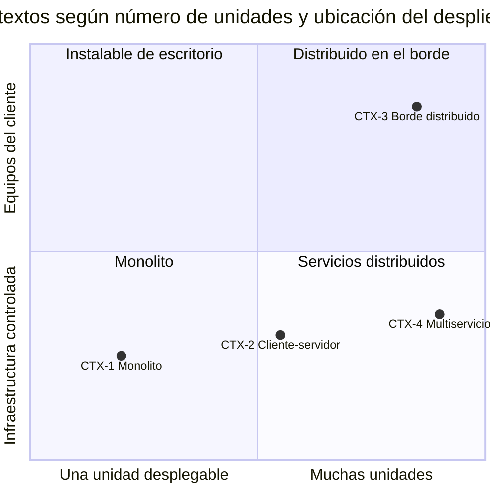
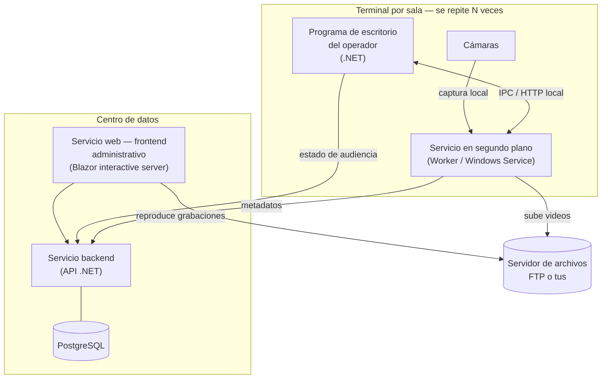

# Contextos arquitectónicos — `MARCO-CONTEXTOS`

## Resumen ejecutivo

Un contexto es la **forma arquitectónica** del sistema que el informe describe. Importa porque describir un monolito que se despliega en un servidor no se parece en nada a describir un sistema con componentes instalados en decenas de terminales que operan sin conexión con el servidor central. El índice del informe es el mismo —arquitectura, despliegue, requisitos—, pero la vista de despliegue de uno cabe en un diagrama y la del otro necesita explicar instalación por terminal, colas de subida y operación degradada.

Mientras los [escenarios](Escenarios.md) fijan *desde dónde* se escribe —solución propuesta, construida, en evolución, ajena—, los contextos fijan *qué forma tiene* lo que se describe. Cada documento temático indica qué cambia en su tratamiento según el contexto. Los cuatro que siguen cubren el espectro que un desarrollo .NET típico presenta, ordenados por complejidad de despliegue creciente.

El sistema que esta guía usa como ejemplo recurrente —un **sistema de gestión de audiencias**, presentado más abajo— pertenece al contexto más exigente, `CTX-3`, y por eso reaparece en casi todos los documentos: exhibe los problemas que los contextos más simples no llegan a mostrar.

---

## Por qué estos cuatro

Los contextos se distinguen por dos preguntas de despliegue: **¿cuántas unidades desplegables independientes tiene el sistema?** y **¿dónde corren: en infraestructura controlada o en equipos del cliente fuera de control del operador?** La primera determina el tamaño de la vista de componentes; la segunda determina si el despliegue es un acto único o un proceso distribuido y repetido, y si la solución tiene que funcionar cuando parte de ella está incomunicada.



Un sistema real puede combinar contextos —un backend multiservicio (`CTX-4`) con clientes de escritorio en el borde (`CTX-3`)—, y el ejemplo de audiencias es exactamente esa combinación. Nombrar el contexto dominante ayuda a decidir cuánto espacio del informe merece la vista de despliegue.

---

## `CTX-1` — Monolito desplegable único

**Forma.** Una sola aplicación que se despliega como una unidad: una web app de ASP.NET Core que sirve la interfaz y la lógica y habla con una base de datos. Puede tener capas internas bien separadas, pero desde afuera es un artefacto que se publica en un lugar.

**Qué cambia en el informe.** La vista de componentes es interna —capas, módulos— y la de despliegue es breve: un proceso, un host, una base de datos. El esfuerzo de redacción se concentra en la arquitectura lógica y en los requisitos, porque el despliegue no da para mucho y forzarlo a llenar páginas produce relleno. Es el contexto donde más tienta describir la estructura de carpetas en lugar de la arquitectura, y hay que resistirlo: el lector quiere responsabilidades y relaciones, no el árbol del repositorio.

**Nota .NET.** Una Blazor Web App en render *interactive server* con su base de datos PostgreSQL vía Npgsql es el caso típico. Aun siendo «un» despliegue, conviene declarar el modelo de publicación —dependiente del framework o autocontenido— porque determina qué tiene que estar instalado en el host.

---

## `CTX-2` — Cliente-servidor distribuido

**Forma.** Frontend, backend y base de datos en nodos separados que se comunican por red: una web app o una app de escritorio que consume una API, la API en un servidor, la base de datos en otro. Es la topología más común de los sistemas de gestión.

**Qué cambia en el informe.** Aparece la vista de despliegue como algo que vale la pena diagramar: qué corre en qué nodo, qué protocolo los une, qué puertos, qué pasa si el enlace entre frontend y backend se cae. Los contratos entre componentes se vuelven parte del relato —el informe puede referenciar la [especificación de API](../../Documentacion-Tecnica/40-Diseno/API-Specification.md) de la guía hermana en lugar de repetirla— y los requisitos no funcionales empiezan a tener sustancia: latencia entre nodos, disponibilidad del backend, seguridad del canal.

**Nota .NET.** Kestrel detrás de un proxy inverso (IIS o Nginx), o el backend corriendo como Worker/Windows Service; la base de datos PostgreSQL en su propio nodo. Aquí ya importa decir dónde termina TLS y cómo viajan las credenciales.

---

## `CTX-3` — Sistema distribuido en el borde

**Forma.** El sistema tiene componentes que corren **en equipos del cliente, fuera del centro de datos**: aplicaciones de escritorio, servicios en segundo plano por terminal, dispositivos conectados localmente. Esos componentes se comunican con un backend central y, a menudo, con servidores de archivos, pero deben seguir funcionando cuando la conexión con el centro no está. Es el contexto de mayor complejidad de despliegue y operación.

**Qué cambia en el informe.** El despliegue deja de ser un acto y pasa a ser un proceso repetido y distribuido: hay que instalar y actualizar software en cada terminal, y el informe tiene que describir esa instalación como un procedimiento, no como una nota al pie. La operación degradada —qué hace el sistema cuando el backend está caído— se vuelve un requisito no funcional de primer orden, no un detalle. Los mecanismos de recuperación ante fallos locales, las colas de trabajo diferido y la sincronización eventual son la parte más interesante de la arquitectura y la que el lector técnico más quiere entender. Un informe de `CTX-3` que dedica tres párrafos al despliegue está mal calibrado.

**Nota .NET.** Programa de escritorio (WPF, WinForms o .NET MAUI) más un Worker Service instalado como servicio de Windows por terminal; comunicación local entre ambos; subida de archivos al servidor por FTP (`RFC 959`) o por un protocolo de subida reanudable como tus; backend en el centro con PostgreSQL. La distribución del escritorio y del servicio se hace con MSIX, ClickOnce o un instalable autocontenido, y esa elección es material del informe.

### El sistema de ejemplo — gestión de audiencias

El ejemplo recurrente de esta guía es un sistema que administra la grabación de audiencias. Su descripción sirve de material a lo largo de los documentos temáticos y encarna `CTX-3`:



Sus componentes, tomados del planteo real:

| Componente | Rol | Corre en |
|---|---|---|
| Programa de escritorio | El operador genera y graba la audiencia | Cada terminal |
| Servicio en segundo plano | Maneja las cámaras, graba y sube los videos al servidor de archivos | Cada terminal |
| Servicio backend | Recibe estado y metadatos de las terminales; expone datos al frontend | Servidor central |
| Servicio web (frontend) | Los administrativos visualizan audiencias y grabaciones | Servidor central |
| Servidor de archivos | Almacena los videos | FTP o tus |
| PostgreSQL | Persistencia del backend | Servidor central |

Los requisitos no funcionales que lo definen —y que ningún ejemplo de monolito llega a mostrar— son tres: la audiencia puede **iniciarse y grabarse aunque el backend y el frontend estén caídos**; ante la **caída del programa de escritorio**, el sistema recupera el estado de la audiencia y permite continuarla; y al **cerrar una audiencia los videos siguen subiéndose en segundo plano**, de modo que el operador puede iniciar una nueva sin esperar. Estos tres comportamientos son el corazón de lo que el informe debe explicar, y se retoman en [`TEM-OPERACION`](../30-Despliegue/Operacion-y-Resiliencia.md) y en [`TEM-RNF`](../40-Requisitos/Requisitos-No-Funcionales.md).

---

## `CTX-4` — Servicios distribuidos en infraestructura controlada

**Forma.** Varios servicios desplegables de forma independiente, todos en infraestructura del operador —centro de datos o nube—: un backend descompuesto en servicios, colas de mensajes, trabajadores, cachés. No hay componentes en equipos del cliente; la complejidad está en la cantidad de piezas y en cómo colaboran.

**Qué cambia en el informe.** La vista de componentes crece y necesita jerarquía: no se puede mostrar todo en un diagrama, y ahí es donde un modelo con niveles de zoom —como el C4— gana su lugar. La vista de despliegue describe topología de contenedores u hosts, y los requisitos no funcionales giran en torno a escalabilidad, resiliencia entre servicios y consistencia de datos distribuidos. El riesgo de redacción es el opuesto al de `CTX-1`: describir cada servicio con igual detalle produce un informe plano donde no se distingue lo central de lo accesorio.

**Nota .NET.** Servicios ASP.NET Core y Worker Services publicados como imágenes de contenedor con `dotnet publish`, orquestados según el caso; PostgreSQL gestionado; colas y almacenamiento como servicios propios. La elección de descomposición conviene justificarla con una decisión de arquitectura registrada, porque es la que más consecuencias tiene.

---

## Tabla comparativa

| | `CTX-1` Monolito | `CTX-2` Cliente-servidor | `CTX-3` Borde distribuido | `CTX-4` Multiservicio |
|---|---|---|---|---|
| **Unidades desplegables** | Una | Dos o tres | Muchas, repetidas por terminal | Muchas, en el centro |
| **Dónde corre** | Un host | Nodos del operador | Equipos del cliente + centro | Infraestructura del operador |
| **Peso de la vista de despliegue** | Bajo | Medio | Alto | Alto |
| **Operación offline** | No aplica | A veces | Requisito central | Rara vez |
| **Riesgo de redacción** | Describir carpetas, no arquitectura | Olvidar los contratos | Subestimar instalación y resiliencia | Aplanar: todo con igual detalle |
| **Modelo de diagramas útil** | Capas | Componentes + despliegue | Despliegue detallado + flujos | Niveles de zoom (C4) |

---

## Relación con los contextos de las guías hermanas

Las guías hermanas de la serie definen sus propios contextos, y **no coinciden con estos**: la [guía de documentación técnica](../../Documentacion-Tecnica/00-Marco-de-Referencia/Contextos.md) los organiza por tipo de trabajo —web y cliente interactivo, backend y servicios, fullstack—, y la [guía de REST API](../../Organizacion-Estilo-Rest-API/00-Marco-de-Referencia/Contextos.md) por relación con el consumidor. Esta guía los organiza por **forma de despliegue**, porque es la variable que más cambia el informe que aquí se trata. El identificador `CTX-1` significa cosas distintas en cada guía; al cruzar referencias, se desambigua por la ruta. La convención está en [`MARCO-CONVENCIONES`](Convenciones.md).

---

## Preguntas guía

- ¿Cuántas unidades desplegables independientes tiene el sistema, y corren en infraestructura que controlo o en equipos del cliente?
- ¿La solución tiene que funcionar cuando parte de ella está incomunicada? Si es así, ¿ese comportamiento está en el centro del informe o escondido en una nota?
- ¿El peso que le doy a la vista de despliegue corresponde al contexto, o estoy rellenando (`CTX-1`) o subestimando (`CTX-3`)?
- Si el sistema combina contextos, ¿cuál es el dominante, y lo dije?
- ¿Estoy por describir la estructura de carpetas cuando debería describir componentes y responsabilidades?

---

## Anexo — Ficha de contexto

Se completa junto con la [ficha de ubicación](Escenarios.md#anexo--ficha-de-ubicación) de escenario.

```yaml
contexto_dominante: CTX-?
contextos_presentes: []              # si el sistema combina formas
unidades_desplegables:
  - nombre: ""
    tipo: web | api | worker | escritorio | servicio_archivos | base_datos
    corre_en: infraestructura_operador | equipo_cliente
    modelo_publicacion: dependiente_framework | autocontenido | contenedor | instalable
operacion_offline:
  aplica: si | no
  componentes_que_operan_sin_centro: []
  comportamiento_degradado: ""
peso_vista_despliegue: bajo | medio | alto
```
