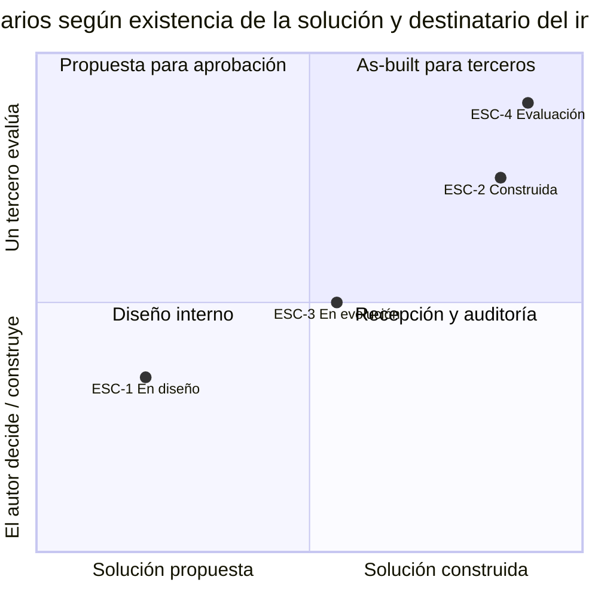
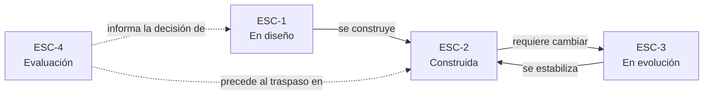

# Escenarios del dominio — `MARCO-ESCENARIOS`

## Resumen ejecutivo

Un escenario es la situación desde la que alguien se sienta a escribir —o a leer— un informe que describe una solución de software en términos de arquitectura, despliegue y requisitos. No es lo mismo describir una solución que todavía no existe, para conseguir que la aprueben, que describir una que lleva dos años en producción, para que un tercero la entienda. El índice del documento puede ser idéntico; lo que cada sección puede afirmar con certeza no lo es.

Esta guía define cuatro escenarios. Todos los documentos temáticos los recorren en su sección «Aplicación por escenario», de modo que el lector pueda ubicarse en el suyo y leer solo lo que le toca. Junto con los [contextos](Contextos.md) —que fijan la forma arquitectónica del sistema descrito— y los [actores](Actores.md) forman el vocabulario común del que dependen los demás documentos.

El disparador que origina la guía es un pedido real, del tipo que este informe viene a responder:

> «Para poder comprender mejor el enfoque general, nos sería de mucha utilidad contar con un documento que describa la solución propuesta en términos de arquitectura, despliegue y resolución de requisitos funcionales y no funcionales.»

Ese pedido cae de lleno en `ESC-2`, y buena parte de la guía se escribe pensando en él; pero la misma estructura sirve a los otros tres, y confundir en cuál se está es el primer error de redacción.

---

## Por qué cuatro y no otros

Los escenarios se distinguen por dos variables que gobiernan casi todo lo demás: **cuánto de la solución ya existe** cuando se escribe el informe, y **quién decide sobre la base de lo que se escribe**. La primera determina si lo que el informe afirma es un hecho verificable o una intención fundamentada. La segunda determina el registro: no se le habla igual a quien va a construir la solución que a quien va a juzgarla desde afuera.



Cruzar esas dos variables da los cuatro escenarios que siguen. Ninguno es más importante que otro, pero `ESC-2` es el más frecuente en la práctica de esta guía y el peor servido por las plantillas disponibles, que casi siempre asumen que se está diseñando algo nuevo.

---

## `ESC-1` — Solución en diseño

**Situación.** El sistema no existe todavía, o está en construcción temprana. El informe describe la solución *propuesta*: la arquitectura que se piensa construir, el despliegue que se prevé y cómo se espera que resuelva los requisitos. Sirve para decidir si el enfoque se aprueba, se financia o se corrige antes de escribir código.

Es el escenario donde el informe tiene más poder y más riesgo. Más poder porque cambiar una decisión sobre el papel es gratis y cambiarla en producción no lo es. Más riesgo porque casi todo lo que se afirma es una hipótesis, y un informe que presenta hipótesis con el tono de los hechos consumados induce a decidir sobre una certeza que no existe.

**Qué se decide acá.** La estrategia de solución —qué estilo arquitectónico, qué componentes, qué tecnologías—, la topología de despliegue prevista y, sobre todo, cómo la solución piensa satisfacer los requisitos no funcionales, que es donde una arquitectura se gana o se pierde. Es el momento de registrar las decisiones de arquitectura con sus alternativas, porque después se olvidan y quedan pareciendo inevitables.

**Cuál es la trampa.** Escribir en futuro perfecto: describir la solución como si ya funcionara, sin marcar qué está decidido, qué está supuesto y qué está pendiente de validar. Un informe de `ESC-1` honesto distingue tres estados en cada afirmación —decidido, propuesto, por confirmar— y no le teme a la palabra «se prevé». La otra trampa es sobredimensionar: describir una arquitectura de resiliencia de nivel bancario para un sistema que aún no tiene un solo usuario.

**Cómo se sabe que terminó.** Un lector técnico ajeno al proyecto puede reconstruir la arquitectura propuesta, ubicar cada requisito no funcional contra el mecanismo que lo atiende, y señalar las decisiones que le parecen riesgosas —porque están declaradas como decisiones, no escondidas como supuestos.

---

## `ESC-2` — Solución construida

**Situación.** El sistema ya funciona. Hay que describir lo que *hay* —la arquitectura tal como quedó, el despliegue tal como corre, la forma en que la solución efectivamente resuelve los requisitos— para que un tercero lo comprenda: un cliente que lo recibe, un evaluador que lo audita, un equipo que lo hereda, un socio que va a integrarse. Es el escenario del pedido que abre esta guía.

La tensión central es que **el sistema real casi nunca coincide con el diseño original**, y el informe honesto describe el sistema, no el diseño. Una arquitectura que en el papel tenía tres capas limpias suele tener, dos años después, un atajo entre la primera y la tercera que nadie documentó y que es exactamente lo que el lector necesita saber. Describir la versión idealizada produce un informe elegante e inútil.

**Qué se decide acá.** Poco: casi todo ya está decidido y construido. Lo que se decide es **qué mostrar y con cuánto detalle**, y ahí el criterio es el destinatario. Un cliente que va a operar el sistema necesita la vista de despliegue y la operativa; un socio que va a integrarse necesita los contratos y los límites; un auditor necesita la trazabilidad entre requisitos y mecanismos. El mismo sistema produce informes distintos según quién pregunta.

**Cuál es la trampa.** Describir la intención en lugar de la realidad. Frases como «el sistema está diseñado para escalar horizontalmente» describen una aspiración; el informe de `ESC-2` afirma «el backend corre en una única instancia; el escalado horizontal es posible por su diseño sin estado pero no se ejercita en producción», que es un hecho verificable y además más útil. Toda afirmación de `ESC-2` debería poder respaldarse señalando el sistema real.

**Cómo se sabe que terminó.** Cada afirmación del informe se puede confrontar con el sistema en ejecución y sobrevive a la confrontación. Las divergencias conocidas entre lo diseñado y lo construido están declaradas, no ocultadas.

---

## `ESC-3` — Solución en evolución o migración

**Situación.** El sistema existe y va a cambiar: se rehace la arquitectura, se muda el despliegue —de servidores propios a la nube, de FTP a un protocolo de subida reanudable—, se reemplaza una tecnología. El informe describe la solución *en transición*: de dónde parte, a dónde va y por qué conviene el cambio.

Es el escenario que más se parece a `ESC-1` en la forma —hay una solución propuesta— pero se distingue en que **la propuesta se juzga contra algo que ya funciona**, y eso cambia todo. El lector no pregunta «¿es buena esta arquitectura?» sino «¿es mejor que la que tengo, y vale lo que cuesta migrar?». Un informe de evolución que no describe el estado de partida deja esa pregunta sin respuesta posible.

**Qué se decide acá.** El alcance del cambio y su justificación. Qué se conserva, qué se reemplaza, qué queda conviviendo durante la transición. La vista de despliegue se vuelve doble: la actual y la objetivo, con el camino entre ambas. Los requisitos no funcionales son el argumento central, porque una migración casi siempre se justifica por un atributo de calidad que la solución actual no alcanza —capacidad, disponibilidad, mantenibilidad.

**Cuál es la trampa.** Vender el destino sin costear el viaje. Un informe que describe la arquitectura objetivo como evidentemente superior y omite el costo, el riesgo y el período de convivencia de la migración es una pieza de marketing, no un informe técnico. La contracara: describir el estado actual con desprecio, cuando quien lo construyó suele estar entre los lectores.

**Cómo se sabe que terminó.** El lector puede comparar estado actual y objetivo atributo por atributo, entiende qué mejora cada cambio y a qué costo, y sabe cómo se ve el sistema durante la transición, no solo al final.

---

## `ESC-4` — Evaluación de una solución ajena

**Situación.** Hay que entender, juzgar o recibir una solución que otro diseñó, a partir de su informe —si existe— o reconstruyéndola desde afuera. El objetivo puede ser decidir una compra, auditar la calidad, aceptar una entrega contractual o preparar un traspaso de mantenimiento.

Es el escenario espejo de los otros tres: en lugar de escribir el informe, se lo lee críticamente, y donde no hay informe se lo construye a partir de lo observable. La habilidad central no es redactar sino **detectar qué falta**: el informe que describe la arquitectura pero no el despliegue, el que enumera requisitos funcionales y calla los no funcionales, el que afirma disponibilidad sin decir cómo se mide.

**Qué se decide acá.** Si la solución descrita resuelve lo que dice resolver, y si el informe permite confiar en esa afirmación. Se contrasta lo escrito con lo verificable, se separan los hechos de las intenciones y se registran las preguntas que el informe no responde. Cuando no hay informe previo, se levanta uno as-built desde el sistema, con el nivel de confianza declarado operación por operación.

**Cuál es la trampa.** Puntuar la forma en lugar del fondo. Un informe extenso, bien maquetado y lleno de diagramas puede describir una solución pobre, y uno austero puede describir una excelente. El evaluador que se deja llevar por el volumen premia la redacción y no la arquitectura. La trampa simétrica: exigir a un informe de `ESC-1` la certeza que solo `ESC-2` puede dar.

**Cómo se sabe que terminó.** Existe un juicio explícito sobre si la solución resuelve los requisitos, con las evidencias que lo sostienen y la lista de lo que no pudo verificarse con la información disponible.

---

## Tabla comparativa

| | `ESC-1` En diseño | `ESC-2` Construida | `ESC-3` En evolución | `ESC-4` Evaluación |
|---|---|---|---|---|
| **Estado de la solución** | No existe | En producción | En transición | Ajena, existe |
| **Naturaleza de lo afirmado** | Intención fundamentada | Hecho verificable | Contraste actual→objetivo | Juicio sobre lo ajeno |
| **Pregunta del lector** | ¿Apruebo este enfoque? | ¿Cómo funciona esto? | ¿Conviene migrar? | ¿Resuelve lo que dice? |
| **Riesgo dominante** | Presentar hipótesis como hechos | Describir la intención, no la realidad | Vender el destino sin costear el viaje | Premiar la forma sobre el fondo |
| **Vista de despliegue** | Prevista | Real | Doble: actual y objetivo | Observada o ausente |
| **Actor que suele conducir** | `ACT-01` arquitecto | `ACT-01` con `ACT-04` despliegue | `ACT-01` con `ACT-04` | `ACT-03` solicitante o `ACT-08` auditor |

---

## Cómo se combinan

Los escenarios no son excluyentes. Un mismo informe puede describir en `ESC-2` la parte del sistema que ya existe y en `ESC-1` el módulo que se agrega, y un proyecto atraviesa varios a lo largo del tiempo. La transición más común —y la que conviene tener presente al diseñar el informe— es que **toda solución de `ESC-1` termina en `ESC-2`**: lo que hoy se describe como propuesto, mañana hay que describirlo como construido, y un informe de diseño escrito con la estructura correcta se convierte en el informe as-built con mucho menos trabajo.



Diseñar el informe de `ESC-1` sabiendo que va a vivir como informe de `ESC-2` es la diferencia entre documentar una vez y documentar cada vez.

---

## Correspondencia con la guía hermana de documentación técnica

Esta guía no reemplaza a la [guía de documentación técnica](../../Documentacion-Tecnica/README.md), que trata por separado cada tipo de documento del catálogo —el SAD, el SRS, la Deployment Guide— con su propia estructura. Aquí el objeto es distinto: **un único informe transversal** que cruza arquitectura, despliegue y requisitos para un lector que quiere comprender el enfoque general, no la biblioteca completa. Cuando un tema ya está desarrollado en la guía hermana, esta lo referencia en lugar de repetirlo; lo que agrega es cómo se **componen** esos materiales en un solo documento y con qué criterio de redacción. La relación se detalla en [`MARCO-CONVENCIONES`](Convenciones.md).

---

## Preguntas guía

- ¿En qué escenario estoy: describo lo que voy a construir, lo que construí, lo que voy a cambiar, o lo que otro hizo?
- ¿Cada afirmación de mi informe es un hecho verificable o una intención? ¿El texto deja claro cuál es cuál?
- Si estoy en `ESC-2`, ¿puedo confrontar lo que escribo con el sistema en ejecución y sale airoso?
- Si estoy en `ESC-3`, ¿describí el estado de partida con el mismo cuidado que el objetivo?
- Si estoy en `ESC-4`, ¿separé lo que el informe demuestra de lo que solo afirma?
- ¿Quién es el destinatario, y estoy mostrando lo que él necesita decidir o lo que a mí me resultó interesante construir?

---

## Anexo — Ficha de ubicación

Se completa al inicio de la redacción de un informe y se revisa si cambia el destinatario o el estado del sistema.

```yaml
escenario_principal: ESC-?           # el que domina el informe
escenarios_secundarios: []           # partes del sistema en otro escenario
contexto: CTX-?                      # forma arquitectónica; ver Contextos.md
destinatario:
  rol: ""                            # ver Actores.md
  decision_que_habilita: ""          # qué va a decidir con este informe
  nivel_tecnico: alto | medio | mixto
estado_del_sistema: propuesto | construido | en_transicion | ajeno
afirmaciones:
  verificables_hoy: si | parcial | no
  divergencias_diseno_realidad_declaradas: si | no | na
alcance:
  incluye: [arquitectura, despliegue, requisitos_funcionales, requisitos_no_funcionales]
  excluye: []                        # lo que deliberadamente queda fuera, y por qué
```

El campo `decision_que_habilita` es el más determinante y el que más se omite. Un informe que no sabe qué decisión va a habilitar termina describiendo todo con el mismo peso, que es la forma más segura de no servir a ninguna decisión.
