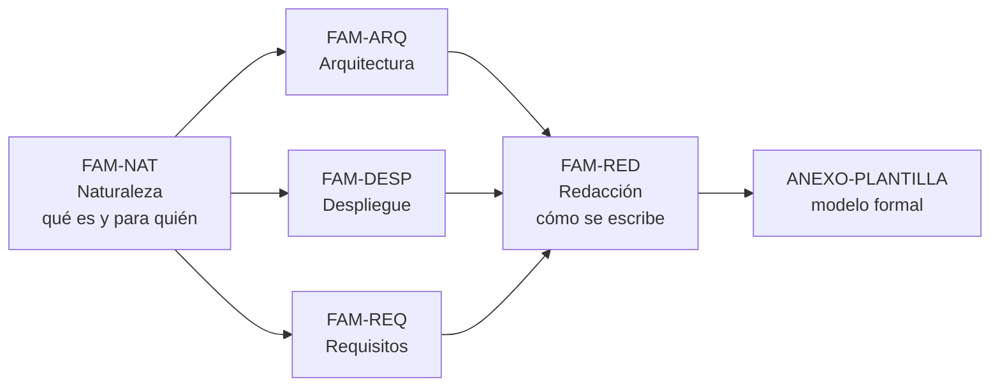

# Mapa conceptual — `MAPA-CONCEPTUAL`

## Resumen ejecutivo

Este documento es la entrada rápida a la guía: tres tablas que responden «estoy acá, ¿qué leo?». La primera entra por escenario —desde dónde escribo—, la segunda por contexto —qué forma tiene el sistema—, y la tercera por parte del informe —qué sección estoy redactando ahora—. Quien tiene que escribir un informe y no tiene tiempo de recorrer la guía entera empieza acá, ubica su caso y salta al documento que le sirve.

El resto de la guía cuelga de un mapa mental simple: un informe de solución tiene tres cuerpos —**arquitectura, despliegue y requisitos**—, precedidos por saber **qué es** ese informe y cerrados por **cómo se redacta**. Cada familia temática desarrolla uno de esos bloques.

---

## Tabla de entrada por escenario

Se elige la fila por [escenario](../00-Marco-de-Referencia/Escenarios.md): desde dónde se escribe el informe.

| Escenario | Lo primero que hay que resolver | Documentos en orden de utilidad |
|-----------|--------------------------------|---------------------------------|
| `ESC-1` En diseño | Distinguir lo decidido de lo supuesto | [`TEM-QUE-ES`](../10-Naturaleza-del-Informe/Que-es-y-que-no-es.md) → [`TEM-DECISIONES`](../20-Arquitectura/Decisiones-de-Arquitectura.md) → [`TEM-ESTRUCTURA`](../50-Redaccion/Estructura-del-Documento.md) → [`TEM-RNF`](../40-Requisitos/Requisitos-No-Funcionales.md) |
| `ESC-2` Construida | Describir la realidad, no la intención | [`TEM-COMPONENTES`](../20-Arquitectura/Vista-de-Componentes.md) → [`TEM-TOPOLOGIA`](../30-Despliegue/Topologia-y-Entornos.md) → [`TEM-RF`](../40-Requisitos/Requisitos-Funcionales.md) → [`TEM-CRITERIO`](../50-Redaccion/Criterio-de-Redaccion.md) |
| `ESC-3` En evolución | Contrastar estado actual y objetivo | [`TEM-TOPOLOGIA`](../30-Despliegue/Topologia-y-Entornos.md) → [`TEM-DECISIONES`](../20-Arquitectura/Decisiones-de-Arquitectura.md) → [`TEM-RNF`](../40-Requisitos/Requisitos-No-Funcionales.md) → [`TEM-ERRORES`](../50-Redaccion/Errores-Frecuentes.md) |
| `ESC-4` Evaluación | Separar lo demostrado de lo afirmado | [`TEM-QUE-ES`](../10-Naturaleza-del-Informe/Que-es-y-que-no-es.md) → [`ANEXO-CHECK`](../99-Anexos/Lista-de-Verificacion.md) → [`TEM-RNF`](../40-Requisitos/Requisitos-No-Funcionales.md) → [`TEM-ERRORES`](../50-Redaccion/Errores-Frecuentes.md) |

---

## Tabla de entrada por contexto

Se elige la fila por [contexto](../00-Marco-de-Referencia/Contextos.md): qué forma arquitectónica tiene el sistema. Determina cuánto pesa cada cuerpo del informe.

| Contexto | Dónde está la dificultad | Peso relativo en el informe |
|----------|--------------------------|-----------------------------|
| `CTX-1` Monolito | Arquitectura interna; el despliegue es breve | Arquitectura **alta** · despliegue bajo · requisitos medio |
| `CTX-2` Cliente-servidor | Contratos entre nodos y canal | Arquitectura media · despliegue **medio** · requisitos medio |
| `CTX-3` Borde distribuido | Instalación por terminal y operación degradada | Arquitectura media · despliegue **alto** · requisitos **alto** |
| `CTX-4` Multiservicio | Jerarquía de componentes; consistencia distribuida | Arquitectura **alta** · despliegue alto · requisitos alto |

El sistema de ejemplo de la guía —gestión de audiencias— es `CTX-3`, y por eso los documentos de [despliegue](../30-Despliegue/README.md) y de [requisitos no funcionales](../40-Requisitos/Requisitos-No-Funcionales.md) son los que más lo usan.

---

## Tabla de entrada por parte del informe

Se elige la fila por la sección que se está redactando. Es la entrada más usada cuando el informe ya está empezado.

| Estoy escribiendo… | Documento que lo trata | Marco que lo respalda |
|--------------------|------------------------|-----------------------|
| El resumen ejecutivo | [`TEM-AUDIENCIA`](../10-Naturaleza-del-Informe/Audiencia-y-Proposito.md), [`TEM-ESTRUCTURA`](../50-Redaccion/Estructura-del-Documento.md) | `N-01` 42010 (visión general) |
| La vista de componentes | [`TEM-COMPONENTES`](../20-Arquitectura/Vista-de-Componentes.md) | `G-02` C4, `O-01` 4+1 (vista lógica) |
| Los diagramas de arquitectura | [`TEM-VISTAS`](../20-Arquitectura/Vistas-y-Diagramas.md) | `O-01` 4+1, `G-02` C4 |
| Las decisiones y trade-offs | [`TEM-DECISIONES`](../20-Arquitectura/Decisiones-de-Arquitectura.md) | `N-01` 42010 (decisión + rationale) |
| La topología de despliegue | [`TEM-TOPOLOGIA`](../30-Despliegue/Topologia-y-Entornos.md) | `N-07` UML, `G-02` C4 (deployment) |
| La distribución e instalación | [`TEM-DISTRIBUCION`](../30-Despliegue/Distribucion-e-Instalacion.md) | `N-09`..`N-17` .NET |
| La operación y la resiliencia | [`TEM-OPERACION`](../30-Despliegue/Operacion-y-Resiliencia.md) | `N-08` FTP, `F-01` tus |
| La resolución de requisitos funcionales | [`TEM-RF`](../40-Requisitos/Requisitos-Funcionales.md) | `N-06` 29148 |
| La resolución de requisitos no funcionales | [`TEM-RNF`](../40-Requisitos/Requisitos-No-Funcionales.md) | `N-04` 25010:2023, `N-06` 29148 |
| Cualquier sección, con criterio | [`TEM-CRITERIO`](../50-Redaccion/Criterio-de-Redaccion.md), [`TEM-ERRORES`](../50-Redaccion/Errores-Frecuentes.md) | `Rule-Narrative-Voice` |

---

## Cruce escenario × parte del informe

Qué exige cada parte del informe en cada escenario. Sirve para saber, antes de escribir una sección, qué tono le toca.

| Parte | `ESC-1` En diseño | `ESC-2` Construida | `ESC-3` En evolución | `ESC-4` Evaluación |
|-------|-------------------|--------------------|-----------------------|--------------------|
| Arquitectura | Propuesta, con supuestos marcados | Real, con divergencias declaradas | Actual y objetivo | Observada o juzgada |
| Despliegue | Previsto | Como corre hoy | Doble: actual→objetivo | Verificado contra lo real |
| Requisitos | Compromisos a cumplir | Lo efectivamente resuelto | El atributo que motiva migrar | ¿Se resuelve lo que dice? |
| Decisiones | Vivas, en discusión | Reconstruidas | La migración es la decisión | Se juzgan |

---

## Cómo se relaciona con las guías hermanas

El mapa de esta guía apunta hacia afuera cuando un tema pertenece a otra. Los documentos de arquitectura enlazan al [SAD](../../Documentacion-Tecnica/30-Arquitectura/SAD.md) y a los [ADR](../../Documentacion-Tecnica/30-Arquitectura/ADR.md) de la guía hermana; los de requisitos, al [SRS](../../Documentacion-Tecnica/20-Analisis/SRS.md); los de despliegue, a la [Deployment Guide](../../Documentacion-Tecnica/50-Operativa/Deployment-Guide.md), la [Installation Guide](../../Documentacion-Tecnica/50-Operativa/Installation-Guide.md) y la [Operations Guide](../../Documentacion-Tecnica/50-Operativa/Operations-Guide.md). Esta guía no reescribe esos documentos: enseña a sintetizarlos en un solo informe. La frontera está en [`MARCO-CONVENCIONES`](../00-Marco-de-Referencia/Convenciones.md#no-duplicar-y-la-relación-con-las-guías-hermanas).

---

## Preguntas guía

- ¿Entré por el escenario correcto, o estoy leyendo el consejo de otro?
- ¿El peso que le estoy dando a cada cuerpo del informe corresponde a mi contexto?
- ¿La sección que escribo ahora tiene el tono que le toca según el escenario?
- ¿Estoy por reescribir algo que ya está en la guía hermana y debería referenciar?
