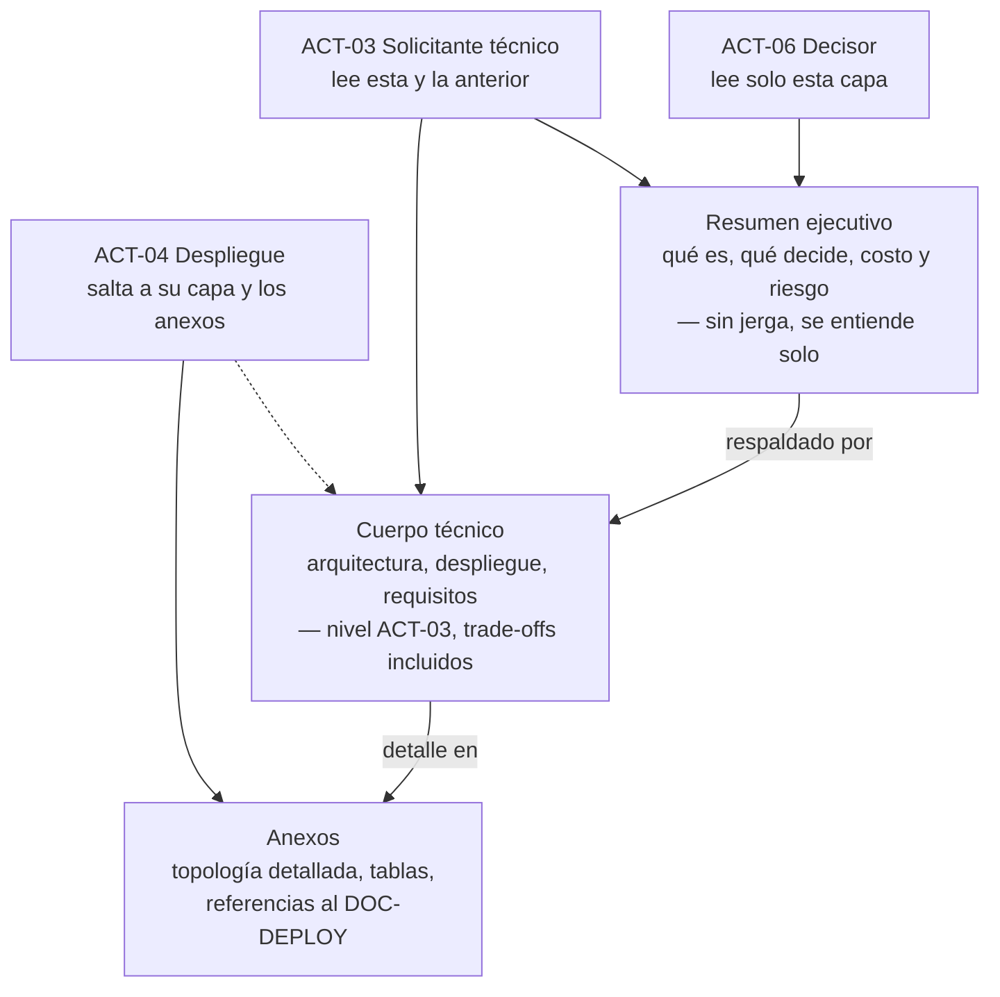

# Audiencia y propósito del informe — `TEM-AUDIENCIA`

## Resumen ejecutivo

Un informe de solución se escribe para alguien y para habilitar algo, y esas dos coordenadas —quién lee y qué decide— determinan más del contenido que la propia arquitectura del sistema. El mismo sistema de audiencias produce un informe distinto si lo lee un socio que evalúa integrarse, un organismo que recibe la entrega o un equipo que hereda el mantenimiento, porque cada uno decide algo diferente y necesita ver algo diferente. El error de audiencia más común, que `MARCO-ACTORES` nombra, es escribir para uno mismo: el autor documenta lo que le costó construir en lugar de lo que el lector necesita para decidir.

El destinatario por defecto de esta guía es `ACT-03`, el solicitante técnico: tiene criterio para seguir un diagrama de despliegue y una discusión de trade-offs, pero no conoce el sistema ni comparte el contexto que el autor da por sabido. Sobre él se calibra el cuerpo del informe. Pero no es el único lector: `ACT-06`, el decisor, lee solo el resumen ejecutivo y las conclusiones; `ACT-04`, el responsable de despliegue, va derecho a la vista de despliegue y los anexos operativos. Un solo documento sirve a los tres si está **estratificado**: resumen para el decisor, cuerpo para el técnico, anexos para el despliegue.

Este documento le sirve a `ACT-01` para decidir, antes de escribir cada sección, a quién le está hablando y qué debe poder decidir esa persona al terminarla. Es el criterio que convierte un informe uniforme —todo con el mismo peso y el mismo nivel— en uno que cada lector puede recorrer por la puerta que le corresponde.

---

## Definición

### Qué es la audiencia de un informe, y qué es su propósito

La **audiencia** es el conjunto de roles que van a leer el informe, cada uno con su nivel técnico, su conocimiento previo del sistema y la parte del documento que efectivamente lee. El **propósito** es la decisión que el informe habilita: integrarse, aprobar, auditar, heredar el mantenimiento, aceptar una entrega. Los dos son inseparables, porque el mismo rol con propósitos distintos necesita informes distintos, y el mismo propósito ante roles distintos también.

`MARCO-ACTORES` define ocho roles alrededor del informe; tres gobiernan la mayoría de las decisiones de audiencia:

**`ACT-03` — Solicitante técnico.** El destinatario por defecto y el caso de referencia de toda la guía. Pidió el informe para decidir sobre la base de lo que lee: el arquitecto del cliente que evalúa integrarse, el evaluador de una due diligence, el responsable técnico de un organismo que recibe el sistema. La combinación que lo define —criterio técnico alto, conocimiento del sistema nulo— fija el nivel del cuerpo del informe: puede seguir una discusión de trade-offs, pero no comparte el contexto que el autor da por sabido.

**`ACT-06` — Patrocinador o decisor.** Lee para decidir sobre presupuesto, aprobación o continuidad, y no siempre tiene profundidad técnica. **No lee el documento entero**: lee el resumen ejecutivo y las conclusiones, y confía en que el resto lo respalda. Su existencia es la razón por la que el informe abre con un resumen que se entiende solo y por la que las decisiones y sus costos se enuncian sin jerga.

**`ACT-04` — Responsable de despliegue y operación.** DevOps, SRE o administrador: consume la vista de despliegue y la operativa, y a menudo las aporta. En `CTX-3` es un lector central, porque la instalación por terminal y la operación degradada son su territorio. No lee el informe de corrido: va a las secciones que le tocan y a los anexos.

### Qué problema resuelve pensar la audiencia antes de escribir

Un informe que no decidió su audiencia describe todo con el mismo peso y el mismo nivel, y al hacerlo no sirve bien a nadie: es demasiado técnico para el decisor y demasiado superficial para el solicitante. El problema que resuelve fijar la audiencia es de **calibración**: qué nivel de detalle, qué vocabulario y qué extensión merece cada sección, en función de quién la va a leer y qué va a decidir con ella. Sin esa calibración, el autor escribe al nivel que le resulta cómodo —el suyo—, que casi nunca es el del lector.

### Qué NO es, y con qué se lo confunde

**No es elegir una sola audiencia.** El error simétrico de escribir para uno mismo es escribir todo el informe para el decisor, diluyendo el contenido técnico hasta que `ACT-03` no encuentra nada que evaluar. La solución no es elegir un lector sino **estratificar**: darle a cada uno su capa. Un informe con un solo nivel falla ante una audiencia que nunca es homogénea.

**No es una sección «para quién es este documento».** Declarar la audiencia en un párrafo inicial no basta; la audiencia se sirve en la estructura y el nivel de cada sección, no en una etiqueta. Un informe que dice «dirigido a perfiles técnicos» y después abre con quince páginas de jerga interna no pensó su audiencia, la nombró.

**No es adivinar.** La audiencia y el propósito se preguntan, no se suponen. `MARCO-ACTORES` insiste: los requisitos vienen de `ACT-05`, no inventados por el autor; del mismo modo, la decisión que el informe habilita la fija quien lo pidió, no quien lo escribe.

---

## Un sistema, varios informes: la audiencia como variable

El mismo sistema de audiencias produce informes distintos según quién pregunta y para qué. No es que se escriban varios documentos: es que el **énfasis, la profundidad y hasta qué se incluye** cambian con el destinatario, aunque el índice se parezca. `MARCO-ESCENARIOS` ya lo señala para `ESC-2` —«el mismo sistema produce informes distintos según quién pregunta»— y aquí se desarrolla.

| Destinatario y propósito | Qué necesita ver | Qué puede omitirse o referenciarse |
|---|---|---|
| **Socio que evalúa integrarse** (`ACT-03`) | Los contratos entre componentes, los límites del sistema, la vista de despliegue del punto de integración | El detalle interno de módulos que no toca; el runbook operativo |
| **Auditor de calidad** (`ACT-08`) | La trazabilidad requisito → mecanismo, la evidencia de cada afirmación de calidad | Las decisiones de estilo; lo que no impacta la conformidad |
| **Equipo que hereda el mantenimiento** (`ACT-04` con `ACT-02`) | La vista de despliegue completa, la operación degradada, las decisiones con su rationale, la deuda técnica | El encuadre de negocio; el resumen para el decisor |
| **Decisor que aprueba** (`ACT-06`) | El resumen ejecutivo, el costo, el riesgo y la recomendación, sin jerga | Todo el cuerpo técnico, que confía en que respalda el resumen |

La subida diferida de videos del sistema de audiencias ilustra la variación. Para el socio que se integra, importa el contrato del servidor de archivos —FTP (`N-08`) o tus (`F-01`), qué endpoint, qué autenticación—. Para el que hereda el mantenimiento, importa la cola local persistente y qué pasa si se corrompe. Para el decisor, importa una sola frase: «los videos se suben en segundo plano, el operador no espera». El mismo mecanismo, tres profundidades, porque tres decisiones distintas.

---

## La estratificación: un documento, tres puertas de entrada

La forma de servir a una audiencia heterogénea sin escribir tres documentos es **estratificar** el informe en capas de profundidad creciente, cada una con su lector natural. `MARCO-ACTORES` lo enuncia como el antídoto al error de audiencia: resumen ejecutivo para el decisor, cuerpo para el solicitante técnico, anexos para el responsable de despliegue.



La regla que sostiene la estratificación es que **cada capa se entiende con las anteriores pero no exige las siguientes**. El resumen ejecutivo se entiende solo —es la prueba de fuego de `ACT-06`—; el cuerpo se entiende con el resumen como encuadre; los anexos suponen el cuerpo leído. Un resumen que obliga a leer el cuerpo para entenderse falló con el decisor; un cuerpo que remite constantemente a los anexos para afirmaciones centrales vació su propia capa.

El nivel de cada capa se fija por su lector. El resumen es **no técnico**: enuncia decisiones y costos sin siglas. El cuerpo es **técnico**: asume el criterio de `ACT-03` pero no su conocimiento del sistema, de modo que cada término se define en su primer uso y ninguna sigla queda sin expandir. Los anexos son **técnicos detallados**: es donde `ACT-04` encuentra la topología por terminal, y donde el informe referencia el [`DOC-DEPLOY`](../../Documentacion-Tecnica/50-Operativa/Deployment-Guide.md) en lugar de reproducir sus procedimientos.

---

## El propósito cambia qué incluir

Dos informes del mismo sistema, para el mismo tipo de lector técnico, difieren si el propósito difiere. La decisión que el informe habilita reordena el contenido, cambia el énfasis y determina qué se incluye y qué se referencia.

**«Decidir integrarse».** El propósito pone el foco en los bordes del sistema: contratos, protocolos, puntos de acoplamiento, límites de responsabilidad. Lo que el socio va a tocar se describe en detalle; lo que no va a tocar se resume. La pregunta que gobierna es «¿qué me expone este sistema y con qué garantías?».

**«Auditar la calidad».** El foco se desplaza a la trazabilidad: cada requisito no funcional cruzado con el mecanismo que lo atiende y con la evidencia que lo respalda. La pregunta permanente del auditor —«¿cómo sé que esto es así?»— tiene que encontrar respuesta en cada afirmación de calidad. Aquí el catálogo de `N-04` 25010 ordena qué características verificar, y el informe se escribe anticipando esa pregunta.

**«Heredar el mantenimiento».** El foco va a lo que cuesta operar y evolucionar: la vista de despliegue completa, la operación degradada, las decisiones con su rationale —para no rehacer el análisis que ya se hizo— y la deuda técnica conocida. La pregunta es «¿qué me estoy llevando, y qué me va a doler?». Un informe de traspaso que oculta la deuda técnica le hace un flaco favor a quien recibe.

El propósito no es un adorno del encabezado: es lo que decide, ante dos afirmaciones ciertas, cuál merece un párrafo y cuál una nota al pie. Un informe que sirve a los tres propósitos con el mismo peso no sirve bien a ninguno, porque cada uno necesita que algo distinto ocupe el centro.

---

## Aplicación por escenario

### `ESC-1` — Solución en diseño

La audiencia decide sobre una propuesta, y el propósito dominante es aprobar o corregir el enfoque antes de construir. El decisor (`ACT-06`) pesa más que en otros escenarios, porque la aprobación suele depender de él, y el resumen ejecutivo carga con la responsabilidad de presentar el costo y el riesgo de una solución que aún no existe. El cuerpo, para `ACT-03`, debe marcar qué está decidido y qué es hipótesis, porque la audiencia técnica juzga un enfoque, no un hecho.

### `ESC-2` — Solución construida

Es el escenario del pedido que abre la guía, y donde la audiencia es más variada: el mismo as-built puede ir a un socio, a un auditor o a quien hereda. Aquí la estratificación rinde al máximo, porque un solo documento debe servir a lectores con propósitos distintos sobre un sistema que ya existe. La calibración se hace por destinatario principal, con las otras capas disponibles para los secundarios.

### `ESC-3` — Solución en evolución o migración

La audiencia incluye, casi siempre, a quien construyó el sistema actual, y `MARCO-ESCENARIOS` advierte sobre describir el estado de partida con desprecio cuando su autor está entre los lectores. El propósito —decidir si migrar— exige que el decisor vea el costo del viaje, no solo el destino, y que `ACT-04` vea cómo se opera durante la convivencia de ambos estados.

### `ESC-4` — Evaluación de una solución ajena

La audiencia se invierte: el lector no recibe el informe para comprender sino para **juzgar**, y a menudo es `ACT-08`, el auditor. El propósito es determinar si la solución resuelve lo que dice y si el informe permite confiar en esa afirmación. Aquí conocer la audiencia significa anticipar sus preguntas: un informe escrito sabiendo que `ACT-08` va a preguntar «¿cómo sé que esto es así?» incluye la evidencia antes de que la exijan.

### Qué cambia según el contexto

| Contexto | Lector que gana peso | Nota |
|---|---|---|
| `CTX-1` Monolito | `ACT-03` | El despliegue es breve; `ACT-04` casi no tiene capa propia |
| `CTX-2` Cliente-servidor | `ACT-03` con `ACT-04` | Los contratos entre nodos interesan al socio que se integra |
| `CTX-3` Borde distribuido | `ACT-04` | La instalación por terminal y la operación degradada hacen de `ACT-04` un lector central, no secundario |
| `CTX-4` Multiservicio | `ACT-04` con `ACT-03` | La topología de servicios pesa; los anexos de despliegue crecen |

En `CTX-3` —el sistema de audiencias— `ACT-04` deja de ser un lector de anexos y pasa a ser destinatario de primer orden, porque desplegar software en cada terminal y garantizar la operación con el centro caído es su territorio y es el corazón del sistema. Un informe de ese contexto que relegue el despliegue a un anexo invirtió la jerarquía de su propia audiencia.

---

## Ejemplos concretos

Todos los ejemplos son **sintéticos** y pertenecen al sistema de gestión de audiencias (`CTX-3`).

### La misma decisión, en la capa del decisor y en la del técnico

La elección de tus (`F-01`) sobre FTP (`N-08`) para subir los videos, escrita para `ACT-06` en el resumen ejecutivo:

> Los videos de las audiencias se suben al servidor de archivos con un protocolo que reanuda la transferencia si el enlace se corta, en lugar de reiniciarla desde cero. Para grabaciones de varios gigabytes sobre enlaces poco confiables, esto evita subidas fallidas que habría que repetir enteras, a costa de un servidor de archivos algo más complejo de operar.

La misma decisión para `ACT-03` en el cuerpo:

> La subida usa el protocolo de subida reanudable tus (`F-01`) en lugar de FTP plano (`N-08`). El servicio en segundo plano sube por segmentos: `HEAD` para conocer el offset ya recibido, `PATCH` para continuar desde ahí. La consecuencia sobre el requisito RNF-07 es directa: una caída de red no obliga a resubir un video de 4 GB desde el inicio, sino a retomarlo desde el último segmento confirmado. El costo es que el servidor de archivos debe implementar tus; FTP habría sido más simple de desplegar pero no reanudable a nivel de protocolo.

El decisor obtiene la decisión, el motivo y el costo en lenguaje llano; el técnico obtiene el mecanismo, el requisito que atiende y el trade-off exacto. Ninguna capa repite a la otra: la profundiza. Escribir la versión del cuerpo en el resumen habría perdido al decisor; escribir la del resumen en el cuerpo habría dejado a `ACT-03` sin nada que evaluar.

### Un resumen ejecutivo que no se entiende solo

Así no —el resumen que exige el cuerpo para entenderse:

> El sistema resuelve la disponibilidad mediante el patrón descrito en la sección 4.3, apoyándose en la cola local del Worker y el mecanismo de reconciliación de estado que se detalla más adelante.

Un decisor que lee solo esto no sabe qué se decidió ni a qué costo: el párrafo remite a secciones que no va a leer. Falla la prueba de `ACT-06`.

Así sí —el resumen autocontenido:

> El sistema sigue funcionando aunque el servidor central se caiga: cada sala graba y guarda localmente, y sincroniza cuando el enlace vuelve. Esto protege la operación ante cortes de red, que en las sedes son frecuentes, y es la razón principal por la que la arquitectura distribuye componentes a cada terminal en lugar de centralizarlos, lo que a su vez encarece la instalación y el mantenimiento. El detalle técnico está en el cuerpo.

La segunda versión enuncia la decisión, el beneficio, el costo y remite al cuerpo sin depender de él. Se entiende sola, que es la única exigencia no negociable de la capa del decisor.

---

## Preguntas guía

- ¿Para quién estoy escribiendo esta sección: el decisor, el solicitante técnico o el responsable de despliegue?
- ¿El resumen ejecutivo se entiende sin leer el resto? ¿Lo probé con alguien que no conoce el sistema?
- ¿Qué decisión concreta va a tomar el lector principal, y estoy poniendo en el centro lo que esa decisión necesita?
- ¿Estoy escribiendo al nivel del lector, o al mío —que conoce el sistema y da por sabido lo que él no?
- ¿Cada capa se entiende con las anteriores sin exigir las siguientes, o el resumen depende del cuerpo y el cuerpo de los anexos?
- Si el propósito cambiara de «integrarse» a «heredar el mantenimiento», ¿qué tendría que reordenar? ¿Lo tengo claro?

---

## Criterios de calidad

### Buena resolución de audiencia y propósito

El resumen ejecutivo se entiende solo y enuncia la decisión, el costo y el riesgo sin jerga: un decisor puede aprobar o rechazar con solo esa capa. El cuerpo asume el criterio técnico de `ACT-03` pero no su conocimiento del sistema, define cada término en su primer uso y no deja siglas sin expandir. La vista de despliegue y los anexos le dan a `ACT-04` lo que necesita sin obligarlo a leer el informe entero, y referencian el `DOC-DEPLOY` en lugar de reproducirlo. El propósito es explícito y se nota en el énfasis: lo que la decisión necesita ocupa el centro; lo demás se resume o se referencia.

### Aplicación pobre y antipatrones

**Escribir para uno mismo.** El síntoma que `MARCO-ACTORES` cataloga: siglas sin expandir, componentes nombrados por su nombre interno de repositorio, decisiones presentadas como obvias porque para el autor lo son. El informe que el autor entiende perfectamente y `ACT-03` no.

**El informe de un solo nivel.** Todo escrito al mismo nivel técnico, sin estratificar. Demasiado para el decisor, demasiado poco para el auditor. La ausencia de resumen ejecutivo autocontenido, o su presencia como mero primer párrafo del cuerpo, es la variante más común.

**El resumen dependiente.** Un resumen ejecutivo que remite al cuerpo para entenderse, que no enuncia costo ni decisión, que es un índice y no una síntesis. Falla al único lector que solo lee esa capa.

**La audiencia declarada pero no servida.** Una sección «este documento está dirigido a…» seguida de un contenido que ignora esa declaración. Nombrar la audiencia no es pensarla.

**El propósito único aplicado a todos.** Un informe de traspaso escrito con el énfasis de uno de integración, que describe los contratos externos en detalle y calla la deuda técnica que quien hereda más necesita. El contenido es cierto; el orden de importancia es el de otro propósito.

---

## Anexo — Ficha de audiencia y propósito

Se completa antes de redactar y determina el nivel y el énfasis de cada sección. Extiende la [ficha de audiencia de `MARCO-ACTORES`](../00-Marco-de-Referencia/Actores.md#anexo--ficha-de-audiencia) con el propósito como variable de composición.

```yaml
informe: ""
destinatario_principal:
  actor: ACT-??                        # ACT-03 por defecto
  nivel_tecnico: alto | medio | mixto
  conoce_el_sistema: si | no | parcial
  decision_que_toma: ""                # el propósito; gobierna el énfasis
destinatarios_secundarios:
  - actor: ACT-06
    lee: [resumen]
    necesita: [decision, costo, riesgo]
  - actor: ACT-04
    lee: [despliegue, anexos]
    necesita: [topologia, operacion_degradada, referencia_a_DOC-DEPLOY]

estratificacion:
  resumen_ejecutivo:
    nivel: no_tecnico
    se_entiende_solo: si | no           # prueba de ACT-06; si es no, rehacer
  cuerpo:
    nivel: tecnico
    terminos_definidos_en_primer_uso: si | no
    siglas_expandidas: si | no
  anexos:
    nivel: tecnico_detallado
    referencia_en_lugar_de_reproducir: [DOC-DEPLOY, DOC-SAD]

proposito:
  dominante: integrarse | auditar | heredar | aprobar | recibir
  que_ocupa_el_centro: ""              # lo que la decisión dominante necesita
  que_se_resume_o_referencia: []
```

El campo `se_entiende_solo` del resumen ejecutivo es el que más se marca «sí» sin haberlo probado. La verificación real es dársela a leer a alguien que no conoce el sistema —`ACT-03` sin briefing, o mejor `ACT-06`— y comprobar si puede decir qué se decidió y a qué costo. Si no puede, la capa del decisor no existe todavía, por más párrafos que ocupe.
