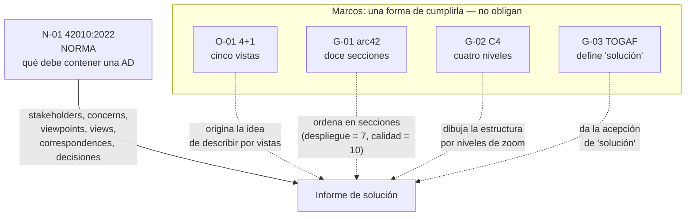

# Estándares y marcos de referencia del informe — `TEM-ESTANDARES`

## Resumen ejecutivo

Detrás de cualquier informe de solución bien hecho hay una norma que dice qué debe contener y uno o varios marcos que ofrecen una forma de contenerlo. La norma es `N-01` ISO/IEC/IEEE 42010:2022: fija los requisitos de una descripción de arquitectura —a quién sirve, qué preocupaciones atiende, con qué vistas, con qué decisiones— sin prescribir cómo dibujarla. Los marcos —arc42, C4, el modelo 4+1, la plantilla SAD de RUP, la definición de arquitectura de solución de TOGAF— proponen cada uno una manera concreta de cumplir esos requisitos, y ninguno tiene la autoridad de la norma.

Esa distinción es el eje del documento y el criterio que esta guía sostiene con más énfasis: **arc42 y C4 son marcos, no normas**. Que arc42 numere el despliegue como sección 7 no convierte «tener una sección de despliegue» en un requisito normativo; lo convierte en lo que arc42 propone. El requisito normativo —que la descripción identifique sus *stakeholders*, sus *concerns* y las vistas que los atienden— está en `N-01`, y arc42 es una de varias formas de satisfacerlo. Confundir la plantilla popular con la norma es el error de citación más frecuente del tema, y `MARCO-CONVENCIONES` lo eleva a la convención más importante de la guía: los cuatro niveles de autoridad.

El documento le sirve a `ACT-01`, que necesita citar bien —invocar la norma cuando algo es obligatorio y nombrar el marco cuando es una elección—, y a `ACT-08`, el auditor, que evalúa un informe ajeno y necesita saber qué puede exigir como incumplimiento normativo y qué solo puede señalar como desviación de un marco. Cierra con la tabla que mapea cada parte del informe a los cuatro referentes a la vez, que es la herramienta operativa de todo el resto de la guía.

---

## Definición

### Qué es cada referente, y qué autoridad tiene

Los cinco referentes que gobiernan este informe se ordenan por nivel de autoridad, según los cuatro niveles de [`MARCO-CONVENCIONES`](../00-Marco-de-Referencia/Convenciones.md).

**`N-01` ISO/IEC/IEEE 42010:2022 — la norma. Nivel normativo.** Especifica los requisitos para la estructura y expresión de una **descripción de arquitectura (AD)**, y distingue la arquitectura de una entidad de la descripción que la expresa. Su cláusula 6 enumera lo que una AD debe contener para estar completa: identificación y visión general de la AD, identificación de los *stakeholders* y sus *concerns*, los *architecture viewpoints* incluidos, las *architecture views* que los realizan, el registro de *correspondences* entre elementos, y el registro de las decisiones de arquitectura con su *rationale*. La norma **no prescribe procesos, métodos, modelos ni notaciones**: fija qué debe estar, no cómo dibujarlo. Su linaje es IEEE 1471-2000 → 42010:2011 → 42010:2022. Es la espina dorsal normativa de la vista de arquitectura del informe.

**`O-01` Kruchten 4+1 — el modelo de vistas. Nivel obra de referencia.** El artículo fundacional de 1995 (*Architectural Blueprints — The «4+1» View Model*) propuso describir una arquitectura por cinco vistas que atienden *concerns* distintos: **lógica** (descomposición, requisitos funcionales), **de proceso** (concurrencia, rendimiento, disponibilidad), **de desarrollo** (organización de módulos), **física** (*«Mapping the Software to Hardware»* — es la vista que corresponde al despliegue) y **escenarios** (el «+1», casos de uso que validan e ilustran las otras cuatro). Es un artículo peer-reviewed, no un estándar: da origen verificable a la idea de «describir por vistas» que `N-01` normaliza, pero no obliga.

**`G-01` arc42 — la plantilla. Nivel marco.** Gernot Starke y Peter Hruschka, versión 9, con licencia CC BY-SA 4.0. Propone una plantilla de **doce secciones**, verificadas verbatim: *1 Introduction & Goals, 2 Constraints, 3 Context & Scope, 4 Solution Strategy, 5 Building Block View, 6 Runtime View, 7 Deployment View, 8 Crosscutting Concepts, 9 Architectural Decisions, 10 Quality Requirements, 11 Risks & Technical Debt, 12 Glossary*. El despliegue es la sección **7**, los requisitos de calidad la **10** y los objetivos la **1**. Es una plantilla excelente y una buena decisión adoptarla, pero su autoridad es la de sus autores, no la de una norma.

**`G-02` C4 — el modelo de diagramas. Nivel marco.** Simon Brown, licencia CC BY 4.0. Propone **cuatro niveles de diagrama** con zoom jerárquico: *System Context, Container, Component, Code*. Su aporte más citado es la definición de *container* —«una aplicación o un almacén de datos… algo que necesita estar en ejecución para que el sistema funcione»—, explícitamente distinta de un contenedor Docker. Entre sus diagramas suplementarios está el de **despliegue**, que ubica instancias de containers dentro de *deployment nodes*. C4 es independiente de notación y de herramienta; esta guía lo dibuja con `flowchart` y `subgraph` porque el soporte C4 nativo de Mermaid es experimental (`P-01`).

**`G-03` TOGAF — la definición de «solución». Nivel marco.** Aporta la única definición de *Solution Architecture* que esta guía cita como fuente: «una descripción de una operación de negocio discreta y focalizada y de cómo IS/IT la soporta… típicamente aplica a un solo proyecto o entrega, ayudando a traducir requisitos en una visión de solución». Fuera de TOGAF, el término «solución» no tiene definición normativa única, y la guía lo declara.

### Punto de vista y vista: la distinción que `N-01` obliga a no mezclar

`N-01` separa dos cosas que el lenguaje corriente confunde. Un **architecture viewpoint** —punto de vista— es la *convención*: define qué *concerns* atiende, para qué *stakeholders*, con qué modelos y notaciones se expresa. Una **architecture view** —vista— es la *aplicación* de ese punto de vista a un sistema concreto: el diagrama y el texto que resultan de mirar este sistema a través de esa convención. El punto de vista es la plantilla; la vista es lo que se llena con ella. La norma exige que la AD declare ambos y que cada vista se gobierne por un punto de vista, precisamente para que el lector sepa qué preguntas responde cada diagrama y cuáles no.

La distinción tiene una consecuencia práctica para el informe. Cuando el redactor decide «voy a incluir una vista de despliegue», está adoptando un punto de vista —el que atiende el *concern* «dónde corre cada cosa y cómo se comunican», con la notación de nodos y artefactos de `N-07` UML—; el diagrama concreto del sistema de audiencias es la vista. Los marcos entran aquí: `O-01`, arc42 y C4 son, en el vocabulario de `N-01`, catálogos de puntos de vista ya definidos. Adoptar «la vista física de 4+1» o «el diagrama de despliegue de C4» es tomar prestado un punto de vista en lugar de definir uno propio, que es exactamente lo que un marco ofrece y una norma no obliga a usar.

### Qué problema resuelve tener este mapa de referentes

Sin él, la prescripción sobre cómo escribir un informe circula sin fuente, y el redactor no distingue lo que debe cumplir de lo que eligió cumplir. El mapa resuelve dos problemas a la vez: le da al autor **respaldo** —puede anclar cada afirmación normativa en `N-01`, `N-04` o `N-06`— y le da **libertad informada** —sabe que la forma concreta, la de arc42 o la de C4, es elegible y por lo tanto discutible. Un informe que cita bien no es más rígido: es más honesto sobre qué parte de sus decisiones son obligatorias y cuáles son gusto defendible.

### Qué NO son estos marcos, y con qué se los confunde

**arc42 no es una norma.** Es el error central que este documento combate. «Lo dice arc42» no tiene el peso de «lo dice ISO/IEC/IEEE 42010». La norma fija *qué requisitos* cumple una descripción de arquitectura; arc42 ofrece *una forma concreta* de cumplirlos, entre otras posibles.

**C4 no es una notación ni una herramienta.** Es un modelo de niveles de zoom, independiente de cómo se dibuje. Confundir «hacer C4» con «usar tal sintaxis» pierde el punto: lo que C4 aporta es la jerarquía Context → Container → Component, no un formato de caja.

**4+1 no es un estándar ni una plantilla de secciones.** Es un modelo conceptual de vistas. La plantilla SAD de RUP (`G-04`) organizó un documento según esas vistas, pero 4+1 en sí no dice «escriba estas secciones»: dice «describa estos cinco puntos de vista».

**Ninguno reemplaza a `N-01`.** Los cuatro son maneras de producir algo que la norma evalúa como completo o incompleto. Se los usa *para* cumplir la norma, no *en lugar* de ella.

---

## El mapa central: cada parte del informe frente a los cuatro referentes

La tabla es la herramienta operativa de todo el resto de la guía. Lee así: una fila es una parte del informe; las columnas dicen qué concepto normativo la respalda (`N-01`), qué vista de `O-01` la origina, qué sección de arc42 (`G-01`) la ubica y qué nivel de C4 (`G-02`) la dibuja. La primera columna es lo que el informe contiene; las otras cuatro son de dónde viene su autoridad y su forma.

| Parte del informe | Concepto de `N-01` 42010 (normativo) | Vista de `O-01` 4+1 | Sección de `G-01` arc42 | Nivel de `G-02` C4 |
|---|---|---|---|---|
| Objetivos y alcance | *Concerns* de los *stakeholders* | Escenarios (+1), parcial | 1 Introduction & Goals; 3 Context & Scope | System Context (nivel 1) |
| Vista de componentes | *Architecture view* (punto de vista estructural) | Lógica; de desarrollo | 5 Building Block View | Container, Component (niveles 2–3) |
| Vista de comportamiento | *Architecture view* (punto de vista dinámico) | De proceso | 6 Runtime View | Diagrama dinámico (suplementario) |
| Vista de despliegue | *Architecture view* (punto de vista físico) | Física — *«mapping to hardware»* | 7 Deployment View | Diagrama de despliegue (suplementario) |
| Requisitos no funcionales | *Concerns* de calidad de los *stakeholders* | Atributos que atiende la vista de proceso | 10 Quality Requirements | — (C4 no cubre calidad) |
| Decisiones y su justificación | *Architecture decisions* + *rationale* (cláusula 6) | — | 9 Architectural Decisions | — |
| Consistencia entre vistas | *Correspondences* entre elementos | Coherencia entre las cinco vistas | Transversal a las secciones | — |

Tres lecturas de la tabla que no son obvias. Primero: la columna de C4 tiene celdas vacías —calidad y decisiones— porque **C4 es un modelo de diagramas de estructura y no cubre requisitos ni rationale**; usarlo como plantilla completa deja fuera dos elementos que `N-01` exige, y ahí es donde arc42, que sí los tiene (secciones 9 y 10), lo complementa. Segundo: la vista de despliegue tiene respaldo en las cuatro columnas —es *architecture view* en `N-01`, vista física en `O-01`, sección 7 en arc42 y diagrama de despliegue en C4—, lo que explica por qué es la parte del informe con la genealogía más sólida y también la que más se descuida. Tercero: la fila de *correspondences* es la que ningún marco pone al frente y `N-01` sí exige —que las vistas sean consistentes entre sí, que el componente de la vista de arquitectura sea el mismo que aparece en la de despliegue—; es el requisito normativo que los informes cumplen peor.



La flecha llena es la única que representa una obligación; las punteadas son elecciones. Un informe puede prescindir de arc42 y de C4 y seguir siendo conforme a `N-01`; no puede prescindir de identificar sus *stakeholders* y sus *concerns* y pretender ser una descripción de arquitectura completa.

---

## Aplicación por escenario

### `ESC-1` — Solución en diseño

La norma y los marcos se aplican en su forma más plena, porque se está diseñando desde cero y conviene decidir la estructura explícitamente. `N-01` recuerda que las decisiones de arquitectura con su *rationale* son parte obligatoria de la AD, y en `ESC-1` esa sección —arc42 9, *Architectural Decisions*— es la más valiosa: registrar las alternativas descartadas ahora evita que después parezcan inevitables. La sección de calidad (arc42 10) se llena con requisitos previstos, no verificados, y hay que marcarlo.

### `ESC-2` — Solución construida

El marco se usa como estructura de un as-built. Aquí la exigencia de `N-01` sobre *correspondences* se vuelve crítica: la vista de despliegue debe corresponder al sistema real, y el componente que la vista de arquitectura nombra tiene que ser el mismo que corre en la topología descrita. Un informe de `ESC-2` que hereda un diagrama de diseño desactualizado viola la correspondencia sin darse cuenta. Los niveles de C4 ayudan a decidir cuánto zoom mostrar según el destinatario: al solicitante técnico suele bastarle el nivel Container.

### `ESC-3` — Solución en evolución o migración

`N-03` 42030, el marco normativo de **evaluación** de arquitectura, gana relevancia porque una migración se justifica comparando el estado actual contra el objetivo atributo por atributo, y esa comparación es una evaluación. La vista de despliegue de arc42 (sección 7) se duplica —actual y objetivo—, y las decisiones (sección 9) llevan el rationale del cambio, que es el corazón del informe de evolución.

### `ESC-4` — Evaluación de una solución ajena

Aquí los referentes se usan como **rúbrica**, no como plantilla. `N-03` 42030 estructura la evaluación en síntesis, valoración de valor y análisis arquitectónico. `N-01` da la lista de lo que una AD completa debe contener, y el evaluador la recorre detectando ausencias: si falta la identificación de *stakeholders*, si no hay registro de decisiones, si las vistas no se corresponden. Saber que arc42 numera el despliegue como 7 no autoriza a exigir esa numeración —es marco, no norma—, pero sí autoriza a exigir que el despliegue esté descrito de alguna forma, porque eso sí es *architecture view* en `N-01`.

### Qué cambia según el contexto

| Contexto | Marco de diagramas que más rinde | Nota |
|---|---|---|
| `CTX-1` Monolito | arc42 5 (Building Block) basta; C4 hasta nivel Component | La vista de despliegue de C4 sobra: un nodo, poco que ubicar |
| `CTX-2` Cliente-servidor | C4 Container + diagrama de despliegue | El nivel Container muestra frontend, API y base como containers separados |
| `CTX-3` Borde distribuido | C4 Deployment con nodos repetidos; arc42 7 detallada | El diagrama de despliegue es el central: terminales, centro y servidor de archivos |
| `CTX-4` Multiservicio | C4 completo, los cuatro niveles con zoom | Es el contexto para el que la jerarquía de C4 fue pensada |

El sistema de audiencias (`CTX-3`) es el caso donde el diagrama de despliegue de C4 y la sección 7 de arc42 hacen el trabajo pesado: hay componentes en cada terminal del cliente y en el centro, y la norma exige que la vista física los muestre a todos con sus *communication paths* (`N-07` UML aporta la notación de nodos y artefactos para dibujarlo). Un informe de ese sistema que se quedara en el nivel Container de C4 —sin bajar al diagrama de despliegue— omitiría precisamente lo que lo hace interesante.

---

## Ejemplos concretos

Todos los ejemplos son **sintéticos** y pertenecen al sistema de gestión de audiencias (`CTX-3`).

### Una afirmación citada mal y citada bien

Así no —la plantilla presentada como norma:

> El informe **debe** incluir una sección 7 de despliegue y una sección 10 de requisitos de calidad, según el estándar de arquitectura.

No hay ningún estándar que numere las secciones. La numeración es de `G-01` arc42, que es un marco. La afirmación mezcla un requisito real —describir el despliegue y la calidad— con una forma opcional —numerarlos 7 y 10— y le presta a ambos la autoridad de una norma que no los dice así.

Así sí —cada afirmación con su nivel:

> La descripción debe cubrir el despliegue y los requisitos de calidad, porque `N-01` 42010 exige *architecture views* que atiendan los *concerns* de los *stakeholders*, y en este sistema la operación degradada y la disponibilidad son *concerns* de primer orden. Este informe los organiza en las secciones que `G-01` arc42 numera como 7 (*Deployment View*) y 10 (*Quality Requirements*), por seguir esa plantilla; la elección de estructura es de marco, no normativa.

La segunda versión afirma lo mismo que la primera pero deja claro qué es obligatorio (cubrir despliegue y calidad, por `N-01`) y qué es una elección (organizarlo à la arc42). Un auditor puede aceptar lo primero y discutir lo segundo, que es exactamente lo que corresponde.

### El mismo requisito, mapeado a los cuatro referentes

El requisito «la audiencia puede iniciarse y grabarse aunque el backend esté caído» es un *concern* de disponibilidad y tolerancia a fallos. Ubicarlo en el mapa muestra cómo los referentes se combinan sin pisarse:

> Este comportamiento es, en términos de `N-01`, un *concern* de un *stakeholder* (el operador de sala) que la AD debe atender con una o más *views*. En `O-01`, es un atributo de la **vista de proceso** (disponibilidad y concurrencia). En `G-01` arc42, se documenta en la sección **10 (Quality Requirements)** con el escenario de calidad concreto, y su mecanismo se ve en la **6 (Runtime View)**. En `N-04` 25010, la característica de calidad implicada es *Reliability*. El informe lo cruza además con la vista de despliegue, porque el mecanismo —el servicio en segundo plano opera con una cola local— solo se entiende viendo dónde corre.

Ninguna de esas coordenadas sobra: cada una respalda una parte distinta de la misma afirmación, y juntas la hacen trazable hasta la norma en lugar de dejarla como aserción del autor.

---

## Preguntas guía

- Esta afirmación que estoy por hacer, ¿viene de `N-01` (obligatoria), de un marco como arc42 o C4 (una forma entre varias), o es criterio propio? ¿Puedo nombrar cuál?
- ¿Estoy usando la numeración de secciones de arc42 como si fuera un requisito normativo? ¿Sé que es una plantilla?
- ¿Mi informe identifica sus *stakeholders* y sus *concerns*, como `N-01` exige, o salté directo a los diagramas?
- ¿Las vistas de mi informe se corresponden entre sí —el componente que nombro en arquitectura es el que corre en el despliegue—, o hereda cada una de un documento distinto?
- Si uso C4, ¿cubrí las decisiones y la calidad por otra vía, ya que C4 no las incluye?
- Para un informe de `CTX-3`, ¿bajé al diagrama de despliegue, o me quedé en el nivel Container y omití lo que hace interesante al sistema?

---

## Criterios de calidad

### Buena aplicación de estándares y marcos

Cada afirmación normativa se ancla en su fuente con designación exacta —`N-01` 42010:2022, no «el estándar de arquitectura»— y cada elección de forma se atribuye a su marco —«se organiza según arc42», «se dibuja en niveles de C4»— sin prestarle la autoridad de una norma. La descripción cubre lo que `N-01` exige: *stakeholders*, *concerns*, vistas que los atienden, correspondencias entre vistas y decisiones con su rationale. Cuando se combina C4 con arc42, se hace conscientemente: C4 para los diagramas de estructura y despliegue, arc42 para la calidad y las decisiones que C4 no cubre.

### Aplicación pobre y antipatrones

**La plantilla ascendida a norma.** «El estándar exige una sección de despliegue» cuando quien lo exige es arc42. Es el antipatrón que este documento existe para desarmar. Se detecta pidiendo la designación: si la respuesta es «arc42» o «C4», no es una norma.

**C4 tomado como plantilla completa.** Un informe que hace los cuatro niveles de C4 y se olvida de las decisiones y de la calidad, porque C4 no las tiene. Cumple una forma y viola dos elementos que `N-01` exige.

**Las vistas huérfanas.** Diagramas de arquitectura y de despliegue heredados de documentos distintos, que nombran los componentes de forma inconsistente. Viola las *correspondences* de `N-01`, y es el incumplimiento normativo más común porque nadie lo revisa.

**La cita de año ausente.** «ISO 25010» sin año, cuando la edición 2011 tenía ocho características de calidad y la vigente `N-04` 25010:2023 tiene nueve. `MARCO-CONVENCIONES` exige citar la designación con año justamente para detectar material desactualizado.

**El marco como coartada de exhaustividad.** Completar las doce secciones de arc42 aunque el sistema no dé para tanto, produciendo relleno en las secciones que no aplican. arc42 mismo admite omitir lo que no aporta; llenar por completar traiciona la naturaleza sintética del informe que `TEM-QUE-ES` define.

---

## Anexo — Tabla de trazabilidad normativa del informe

Se completa por sección del informe, y deja registrado de qué referente proviene cada parte y con qué nivel de autoridad. Es el insumo que un auditor (`ACT-08`) recorre para separar incumplimientos normativos de desviaciones de marco.

| Sección del informe | Elemento de `N-01` que cumple | Nivel de la exigencia | Marco de forma adoptado | ¿Correspondencia con otras vistas verificada? |
|---|---|---|---|---|
| Resumen ejecutivo | Visión general de la AD; *concerns* del decisor | Normativo (contenido) / criterio propio (forma) | arc42 1 | n/a |
| Contexto y alcance | *Stakeholders* y *concerns* | Normativo | arc42 3; C4 System Context | — |
| Vista de componentes | *View* estructural | Normativo (que exista) | arc42 5; C4 Container/Component | sí / no |
| Vista de comportamiento | *View* dinámica | Normativo (si hay *concern* dinámico) | arc42 6; C4 dinámico | sí / no |
| Vista de despliegue | *View* física | Normativo | arc42 7; C4 despliegue; notación `N-07` | sí / no |
| Requisitos no funcionales | *Concerns* de calidad | Normativo (que se atiendan); `N-04` cataloga | arc42 10 | sí / no |
| Decisiones y rationale | *Architecture decisions* + *rationale* | Normativo (cláusula 6) | arc42 9 | — |

```yaml
informe: ""
marco_de_forma_principal: arc42 | C4 | 4+1 | SAD-RUP | ninguno_explicito
combinaciones:
  estructura_y_despliegue: C4 | arc42 | otro
  decisiones_y_calidad: arc42 | otro    # C4 no las cubre; declarar de dónde salen
elementos_n01_presentes:
  stakeholders_y_concerns: si | no
  views_por_concern: si | no
  correspondences_verificadas: si | no   # el que más se omite
  decisiones_con_rationale: si | no
citas:
  normas_con_designacion_y_ano: si | no  # N-01 42010:2022, N-04 25010:2023
  marcos_declarados_como_marco: si | no  # arc42/C4 no presentados como norma
```

La columna «¿correspondencia verificada?» de la tabla es la que un informe descuida y una norma exige. Marcar «no» en cualquier fila no es un detalle de forma: es un incumplimiento de `N-01`, y significa que las vistas del informe podrían estar describiendo sistemas ligeramente distintos sin que nadie lo haya comprobado.
