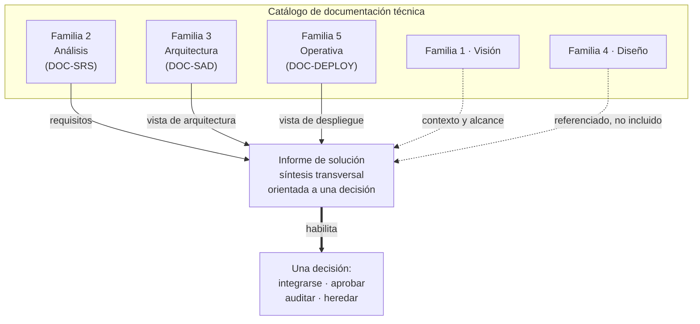

# Qué es y qué no es el informe de solución — `TEM-QUE-ES`

## Resumen ejecutivo

El informe de solución es un único documento que describe un sistema de software en tres dimensiones a la vez —cómo está organizado, dónde y cómo corre, y cómo resuelve lo que le pidieron— para un lector que no lo conoce y necesita comprenderlo con un fin concreto. No es la biblioteca completa de la documentación técnica: es una síntesis transversal que atraviesa esa biblioteca y toma de cada parte lo que sirve a una decisión. El disparador de esta guía lo enuncia sin ambigüedad —«un documento que describa la solución propuesta en términos de arquitectura, despliegue y resolución de requisitos funcionales y no funcionales» para «comprender mejor el enfoque general» (`MARCO-ESCENARIOS`)—, y esa frase es a la vez la definición del objeto y su límite.

La dificultad no está en escribir cada parte, que la [guía hermana](../../Documentacion-Tecnica/README.md) ya trata documento por documento, sino en entender que ninguna de esas partes es el informe. Un SAD describe la arquitectura con el detalle de quien la va a construir; una Deployment Guide instruye a quien la va a instalar; una SRS cataloga los requisitos para quien los va a verificar. El informe de solución hace algo que ninguno hace: los **cruza** en un relato orientado a una decisión —integrarse, auditar, recibir, aprobar— y renuncia al detalle exhaustivo de cada uno a cambio de la vista de conjunto que ninguno da por separado.

Este documento le sirve a `ACT-01`, que tiene que decidir qué está escribiendo antes de escribirlo, y a `ACT-03`, el solicitante técnico que lo va a leer y necesita saber qué puede esperar de él y qué no. La confusión de naturaleza —creer que se pidió un SAD, o entregar un folleto cuando se pidió material auditable— es el error que este documento previene, y es anterior a cualquier problema de redacción.

---

## Definición

### Qué es

Un **informe de solución** es un documento transversal que sintetiza, en una sola pieza y con un hilo narrativo, la arquitectura de un sistema, su despliegue y la forma en que resuelve sus requisitos funcionales y no funcionales, dirigido a un lector que quiere comprender el enfoque general para tomar una decisión. Tres rasgos lo definen y ninguno es prescindible.

Es **transversal**: cruza materias que la documentación técnica trata por separado —análisis, arquitectura, operativa— en lugar de desarrollar una sola. Es **sintético**: elige qué mostrar y con cuánto detalle en función de la decisión que habilita, y referencia el resto en vez de reproducirlo. Y está **orientado a una decisión**: existe porque alguien necesita decidir algo sobre la base de lo que lee, y ese propósito gobierna qué se incluye, con qué peso y en qué orden. Quitarle cualquiera de los tres lo convierte en otra cosa: sin transversalidad es un documento de arquitectura; sin síntesis es la biblioteca completa; sin decisión es una descripción que no sabe a quién sirve.

El término «solución» no tiene una definición normativa única, y esta guía lo declara siguiendo a [`MARCO-CONVENCIONES`](../00-Marco-de-Referencia/Convenciones.md): `G-03` TOGAF define *Solution Architecture* —«una descripción de una operación de negocio discreta y focalizada y de cómo IS/IT la soporta… típicamente aplica a un solo proyecto o entrega, ayudando a traducir requisitos en una visión de solución»— y fuera de ese marco el vocablo es de uso corriente sin fuente única. La guía lo usa en su acepción práctica: la solución es el sistema propuesto o construido, con su arquitectura, su despliegue y su forma de resolver los requisitos, y el informe es el documento que lo describe.

### Qué problema resuelve

Un lector técnico competente puede leer un SAD, un SRS y una Deployment Guide y aun así no entender la solución, porque cada uno responde a su propia pregunta y ninguno responde «¿cómo se sostiene esto en conjunto?». El problema que el informe resuelve es de **integración de vistas para una decisión**: reunir en un solo lugar lo que basta para que `ACT-03` reconstruya el enfoque, ubique cada requisito no funcional contra el mecanismo que lo atiende, y forme un juicio —integrarse o no, aprobar o no, aceptar la entrega o no— sin tener que leer la biblioteca entera ni reconstruir el hilo que la conecta.

Ese problema aparece cuando alguien externo al equipo que construyó el sistema necesita comprenderlo: un socio que evalúa integrarse, un organismo que recibe una entrega, un auditor que juzga la calidad, un patrocinador que decide financiar. Ninguno tiene el tiempo ni el contexto para recorrer veinte documentos, y ninguno necesita el detalle de implementación de cada uno. Necesitan el enfoque, con la profundidad justa para decidir y la trazabilidad justa para confiar.

### Qué NO es, y con qué se lo confunde

**No es un SAD completo.** El [`DOC-SAD`](../../Documentacion-Tecnica/30-Arquitectura/SAD.md) de la guía hermana describe la arquitectura con el detalle de quien la va a construir y mantener: todas las vistas, todos los componentes, todas las decisiones. El informe toma de él la vista de arquitectura y la resume a lo que la decisión requiere; un informe que reproduce el SAD entero perdió su naturaleza sintética y le entrega al lector el problema que venía a resolverle. La relación correcta es que el informe **referencia** el SAD para el detalle y **sintetiza** lo esencial en su cuerpo.

**No es un SRS.** El [`DOC-SRS`](../../Documentacion-Tecnica/20-Analisis/SRS.md) cataloga los requisitos con el rigor de `N-06` 29148 —cada requisito necesario, verificable, singular— para que puedan trazarse y probarse uno por uno. El informe no cataloga: **cruza** los requisitos contra la arquitectura y el despliegue para mostrar cómo se resuelven, y ese cruce es lo que el SRS no hace. Un informe que enumera doscientos requisitos numerados sin conectarlos con los mecanismos que los atienden convirtió una síntesis en un índice.

**No es una Deployment Guide operativa.** La [`DOC-DEPLOY`](../../Documentacion-Tecnica/50-Operativa/Deployment-Guide.md) instruye a `ACT-04` sobre cómo instalar y desplegar el sistema, paso a paso, con comandos y parámetros. El informe describe la **topología** de despliegue y sus decisiones —qué corre dónde, por qué, con qué consecuencia para los requisitos no funcionales— para que el lector la comprenda, no para que la ejecute. La distinción es la de un mapa frente a un instructivo de manejo: el informe dibuja el territorio, la Deployment Guide dice cómo transitarlo.

**No es un manual de usuario.** El manual enseña a operar el sistema a quien lo usa; el informe explica cómo está hecho a quien lo evalúa. Se confunden rara vez, pero cuando un informe empieza a describir pantallas y flujos de uso perdió de vista que su lector no va a usar el sistema sino a juzgarlo.

Lo que el informe **sí** es, y ninguno de los anteriores: una síntesis orientada a una decisión. Todos los documentos citados son insumos legítimos; el informe es el único que los compone en un relato con un destinatario y un fin.

---

## El lugar del informe en el catálogo de familias

El catálogo de referencia agrupa la documentación técnica en siete familias según la pregunta que cada una responde. El informe de solución no es ninguna de ellas: **vive en la intersección de tres** y toma de cada una lo que su pregunta —«explíquenme el enfoque general»— necesita.

| Familia | Pregunta | Qué aporta al informe |
|---|---|---|
| 1 · Visión | ¿Qué queremos construir? | Contexto y alcance, como encuadre |
| 2 · Análisis | ¿Qué debe hacer el sistema? | **Los requisitos funcionales y no funcionales** que el informe cruza |
| 3 · Arquitectura | ¿Cómo estará organizado? | **La vista de arquitectura**, sintetizada del `DOC-SAD` |
| 4 · Diseño | ¿Cómo se implementa cada componente? | Detalle referenciado, no incluido |
| 5 · Operativa | ¿Cómo se instala, mantiene y opera? | **La vista de despliegue**, sin el instructivo de la `DOC-DEPLOY` |
| 6 · Desarrollo | ¿Cómo trabajamos sobre el proyecto? | Fuera de alcance |
| 7 · Usuarios | ¿Cómo se usa el sistema? | Fuera de alcance |

Las tres familias en negrita —análisis (2), arquitectura (3) y operativa (5)— son las que el informe sintetiza; las demás quedan como encuadre, como referencia o fuera de alcance. Esa intersección es exactamente el pedido que abre la guía: arquitectura, despliegue y requisitos, ni más ni menos. Un informe que se derrama hacia la familia 4 empieza a describir implementación que el lector no necesita; uno que se derrama hacia la 7 confunde evaluación con uso.



## Relación con `N-01` 42010: contiene una descripción de arquitectura, y algo más

`N-01` ISO/IEC/IEEE 42010:2022 —*Architecture description*, nivel **normativo**— especifica los requisitos para la estructura y expresión de una descripción de arquitectura (AD): qué debe contener para estar completa. Su cláusula 6 enumera, entre otros elementos, la identificación de los *stakeholders*, sus *concerns*, los *architecture viewpoints* y las *architecture views* que los atienden, las *correspondences* entre elementos y el registro de decisiones de arquitectura con su *rationale*. Es la columna vertebral normativa de todo lo que este informe describe sobre arquitectura, y se desarrolla en [`TEM-ESTANDARES`](Estandares-y-Marcos.md).

La relación exacta entre la norma y este informe conviene enunciarla con cuidado: **el informe de solución contiene una descripción de arquitectura en el sentido de `N-01`, pero no se agota en ella**. La AD responde a «¿cómo está organizado el sistema?»; el informe responde a esa pregunta y a dos más que la norma no cubre —«¿dónde y cómo corre?» y «¿cómo resuelve sus requisitos?»— y las une en un relato dirigido a una decisión. Dicho de otro modo: una AD conforme a `N-01` es un insumo necesario del informe, no el informe. Quien confunde ambos escribe una descripción de arquitectura impecable y deja al lector sin la vista de despliegue y sin el cruce de requisitos que motivaron el pedido.

Esa distinción también fija el nivel de autoridad de cada afirmación del informe, según los cuatro niveles de `MARCO-CONVENCIONES`. Lo que el informe afirma sobre qué debe contener una AD es **normativo** y se ancla en `N-01`. Lo que afirma sobre cómo organizar sus diagramas —en secciones tipo arc42, en niveles tipo C4— es **marco**, no norma. Y lo que afirma sobre cuánto detalle merece cada parte es **criterio propio** de esta guía. Marcar el nivel en el texto no es un formalismo: es lo que permite al lector aceptar unas afirmaciones como obligatorias y discutir otras como opinables.

---

## Aplicación por escenario

El «qué es» del informe cambia de sentido según desde dónde se escribe. La estructura del documento puede ser idéntica; lo que cada sección puede afirmar, no.

### `ESC-1` — Solución en diseño

El informe es una **propuesta**: describe la solución que se piensa construir para que alguien decida si aprobarla. Su naturaleza es la de un documento de intención fundamentada, no de hechos. Aquí «qué es» tiene una carga particular: es lo que distingue la propuesta de una promesa. Un informe de `ESC-1` honesto marca en cada afirmación su estado —decidido, propuesto, por confirmar— y no describe la solución en futuro perfecto como si ya funcionara. Confundir la naturaleza propositiva con la descriptiva induce a decidir sobre una certeza que no existe.

### `ESC-2` — Solución construida

Es el escenario del pedido que abre la guía, y donde la naturaleza del informe es más clara: describe **lo que hay** —la arquitectura tal como quedó, el despliegue tal como corre— para que un tercero lo comprenda. Aquí el informe es una síntesis as-built, y su corrección se mide contra el sistema real: cada afirmación debe poder confrontarse con el sistema en ejecución y sobrevivir. La trampa de naturaleza propia de `ESC-2` es describir la intención en lugar de la realidad, y produce un informe elegante e inútil. El informe de `ESC-2` no es el diseño original: es la descripción del sistema, con sus divergencias respecto del plano declaradas.

### `ESC-3` — Solución en evolución o migración

El informe describe la solución **en transición**: de dónde parte, a dónde va, por qué conviene el cambio. Su naturaleza es comparativa, y eso agrega una dimensión que los otros escenarios no tienen —el estado de partida— sin la cual la pregunta del lector («¿conviene migrar?») no tiene respuesta posible. Aquí «qué es» incluye qué se conserva, qué se reemplaza y qué convive durante la transición. Un informe de evolución que describe solo el destino y omite el punto de partida no es un informe técnico sino una pieza de venta.

### `ESC-4` — Evaluación de una solución ajena

El informe no se escribe: se **lee críticamente**, o se reconstruye desde el sistema cuando no existe. Aquí la naturaleza del informe se invierte: el objeto de trabajo es detectar qué le falta a un informe ajeno para ser lo que dice ser —el que describe la arquitectura pero no el despliegue, el que enumera funcionales y calla no funcionales. `N-03` 42030 da respaldo normativo a esta evaluación. Saber qué es un informe de solución completo es exactamente lo que permite juzgar uno incompleto, y por eso este documento es tanto una guía para escribir como una rúbrica para evaluar.

### Qué cambia según el contexto

| Contexto | Qué es el informe, con acento distinto | Riesgo de naturaleza |
|---|---|---|
| `CTX-1` Monolito | Sobre todo una descripción de arquitectura lógica; el despliegue es una nota | Inflar el despliegue con relleno para «completar» las tres dimensiones |
| `CTX-2` Cliente-servidor | Una síntesis equilibrada de las tres dimensiones | Olvidar los contratos entre nodos, que son parte del enfoque |
| `CTX-3` Borde distribuido | Sobre todo una descripción de despliegue y resiliencia; la instalación y la operación degradada son el corazón | Tratar la instalación por terminal como detalle y no como parte central |
| `CTX-4` Multiservicio | Una síntesis con jerarquía de zoom; la vista de componentes necesita niveles | Aplanar: describir cada servicio con igual peso y ocultar lo central |

El sistema de gestión de audiencias de `MARCO-CONTEXTOS` pertenece a `CTX-3`, y por eso su informe es, ante todo, la descripción de cómo un sistema distribuido en el borde sigue funcionando con el centro caído. Un informe de ese sistema que dedicara tres párrafos al despliegue estaría mal calibrado respecto de su propia naturaleza.

---

## Ejemplos concretos

Todos los ejemplos son **sintéticos** y pertenecen al sistema de gestión de audiencias de `MARCO-CONTEXTOS` (`CTX-3`): programa de escritorio y servicio en segundo plano por terminal, backend central con PostgreSQL, frontend Blazor administrativo, servidor de archivos FTP o tus.

### El mismo hecho, en tres documentos distintos y en el informe

La subida diferida de videos —al cerrar una audiencia, los videos siguen subiéndose en segundo plano— aparece en varios documentos con propósitos distintos. Ver la diferencia aclara qué es el informe.

En el `DOC-SRS`, como requisito catalogable:

> **RNF-07 (Recuperabilidad de subida).** Al cerrar una audiencia, la transferencia de sus videos al servidor de archivos debe continuar en segundo plano sin bloquear el inicio de una nueva audiencia. Verificable: cerrar una audiencia con una subida en curso y confirmar que una nueva puede iniciarse antes de que la anterior termine.

En la `DOC-DEPLOY`, como instrucción operativa:

> Configurar el servicio en segundo plano con `Restart=on-failure` y un directorio de cola persistente en `C:\ProgramData\Audiencias\cola`. Verificar que el servicio arranca tras reinicio del equipo (`sc qc AudienciasWorker`).

En el **informe de solución**, como parte del enfoque, cruzando arquitectura, despliegue y requisito en un solo párrafo:

> La subida de videos se resuelve desacoplando la captura de la transferencia: el servicio en segundo plano (Worker Service, `N-12`) escribe los videos en una cola local persistente y los sube al servidor de archivos de forma reanudable, de modo que cerrar una audiencia no espera a que la subida termine. Esta decisión atiende el requisito de que el operador pueda iniciar una nueva audiencia de inmediato (RNF-07), y explica por qué el despliegue del Worker exige un directorio de cola con persistencia entre reinicios. El protocolo de subida reanudable (tus, `F-01`) se eligió sobre FTP plano (`N-08`) porque una subida de varios gigabytes no puede reiniciarse desde cero si el enlace se corta.

El informe no reproduce el requisito ni la instrucción: los **cruza** y agrega el porqué. Ese párrafo es lo que ni el SRS ni la Deployment Guide contienen, y es la naturaleza del informe en una sola muestra.

### Un fragmento que traicionó su naturaleza

El siguiente encabezado pertenece a un informe que se creyó un SAD:

> **3.4.2.1 Detalle de la clase `AudienciaUploadQueue` y sus dependencias.** El campo `_pendingSegments` es una `ConcurrentQueue<SegmentDescriptor>` que…

Un lector `ACT-03` que evalúa integrarse no necesita el nombre del campo privado: necesita saber que hay una cola persistente y qué garantiza. El fragmento describe implementación —material de la familia 4, referenciable— con el detalle de quien mantiene el código, y confunde el informe con el `DOC-SAD` o directamente con el fuente. La versión fiel a la naturaleza del informe diría, en una línea: «la cola de subida persiste en disco para sobrevivir a un reinicio del equipo; su diseño interno está en el `DOC-SAD`».

---

## Preguntas guía

- ¿Estoy escribiendo una síntesis orientada a una decisión, o la biblioteca completa disfrazada de informe?
- ¿Qué decisión concreta va a tomar el lector con este documento? Si no la puedo nombrar, ¿por qué le estoy dando el mismo peso a todo?
- Para cada sección: ¿esto es del informe, o pertenece al `DOC-SAD`, al `DOC-SRS` o a la `DOC-DEPLOY` y debería referenciarlo en lugar de reproducirlo?
- ¿El informe cruza requisitos con arquitectura y despliegue, o solo yuxtapone tres descripciones que nunca se tocan?
- ¿La descripción de arquitectura que incluyo alcanza para reconstruir el enfoque, sin convertirse en el detalle de quien lo va a construir?
- ¿Estoy describiendo implementación (familia 4) o uso (familia 7) cuando debería quedarme en la intersección 2-3-5?

---

## Criterios de calidad

### Informe bueno

Se reconoce la decisión que habilita desde el resumen ejecutivo, y todo lo que sigue se ordena en función de esa decisión. La descripción de arquitectura basta para reconstruir el enfoque y remite al `DOC-SAD` para el detalle, sin reproducirlo. Cada requisito no funcional aparece cruzado con el mecanismo que lo atiende, no listado por su cuenta. Las tres dimensiones —arquitectura, despliegue, requisitos— se tocan: el lector ve cómo una decisión de despliegue sostiene un requisito de calidad, y no tres capítulos que nunca dialogan.

El nivel de autoridad de cada afirmación es explícito: lo normativo se ancla en `N-01`, `N-04` o `N-06`; lo que es forma se atribuye a arc42 o C4 como marco; lo que es criterio de esta guía se declara como tal.

### Informe pobre y antipatrones

**El SAD disfrazado.** El informe reproduce la arquitectura con detalle de implementación, entrega al lector la biblioteca completa y le deja el trabajo de síntesis que venía a hacerle. Síntoma: nombres de clases privadas, árboles de carpetas, todas las vistas sin jerarquía. Se corrige referenciando el `DOC-SAD` y resumiendo a lo que la decisión pide.

**Las tres islas.** Arquitectura, despliegue y requisitos aparecen como tres secciones que nunca se cruzan. El lector tiene los materiales pero no el enfoque, porque lo que lo constituye —cómo una decisión atiende un requisito— no está escrito. Es el antipatrón más frecuente y el que mejor delata que el autor yuxtapuso documentos existentes en lugar de componer uno.

**El folleto.** Por evitar el SAD disfrazado, el informe se vacía hasta que no queda nada que auditar: afirma disponibilidad sin decir cómo se mide, describe resiliencia sin nombrar el mecanismo. Sirve al decisor y traiciona al solicitante técnico, que no encuentra qué evaluar. La `DOC-SECARQ` y el resto del detalle se referencian, pero el cuerpo tiene que dejar algo verificable.

**La confusión de autoridad.** «El informe debe tener una sección 7 de despliegue» enunciado como regla universal, cuando es lo que `G-01` arc42 propone, no lo que `N-01` exige. Atribuir a una plantilla la fuerza de una norma es el error de citación que `MARCO-CONVENCIONES` señala como el más frecuente del tema, y `TEM-ESTANDARES` lo desarma.

**El derrame de alcance.** El informe empieza a describir implementación (familia 4) o modos de uso (familia 7) y abandona la intersección 2-3-5 que le da identidad. Cada párrafo que no sirve a la decisión que el informe habilita es un párrafo que sobra.

---

## Anexo — Lista de verificación de naturaleza

Se completa al inicio de la redacción, antes de escribir una sola sección técnica, y define qué es y qué no es este informe en particular.

```yaml
informe: ""
escenario: ESC-?                       # ver MARCO-ESCENARIOS
contexto: CTX-?                        # ver MARCO-CONTEXTOS
decision_que_habilita: ""             # la más determinante; si está vacía, revisar
destinatario_principal: ACT-??         # ver MARCO-ACTORES y TEM-AUDIENCIA

naturaleza:
  es_sintesis_transversal: si          # debe ser si; si es no, no es este informe
  cruza_las_tres_dimensiones:
    arquitectura: si | no
    despliegue: si | no
    requisitos: si | no
  las_dimensiones_dialogan: si | no     # ¿hay párrafos que cruzan una con otra?

limites:
  referencia_en_lugar_de_reproducir:
    - documento: DOC-SAD
      ruta: ../../Documentacion-Tecnica/30-Arquitectura/SAD.md
      se_referencia: si | no
    - documento: DOC-SRS
      ruta: ../../Documentacion-Tecnica/20-Analisis/SRS.md
      se_referencia: si | no
    - documento: DOC-DEPLOY
      ruta: ../../Documentacion-Tecnica/50-Operativa/Deployment-Guide.md
      se_referencia: si | no
  familias_fuera_de_alcance: [4-diseno, 6-desarrollo, 7-usuarios]
  derrames_detectados: []               # secciones que se fueron de la intersección 2-3-5

autoridad:
  afirmaciones_normativas_ancladas: si | no   # N-01, N-04, N-06 citados con designación
  marcos_declarados_como_marco: si | no       # arc42, C4 nombrados, no impuestos como norma
  criterio_propio_declarado: si | no
```

El campo `decision_que_habilita` es el que gobierna todos los demás. Un informe que no sabe qué decisión habilita describe todo con el mismo peso, y `las_dimensiones_dialogan: no` es su síntoma más fiable: sin una decisión que las una, las tres vistas quedan como islas.
