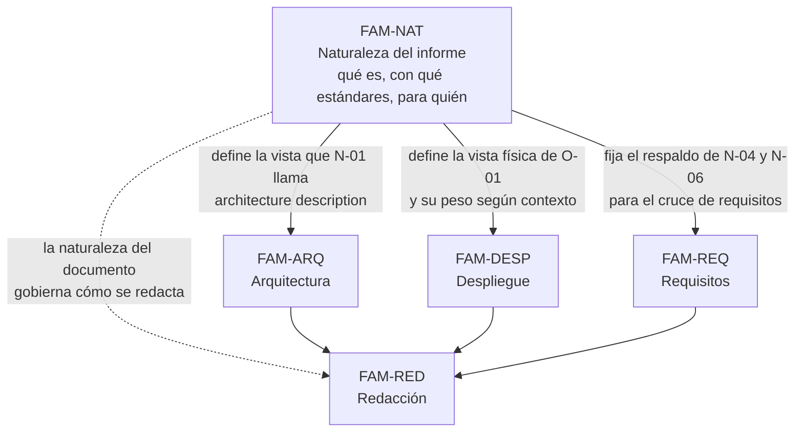

# Naturaleza del informe — `FAM-NAT`

## La pregunta que responde esta familia

**¿Qué es este informe, con qué estándares se relaciona y para quién se escribe?**

Antes de aprender a redactar la vista de arquitectura, la de despliegue o el cruce de requisitos, hay que resolver tres cosas que el redactor suele dar por sabidas y casi nunca lo están: qué clase de documento está por escribir, qué autoridad respalda cada afirmación que hará, y a quién le sirve el resultado. Un informe que confunde su naturaleza —que se cree un SAD y termina siendo una biblioteca, o que se cree un resumen ejecutivo y no deja nada que auditar— falla antes de la primera sección técnica. Esta familia fija esas tres coordenadas para que las tres familias de contenido que siguen tengan sobre qué apoyarse.

El pedido que origina la guía es explícito sobre lo que quiere: «un documento que describa la solución propuesta en términos de arquitectura, despliegue y resolución de requisitos funcionales y no funcionales» para «comprender mejor el enfoque general» ([`MARCO-ESCENARIOS`](../00-Marco-de-Referencia/Escenarios.md)). Ese enunciado esconde tres decisiones que esta familia hace explícitas: es un solo documento transversal y no una colección, se apoya en marcos y normas que conviene nombrar sin confundir su autoridad, y se dirige a un lector concreto —`ACT-03`— que no comparte el contexto del autor.

---

## Documentos

| Documento | ID | Qué establece |
|---|---|---|
| [Qué es y qué no es](Que-es-y-que-no-es.md) | `TEM-QUE-ES` | El informe como síntesis transversal orientada a una decisión; qué problema resuelve, con qué documentos se lo confunde —SAD, SRS, Deployment Guide, manual— y su lugar en el catálogo de siete familias |
| [Estándares y marcos](Estandares-y-Marcos.md) | `TEM-ESTANDARES` | El respaldo normativo (`N-01` 42010) y los marcos que ofrecen una forma de cumplirlo (arc42, C4, TOGAF, 4+1); la tabla que mapea cada parte del informe a los cuatro |
| [Audiencia y propósito](Audiencia-y-Proposito.md) | `TEM-AUDIENCIA` | Para quién y para habilitar qué decisión; la estratificación resumen/cuerpo/anexos según `ACT-06`, `ACT-03` y `ACT-04`, y cómo el propósito cambia qué incluir |

El orden de lectura es el de la tabla. [`TEM-QUE-ES`](Que-es-y-que-no-es.md) delimita el objeto, [`TEM-ESTANDARES`](Estandares-y-Marcos.md) le da respaldo y vocabulario preciso, y [`TEM-AUDIENCIA`](Audiencia-y-Proposito.md) lo orienta hacia un lector y una decisión. Los tres se apoyan en el marco de referencia y ninguno reescribe lo que la [guía hermana de documentación técnica](../../Documentacion-Tecnica/README.md) ya trata por documento.

---

## Cómo se relaciona con las demás familias

Esta familia precede a las tres de contenido —arquitectura, despliegue y requisitos— porque cada una desarrolla una parte del informe cuya identidad y respaldo `FAM-NAT` ya estableció. La arista hacia [`FAM-RED`](../50-Redaccion/README.md) es punteada y distinta: la redacción no recibe una parte del contenido sino una restricción sobre todo él. Saber que el informe es una síntesis orientada a una decisión, y no un SAD exhaustivo, es lo que le dice al redactor cuánto detalle merece cada sección y qué puede referenciar en lugar de repetir. Sin esa definición previa, la familia de redacción no tiene criterio con qué operar.

---

## Qué se lleva el lector de esta familia

Tres capacidades, en orden de utilidad decreciente.

Distinguir el informe de solución de los documentos con los que se lo confunde, y saber decir qué toma de cada uno sin convertirse en ninguno. Es lo que evita el error más caro del tema: escribir un SAD completo cuando pedían una síntesis, o una síntesis vacía cuando pedían material auditable.

Nombrar la autoridad de cada afirmación. Que `N-01` 42010 dice *qué* debe contener una descripción de arquitectura, y que arc42 o C4 ofrecen *una forma* de cumplirlo entre varias, es la distinción que [`MARCO-CONVENCIONES`](../00-Marco-de-Referencia/Convenciones.md) fija y que esta familia ejercita en el caso más cargado de confusión: el de una plantilla popular citada como si fuera norma.

Identificar al destinatario y la decisión que va a tomar, antes de escribir. Un informe que no sabe qué decisión habilita describe todo con el mismo peso, que es la forma más segura de no servir a ninguna.
