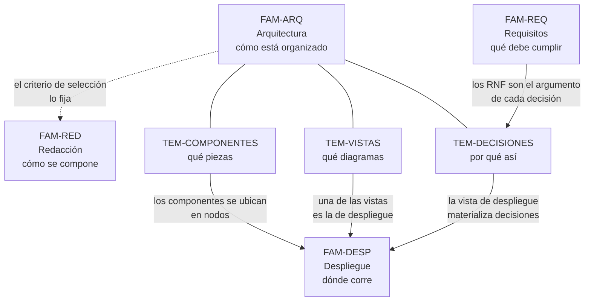

# Arquitectura en el informe — `FAM-ARQ`

## La pregunta que responde esta familia

**¿Cómo describo la arquitectura de la solución para que un tercero la entienda y pueda juzgarla?**

La palabra clave es *tercero*. El autor entiende su propia arquitectura sin ayuda; el desafío es que la entienda `ACT-03`, el solicitante técnico que tiene criterio pero no conoce el sistema, y que la entienda lo bastante para formarse un juicio propio en lugar de aceptar el del autor. Esa vara —comprensión ajena que habilita evaluación ajena— es más exigente que dibujar cajas, y es la que gobierna las tres decisiones de esta familia: **qué componentes nombrar**, **qué vistas dibujar** y **qué decisiones explicar**.

Esta familia no enseña a escribir un documento de arquitectura completo. Eso lo trata la guía hermana con el [SAD](../../Documentacion-Tecnica/30-Arquitectura/SAD.md) (`DOC-SAD`), el [HLD](../../Documentacion-Tecnica/30-Arquitectura/HLD.md) (`DOC-HLD`) y los [ADR](../../Documentacion-Tecnica/30-Arquitectura/ADR.md) (`DOC-ADR`). Aquí el objeto es la **sección de arquitectura de un informe transversal**: cuánto de todo eso entra, con qué profundidad y con qué criterio de selección, cuando el lector pidió «el enfoque general» y no la biblioteca completa. La norma de fondo es `N-01` (ISO/IEC/IEEE 42010:2022), que fija qué debe contener una descripción de arquitectura; los marcos `G-01` arc42, `G-02` C4 y `O-01` 4+1 ofrecen formas concretas de cumplirla, y esta familia elige entre ellas para el caso del informe.

---

## Documentos

| Documento | ID | Qué establece |
|---|---|---|
| [Vista de componentes](Vista-de-Componentes.md) | `TEM-COMPONENTES` | Cómo nombrar los componentes por su responsabilidad y sus relaciones —no por la estructura de carpetas—, con el concepto de *container* de `G-02` como granularidad útil |
| [Vistas y diagramas](Vistas-y-Diagramas.md) | `TEM-VISTAS` | Por qué un diagrama no alcanza: vistas que atienden concerns distintos (`O-01`, `N-01`), los niveles de zoom de `G-02` como criterio de recorte, y qué diagramas necesita de verdad un informe |
| [Decisiones de arquitectura](Decisiones-de-Arquitectura.md) | `TEM-DECISIONES` | Cómo narrar decisiones y trade-offs dentro del informe (ADR embebido), cuándo referenciar los `DOC-ADR` externos, y por qué una restricción relajada con su razón registrada es una decisión y no una omisión |

El orden de lectura es el de la tabla. [`TEM-COMPONENTES`](Vista-de-Componentes.md) fija qué se nombra, [`TEM-VISTAS`](Vistas-y-Diagramas.md) organiza cómo se muestra lo nombrado, y [`TEM-DECISIONES`](Decisiones-de-Arquitectura.md) explica por qué quedó así. Un informe que tiene componentes y vistas pero no decisiones describe una arquitectura sin justificarla; uno que tiene decisiones sin componentes claros justifica algo que el lector no logró ubicar.

---

## Cómo se relaciona con el resto del informe

Tres de esas relaciones no son evidentes y conviene nombrarlas.

**Con [`FAM-REQ`](../40-Requisitos/README.md).** Una arquitectura no se juzga en abstracto sino contra lo que debía lograr. Los requisitos no funcionales —que el sistema de audiencias opere con el centro caído, que recupere ante la caída del escritorio, que suba los videos en segundo plano— son el argumento de casi toda decisión de arquitectura interesante. Por eso [`TEM-DECISIONES`](Decisiones-de-Arquitectura.md) apunta permanentemente a [`TEM-RNF`](../40-Requisitos/Requisitos-No-Funcionales.md): una decisión sin el requisito que la motiva es un capricho documentado.

**Con [`FAM-DESP`](../30-Despliegue/README.md).** La vista de componentes dice *qué* piezas hay; la de despliegue dice *dónde* corren. Son la misma arquitectura mirada desde dos preguntas, y el error de mezclarlas —describir componentes hablando de servidores, o describir el despliegue enumerando módulos— produce una sección que no responde ninguna de las dos. La frontera se trata en [`TEM-VISTAS`](Vistas-y-Diagramas.md) y se retoma en [`TEM-TOPOLOGIA`](../30-Despliegue/Topologia-y-Entornos.md).

**Con [`FAM-RED`](../50-Redaccion/README.md).** Qué mostrar y con cuánto detalle no es una cuestión de arquitectura sino de redacción: depende del escenario y del destinatario. Esta familia da el material; el [criterio de redacción](../50-Redaccion/Criterio-de-Redaccion.md) da la regla para recortarlo.

---

## Qué se lleva el lector de esta familia

Tres capacidades, en orden de uso.

Describir un sistema por sus **componentes y responsabilidades** en lugar de por su árbol de archivos, que es el error de arquitectura más frecuente en un informe y el más fácil de detectar: si la sección se lee como un `README` de repositorio, está mal calibrada. La arquitectura documenta componentes, responsabilidades, relaciones, flujos y límites; no la enumeración de archivos.

Elegir **qué vistas dibujar** para el informe concreto en lugar de copiar la lista completa de un marco. La mayoría de los informes necesita un diagrama de contexto, uno de componentes, uno de despliegue y uno o dos flujos dinámicos; casi ninguno necesita el nivel de código. Saber cuáles omitir es tan importante como saber cuáles incluir.

Narrar una **decisión de arquitectura con su alternativa y su costo**, de modo que el lector pueda estar en desacuerdo con conocimiento de causa. Una arquitectura cuyas decisiones están declaradas es explicable; una cuyas decisiones están escondidas como si fueran inevitables obliga al lector a confiar, y `ACT-03` no pidió el informe para confiar.
