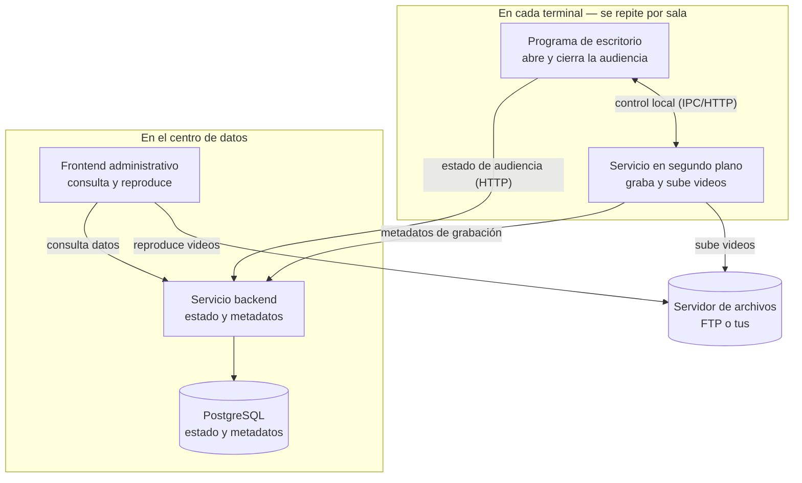
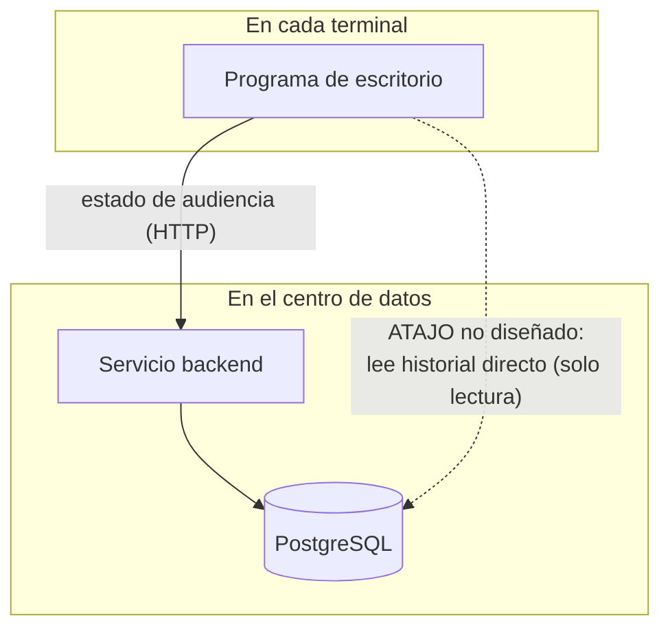

# Vista de componentes — `TEM-COMPONENTES`

## Resumen ejecutivo

La vista de componentes es la respuesta a la primera pregunta que un lector técnico se hace sobre un sistema que no conoce: **de qué partes está hecho, y qué hace cada una**. No es el diagrama de despliegue —eso responde dónde corre cada parte— ni el modelo de datos —eso responde qué guarda—; es el inventario de piezas con responsabilidad propia y de las relaciones que las conectan. Bien hecha, un tercero reconstruye el sistema en su cabeza sin haber visto una línea de código; mal hecha, obliga a leer el repositorio para entender lo que el informe debía explicar.

El error dominante en esta sección tiene nombre y es reincidente: describir la **estructura de carpetas** en lugar de la arquitectura. Enumerar `Domain`, `Application`, `Infrastructure`, `Api` y `Web` no le dice a `ACT-03` qué hace el sistema; le dice cómo el autor organizó su solución de Visual Studio, que es un dato interno sin valor para quien evalúa el enfoque. La arquitectura documenta **componentes, responsabilidades, relaciones, flujos y límites; no la enumeración de archivos**.

El documento le sirve a `ACT-01`, que decide qué granularidad de componente mostrar, y a `ACT-03`, que va a juzgar si las responsabilidades están bien repartidas. Se apoya en el concepto de *container* de `G-02` como la unidad de granularidad más útil para un informe, y deja el detalle de clases y funciones —el nivel de código— explícitamente fuera.

---

## Definición

### Qué es

Una **vista de componentes** describe el sistema como un conjunto de unidades con responsabilidad definida y las relaciones entre ellas. Cada componente responde tres preguntas: cómo se llama —con un nombre que signifique algo para el lector, no el nombre interno del proyecto—, de qué es responsable —una frase, no un párrafo— y con quién habla —qué otros componentes le envían o le piden algo, y a través de qué—. La suma de esas respuestas es la arquitectura lógica que el informe necesita.

`N-01` (ISO/IEC/IEEE 42010:2022) da el respaldo normativo: su cláusula 6 exige que una descripción de arquitectura registre las *architecture views* incluidas y **sus componentes**, entre otros elementos. La norma no dice cómo dibujarlos ni qué granularidad usar —fija qué debe estar, no cómo—; esa elección es de quien redacta, y de ella se ocupa el resto de este documento.

### La granularidad útil: el *container* de C4

La pregunta práctica no es *si* hay que mostrar componentes sino **a qué nivel de zoom**. Un sistema tiene componentes dentro de componentes: el backend es un componente del sistema, pero por dentro tiene controladores, servicios de aplicación y repositorios que también lo son. Mostrarlos todos en un diagrama produce una maraña; mostrar solo el sistema como una caja no explica nada.

`G-02` (modelo C4, de Simon Brown) ofrece un corte que rinde en un informe: el **container**. Su definición —«una aplicación o un almacén de datos… algo que necesita estar en ejecución para que el sistema funcione»— nombra exactamente las piezas que un lector quiere ver primero: cada proceso desplegable por separado y cada base de datos. Es la unidad que un programa de escritorio, un servicio en segundo plano, un backend, un frontend, un servidor de archivos y una base de datos comparten. C4 advierte que su *container* no es un contenedor Docker —la coincidencia de nombre es desafortunada—: es una unidad de ejecución o de almacenamiento, se empaquete como se empaquete. Esta guía adopta ese nivel como el corte por defecto de la vista de componentes de un informe, y baja al nivel inferior —los componentes internos de un container— solo cuando una decisión concreta lo exige.

### Qué problema resuelve

**La comprensión sin acceso al código.** El lector de un informe casi nunca tiene el repositorio abierto al lado, y cuando lo tiene no debería necesitarlo. La vista de componentes es el mapa que le permite ubicar cualquier afirmación posterior del informe —«el servicio en segundo plano sube los videos»— contra una pieza que ya conoce.

**El reparto de responsabilidades como objeto de juicio.** Una arquitectura se evalúa, entre otras cosas, por si cada cosa está donde corresponde. Eso solo se puede juzgar si las responsabilidades están explícitas. Un informe que dice qué componentes hay pero no de qué es responsable cada uno describe una topología, no una arquitectura.

### Los límites: dónde termina un componente

Un componente no se define solo por lo que hace sino por **dónde termina**, y los límites son la parte de la vista que un informe suele callar y un evaluador siempre busca. Tres tipos de límite importan y no coinciden entre sí.

El **límite de responsabilidad** separa lo que un componente hace de lo que delega: el servicio en segundo plano graba y sube, pero no decide qué audiencias existen —eso es del backend—, y trazar esa línea evita el componente que «hace todo» que nadie puede razonar. El **límite de confianza** marca dónde el sistema deja de controlar el entorno: entre el borde —equipos del cliente, fuera del centro de datos— y el centro hay una frontera que define qué se valida, dónde vive un secreto y qué no puede asumirse como seguro; en `CTX-3` ese límite es material de primer orden y lo retoma la [arquitectura de seguridad](../../Documentacion-Tecnica/30-Arquitectura/Arquitectura-de-Seguridad.md) (`DOC-SECARQ`). El **límite de operación** separa lo que sigue funcionando cuando el resto cae: el borde opera con el centro caído, y ese contorno —qué componentes forman la «isla» que sobrevive sola— es exactamente lo que el lector de un sistema distribuido quiere ver dibujado.

Un `subgraph` de Mermaid es la forma natural de mostrar un límite: agrupar el programa de escritorio y el servicio en segundo plano dentro de un recuadro «Terminal» no es decoración, es afirmar que esos dos componentes comparten una frontera —corren en el mismo equipo, sobreviven juntos a la caída del centro— que el backend y PostgreSQL no comparten con ellos.

### Qué NO es, y con qué se lo confunde

**No es el árbol de carpetas del repositorio.** Es la confusión central y `MARCO-CONTEXTOS` la señala como el riesgo de redacción de `CTX-1`. La estructura de carpetas refleja una convención de organización de código —a menudo un estilo como *Clean Architecture*— que es una decisión de implementación, no de arquitectura de solución. El lector quiere saber que hay un backend que recibe metadatos, no que existe una carpeta `Infrastructure.Persistence`.

**No es el diagrama de despliegue.** Un componente y el nodo donde corre son cosas distintas: el mismo backend puede correr en un host o en tres, y eso no cambia la vista de componentes. Mezclarlas produce frases como «el componente de PostgreSQL en el servidor Linux», donde el *qué* y el *dónde* se pisan. La separación es la razón de que exista [`TEM-VISTAS`](Vistas-y-Diagramas.md); la vista de despliegue se trata en [`TEM-TOPOLOGIA`](../30-Despliegue/Topologia-y-Entornos.md).

**No es el modelo de datos.** Que PostgreSQL sea un componente no autoriza a desplegar el esquema de tablas en esta sección. El modelo de datos es un artefacto propio, referenciado en [`DOC-DATOS`](../../Documentacion-Tecnica/40-Diseno/Modelo-de-Datos.md); aquí PostgreSQL aparece como una caja con una responsabilidad —persistir el estado del backend— y nada más.

**No es el diagrama de clases.** El nivel de código de `G-02` —clases, interfaces, funciones— rara vez pertenece a un informe. Un informe que baja a clases confundió la vista de componentes con el diseño detallado, que la guía hermana trata en el [HLD](../../Documentacion-Tecnica/30-Arquitectura/HLD.md) y que aquí se referencia, no se reproduce.

---

## Aplicación por escenario

### `ESC-1` — Solución en diseño

Los componentes son **propuestos**, y la vista es una hipótesis sobre cómo se va a repartir el trabajo. Es el momento más barato para discutir el reparto: mover una responsabilidad de un componente a otro sobre el papel no cuesta nada, y cuesta mucho después de escrito el código.

El riesgo característico es inventar componentes que la solución no necesita todavía —un servicio de notificaciones, una cola de mensajes, un *gateway*— porque «se van a necesitar». Un informe de `ESC-1` honesto marca cada componente con su estado: decidido, propuesto o por confirmar. Un componente propuesto que aparece dibujado con la misma solidez que uno decidido induce al lector a evaluar una arquitectura que quizá no se construya.

### `ESC-2` — Solución construida

Los componentes son los que **hay**, y la vista honesta describe el sistema real, incluidos los caminos que el diseño no previó. Es la tensión que `MARCO-ESCENARIOS` nombra para `ESC-2`: la arquitectura que en el papel tenía capas limpias suele tener, dos años después, un atajo entre la primera y la tercera que nadie documentó y que es exactamente lo que el lector necesita saber.

El aporte de `ACT-02` —el desarrollador que sabe dónde la realidad se apartó del plano— es decisivo aquí. La vista de componentes de `ESC-2` que solo muestra las relaciones previstas es elegante e inútil; la que muestra también el atajo real es fea y verdadera, y el informe se escribe para lo segundo. El ejemplo de más abajo lo ilustra con un caso concreto del sistema de audiencias.

### `ESC-3` — Solución en evolución o migración

La vista se **desdobla**: los componentes actuales y los objetivo, con lo que se conserva, lo que se reemplaza y lo que convive durante la transición. Un informe de evolución que muestra solo la arquitectura objetivo deja sin respuesta la única pregunta del lector —¿es mejor que lo que tengo?—, porque no hay contra qué comparar.

El caso típico del dominio: reemplazar el servidor de archivos FTP (`N-08`) por uno con protocolo de subida reanudable tus (`F-01`). El componente «servidor de archivos» no cambia de casilla en el diagrama, pero cambia de contrato y de comportamiento ante corte de enlace, y la vista debe mostrar el componente puente que traduce durante la convivencia, si lo hay.

### `ESC-4` — Evaluación de una solución ajena

Se **reconstruye** la vista de componentes desde lo observable, y la habilidad central es detectar qué componente el informe ajeno no nombró. Un sistema distribuido en el borde que no menciona el servicio en segundo plano por terminal escondió justamente la pieza más interesante. El evaluador levanta la vista con el nivel de confianza declarado componente por componente: los que vio correr, los que infirió de un puerto abierto, los que solo figuran en la documentación y no pudo verificar.

Dos ausencias son más reveladoras que cualquier presencia. La primera es el componente que existe y no está dibujado —el servicio del borde, la cola de subida—, que el evaluador descubre porque el comportamiento observable no se explica sin él. La segunda es la relación que no está: un informe que dibuja seis componentes y solo cinco flechas dejó un componente sin conectar, y un componente que no habla con nadie o no hace nada o no es un componente. Registrar esas ausencias con su nivel de certeza es el producto de `ESC-4`, no un diagrama bonito reconstruido.

### Qué cambia según el contexto

| Contexto | Tamaño de la vista | Riesgo de redacción | Nivel de zoom útil |
|---|---|---|---|
| `CTX-1` Monolito | Pocas piezas: capas internas de un proceso | Describir carpetas en vez de arquitectura | Componentes internos de un container |
| `CTX-2` Cliente-servidor | Dos o tres containers | Olvidar el contrato entre ellos | Container |
| `CTX-3` Borde distribuido | Muchos containers, repetidos por terminal | Subestimar el componente que opera sin centro | Container, con foco en los del borde |
| `CTX-4` Multiservicio | Muchos containers en el centro | Aplanar: todos con igual detalle | Container, con jerarquía por sistema |

Los dos extremos merecen la advertencia que `MARCO-CONTEXTOS` ya adelanta. En `CTX-1` hay pocas piezas y tienta rellenar la sección con el árbol de directorios; la disciplina es aceptar que la vista de componentes de un monolito es breve y poner el esfuerzo en las responsabilidades internas. En `CTX-4` hay tantas piezas que mostrarlas todas con igual peso aplana el informe y esconde lo central; ahí la vista necesita jerarquía —un diagrama de sistemas y un acercamiento a los que importan—, que es donde los niveles de zoom de `G-02` ganan su lugar y que [`TEM-VISTAS`](Vistas-y-Diagramas.md) desarrolla. En `CTX-3`, el del sistema de audiencias, el peligro es el opuesto al de `CTX-1`: subestimar los componentes del borde —el programa de escritorio y el servicio en segundo plano— que son los que sostienen la operación degradada y los que el lector más quiere entender.

---

## Ejemplos concretos

Todos los ejemplos son **sintéticos** y pertenecen al sistema de gestión de audiencias (`CTX-3`) que describe [`MARCO-CONTEXTOS`](../00-Marco-de-Referencia/Contextos.md#el-sistema-de-ejemplo--gestión-de-audiencias). Ilustran cómo se redacta la vista, no reproducen un documento real.

### La tabla de componentes — nivel *container*

La vista de componentes de un informe empieza por una tabla que nombra cada container, su responsabilidad en una frase y sus interlocutores. Ni una carpeta, ni una clase.

| Componente | Responsabilidad | Habla con | Tecnología |
|---|---|---|---|
| Programa de escritorio | El operador abre, graba y cierra la audiencia de su sala | Servicio en segundo plano; backend | .NET de escritorio (WPF/WinForms/MAUI) |
| Servicio en segundo plano | Captura de cámaras, grabación local y subida de videos | Cámaras; servidor de archivos; backend | Worker Service / servicio de Windows |
| Servicio backend | Recibe estado y metadatos de las terminales; expone datos al frontend | Terminales; frontend; PostgreSQL | API ASP.NET Core |
| Frontend administrativo | Los administrativos consultan audiencias y reproducen grabaciones | Backend; servidor de archivos | Blazor interactive server |
| Servidor de archivos | Almacena y sirve los videos | Servicio en segundo plano; frontend | FTP (`N-08`) o tus (`F-01`) |
| PostgreSQL | Persiste el estado y los metadatos del backend | Backend | PostgreSQL vía Npgsql (`N-18`) |

La columna de tecnología va al final y en una línea, porque es la que menos importa para juzgar el reparto de responsabilidades y la que más tienta al autor a extenderse.

### El diagrama de componentes — estilo *container* de C4

El diagrama acompaña la tabla; no la repite. Muestra las relaciones —quién le habla a quién y para qué— que en la tabla quedan comprimidas. Se dibuja con `flowchart` y `subgraph`, no con la sintaxis `C4Container`, porque el soporte C4 nativo de Mermaid es experimental (`P-01`).



Este diagrama es el que un informe de `ESC-1` presentaría como propuesta: las relaciones son las previstas y todas pasan por donde deben.

### El atajo que nadie documentó — la misma vista en `ESC-2`

Dos años en producción, el sistema real tiene una relación que el diagrama de diseño no muestra. Bajo carga, cuando muchas terminales consultaban a la vez el historial de audiencias de su sala, el backend se saturaba; alguien resolvió el problema dándole al **programa de escritorio una cadena de conexión de solo lectura directa a PostgreSQL**, para que ese listado no pasara por el backend. Funcionó, quedó, y no está en ningún documento.



El informe honesto de `ESC-2` dibuja esa línea de puntos y la explica: es un atajo entre el borde y la base que saltea el backend, resuelve un problema de carga real y tiene un costo —acopla el esquema de la base al programa de escritorio, de modo que un cambio de tabla puede romper las terminales sin que el backend se entere—. Ocultarlo produce un informe elegante que miente sobre los límites del sistema; declararlo le da al evaluador exactamente el dato que necesita. Que ese atajo *deba existir* es una discusión de [`TEM-DECISIONES`](Decisiones-de-Arquitectura.md); que *exista* es un hecho de la vista de componentes.

---

## Preguntas guía

- ¿Cada componente que nombré tiene un nombre que significa algo para `ACT-03`, o es el nombre interno del proyecto?
- ¿Puedo enunciar la responsabilidad de cada componente en una sola frase? Si necesito un párrafo, ¿el componente hace demasiadas cosas o no entendí qué hace?
- ¿Estoy describiendo containers —procesos y almacenes— o me deslicé hacia clases y carpetas?
- ¿El diagrama muestra las relaciones reales, incluidos los atajos, o solo las previstas por el diseño?
- ¿Separé el *qué es* cada componente del *dónde corre*, o los mezclé?
- Si un componente opera cuando el resto está caído (`CTX-3`), ¿la vista deja claro cuál es y de qué es capaz por sí solo?

---

## Criterios de calidad

### Vista buena

Cada componente tiene un nombre significativo, una responsabilidad enunciable en una frase y sus interlocutores explícitos. El nivel de zoom es coherente: o se muestran containers, o se muestran componentes internos de uno, pero no una mezcla donde el backend es una caja y el frontend está descompuesto en cinco. El diagrama y la tabla se complementan —la tabla da responsabilidad, el diagrama da relación— sin repetirse. Las divergencias entre el diseño y la realidad están dibujadas, no escondidas.

Un lector que no conoce el sistema puede, después de leer la vista, decir en voz alta qué hace cada pieza y por dónde fluye una operación completa. Esa es la prueba.

### Vista pobre y antipatrones

**El árbol de carpetas disfrazado de arquitectura.** Enumerar `Domain`, `Application`, `Infrastructure`, `Api`, `Web` y llamarlo vista de componentes. Es el antipatrón más frecuente en `CTX-1` y el más fácil de detectar: si la sección se lee como el panel de solución de Visual Studio, no describe la arquitectura.

**El nombre interno.** Nombrar los componentes por su nombre de repositorio —`Audiencias.Worker.Grabacion`— en lugar de por lo que hacen. `ACT-03` no sabe qué es eso; sí sabe qué es «el servicio que graba y sube los videos».

**La responsabilidad-párrafo.** Un componente cuya responsabilidad no cabe en una frase suele estar mal delimitado: hace demasiadas cosas, o el autor no tiene claro qué hace. El síntoma se corrige repartiendo la responsabilidad, no alargando la descripción.

**El zoom inconsistente.** Un diagrama donde algunos componentes son sistemas enteros y otros son clases sueltas. El lector no puede saber qué está mirando. La disciplina de `G-02` —elegir un nivel y sostenerlo— existe para evitarlo.

**La vista idealizada.** Mostrar las capas limpias del diseño en un informe de `ESC-2` cuando el sistema real tiene atajos. Es mentir por omisión, y `MARCO-ESCENARIOS` lo identifica como la trampa característica del escenario.

**El componente decorativo.** En `ESC-1`, dibujar piezas que la solución no necesita todavía para que la arquitectura «se vea completa». Sobredimensionar es el riesgo del escenario, y cada componente propuesto sin requisito que lo justifique es material para [`TEM-DECISIONES`](Decisiones-de-Arquitectura.md), no para la vista.

---

## Anexo — Plantilla comentada de la vista de componentes

Se completa por componente. La tabla del informe se deriva de estas fichas; la ficha guarda además lo que la tabla no muestra y el redactor necesita para no equivocarse.

```yaml
# Una entrada por container. El nivel por defecto es "container" (G-02);
# se baja a "componente interno" solo si una decisión lo exige.
componentes:
  - nombre: ""                     # significativo para ACT-03, no el nombre de repo
    nivel: container | componente_interno
    responsabilidad: ""            # UNA frase; si necesita más, revisar el reparto
    estado: decidido | propuesto | por_confirmar   # relevante en ESC-1
    tecnologia: ""                 # una línea; al final, no al principio
    habla_con:
      - componente: ""
        via: ""                    # HTTP, IPC, FTP, tus, conexión SQL, cola…
        proposito: ""              # qué le pide o le envía
        previsto_por_diseno: si | no   # "no" marca los atajos de ESC-2
    opera_sin_centro: si | no | na # relevante en CTX-3
fuera_de_alcance:
  - ""                             # lo que deliberadamente no se descompone aquí
    # p. ej. "el detalle de clases del backend: ver DOC-HLD"
```

El campo `previsto_por_diseno: no` es el que convierte una vista de `ESC-2` en honesta: cada relación así marcada es un atajo que existe en el sistema real y que el informe elige no ocultar. Su ausencia total en un sistema de dos años de vida no suele significar que no haya atajos, sino que nadie los buscó.
