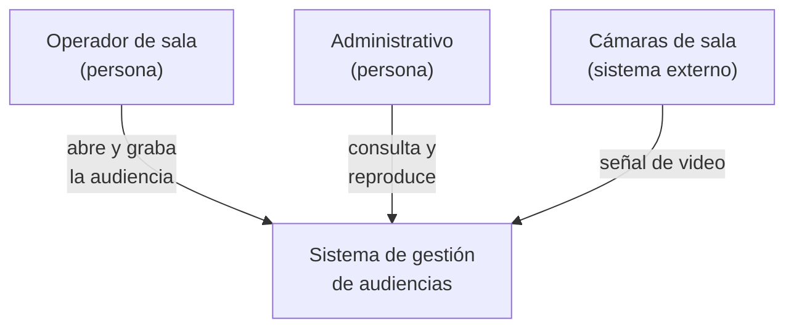
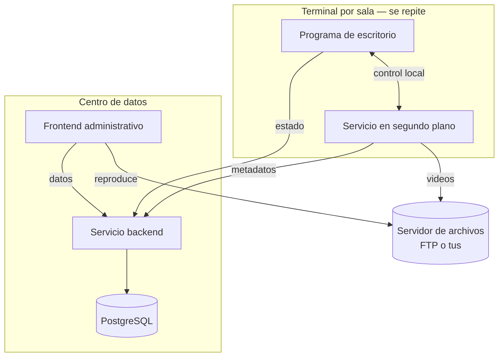
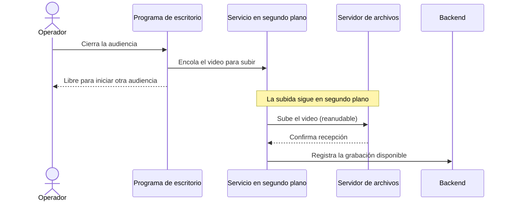

# Vistas y diagramas — `TEM-VISTAS`

## Resumen ejecutivo

Ningún diagrama muestra una arquitectura entera. En cuanto se intenta, aparece el diagrama que lo tiene todo y no se entiende nada: componentes, servidores, protocolos, flujos y decisiones amontonados en una lámina que el autor comprende porque la dibujó y el lector abandona. La salida no es un diagrama mejor sino **varios diagramas, cada uno con una pregunta**. A esa idea —una arquitectura se describe por vistas, y cada vista atiende un conjunto de *concerns*— llegó la disciplina hace treinta años, y es el respaldo de esta sección.

`O-01` (el modelo 4+1 de Kruchten, 1995) fue el enunciado fundacional: cinco vistas, cada una para preocupaciones distintas, y un conjunto de escenarios que las ata. `N-01` (ISO/IEC/IEEE 42010:2022) lo elevó a requisito normativo con un vocabulario preciso —*stakeholders*, *concerns*, *viewpoints*, *views*—. `G-02` (C4) lo volvió operable con niveles de zoom. Los tres dicen lo mismo desde distinta altura: **elegí la vista según la pregunta que quiera responder el lector**.

El problema práctico del informe no es dibujar vistas sino **elegir cuáles**, porque copiar la lista completa de un marco produce un informe con diez diagramas donde tres habrían bastado. Este documento da un criterio de selección y muestra cómo dibujar cada vista elegida en Mermaid. Le sirve a `ACT-01`, que decide el juego de diagramas, y a `ACT-03`, que va a leerlos.

---

## Definición

### Qué es una vista, y por qué son varias

Una **vista** es una representación del sistema desde una preocupación concreta. La vista de componentes atiende «¿de qué partes está hecho?»; la de despliegue, «¿dónde corre cada parte?»; una vista dinámica, «¿qué pasa cuando el operador cierra una audiencia?». Son la misma arquitectura mirada desde ángulos distintos, y ninguna es prescindible porque cada una responde algo que las otras no.

`N-01` formaliza la relación con tres términos que conviene distinguir. Un *stakeholder* tiene *concerns* —intereses o preocupaciones sobre el sistema—; un *architecture viewpoint* es la convención que enmarca cómo se atiende un conjunto de concerns; y una *architecture view* es la aplicación de ese viewpoint al sistema concreto. En criollo: el viewpoint es el tipo de plano —«plano de despliegue»— y la view es el plano de *este* sistema. La cláusula 6 de `N-01` exige que la descripción registre qué viewpoints y qué views incluye, y que cada uno diga a qué concerns responde. La norma no manda usar 4+1, ni C4, ni arc42: manda que las vistas elegidas declaren qué preocupación atienden.

### Los tres marcos que instancian la idea

**`O-01` — el modelo 4+1.** Cinco vistas: **lógica** (los componentes y su estructura; requisitos funcionales), **de proceso** (concurrencia, rendimiento, disponibilidad), **de desarrollo** (organización de módulos para quien programa), **física** (el mapeo del software al hardware —es la vista que hoy llamamos de despliegue—) y **de escenarios**, el «+1», casos de uso que recorren las otras cuatro y las validan. La contribución perdurable no es la lista sino la idea del «+1»: los escenarios son el hilo que comprueba que las demás vistas describen el mismo sistema.

**`G-01` — arc42.** Separa dos vistas que suelen confundirse: la **sección 5, Building Block View**, que es la descomposición estática en bloques —el *qué* estático, cercano a la vista de componentes—, y la **sección 6, Runtime View**, que son escenarios dinámicos —el *cómo se comporta* en el tiempo—. La distinción importa: un informe que solo tiene la estática describe un sistema como una foto y no como una película, y los tres comportamientos que definen al sistema de audiencias solo se ven en movimiento.

**`G-02` — C4 y sus niveles de zoom.** Cuatro niveles de acercamiento —*System Context* (el sistema como una caja entre sus usuarios y sistemas vecinos), *Container* (los procesos y almacenes desplegables), *Component* (las piezas internas de un container), *Code* (clases y funciones)— más tres diagramas suplementarios: *System Landscape*, *Dynamic* (un flujo en el tiempo) y *Deployment* (los containers ubicados en la infraestructura). El aporte de C4 es tratar las vistas como zoom: se entra por el nivel más lejano y se acerca solo donde hace falta.

### Qué vista responde qué pregunta

| Pregunta del lector | Vista | En qué marco | Diagrama Mermaid |
|---|---|---|---|
| ¿Con quién se relaciona el sistema por fuera? | Contexto | C4 *System Context* | `flowchart` |
| ¿De qué partes está hecho? | Componentes | C4 *Container* · arc42 §5 · 4+1 lógica | `flowchart` + `subgraph` |
| ¿Dónde corre cada parte? | Despliegue | C4 *Deployment* · arc42 §7 · 4+1 física | `flowchart` + `subgraph` |
| ¿Qué pasa cuando ocurre X? | Dinámica | C4 *Dynamic* · arc42 §6 · 4+1 escenarios | `sequenceDiagram` |
| ¿Cómo está el código por dentro? | Código | C4 *Code* | rara vez en un informe |

### Qué NO es

**No es «cuantos más diagramas, mejor».** Un informe con diez diagramas donde cada uno repite al anterior con otro encuadre cansa al lector y esconde los dos que importan. La calidad de la sección se mide por cuántas preguntas responde, no por cuántas láminas tiene.

**No es una notación.** C4, arc42 y 4+1 no son formas de dibujar sino formas de **organizar** los dibujos por preocupación. El mismo diagrama de despliegue se puede pintar en Mermaid, PlantUML o en una servilleta; lo que C4 aporta es *que* haya un diagrama de despliegue separado del de componentes. `MARCO-CONVENCIONES` lo declara: la guía trata C4 como organización por nivel de zoom, no como sintaxis.

**No es la sintaxis `C4Context` de Mermaid.** El soporte C4 nativo de Mermaid está marcado como experimental por su propia documentación (`P-01`), que advierte que la sintaxis puede cambiar. Por eso todos los diagramas C4 de esta guía se dibujan con `flowchart` y agrupación por `subgraph`, que es estable y diffeable.

---

## Cómo elegir los diagramas del informe

Aquí la guía da **criterio propio**, y lo declara como tal: los marcos ofrecen catálogos de vistas pensados para una descripción de arquitectura completa, y un informe transversal no es eso. Copiar las doce secciones de arc42 o las cinco vistas de 4+1 a un informe produce relleno.

**Esta guía recomienda**, para un informe típico, cuatro diagramas y rara vez un quinto:

1. **Un diagrama de contexto.** Ubica el sistema entre sus usuarios y sus vecinos. Barato de hacer, orienta al lector antes de cualquier detalle, y casi siempre se omite por obvio cuando es lo primero que `ACT-03` necesita.
2. **Un diagrama de componentes** a nivel *container*. Es el corazón de la vista de arquitectura y lo trata [`TEM-COMPONENTES`](Vista-de-Componentes.md).
3. **Un diagrama de despliegue.** Dónde corre cada container. Su peso depende del contexto —bajo en `CTX-1`, alto en `CTX-3`— y lo trata [`TEM-TOPOLOGIA`](../30-Despliegue/Topologia-y-Entornos.md).
4. **Uno o dos flujos dinámicos.** Los que muestran el comportamiento que define al sistema. En el de audiencias, el cierre de audiencia con subida diferida es obligatorio; sin él, el informe describe piezas quietas.

Cuáles flujos dinámicos elegir merece su propio criterio, porque un sistema tiene decenas de flujos y dibujarlos todos es imposible. **Esta guía recomienda** elegirlos por dos pruebas: un flujo entra si demuestra un requisito no funcional que el texto solo puede afirmar —el cierre de audiencia con subida diferida muestra *cuándo* el operador queda libre, algo que la prosa no puede precisar—, o si cruza tantos componentes que su recorrido es en sí la mejor explicación de cómo colaboran. Un flujo que solo repite lo que el diagrama de componentes ya dice —«el frontend le pide datos al backend»— no gana su lugar. En el sistema de audiencias, los tres candidatos naturales son los tres comportamientos definitorios; con uno o dos alcanza, y el que no entra se menciona en prosa.

El **nivel de código casi nunca entra**: un informe que baja a clases confundió su propósito con el del [HLD](../../Documentacion-Tecnica/30-Arquitectura/HLD.md), que la guía hermana ya cubre. La vista de desarrollo de `O-01` —organización de módulos— tampoco suele entrar, porque interesa a quien programa el sistema, no a quien evalúa el enfoque.

La regla de descarte es simple: **un diagrama que no responde una pregunta que el lector se hace, sobra.** Si el autor no puede nombrar la pregunta, el diagrama es decoración.

---

## Aplicación por escenario

### `ESC-1` — Solución en diseño

Las vistas son **prospectivas** y la de escenarios de `O-01` cobra un valor especial: recorrer un caso de uso completo por la arquitectura propuesta es la forma más barata de descubrir que una pieza falta o que dos no encajan. Un flujo dinámico dibujado en diseño revela huecos que el diagrama estático esconde. El riesgo es dibujar las vistas con la solidez de lo construido; conviene marcar en el pie de cada diagrama que representa lo propuesto.

### `ESC-2` — Solución construida

Las vistas describen lo que **hay**, y la vista dinámica es donde se ganan o se pierden: los tres comportamientos que definen al sistema de audiencias —operar con el centro caído, recuperar ante la caída del escritorio, subir en segundo plano al cerrar— no se ven en ningún diagrama estático. Un informe de `ESC-2` que tiene componentes y despliegue pero ningún flujo dinámico describió la anatomía del sistema y omitió su fisiología, que es lo que el lector quería entender. Esos flujos se retoman en [`TEM-OPERACION`](../30-Despliegue/Operacion-y-Resiliencia.md).

### `ESC-3` — Solución en evolución o migración

La vista de despliegue se **desdobla** en actual y objetivo, como `MARCO-ESCENARIOS` señala, y conviene un tercer diagrama que muestre el estado intermedio de convivencia, que suele ser el más riesgoso y el que nadie dibuja. Comparar dos diagramas lado a lado, con los mismos componentes en las mismas posiciones, deja ver de un vistazo qué cambió; rehacer el diagrama desde cero para el objetivo obliga al lector a buscar las diferencias a mano.

### `ESC-4` — Evaluación de una solución ajena

Se **reconstruyen** las vistas que el informe ajeno no trae, y la habilidad central es notar cuál falta. El patrón más común es el informe que tiene una vista de componentes prolija y ninguna de despliegue, con lo que afirma una arquitectura sin decir dónde corre —y sin despliegue no hay forma de juzgar la disponibilidad ni la operación degradada—. El evaluador dibuja la vista faltante desde lo observable y declara qué infirió y qué verificó.

### Qué cambia según el contexto

| Contexto | Vistas que el informe necesita | Vista que domina | Nota |
|---|---|---|---|
| `CTX-1` Monolito | Componentes (interna) y poco más | Componentes | Forzar una vista de despliegue rica es relleno |
| `CTX-2` Cliente-servidor | Contexto, componentes, despliegue | Despliegue empieza a pesar | Aparece el contrato entre nodos |
| `CTX-3` Borde distribuido | Las cuatro, con flujos dinámicos centrales | Dinámica y despliegue | La operación degradada solo se ve en movimiento |
| `CTX-4` Multiservicio | Las cuatro, con jerarquía de zoom | Contexto y containers por sistema | Sin zoom, el diagrama de componentes es ilegible |

El caso de `CTX-4` es donde los niveles de `G-02` dejan de ser una comodidad y se vuelven necesarios: con muchos servicios en el centro, un solo diagrama de componentes es una maraña, y la única salida es un diagrama de contexto que muestre los sistemas como cajas y acercamientos por separado a los que importan. `MARCO-CONTEXTOS` lo anota como el contexto donde «un modelo con niveles de zoom gana su lugar». En `CTX-3`, en cambio, el número de containers es manejable pero su comportamiento no cabe en la estática, y ahí lo que gana su lugar son las vistas dinámicas.

---

## Ejemplos concretos

Todos los ejemplos son **sintéticos** y pertenecen al sistema de gestión de audiencias (`CTX-3`) de [`MARCO-CONTEXTOS`](../00-Marco-de-Referencia/Contextos.md#el-sistema-de-ejemplo--gestión-de-audiencias). Muestran el mismo sistema a dos niveles de zoom estáticos y en un flujo dinámico.

### Nivel de contexto — el sistema entre sus usuarios y vecinos

El diagrama de contexto muestra el sistema como una caja y lo que lo rodea. Responde «¿con quién se relaciona por fuera?» y orienta antes de cualquier detalle interno.



A este nivel no hay backend, ni servidor de archivos, ni PostgreSQL: son detalle interno. Mostrar aquí las cámaras y los dos tipos de usuario es lo que un lector nuevo necesita antes de abrir la caja.

### Nivel de container — el sistema por dentro

Al acercar un nivel aparecen los containers y sus relaciones. Es el diagrama de la vista de componentes; se reproduce aquí para mostrar la continuidad de zoom desde el contexto.



El contexto y el container son el mismo sistema a dos distancias. Que el lector pueda «acercar» de uno al otro sin reaprender nada es la ventaja de organizar los diagramas por zoom.

### Vista dinámica — cerrar la audiencia y subir en segundo plano

Este flujo es el que ningún diagrama estático muestra y el que define al sistema: al cerrar una audiencia, el operador queda libre de inmediato y la subida del video continúa por su cuenta. Se dibuja con `sequenceDiagram`.



La flecha punteada que devuelve el control al operador *antes* de que la subida termine es el punto: el informe puede escribir «al cerrar, los videos siguen subiéndose en segundo plano», pero el diagrama muestra *cuándo* el operador queda libre respecto de *cuándo* el video llega al servidor, que es la diferencia que hace útil al requisito. La resiliencia de esa cola ante corte de enlace —por qué tus (`F-01`) y no FTP (`N-08`)— es materia de [`TEM-DECISIONES`](Decisiones-de-Arquitectura.md).

---

## Preguntas guía

- ¿Cada diagrama que incluí responde una pregunta que el lector se hace? ¿Puedo nombrar la pregunta?
- ¿Tengo al menos un flujo dinámico, o todas mis vistas son fotos de un sistema quieto?
- ¿El nivel de zoom es consistente dentro de cada diagrama y coherente entre diagramas?
- ¿Estoy dibujando el nivel de código o de módulos, que casi nunca pertenece a un informe?
- Si el sistema opera degradado (`CTX-3`), ¿hay una vista dinámica que lo muestre, o solo lo afirma el texto?
- ¿Copié la lista de vistas de un marco, o elegí las que este informe necesita?

---

## Criterios de calidad

### Selección buena

El informe tiene los diagramas justos —típicamente contexto, componentes, despliegue y uno o dos flujos— y cada uno responde una pregunta identificable. Los niveles de zoom encajan: se puede recorrer del contexto al container al despliegue sin saltos. Hay al menos una vista dinámica que muestra el comportamiento definitorio del sistema. El texto y los diagramas se complementan: la narración recorre el flujo que el `sequenceDiagram` esquematiza, sin repetirlo casilla por casilla, como pide la [regla de doble audiencia](../../../../IA.Prompts/PromptFramework/Rules/Rule-Dual-Audience.md).

### Selección pobre y antipatrones

**El diagrama que lo tiene todo.** Una sola lámina con componentes, servidores, protocolos y flujos superpuestos. Nadie que no la haya dibujado la entiende. La cura es partirla en vistas por preocupación.

**El catálogo copiado.** Las cinco vistas de 4+1 o las secciones de arc42 reproducidas enteras porque «así se hace», con vistas vacías o forzadas. Los marcos son menús, no obligaciones.

**Solo estática.** Componentes y despliegue impecables y ningún flujo dinámico. Describe la anatomía y omite la fisiología; en `CTX-3` es un defecto grave, porque la operación degradada solo existe en el tiempo.

**El zoom saltado.** Pasar del contexto directamente a un diagrama de clases sin el nivel intermedio de containers, con lo que el lector pierde el hilo entre «el sistema» y «esta clase».

**La sintaxis experimental.** Usar `C4Context` o `C4Container` de Mermaid y encontrarse con que una actualización cambió el render. `P-01` lo advierte; `flowchart` con `subgraph` no tiene ese riesgo.

**El diagrama sin pregunta.** Una lámina bonita que el autor incluyó porque quedaba bien. Si no responde nada que el lector necesite, es decoración y compite por su atención con lo que sí importa.

---

## Anexo — Lista de verificación de vistas

Se completa al planificar la sección de arquitectura, antes de dibujar. Fuerza a nombrar la pregunta de cada diagrama y a justificar los que se omiten.

```yaml
escenario: ESC-?
contexto: CTX-?
vistas_incluidas:
  - vista: contexto | componentes | despliegue | dinamica | codigo | otra
    pregunta_que_responde: ""      # si no hay pregunta, la vista sobra
    nivel_zoom: contexto | container | componente | codigo
    diagrama_mermaid: flowchart | sequenceDiagram | timeline
    estado: propuesto | real | actual_y_objetivo   # ESC-1 vs ESC-2 vs ESC-3
vistas_omitidas:
  - vista: ""
    por_que_no: ""                 # p. ej. "código: no pertenece al informe; ver DOC-HLD"
flujos_dinamicos:
  - nombre: ""                     # p. ej. "cierre de audiencia con subida diferida"
    comportamiento_que_demuestra: ""   # normalmente un RNF; ver TEM-RNF
    incluido: si | no
consistencia:
  zoom_coherente_entre_diagramas: si | no
  al_menos_un_flujo_dinamico: si | no
  ninguna_vista_sin_pregunta: si | no
```

El bloque `vistas_omitidas` es el que distingue una selección deliberada de un olvido: una vista que no está y no figura como omitida deja al lector sin saber si el autor la descartó con criterio o simplemente no la pensó, que es la misma ambigüedad que `MARCO-CONVENCIONES` obliga a resolver cuando un tema no aplica a un escenario.
