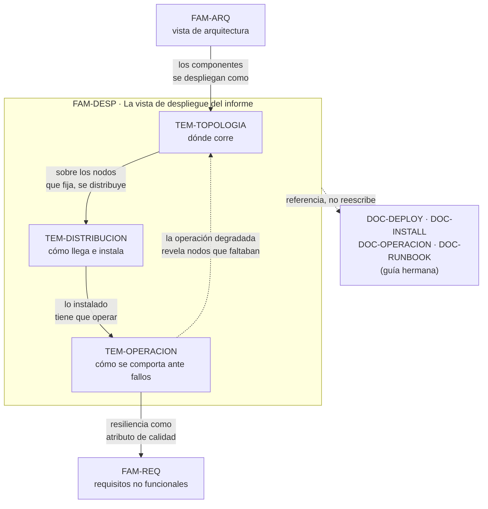

# Despliegue — `FAM-DESP`

## La pregunta que responde esta familia

**¿Cómo describo dónde corre la solución, cómo se instala y cómo se comporta ante fallos?**

Es la familia que da nombre a la guía, y no por casualidad: la vista de despliegue es la que separa un informe de solución de una simple descripción de arquitectura. La arquitectura dice *cómo está organizado* el sistema; el despliegue dice *dónde vive*, *cómo llega ahí* y *qué hace cuando algo se cae*. Para el [contexto](../00-Marco-de-Referencia/Contextos.md) que esta guía usa de ejemplo —un sistema de gestión de audiencias distribuido en el borde, `CTX-3`— esas tres preguntas concentran lo más difícil y lo más interesante de todo el informe, porque el software no corre en un servidor bajo control sino en decenas de terminales que operan sin conexión con el centro.

Las tres preguntas no son intercambiables y por eso la familia tiene tres temas. Dónde corre es **topología**; cómo llega es **distribución e instalación**; cómo se comporta ante fallos es **operación y resiliencia**. Un informe que responde solo la primera describe un mapa muerto; uno que responde las tres describe un sistema vivo.

Esta familia se apoya en las guías hermanas sin reescribirlas. La [Deployment Guide](../../Documentacion-Tecnica/50-Operativa/Deployment-Guide.md) (`DOC-DEPLOY`), la [Installation Guide](../../Documentacion-Tecnica/50-Operativa/Installation-Guide.md) (`DOC-INSTALL`), la [Operations Guide](../../Documentacion-Tecnica/50-Operativa/Operations-Guide.md) (`DOC-OPERACION`) y el [Runbook](../../Documentacion-Tecnica/50-Operativa/Runbook.md) (`DOC-RUNBOOK`) son documentos operativos completos y autónomos. Lo que aquí se enseña es cómo **componer** la vista de despliegue de un informe transversal que remite a ellos, no cómo escribirlos.

---

## Documentos

| Documento | ID | Qué establece |
|---|---|---|
| [Topología y entornos](Topologia-y-Entornos.md) | `TEM-TOPOLOGIA` | La vista de despliegue propiamente dicha: nodos y artefactos según `N-07`, el diagrama de despliegue C4 de `G-02`, los entornos dev/test/prod y cuánto detalle merece según el contexto |
| [Distribución e instalación](Distribucion-e-Instalacion.md) | `TEM-DISTRIBUCION` | Cómo se empaqueta, distribuye e instala cada componente: modelos de publicación de .NET (`N-09`), hosting (`N-10`, `N-11`, `N-14`), servicios en segundo plano (`N-12`, `N-13`), contenedores (`N-15`) y escritorio (`N-16`, `N-17`) |
| [Operación y resiliencia](Operacion-y-Resiliencia.md) | `TEM-OPERACION` | Cómo se narra el comportamiento operativo: operación degradada, recuperación ante caídas y trabajo diferido; transferencia de archivos con FTP (`N-08`) o tus (`F-01`) |

El orden de lectura es el de la tabla, y responde a la vida real de un despliegue: primero se decide dónde va a correr cada cosa, después cómo hacer que llegue y se instale ahí, y por último cómo se comporta cuando ya está corriendo y algo falla.

---

## Cómo se relaciona con el informe y con las demás familias

La arista más importante es la que une operación con requisitos. Los tres comportamientos que definen el sistema de audiencias —opera con el centro caído, recupera ante la caída del escritorio, sube videos en segundo plano al cerrar— son **requisitos no funcionales** que [`TEM-RNF`](../40-Requisitos/Requisitos-No-Funcionales.md) trata como atributos de calidad, y **mecanismos de despliegue** que [`TEM-OPERACION`](Operacion-y-Resiliencia.md) trata como conducta observable. El informe los describe una vez en cada lado, sin contradecirse: la familia de requisitos dice *qué se exige y cómo se mide*; la de despliegue dice *cómo el sistema lo cumple*.

---

## Qué se lleva el lector de esta familia

Tres capacidades, ordenadas por lo que más cambia un informe.

Calibrar el peso de la vista de despliegue según el contexto. Un `CTX-1` monolito no da para más de un diagrama y forzarlo produce relleno; un `CTX-3` que despacha el despliegue en tres párrafos está mal escrito. Saber cuándo un tema pide media página y cuándo pide seis es la diferencia entre un informe proporcionado y uno plano.

Describir la instalación como un procedimiento cuando el contexto lo exige. En el borde, instalar y actualizar software en cada terminal no es una nota al pie: es un proceso repetido que el lector técnico necesita entender antes de aceptar la solución.

Narrar la resiliencia como conducta y no como promesa. «El sistema es tolerante a fallos» no dice nada; «al perder el enlace con el centro, el escritorio sigue grabando contra el estado local y reconcilia cuando el enlace vuelve» describe un mecanismo que se puede evaluar. Esa diferencia es el corazón de un informe de `CTX-3`.
