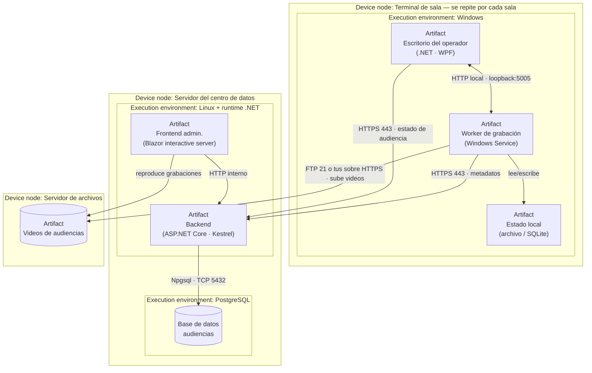

# Topología y entornos — `TEM-TOPOLOGIA`

## Resumen ejecutivo

La topología es el mapa físico de la solución: qué corre en qué máquina, qué habla con qué, por qué protocolo y qué puerto, y en cuántos entornos existe ese mapa. Responde la primera de las tres preguntas del despliegue —*dónde vive el sistema*— y es la vista que un lector técnico busca primero cuando abre un informe, porque le dice de un vistazo si va a poder operar, integrar o auditar lo que se le describe.

La notación normativa de esta vista existe: es el diagrama de despliegue de UML (`N-07`), que modela artefactos desplegados sobre nodos y los caminos de comunicación entre ellos. El modelo C4 (`G-02`) ofrece una forma más legible de dibujarla cuando hay muchos contenedores, y el modelo 4+1 (`O-01`) le da su nombre clásico —la vista física, «mapping the software to hardware»—. Ninguna de las tres prescribe cuánto detalle poner: eso lo decide el contexto, y es donde más informes se equivocan.

Este documento le sirve a `ACT-01`, que dibuja la topología, y sobre todo a `ACT-04`, el responsable de despliegue y operación, que la lee para saber qué va a administrar. En `CTX-3` —el sistema de audiencias— la topología no cabe en un diagrama porque el mismo conjunto de nodos se repite por cada terminal, y describir esa repetición sin ahogar al lector en copias es el problema técnico central del tema.

---

## Definición

### Qué es

La **vista de despliegue** —o vista física, en el vocabulario de `O-01`— describe la correspondencia entre los elementos de software del sistema y los elementos de cómputo donde se ejecutan. Kruchten la define en el modelo 4+1 como *«Mapping the Software to Hardware»*: la vista que atiende los *concerns* de topología, disponibilidad, fiabilidad y rendimiento, distintos de los que atienden la vista lógica o la de proceso. `N-01` no la nombra específicamente —fija que una descripción de arquitectura tenga vistas que atiendan los *concerns* de sus *stakeholders*, sin listar cuáles—, pero la vista de despliegue es la respuesta habitual al *concern* de un `ACT-04`: dónde corre esto y qué pasa si un nodo cae.

Su notación estándar es el diagrama de despliegue de `N-07`. La cláusula 19 de la especificación (parafraseada) distingue dos clases de nodo y una relación:

| Elemento de `N-07` | Qué modela | En el ejemplo de audiencias |
|---|---|---|
| *Device node* | Recurso de cómputo físico | La terminal de la sala, el servidor del centro |
| *Execution environment node* | Contenedor de software: un SO, un runtime, un servidor de aplicaciones | El runtime de .NET, el servicio de Windows, el motor de PostgreSQL |
| *Artifact* | Pieza física desplegable: un ejecutable, un paquete, un archivo de configuración | El instalable del escritorio, el ensamblado del Worker, la imagen del backend |
| *Deployment* | Asociación de un artefacto con el nodo donde se despliega | El instalable del escritorio *desplegado en* la terminal |
| *Communication path* | Vínculo por el que dos nodos se comunican | El enlace de red entre la terminal y el centro |

La distinción entre nodo de dispositivo y entorno de ejecución es la que más aporta en un informe: permite decir que el artefacto del Worker se despliega en el *execution environment* «servicio de Windows», que a su vez corre en el *device node* «terminal», sin confundir la máquina con el runtime que la habita.

### Qué problema resuelve

**Dónde está cada cosa cuando algo falla.** Un `ACT-04` que recibe una alerta a las tres de la mañana necesita saber, sin llamar a nadie, en qué nodo corre el componente que falló, con qué otros habla y cuál es el efecto de que ese nodo esté caído. La topología es el documento que responde eso, y su ausencia se paga en tiempo de diagnóstico.

**Qué se puede integrar y por dónde.** Un socio que va a conectarse pregunta por los puntos de entrada: qué expone el sistema, en qué puerto, con qué protocolo, dónde termina el cifrado. La topología con puertos y protocolos es la respuesta; sin ella, la integración se negocia por correo electrónico y prueba y error.

**Cuánto cuesta operar la solución.** El número de nodos, su repetición y su ubicación —centro de datos controlado o equipo del cliente— determinan el costo operativo. Una topología honesta deja ver que un sistema con «una» aplicación de escritorio en realidad tiene tantas instalaciones como salas, y que eso es trabajo recurrente.

### Qué NO es, y con qué se lo confunde

**No es el diagrama de componentes.** El de componentes —que trata [`TEM-COMPONENTES`](../20-Arquitectura/Vista-de-Componentes.md)— dice qué partes lógicas tiene el sistema y cómo se relacionan; el de despliegue dice en qué máquinas corren esas partes. Un mismo componente lógico puede desplegarse en varios nodos, y un nodo puede alojar varios componentes. Mezclarlos produce un diagrama que no sirve para ninguna de las dos cosas.

**No es el organigrama de la infraestructura.** No interesa el inventario completo de servidores, switches y racks del centro de datos, sino los nodos que participan en *esta* solución y los caminos que *este* sistema usa. Un diagrama de despliegue que dibuja la topología de red entera de la organización esconde la solución en el ruido.

**No es la estructura de carpetas del repositorio.** Es la tentación característica de `CTX-1`, y `MARCO-CONTEXTOS` la señala: describir el árbol de directorios en lugar de la topología. El lector quiere saber en qué host corre el binario, no en qué carpeta del solución vive el proyecto.

**No es la vista de proceso.** La concurrencia —cuántos hilos, qué colas, qué sincronización— pertenece a la vista de proceso de `O-01`. La de despliegue puede indicar cuántas *instancias* de un proceso corren en un nodo, pero no describe su comportamiento interno en tiempo de ejecución; eso se narra en [`TEM-OPERACION`](Operacion-y-Resiliencia.md).

---

## El diagrama de despliegue del sistema de audiencias

El siguiente diagrama es **sintético** e ilustra cómo se dibuja una topología de `CTX-3` en Mermaid, agrupando por `subgraph` según la convención de la guía (el soporte C4 nativo de Mermaid es experimental, `P-01`). Los puertos y protocolos son valores de ejemplo realistas, no la configuración de un sistema real.



Dos rasgos del diagrama son los que un lector de `CTX-3` busca. Primero, el rótulo *«se repite por cada sala»* sobre el nodo terminal: sin él, el diagrama miente por omisión, porque sugiere un despliegue único cuando hay tantos como salas. Segundo, el camino de subida de videos etiquetado con las dos opciones de protocolo —FTP (`N-08`) o tus (`F-01`)—, porque esa elección tiene consecuencias operativas que [`TEM-OPERACION`](Operacion-y-Resiliencia.md) desarrolla y que el informe no puede esconder detrás de un genérico «sube archivos».

### El diagrama de despliegue C4, cuando hay muchos contenedores

`G-02` ofrece un diagrama de despliegue propio, distinto del de contexto o el de contenedores: ubica **instancias de container dentro de deployment nodes** —infraestructura física, virtual, contenedorizada o un entorno de ejecución—. Su valor aparece cuando el centro deja de ser un servidor y pasa a ser varios, o cuando un mismo container corre replicado: el diagrama C4 de despliegue muestra cuántas instancias de cada container viven en cada nodo, algo que el diagrama de componentes no expresa. Para el ejemplo de audiencias, con un backend en una sola instancia, la distinción rinde poco; se vuelve necesaria si la solución evoluciona hacia varias réplicas del backend detrás de un balanceador, y ahí conviene adoptar el diagrama de despliegue de C4 en lugar de recargar el de UML.

---

## Entornos: el mismo mapa, varias veces

Una topología no existe una sola vez. El software atraviesa entornos —desarrollo, prueba, producción— y cada uno es una instancia del mismo diagrama con diferencias que importan: cuántos nodos, con qué datos, con qué grado de fidelidad respecto de producción. El informe describe **producción** como topología de referencia y señala en qué difieren los demás, no dibuja tres diagramas casi idénticos.

| Entorno | Para qué | Diferencia típica con producción en `CTX-3` |
|---|---|---|
| Desarrollo | El desarrollador ejecuta y depura | Todo en una máquina: escritorio, Worker, backend y base local conviven en un host; sin servidor de archivos real |
| Prueba / *staging* | Validar el despliegue y la integración | Una o dos terminales reales contra un centro de prueba; datos sintéticos; permite ensayar la instalación por terminal |
| Producción | El sistema opera | Topología completa: terminales en cada sala, centro con su base, servidor de archivos |

La diferencia que más se omite y más cuesta es la del entorno de prueba en `CTX-3`: sin al menos una terminal física contra un centro, no se ejercita la operación degradada ni la instalación por terminal, que son justamente lo difícil. Un informe que declara un entorno de prueba donde todo corre en una máquina debe decir que ese entorno **no** valida la resiliencia distribuida, porque en una sola máquina no hay enlace que cortar.

---

## Aplicación por escenario

### `ESC-1` — Topología prevista

Se describe la topología que se piensa construir. Es una hipótesis fundamentada, no un hecho, y el texto debe marcarlo: «se prevé un backend en una instancia», no «el backend corre en una instancia», que sería mentir en futuro. La vista de despliegue de `ESC-1` es el lugar donde se decide —y se registra como decisión de arquitectura— la topología, el número de nodos y su ubicación, porque cambiarla sobre el papel es gratis y en producción no.

El riesgo propio de `ESC-1` que `MARCO-ESCENARIOS` señala —sobredimensionar— tiene aquí su forma concreta: dibujar tres réplicas del backend detrás de un balanceador para un sistema que aún no tiene una sola sala en operación. La topología prevista debe corresponder a la carga prevista, no a la que se querría tener.

### `ESC-2` — Topología real

Se describe lo que efectivamente corre. Toda afirmación debe poder confrontarse con el sistema en ejecución: si el diagrama dice «servidor de archivos separado» pero en producción los videos están en el mismo host que el backend, el diagrama miente y el lector lo va a descubrir el día que ese host se llene. La topología real de `ESC-2` incluye las divergencias respecto del diseño original —el nodo que se fusionó con otro por costo, la base que quedó compartida con otro sistema— porque son exactamente lo que un `ACT-04` que hereda la operación necesita saber.

### `ESC-3` — Topología doble: actual y objetivo

La vista de despliegue se vuelve doble. `MARCO-ESCENARIOS` lo fija para el escenario de evolución: se dibuja la topología actual y la objetivo, con el camino entre ambas. Una migración de FTP a tus, o de servidores propios a la nube, cambia el diagrama, y el informe honesto muestra los dos estados y el período de convivencia. El lector de `ESC-3` no pregunta si la topología objetivo es buena, sino si es mejor que la actual y si el viaje vale su costo; sin las dos vistas, esa pregunta no tiene respuesta.

### `ESC-4` — Topología observada o ausente

Se reconstruye la topología desde afuera, y el trabajo central es detectar qué falta. Un informe ajeno que describe la arquitectura pero no el despliegue —o que dibuja el centro y omite que hay software en cada terminal— tiene un hueco que el evaluador registra. Donde no hay informe, se levanta la topología por observación: puertos abiertos, procesos en ejecución, conexiones establecidas, siempre distinguiendo lo verificado de lo inferido. Un puerto 5432 escuchando sugiere PostgreSQL; no lo prueba hasta que se confirma.

### Qué cambia según el contexto

| Contexto | Peso de la vista | Qué debe mostrar | Riesgo de redacción |
|---|---|---|---|
| `CTX-1` Monolito | Bajo | Un host, un proceso, una base | Describir carpetas; rellenar con una topología trivial estirada |
| `CTX-2` Cliente-servidor | Medio | Nodos separados, protocolos, puertos, dónde termina TLS | Omitir los protocolos y puertos, que son lo que se integra |
| `CTX-3` Borde distribuido | Alto | Terminal + centro + archivos, con la repetición por terminal explícita | Dibujar una terminal y callar que hay N; tratar el despliegue en tres párrafos |
| `CTX-4` Multiservicio | Alto | Muchos containers, con jerarquía y niveles de zoom (C4) | Aplanar: cada servicio con igual detalle, sin distinguir lo central |

El caso de `CTX-3` merece la advertencia principal del tema. La topología de un sistema en el borde no es un diagrama más grande: es un diagrama que se **repite**, y la repetición es la información. Dibujar la terminal una vez y anotar «×N» dice más que dibujar veinte terminales idénticas, y muchísimo más que dibujar una sola sin la anotación, que es el error que hace parecer trivial un despliegue que no lo es.

---

## Ejemplos concretos

Los fragmentos siguientes son **sintéticos** y pertenecen al informe del sistema de gestión de audiencias.

### Fragmento de topología — prosa que acompaña al diagrama

> **Vista de despliegue (producción).** La solución se despliega sobre tres clases de nodo. En cada sala de audiencias hay una **terminal** —un equipo con Windows— donde conviven el programa de escritorio del operador y el Worker de grabación instalado como servicio de Windows; ambos se comunican por HTTP sobre la interfaz de loopback, de modo que su enlace no depende de la red. En el **centro de datos** corre un único servidor Linux que aloja el backend (ASP.NET Core sobre Kestrel) y el frontend administrativo (Blazor *interactive server*), más el motor de PostgreSQL al que el backend accede por Npgsql (`N-18`). Un **servidor de archivos** independiente almacena los videos. Las terminales alcanzan el centro por HTTPS; la subida de videos usa el servidor de archivos por un canal separado. Hay tantas terminales como salas en operación: al cierre de este informe, catorce.

La última frase es la que un informe descuidado omite y un buen informe pone al final del párrafo, no en una nota: el número de terminales es el dato que convierte «una aplicación de escritorio» en «catorce instalaciones que hay que mantener».

### Fragmento de descripción de entornos

> **Entornos.** El diagrama anterior describe **producción**. El entorno de **desarrollo** ejecuta los cuatro artefactos en la máquina del desarrollador, con una base PostgreSQL local y el estado local en un archivo; en esa configuración no hay enlace de red que interrumpir, por lo que **no valida la operación degradada**. El entorno de **prueba** dispone de dos terminales físicas contra un centro dedicado con datos sintéticos, y es el único donde se ensaya la instalación por terminal y la caída del enlace con el centro antes de llevar un cambio a producción.

La aclaración de que desarrollo no valida la operación degradada es criterio propio de redacción: un informe que lista entornos sin decir qué valida cada uno deja creer que el comportamiento resiliente se probó cuando quizá nunca se ejercitó fuera de producción.

---

## Preguntas guía

- ¿Qué corre en cada nodo, y distingo el nodo de dispositivo del entorno de ejecución que lo habita?
- ¿El diagrama muestra la repetición por terminal, o dibuja una sola y deja creer que el despliegue es único?
- ¿Están los protocolos y puertos de cada camino de comunicación, y dónde termina el cifrado?
- ¿Describí la topología de producción y señalé en qué difieren los demás entornos, o dibujé tres diagramas casi iguales?
- Si estoy en `ESC-3`, ¿mostré la topología actual y la objetivo con el camino entre ambas?
- ¿El peso que le doy a esta vista corresponde al contexto, o estoy rellenando (`CTX-1`) o subestimando (`CTX-3`)?
- ¿Un `ACT-04` que nunca vio el sistema podría, con este diagrama, saber qué administra y qué se rompe si un nodo cae?

---

## Criterios de calidad

### Topología buena

Cada nodo tiene un rótulo que dice qué es —dispositivo o entorno de ejecución— y qué artefactos aloja. Los caminos de comunicación llevan protocolo y puerto, y el diagrama deja ver dónde termina TLS. La repetición está declarada con su cardinalidad real, no escondida. El informe describe un entorno —producción— como referencia y enumera las diferencias de los demás en una tabla, sin redibujarlos. Un lector técnico ajeno reconstruye, solo con la vista, qué va a operar y cuál es el efecto de la caída de cada nodo.

### Topología pobre y antipatrones

**La terminal única.** Dibujar una terminal en un sistema `CTX-3` sin indicar que se repite. Es el antipatrón más grave del tema, porque hace parecer trivial la instalación, la actualización y la operación de decenas de equipos.

**El diagrama sin protocolos.** Cajas unidas por flechas sin etiqueta. Sirve para una charla, no para un informe: quien va a integrar o a operar necesita el protocolo y el puerto, no una flecha genérica.

**El inventario de infraestructura.** Dibujar la red entera de la organización —routers, switches, todos los servidores— en lugar de los nodos que participan en la solución. La topología queda enterrada en el ruido.

**La estructura de carpetas disfrazada de topología.** Propia de `CTX-1`: describir el árbol del repositorio como si fuera el despliegue. El lector quiere hosts y procesos, no directorios.

**El diagrama único para todos los entornos.** Presentar la topología sin decir a qué entorno corresponde, o repetir tres diagramas idénticos. El informe debe fijar producción como referencia y describir las diferencias.

**El futuro perfecto en `ESC-1`.** Dibujar la topología prevista con el tono de la existente, sin marcar qué está decidido y qué supuesto. La vista prevista es una hipótesis y el texto debe decirlo.

---

## Anexo — Lista de verificación de la vista de despliegue

Se completa sobre la topología de un informe concreto. La columna de justificación importa más que las cajas: un nodo sin rol declarado o un camino sin protocolo son huecos, no detalles.

```yaml
vista_de_despliegue:
  escenario: ESC-?
  contexto: CTX-?
  entorno_de_referencia: produccion
  nodos:
    - nombre: ""
      clase: device | execution_environment
      artefactos: []                 # qué se despliega en este nodo
      se_repite: no | "por terminal" | "por sala" | otro
      cardinalidad_real: ""          # cuántos hay hoy, si se repite
      ubicacion: infraestructura_operador | equipo_cliente
  caminos_de_comunicacion:
    - origen: ""
      destino: ""
      protocolo: ""                  # HTTPS, FTP, tus, Npgsql/TCP, HTTP loopback...
      puerto: ""
      cifrado_termina_en: ""         # dónde acaba TLS
  entornos:
    - nombre: desarrollo | prueba | produccion
      difiere_de_produccion_en: ""
      valida_operacion_degradada: si | no
  escenario_evolucion:               # solo ESC-3
    topologia_actual_descrita: si | no | na
    topologia_objetivo_descrita: si | no | na
    camino_de_migracion_descrito: si | no | na
  afirmaciones_no_verificadas: []    # en ESC-4: qué se infirió y no se comprobó
```
