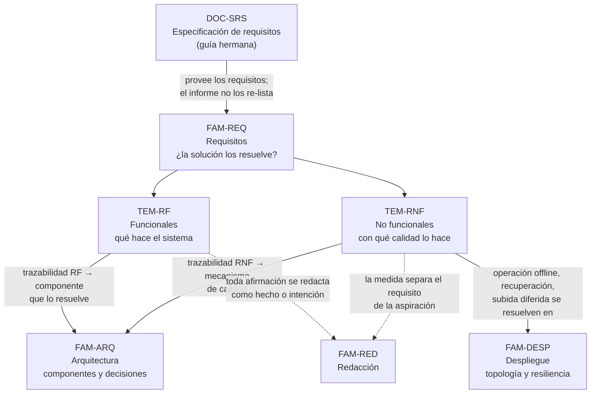

# Requisitos — `FAM-REQ`

## La pregunta que responde esta familia

**¿Cómo muestro que la solución resuelve los requisitos, funcionales y no funcionales?**

El pedido que origina la guía nombra tres cosas —arquitectura, despliegue y «resolución de requisitos funcionales y no funcionales»—, y esta es la tercera. La palabra clave es *resolución*: el lector no pidió la lista de requisitos, pidió ver que la solución los cumple. Esa distinción gobierna toda la familia. Enumerar requisitos es trabajo de la [especificación de requisitos](../../Documentacion-Tecnica/20-Analisis/SRS.md) de la guía hermana (`DOC-SRS`); mostrar que la arquitectura los satisface —qué componente resuelve cada uno, cómo, y con qué evidencia— es lo que el informe agrega y lo que estos dos documentos enseñan a redactar.

El instrumento es la **trazabilidad**: una correspondencia explícita entre cada requisito significativo y el mecanismo de la solución que lo atiende. `N-01` la respalda como el registro de *correspondences* que una descripción de arquitectura debe llevar entre sus elementos. Sin ella, un informe puede describir una arquitectura impecable y una lista de requisitos impecable sin que nada conecte una con la otra, y esa desconexión es exactamente donde un auditor (`ACT-08`) encuentra que la solución no resuelve lo que dice resolver.

---

## Documentos

| Documento | ID | Qué establece |
|---|---|---|
| [Requisitos funcionales](Requisitos-Funcionales.md) | `TEM-RF` | Qué es un requisito funcional según `N-06` 29148, por qué el informe no los re-lista sino que traza los significativos hacia el componente que los resuelve, y cómo cambia esa traza según el escenario |
| [Requisitos no funcionales](Requisitos-No-Funcionales.md) | `TEM-RNF` | El modelo de calidad de `N-04` 25010:2023 con sus nueve características, el requisito de calidad como atributo hecho medible, y cómo la arquitectura del sistema de audiencias resuelve operación offline, recuperación y subida diferida |

El orden de lectura es el de la tabla, pero el peso está invertido. [`TEM-RF`](Requisitos-Funcionales.md) es el más corto porque los requisitos funcionales, en un informe de solución, se despachan con una tabla de trazabilidad bien hecha: el detalle vive en la SRS. [`TEM-RNF`](Requisitos-No-Funcionales.md) es el documento más extenso de la guía, porque es donde una arquitectura se gana o se pierde y donde el sistema de audiencias exhibe los tres comportamientos que ningún ejemplo simple muestra. Un informe que dedica diez páginas a los requisitos funcionales y un párrafo a los no funcionales tiene el énfasis al revés.

---

## Cómo se relaciona con las demás familias

Dos aristas merecen explicación. La que va de `TEM-RNF` hacia [`FAM-DESP`](../30-Despliegue/README.md) es la más cargada del informe: los tres requisitos no funcionales que definen al sistema de audiencias —operar con el centro caído, recuperar el estado tras la caída del escritorio, subir los videos en segundo plano— no se resuelven en la arquitectura lógica sino en cómo el sistema se despliega y se comporta cuando algo falla, y por eso se retoman en [`TEM-OPERACION`](../30-Despliegue/Operacion-y-Resiliencia.md). La otra, punteada, hacia [`FAM-RED`](../50-Redaccion/README.md): un requisito no funcional mal redactado —«el sistema está diseñado para escalar»— no es un problema de contenido sino de redacción, porque enuncia una intención donde debía ir una medida.

---

## Qué se lleva el lector de esta familia

Tres capacidades, en orden de utilidad decreciente.

Distinguir *listar* un requisito de *demostrar* que la solución lo resuelve. La primera es copiar de la SRS; la segunda es construir la trazabilidad hacia el mecanismo y señalar la evidencia. El informe que confunde ambas re-enumera lo que el lector ya podía leer en otro lado y no responde la pregunta que le hicieron.

Expresar un requisito no funcional contra una característica de `N-04` 25010 y hacerlo medible. «Recuperar el estado de una audiencia en menos de cinco segundos tras la caída del escritorio» es un requisito de *recoverability* con un umbral verificable; «el sistema es resiliente» no es un requisito, es un deseo. La diferencia es la que separa un informe auditable de una pieza de marketing.

Calibrar el peso: pocos requisitos funcionales bien trazados, y los no funcionales significativos desarrollados a fondo. Es el reparto que el contexto `CTX-3` impone y el que casi todos los informes invierten.
