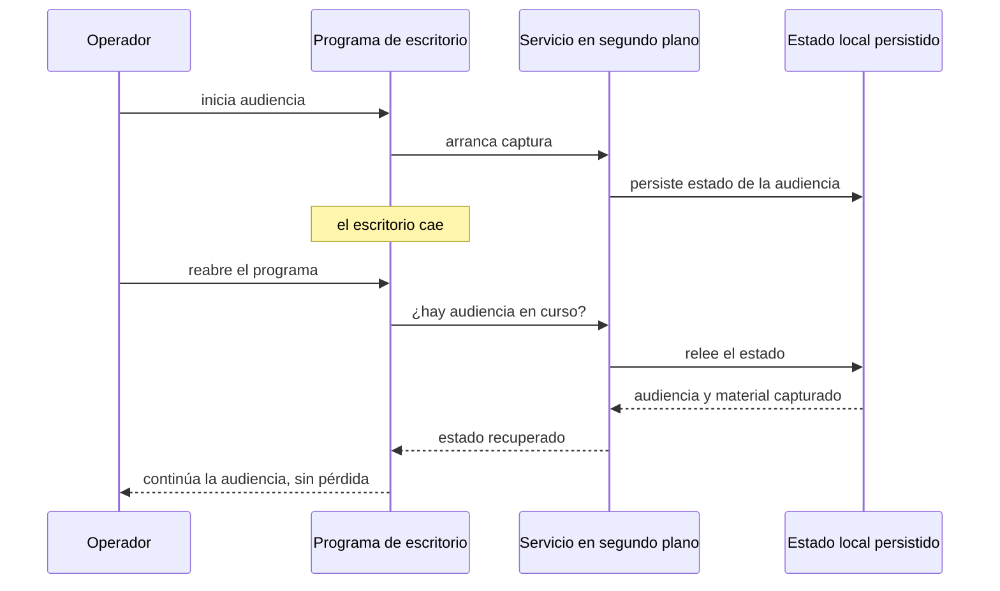

# Requisitos funcionales — `TEM-RF`

## Resumen ejecutivo

Un requisito funcional dice **qué debe hacer el sistema**: grabar una audiencia, reanudar una interrumpida, reproducir una grabación. La especificación de requisitos de la guía hermana (`DOC-SRS`) los enumera todos, con su redacción completa, sus condiciones de aceptación y su prioridad. El informe de solución no repite esa enumeración, y quien la copia produce el error más común de esta parte: convertir la sección de requisitos en un segundo SRS peor mantenido que el original.

Lo que el informe agrega es la **resolución**: mostrar que la arquitectura satisface los requisitos que importan, trazando cada uno hacia el componente que lo cumple, cómo lo cumple y con qué evidencia. La pieza central de este documento es esa tabla de trazabilidad, y la habilidad que enseña es elegir *qué* requisitos trazar —los significativos, los que ejercen la arquitectura— y cuáles dejar en la referencia a la SRS.

Le sirve a `ACT-01`, que redacta el cruce, y sobre todo a `ACT-08`, que en `ESC-4` recorre la trazabilidad preguntando por cada requisito «¿cómo sé que esto está resuelto?». Un informe que responde esa pregunta antes de que la formulen es un informe que se dejó auditar; uno que solo afirma «el sistema cumple los requisitos funcionales» invita a la pregunta y no la contesta.

---

## Definición

### Qué es

`N-06` —ISO/IEC/IEEE 29148:2018, la norma de ingeniería de requisitos (**Normativo**)— organiza el contenido de una especificación de software separando las **Functions** —los requisitos funcionales, lo que el sistema debe hacer— de los atributos que gobiernan *con qué calidad* lo hace (los no funcionales, que trata [`TEM-RNF`](Requisitos-No-Funcionales.md)). Un requisito funcional describe una capacidad observable: una entrada, un procesamiento y una salida que el sistema debe producir. «El sistema permite iniciar la grabación de una audiencia desde la terminal de la sala» es funcional; «la grabación se conserva aunque el backend esté caído» es no funcional, porque no agrega una función sino una condición de calidad —disponibilidad— sobre una función que ya existe.

La misma `N-06` fija las **nueve características de un requisito individual bien escrito**: *necessary, appropriate, unambiguous, complete, singular, feasible, verifiable, correct, conforming*. En un SRS esas características gobiernan cómo se **redacta** cada requisito. En el informe de solución gobiernan algo distinto y más modesto: cómo se **referencia**. El informe no reescribe el requisito —eso ya se hizo en la SRS— pero sí hereda tres de esas exigencias al citarlo. Un requisito que el informe traza debe seguir siendo *singular* (una capacidad, no cinco encubiertas en un «y»), *verifiable* (la columna de evidencia debe poder existir) e *identificable* por un ID estable, para que la traza apunte a algo que no se mueve.

Esos identificadores llevan el prefijo **`RF-`** y son los mismos que usa la SRS: el informe no inventa numeración propia, la toma de `DOC-SRS`, porque el valor de la traza es que un lector pueda saltar del informe a la especificación y encontrar el requisito completo. Inventar IDs nuevos rompe ese puente y crea dos fuentes de verdad.

### Qué problema resuelve

**La desconexión entre lo pedido y lo construido.** Un informe puede describir una arquitectura excelente y, por separado, listar requisitos correctos, sin que nada demuestre que la primera satisface los segundos. La trazabilidad es el puente. `N-01` —42010:2022 (**Normativo**)— la respalda: entre los elementos de una descripción de arquitectura debe registrarse un conjunto de *correspondences*, y la correspondencia entre un requisito y el componente que lo atiende es exactamente eso. La traza convierte «confíen en que la arquitectura cumple» en «esta es la fila donde ven que cumple».

**La sobrecarga de la enumeración completa.** Un sistema real tiene decenas o cientos de requisitos funcionales. Trazarlos todos en el informe produce una tabla que nadie lee y que se desactualiza el primer día. El informe traza los **significativos** —los que ejercen la arquitectura, los que el lector duda que estén resueltos, los que distinguen a este sistema de uno trivial— y para el resto remite a la SRS. Elegir cuáles es criterio de arquitecto, no una cuota.

### Qué NO es, y con qué se lo confunde

**No es la SRS.** Es la confusión dominante. La SRS (`DOC-SRS`) especifica todos los requisitos con su redacción normativa, sus prioridades y sus criterios de aceptación; es la fuente. El informe la referencia y traza un subconjunto contra la solución. Copiar la SRS dentro del informe duplica el contenido, garantiza que las dos copias diverjan y no agrega la única cosa que el informe debía agregar: la resolución.

**No es la vista de casos de uso.** Un caso de uso narra una interacción completa —el operador inicia sesión, selecciona la sala, arranca la grabación, la detiene, cierra—; un requisito funcional es una capacidad atómica que ese caso ejercita. El informe puede usar un caso de uso para dar contexto, pero la trazabilidad se hace contra requisitos identificables, no contra narraciones, porque una narración no se puede marcar como resuelta o pendiente.

**No es una lista de funcionalidades de marketing.** «Grabación en alta definición, subida automática, panel administrativo» es un catálogo de features, no requisitos: no son verificables, no tienen ID y no se pueden trazar. El informe técnico trabaja con requisitos que un auditor puede confrontar con el sistema.

**No es el módulo donde se decide qué construir.** Esa decisión ya se tomó y vive en la SRS y en las decisiones de arquitectura ([`TEM-DECISIONES`](../20-Arquitectura/Decisiones-de-Arquitectura.md), `DOC-ADR`). El informe describe la resolución de requisitos ya definidos; si al redactarlo aparece un requisito que nadie había registrado, el hallazgo se lleva de vuelta a `ACT-05`, no se resuelve inventándolo en el informe para que la arquitectura calce.

---

## Aplicación por escenario

### `ESC-1` — Solución en diseño

Los requisitos funcionales que el informe traza son **compromisos**: la arquitectura propuesta se ofrece a resolverlos, pero todavía no lo hizo. La columna de evidencia no puede decir «probado en producción» porque no hay producción; dice «previsto en el componente X», y el verbo importa. Un informe honesto de `ESC-1` traza el requisito contra el mecanismo que se piensa construir y marca su estado —decidido, propuesto, por confirmar— tal como `MARCO-ESCENARIOS` exige para todo lo que se afirma en este escenario. La trampa es escribir la tabla en presente indicativo, como si el sistema ya reanudara audiencias, cuando lo que hay es un diseño que promete reanudarlas.

### `ESC-2` — Solución construida

La trazabilidad describe lo que el sistema **efectivamente hace**, y su valor está en mostrar también lo que no hace del todo. Es el escenario del pedido que abre la guía, y su tensión es la misma que `MARCO-ESCENARIOS` señala: el sistema real casi nunca coincide con el diseño. Un requisito puede estar resuelto por un camino distinto del previsto, resuelto a medias, o resuelto con una limitación conocida. El informe de `ESC-2` lo declara: «RF-04 reproducción de grabaciones: resuelto; el frontend reproduce desde el servidor de archivos, pero solo los formatos que el navegador soporta de forma nativa, sin transcodificación». Esa segunda mitad —la limitación— es más útil que la afirmación de cumplimiento, porque es lo que el lector no podía saber sin que se lo dijeran. Ocultar las brechas produce un informe elegante que la primera prueba desmiente.

### `ESC-3` — Solución en evolución o migración

Los requisitos funcionales se dividen en tres columnas que el informe debe distinguir: los que **se conservan** sin cambios, los que **cambian** su forma de resolverse con la nueva arquitectura, y los que **se agregan**. Cuando la migración es de infraestructura —de FTP a un protocolo de subida reanudable, por ejemplo— la mayoría de los requisitos funcionales no cambian: sigue habiendo que grabar y reproducir. Lo que cambia es el mecanismo, y ahí la trazabilidad se vuelve doble, con la columna «cómo lo resolvía antes» y «cómo lo resuelve ahora», para que el lector vea qué se toca y qué no. Un requisito funcional que la migración rompe temporalmente durante la convivencia es información de primer orden, no un detalle.

### `ESC-4` — Evaluación de una solución ajena

Aquí la trazabilidad se lee, no se escribe: `ACT-08` recorre cada requisito y **verifica que esté realmente resuelto**, separando lo que el informe demuestra de lo que solo afirma. El trabajo consiste en confrontar la columna de evidencia con el sistema: si dice «resuelto por el servicio en segundo plano», se comprueba que ese servicio existe y hace lo que la fila afirma. Donde no hay informe previo, se levanta la trazabilidad desde el sistema observable, con el nivel de confianza declarado requisito por requisito. La trampa de `ESC-4` aplicada a los requisitos funcionales es premiar una tabla extensa y bien maquetada sin verificar una sola fila; una trazabilidad de cincuenta requisitos sin evidencia confrontable vale menos que una de cinco confrontados.

### Qué cambia según el contexto

| Contexto | Peso de los RF en el informe | Nota |
|---|---|---|
| `CTX-1` Monolito | Alto en relación al resto | El despliegue no da para mucho; la trazabilidad funcional carga buena parte del informe |
| `CTX-2` Cliente-servidor | Medio | Aparecen requisitos de interacción entre nodos que un monolito no tiene |
| `CTX-3` Borde distribuido | Medio, pero enredado con los no funcionales | Requisitos como «reanudar una audiencia interrumpida» son funcionales pero solo tienen sentido junto a la disponibilidad que los sostiene |
| `CTX-4` Multiservicio | Bajo por requisito, alto en conjunto | Cada servicio resuelve pocos requisitos; la traza sirve para ver qué servicio atiende qué |

El caso de `CTX-3` —el del sistema de audiencias— tiene una particularidad que conviene nombrar: **algunos requisitos funcionales son inseparables de un requisito no funcional**. «Reanudar una audiencia interrumpida» (`RF-`) es una función, pero solo existe porque hay un requisito de recuperación ante caídas (`RNF-`, ver [`TEM-RNF`](Requisitos-No-Funcionales.md)) que la hace necesaria y posible. La trazabilidad de uno remite a la del otro, y separarlos con un tabique produce dos medias verdades.

---

## Ejemplos concretos

Todos los ejemplos son **sintéticos** y pertenecen al sistema de gestión de audiencias de [`MARCO-CONTEXTOS`](../00-Marco-de-Referencia/Contextos.md#el-sistema-de-ejemplo--gestión-de-audiencias). Los IDs `RF-` son ilustrativos; en un sistema real provienen de `DOC-SRS`.

### La tabla de trazabilidad — el corazón del documento

Fragmento de la sección «Resolución de requisitos funcionales» de un informe de `ESC-2`. Cada fila cruza un requisito significativo con el componente que lo resuelve, el mecanismo concreto y la evidencia que respalda la afirmación.

| RF | Requisito (resumen; ver `DOC-SRS`) | Componente que lo resuelve | Cómo | Evidencia |
|---|---|---|---|---|
| `RF-01` | Grabar una audiencia desde la terminal de la sala | Programa de escritorio + servicio en segundo plano | El operador inicia desde el escritorio; el servicio captura de las cámaras y escribe el archivo local | Grabación de prueba por sala en la puesta en marcha |
| `RF-02` | Reanudar una audiencia interrumpida por caída del escritorio | Servicio en segundo plano + estado local persistido | El servicio conserva el estado de la audiencia fuera del proceso del escritorio; al reabrir, el escritorio lo recupera y continúa | Prueba de matar el proceso y reabrir; ver `RNF-` recuperación en [`TEM-RNF`](Requisitos-No-Funcionales.md) |
| `RF-03` | Subir la grabación al servidor de archivos | Servicio en segundo plano → servidor FTP/tus | Al cerrar la audiencia, el archivo entra en la cola de subida y se transfiere en segundo plano | Registro de la cola; archivo presente en el servidor tras la subida |
| `RF-04` | Que un administrativo reproduzca una grabación | Frontend Blazor → servidor de archivos | El frontend lista las audiencias desde el backend y reproduce el video desde el servidor de archivos | Reproducción en el frontend; limitación de formatos declarada |
| `RF-05` | Consultar el estado de las audiencias en curso | Frontend Blazor → backend (API) | El backend expone el estado que las terminales reportan; el frontend lo muestra | Estado visible en el panel mientras una terminal graba |

La columna que hace el trabajo es **Evidencia**. Sin ella, la tabla afirma sin demostrar y no sobrevive a un lector de `ESC-4`. Con ella, cada fila es una invitación a confrontar: el auditor sigue la evidencia hasta el sistema y verifica. Nótese que `RF-04` arrastra su limitación a la propia tabla —«limitación de formatos declarada»— en lugar de esconderla en un pie de página.

### Una fila trazada de punta a punta

Una tabla comprime; un flujo narrado muestra por qué la fila de `RF-02` afirma lo que afirma. El informe acompaña la trazabilidad de los requisitos difíciles con la secuencia que la respalda, para que el lector vea el mecanismo en movimiento y no solo su nombre.



El diagrama hace visible por qué `RF-02` se traza contra el **servicio en segundo plano** y no contra el escritorio: la función de reanudar existe porque el estado vive fuera del proceso que se cayó. Es también la razón por la que este requisito funcional es inseparable del atributo de *recoverability* que [`TEM-RNF`](Requisitos-No-Funcionales.md) desarrolla; la evidencia de la tabla —«matar el proceso y reabrir»— es precisamente la prueba que recorre esta secuencia.

### Cómo referenciar sin re-especificar

Así **no** —el informe transcribe el requisito completo, con su redacción normativa, duplicando la SRS:

> `RF-02`. El sistema deberá permitir la reanudación de una audiencia que haya sido interrumpida por la caída inesperada del programa de escritorio, conservando la totalidad de los metadatos capturados hasta el momento de la interrupción, sin pérdida de material grabado, y permitiendo al operador continuar la grabación en el mismo archivo o en uno nuevo vinculado, según la configuración de la sala. Criterios de aceptación: (1)… (2)… (3)…

Así **sí** —el informe resume, traza y remite a la fuente para el detalle:

> `RF-02` (reanudar una audiencia interrumpida) se resuelve manteniendo el estado de la audiencia en el servicio en segundo plano, fuera del proceso del escritorio: cuando el escritorio cae, el servicio sigue vivo y conserva lo capturado, y al reabrir el operador retoma la audiencia sin pérdida. La redacción completa y los criterios de aceptación están en `DOC-SRS`. El mecanismo de recuperación se detalla como requisito no funcional en [`TEM-RNF`](Requisitos-No-Funcionales.md) y como comportamiento operativo en [`TEM-OPERACION`](../30-Despliegue/Operacion-y-Resiliencia.md).

La segunda versión ocupa la mitad, no duplica nada, y deja tres puentes: a la especificación para el requisito, al no funcional para la calidad que lo sostiene, y a la operación para el comportamiento en ejecución.

---

## Preguntas guía

- ¿Estoy trazando los requisitos significativos, o copiando la SRS entera dentro del informe?
- Para cada fila de la trazabilidad, ¿puedo nombrar el componente que resuelve el requisito y la evidencia que lo demuestra, o solo afirmo que está cumplido?
- ¿Los IDs `RF-` que uso son los de `DOC-SRS`, o inventé numeración propia y creé una segunda fuente de verdad?
- Si estoy en `ESC-2`, ¿declaré las resoluciones parciales y las limitaciones, o solo las que salieron bien?
- ¿Hay algún requisito funcional que solo tenga sentido junto a un requisito no funcional? ¿Los tracé juntos o los separé?
- Si un auditor sigue la columna de evidencia hasta el sistema, ¿la fila sobrevive a la confrontación?

---

## Criterios de calidad

### Sección buena

Cada requisito trazado apunta a un ID estable de `DOC-SRS`, a un componente identificable de la vista de arquitectura y a una evidencia confrontable. La selección de qué trazar está justificada: se trazan los requisitos que ejercen la arquitectura y los que el lector podría dudar que estén resueltos, no una cuota arbitraria. Las resoluciones parciales se declaran con su limitación en la misma tabla. El texto remite a la SRS para el detalle en lugar de reproducirlo, y a los requisitos no funcionales cuando la función depende de una calidad.

### Sección pobre y antipatrones

**El segundo SRS.** El informe copia la lista completa de requisitos con su redacción normativa. Duplica el contenido, se desactualiza, y no agrega la resolución. Es el antipatrón dominante y se reconoce porque la sección no menciona un solo componente: solo requisitos.

**La afirmación sin traza.** «El sistema cumple todos los requisitos funcionales» sin una tabla que lo muestre. Es la frase que un auditor está entrenado para no creer, y con razón: no señala nada confrontable.

**La tabla sin evidencia.** Trazabilidad de requisito a componente pero con la columna de evidencia vacía o llena de «OK». La traza queda a mitad de camino: dice quién debería resolver el requisito, no que lo resuelva.

**El requisito inventado.** El autor agrega a la tabla un requisito que no está en la SRS porque la arquitectura lo resuelve bien y luce. La trazabilidad debe partir de los requisitos definidos por `ACT-05`; los que aparecen al redactar son hallazgos para la SRS, no material del informe.

**El presente indicativo en `ESC-1`.** Describir compromisos como hechos. «El sistema reanuda audiencias interrumpidas» cuando el sistema aún no existe induce a decidir sobre una certeza inexistente, que es la trampa que `MARCO-ESCENARIOS` señala para el escenario.

---

## Anexo — Lista de verificación de la trazabilidad funcional

Se completa por requisito significativo. En `ESC-1`/`ESC-2`/`ESC-3` se redacta como decisión; en `ESC-4` se llena como observación al confrontar con el sistema.

```yaml
seccion: resolucion_de_requisitos_funcionales
escenario: ESC-?
contexto: CTX-?
fuente_de_requisitos: DOC-SRS        # el informe no define requisitos, los referencia
modo: decision | observacion

requisitos_trazados:
  - id: RF-??                        # el ID de la SRS, no uno nuevo
    resumen: ""                      # una línea; el detalle está en DOC-SRS
    significativo_porque: ""         # por qué se traza este y no se deja en la SRS
    componente_que_resuelve: ""      # de la vista de arquitectura; ver TEM-COMPONENTES
    mecanismo: ""                    # cómo lo resuelve, en una frase
    estado: resuelto | parcial | previsto | pendiente
    limitacion_conocida: ""          # si estado = parcial; se declara, no se oculta
    evidencia: ""                    # qué confronta la afirmación con el sistema
    depende_de_rnf: RNF-??           # si la función se apoya en un requisito de calidad
    verificado: si | no | inferido   # en ESC-4: cómo se estableció

requisitos_no_trazados:
  remitidos_a: DOC-SRS               # el resto de los requisitos vive en la especificación
  criterio_de_exclusion: ""          # por qué no ameritan traza en el informe
```

El campo `significativo_porque` es el que evita los dos errores opuestos: trazar todo —que produce el segundo SRS— y trazar de menos —que deja fuera un requisito que el lector necesitaba ver resuelto. Un requisito sin respuesta a esa pregunta o sobra en la tabla o falta la razón por la que está.
