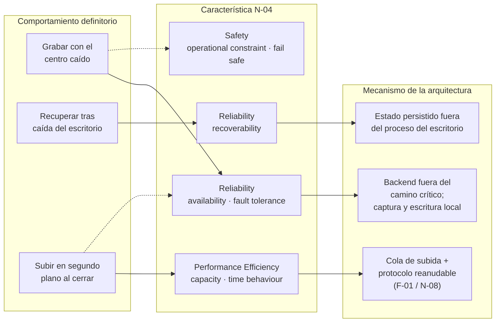

# Requisitos no funcionales — `TEM-RNF`

## Resumen ejecutivo

Un requisito funcional dice qué hace el sistema; un requisito no funcional dice **con qué calidad lo hace**. Grabar una audiencia es funcional; grabarla aunque el centro de datos esté caído es no funcional, y es exactamente lo que distingue al sistema de audiencias de un grabador cualquiera. En un informe de solución, los requisitos no funcionales son donde una arquitectura se gana o se pierde: la decisión de correr un servicio en segundo plano por terminal, de persistir el estado fuera del proceso del escritorio o de subir los videos con un protocolo reanudable no responde a ninguna función nueva, responde a atributos de calidad. Por eso este es el documento más extenso de la guía y el que el lector técnico más quiere entender.

El instrumento de referencia es `N-04` —ISO/IEC 25010:2023—, el modelo de calidad de producto, que clasifica esos atributos en **nueve características**. La edición anterior, de 2011, tenía ocho, y casi todo el material que circula sobre calidad sigue citando esa lista superada: quien habla de «usabilidad» y «portabilidad» como características está usando vocabulario que la norma vigente renombró. Nombrar bien las características no es pedantería; es lo que permite preguntar, por cada una, la pregunta correcta.

La habilidad central que este documento enseña es convertir una aspiración en un requisito **medible**. «El sistema es resiliente» no es un requisito, es un deseo; «el sistema recupera el estado de una audiencia en menos de cinco segundos tras la caída del escritorio» es un requisito de *recoverability* que un auditor puede verificar con un cronómetro. La diferencia entre un informe auditable y una pieza de marketing pasa por esa frontera, y el antipatrón que más la cruza —«el sistema está diseñado para escalar»— aparece en casi todos los informes que no la conocen.

---

## Definición

### Qué es

Un requisito no funcional es una condición sobre **cómo** el sistema cumple sus funciones, no sobre qué funciones cumple. `N-06` —ISO/IEC/IEEE 29148:2018 (**Normativo**)— los ubica en la especificación de software fuera de las *Functions*: como *performance requirements*, *usability requirements*, *design constraints* y, sobre todo, **software system attributes**, que es el cajón donde viven los atributos de calidad —disponibilidad, seguridad, mantenibilidad—. Esa clasificación fija *dónde* viven en una SRS; `N-04` fija *contra qué catálogo* se los expresa.

Un **requisito de calidad** es un requisito no funcional expresado contra una característica de `N-04` y **hecho medible**. Es la forma que este documento defiende, y tiene tres partes: la característica de calidad que atiende, el enunciado de la condición y el criterio de verificación con su umbral. «*Reliability* → *recoverability*: recuperar el estado de una audiencia en menos de X segundos tras la caída del escritorio, verificado matando el proceso y cronometrando la reapertura» es un requisito de calidad completo. Le falta cualquiera de las tres partes y deja de ser verificable.

Los identificadores llevan el prefijo **`RNF-`**, y como los funcionales, provienen de `DOC-SRS`: el informe traza, no numera. La diferencia con los funcionales es de peso y de forma. Los funcionales se despachan con una tabla de trazabilidad; los no funcionales exigen, por cada uno significativo, explicar el mecanismo arquitectónico que lo resuelve y la medida que lo verifica, porque es ahí donde el lector juzga si la arquitectura es buena.

### El modelo de calidad de `N-04` — las nueve características

`N-04` —ISO/IEC 25010:2023 (**Normativo**)— define el modelo de calidad de producto con nueve características de alto nivel. La lista, verificada contra el prólogo de la 2.ª edición:

1. **Functional Suitability** — adecuación funcional: que las funciones existan, sean correctas y sirvan al propósito.
2. **Performance Efficiency** — eficiencia de desempeño: comportamiento respecto de los recursos y el tiempo.
3. **Compatibility** — compatibilidad: coexistencia con otros productos e interoperabilidad.
4. **Interaction Capability** — capacidad de interacción (renombrada desde *Usability*).
5. **Reliability** — fiabilidad: que el sistema funcione cuando y como se espera.
6. **Security** — seguridad.
7. **Maintainability** — mantenibilidad.
8. **Flexibility** — flexibilidad (renombrada desde *Portability*).
9. **Safety** — seguridad física / ausencia de daño (característica **nueva** en 2023).

Los cambios respecto de la edición 2011 son sustantivos y desactualizan casi todo el material secundario. Se transcriben verbatim del prólogo, tal como los registra [`ANEXO-REFERENCIAS`](../99-Anexos/Referencias.md):

> «Safety has been added as a quality characteristic… Usability and portability have been replaced with interaction capability and flexibility respectively… User interface aesthetics and maturity have been replaced with user engagement and faultlessness respectively… Accessibility has been split into inclusivity and user assistance.»

Dos de esos cambios operan sobre nombres de característica —*usability*→*interaction capability*, *portability*→*flexibility*— y tres sobre nombres de subcaracterística —*maturity*→*faultlessness*, *user interface aesthetics*→*user engagement*, y *accessibility* partida en *inclusivity* y *user assistance*—. El error más común sobre calidad es usar la lista de 2011: hablar de «las ocho características», incluir «usabilidad» y «portabilidad», y omitir *Safety*. Citar `N-04` por su año —«25010:2023»— es lo que permite detectar la desactualización, y por eso `MARCO-CONVENCIONES` lo exige.

### Las subcaracterísticas

Cada característica se descompone en subcaracterísticas, y es al nivel de subcaracterística donde un requisito se vuelve preciso: no se mide «fiabilidad» en abstracto, se mide *recoverability*. La tabla siguiente las lista con una **advertencia de autoridad** que conviene leer antes de usarla.

Los **nombres de las nueve características**, las **cinco subcaracterísticas de *Safety***, los **renombres** (*maturity*→*faultlessness*, *UI aesthetics*→*user engagement*, *accessibility* dividida en *inclusivity* y *user assistance*) y las **altas de 2023** (*self-descriptiveness*, *resistance*, *scalability*) son verbatim del prólogo de `N-04` (**Normativo**). Las subcaracterísticas de las características que *no* cambiaron se **reconstruyeron desde la base de 2011** —que el prólogo declara solo redefinida con nombres más precisos—; se marcan como reconstruidas porque el texto normativo completo está tras el muro de pago y no se leyó línea por línea (ver la advertencia de citación de `N-04` en [`ANEXO-REFERENCIAS`](../99-Anexos/Referencias.md)).

| Característica (verbatim `N-04`) | Subcaracterísticas | Autoridad |
|---|---|---|
| Functional Suitability | completeness, correctness, appropriateness | Reconstruida de 2011 |
| Performance Efficiency | time behaviour, resource utilization, capacity | Reconstruida de 2011 |
| Compatibility | co-existence, interoperability | Reconstruida de 2011 |
| Interaction Capability | appropriateness recognizability, learnability, operability, user error protection, **user engagement** (era UI aesthetics), **inclusivity** y **user assistance** (era accessibility), **self-descriptiveness** (alta 2023) | Base 2011 + renombres y altas verbatim |
| Reliability | **faultlessness** (era maturity), availability, fault tolerance, recoverability | Reconstruida de 2011 + renombre verbatim |
| Security | confidentiality, integrity, non-repudiation, accountability, authenticity, **resistance** (alta 2023) | Base 2011 + alta verbatim |
| Maintainability | modularity, reusability, analysability, modifiability, testability | Reconstruida de 2011 |
| Flexibility | adaptability, installability, replaceability, **scalability** (alta 2023) | Base 2011 + alta verbatim |
| Safety | **operational constraint, risk identification, fail safe, hazard warning, safe integration** | Verbatim `N-04` |

*Safety* es la característica nueva y la que más se malinterpreta: no es *Security*. *Security* protege la información —confidencialidad, integridad—; *Safety* protege contra el daño que el sistema podría causar en el mundo. En el sistema de audiencias, que una grabación no se pierda porque de ella depende un acto con valor legal es más cercano a *Safety* —*operational constraint*, *fail safe*— que a *Security*. La distinción importa al redactar el informe, porque la pregunta que dispara cada característica es distinta.

### Qué problema resuelve

**La invisibilidad de la calidad.** Los requisitos funcionales se ven: el sistema graba o no graba. Los no funcionales no se ven hasta que fallan: nadie nota la disponibilidad hasta que el sistema se cae en el peor momento. El informe existe en parte para hacer visible, *antes* del fallo, cómo la arquitectura atiende cada atributo de calidad relevante. `N-04` da el catálogo de qué preguntar para que ninguno se olvide.

**La aspiración disfrazada de requisito.** «El sistema debe ser rápido, seguro y escalable» no compromete a nada porque no se puede verificar. Expresar cada atributo contra una característica de `N-04` y darle una medida lo convierte en algo que se cumple o no se cumple. Es la función más importante de este documento: **la medida es lo que separa el requisito de la intención**.

**El desbalance de énfasis.** En `CTX-3`, los requisitos no funcionales son el corazón del sistema, y sin embargo el reflejo del redactor es dedicarles un párrafo genérico al final. El modelo de `N-04` obliga a recorrer las características una por una y a decidir, para cada una, si es significativa en este sistema y cómo se resuelve.

### Qué NO es, y con qué se lo confunde

**No es una lista de adjetivos.** «Escalable, mantenible, seguro, usable» es un catálogo de aspiraciones, no de requisitos. Un requisito no funcional tiene una condición y una medida; un adjetivo no tiene ninguna de las dos.

**No es la sección de atributos de la SRS copiada.** Como con los funcionales, la SRS (`DOC-SRS`) es la fuente; el informe traza los significativos hacia el mecanismo que los resuelve y la medida que los verifica. Copiar la lista de atributos sin mostrar la resolución repite el error del segundo SRS que [`TEM-RF`](Requisitos-Funcionales.md) describe.

**No es lo mismo que una restricción de diseño.** `N-06` distingue los *software system attributes* de los *design constraints*. «El sistema debe recuperar el estado en menos de cinco segundos» es un atributo de calidad; «el sistema debe usar PostgreSQL» es una restricción de diseño impuesta desde afuera. Ambos son no funcionales en sentido amplio, pero solo el primero se mide contra una característica de `N-04`; el segundo se justifica en una decisión de arquitectura ([`TEM-DECISIONES`](../20-Arquitectura/Decisiones-de-Arquitectura.md), `DOC-ADR`).

**No es *Security* cuando se dice *Safety*, ni al revés.** Son dos características distintas de `N-04` desde 2023. Confundirlas hace que el informe atienda una y crea haber atendido la otra.

---

## Aplicación por escenario

### `ESC-1` — Solución en diseño

Los requisitos no funcionales son **el argumento central** del informe, porque es donde una arquitectura propuesta se justifica o se descarta. `MARCO-ESCENARIOS` lo dice: es en los no funcionales donde una arquitectura se gana o se pierde. El informe de `ESC-1` describe, por cada atributo significativo, el mecanismo que se piensa construir y la medida objetivo que se compromete a alcanzar. La medida es una meta, no un hecho —«se prevé recuperar en menos de cinco segundos»—, y el verbo debe delatarlo. La trampa doble de este escenario aplica con fuerza: presentar una meta como si estuviera lograda, y sobredimensionar —diseñar disponibilidad de nivel bancario para un sistema sin un solo usuario.

### `ESC-2` — Solución construida

La medida deja de ser meta y pasa a ser **hecho medido**. Aquí el informe puede y debe reportar el valor real: no «se diseñó para recuperar rápido» sino «recupera en 3,8 s medidos en la sala 4». Es el escenario donde el antipatrón de la aspiración es más grave, porque hay un sistema real contra el cual medir y elegir no medirlo es una omisión. `MARCO-ESCENARIOS` da la reformulación canónica: en lugar de «el sistema está diseñado para escalar horizontalmente», el informe de `ESC-2` afirma «el backend corre en una única instancia; el escalado horizontal es posible por su diseño sin estado pero no se ejercita en producción». La segunda frase es un hecho verificable y además más útil, porque distingue lo que el sistema hace de lo que podría hacer.

### `ESC-3` — Solución en evolución o migración

Los requisitos no funcionales son **la justificación de la migración**. Casi ninguna migración se hace por una función nueva; se hace por un atributo de calidad que el sistema actual no alcanza —capacidad, disponibilidad, mantenibilidad—. El informe compara el atributo en el estado actual y en el objetivo, con la medida de ambos: «la subida por FTP no reanuda y una caída de red reinicia el archivo entero; el protocolo reanudable (`F-01`) recupera desde el offset, reduciendo el reintento de N minutos a segundos». Sin la medida del punto de partida, el lector no puede juzgar si la mejora vale el costo de migrar, que es la pregunta de `ESC-3`.

### `ESC-4` — Evaluación de una solución ajena

`ACT-08` recorre cada requisito no funcional preguntando **cómo se mide** y verificando la medida. El trabajo es separar la característica atendida con un mecanismo real de la que solo tiene un adjetivo. Un informe que afirma «alta disponibilidad» sin decir contra qué se mide ni cuánto se logra es un hallazgo, no una prueba. Cuando no hay informe, se levanta la evaluación desde el sistema: se provoca la caída del centro y se observa si la terminal sigue grabando, se mata el proceso del escritorio y se cronometra la recuperación. La trampa de `ESC-4` —premiar la forma— es especialmente peligrosa aquí, porque un informe lleno de diagramas de resiliencia puede describir un sistema que nunca se probó cayendo.

### Qué cambia según el contexto

| Contexto | Características de `N-04` que dominan | Nota |
|---|---|---|
| `CTX-1` Monolito | Functional Suitability, Maintainability | Poca superficie de fallo distribuido; la calidad se juega en el código, no en la topología |
| `CTX-2` Cliente-servidor | Performance Efficiency, Security, Reliability | Aparecen latencia entre nodos, seguridad del canal y disponibilidad del backend |
| `CTX-3` Borde distribuido | **Reliability, Safety, Performance Efficiency** | La operación degradada y la no pérdida de material son de primer orden; ver el sistema de audiencias |
| `CTX-4` Multiservicio | Reliability, Performance Efficiency, Maintainability | Escalabilidad, resiliencia entre servicios y consistencia distribuida |

El sistema de audiencias vive en `CTX-3`, y sus tres requisitos no funcionales definitorios —que `MARCO-CONTEXTOS` nombra como el corazón de lo que el informe debe explicar— se mapean directamente sobre `N-04`. El apartado siguiente los trabaja.

---

## Ejemplos concretos

Todos los ejemplos son **sintéticos** y pertenecen al sistema de gestión de audiencias de [`MARCO-CONTEXTOS`](../00-Marco-de-Referencia/Contextos.md#el-sistema-de-ejemplo--gestión-de-audiencias). Los umbrales (`X`, cifras) son ilustrativos; en un sistema real provienen de `DOC-SRS` y de la medición.

### Los tres requisitos definitorios, mapeados a `N-04`

Los tres comportamientos que definen al sistema no son funciones sino atributos de calidad, y cada uno cae sobre una característica de `N-04`:

- **Operar con el centro caído** → *Reliability* (**availability** y **fault tolerance**), con un borde de *Safety* (**operational constraint**: la audiencia debe poder celebrarse aunque falle la red). La audiencia se inicia y se graba en la terminal aunque el backend y el frontend estén caídos. Lo resuelve la arquitectura al no poner al backend en el camino crítico de la grabación: el servicio en segundo plano captura y escribe localmente, y solo reporta estado al centro cuando el enlace está. Se retoma en [`TEM-OPERACION`](../30-Despliegue/Operacion-y-Resiliencia.md).
- **Recuperar el estado tras la caída del escritorio** → *Reliability* (**recoverability**). El estado de la audiencia se persiste fuera del proceso del programa de escritorio —en el servicio en segundo plano y en almacenamiento local—, de modo que si el escritorio cae, el estado sobrevive y al reabrir se recupera. Sostiene al requisito funcional `RF-02` de [`TEM-RF`](Requisitos-Funcionales.md): la función de reanudar existe porque este atributo la hace posible.
- **Subir los videos en segundo plano al cerrar** → *Performance Efficiency* (**capacity** y **time behaviour**) con apoyo de *Reliability* (**fault tolerance**). Al cerrar una audiencia el operador no espera a que el video suba: entra en una cola y se transfiere en segundo plano, con un protocolo reanudable (`F-01` tus) o FTP (`N-08`) que sobrevive a cortes de red. El atributo es que iniciar una audiencia nueva no dependa de que terminó de subir la anterior.

El mapeo de cada comportamiento a su característica y a su mecanismo es lo que convierte tres frases del enunciado en tres requisitos trazables:



Las aristas punteadas registran los solapamientos: grabar con el centro caído toca *Safety* además de *Reliability*, porque de la grabación depende un acto con valor legal; y la subida diferida se apoya en la tolerancia a fallos, porque una cola que pierde su contenido ante un corte no resuelve nada. Un informe que asigna cada comportamiento a una sola característica pierde esos bordes, que suelen ser donde está el riesgo.

### La tabla de requisitos de calidad — el corazón del documento

Fragmento de la sección «Resolución de requisitos no funcionales» de un informe de `ESC-2`. Recorre las características de `N-04` significativas, y por cada una: qué pregunta dispara, el requisito del sistema, cómo lo resuelve la arquitectura y cómo se mide.

| Característica `N-04` | Qué preguntar | RNF del sistema de audiencias | Cómo lo resuelve la arquitectura | Cómo se mide |
|---|---|---|---|---|
| Reliability · availability | ¿Sigue funcionando lo esencial si un componente cae? | `RNF-01` Grabar aunque el centro esté caído | El backend no está en el camino crítico; el servicio local captura y escribe sin él | % de audiencias iniciadas con el centro caído en prueba de corte |
| Reliability · recoverability | ¿Recupera el estado tras un fallo, y en cuánto? | `RNF-02` Recuperar el estado de la audiencia tras caída del escritorio | Estado persistido fuera del proceso del escritorio; reapertura lo relee | Segundos entre matar el proceso y retomar la grabación (objetivo < X s) |
| Performance Efficiency · capacity | ¿La carga diferida bloquea el trabajo en curso? | `RNF-03` Iniciar una audiencia nueva sin esperar la subida de la anterior | Cola de subida en segundo plano; subida reanudable (`F-01`/`N-08`) | Tiempo entre cerrar una audiencia y poder iniciar otra (objetivo ≈ inmediato) |
| Security · confidentiality | ¿Cómo viaja y se guarda el material sensible? | `RNF-04` Proteger el canal y el acceso a las grabaciones | TLS en el enlace terminal→centro; control de acceso en el frontend | Ver `DOC-SECARQ`; el informe referencia, no reespecifica |
| Safety · fail safe | ¿Qué pasa con el material si algo falla a mitad? | `RNF-05` No perder material grabado ante un fallo | Escritura local incremental; el archivo parcial sobrevive a la caída | Material recuperable tras corte forzado en prueba |
| Maintainability · modularity | ¿Se puede intervenir una parte sin tocar el resto? | `RNF-06` Actualizar el escritorio sin tocar el servicio | Escritorio y servicio como unidades desplegables separadas | Ver `DOC-SAD`; se referencia la vista de componentes |
| Flexibility · installability | ¿Cómo se instala y actualiza en cada terminal? | `RNF-07` Instalar y actualizar por terminal de forma repetible | Empaquetado MSIX (`N-16`); modelo de publicación declarado (`N-09`) | Instalación reproducible verificada en la puesta en marcha |

Las dos primeras columnas son las que un redactor sin el modelo de `N-04` olvida: recorrer las características garantiza que ninguna quede sin preguntarse. La última columna —**Cómo se mide**— es la que un evaluador de `ESC-4` verifica primero; una fila con esa celda vacía describe una aspiración, no un requisito. Las filas de *Security* y *Maintainability* referencian `DOC-SECARQ` y `DOC-SAD` en lugar de reespecificar: el informe traza, la guía hermana detalla.

### La medida, en dos versiones

Así **no** —el atributo enunciado como aspiración, sin condición ni umbral verificable:

> El sistema está diseñado para escalar y ofrecer alta disponibilidad, con una arquitectura robusta y resiliente que garantiza la continuidad del servicio ante fallos.

No compromete a nada. «Diseñado para», «robusta», «garantiza» son palabras que ningún auditor puede confrontar con el sistema. Es el antipatrón que `MARCO-ESCENARIOS` señala como la trampa característica de `ESC-2`.

Así **sí** —el atributo expresado contra una característica de `N-04`, con condición, mecanismo y medida:

> `RNF-01` (*Reliability* · availability). La terminal inicia y graba una audiencia aunque el backend y el frontend estén caídos, porque el servicio en segundo plano captura y escribe en almacenamiento local sin depender del centro. Medido en prueba de corte: 20 de 20 audiencias iniciadas con el enlace al centro deshabilitado. Limitación conocida: los metadatos que la terminal reporta al centro se sincronizan al restablecerse el enlace, con la ventana de retraso que documenta [`TEM-OPERACION`](../30-Despliegue/Operacion-y-Resiliencia.md).

La segunda versión dice qué atributo, contra qué característica, con qué mecanismo, con qué medida y con qué límite. Es más larga y es la única de las dos que un lector puede creer.

---

## Preguntas guía

- Por cada característica de `N-04` significativa en mi sistema, ¿enuncié el requisito con una medida, o con un adjetivo?
- ¿Estoy citando las nueve características de 25010:2023, o arrastro las ocho de 2011 con «usabilidad» y «portabilidad»?
- ¿Distinguí *Security* de *Safety*? ¿El requisito de no perder material está donde corresponde?
- Para cada RNF, ¿nombré el mecanismo arquitectónico que lo resuelve y la forma de medirlo, o solo afirmé que el sistema lo cumple?
- Si estoy en `ESC-2`, ¿reporté valores medidos, o describí intenciones de diseño teniendo un sistema real para medir?
- ¿Escribí «el sistema está diseñado para escalar» en algún lado? Si sí, ¿contra qué se mide ese escalado y cuánto se ejercita en producción?
- ¿Los tres atributos definitorios del sistema —offline, recuperación, subida diferida— están desarrollados a fondo, o despachados en un párrafo genérico?

---

## Criterios de calidad

### Sección buena

Cada requisito no funcional significativo está expresado contra una característica de `N-04` nombrada por su designación vigente, con una condición y una medida verificable. El mecanismo arquitectónico que lo resuelve está identificado y, cuando el detalle vive en la guía hermana —seguridad en `DOC-SECARQ`, componentes en `DOC-SAD`—, se referencia en lugar de reespecificar. En `ESC-2` las medidas son valores reales, no metas. Los tres atributos que definen al sistema reciben espacio proporcional a su peso. Las limitaciones conocidas se declaran junto al requisito que limitan.

### Sección pobre y antipatrones

**La aspiración sin medida.** «El sistema es escalable, seguro y de alta disponibilidad.» Ningún adjetivo se puede verificar. Es el antipatrón dominante, y su forma canónica —«el sistema está diseñado para escalar»— enuncia una intención de diseño donde debía ir un hecho medido. `MARCO-ESCENARIOS` lo usa como ejemplo de referencia de la trampa de `ESC-2`.

**La lista de 2011.** Hablar de «las ocho características de calidad», incluir «usabilidad» y «portabilidad», omitir *Safety*. Delata que el autor no verificó la edición vigente y arrastra vocabulario superado.

**Confundir *Security* con *Safety*.** Atender la protección de la información y creer que con eso se cubrió el daño que el sistema podría causar, o al revés. Son dos características distintas de `N-04`.

**El mecanismo ausente.** Enunciar el requisito de calidad y no decir cómo la arquitectura lo resuelve. «El sistema debe recuperar el estado en menos de cinco segundos» sin explicar que el estado se persiste fuera del proceso del escritorio es un requisito sin resolución: dice qué se quiere, no que se logre.

**El desbalance.** Un párrafo genérico de requisitos no funcionales en un sistema `CTX-3` donde son el corazón de la arquitectura. El síntoma es que la operación offline, que es lo más difícil y lo más interesante del sistema, ocupa menos espacio que la lista de tecnologías.

**La restricción disfrazada de atributo.** Presentar «debe usar PostgreSQL» como un requisito de calidad medible. Es una restricción de diseño (`N-06`), se justifica en un `DOC-ADR`, y no se mide contra `N-04`.

---

## Anexo — Lista de verificación de requisitos de calidad

Se recorre **característica por característica** de `N-04`, decidiendo para cada una si es significativa en el sistema y, si lo es, completando el requisito. Recorrer las nueve es lo que evita el olvido silencioso de un atributo. En `ESC-1`/`ESC-3` los valores son metas; en `ESC-2` son medidas; en `ESC-4` son observaciones.

```yaml
seccion: resolucion_de_requisitos_no_funcionales
escenario: ESC-?
contexto: CTX-?
modelo_de_calidad: N-04              # ISO/IEC 25010:2023, nueve características
fuente_de_requisitos: DOC-SRS       # el informe traza, no numera

# Recorrer las nueve; marcar 'no_significativa' con su razón, no omitir la fila.
caracteristicas:
  - nombre: Reliability             # nombre verbatim de N-04
    significativa: si | no
    razon_si_no: ""
    requisitos:
      - id: RNF-??                   # el ID de la SRS
        subcaracteristica: recoverability
        condicion: ""               # qué debe lograr el sistema
        mecanismo: ""               # cómo lo resuelve la arquitectura
        medida: ""                  # el criterio de verificación con umbral
        valor: ""                   # meta (ESC-1/3) o valor medido (ESC-2)
        limitacion_conocida: ""     # se declara, no se oculta
        detalle_en: ""              # DOC-SAD / DOC-SECARQ / TEM-OPERACION si aplica
        verificado: si | no | inferido
  # ... repetir para Functional Suitability, Performance Efficiency, Compatibility,
  #     Interaction Capability, Security, Maintainability, Flexibility, Safety

antipatrones_a_revisar:
  aspiracion_sin_medida: []         # todo RNF cuya 'medida' esté vacía
  vocabulario_2011: no | si         # ¿aparece "usabilidad"/"portabilidad" como característica?
  security_vs_safety_confundidos: no | si
```

El campo `medida` es el que decide si la fila es un requisito o un deseo: sin medida no hay verificación, y sin verificación el informe afirma sin demostrar. El bloque `antipatrones_a_revisar` es una pasada final; si `aspiracion_sin_medida` no está vacío, la sección todavía tiene requisitos que son intenciones.
