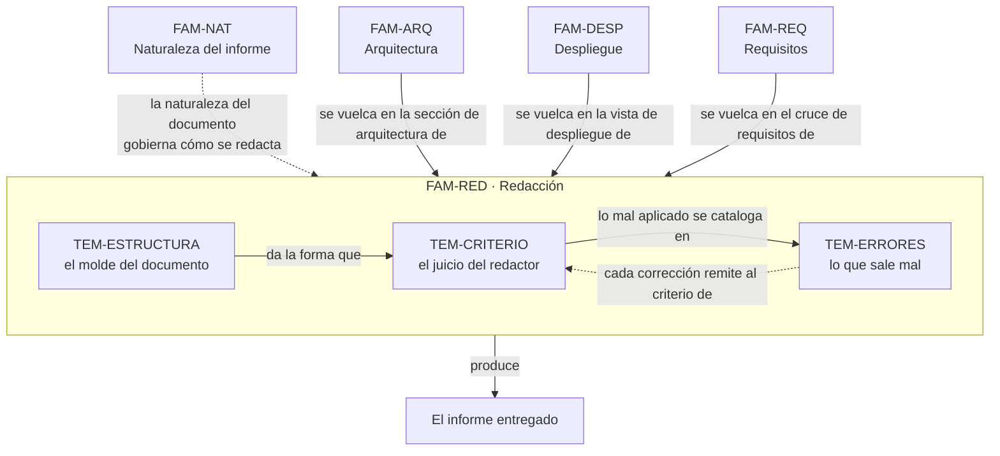

# Redacción del informe — `FAM-RED`

## La pregunta que responde esta familia

**¿Con qué criterio se redacta el informe para que forme, no solo informe?**

Las tres familias anteriores fijan *qué* va en el informe: la arquitectura, el despliegue y el cruce de requisitos. Ninguna dice *cómo* se escribe eso para que un lector que no conoce el sistema lo entienda y decida sobre él. Un informe puede tener la arquitectura correcta, la topología exacta y todos los requisitos, y aun así fallar, porque describe la estructura de carpetas en lugar de las responsabilidades, o vende una intención como si fuera un hecho, o abruma con detalle sin jerarquía hasta que el decisor no encuentra la decisión. Esta familia trata ese salto: del contenido correcto al documento que sirve.

El pedido que origina la guía —«un documento que describa la solución… para comprender mejor el enfoque general»— es antes que nada un pedido de redacción. Quien lo formula ya sabe que el sistema existe; lo que no tiene es una forma de entenderlo. La distancia entre el sistema y su comprensión la cubre la escritura, y esa escritura tiene criterio propio, no es transcripción. La familia lo desarrolla en tres piezas: la forma del documento, el juicio del que escribe y el catálogo de lo que sale mal.

---

## Documentos

| Documento | ID | Qué establece |
|---|---|---|
| [Estructura del documento](Estructura-del-Documento.md) | `TEM-ESTRUCTURA` | El modelo formal de documento: un orden de secciones recomendado para el informe transversal, sintetizado de `N-01` 42010, arc42 (`G-01`) y el SAD de RUP (`G-04`), con cada sección mapeada a su respaldo y a su actor |
| [Criterio de redacción](Criterio-de-Redaccion.md) | `TEM-CRITERIO` | El juicio que forma al redactor: qué preguntarse al escribir cada sección, la voz técnica de `Rule-Narrative-Voice`, y la disciplina central de escribir para el lector `ACT-03` y no para uno mismo |
| [Errores frecuentes](Errores-Frecuentes.md) | `TEM-ERRORES` | El catálogo de antipatrones de redacción —carpetas en vez de arquitectura, intención en vez de realidad, autoridad sin fuente, muro sin jerarquía— con su síntoma, por qué daña y cómo se corrige |

El orden de lectura es el de la tabla. [`TEM-ESTRUCTURA`](Estructura-del-Documento.md) da el molde; [`TEM-CRITERIO`](Criterio-de-Redaccion.md) enseña a llenarlo con juicio en lugar de con relleno; [`TEM-ERRORES`](Errores-Frecuentes.md) reúne lo que hay que detectar y corregir antes de entregar. Los tres son transversales: no describen una parte del informe, sino cómo se escribe cualquiera de ellas.

---

## La variante de redacción

Estos tres documentos tratan sobre cómo escribir, no sobre qué describir, y por eso su cuarta sección toma otra forma. Donde los documentos de contenido ofrecen **fragmentos de informe** sobre el sistema de audiencias, los de `FAM-RED` ofrecen **frases de referencia**: pares de «así no / así sí» que contrastan una redacción que falla con la que la corrige. Es la única desviación admitida respecto de la estructura de siete partes, y [`MARCO-CONVENCIONES`](../00-Marco-de-Referencia/Convenciones.md#variante-de-redacción) la declara. El resto de la estructura —resumen, definición, aplicación por escenario, preguntas guía, criterios de calidad, anexo— se conserva.

---

## Cómo se relaciona con las demás familias

`FAM-RED` es la última familia de la guía porque recibe el contenido de las otras tres y lo convierte en documento. No agrega material técnico: agrega la forma y el criterio con que ese material se comunica. La arista desde [`FAM-NAT`](../10-Naturaleza-del-Informe/README.md) es la que gobierna todo lo demás —saber que el informe es una síntesis orientada a una decisión, y no un SAD exhaustivo, es lo que le dice al redactor cuánto detalle merece cada sección—, y por eso la estructura que aquí se propone estratifica el documento por actor, tal como [`MARCO-ACTORES`](../00-Marco-de-Referencia/Actores.md#el-error-de-actor-más-común) lo anticipa.

---

## Qué se lleva el lector de esta familia

Tres capacidades, en orden de utilidad decreciente.

Un modelo de documento defendible: un orden de secciones que no copia una plantilla sino que sintetiza las que existen y las adapta al escenario y al contexto, con cada decisión de estructura trazable a `N-01` o a un marco nombrado. Es lo que evita el informe que empieza con la página en blanco y termina con el índice del último proyecto.

El reflejo de escribir para quien lee. El redactor conoce el sistema demasiado bien para notar cuánto contexto le falta a `ACT-03`, y ese es el origen de casi todos los informes ilegibles. Formar el hábito de releer cada sección desde el lugar del lector es la habilidad más valiosa de la familia, y la más difícil de adquirir.

Un catálogo de errores para revisar contra el propio borrador. Nombrar el antipatrón —«esto es intención presentada como hecho», «esto es una carpeta descrita como arquitectura»— es el primer paso para corregirlo, y la [lista de verificación](../99-Anexos/Lista-de-Verificacion.md) lo convierte en rutina.
