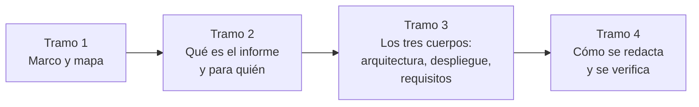

# Guía de estudio — Informe de solución: arquitectura, despliegue y requisitos en .NET

## Resumen ejecutivo

Cuerpo documental formativo sobre cómo escribir **un informe que describe una solución de software** en términos de arquitectura, despliegue y resolución de requisitos funcionales y no funcionales. Responde a un pedido concreto y frecuente en entornos técnicos —«necesitamos un documento que nos permita comprender el enfoque general de la solución»— y enseña a producirlo con criterio: qué estructura darle, qué vocabulario usar, qué respalda cada afirmación y cómo distinguir una versión buena de una que solo lo parece.

La guía persigue los dos objetivos que la originan: **formar criterio de redacción** —para que el autor decida, no rellene una plantilla— y ofrecer **un modelo formal de documento** listo para presentar a un entorno técnico. El modelo vive en [`ANEXO-PLANTILLA`](99-Anexos/Plantilla-del-Informe.md); el criterio, en toda la guía.

El recorrido va de lo general a lo particular. Primero el **marco de referencia**, que fija cuatro escenarios, cuatro contextos y ocho actores y se convierte en el vocabulario común. Después el **mapa conceptual**, con tablas de entrada «estoy acá, ¿qué leo?». Después las **cinco familias temáticas**: qué es el informe, cómo se describe la arquitectura, cómo el despliegue, cómo la resolución de requisitos, y con qué criterio se redacta todo. Al final, los **anexos**: la plantilla, el glosario, la lista de verificación, las referencias verificadas y los pendientes.

Todos los ejemplos usan el mismo dominio —un **sistema de gestión de audiencias** distribuido en el borde, con grabación por terminal, operación con el centro caído y subida diferida de videos— porque exhibe los problemas que un ejemplo simple no muestra. Las tecnologías de referencia son .NET 10, ASP.NET Core, Blazor, Worker Services y PostgreSQL.

---

## Cómo usar esta guía

Tres entradas según el motivo de la consulta.

**Aprender a escribir el informe.** El orden de los directorios es el orden de lectura. Marco de referencia, mapa, familias de la 10 a la 50, anexos. La [ruta sugerida](#ruta-de-lectura-sugerida) lo desglosa.

**Escribir un informe ahora.** Ir al [mapa conceptual](01-Mapa-Conceptual/Mapa-Conceptual.md), entrar por el escenario y el contexto propios, y trabajar con la [plantilla comentada](99-Anexos/Plantilla-del-Informe.md), que tiene una sección por cada parte del informe con sus preguntas guía.

**Evaluar un informe ajeno.** La [lista de verificación](99-Anexos/Lista-de-Verificacion.md) y, dentro de cada documento temático, la sección de criterios de calidad, que es donde vive la distinción entre lo aceptable y lo que solo lo parece.

---

## Tabla de contenido

### Marco de referencia

El vocabulario común. Nada del resto se entiende sin esto.

| Documento | ID | Qué fija |
|-----------|----|----------|
| [Escenarios](00-Marco-de-Referencia/Escenarios.md) | `MARCO-ESCENARIOS` | Las cuatro situaciones de partida: solución en diseño, construida, en evolución, ajena |
| [Contextos](00-Marco-de-Referencia/Contextos.md) | `MARCO-CONTEXTOS` | Las cuatro formas arquitectónicas: monolito, cliente-servidor, borde distribuido, multiservicio |
| [Actores](00-Marco-de-Referencia/Actores.md) | `MARCO-ACTORES` | Los ocho roles alrededor del informe y la matriz de responsabilidad |
| [Convenciones](00-Marco-de-Referencia/Convenciones.md) | `MARCO-CONVENCIONES` | Identificadores, frontmatter, estructura de documento, niveles de autoridad y estilo |

### Mapa conceptual

| Documento | ID | Qué resuelve |
|-----------|----|--------------|
| [Mapa conceptual](01-Mapa-Conceptual/Mapa-Conceptual.md) | `MAPA-CONCEPTUAL` | Tres tablas de entrada —por escenario, por contexto y por parte del informe— más los cruces |

### Familia 10 — Naturaleza del informe · ¿Qué es y para quién?

[Índice de la familia](10-Naturaleza-del-Informe/README.md) · `FAM-NAT`

| Documento | ID | Propósito |
|-----------|----|-----------|
| [Qué es y qué no es](10-Naturaleza-del-Informe/Que-es-y-que-no-es.md) | `TEM-QUE-ES` | El informe como síntesis transversal orientada a una decisión; su lugar en el catálogo de familias |
| [Estándares y marcos](10-Naturaleza-del-Informe/Estandares-y-Marcos.md) | `TEM-ESTANDARES` | 42010, 4+1, arc42, C4, TOGAF; qué es norma y qué es marco; el mapa parte del informe ↔ referente |
| [Audiencia y propósito](10-Naturaleza-del-Informe/Audiencia-y-Proposito.md) | `TEM-AUDIENCIA` | Para quién se escribe, qué decisión habilita, cómo se estratifica por lector |

### Familia 20 — Arquitectura · ¿Cómo está organizada la solución?

[Índice de la familia](20-Arquitectura/README.md) · `FAM-ARQ`

| Documento | ID | Propósito |
|-----------|----|-----------|
| [Vista de componentes](20-Arquitectura/Vista-de-Componentes.md) | `TEM-COMPONENTES` | Componentes, responsabilidades, relaciones y límites; no la estructura de carpetas |
| [Vistas y diagramas](20-Arquitectura/Vistas-y-Diagramas.md) | `TEM-VISTAS` | Varias vistas por concern; niveles de zoom C4; qué diagramas necesita el informe |
| [Decisiones de arquitectura](20-Arquitectura/Decisiones-de-Arquitectura.md) | `TEM-DECISIONES` | Cómo narrar decisiones y trade-offs; cuándo referenciar un ADR |

### Familia 30 — Despliegue · ¿Dónde corre y cómo se instala y opera?

[Índice de la familia](30-Despliegue/README.md) · `FAM-DESP`

| Documento | ID | Propósito |
|-----------|----|-----------|
| [Topología y entornos](30-Despliegue/Topologia-y-Entornos.md) | `TEM-TOPOLOGIA` | Nodos, artefactos y entornos; el diagrama de despliegue |
| [Distribución e instalación](30-Despliegue/Distribucion-e-Instalacion.md) | `TEM-DISTRIBUCION` | Cómo se empaqueta, distribuye e instala cada componente en .NET |
| [Operación y resiliencia](30-Despliegue/Operacion-y-Resiliencia.md) | `TEM-OPERACION` | Operación degradada, recuperación y trabajo diferido; cómo se narran |

### Familia 40 — Requisitos · ¿La solución resuelve lo que debe?

[Índice de la familia](40-Requisitos/README.md) · `FAM-REQ`

| Documento | ID | Propósito |
|-----------|----|-----------|
| [Requisitos funcionales](40-Requisitos/Requisitos-Funcionales.md) | `TEM-RF` | Trazabilidad requisito → mecanismo; qué mostrar sin re-listar el SRS |
| [Requisitos no funcionales](40-Requisitos/Requisitos-No-Funcionales.md) | `TEM-RNF` | Atributos de calidad de ISO/IEC 25010:2023, medibles, y cómo la arquitectura los resuelve |

### Familia 50 — Redacción · ¿Con qué criterio se escribe?

[Índice de la familia](50-Redaccion/README.md) · `FAM-RED`

| Documento | ID | Propósito |
|-----------|----|-----------|
| [Estructura del documento](50-Redaccion/Estructura-del-Documento.md) | `TEM-ESTRUCTURA` | El modelo formal: orden de secciones, estratificación, trazabilidad a los marcos |
| [Criterio de redacción](50-Redaccion/Criterio-de-Redaccion.md) | `TEM-CRITERIO` | Qué preguntarse por sección; la voz; frases de referencia |
| [Errores frecuentes](50-Redaccion/Errores-Frecuentes.md) | `TEM-ERRORES` | Antipatrones de redacción, con síntoma y corrección |

### Anexos

| Documento | ID | Propósito |
|-----------|----|-----------|
| [Plantilla del informe](99-Anexos/Plantilla-del-Informe.md) | `ANEXO-PLANTILLA` | El modelo formal completo, sección por sección, con preguntas guía |
| [Glosario](99-Anexos/Glosario.md) | `ANEXO-GLOSARIO` | Término canónico, definición, alias y fuente |
| [Lista de verificación](99-Anexos/Lista-de-Verificacion.md) | `ANEXO-CHECK` | Revisión del informe por sección, escenario y contexto |
| [Referencias](99-Anexos/Referencias.md) | `ANEXO-REFERENCIAS` | Fuentes verificadas, clasificadas por nivel de autoridad |
| [Pendientes](99-Anexos/Pendientes.md) | `ANEXO-PENDIENTES` | Estado del avance, fuentes sin verificar y extensiones posibles |

---

## Ruta de lectura sugerida

**Tramo 1 — El aparato conceptual.** Escenarios, contextos, actores, convenciones y mapa. Es el único tramo obligatorio: sin los cuatro escenarios y los cuatro contextos, el resto se lee como una plantilla suelta.

**Tramo 2 — Naturaleza del informe.** Familia 10. Se aprende qué es este documento, con qué estándares se relaciona y a quién le habla. La distinción entre norma y marco —arc42 no es un estándar— se fija acá y ordena todo lo demás.

**Tramo 3 — Los tres cuerpos.** Familias 20, 30 y 40. Arquitectura, despliegue y requisitos. En un sistema distribuido en el borde como el de audiencias, el despliegue y los requisitos no funcionales son los tramos de mayor rendimiento.

**Tramo 4 — Redacción.** Familia 50 más los anexos. Cómo se ordena, se escribe y se verifica el informe. Quien ya sabe qué contar y necesita saber cómo escribirlo puede empezar por acá.

### Rutas alternativas por rol

| Rol | Ruta corta |
|-----|-----------|
| Arquitecto que escribe (`ACT-01`) | Tramo 1 → familia 10 → plantilla → familias 20/30/40 → familia 50 |
| Responsable de despliegue (`ACT-04`) | Tramo 1 → familia 30 → topología y distribución → operación |
| Solicitante técnico / evaluador (`ACT-03`, `ACT-08`) | Mapa → `TEM-QUE-ES` → lista de verificación → criterios de calidad de cada tema |
| Analista de requisitos (`ACT-05`) | Tramo 1 → familia 40 → `TEM-RNF` → plantilla |

---

## Alcance y límites

La guía cubre la redacción de **un informe transversal** que sintetiza arquitectura, despliegue y resolución de requisitos, tomando del catálogo de tipos de documentación técnica su tabla y su agrupación en siete familias para situar este informe en la intersección de las familias de análisis, arquitectura y operativa.

Lo que la guía **no** hace: no reescribe los documentos que la [guía hermana de documentación técnica](../Documentacion-Tecnica/README.md) ya trata por separado —el SAD, el SRS, la Deployment Guide, los ADR—, sino que enseña a componerlos en un informe único y los referencia; no enseña .NET, Blazor ni PostgreSQL, que aparecen como vocabulario de los ejemplos; y no prescribe un proceso de trabajo único.

Las afirmaciones que provienen de estándares se citan por designación exacta y año. Lo que es marco de un autor —arc42, C4— se nombra como tal, y lo que es criterio propio se declara donde aparece. Cada documento registra en su frontmatter su origen y su nivel de confianza, según [Convenciones](00-Marco-de-Referencia/Convenciones.md).

---

## Estado y verificación

| Bloque | Documentos | Líneas |
|--------|-----------:|-------:|
| Marco de referencia | 4 | 632 |
| Mapa conceptual | 1 | 106 |
| Familia 10 · Naturaleza | 4 | 769 |
| Familia 20 · Arquitectura | 4 | 783 |
| Familia 30 · Despliegue | 4 | 788 |
| Familia 40 · Requisitos | 3 | 540 |
| Familia 50 · Redacción | 4 | 845 |
| Anexos | 5 | 710 |
| Índice | 1 | — |
| **Total** | **30** | **≈5 400** |

El cuerpo contiene 22 diagramas Mermaid y ningún enlace interno roto. Todas las fuentes de [`ANEXO-REFERENCIAS`](99-Anexos/Referencias.md) se verificaron el 2026-07-21 contra el documento primario, con una salvedad de método declarada: las normas ISO se verificaron contra sus PDF de muestra oficiales —portada, prólogo, alcance e índice—, porque el texto normativo completo es de pago. Lo que no pudo verificarse de primera mano está aislado en [`ANEXO-PENDIENTES`](99-Anexos/Pendientes.md) y no se cita como hecho.

Correcciones de fondo que la investigación impuso y que distinguen esta guía del material corriente: **ISO/IEC 25010:2023** renombró *Usability* a *Interaction Capability* y *Portability* a *Flexibility*, y agregó *Safety* —nueve características, no las ocho de 2011—; **arc42 y C4 son marcos con licencia Creative Commons, no normas**; y la única definición de «arquitectura de solución» que la guía cita como fuente es la de TOGAF, porque el término no tiene definición normativa única.
