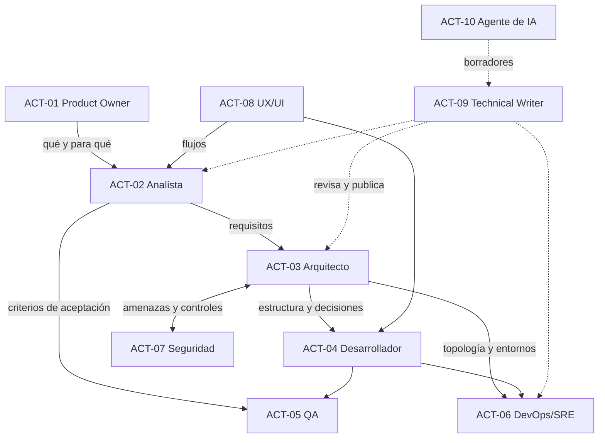

# Actores del dominio

## Resumen ejecutivo

Un actor es un rol con autoridad y alcance definidos sobre ciertos documentos. Este eje existe para que el lector se ubique: qué le toca decidir, qué le toca redactar, qué le toca revisar y qué debe delegar. La confusión de roles produce dos patologías simétricas y frecuentes: el desarrollador que decide arquitectura en un commit sin registrarlo, y el arquitecto que especifica nombres de variables.

Los roles son funciones, no personas. En un equipo de cuatro, la misma persona ocupa tres de ellos, y eso está bien siempre que sepa desde cuál está hablando en cada momento.

---

## Mapa de actores

| ID | Actor | Pregunta que responde | Autoridad principal |
|----|-------|----------------------|---------------------|
| `ACT-01` | Product Owner | ¿Vale la pena construir esto? | Alcance, prioridad, aceptación |
| `ACT-02` | Analista funcional | ¿Qué debe hacer exactamente? | Requisitos y reglas de negocio |
| `ACT-03` | Arquitecto de software | ¿Cómo se estructura y por qué? | Decisiones estructurales y sus registros |
| `ACT-04` | Desarrollador | ¿Cómo se implementa cada pieza? | Diseño detallado y convenciones aplicadas |
| `ACT-05` | QA / Ingeniero de calidad | ¿Cómo sabemos que funciona? | Estrategia y casos de prueba |
| `ACT-06` | DevOps / SRE | ¿Cómo se despliega y se opera? | Entornos, despliegue, operación |
| `ACT-07` | Especialista en seguridad | ¿Qué puede salir mal y quién lo aprovecha? | Arquitectura de seguridad y amenazas |
| `ACT-08` | Diseñador UX/UI | ¿Cómo lo vive el usuario? | Flujos, interacción, criterios de usabilidad |
| `ACT-09` | Technical Writer | ¿Se entiende lo escrito? | Coherencia, estructura y publicación |
| `ACT-10` | Agente de IA asistente | ¿Qué puedo generar y qué debo dejar en manos humanas? | Ninguna; produce borradores trazables |



Las flechas punteadas indican revisión o asistencia, no autoridad. El Technical Writer no decide contenido técnico y el agente de IA no decide nada: ambos mejoran la forma y proponen la sustancia, que otro firma.

---

## Fichas de actor

### `ACT-01` — Product Owner

**Área.** Negocio y producto. Es el puente entre quien paga el sistema y quien lo construye.

**Responsabilidad documental.** Es dueño del Vision Document, del BRD, del PRD y del Roadmap. No los escribe necesariamente solo, pero los firma: si dicen algo que el negocio no sostiene, es su problema.

**Hasta dónde llega.** Decide qué se construye y en qué orden, y acepta o rechaza el resultado contra los criterios que él mismo fijó. No decide cómo se construye. La frase «necesito que esto use microservicios» es una invasión de alcance; la frase «necesito poder desplegar el módulo de facturación sin frenar al resto» es un requisito legítimo que el arquitecto traducirá en estructura.

**Preguntas guía sobre su alcance.**
- ¿Está expresando un resultado de negocio o una solución técnica?
- ¿Puede explicar por qué esta funcionalidad está antes que aquella?
- ¿Los criterios de aceptación que firmó son verificables por alguien que no sea él?

---

### `ACT-02` — Analista funcional

**Área.** Entre el negocio y el sistema. Traduce necesidad en especificación.

**Responsabilidad documental.** SRS, casos de uso, reglas de negocio y modelo de dominio. En `ESC-3` y `ESC-4` su trabajo se invierte: en lugar de escribir requisitos, los reconstruye a partir del sistema observado, y esa reconstrucción es de las tareas más difíciles del oficio porque exige distinguir lo que el sistema hace de lo que debería hacer.

**Hasta dónde llega.** Define qué debe hacer el sistema y bajo qué reglas. No define con qué componentes. El límite es nítido en la práctica: si al describir un requisito necesita nombrar una tecnología, o está documentando una restricción real del negocio —«debe correr en el SQL Server que ya tenemos»— o se está pasando de rol.

**Preguntas guía sobre su alcance.**
- ¿Este enunciado es verificable, o es una aspiración?
- ¿La regla de negocio que escribió tiene dueño en el negocio que pueda confirmarla?
- ¿Está describiendo el comportamiento requerido o la implementación que imagina?

---

### `ACT-03` — Arquitecto de software

**Área.** Estructura del sistema y sus propiedades de calidad.

**Responsabilidad documental.** SAD, HLD, ADR, arquitectura de seguridad junto con `ACT-07`, y las RFC de cambios estructurales. Es el actor con mayor densidad documental de la guía, porque su trabajo consiste literalmente en dejar decisiones registradas: una decisión arquitectónica que no se escribió se vuelve a discutir cada seis meses.

**Hasta dónde llega.** Decide la estructura, los límites entre componentes, las tecnologías troncales y los compromisos entre atributos de calidad. No decide el detalle interno de cada componente —eso es `ACT-04`— ni el alcance funcional —eso es `ACT-01`—. El síntoma de sobrealcance es el arquitecto que revisa nombres de métodos; el de subalcance, el que entrega un diagrama de cajas sin una sola decisión justificada.

Su producto más valioso no es el diagrama sino el **por qué**: qué alternativas se evaluaron, con qué criterio se eligió y qué se sacrifica con la elección.

**Preguntas guía sobre su alcance.**
- ¿Qué atributo de calidad estoy optimizando y cuál estoy sacrificando a cambio?
- ¿Esta decisión es reversible? Si no lo es, ¿está registrada en un ADR con sus alternativas?
- ¿Estoy decidiendo estructura o estoy diseñando la implementación de otro?

---

### `ACT-04` — Desarrollador

**Área.** Implementación.

**Responsabilidad documental.** LLD, especificación de API cuando la genera el código, Developer Guide, Change Log, y las convenciones que aplica a diario. También es el consumidor principal de casi todo lo demás: si un documento no le sirve para escribir código, probablemente no le sirva a nadie.

**Hasta dónde llega.** Decide cómo se implementa dentro de los límites que fijó la arquitectura. Cuando una decisión de implementación empieza a tener consecuencias fuera de su componente —introducir una biblioteca nueva, cambiar el modelo de concurrencia, agregar una dependencia entre servicios— dejó de ser implementación y necesita un ADR o una RFC.

**Preguntas guía sobre su alcance.**
- ¿Esta decisión afecta solo a mi componente, o alguien más va a tener que convivir con ella?
- ¿Estoy documentando lo que el código no puede expresar por sí mismo, o estoy parafraseando el código?
- ¿La convención que estoy aplicando está escrita en algún lado, o es costumbre mía?

---

### `ACT-05` — QA / Ingeniero de calidad

**Área.** Verificación y evidencia de comportamiento.

**Responsabilidad documental.** Test Plan y Test Cases; además, es el revisor natural de la calidad de un SRS, porque un requisito que no se puede convertir en caso de prueba está mal escrito. Ese circuito —QA leyendo requisitos antes de que exista código— es una de las prácticas de mayor retorno y de las más frecuentemente omitidas.

**Hasta dónde llega.** Define qué se prueba, cómo y con qué criterio de aceptación. No define qué debe hacer el sistema; lo verifica contra lo especificado. Cuando descubre que la especificación no dice nada sobre un caso, su salida correcta no es inventar el comportamiento esperado sino devolver la pregunta a `ACT-02`.

En `ESC-2` su rol se vuelve central: es quien define y ejecuta el criterio de paridad entre el sistema origen y el destino.

**Preguntas guía sobre su alcance.**
- ¿Este requisito se puede probar? Si no, ¿qué le falta?
- ¿El caso que estoy escribiendo verifica el requisito o verifica la implementación?
- ¿Qué riesgo cubre esta prueba, y qué queda sin cubrir?

---

### `ACT-06` — DevOps / SRE

**Área.** Entornos, despliegue, operación y continuidad.

**Responsabilidad documental.** Installation Guide, Deployment Guide, Operations Guide, Runbooks, documentación de CI/CD y recuperación ante desastres, y los Postmortems de los incidentes. Su documentación tiene una propiedad que la distingue del resto: se lee bajo presión, a las tres de la mañana, por alguien que no la escribió. Eso impone un estilo distinto —imperativo, con pasos numerados y resultados esperados explícitos— y una exigencia de actualización mucho más severa: un runbook desactualizado prolonga la caída en lugar de acortarla.

**Hasta dónde llega.** Decide cómo se despliega y se opera lo que otros construyeron, y tiene poder de veto sobre lo inoperable. No decide la arquitectura interna, pero sí participa de las decisiones que afectan la operabilidad: si el arquitecto propone una topología que no se puede monitorear ni desplegar por partes, esa objeción es legítima y va registrada en el ADR correspondiente.

**Preguntas guía sobre su alcance.**
- ¿Alguien que nunca vio este sistema podría ejecutar este procedimiento y saber si salió bien?
- ¿Qué pasa si el paso 4 falla a la mitad? ¿Está documentada la vuelta atrás?
- ¿Este runbook se probó alguna vez, o se escribió de memoria?

---

### `ACT-07` — Especialista en seguridad

**Área.** Amenazas, controles y cumplimiento.

**Responsabilidad documental.** Arquitectura de seguridad y Threat Model; revisa además el SAD, el modelo de datos y la especificación de API buscando lo que no está dicho. Su aporte documental característico es negativo: registra lo que el sistema **no** debe permitir, que es exactamente lo que el resto de la documentación tiende a omitir.

**Hasta dónde llega.** Define los controles exigidos y evalúa el riesgo residual. No decide si el riesgo se acepta: eso es del dueño del producto o del negocio, y la decisión de aceptar un riesgo se documenta con nombre y fecha, porque es la clase de decisión que después nadie recuerda haber tomado.

**Preguntas guía sobre su alcance.**
- ¿Cuál es el activo que protejo y quién querría comprometerlo?
- ¿El control que exijo es proporcional al riesgo, o estoy encareciendo el sistema sin justificarlo?
- ¿Quién firmó la aceptación del riesgo residual?

---

### `ACT-08` — Diseñador UX/UI

**Área.** Experiencia, flujos e interacción.

**Responsabilidad documental.** Flujos de usuario, mapas de navegación, prototipos, sistema de diseño y criterios de usabilidad y accesibilidad. Su documentación es la que más se apoya en artefactos visuales, lo cual crea una tensión con la regla de diagramas como código: los prototipos de alta fidelidad no son diffeables, y conviene que el contrato verificable —flujos, estados, reglas de interacción, criterios de accesibilidad— viva en texto y diagramas versionables, con el prototipo como ilustración y no como fuente de verdad.

**Hasta dónde llega.** Define cómo se usa el sistema. No define qué hace ni cómo se implementa, aunque en `CTX-1` la frontera con el análisis funcional es genuinamente porosa: un flujo de usuario bien hecho contiene requisitos implícitos, y lo sano es que `ACT-02` y `ACT-08` produzcan juntos y no en serie.

**Preguntas guía sobre su alcance.**
- ¿Este flujo contempla el error, el vacío y la interrupción, o solo el camino feliz?
- ¿Los criterios de accesibilidad son verificables por QA?
- ¿Lo que estoy definiendo es experiencia o es regla de negocio disfrazada de interacción?

---

### `ACT-09` — Technical Writer

**Área.** Calidad, coherencia y publicación del cuerpo documental.

**Responsabilidad documental.** User Manual, tutoriales, FAQ y guías rápidas como autor; y como editor, la coherencia del conjunto: terminología única, estructura repetida, enlaces vivos, glosario mantenido. En equipos sin este rol formal, la función igual existe y suele recaer, mal distribuida, en quien más le molesta la inconsistencia.

**Hasta dónde llega.** Decide forma, estructura y claridad. No decide contenido técnico: cuando detecta una contradicción entre dos documentos, la escala al dueño de cada uno en lugar de resolverla eligiendo la versión que le parece mejor.

**Preguntas guía sobre su alcance.**
- ¿Un lector sin contexto previo entiende esto?
- ¿El mismo concepto se nombra igual en todo el conjunto?
- ¿Esta corrección es de forma, o estoy cambiando lo que el documento afirma?

---

### `ACT-10` — Agente de IA asistente

**Área.** Producción asistida de documentación y código.

**Responsabilidad documental.** Genera borradores, reconstruye documentación a partir de código en `ESC-3`, mantiene consistencia terminológica, detecta huecos y solapamientos. Es el actor más reciente del mapa y el único sin autoridad propia: todo lo que produce es propuesta hasta que un actor humano lo revisa y lo firma.

**Hasta dónde llega.** El límite operativo es la verificabilidad. Un agente puede reconstruir un modelo de datos leyendo migraciones —cada afirmación rastreable a un archivo— y no puede establecer una regla de negocio que ninguna evidencia sostenga. La distinción entre lo observado y lo inferido, que en un autor humano es una buena práctica, acá es la condición de uso: por eso el frontmatter de cada documento registra `origin` y `confidence`.

Su integración disciplinada con el resto del marco es el objeto del documento de [Spec-Driven Development](../95-Transversales/Spec-Driven-Development.md).

**Preguntas guía sobre su alcance.**
- ¿Cada afirmación de este borrador se puede rastrear a evidencia concreta?
- ¿Qué parte es observación, qué parte es inferencia y qué parte es convención razonable pero no verificada?
- ¿Quién es el actor humano que firma esto?

---

## Matriz de responsabilidad por familia documental

Se usa la convención RACI reducida: **R** produce, **A** aprueba, **C** es consultado, **I** es informado. Una celda vacía indica que el actor no interviene de forma significativa.

| Familia | PO | Analista | Arquitecto | Dev | QA | DevOps | Seguridad | UX | Writer |
|---------|----|----------|-----------|-----|----|--------|-----------|----|--------|
| Visión | A/R | C | C | I | I | I | C | C | C |
| Análisis | A | R | C | C | C | I | C | C | C |
| Arquitectura | I | C | A/R | C | I | C | C | I | C |
| Diseño | I | C | A | R | C | I | C | C | I |
| Operativa | I | I | C | C | C | A/R | C | I | C |
| Desarrollo | I | I | A | R | C | C | I | I | C |
| Usuarios | A | C | I | C | C | I | I | C | R |
| Pruebas | A | C | I | C | R | C | C | C | I |
| Seguridad | A | C | C | C | C | C | R | I | I |

La matriz es un punto de partida razonable, no una norma: en un equipo de cinco personas colapsan varias columnas, y lo que hay que preservar no es la estructura sino la pregunta que resuelve, que es quién firma cada documento.

---

## Cómo se usa este eje en el resto de la guía

Cada documento temático indica su actor responsable y sus actores consultados en el frontmatter y en la sección de criterios de calidad. Cuando un artefacto cambia de dueño según el escenario —el SRS lo escribe el analista en `ESC-1` y lo reconstruye junto al desarrollador en `ESC-3`— se dice explícitamente.

Los escenarios están en [Escenarios](Escenarios.md) y los contextos en [Contextos](Contextos.md).

---

## Anexo — Plantilla de acuerdo de alcance por rol

Se completa al inicio de un proyecto o de una incorporación. Su valor está en las dos últimas filas, que son las que evitan conflictos.

```markdown
## Acuerdo de alcance — <rol> — <persona> — <fecha>

- **Documentos de los que soy dueño**: (los firmo)
- **Documentos en los que soy consultado**: (me tienen que preguntar)
- **Decisiones que puedo tomar sin consultar**:
- **Decisiones que debo escalar, y a quién**:
- **Qué se espera que produzca en las primeras dos semanas**:
```
