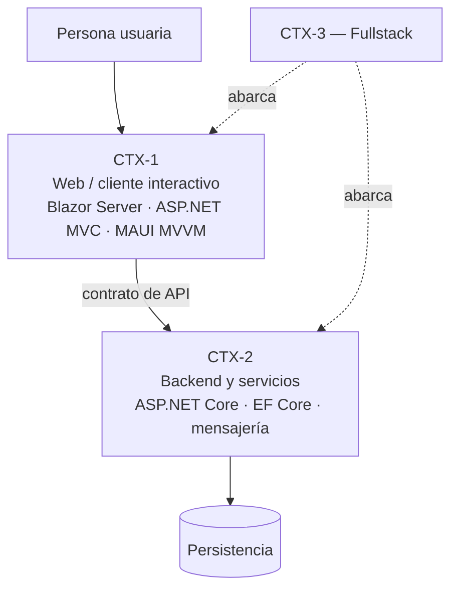

# Contextos del dominio

## Resumen ejecutivo

El escenario dice en qué situación estoy; el contexto dice sobre qué tipo de software. Son tres —web, backend y fullstack— y sirven para diferenciar el tratamiento de un mismo artefacto dentro de un mismo escenario. Un SRS de una aplicación web dedica capítulos a accesibilidad, comportamiento responsivo y estados de la interfaz; el mismo SRS para un servicio backend dedica ese espacio a contratos, idempotencia y garantías de entrega. Es el mismo tipo de documento, con centros de gravedad distintos.

---

## Los tres contextos

| ID | Contexto | Qué se construye | Superficie de contrato | Riesgo documental dominante |
|----|----------|------------------|------------------------|----------------------------|
| `CTX-1` | Web y cliente interactivo | Interfaz con la que interactúa una persona | Pantallas, flujos, estados, accesibilidad | Documentar pantallas y no flujos |
| `CTX-2` | Backend y servicios | Lógica, datos y contratos consumidos por otros programas | API, esquema de datos, eventos, SLAs | Documentar endpoints y no el dominio |
| `CTX-3` | Fullstack | Producto completo de punta a punta | Ambas, más la costura entre ellas | Documentar cada mitad y perder la traza que las une |

Las tecnologías nombradas son las que esta guía usa como referencia para los ejemplos: .NET y C#, Blazor con páginas *interactive server*, ASP.NET MVC y .NET MAUI con patrón MVVM. No son el objeto de estudio; son el vocabulario con el que se ilustran los conceptos.

---

## `CTX-1` — Web y cliente interactivo

### Definición

Software cuya superficie principal es una interfaz operada por una persona. Incluye aplicaciones web renderizadas en servidor (ASP.NET MVC), aplicaciones web interactivas con estado en servidor (Blazor con render mode *interactive server*) y clientes de escritorio o móviles construidos con MAUI y patrón MVVM. Lo que los une no es la tecnología sino el hecho de que el contrato relevante es con un humano.

### Qué cambia en la documentación

El artefacto central deja de ser la función y pasa a ser el **flujo**: la secuencia de pantallas, decisiones y estados que atraviesa alguien para lograr un objetivo. Un catálogo de pantallas sin flujos documenta piezas sueltas y no permite responder la pregunta que importa, que es qué pasa cuando el usuario abandona a la mitad, vuelve atrás o pierde la conexión.

Tres temas específicos que en backend no existen o son marginales:

**Estados de la interfaz.** Cada pantalla tiene al menos cuatro: vacío, cargando, con datos, con error. La documentación que solo describe el estado feliz deja el 60 % del trabajo de implementación sin especificar. Ese mínimo de cuatro es el piso exigible en cualquier documento de la guía. El [documento de UX](../95-Transversales/UX-UI-y-Flujo-de-Usuario.md) lo eleva a seis cuando la pieza que se especifica es la interfaz misma: desdobla el error en recuperable y no recuperable, y agrega el estado sin permiso. En Blazor *interactive server* suma otros dos, circuito desconectado y circuito reconectado con estado potencialmente obsoleto, que en esa tecnología no son variantes sino estados propios. En Blazor Server esto se agrava porque la reconexión del circuito SignalR es un estado propio que hay que definir: qué ve el usuario mientras el circuito se recupera y qué pasa con el trabajo a medio hacer.

**Accesibilidad y comportamiento responsivo.** Son requisitos no funcionales que se especifican con criterios verificables —niveles de conformidad WCAG, orden de foco, puntos de quiebre— y no con adjetivos.

**Gestión de estado y ciclo de vida del componente.** En MVVM sobre MAUI, la documentación de diseño describe ViewModels, comandos y bindings, no controles. En Blazor interactive server, describe qué vive en el circuito, qué se persiste y qué se pierde ante una desconexión.

### Ejemplo concreto

Una pantalla de alta de reserva en Blazor Server. La documentación útil no dice «formulario con campos fecha, sala y asistentes». Dice: el usuario elige fecha y sala; el componente consulta disponibilidad al perder el foco el selector de sala; mientras consulta, el botón Confirmar queda deshabilitado con indicador de carga; si la sala se ocupó entre la consulta y la confirmación, el servidor rechaza y la pantalla ofrece los tres horarios alternativos más cercanos sin perder los asistentes ya cargados; si el circuito se cae durante la confirmación, al reconectar se consulta el estado real de la reserva antes de mostrar nada. Esa descripción se implementa; la anterior, no.

### Preguntas guía

- ¿Están documentados los cuatro estados de cada pantalla relevante, o solo el camino feliz?
- ¿Qué pasa si el usuario abandona el flujo a la mitad y vuelve mañana?
- ¿Los requisitos de accesibilidad tienen criterio verificable o son una declaración de intención?

---

## `CTX-2` — Backend y servicios

### Definición

Software sin interfaz humana propia, consumido por otros programas: APIs REST o gRPC, servicios de mensajería, procesos batch, integraciones. El contrato es explícito, versionado y verificable por máquina.

### Qué cambia en la documentación

El centro de gravedad se desplaza al **contrato y al dominio**. Un backend bien documentado permite que alguien escriba un cliente sin hablar con el equipo, y que el equipo cambie la implementación sin romper a nadie. Eso exige precisión en lugares donde el frontend admite ambigüedad: qué significa exactamente cada código de error, qué garantías de entrega ofrece un evento, si una operación es idempotente y con qué clave, cuánto tiempo sobrevive un token.

La API Specification —OpenAPI para REST, ficheros `.proto` para gRPC— pasa a ser el documento con mayor densidad de uso diario, y conviene generarla desde el código o validarla contra él, porque una especificación que se desincroniza del servicio es peor que no tenerla.

El modelo de datos también gana peso: en backend, el esquema es donde el dominio se vuelve físico, y las decisiones sobre normalización, índices y transaccionalidad tienen consecuencias que la interfaz no puede corregir.

### Ejemplo concreto

El mismo caso de la reserva, del lado del servicio. La documentación debe fijar que `POST /reservas` es idempotente respecto de la cabecera `Idempotency-Key`, que un reintento con la misma clave devuelve la reserva ya creada con `200` en lugar de crear una segunda con `201`, que el conflicto de sala devuelve `409` con un cuerpo que enumera alternativas, y que el evento `ReservaConfirmada` se publica con garantía *at-least-once*, por lo cual el consumidor debe deduplicar por `reservaId`. Nada de eso se deduce mirando la firma del método.

### Preguntas guía

- ¿Un desarrollador externo podría integrarse leyendo solo la documentación, sin preguntar?
- ¿Qué garantías —de entrega, de orden, de idempotencia, de consistencia— están escritas, y cuáles se dan por sobreentendidas?
- ¿La especificación de API se genera o se valida contra el código, o se mantiene a mano?

---

## `CTX-3` — Fullstack

### Definición

El producto completo, con interfaz y servicios desarrollados por el mismo equipo o bajo la misma responsabilidad. Es el contexto habitual de las aplicaciones de línea de negocio y el que la combinación Blazor Server más ASP.NET Core ocupa con naturalidad, porque la frontera entre cliente y servidor se vuelve difusa.

### Qué cambia en la documentación

Aparece un problema que los otros dos contextos no tienen: la **traza vertical**. Un requisito funcional debe poder seguirse desde el enunciado en el SRS hasta la pantalla que lo expone, el endpoint que lo ejecuta, la tabla que lo persiste y el caso de prueba que lo verifica. Cuando esa cadena existe, el impacto de un cambio se calcula leyendo; cuando no, se calcula preguntando.

El riesgo típico no es la falta de documentos sino su desconexión: un SRS que habla de «solicitudes», una interfaz que las llama «pedidos» y una tabla `Orders`. Tres nombres para la misma cosa, tres documentos correctos por separado y un lector que no puede unirlos. Por eso el glosario y los identificadores estables importan más acá que en ningún otro contexto.

En Blazor Server la frontera se vuelve una decisión documentable en sí misma: qué lógica vive en el componente, qué vive en un servicio del lado servidor invocado directamente, y qué se expone además como API pública porque otro consumidor la necesita. Un ADR que responda «por qué esta operación tiene endpoint y aquella no» evita meses de discusión repetida.

### Ejemplo concreto

La traza completa de una funcionalidad, tal como debería poder leerse:

| Eslabón | Artefacto | Identificador |
|---------|-----------|---------------|
| Requisito | SRS | `RF-014 — Confirmar reserva` |
| Regla | Reglas de negocio (en el SRS) | `RN-007 — Una sala no admite reservas superpuestas` |
| Flujo | Documento de UX | `FLU-03 — Alta de reserva` |
| Interfaz | LLD de componente | `ReservaEditor.razor` |
| Contrato | API Specification | `POST /reservas` |
| Persistencia | Modelo de datos | `Reserva`, índice único `(SalaId, Intervalo)` |
| Verificación | Test Cases | `TC-041`, `TC-042` |

Cada fila referencia a la siguiente por identificador, no por ruta de archivo. Los archivos se mueven; los identificadores no.

### Preguntas guía

- ¿Puedo seguir un requisito desde su enunciado hasta la prueba que lo verifica, sin preguntarle a nadie?
- ¿El mismo concepto se llama igual en la interfaz, en la API y en la base de datos?
- ¿Está documentado dónde vive cada responsabilidad, o se resuelve por costumbre del equipo?

---

## Cruce entre contextos y familias documentales

Ninguna familia desaparece al cambiar de contexto; cambia su peso y el detalle que exige.

| Familia | `CTX-1` Web | `CTX-2` Backend | `CTX-3` Fullstack |
|---------|-------------|-----------------|-------------------|
| Visión | Igual peso: el producto es el mismo | Igual peso | Igual peso |
| Análisis | Flujos y casos de uso | Reglas de negocio y modelo de dominio | Ambos, con traza entre ellos |
| Arquitectura | Estructura de componentes, estado de sesión | Servicios, integraciones, datos | Frontera cliente/servidor como decisión explícita |
| Diseño | ViewModels, componentes, estados | Contratos, esquema, algoritmos | Contrato como costura documentada |
| Operativa | Despliegue del cliente, versionado de assets | Runbooks, observabilidad, recuperación | Ambos, con orden de despliegue definido |
| Desarrollo | Convenciones de componentes | Convenciones de servicios y datos | Convenciones únicas para todo el producto |
| Usuarios | Peso máximo | Peso mínimo: el usuario es otro programa | Peso alto |

---

## Cómo se usa este eje en el resto de la guía

Cada documento temático explica, dentro de su sección de aplicación por escenario, qué cambia según el contexto. Cuando la diferencia es irrelevante para un artefacto —el Change Log se escribe casi igual en los tres— se dice así, en una línea, en lugar de inventar distinciones.

Los escenarios están en [Escenarios](Escenarios.md); los roles, en [Actores](Actores.md); el cruce completo de contextos contra artefactos, en el [Mapa conceptual](../01-Mapa-Conceptual/Mapa-Conceptual.md).
