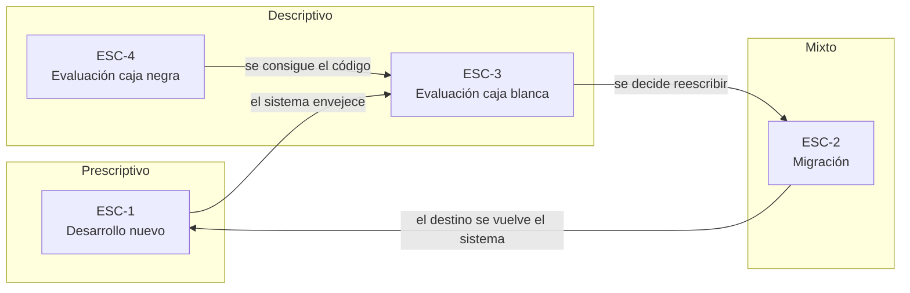
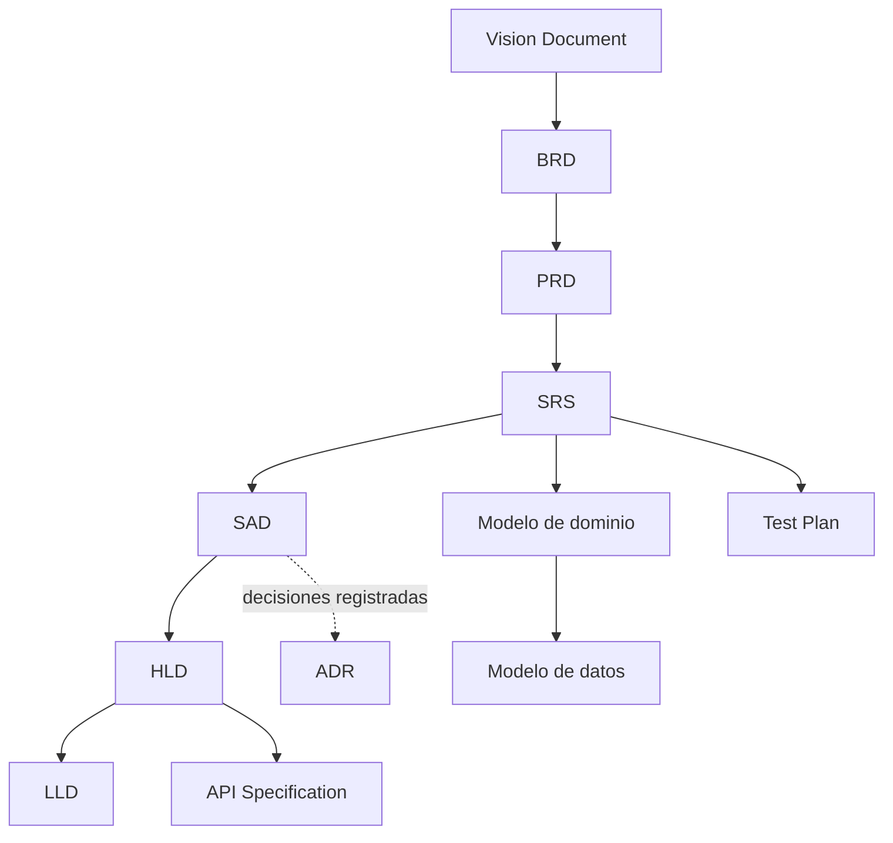
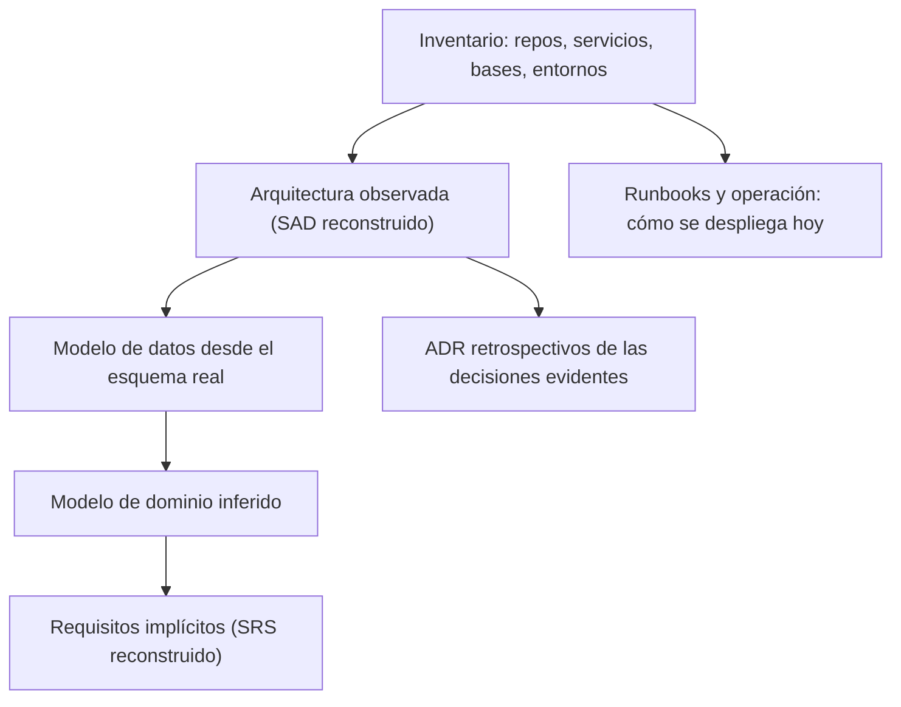

# Escenarios del dominio

## Resumen ejecutivo

Un escenario es la situación de partida en la que alguien se topa con documentación técnica: qué hay disponible, qué falta y qué se espera producir. Esta guía trabaja con cuatro, y cada documento temático explica qué aporta su artefacto en cada uno de ellos. Si un tema no se cruza con ningún escenario, sobra en la guía.

La distinción importa porque el mismo artefacto cambia de naturaleza según el escenario. Un Software Architecture Document en desarrollo nuevo es una decisión a tomar; en una evaluación con acceso al código es un hallazgo a reconstruir; en una evaluación externa es, como mucho, una hipótesis. Confundir los tres lleva al error más común del oficio: escribir como si se estuviera decidiendo algo que en realidad ya está decidido en el código.

---

## Los cuatro escenarios

| ID | Escenario | Punto de partida | Pregunta que domina | Naturaleza de la documentación |
|----|-----------|------------------|---------------------|-------------------------------|
| `ESC-1` | Desarrollo de software nuevo | No hay sistema; hay una intención de negocio | ¿Qué queremos construir y cómo? | Prescriptiva: decide antes de que exista el código |
| `ESC-2` | Migración a otro lenguaje o plataforma | Hay un sistema en producción que debe seguir funcionando en otra tecnología | ¿Qué hace hoy y qué debe seguir haciendo mañana? | Doble: descriptiva del origen, prescriptiva del destino |
| `ESC-3` | Evaluación de software existente con acceso al código | Hay sistema y hay repositorio | ¿Cómo está hecho realmente esto? | Descriptiva y reconstructiva: documenta lo que hay |
| `ESC-4` | Evaluación de un producto solo desde afuera | Hay un producto usable, sin código ni gente que lo explique | ¿Qué hace, cómo se comporta y qué se puede inferir? | Inferencial: hipótesis observables, marcadas como tales |



El diagrama no es un ciclo obligatorio, sino el recorrido habitual de un producto largo: se evalúa desde afuera, se accede al código, se decide migrar, y el resultado de la migración vuelve a ser un desarrollo con sus propias decisiones abiertas.

---

## `ESC-1` — Desarrollo de software nuevo

### Definición

Se construye un sistema que todavía no existe. No hay código que consultar, y por lo tanto la documentación no describe: **compromete**. Cada documento fija una decisión que el equipo se obliga a respetar, o registra por qué se descartó una alternativa.

### Qué lo caracteriza

El riesgo dominante es construir lo que nadie pidió. La documentación de esta etapa existe para reducir la distancia entre lo que el negocio quiere y lo que el equipo entiende, antes de que esa distancia se convierta en código que hay que tirar. Por eso el orden importa: visión antes que requisitos, requisitos antes que arquitectura, arquitectura antes que diseño detallado.

Lo específico es que todo lo escrito es reversible mientras no haya código, y caro de revertir después. Un ADR mal razonado en la semana dos cuesta una conversación; el mismo ADR descubierto en el mes ocho cuesta una reescritura.

### Secuencia típica



### Trampas frecuentes

Empezar por el SAD porque es lo que más se parece a trabajo técnico, y descubrir tres sprints después que el alcance del producto era otro. Escribir un SRS de doscientas páginas para un producto que todavía no validó su hipótesis de negocio. Producir documentos que nadie vuelve a abrir porque no se les asignó dueño ni momento de revisión.

### Preguntas guía

- ¿Qué decisión concreta queda cerrada cuando este documento se aprueba?
- ¿Quién tiene autoridad para cambiarla después, y dónde queda registrado ese cambio?
- ¿Este documento se está escribiendo porque alguien lo va a leer, o porque el proceso lo pide?

---

## `ESC-2` — Migración a otro lenguaje o plataforma

### Definición

Existe un sistema en producción que debe seguir prestando el mismo servicio sobre otra tecnología: de ASP.NET MVC a Blazor, de un monolito .NET Framework a .NET moderno sobre contenedores, de una aplicación de escritorio a MAUI. El destino cambia; el comportamiento observable, en principio, no.

### Qué lo caracteriza

Es el escenario con mayor riesgo documental, porque exige dos cuerpos de documentación a la vez. Hacia atrás hay que **reconstruir** qué hace el sistema actual, incluido el comportamiento que nadie especificó nunca y que sin embargo los usuarios dan por hecho. Hacia adelante hay que **decidir** la arquitectura destino. La documentación de origen es descriptiva; la de destino, prescriptiva; y entre ambas hace falta una tercera pieza que casi siempre falta: la tabla de equivalencias que dice qué componente viejo se convierte en qué componente nuevo, y qué se decidió no migrar.

La pregunta que separa una migración ordenada de una desordenada es sencilla: ¿cuál es el criterio de paridad? Sin una definición explícita de qué significa "hace lo mismo", la migración no tiene condición de terminación.

### Documentación característica

| Dirección | Artefactos | Para qué |
|-----------|-----------|----------|
| Origen | SRS reconstruido, modelo de dominio, modelo de datos, casos de uso relevados | Fijar la línea base de comportamiento |
| Destino | SAD, ADR, HLD, LLD, Deployment Guide | Decidir la arquitectura nueva |
| Puente | Tabla de equivalencias, Test Plan de paridad, plan de corte y rollback | Demostrar que el destino cubre el origen |

### Trampas frecuentes

Migrar la estructura de código en lugar del comportamiento, arrastrando al destino decisiones que solo tenían sentido en la plataforma vieja. Descubrir a mitad de camino que el modelo de datos legado tiene reglas de negocio embebidas en procedimientos almacenados que nadie documentó. Declarar la migración terminada sin un conjunto de pruebas que compare origen y destino sobre los mismos casos.

### Preguntas guía

- ¿Cuál es la definición operativa de "hace lo mismo", y quién la firma?
- ¿Qué comportamiento actual es requisito y qué es accidente de la implementación vieja?
- ¿Qué se decidió deliberadamente **no** migrar, y dónde quedó registrado?

---

## `ESC-3` — Evaluación de software existente con acceso al código

### Definición

Hay un sistema funcionando y se dispone del repositorio, de la base de datos y, con suerte, de alguien que lo mantiene. El objetivo es entenderlo: para auditarlo, para heredarlo, para valuarlo en una compra, para decidir si se mantiene o se reescribe.

### Qué lo caracteriza

La documentación acá es un **hallazgo**, no una decisión. Se reconstruye a partir de evidencia: código, esquema de base, configuración de despliegue, historial de commits, tickets. Toda afirmación debe poder rastrearse hasta un archivo y una línea, y lo que no se pudo verificar se marca como no verificado en lugar de completarse con lo que sería razonable.

La tensión propia del escenario es la distancia entre el sistema real y el sistema que la documentación existente dice que hay. Esa distancia es en sí misma un hallazgo: documentación desactualizada no es ausencia de información, es información engañosa, y suele ser más peligrosa que la falta de documentos.

### Orden de reconstrucción recomendado



Se empieza por lo que la evidencia sostiene con menos interpretación —qué componentes hay, qué tablas existen, cómo se despliega— y recién después se sube al nivel de intención, que es donde la inferencia se vuelve discutible.

### Trampas frecuentes

Documentar la estructura de carpetas y llamar a eso arquitectura. Confiar en los comentarios del código como fuente de verdad. Presentar como requisito lo que es un defecto que nadie corrigió. Escribir un ADR retrospectivo afirmando una motivación que el equipo original nunca tuvo.

### Preguntas guía

- ¿Qué evidencia sostiene cada afirmación, y dónde está?
- ¿Qué parte de esto es observación y qué parte es interpretación?
- ¿La documentación existente coincide con el sistema real? Donde no coincide, ¿qué prevalece?

---

## `ESC-4` — Evaluación de un producto solo desde afuera

### Definición

Se evalúa un producto al que solo se accede como usuario: navegando el sitio, usando la aplicación, leyendo su documentación pública, sus precios y sus notas de versión. No hay código, no hay base de datos, no hay entrevistas con el equipo. Es el escenario del análisis de competencia, de la evaluación previa a una compra y del relevamiento de un sistema cuyo proveedor ya no existe.

### Qué lo caracteriza

Todo lo que se produzca es **inferencia**, y la calidad del trabajo se mide por la honestidad con que se separa lo observado de lo supuesto. Se observa que la aplicación responde en menos de doscientos milisegundos y que las URLs siguen un patrón REST; se infiere que hay una API detrás; no se afirma qué framework la implementa salvo que el propio producto lo declare.

El material disponible es más rico de lo que parece: las notas de versión revelan el ritmo de entrega y las áreas donde el producto invierte; la estructura de navegación revela el modelo de dominio que el equipo tiene en la cabeza; los mensajes de error revelan validaciones y, a veces, la tecnología; el sitemap y los endpoints públicos revelan la superficie funcional.

### Qué se puede producir, y con qué confianza

| Artefacto | Confianza alcanzable | Base de la inferencia |
|-----------|---------------------|----------------------|
| Catálogo de funcionalidades | Alta | Uso directo del producto |
| Flujos de usuario | Alta | Navegación y captura de pantallas |
| Modelo de dominio | Media | Entidades visibles en la interfaz y en las URLs |
| Roadmap observado | Media | Notas de versión y changelog público |
| Arquitectura | Baja | Comportamiento, cabeceras, latencias; hipótesis explícita |
| Modelo de datos | Baja | Estructura de formularios y filtros; hipótesis explícita |

### Límites éticos y legales

El relevamiento externo se hace con el producto tal como se ofrece al público. Probar autenticación ajena, forzar límites de tasa, extraer datos masivamente o eludir controles de acceso no es relevamiento: es intrusión, y queda fuera de lo que esta guía trata. Cuando la evaluación necesite ir más allá de lo observable como usuario legítimo, corresponde pedir acceso y pasar a `ESC-3`.

### Trampas frecuentes

Presentar una hipótesis de arquitectura con el mismo tono con el que se describe una funcionalidad observada. Deducir capacidades a partir del material de marketing. Cerrar el relevamiento sin registrar la fecha y la versión del producto observado, con lo cual el trabajo deja de ser reproducible.

### Preguntas guía

- ¿Esto lo vi funcionar, o lo estoy suponiendo por cómo se comporta?
- ¿Qué versión del producto observé, en qué fecha, y con qué configuración de cuenta?
- Si el proveedor leyera este informe, ¿qué afirmación desmentiría primero?

---

## Cómo se usa este eje en el resto de la guía

Cada documento temático incluye una sección **Aplicación por escenario** con las cuatro entradas. Cuando un artefacto no aplica en alguno, se dice explícitamente y se explica por qué, en lugar de omitir la fila. Un Runbook, por ejemplo, no tiene sentido en `ESC-4`: no se opera un sistema al que solo se accede como usuario.

El cruce completo de escenarios contra artefactos vive en el [Mapa conceptual](../01-Mapa-Conceptual/Mapa-Conceptual.md); acá quedan definidos los escenarios en sí. Los entornos que modulan cada escenario están en [Contextos](Contextos.md), y los roles que intervienen, en [Actores](Actores.md).

---

## Anexo — Ficha de encuadre de escenario

Plantilla breve para abrir cualquier trabajo documental. Se completa antes de escribir el primer documento.

```markdown
## Encuadre

- **Escenario**: ESC-_ (¿construyo, migro, audito con código, o relevo desde afuera?)
- **Contexto**: CTX-_ (¿web, backend o fullstack?)
- **Rol propio**: ACT-_ (¿qué decido yo y qué no?)
- **Evidencia disponible**: (código / base / entrevistas / solo el producto)
- **Qué se espera entregar**: (artefactos concretos, no "documentación")
- **Criterio de terminación**: (cómo sabremos que está listo)
- **Fecha y versión observada**: (obligatorio en ESC-3 y ESC-4)
```

Las preguntas del encuadre parecen burocráticas hasta la primera vez que un trabajo se entrega y el destinatario esperaba otra cosa. Contestarlas lleva diez minutos y define el resto del esfuerzo.
