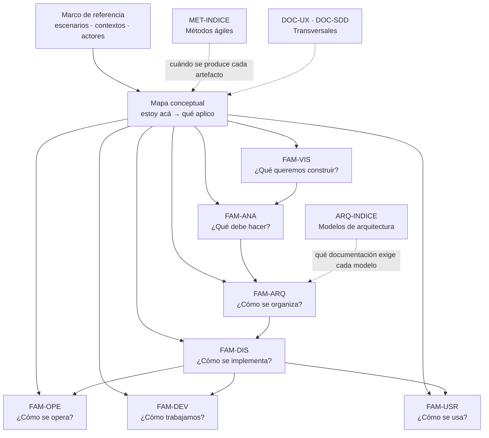

# Mapa conceptual

## Resumen ejecutivo

Tres tablas de entrada para el lector que ya sabe dónde está y necesita saber qué producir. La primera se recorre por escenario: estoy migrando un sistema, qué documento abro. La segunda por contexto: trabajo en backend, qué me interviene. La tercera por artefacto: me pidieron un HLD, qué es y cuándo aplica. Es la pieza que convierte la guía en algo consultable además de legible.

Ninguna tabla desarrolla contenido. Cada celda remite al documento donde el tema vive completo, porque un mapa que explica deja de ser mapa.

---

## Estructura de la guía

Las flechas llenas marcan dependencia de contenido: un SRS sin PRD queda sin justificación, un LLD sin HLD queda sin encuadre. Las punteadas marcan modulación: los métodos y los modelos no agregan artefactos nuevos, cambian cuáles se exigen y con qué profundidad.

---

## Tabla de entrada 1 — Por escenario

Qué documentación aplica en cada situación de partida. La columna de prioridad indica el orden de producción, no el de importancia.

### `ESC-1` — Desarrollo de software nuevo

| Prioridad | Artefacto | Por qué acá | Dónde |
|-----------|-----------|-------------|-------|
| 1 | Vision Document | Sin acuerdo sobre qué se construye, todo lo demás es especulación | [DOC-VISION](../10-Vision/Vision-Document.md) |
| 2 | BRD / PRD | Justificación de negocio y funcionalidades comprometidas | [DOC-BRD](../10-Vision/BRD.md) · [DOC-PRD](../10-Vision/PRD.md) |
| 3 | SRS con casos de uso y reglas | Convierte la intención en algo verificable | [DOC-SRS](../20-Analisis/SRS.md) |
| 3 | Modelo de dominio | Fija el vocabulario antes de que se fije mal en el código | [DOC-DOMINIO](../20-Analisis/Modelo-de-Dominio.md) |
| 4 | SAD y ADR | Estructura y decisiones, con su justificación | [DOC-SAD](../30-Arquitectura/SAD.md) · [DOC-ADR](../30-Arquitectura/ADR.md) |
| 5 | HLD, LLD, modelo de datos, API | Diseño en dos niveles y contratos | [FAM-DIS](../40-Diseno/README.md) |
| 5 | Test Plan | Se escribe con los requisitos, no después del código | [DOC-TESTPLAN](../60-Desarrollo/Test-Plan.md) |
| 6 | Developer Guide | Puesta en marcha y convenciones desde el primer día | [DOC-DEVGUIDE](../60-Desarrollo/Developer-Guide.md) |
| 7 | Operativa y usuarios | Necesarios antes del primer despliegue real, no después | [FAM-OPE](../50-Operativa/README.md) · [FAM-USR](../70-Usuarios/README.md) |

El error de secuencia más caro es saltar del paso 2 al 4. Produce arquitecturas correctas para un problema que nadie terminó de enunciar.

### `ESC-2` — Migración a otro lenguaje o plataforma

| Dirección | Artefacto | Función en la migración | Dónde |
|-----------|-----------|------------------------|-------|
| Origen | SRS reconstruido | Línea base de comportamiento exigible | [DOC-SRS](../20-Analisis/SRS.md) |
| Origen | Modelo de dominio y de datos | Lo que no se puede perder al cambiar de plataforma | [DOC-DOMINIO](../20-Analisis/Modelo-de-Dominio.md) · [DOC-DATOS](../40-Diseno/Modelo-de-Datos.md) |
| Origen | Reglas de negocio relevadas | Suelen vivir en código y en procedimientos almacenados, sin documentar | [DOC-SRS](../20-Analisis/SRS.md) |
| Puente | **Test Plan de paridad** | Define operativamente qué significa «hace lo mismo» | [DOC-TESTPLAN](../60-Desarrollo/Test-Plan.md) |
| Puente | Tabla de equivalencias | Qué componente viejo se convierte en cuál, y qué no se migra | [DOC-SAD](../30-Arquitectura/SAD.md) |
| Destino | SAD, ADR, HLD | La arquitectura nueva y por qué es distinta | [FAM-ARQ](../30-Arquitectura/README.md) |
| Destino | Deployment Guide con corte y vuelta atrás | La migración se despliega, y puede fallar | [DOC-DEPLOY](../50-Operativa/Deployment-Guide.md) |
| Destino | Guía de transición para usuarios | Lo que antes se hacía así, ahora se hace asá | [DOC-MANUAL](../70-Usuarios/User-Manual.md) |

La documentación de origen es descriptiva y la de destino prescriptiva; confundir el registro es el fallo característico del escenario. El criterio de paridad se desarrolla completo en el Test Plan; el BRD y la tabla de equivalencias lo referencian.

### `ESC-3` — Evaluación con acceso al código

| Orden | Artefacto reconstruido | Evidencia que lo sostiene | Dónde |
|-------|----------------------|--------------------------|-------|
| 1 | Inventario de componentes y entornos | Repositorios, pipelines, configuración de despliegue | [DOC-SAD](../30-Arquitectura/SAD.md) |
| 2 | SAD observado | Estructura de la solución, dependencias entre proyectos, comunicación real | [DOC-SAD](../30-Arquitectura/SAD.md) |
| 3 | Modelo de datos | Esquema real, migraciones, índices y restricciones | [DOC-DATOS](../40-Diseno/Modelo-de-Datos.md) |
| 4 | Modelo de dominio inferido | Nombres del código contrastados con el lenguaje del negocio | [DOC-DOMINIO](../20-Analisis/Modelo-de-Dominio.md) |
| 5 | Requisitos y reglas implícitas | Validaciones, condicionales y pruebas existentes | [DOC-SRS](../20-Analisis/SRS.md) |
| 5 | ADR retrospectivos | Decisiones evidentes; la motivación no verificada se marca como tal | [DOC-ADR](../30-Arquitectura/ADR.md) |
| 6 | Procedimiento de despliegue real | Pipelines y scripts, no lo que la wiki dice | [DOC-DEPLOY](../50-Operativa/Deployment-Guide.md) |
| 6 | Convenciones reales del repositorio | Código e historial, no el documento de estándares | [DOC-DEVGUIDE](../60-Desarrollo/Developer-Guide.md) |
| 7 | Superficie de API y de integraciones | Controladores, contratos publicados, clientes externos | [DOC-API](../40-Diseno/API-Specification.md) · [DOC-INTEGRACION](../40-Diseno/Integration-Guide.md) |
| 7 | Amenazas y controles existentes | Autenticación, autorización, secretos, auditoría | [DOC-SECARQ](../30-Arquitectura/Arquitectura-de-Seguridad.md) · [DOC-THREAT](../30-Arquitectura/Threat-Model.md) |

Se avanza de lo que la evidencia sostiene sin interpretación hacia lo que exige inferencia. La distancia entre la documentación existente y el sistema real es en sí misma un hallazgo, y se reporta.

### `ESC-4` — Evaluación solo desde afuera

| Artefacto producible | Confianza | Fuente observable | Dónde |
|---------------------|-----------|-------------------|-------|
| Catálogo de funcionalidades | Alta | Uso del producto, manual público, mapa del sitio | [DOC-MANUAL](../70-Usuarios/User-Manual.md) |
| Flujos de usuario | Alta | Navegación y captura del recorrido | [DOC-UX](../95-Transversales/UX-UI-y-Flujo-de-Usuario.md) |
| Roadmap observado | Media | Notas de versión y comunicaciones públicas | [DOC-RELEASE](../60-Desarrollo/Release-Notes.md) · [DOC-ROADMAP](../10-Vision/Roadmap.md) |
| Modelo de dominio | Media | Entidades visibles en interfaz, URLs, glosario del manual | [DOC-DOMINIO](../20-Analisis/Modelo-de-Dominio.md) |
| Reglas de negocio | Media | Mensajes de error y validaciones observadas | [DOC-SRS](../20-Analisis/SRS.md) |
| Modelo de negocio | Media | Precios, planes, límites por plan | [MET-CANVAS](../80-Metodos-Agiles/Canvas.md) |
| Superficie de integración | Media | Documentación pública de API, si existe | [DOC-API](../40-Diseno/API-Specification.md) |
| Arquitectura | Baja | Cabeceras, latencias, comportamiento; hipótesis explícita | [DOC-SAD](../30-Arquitectura/SAD.md) |

**No aplican**: Runbook, Operations Guide, Installation Guide, Deployment Guide, Administrator Guide, LLD, Change Log interno, Postmortem y Developer Guide. No se opera ni se implementa un sistema al que solo se accede como usuario. Que no apliquen es información: si alguien los pide en este escenario, está pidiendo ficción.

---

## Tabla de entrada 2 — Por contexto

Qué documentación interviene y con qué peso según el tipo de software. **Alto** significa que el artefacto es central y detallado; **medio**, que existe pero acotado; **bajo**, que se resuelve en pocas líneas o se hereda.

| Artefacto | `CTX-1` Web | `CTX-2` Backend | `CTX-3` Fullstack | Qué cambia entre contextos |
|-----------|:-----------:|:---------------:|:-----------------:|---------------------------|
| Vision Document | Alto | Alto | Alto | Nada: el producto es el mismo |
| BRD / PRD | Alto | Medio | Alto | En backend el usuario es otro equipo o sistema |
| SRS | Alto | Alto | Alto | En web pesan flujos y estados; en backend, contratos y garantías |
| Casos de uso | Alto | Medio | Alto | En backend se vuelven escenarios de integración |
| Reglas de negocio | Medio | Alto | Alto | Viven del lado del servidor; la interfaz solo las expone |
| Modelo de dominio | Medio | Alto | Alto | En web puede heredarse del backend |
| SAD | Medio | Alto | Alto | En fullstack incorpora la frontera cliente/servidor como decisión |
| HLD | Medio | Alto | Alto | En web describe composición de componentes y estado |
| ADR | Alto | Alto | Alto | Cambia el objeto: render mode y estado en web; consistencia y mensajería en backend |
| LLD | Alto | Alto | Alto | ViewModels y componentes contra servicios y algoritmos |
| Modelo de datos | Bajo | Alto | Alto | En web es consumo, no propiedad |
| API Specification | Medio | Alto | Alto | En web es contrato consumido; en backend, producido |
| Integration Guide | Bajo | Alto | Medio | Las integraciones viven del lado servidor |
| Arquitectura de seguridad | Alto | Alto | Alto | En web, sesión y XSS/CSRF; en backend, tokens y autorización |
| Threat Model | Medio | Alto | Alto | La superficie expuesta difiere, el método es el mismo |
| Test Plan | Alto | Alto | Alto | En web suma accesibilidad y compatibilidad; en backend, contrato y carga |
| Test Cases | Alto | Alto | Alto | Interacción contra petición y respuesta |
| Installation / Deployment | Medio | Alto | Alto | En fullstack importa el orden de despliegue |
| Operations Guide | Bajo | Alto | Alto | La operación es del servidor |
| Administrator Guide | Alto | Bajo | Alto | Configurar usuarios y permisos tiene interfaz |
| Runbook | Bajo | Alto | Alto | Los incidentes se resuelven del lado servidor |
| Postmortem | Medio | Alto | Alto | El impacto se percibe en la interfaz, la causa suele estar detrás |
| Developer Guide | Alto | Alto | Alto | Convenciones distintas, documento único en fullstack |
| Release Notes | Alto | Medio | Alto | En backend, el cambio de contrato es la noticia |
| Change Log | Alto | Alto | Alto | Sin diferencia relevante |
| User Manual | Alto | Bajo | Alto | En backend muta en documentación para integradores |
| Roadmap | Alto | Medio | Alto | En backend se comunica como plan de versiones de contrato |
| RFC | Medio | Alto | Alto | Los cambios de contrato exigen consulta previa |

La columna que más sorprende es la de `CTX-2` en documentación de usuario: no desaparece, cambia de destinatario. El manual del backend es la especificación de API más su guía de integración, y se juzga con los mismos criterios de calidad que un manual: ¿alguien puede lograr su objetivo leyendo esto sin preguntar?

---

## Tabla de entrada 3 — Por artefacto

Definición breve y dos preguntas: cuándo aplica y qué describe. Para el desarrollo completo, el enlace.

### Familia visión — ¿Qué queremos construir?

| Artefacto | Definición breve | ¿Cuándo aplica? | ¿Qué describe? |
|-----------|-----------------|-----------------|----------------|
| [Vision Document](../10-Vision/Vision-Document.md) | Qué es el producto, qué problema resuelve y para quién | Al inicio, y cada vez que el rumbo se discute | La intención, el alcance y lo que queda afuera |
| [BRD](../10-Vision/BRD.md) | Necesidades de negocio que justifican la inversión | Cuando hay que sostener por qué se financia | El problema del negocio, no la solución |
| [PRD](../10-Vision/PRD.md) | Funcionalidades comprometidas desde la perspectiva del usuario | Antes de especificar en detalle | Qué hará el producto y con qué criterio se acepta |
| [Roadmap](../10-Vision/Roadmap.md) | Evolución prevista en horizontes | Al comunicar plan a terceros | Orden e intención, no fechas exactas |

### Familia análisis — ¿Qué debe hacer el sistema?

| Artefacto | Definición breve | ¿Cuándo aplica? | ¿Qué describe? |
|-----------|-----------------|-----------------|----------------|
| [SRS](../20-Analisis/SRS.md) | Requisitos funcionales y no funcionales detallados y verificables | Cuando el detalle debe ser exigible y probable | Qué debe hacer el sistema, sin decir cómo |
| Casos de uso (en el SRS) | Interacción actor-sistema con flujo principal y alternativos | Cuando el comportamiento tiene ramas que importan | El recorrido completo, incluidos los desvíos |
| Reglas de negocio (en el SRS) | Restricciones del dominio independientes de la interfaz | Siempre que exista una política que el sistema deba respetar | Qué está permitido, prohibido o condicionado |
| [Modelo de dominio](../20-Analisis/Modelo-de-Dominio.md) | Entidades y relaciones en el lenguaje del negocio | Antes de diseñar la persistencia | Los conceptos del negocio, no las tablas |

### Familia arquitectura — ¿Cómo estará organizado?

| Artefacto | Definición breve | ¿Cuándo aplica? | ¿Qué describe? |
|-----------|-----------------|-----------------|----------------|
| [SAD](../30-Arquitectura/SAD.md) | Arquitectura completa: componentes, relaciones y principios | Cuando el sistema supera lo que cabe en una cabeza | La estructura y sus razones, en varias vistas |
| [HLD](../30-Arquitectura/HLD.md) | Módulos principales y su interacción | Al bajar del SAD sin llegar a la implementación | Cómo colaboran las partes para cumplir un flujo |
| [ADR](../30-Arquitectura/ADR.md) | Una decisión, sus alternativas y su justificación | Cuando la decisión es costosa de revertir | Por qué se eligió esto y qué se sacrificó |
| [Arquitectura de seguridad](../30-Arquitectura/Arquitectura-de-Seguridad.md) | Autenticación, autorización, cifrado y auditoría | Siempre que existan datos o acciones protegidas | Los controles y las zonas de confianza |
| [Threat Model](../30-Arquitectura/Threat-Model.md) | Amenazas, riesgos y mitigaciones sobre un flujo | Al diseñar y ante cada cambio de superficie expuesta | Qué puede salir mal, quién lo aprovecha y cómo se evita |
| [RFC](../30-Arquitectura/RFC.md) | Propuesta abierta a comentarios antes de implementar | Cuando el cambio afecta a varios equipos | Qué se propone y qué se pide opinar |

### Familia diseño — ¿Cómo se implementa cada componente?

| Artefacto | Definición breve | ¿Cuándo aplica? | ¿Qué describe? |
|-----------|-----------------|-----------------|----------------|
| [LLD](../40-Diseno/LLD.md) | Diseño detallado: clases, interfaces, estados y algoritmos | Cuando la implementación no es evidente desde el HLD | Cómo se construye una pieza concreta |
| [Modelo de datos](../40-Diseno/Modelo-de-Datos.md) | Estructura física y lógica de los datos | Antes de la primera migración, y en cada cambio de esquema | Entidades, claves, índices y restricciones |
| [API Specification](../40-Diseno/API-Specification.md) | Contrato de la interfaz consumida por programas | En cuanto otro programa consume el sistema | Operaciones, esquemas, errores y garantías |
| [Integration Guide](../40-Diseno/Integration-Guide.md) | Cómo integrar sistemas externos con la plataforma | Cuando hay terceros de un lado u otro | Autenticación, resiliencia, eventos y puesta en marcha |

### Familia operativa — ¿Cómo se instala, mantiene y opera?

| Artefacto | Definición breve | ¿Cuándo aplica? | ¿Qué describe? |
|-----------|-----------------|-----------------|----------------|
| [Installation Guide](../50-Operativa/Installation-Guide.md) | Instalación desde cero en un entorno | Al montar un entorno nuevo | Los prerrequisitos y el camino hasta el sistema funcionando |
| [Deployment Guide](../50-Operativa/Deployment-Guide.md) | Despliegue de una versión en entornos existentes | En cada entrega | Estrategia, orden, migraciones y vuelta atrás |
| [Operations Guide](../50-Operativa/Operations-Guide.md) | Operación diaria, monitoreo y recuperación | Desde el primer día en producción | Qué se vigila, qué se hace periódicamente, cómo se recupera |
| [Administrator Guide](../50-Operativa/Administrator-Guide.md) | Configuración, usuarios y permisos | Cuando alguien administra el sistema sin programarlo | Las tareas de administración desde la interfaz |
| [Runbook](../50-Operativa/Runbook.md) | Procedimiento para un incidente o tarea repetitiva | Ante un incidente conocido o recurrente | Síntoma, diagnóstico, mitigación y escalamiento |
| [Postmortem](../50-Operativa/Postmortem.md) | Análisis de un incidente ocurrido | Después de cada incidente significativo | Línea de tiempo, causas y acciones correctivas |

### Familia desarrollo — ¿Cómo trabajamos sobre el proyecto?

| Artefacto | Definición breve | ¿Cuándo aplica? | ¿Qué describe? |
|-----------|-----------------|-----------------|----------------|
| [Developer Guide](../60-Desarrollo/Developer-Guide.md) | Estructura, convenciones, flujo de trabajo y CI/CD | Desde la primera incorporación al equipo | Cómo se trabaja acá, no cómo funciona el sistema |
| [Test Plan](../60-Desarrollo/Test-Plan.md) | Estrategia de pruebas y criterios de aceptación | Junto con los requisitos, no después del código | Qué se prueba, cómo, dónde y con qué criterio |
| [Test Cases](../60-Desarrollo/Test-Cases.md) | Casos concretos con pasos y resultado esperado | Al derivar la estrategia en verificación real | Qué se ejecuta y qué debe pasar |
| [Release Notes](../60-Desarrollo/Release-Notes.md) | Qué cambió en una versión, para quien la usa | En cada entrega visible | El cambio en términos de valor y de impacto |
| [Change Log](../60-Desarrollo/Change-Log.md) | Historial cronológico de cambios, para quien desarrolla | De forma continua | Qué se agregó, cambió, corrigió o eliminó |

### Familia usuarios — ¿Cómo se utiliza el sistema?

| Artefacto | Definición breve | ¿Cuándo aplica? | ¿Qué describe? |
|-----------|-----------------|-----------------|----------------|
| [User Manual](../70-Usuarios/User-Manual.md) | Documentación orientada a quien usa el sistema | Antes de la primera puesta en producción real | Cómo lograr cada objetivo con el producto |
| Tutoriales (en el manual) | Recorrido guiado con resultado garantizado | Para quien recién empieza | Un camino completo, sin decisiones abiertas |
| FAQ (en el manual) | Respuestas ordenadas por la pregunta del usuario | Cuando el soporte repite respuestas | Lo que la gente pregunta, en sus palabras |
| Guías rápidas (en el manual) | Referencia breve para tareas conocidas | Para quien ya sabe y necesita recordar | Los pasos, sin explicación |

### Transversales

| Artefacto | Definición breve | ¿Cuándo aplica? | ¿Qué describe? |
|-----------|-----------------|-----------------|----------------|
| [UX, UI y flujo de usuario](../95-Transversales/UX-UI-y-Flujo-de-Usuario.md) | Herramientas documentales de experiencia e interacción | En todo producto con interfaz humana | Cómo se vive el sistema y cómo se especifica esa vivencia |
| [Spec-Driven Development](../95-Transversales/Spec-Driven-Development.md) | La especificación como fuente de verdad de la que deriva el código | Al generar código con asistencia de IA | Qué debe cumplir una especificación para ser ejecutable |
| [Métodos ágiles](../80-Metodos-Agiles/README.md) | Cómo el método de trabajo cambia la documentación exigida | Al definir o corregir la forma de trabajo | Qué se produce, cuándo y con qué profundidad |
| [Modelos de arquitectura](../90-Modelos-de-Arquitectura/README.md) | Estilos estructurales y la documentación que cada uno exige | Al elegir o evaluar una arquitectura | Qué artefactos se vuelven obligatorios con cada modelo |

---

## Cruce escenario × familia

Resumen de una mirada. **●** indica producción intensa; **◐**, participación acotada; **○**, marginal o no aplicable.

| Familia | `ESC-1` Nuevo | `ESC-2` Migración | `ESC-3` Con código | `ESC-4` Desde afuera |
|---------|:---:|:---:|:---:|:---:|
| Visión | ● | ◐ | ◐ | ◐ |
| Análisis | ● | ● | ● | ◐ |
| Arquitectura | ● | ● | ● | ○ |
| Diseño | ● | ● | ◐ | ○ |
| Operativa | ◐ | ● | ◐ | ○ |
| Desarrollo | ● | ◐ | ◐ | ○ |
| Usuarios | ◐ | ● | ○ | ◐ |

La fila de operativa en `ESC-2` sorprende a quien no migró nunca: el corte, la coexistencia de dos sistemas y la vuelta atrás son la parte donde las migraciones fallan, y es la que menos se documenta.

---

## Cruce actor × familia

Quién produce y quién aprueba. La matriz RACI completa está en [Actores](../00-Marco-de-Referencia/Actores.md); acá queda el resumen de propiedad.

| Familia | Produce | Aprueba |
|---------|---------|---------|
| Visión | `ACT-01` Product Owner | `ACT-01` |
| Análisis | `ACT-02` Analista | `ACT-01` |
| Arquitectura | `ACT-03` Arquitecto | `ACT-03` |
| Diseño | `ACT-04` Desarrollador | `ACT-03` |
| Operativa | `ACT-06` DevOps/SRE | `ACT-06` |
| Desarrollo | `ACT-04` Desarrollador | `ACT-03` |
| Usuarios | `ACT-09` Technical Writer | `ACT-01` |
| Seguridad | `ACT-07` Seguridad | `ACT-01` acepta el riesgo residual |
| Pruebas | `ACT-05` QA | `ACT-01` |

---

## Cómo entrar a la guía

Tres recorridos según para qué se abre.

**Para estudiar.** Marco de referencia completo, este mapa, y después las familias en orden de la uno a la siete. Los transversales al final, cuando el vocabulario ya está fijado.

**Para resolver algo concreto.** Tabla de entrada 1 por escenario, se identifica el artefacto, se abre ese documento y se usa su plantilla del anexo. El resto de la guía no hace falta.

**Para evaluar documentación ajena.** Tabla de entrada 3 por artefacto, sección de criterios de calidad de cada documento, que es donde vive la distinción entre una versión buena y una pobre.

La ruta detallada, con tiempos estimados, está en el [README](../README.md).
