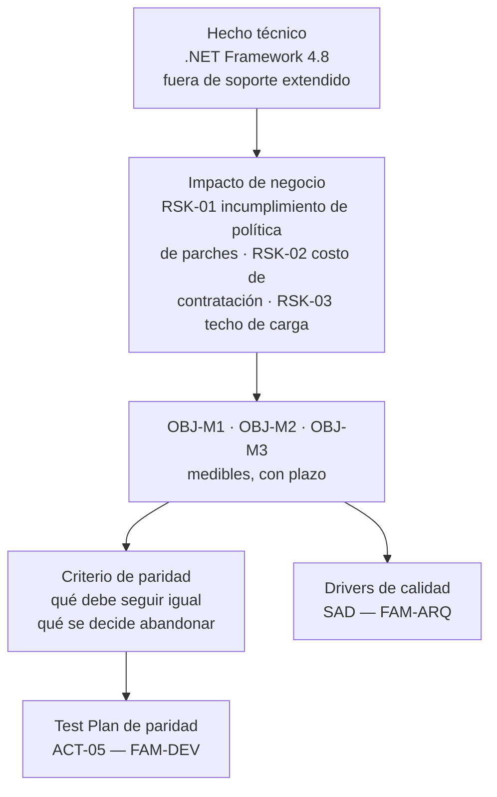
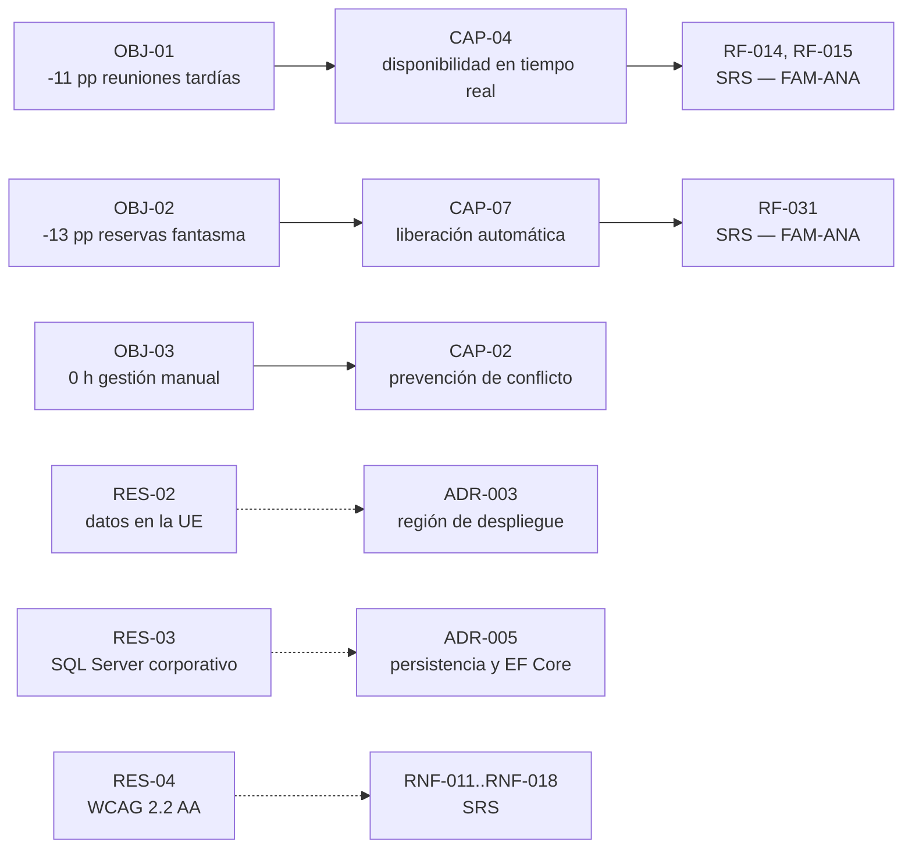

# Business Requirements Document — `DOC-BRD`

## Resumen ejecutivo

El BRD es el documento donde una intención de producto se convierte en un compromiso de negocio verificable: qué resultado se persigue, cómo se medirá, cuánto se está dispuesto a invertir, qué restricciones no se pueden violar y quién se ve afectado. Es el artefacto que autoriza el gasto, y por eso su audiencia primaria no es técnica: lo leen dirección, finanzas, las áreas usuarias y, cuando hay cumplimiento normativo de por medio, legales.

Para el equipo de desarrollo su valor es indirecto pero considerable. El BRD es la única fuente legítima de las restricciones que después aparecen como atributos de calidad en la arquitectura —«debe operar sobre el SQL Server corporativo», «los datos de reserva no salen del país», «la caída máxima aceptable es de cuatro horas»—. Cuando esas restricciones no están escritas acá, aparecen en el mes cinco como sorpresas que invalidan decisiones estructurales.

Lo firma `ACT-01` junto con quien pone el presupuesto. `ACT-03` y `ACT-07` son consultados: el primero para que ninguna restricción declarada sea estructuralmente imposible, el segundo para que las obligaciones regulatorias entren al documento cuando todavía son baratas.

---

## Definición

### Qué es

La especificación de lo que el negocio necesita obtener de una inversión en software, expresada como objetivos medibles con su justificación, su alcance y sus límites. En la terminología de `ISO/IEC/IEEE 29148:2018` su pariente normativo es el **StRS** (*Stakeholder Requirements Specification*): el nivel donde se capturan las necesidades de los involucrados antes de que existan requisitos de sistema. El vocabulario de análisis que estructura el documento —*business need*, *solution scope*, *stakeholder analysis*, *transition requirements*— proviene del **BABOK v3** del IIBA.

El BRD contesta una pregunta que ni la visión ni el PRD contestan: **¿por qué vale la pena pagar por esto, y contra qué se va a juzgar el resultado?** Su unidad de contenido es el objetivo de negocio con identificador estable, `OBJ-nn`, con línea base, meta, plazo y método de medición.

### Qué problema resuelve

Resuelve el problema del proyecto que termina a tiempo, en presupuesto, con todo lo especificado construido, y que nadie considera exitoso. Ocurre cuando el criterio de éxito nunca se escribió en términos de negocio, y al final del proyecto cada área lo evalúa contra el criterio que tenía en la cabeza.

Resuelve también un problema de arquitectura, aunque no lo parezca. Las restricciones que el BRD registra —regulatorias, de infraestructura existente, de continuidad operativa, de presupuesto recurrente— son los *drivers* que hacen que una arquitectura sea correcta o incorrecta. Una decisión estructural tomada sin conocer que existe una obligación de retención de datos por diez años no es una decisión discutible: es una decisión mal informada.

### Qué NO es

No es una lista de funcionalidades. La frase «el sistema debe permitir cancelar una reserva» no es un requisito de negocio; es un requisito de producto y vive en el [PRD](PRD.md). El requisito de negocio detrás es «las salas liberadas deben volver al pool disponible antes de que se pierda la franja horaria», que es lo que el negocio necesita y que admite varias soluciones, incluida la liberación automática que nadie había pedido.

No es un documento de requisitos de sistema. `ISO/IEC/IEEE 29148:2018` es explícita en la distinción entre StRS, SyRS y SRS; el BRD vive en el primer nivel y todo lo que baje al comportamiento del sistema pertenece a [`FAM-ANA`](../20-Analisis/).

No es un caso de negocio completo. El *business case* incluye análisis financiero detallado, escenarios y opciones descartadas; el BRD toma de él la conclusión —esta inversión se aprueba con este presupuesto contra estos resultados— y agrega el alcance y las restricciones. En organizaciones con oficina de proyectos suelen convivir; en el resto, el BRD absorbe la parte del caso de negocio que el equipo necesita.

No es un contrato de proveedor, aunque se le parezca cuando hay tercerización. La diferencia práctica: un contrato busca protección ante incumplimiento, un BRD busca alineación sobre el resultado. Los documentos escritos con mentalidad contractual tienden a especificar de más y a medir de menos.

### Con qué se lo confunde

Con el PRD, casi siempre, y con la visión cuando la organización es pequeña. La separación por unidad de contenido es la que resiste el uso diario:

| Contenido | Vision | BRD | PRD |
|---|---|---|---|
| «Reservar una sala debe ser tan rápido como mirar si está vacía» | Sí | No | No |
| «`OBJ-02` — reducir 40 % las reuniones que empiezan tarde en 12 meses» | No | Sí | Referenciado |
| «`RES-03` — los datos de ocupación no pueden salir de la UE» | No | Sí | Referenciado |
| «`CAP-04` — consulta de disponibilidad en tiempo real, p95 < 1 s» | No | No | Sí |
| «`RF-014` — al confirmar, el sistema valida solapamiento y devuelve alternativas» | No | No | No, es del SRS |

Una segunda confusión, menos discutida: **objetivo de negocio versus indicador**. «Aumentar la ocupación de salas» no es un objetivo, es una dirección. Un objetivo tiene línea base, meta, plazo y fuente de medición, y sin esas cuatro cosas no se puede declarar cumplido ni incumplido. La mayoría de los BRD pobres lo son por esta razón y no por falta de contenido.

---

## Aplicación por escenario

| Escenario | ¿Aplica? | Qué contiene | Quién lo produce | Riesgo característico |
|-----------|----------|--------------|------------------|----------------------|
| `ESC-1` Desarrollo nuevo | Sí, es el documento que autoriza | Objetivos, alcance, restricciones, involucrados | `ACT-01` con dirección y `ACT-07` | Objetivos sin línea base, imposibles de evaluar |
| `ESC-2` Migración | Sí, y es el documento crítico | Justificación del cambio de plataforma y criterio de paridad | `ACT-01` con `ACT-03` y `ACT-06` | Justificar la migración con argumentos técnicos y no de negocio |
| `ESC-3` Evaluación con código | Parcialmente, reconstruido | Restricciones evidenciadas en el sistema | `ACT-02` con `ACT-10` | Inferir objetivos de negocio que el código no puede sostener |
| `ESC-4` Evaluación externa | Muy limitadamente | Modelo de negocio observable | `ACT-02` | Confundir estructura de precios con objetivos internos |

### `ESC-1` — Desarrollo nuevo

El BRD se escribe después de la visión y antes del PRD, y su producción es el momento donde el proyecto se vuelve real o se detiene. La sección que decide eso no es la de objetivos sino la de **restricciones**: presupuesto recurrente, plataforma obligatoria, cumplimiento, dependencias de otras áreas, ventana de implantación.

Una práctica de alto rendimiento y bajo costo es hacer que `ACT-03` lea el BRD antes de aprobarlo, buscando específicamente restricciones incompatibles entre sí. En el ejemplo de reservas, «los datos no salen del país», «se usa el SQL Server corporativo on-premise» y «disponibilidad 99,95 % con recuperación en menos de una hora» son tres restricciones que individualmente son razonables y en conjunto obligan a una infraestructura redundante cuyo costo probablemente exceda el presupuesto declarado. Detectarlo en el BRD cuesta una reunión; detectarlo en producción cuesta el proyecto.

### `ESC-2` — Migración

Es el escenario donde el BRD hace la mayor diferencia, porque las migraciones son el tipo de proyecto que con más facilidad se justifica solo. «El framework está fuera de soporte» es un hecho, no un objetivo de negocio; el objetivo de negocio es lo que ese hecho pone en riesgo —incumplimiento de una obligación de seguridad, imposibilidad de contratar personal, costo de licencias, techo de rendimiento que impide crecer— y es eso lo que se escribe y se mide.

El BRD de una migración carga además un contenido que en `ESC-1` no existe: el **criterio de paridad**, que el marco de escenarios señala como la diferencia entre una migración ordenada y una que no tiene condición de terminación. Definir «hace lo mismo» es una decisión de negocio antes que técnica, porque implica decidir qué comportamiento actual es requisito y qué es accidente que se puede abandonar. Un ejemplo del dominio: el sistema ASP.NET MVC actual permite reservar una sala en el pasado, cosa que nadie especificó y que dos áreas usan para registrar reuniones ya ocurridas. Que eso migre o no a Blazor es una decisión de negocio con dueño, y va en el BRD; el `ACT-05` la convertirá después en casos de paridad.



### `ESC-3` — Evaluación con acceso al código

No se reconstruyen objetivos de negocio a partir del código: el código no contiene intención económica, y todo intento de deducirla produce ficción. Lo que sí se reconstruye, y con evidencia sólida, son las **restricciones**, porque están grabadas en la implementación. Un campo de auditoría en cada tabla con retención explícita, un cifrado a nivel de columna, una integración con el directorio corporativo, un despliegue restringido a una región: todo eso es restricción de negocio evidenciada, y suele ser lo que ningún documento existente registra.

La salida honesta de este escenario es una tabla de dos columnas: restricción observada y evidencia que la sostiene, con una tercera columna de hipótesis sobre su origen, marcada como tal. Cuando además existe un BRD histórico, la comparación entre lo que el negocio pidió y lo que el sistema hace es el hallazgo de mayor valor de toda la evaluación.

### `ESC-4` — Evaluación externa

Aplica de forma muy limitada, y conviene decirlo en lugar de simular que se puede. Los objetivos internos de negocio de un producto ajeno no son observables. Lo que sí se observa es su **modelo de negocio**: estructura de precios, tramos, qué se cobra por usuario y qué por consumo, qué funcionalidad se reserva a los planes altos. Esa información permite inferir qué considera el proveedor valor diferencial y hacia qué segmento crece, con confianza media.

La regla del escenario se aplica sin excepción: se registra la fecha y la versión de la página de precios observada, porque cambia con frecuencia y sin aviso, y una inferencia de modelo de negocio sin fecha es irreproducible.

### Qué cambia según el contexto

El BRD es prácticamente idéntico en los tres contextos, y decirlo ahorra buscar diferencias que no existen. Lo único que se desplaza es la naturaleza de los involucrados y de las restricciones: en `CTX-2` los *stakeholders* incluyen a los equipos consumidores del servicio, y aparecen restricciones que en `CTX-1` no tienen sentido —compromisos de nivel de servicio hacia otros equipos, políticas de versionado de contratos, ventanas de deprecación—. En `CTX-1` las restricciones características son de accesibilidad y de dispositivos soportados, que casi siempre son obligaciones organizacionales antes que decisiones de producto. En `CTX-3` conviene un único BRD para el producto completo: dos BRD para las dos mitades de un mismo producto es un error de encuadre, no un detalle de formato.

---

## Ejemplos concretos

### Objetivos de negocio — versión pobre y versión buena

Datos sintéticos, mismo caso de reservas de salas: 850 empleados, tres sedes, 47 salas.

**Pobre:**

> - Mejorar la eficiencia en el uso de salas de reunión.
> - Aumentar la satisfacción de los empleados.
> - Reducir costos operativos asociados a espacios.

Ninguno se puede declarar cumplido. No hay línea base, ni meta, ni fecha, ni fuente. Dentro de un año, la discusión sobre si el proyecto funcionó se resolverá por percepción.

**Buena:**

| ID | Objetivo | Línea base | Meta | Plazo | Fuente de medición | Dueño |
|----|----------|-----------|------|-------|--------------------|-------|
| `OBJ-01` | Reducir las reuniones que empiezan con más de 5 min de retraso por falta de sala | 23 % de las reuniones (muestreo abr-2026, n=412) | ≤ 12 % | 12 meses post-implantación | Registro de check-in del sistema + muestreo trimestral | Dirección de Operaciones |
| `OBJ-02` | Recuperar capacidad perdida por reservas fantasma | 18 % de reservas sin ocupación real | ≤ 5 % | 9 meses | Sensores de presencia + liberación automática registrada | Facilities |
| `OBJ-03` | Eliminar la gestión manual de conflictos de sala | 6,5 h/semana del equipo de Facilities | 0 h | 6 meses | Parte de horas del área | Facilities |
| `OBJ-04` | Sostener el costo total por debajo del umbral de aprobación sin comité | — | ≤ USD 3,20 por empleado/mes en régimen | Desde el mes 13 | Costos de infraestructura + licencias | Finanzas |

`OBJ-04` merece atención: es un objetivo de negocio que se comporta como restricción de arquitectura. Con 850 empleados fija un techo de aproximadamente USD 2.720 mensuales de operación, y ese número descarta topologías antes de que nadie las proponga. Un BRD que no lo escribe obliga al arquitecto a adivinar.

### Restricciones — el contenido que más se olvida

| ID | Restricción | Tipo | Origen | Consecuencia si se ignora |
|----|-------------|------|--------|---------------------------|
| `RES-01` | Autenticación exclusivamente contra Entra ID corporativo; no se admiten credenciales propias | Organizacional | Política de identidad | Rechazo en revisión de seguridad previa a producción |
| `RES-02` | Los datos de ocupación y asistentes residen en la UE | Regulatoria | RGPD + política interna | Bloqueo legal del despliegue |
| `RES-03` | La base de datos corre sobre la instancia SQL Server corporativa existente | Infraestructura | Acuerdo con IT, sin presupuesto para instancia dedicada | Costo no previsto; rediseño de persistencia |
| `RES-04` | Conformidad WCAG 2.2 nivel AA en toda interfaz de empleado | Legal / política | Obligación de accesibilidad del sector público local | Retrabajo de UI completo |
| `RES-05` | Ventana de implantación: fuera del cierre contable (días 1 a 5 de cada mes) | Operativa | Finanzas | Bloqueo de la puesta en producción |
| `RES-06` | Retención de registros de ocupación: 24 meses, luego anonimización | Regulatoria | Política de datos personales | Sanción y rediseño del modelo de datos |

`RES-04` es el ejemplo de cómo una restricción de negocio se convierte en trabajo técnico concreto: en `CTX-1` con Blazor *interactive server* obliga a definir orden de foco, anuncios de región viva para los cambios de disponibilidad y comportamiento del selector de sala con teclado. Nada de eso es opcional ni negociable a mitad de camino, y su costo es órdenes de magnitud menor si entra al BRD que si aparece en la auditoría previa a producción.

### Trazabilidad hacia adelante



La regla operativa que sostiene esta cadena: **toda capacidad del PRD referencia al menos un `OBJ-` del BRD**. Una capacidad sin objetivo asociado es una funcionalidad que a alguien le pareció buena idea, y merece que se pregunte en voz alta qué resultado produce.

---

### Involucrados: la tabla que evita el veto tardío

El listado de involucrados suele redactarse como organigrama y por eso no sirve. Lo que lo vuelve útil es la última columna, que convierte la lista en un plan de aprobación con dueños y secuencia.

| Involucrado | Interés | Poder | Qué necesita para aprobar | Cuándo consultarlo |
|-------------|---------|-------|---------------------------|--------------------|
| Dirección de Operaciones | Recuperar tiempo de reunión perdido | Aprueba el presupuesto | Que `OBJ-01` tenga línea base medida, no estimada | Antes de aprobar el BRD |
| Facilities | Dejar de mediar conflictos | Usuario principal; puede boicotear la adopción | Que el proceso manual desaparezca de verdad, no que se le sume una herramienta más | Durante la redacción |
| IT / Infraestructura | Que no aparezca una instancia nueva que operar | Veto sobre la topología | Confirmación de `RES-03` y estimación de carga sobre el SQL Server corporativo | Antes de aprobar el BRD |
| Seguridad de la información | Cumplimiento de la política de identidad | Veto previo a producción | `RES-01` y `RES-02` escritas y verificables | Durante la redacción |
| Finanzas | Costo recurrente bajo umbral de comité | Veto presupuestario | `OBJ-04` con cifra y horizonte | Antes de aprobar el BRD |
| Comité de accesibilidad | Conformidad WCAG 2.2 AA | Veto previo a producción | `RES-04` con criterio verificable por `ACT-05` | Durante la redacción |
| Empleados de las tres sedes | Reservar sin fricción | Ninguno formal; determinan el éxito real | Nada que aprobar; se los consulta para validar el problema | Antes de la visión |

Las tres filas con veto previo a producción son las que producen el fracaso característico de esta familia: nadie las consulta durante la redacción porque no hay que pedirles autorización para empezar, y aparecen en la semana previa a la implantación con objeciones que obligan a retrabajo estructural. Consultarlas cuando el BRD todavía es un borrador cuesta tres reuniones.

---

## Preguntas guía

- ¿Cada objetivo tiene línea base, meta, plazo, fuente de medición y dueño? Si falta alguno de los cinco, no es un objetivo.
- ¿Quién mide, con qué instrumento, y ese instrumento existe hoy o hay que construirlo? (Medir `OBJ-02` requiere sensores que son parte del alcance.)
- ¿Están escritas las restricciones regulatorias, de infraestructura y de operación, o se van a descubrir?
- ¿Alguna restricción es incompatible con otra? ¿Lo revisó `ACT-03`?
- ¿Qué pasa si el proyecto entrega todo lo especificado y ningún objetivo se cumple? ¿Está previsto quién decide qué hacer entonces?
- En `ESC-2`: ¿el criterio de paridad está firmado por alguien del negocio, o lo está definiendo el equipo técnico por defecto?
- ¿Qué involucrado no fue consultado y tiene poder de veto en la implantación?

---

## Criterios de calidad

### Buena versión

Cada objetivo es evaluable por alguien ajeno al proyecto. Las restricciones están completas y clasificadas por origen, de modo que se sabe cuáles son negociables y cuáles no. El alcance declara explícitamente qué queda afuera de esta inversión, con la misma exigencia que la visión. Los involucrados están identificados con su interés y su poder de decisión, no solo con su nombre. Y existe una sección de riesgos de negocio con dueño, que es lo que distingue un BRD de una lista de deseos aprobada.

### Versión pobre

Objetivos direccionales sin números. Restricciones ausentes o mezcladas con requisitos. Alcance definido solo por lo que se incluye. Involucrados listados como organigrama. Ninguna mención de qué se hace si los objetivos no se cumplen. Longitud excesiva por acumulación de contribuciones de área, sin que nadie tenga autoridad para quitar.

### Antipatrones frecuentes

**Objetivos sin línea base.** «Reducir los conflictos de sala» sin saber cuántos hay hoy. Al final del proyecto se declara el éxito con la cifra que resulte, porque no hay contra qué compararla. Es el antipatrón más extendido de la familia.

**Funcionalidades disfrazadas de requisitos de negocio.** «El sistema debe enviar notificación por correo quince minutos antes» no es un requisito de negocio: es una solución. El requisito es que el organizador llegue a tiempo, y admite varias soluciones, algunas mejores que el correo.

**Restricción autoimpuesta sin origen.** Una restricción cuyo dueño nadie recuerda y que resulta ser la preferencia de alguien que ya no está. Registrar el origen de cada restricción permite revisarla; sin origen, se vuelve permanente por inercia.

**Justificación técnica de una inversión.** Frecuente en `ESC-2`: se justifica la migración con argumentos que solo el equipo técnico entiende, dirección aprueba sin comprender, y en el primer recorte presupuestario el proyecto cae porque nunca tuvo un defensor no técnico.

**BRD escrito después del desarrollo.** Ocurre en organizaciones donde el documento es un requisito administrativo. Se redacta para que el gasto ya ejecutado tenga expediente, y sus objetivos coinciden asombrosamente con lo que el sistema ya hace. Es un documento sin función y consume el tiempo de revisión de todos.

**Involucrados sin poder registrado.** Se consulta a quien es accesible y no a quien puede bloquear. El bloqueo llega igual, tres semanas antes de la implantación, cuando ya es caro.

---

## Anexo — Plantilla comentada

```markdown
---
doc_id: DOC-BRD-<producto>
doc_type: tema
title: Business Requirements Document — <producto>
status: vigente | borrador | obsoleto
origin: human | ia-assisted | ia-generated
confidence: alta | media | baja        # solo si origin != human
owner: <persona que sostiene esto ante quien paga>
last_review: AAAA-MM-DD
audience: [humano, agente]
traces: [DOC-VISION-..., DOC-PRD-...]
---

# BRD — <producto>

## 1. Contexto y necesidad de negocio
¿Qué situación del negocio motiva esta inversión, con qué magnitud?
Enlazar a la visión en lugar de repetirla; acá va lo cuantificable.

## 2. Objetivos de negocio
Tabla. Un objetivo por fila, con las cinco columnas obligatorias:
| ID | Objetivo | Línea base | Meta | Plazo | Fuente de medición | Dueño |
Si no se conoce la línea base, medirla es parte del alcance y se dice.

## 3. Alcance
### 3.1 Dentro del alcance
Capacidades de negocio, no funcionalidades. Áreas, procesos y usuarios cubiertos.
### 3.2 Fuera del alcance
¿Qué se decidió no abordar en esta inversión, y por qué?
### 3.3 Supuestos
¿Qué se está dando por cierto sin verificar? Cada supuesto falso es un riesgo.

## 4. Involucrados
| Actor | Interés | Poder de decisión | Qué necesita para aprobar |
El valor está en la última columna: convierte la lista en un plan de aprobación.

## 5. Restricciones
| ID | Restricción | Tipo (regulatoria/infra/organizacional/operativa/presupuestaria) | Origen | Consecuencia si se ignora |
¿Cuáles son negociables y con quién? Una restricción sin origen no se puede revisar.

## 6. Requisitos de negocio de alto nivel
¿Qué debe poder hacer el negocio, no el sistema?
Ej.: «Facilities debe poder justificar decisiones de espacio con datos de uso real».
Prohibido: verbos de sistema. Eso es del PRD y del SRS.

## 7. Criterio de paridad                    # solo en ESC-2
¿Qué significa exactamente «hace lo mismo»? ¿Qué comportamiento actual se
declara requisito y cuál accidente que se abandona? ¿Quién lo firma?

## 8. Riesgos de negocio
| ID | Riesgo | Probabilidad | Impacto | Mitigación | Dueño |
Riesgos de que el negocio no obtenga el resultado, no riesgos técnicos.

## 9. Justificación económica
Costo estimado —inicial y recurrente—, beneficio esperado, horizonte de retorno.
El nivel de detalle lo fija la organización; el mínimo utilizable es el costo
recurrente, porque es el que define el techo de la arquitectura.

## 10. Criterios de aceptación de la inversión
¿Bajo qué condiciones el negocio da esta inversión por exitosa?
¿Qué se hace si al plazo comprometido los objetivos no se alcanzaron?

## 11. Aprobaciones
| Nombre | Rol | Qué aprueba | Fecha |
```

Las secciones 5 y 10 son las que el equipo técnico va a consultar durante todo el proyecto; la 2 es la que se va a revisar cuando alguien pregunte si valió la pena. Si hay que priorizar el esfuerzo de redacción, esas tres primero.
