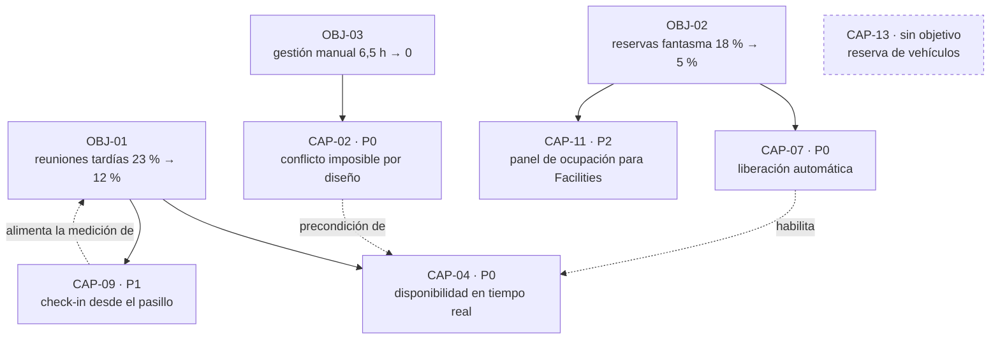
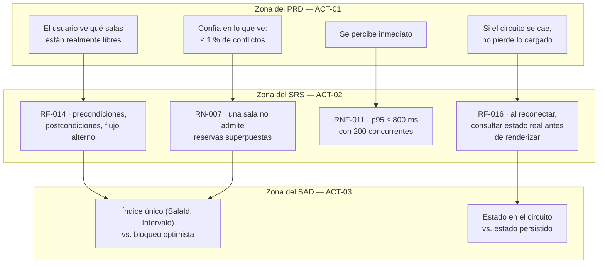

# Product Requirements Document — `DOC-PRD`

## Resumen ejecutivo

El PRD describe qué debe hacer el producto para que los objetivos del [BRD](BRD.md) se cumplan, en el lenguaje del usuario y no del sistema. Su unidad de contenido es la **capacidad** —`CAP-nn`—: algo que alguien puede lograr con el producto, con su criterio de éxito medible y su justificación de negocio. Es el documento bisagra de la familia: hacia arriba se justifica contra objetivos, hacia abajo se despliega en requisitos funcionales del SRS.

Es también el documento de esta familia que más equipos escriben mal, y casi siempre en la misma dirección: hacia abajo. Un PRD que especifica validaciones, códigos de error y estructura de pantallas dejó de ser un PRD y se convirtió en un SRS peor escrito, sin la disciplina de trazabilidad que el SRS exige.

Lo firma `ACT-01`. `ACT-08` co-produce la parte de flujos y experiencia, `ACT-05` lo revisa antes de aprobarlo —un criterio de éxito que QA no puede convertir en verificación está mal escrito— y `ACT-02` lo recibe para producir el SRS.

---

## Definición

### Qué es

La especificación de las capacidades de un producto, con los criterios que permiten saber si cada una funcionó. Combina cuatro contenidos: quién es el usuario y qué intenta lograr, qué capacidades le da el producto, cómo se prioriza entre ellas, y cómo se medirá el resultado.

Un PRD bien delimitado responde **qué** y **para qué**, y evita deliberadamente el **cómo**. La frontera es útil porque el cómo tiene dos dueños distintos: el comportamiento exacto del sistema es de `ACT-02` en el SRS, y la estructura que lo soporta es de `ACT-03` en el SAD. Un PRD que decide por ellos no acelera el proyecto; cierra opciones antes de que nadie evalúe su costo.

### Qué problema resuelve

Resuelve la distancia entre un objetivo de negocio y una lista de tareas. `OBJ-01` dice «reducir las reuniones que empiezan tarde del 23 % al 12 %»; un backlog dice «pantalla de búsqueda de salas». Entre ambos falta el razonamiento que explica por qué esa pantalla produce ese resultado, y ese razonamiento es el PRD. Sin él, la priorización se hace por esfuerzo y por entusiasmo, que son los dos criterios que peor correlacionan con el impacto.

Resuelve también un problema de terminación. Una capacidad con criterio de éxito medible tiene condición de completitud; una funcionalidad sin él se considera terminada cuando el desarrollador dice que está lista, y se descubre incompleta en producción.

### Qué NO es

**No es un SRS.** La diferencia no es de nivel de detalle sino de naturaleza de la afirmación. El PRD dice qué puede lograr un usuario; el SRS dice qué hace el sistema, con precondiciones, postcondiciones, reglas y comportamiento ante cada desviación. «El usuario puede reservar una sala disponible en menos de quince segundos» es PRD. «`RF-014`: al recibir una solicitud de reserva, el sistema verifica que no exista solapamiento para `(SalaId, Intervalo)`; si existe, rechaza con los tres horarios alternativos más próximos y preserva los asistentes cargados» es SRS.

**No es un documento de diseño de interfaz.** Puede y debe describir el flujo —qué logra el usuario, en qué orden, qué decide— pero no la disposición de los controles. Las maquetas se referencian como ilustración, no se incorporan como especificación, por la razón que el marco señala en la ficha de [`ACT-08`](../00-Marco-de-Referencia/Actores.md#act-08--diseñador-uxui): los prototipos de alta fidelidad no son diffeables y no deben ser fuente de verdad.

**No es el backlog.** El backlog es una lista ordenada y viva de trabajo pendiente; el PRD es un cuerpo estable de razonamiento sobre el producto. Los ítems del backlog se cierran y desaparecen; las capacidades del PRD permanecen y se revisan. Un equipo que reemplaza el PRD por el backlog conserva la lista de lo que hizo y pierde el porqué, que es exactamente lo que se necesita cuando hay que decidir qué hacer después.

**No es un contrato de alcance congelado.** Los criterios de éxito son hipótesis sobre el efecto; cuando el uso real las refuta, se corrigen. Un PRD que no se modificó nunca no es riguroso, es abandonado.

### Con qué se lo confunde

Con el SRS hacia abajo y con el BRD hacia arriba. La prueba de tres preguntas resuelve la mayoría de los casos dudosos:

| Pregunta sobre el enunciado | Si la respuesta es sí | Documento |
|---|---|---|
| ¿Habla de dinero, plazo, riesgo, cumplimiento o alcance de la inversión? | Objetivo o restricción de negocio | [BRD](BRD.md) |
| ¿Describe lo que una persona logra, sin decir cómo el sistema lo procesa? | Capacidad de producto | PRD |
| ¿Contiene condición, excepción, formato, código o regla verificable por máquina? | Requisito de sistema | SRS, [`FAM-ANA`](../20-Analisis/) |

Hay un caso genuinamente ambiguo que conviene resolver por convención antes de que se discuta cada vez: los **requisitos no funcionales**. El PRD fija el objetivo de calidad en términos de experiencia —«la consulta de disponibilidad se percibe inmediata»— y el SRS lo convierte en `RNF` verificable —«p95 ≤ 800 ms con 200 usuarios concurrentes, medido en el entorno de preproducción»—. Cuando el nivel de servicio es en sí mismo la propuesta de valor, como en un producto `CTX-2`, el número entra al PRD porque es producto y no detalle.

---

## Aplicación por escenario

| Escenario | ¿Aplica? | Qué contiene | Quién lo produce | Riesgo característico |
|-----------|----------|--------------|------------------|----------------------|
| `ESC-1` Desarrollo nuevo | Sí, es su escenario natural | Capacidades completas con criterios de éxito | `ACT-01` con `ACT-08` | Deslizarse a SRS y duplicar trabajo de `ACT-02` |
| `ESC-2` Migración | Sí, pero reducido | Solo lo que cambia; la paridad se referencia | `ACT-01` con `ACT-05` | Reescribir como PRD nuevo lo que ya está especificado en el sistema origen |
| `ESC-3` Evaluación con código | Sí, reconstruido con confianza media | Capacidades observadas en el sistema | `ACT-02` con `ACT-10` | Presentar un defecto tolerado como capacidad deliberada |
| `ESC-4` Evaluación externa | Sí, y con alta confianza | Catálogo de capacidades observadas | `ACT-02` | Incluir capacidades anunciadas pero no verificadas |

### `ESC-1` — Desarrollo nuevo

El PRD se escribe después del BRD y antes del SRS, y su calidad depende de una decisión de orden: **capacidades antes que soluciones**. La forma práctica de sostenerlo es redactar cada capacidad partiendo del objetivo de negocio que la justifica, y escribir el criterio de éxito antes que la descripción. Cuando el criterio de éxito se escribe último, tiende a ser una paráfrasis de la funcionalidad ya descrita en lugar de una medida de su efecto.

La revisión con `ACT-05` antes de la aprobación es el control de calidad de mayor rendimiento en esta etapa. QA no evalúa si la capacidad es buena idea; evalúa si el criterio de éxito es verificable. Una capacidad cuyo criterio no se puede verificar no está lista para pasar a `FAM-ANA`.

### `ESC-2` — Migración

El PRD de una migración debería ser corto, y cuando es largo suele indicar un error de encuadre. La mayor parte del comportamiento no se especifica de nuevo: se declara paridad contra el sistema origen, y el trabajo de especificación es el de reconstrucción que hace `ACT-02` sobre el sistema actual. El PRD cubre solo tres cosas: lo que cambia deliberadamente, lo que se abandona, y las capacidades nuevas que la migración habilita y que justifican parte de su costo.

Un ejemplo del dominio. Al migrar de ASP.NET MVC a Blazor *interactive server*, la capacidad «consultar disponibilidad» existe en ambos y se declara paridad. Lo que cambia y sí entra al PRD es que en el destino la disponibilidad se actualiza sin recargar la página cuando otro usuario reserva, capacidad que la plataforma origen no permitía razonablemente. Eso es producto nuevo, tiene su propio criterio de éxito y su propio objetivo asociado.

### `ESC-3` — Evaluación con acceso al código

Se reconstruye a partir de flujos, pruebas de aceptación existentes, mensajes de la interfaz y el modelo de datos. La confianza es media y no alta, por una razón que conviene tener presente: el código muestra qué hace el sistema, no qué se pretendía que lograra el usuario. La intención se infiere, y la inferencia se marca.

El riesgo específico es el que el marco de escenarios ya señala: presentar como requisito lo que es un defecto que nadie corrigió. En un sistema de reservas real, encontrar que se permite reservar salas en el pasado admite tres lecturas —capacidad deliberada, defecto tolerado, o efecto colateral no advertido— y solo el historial de tickets o una entrevista permite distinguirlas. Cuando no se puede distinguir, se documenta el comportamiento y se marca la intención como desconocida.

### `ESC-4` — Evaluación solo desde afuera

Es el escenario donde el PRD reconstruido alcanza mayor confianza, porque las capacidades de un producto son precisamente lo que se observa usándolo. El catálogo de funcionalidades y los flujos de usuario tienen confianza alta según la [tabla del escenario](../00-Marco-de-Referencia/Escenarios.md#qué-se-puede-producir-y-con-qué-confianza).

Lo que no se observa son los criterios de éxito ni las prioridades, que son internos. Un PRD reconstruido desde afuera es, con precisión, un catálogo de capacidades sin su justificación; presentarlo como PRD completo sobredimensiona lo que se sabe. La disciplina mínima: separar capacidades verificadas por uso propio de capacidades anunciadas en el sitio y no verificadas, y registrar versión y fecha de observación.

### Qué cambia según el contexto

En `CTX-1` el peso se desplaza hacia los flujos y los estados. Una capacidad de producto en contexto web no está especificada si solo describe el camino feliz: el [tratamiento de estados](../00-Marco-de-Referencia/Contextos.md#ctx-1--web-y-cliente-interactivo) —vacío, cargando, con datos, con error— y el comportamiento ante interrupción son parte del qué, no del cómo. En Blazor *interactive server*, qué ve el usuario cuando el circuito se reconecta a mitad de una confirmación es una decisión de producto antes que técnica.

En `CTX-2` el usuario de la capacidad es otro equipo, y el PRD se escribe en términos de casos de integración: qué puede lograr un sistema consumidor, con qué garantías y con qué esfuerzo de integración. El criterio de éxito característico deja de ser de satisfacción y pasa a ser de adopción y de tiempo hasta la primera integración exitosa.

En `CTX-3` el PRD es uno solo y cubre la capacidad de punta a punta. Es el documento donde nace la traza vertical: si la capacidad se llama «reserva» acá, no puede llamarse «pedido» en la interfaz ni `Booking` en la base. El glosario del PRD es la primera oportunidad de fijar el vocabulario canónico, y es mucho más barato fijarlo acá que corregirlo después en cuatro capas.

---

## Ejemplos concretos

### Una capacidad completa

Datos sintéticos, sistema de reservas de salas, `CTX-3`, Blazor *interactive server* más ASP.NET Core.

> ### `CAP-04` — Consulta de disponibilidad en tiempo real
>
> **Objetivo de negocio.** `OBJ-01` (reducir del 23 % al 12 % las reuniones que empiezan tarde).
>
> **Usuario.** Organizador de reunión corta y no planificada; representa el 68 % de las reservas.
>
> **Qué logra.** Ver, desde cualquier dispositivo y sin recargar, qué salas están realmente libres en la franja que le interesa, filtradas por sede, capacidad y equipamiento, y confiar en que lo que ve es cierto en el momento de reservar.
>
> **Por qué esto y no otra cosa.** El calendario actual muestra reservas que nadie canceló; el problema no es que falte información sino que la información existente no es confiable. Una capacidad de búsqueda sobre datos poco fiables no mueve `OBJ-01`; por eso `CAP-04` depende de `CAP-07` (liberación automática) y no tiene sentido entregarla sola.
>
> **Criterios de éxito.**
> | ID | Criterio | Medición | Meta |
> |----|----------|----------|------|
> | `CE-04.1` | La disponibilidad mostrada coincide con la real | Reservas rechazadas por conflicto sobre el total confirmadas | ≤ 1 % (línea base actual: 8 %) |
> | `CE-04.2` | La consulta se percibe inmediata | p95 de la consulta desde la interacción hasta el resultado visible | ≤ 1 s con 200 usuarios concurrentes |
> | `CE-04.3` | El usuario encuentra sala sin ayuda en el primer intento | Prueba de usabilidad moderada, n=12 | ≥ 10 de 12 sin asistencia |
> | `CE-04.4` | Uso efectivo desde el pasillo | Proporción de consultas desde el cliente MAUI en horario laboral | ≥ 30 % a los 6 meses |
>
> **Alcance de la capacidad.** Búsqueda por sede, franja horaria, capacidad mínima y equipamiento (proyector, videoconferencia, pizarra). Actualización de la disponibilidad visible sin recargar cuando otro usuario reserva. Estados definidos: sin resultados, cargando, con resultados, error de consulta, y sesión reconectada tras caída del circuito.
>
> **Fuera de alcance de la capacidad.** Sugerencia automática de sala. Reserva recurrente. Búsqueda por persona en lugar de por sala.
>
> **Supuestos.** Que el 41 % de ocupación medida es representativo del año; si la medición estacional lo desmiente, `CE-04.1` cambia de meta.
>
> **Despliegue en `FAM-ANA`.** `RF-014`, `RF-015`, `RF-016`; reglas `RN-007`, `RN-009`; `RNF-011` a `RNF-013` (rendimiento y accesibilidad).

Nótese qué no dice: ningún endpoint, ningún componente, ninguna decisión de caché ni de mecanismo de notificación. Que la actualización sin recarga se resuelva por el propio circuito SignalR de Blazor o por otro medio es decisión de `ACT-03`, y el PRD solo fija que debe ocurrir.

### La misma capacidad, mal escrita

> **`CAP-04` — Búsqueda de salas.** El sistema mostrará una pantalla con un formulario de búsqueda que incluirá los campos Sede (desplegable), Fecha (calendario), Hora inicio, Hora fin, Capacidad (numérico) y Equipamiento (casillas múltiples). Al presionar el botón Buscar se ejecutará `GET /api/salas/disponibles` y se mostrará una tabla paginada de 20 registros con las columnas Sala, Piso, Capacidad y Equipamiento. Si no hay resultados se mostrará el mensaje «No se encontraron salas disponibles».

Especifica más y define menos. No hay objetivo asociado, no hay criterio de éxito, no hay forma de saber si funcionó, y ya decidió el endpoint, la paginación y el texto del mensaje vacío —tres decisiones de tres dueños distintos, ninguno de los cuales es `ACT-01`—. Lo que se pierde es la posibilidad de que alguien proponga una solución mejor, porque el problema nunca se enunció.

### Priorización trazable



`CAP-13` aparece a propósito sin flecha entrante. Una capacidad sin objetivo asociado no se prioriza: se cuestiona. En este caso concreto además contradice el fuera de alcance declarado en el [Vision Document](Vision-Document.md), lo cual convierte la discusión en una revisión de visión y no en una decisión de backlog.

---

### Dónde termina el PRD y empieza el SRS

La frontera se discute en cada proyecto, y conviene fijarla con un ejemplo antes de que se discuta con un caso cargado de política. Tomando `CAP-04` sobre la misma funcionalidad:



La regla que resuelve los casos dudosos: si al leer el enunciado un desarrollador puede empezar a implementar sin más preguntas, está en la zona del SRS y no en la del PRD. Si al leerlo un usuario reconoce lo que quiere lograr, está en la zona del PRD. Los enunciados que no cumplen ninguna de las dos condiciones no pertenecen a ningún documento y suelen ser el residuo de una discusión que quedó a medias.

Hay un tránsito legítimo en sentido contrario que conviene registrar. Cuando `ACT-02` escribe el SRS y descubre que una capacidad no se puede especificar sin tomar una decisión de producto —qué pasa si el organizador de una reunión se da de baja de la organización con reservas futuras vigentes—, esa pregunta vuelve al PRD y no se resuelve en el SRS. La sección de decisiones abiertas del PRD es el lugar donde esas devoluciones se acumulan.

---

## Preguntas guía

- ¿Cada capacidad referencia al menos un `OBJ-` del BRD? Las que no, ¿por qué están?
- ¿El criterio de éxito mide el efecto de la capacidad o su existencia? «La pantalla está construida» no es criterio de éxito.
- ¿`ACT-05` puede convertir cada criterio en una verificación concreta sin preguntar nada?
- ¿Están definidos los estados no felices de cada capacidad en `CTX-1`, o solo el camino ideal?
- ¿Alguna capacidad depende de otra para producir su efecto? ¿Está escrito, o se va a descubrir al entregar la primera sola?
- ¿El PRD decide algo que le corresponde a `ACT-02` o a `ACT-03`? ¿Por qué?
- ¿Los términos de este documento son los mismos que va a usar la interfaz, la API y la base de datos?
- ¿Qué capacidad se eliminaría si el presupuesto bajara un 30 %, y esa decisión está anticipada?

---

## Criterios de calidad

### Buena versión

Cada capacidad se lee como algo que alguien logra, se justifica contra un objetivo y trae un criterio de éxito que se puede medir con un instrumento que existe o que está en el alcance construir. Las dependencias entre capacidades están explícitas, de modo que no se entrega una pieza que sola no produce efecto. Hay priorización con criterio declarado, no solo un orden. El vocabulario es único y está en un glosario. Y hay una sección de lo que se decidió no hacer, con la misma exigencia que en los otros dos documentos de la familia.

### Versión pobre

Lista de funcionalidades con descripción de interfaz. Criterios de éxito ausentes o tautológicos. Sin trazas hacia el BRD ni hacia el SRS. Prioridades expresadas como «alta / media / baja» sin decir según qué. Términos que cambian de nombre entre secciones. Decisiones técnicas incrustadas que nadie recuerda haber tomado y que después limitan a la arquitectura sin haber sido discutidas.

### Antipatrones frecuentes

**PRD-que-es-SRS.** El más común. Se reconoce por la aparición de condiciones, formatos y códigos. El costo no es solo la duplicación: cuando `ACT-02` escribe el SRS encuentra el terreno ocupado por especificaciones que no tienen la disciplina del SRS y que igual hay que respetar porque están aprobadas.

**Criterio de éxito tautológico.** «Éxito: la capacidad está disponible en producción». Mide la entrega, no el efecto, y garantiza que ningún proyecto fracase nunca, que es exactamente lo que impide aprender.

**Capacidad huérfana.** Sin objetivo de negocio asociado. A veces es legítima —deuda, habilitadores— y entonces se declara como tal; cuando no, es una preferencia que entró sin revisión.

**Solución en lugar de problema.** «El producto enviará un recordatorio por correo quince minutos antes». La capacidad es que el organizador y los asistentes lleguen a tiempo; el correo es una de varias soluciones y quizá no la mejor en una organización que ignora el correo interno. Decidirlo en el PRD cierra el espacio de diseño gratis.

**Priorización sin criterio.** Etiquetas de prioridad sin regla que las produzca. Cuando el criterio no está escrito, la prioridad la fija quien insiste más, y eso es indistinguible de no priorizar.

**Camino feliz exclusivo.** En `CTX-1`, especificar solo el flujo ideal deja sin definir el grueso del trabajo de implementación y garantiza que las decisiones sobre error, vacío e interrupción las tome el desarrollador solo, en el momento de menor información.

**PRD congelado.** Aprobado una vez y nunca revisado contra el uso real. Los criterios de éxito existen para medirse; un PRD sin resultados registrados junto a sus metas desperdició su parte más cara.

---

## Anexo — Plantilla comentada

```markdown
---
doc_id: DOC-PRD-<producto>
doc_type: tema
title: Product Requirements Document — <producto>
status: vigente | borrador | obsoleto
origin: human | ia-assisted | ia-generated
confidence: alta | media | baja        # solo si origin != human
owner: <persona>
last_review: AAAA-MM-DD
audience: [humano, agente]
traces: [DOC-VISION-..., DOC-BRD-..., DOC-SRS-...]
---

# PRD — <producto>

## 1. Encuadre
Enlaces a visión y BRD. Qué release o horizonte cubre este PRD.
No repetir el contenido de los otros dos: enlazar.

## 2. Usuarios y sus objetivos
| Perfil | Qué intenta lograr | Frecuencia | Qué hace hoy sin el producto |
La última columna es la que revela si la capacidad propuesta aporta algo.

## 3. Capacidades
Una subsección por capacidad. Formato repetido para que sea parseable:

### CAP-nn — <nombre en lenguaje de usuario>
- **Objetivo de negocio**: OBJ-nn (¿qué resultado del BRD sostiene esto?)
- **Usuario**: ¿quién, concretamente?
- **Qué logra**: ¿qué puede hacer, dicho desde su lado, sin verbos de sistema?
- **Por qué esta capacidad**: ¿por qué esto mueve el objetivo y no otra cosa?
- **Criterios de éxito**: tabla | ID | Criterio | Medición | Meta |
  ¿Puede QA verificarlo sin preguntar? Si no, reescribir.
- **Estados y desviaciones**: en CTX-1, ¿qué pasa con vacío, error,
  interrupción y reconexión? Es parte del qué, no del cómo.
- **Alcance / fuera de alcance de la capacidad**
- **Dependencias**: ¿qué otra capacidad hace falta para que esta produzca efecto?
- **Supuestos**: ¿qué se da por cierto? ¿Qué pasa si es falso?
- **Traza hacia FAM-ANA**: RF-*, RN-*, RNF-* (se completa cuando exista el SRS)

## 4. Priorización
Criterio declarado primero, tabla después.
Ej.: «prioriza el impacto sobre OBJ-01, luego la dependencia técnica,
luego el esfuerzo». Sin criterio escrito, la tabla no es priorización.

## 5. Fuera de alcance del producto
¿Qué se pidió y no entra? ¿Qué se difiere y a qué horizonte del Roadmap?

## 6. Métricas del producto
Cómo se instrumenta la medición: qué evento, dónde se registra, quién lo mira.
Si medir requiere construir algo, ese algo es una capacidad más.

## 7. Glosario
Término canónico, definición, alias que se van a encontrar en el código heredado.
Esta sección es la que sostiene la traza vertical en CTX-3.

## 8. Decisiones abiertas
| Pregunta | Quién decide | Para cuándo | Qué bloquea |
Registrar lo no decidido evita que se decida por omisión.

## 9. Historial de revisión
Qué cambió, cuándo, por qué evidencia. Los criterios de éxito que se
corrigieron con datos de uso real son el registro más valioso del documento.
```

La sección 8 es la que distingue un PRD en uso de uno aprobado y archivado: un producto en desarrollo siempre tiene decisiones abiertas, y escribirlas es lo que impide que se resuelvan por defecto en el commit de alguien.
