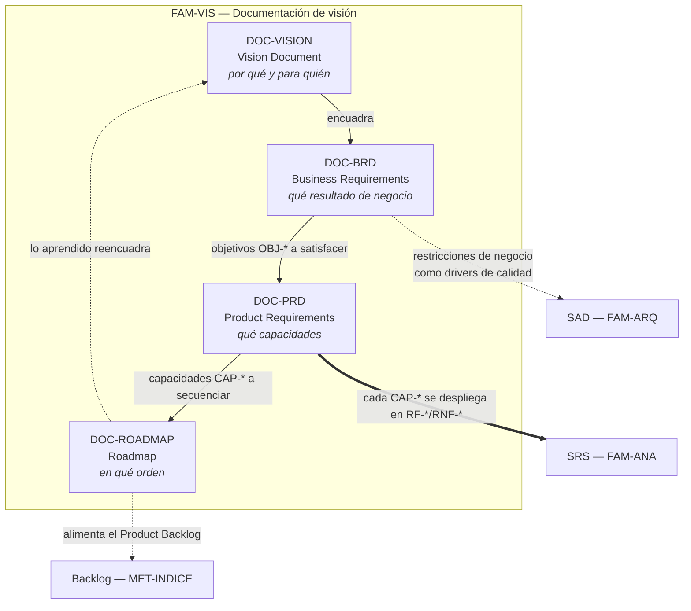

# Documentación de visión — `FAM-VIS`

## Resumen ejecutivo

Cuatro artefactos responden juntos a la pregunta **«¿qué queremos construir?»** antes de que exista una línea de código: el Vision Document fija el porqué, el BRD traduce ese porqué a compromisos de negocio medibles, el PRD convierte el compromiso en producto observable y el Roadmap ordena la entrega en el tiempo. Ninguno especifica el sistema —eso es trabajo de [`FAM-ANA`](../20-Analisis/), la familia de análisis— y ninguno decide estructura técnica, que corresponde a [`FAM-ARQ`](../30-Arquitectura/).

Esta familia es la que más se salta y la que más caro se paga saltar. Un equipo que empieza por el SRS produce una especificación impecable de un producto que nadie pidió; la documentación de visión existe precisamente para que esa especificación tenga contra qué contrastarse.

El actor dueño de los cuatro documentos es `ACT-01` Product Owner, según la [matriz de responsabilidad](../00-Marco-de-Referencia/Actores.md#matriz-de-responsabilidad-por-familia-documental). No los escribe solo, pero los firma.

---

## La pregunta que responde la familia

«¿Qué queremos construir?» se descompone en cuatro preguntas encadenadas, y cada documento contesta una:

| Documento | ID | Pregunta específica | Horizonte | Lenguaje |
|-----------|----|--------------------|-----------|----------|
| [Vision Document](Vision-Document.md) | `DOC-VISION` | ¿Por qué existe este producto y para quién? | 12 a 36 meses | Negocio y usuario, sin métrica de detalle |
| [BRD](BRD.md) | `DOC-BRD` | ¿Qué resultado de negocio justifica la inversión? | 6 a 18 meses | Objetivos medibles, alcance, restricciones |
| [PRD](PRD.md) | `DOC-PRD` | ¿Qué debe hacer el producto para lograrlo? | 1 a 2 releases | Capacidades de producto y criterios de éxito |
| [Roadmap](Roadmap.md) | `DOC-ROADMAP` | ¿En qué orden y con qué secuencia lo entregamos? | Continuo, revisado | Resultados por horizonte temporal |

La progresión va de lo estable a lo volátil. Un Vision Document que cambia cada trimestre no era una visión sino una hipótesis mal etiquetada; un Roadmap que no cambia en seis meses no se está usando.

---

## Cómo se relacionan

Las flechas continuas son dependencias de contenido: no se escribe un PRD sin objetivos de negocio contra los cuales justificar cada capacidad. Las punteadas son influencias, no requisitos de orden. La flecha de retorno del Roadmap a la visión es la que más se olvida documentar: cuando la entrega de un horizonte demuestra que la hipótesis era falsa, lo que se corrige es el documento de visión, no solamente el plan.

La frontera con el análisis está en la palabra **capacidad**. El PRD dice «el sistema permite reservar una sala verificando disponibilidad en tiempo real»; el SRS dice `RF-014` con precondiciones, postcondiciones, reglas de negocio y comportamiento ante conflicto. Si el PRD empieza a enumerar códigos de error HTTP, invadió `FAM-ANA`.

---

## Orden de lectura

Para estudiar la familia por primera vez, el orden natural es el de producción: [Vision Document](Vision-Document.md) → [BRD](BRD.md) → [PRD](PRD.md) → [Roadmap](Roadmap.md). Cada documento asume el vocabulario del anterior.

Para un lector que llega a un proyecto en marcha conviene el orden inverso: el Roadmap dice qué está pasando ahora, el PRD explica qué se está construyendo, el BRD por qué se paga y la visión qué se persigue a largo plazo. Es el recorrido de menor a mayor abstracción, y el que mejor sirve cuando hay que producir algo en la primera semana.

En `ESC-3` y `ESC-4` —evaluación de un sistema existente— el orden es otro todavía: se empieza reconstruyendo el Roadmap observado a partir de notas de versión y se sube desde ahí, porque la evidencia de intención es más abundante en lo reciente que en lo fundacional.

---

## Aplicación por escenario, en una línea cada uno

| Escenario | Peso de la familia | Qué cambia |
|-----------|-------------------|-----------|
| [`ESC-1`](../00-Marco-de-Referencia/Escenarios.md#esc-1--desarrollo-de-software-nuevo) Desarrollo nuevo | Máximo | Los cuatro documentos son prescriptivos y se producen en orden |
| [`ESC-2`](../00-Marco-de-Referencia/Escenarios.md#esc-2--migración-a-otro-lenguaje-o-plataforma) Migración | Medio, y distinto | El BRD justifica la migración; el PRD se reduce al criterio de paridad y a lo que sí cambia |
| [`ESC-3`](../00-Marco-de-Referencia/Escenarios.md#esc-3--evaluación-de-software-existente-con-acceso-al-código) Evaluación con código | Bajo pero revelador | Se reconstruye la visión implícita y se contrasta con la declarada |
| [`ESC-4`](../00-Marco-de-Referencia/Escenarios.md#esc-4--evaluación-de-un-producto-solo-desde-afuera) Evaluación externa | Sorprendentemente alto | Visión, posicionamiento y roadmap son de lo poco que un producto publica sobre sí mismo |

Cada documento desarrolla las cuatro entradas con detalle en su sección **Aplicación por escenario**.

Respecto de los contextos, esta familia es la única donde el peso no cambia entre [`CTX-1`, `CTX-2` y `CTX-3`](../00-Marco-de-Referencia/Contextos.md#cruce-entre-contextos-y-familias-documentales): el producto es el mismo mire quien lo mire. Lo que cambia es quién es el usuario cuya necesidad se documenta —una persona en `CTX-1`, un equipo integrador en `CTX-2`— y eso reordena las secciones de usuarios y de métricas, no la estructura.

---

## Referencias de industria pertinentes a la familia

`ISO/IEC/IEEE 29148:2018` define el **StRS** (*Stakeholder Requirements Specification*), que es el pariente normativo del BRD, y lo distingue del **SyRS** y del **SRS**. La cadena StRS → SyRS → SRS de la norma es la formalización de la misma progresión que esta familia recorre con nombres de industria.

El **BABOK v3** del IIBA aporta el vocabulario de análisis de negocio —*business need*, *solution scope*, *stakeholder analysis*— que estructura el BRD.

El **Business Model Canvas** de Alexander Osterwalder es el instrumento habitual para producir el material que después se narra en el Vision Document: propuesta de valor, segmentos, canales, estructura de costos.

Para roadmaps orientados a resultados —el formato *now / next / later*, la distinción entre roadmap y plan de entrega— el trabajo de **Roman Pichler** es la referencia de uso más extendido.

La **Scrum Guide 2020** define el *Product Goal* y el *Product Backlog*, que son el punto donde esta familia entrega el testigo a los métodos ágiles: el Roadmap alimenta el backlog, no lo reemplaza.

---

## Índice de la familia

- [`DOC-VISION` — Vision Document](Vision-Document.md)
- [`DOC-BRD` — Business Requirements Document](BRD.md)
- [`DOC-PRD` — Product Requirements Document](PRD.md)
- [`DOC-ROADMAP` — Roadmap](Roadmap.md)

### Marco de referencia

- [Escenarios](../00-Marco-de-Referencia/Escenarios.md) — `ESC-1` a `ESC-4`
- [Contextos](../00-Marco-de-Referencia/Contextos.md) — `CTX-1` a `CTX-3`
- [Actores](../00-Marco-de-Referencia/Actores.md) — `ACT-01` a `ACT-10`
- [Convenciones](../00-Marco-de-Referencia/Convenciones.md) — frontmatter, IDs, estilo

### Familias vecinas

- [`FAM-ANA` — Análisis](../20-Analisis/): recibe el PRD y produce el SRS
- [`FAM-ARQ` — Arquitectura](../30-Arquitectura/): recibe las restricciones del BRD como drivers
- [`MET-INDICE` — Métodos ágiles](../80-Metodos-Agiles/): recibe el Roadmap y lo convierte en backlog

---

## Criterio de suficiencia de la familia

Una startup de cuatro personas no necesita cuatro documentos: necesita las cuatro respuestas. Es perfectamente legítimo consolidar visión y BRD en dos páginas y mantener PRD y Roadmap separados, que es la combinación de menor costo y mayor rendimiento. Lo que no es legítimo es no poder contestar por qué se construye lo que se construye.

La prueba práctica: si un desarrollador pregunta «¿por qué esta funcionalidad antes que aquella?» y la única respuesta disponible es «lo pidió el cliente», falta el BRD. Si pregunta «¿cómo sabremos si esto funcionó?» y no hay métrica, falta el PRD. Si pregunta «¿esto para cuándo, y qué queda afuera?», falta el Roadmap.
