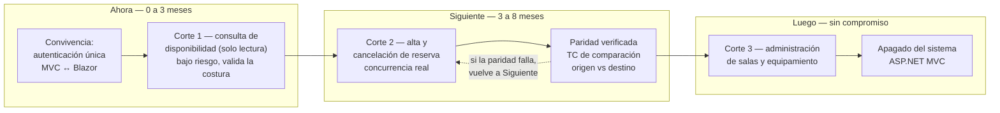
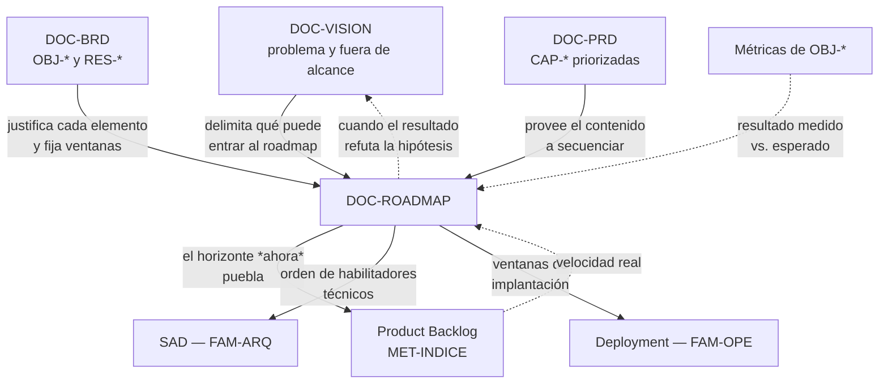

# Roadmap — `DOC-ROADMAP`

## Resumen ejecutivo

El Roadmap ordena en el tiempo los resultados que el producto persigue, y comunica ese orden a quienes no participan de las decisiones diarias. Es el documento de la familia con la vida más corta y la audiencia más amplia: se revisa cada cuatro a ocho semanas y lo leen dirección, ventas, soporte, las áreas usuarias y el equipo, cada uno buscando algo distinto.

Su dificultad no es de formato sino de naturaleza. Un roadmap se lee como una promesa aunque se escriba como una intención, y todo el trabajo de redacción consiste en administrar esa tensión: comunicar dirección sin comprometer fechas que dependen de información que todavía no existe. El formato **now / next / later**, popularizado en el trabajo de Roman Pichler y ampliamente adoptado, existe precisamente para eso: expresa secuencia sin fingir precisión temporal.

Lo firma `ACT-01`. `ACT-03` es consultado para el ordenamiento técnico —qué habilitadores deben preceder a qué— y `ACT-06` para las ventanas de implantación, que suelen ser una restricción dura registrada en el [BRD](BRD.md).

---

## Definición

### Qué es

Una vista temporal del producto organizada por resultados: qué se persigue ahora, qué viene después, qué se está considerando, y qué se decidió no hacer. Cada elemento del roadmap enuncia el resultado buscado y el objetivo de negocio que lo justifica, no la funcionalidad que lo implementaría.

La diferencia entre un roadmap de resultados y uno de funcionalidades es la propiedad que lo hace útil o inútil. «Q3: liberación automática de salas» compromete una solución concreta; «Ahora: que la disponibilidad mostrada sea confiable» compromete un resultado y deja abierto el medio. Cuando en el mes dos se descubre que el sensor de presencia previsto no funciona con las salas acristaladas, el primero obliga a renegociar el roadmap con dirección y el segundo permite cambiar de solución sin cambiar la promesa.

### Qué problema resuelve

Resuelve la pregunta que el resto de la familia no contesta: **¿en qué orden, y por qué en ese orden?** El [PRD](PRD.md) prioriza capacidades, pero la prioridad es un atributo estático; el roadmap agrega la secuencia, las dependencias y los momentos en que se espera obtener resultado.

Resuelve también un problema organizacional que se subestima. Sin roadmap publicado, cada área construye su propia expectativa a partir de conversaciones sueltas, y esas expectativas divergen sin que nadie lo note hasta que alguien promete algo a un cliente. El roadmap no es principalmente un instrumento de planificación —para eso están el backlog y el sprint— sino de alineación de expectativas.

### Qué NO es

**No es un plan de proyecto.** Un plan tiene tareas, dependencias, esfuerzos, asignaciones y una ruta crítica. Un roadmap tiene resultados y horizontes. Convertir uno en otro es la forma más rápida de que el documento envejezca mal, porque un plan a doce meses es falso desde el día en que se aprueba y todos lo saben, mientras que una dirección a doce meses puede sostenerse.

**No es un cronograma con fechas de entrega.** Hay excepciones legítimas y hay que nombrarlas: una obligación regulatoria con fecha, un vencimiento de licencia, una campaña comercial. Esas fechas son restricciones reales y se marcan como tales, con su origen. El error es tratar cada elemento del roadmap como si tuviera una fecha de ese tipo.

**No es el backlog.** El backlog es la lista ordenada de trabajo próximo, con granularidad de días; el roadmap opera en meses y trimestres. La relación entre ambos es de alimentación: el horizonte *ahora* del roadmap es lo que está poblando el backlog. En términos de la **Scrum Guide 2020**, el *Product Goal* es el objetivo único hacia el que el equipo trabaja en un momento dado, y el roadmap es lo que da sentido a la sucesión de esos objetivos. La guía no define el roadmap como artefacto de Scrum; la relación es de complemento, no de derivación.

**No es un compromiso contractual.** Cuando se publica a clientes conviene decirlo por escrito en el propio documento, porque la ausencia de esa aclaración se interpreta como su contrario.

### Con qué se lo confunde

Con el plan de release y con el backlog, y la confusión suele ser deliberada: dirección pide un roadmap cuando quiere fechas, y el equipo entrega un roadmap cuando quiere no darlas. La conversación honesta es distinguir qué se necesita realmente.

| | Roadmap | Plan de release | Backlog |
|---|---|---|---|
| Unidad | Resultado buscado | Entregable con fecha | Ítem de trabajo |
| Horizonte | 6 a 18 meses | Una release | Semanas |
| Granularidad temporal | Horizonte (*now/next/later*) o trimestre | Fecha | Sprint u orden |
| Compromiso | Dirección | Alcance y fecha | Prioridad relativa |
| Frecuencia de revisión | 4 a 8 semanas | Por release | Continua |
| Dueño | `ACT-01` | `ACT-01` con el equipo | `ACT-01` |
| Audiencia | Toda la organización | Involucrados en la entrega | Equipo |

Cuando alguien pide un roadmap y en realidad necesita saber si una funcionalidad concreta estará antes de una fecha comercial, lo que corresponde no es agregar fechas al roadmap sino producir un plan de release para ese alcance acotado. Mezclar ambos instrumentos degrada los dos.

---

## Aplicación por escenario

| Escenario | ¿Aplica? | Naturaleza | Quién lo produce | Riesgo característico |
|-----------|----------|-----------|------------------|----------------------|
| `ESC-1` Desarrollo nuevo | Sí, desde el primer trimestre | Prescriptiva, con incertidumbre alta | `ACT-01` con `ACT-03` | Prometer fechas cuando aún no hay velocidad conocida |
| `ESC-2` Migración | Sí, y con forma propia | Prescriptiva, secuencia de corte | `ACT-01` con `ACT-06` y `ACT-05` | Roadmap de módulos en lugar de secuencia de riesgo |
| `ESC-3` Evaluación con código | Sí, reconstruido hacia atrás y hacia adelante | Descriptiva del pasado, inferencial del futuro | `ACT-02` con `ACT-10` | Confundir el orden de los commits con intención estratégica |
| `ESC-4` Evaluación externa | Sí, y es de los artefactos más productivos | Inferencial, con evidencia pública | `ACT-02` | Tomar el roadmap publicado del proveedor como hecho |

### `ESC-1` — Desarrollo nuevo

El primer roadmap de un producto nuevo se construye sobre la menor información que va a tener nunca: no hay velocidad conocida, ni sistema, ni datos de uso. La respuesta razonable no es abstenerse sino declarar la incertidumbre en el propio formato, y por eso los horizontes cualitativos rinden más que los trimestres.

El ordenamiento en `ESC-1` debería seguir el riesgo antes que el valor, y es una recomendación que suele resistirse. Lo primero que conviene entregar es aquello cuya falla invalidaría el resto: si el producto de reservas depende de que la liberación automática funcione, y esa liberación depende de sensores en salas acristaladas que nadie probó, ese es el primer elemento del horizonte *ahora* aunque no sea lo más visible. Construir seis meses de funcionalidad sobre un supuesto no verificado es la forma más cara de descubrir que era falso.

### `ESC-2` — Migración

El roadmap de una migración tiene una estructura propia que no se parece a la de un producto nuevo, porque su unidad no es el resultado de usuario sino el **corte**: qué porción del sistema pasa al destino, cuándo, con qué convivencia entre origen y destino, y con qué vuelta atrás.

La decisión estructurante es el orden de los cortes, y se toma por riesgo y por acoplamiento, no por facilidad. El patrón habitual —empezar por el módulo más simple para ganar confianza— tiene el defecto de posponer el descubrimiento de los problemas reales hasta que ya se invirtió la mitad del presupuesto.



El elemento que casi siempre falta es el último: el apagado del sistema origen. Un roadmap de migración que no lo incluye produce el resultado más caro posible, que es operar dos sistemas indefinidamente.

### `ESC-3` — Evaluación con acceso al código

Se reconstruyen dos roadmaps y conviene no mezclarlos. El **histórico** se lee en el repositorio: ritmo de entrega, en qué módulos se concentró el esfuerzo por período, cuándo se aceleró y cuándo se detuvo. Es evidencia sólida sobre lo que efectivamente ocurrió.

El **prospectivo** —qué parece venir— se apoya en trabajo a medio hacer: ramas abiertas, banderas de funcionalidad apagadas, tablas creadas sin uso, dependencias agregadas y no ejercitadas. Su confianza es baja y se marca como tal. Encontrar en el modelo de datos una tabla `RecursoTipo` sin registros y sin código que la lea sugiere una intención de generalizar más allá de las salas; sugiere, no demuestra.

La comparación entre el roadmap declarado —si existe alguno archivado— y el histórico reconstruido es un hallazgo de primer orden en una auditoría: mide la capacidad de la organización de ejecutar lo que planifica, que suele ser un dato más relevante que cualquier detalle técnico.

### `ESC-4` — Evaluación solo desde afuera

Es el artefacto de esta familia que mejor se reconstruye desde afuera, y la [tabla de confianza del escenario](../00-Marco-de-Referencia/Escenarios.md#qué-se-puede-producir-y-con-qué-confianza) le asigna confianza media apoyada en notas de versión y changelog público. El material disponible es más rico que en cualquier otro artefacto: las notas de versión son un registro fechado de dónde invirtió el equipo, y su lectura agregada por trimestre revela el ritmo, las áreas prioritarias y los abandonos.

Dos precauciones. La primera: un roadmap publicado por el proveedor es una declaración de intención con propósito comercial, y se documenta como «roadmap declarado», separado del «roadmap observado» que se infiere de las entregas reales. La brecha entre ambos es informativa. La segunda es la del escenario: registrar fecha y versión de todo lo observado, porque el changelog se reescribe y las páginas de roadmap desaparecen sin dejar rastro.

### Qué cambia según el contexto

En `CTX-1` y `CTX-3` el roadmap se organiza naturalmente por resultados de usuario, que es su forma canónica. En `CTX-2` aparece un contenido que los otros no tienen y que sus consumidores necesitan más que cualquier otra cosa: el **calendario de contratos**. Qué versión de la API se publica, cuándo se deprecia una anterior, cuánto dura la ventana de convivencia y a partir de qué fecha se rechaza. Un roadmap de backend sin política de deprecación fechada obliga a cada equipo consumidor a planificar a ciegas, y esa es la queja más frecuente de los consumidores de servicios internos.

En `CTX-3` conviene un solo roadmap con el orden de despliegue explícito cuando importa: si una capacidad requiere que el servicio esté antes que la interfaz, decirlo en el roadmap ahorra la coordinación de última hora que `ACT-06` termina haciendo por teléfono.

---

## Ejemplos concretos

### Roadmap de resultados — versión buena

Datos sintéticos. Sistema de reservas de salas, `CTX-3`, primer año. Formato *now / next / later*, revisión cada seis semanas.

| Horizonte | Resultado buscado | Objetivo | Confianza | Qué lo desbloquea |
|-----------|-------------------|----------|-----------|-------------------|
| **Ahora** (0-3 m) | La disponibilidad que el sistema muestra es cierta | `OBJ-01` | Alta | Validación del sensor de presencia en salas acristaladas (riesgo `RSK-02`) |
| **Ahora** | Facilities deja de resolver conflictos a mano | `OBJ-03` | Alta | Nada; depende solo del equipo |
| **Siguiente** (3-8 m) | Reservar desde el pasillo en menos de 15 s | `OBJ-01` | Media | Que la app MAUI pase la revisión de gestión de dispositivos corporativos |
| **Siguiente** | La capacidad perdida por reservas fantasma vuelve al pool | `OBJ-02` | Media | Despliegue de sensores en las 47 salas (compra en curso) |
| **Luego** (sin compromiso) | Facilities decide sobre el espacio con datos de uso real | `OBJ-02` | Baja | Seis meses de datos acumulados; antes no hay serie útil |
| **Luego** | Las sedes gestionan sus propias reglas de reserva | — | Baja | Sin objetivo asociado todavía; pendiente de validar con las tres sedes |
| **No haremos** | Reserva de escritorios y de vehículos | — | — | Fuera de alcance por decisión de visión, revisable en 2027 |

La columna de **confianza** es la que hace que el documento sea honesto sin ser inútil, y la de **qué lo desbloquea** es la que lo hace accionable: convierte cada elemento en una pregunta con dueño en lugar de una promesa flotante. La fila *No haremos* es la más consultada del documento a los tres meses, porque es la que contesta las preguntas que llegan por correo.

### Roadmap de funcionalidades — versión pobre

> **Q3 2026:** Módulo de búsqueda. Módulo de reservas. Integración con Exchange.
> **Q4 2026:** App móvil. Panel de reportes. Notificaciones push.
> **Q1 2027:** Sensores IoT. Módulo de escritorios. API pública.

Se lee como un compromiso trimestral que nadie puede sostener, no dice qué resultado persigue ninguno de esos módulos, y el primer retraso lo invalida por completo. La aparición del «módulo de escritorios» sin discusión previa es además la señal de que este documento se está usando para introducir alcance por la puerta de atrás, sin pasar por la revisión de la visión que lo excluye.

### Relación con el resto de los artefactos



Las dos flechas punteadas de retorno son las que distinguen un roadmap vivo de uno decorativo. Si la velocidad real del equipo y los resultados medidos no vuelven al roadmap, el documento se convierte en una declaración que envejece sin corregirse.

### Un caso de revisión

A las nueve semanas, la validación del sensor de presencia en salas acristaladas falla: el modelo elegido produce un 22 % de falsos negativos por reflexión, muy por encima del 3 % tolerable para liberar una sala automáticamente. El resultado «la capacidad perdida vuelve al pool» tenía confianza media y ahora está bloqueado.

La revisión correcta no mueve el elemento a *luego* y sigue. Se registra el hallazgo, se evalúa si hay otro medio para el mismo resultado —confirmación de presencia por check-in desde el móvil, que ya estaba previsto como `CAP-09` para otro fin— y se decide si ese medio alcanza la meta de `OBJ-02` o si la meta debe corregirse. La consecuencia puede llegar hasta el [BRD](BRD.md), y esa cadena hacia arriba es lo que hace que la familia funcione como sistema y no como cuatro documentos independientes.

---

## Preguntas guía

- ¿Cada elemento enuncia un resultado o una funcionalidad? Si es funcionalidad, ¿por qué se decidió el medio tan temprano?
- ¿Cada elemento referencia un `OBJ-` del BRD? Los que no, ¿son habilitadores declarados o alcance que entró sin revisión?
- ¿Está declarada la confianza de cada horizonte, o todo se comunica con la misma certeza?
- ¿Qué supuesto no verificado sostiene el horizonte más lejano? ¿Está previsto cuándo se verifica?
- ¿Hay una sección de lo que no se va a hacer? ¿Se actualiza cuando alguien pregunta?
- ¿Cuándo se revisó por última vez y qué se movió? Un roadmap sin movimiento en seis meses no se está usando.
- En `ESC-2`: ¿está el apagado del sistema origen en el roadmap, con condición de disparo?
- En `CTX-2`: ¿está publicada la política de deprecación con fechas para los consumidores?
- ¿Quién lee esto fuera del equipo, y entiende que es dirección y no compromiso?

---

## Criterios de calidad

### Buena versión

Se organiza por resultados, cada uno con su objetivo de negocio y su nivel de confianza declarado. Distingue lo comprometido de lo intencionado y lo intencionado de lo considerado. Incluye lo que no se hará. Registra qué desbloquea cada elemento incierto, de modo que la incertidumbre tiene dueño y fecha de resolución. Se revisa con cadencia fija y el historial muestra movimiento razonado. Cabe en una pantalla: un roadmap que requiere desplazamiento perdió su función comunicativa.

### Versión pobre

Lista de módulos por trimestre. Todo comunicado con la misma certeza. Sin trazas a objetivos. Sin sección de descartes, con lo cual las mismas preguntas vuelven cada mes. Sin fecha de última revisión. Y el síntoma terminal: se mantiene en una presentación que se actualiza solo cuando alguien la pide para una reunión de dirección.

### Antipatrones frecuentes

**Roadmap-cronograma.** Fechas trimestrales para todo, incluido lo que depende de información inexistente. Produce una de dos cosas: incumplimiento crónico que erosiona la credibilidad del equipo, o padding defensivo que hace lento al producto para proteger las fechas.

**Roadmap de funcionalidades.** Compromete soluciones en lugar de resultados y quita al equipo la libertad de encontrar un camino mejor. Es el antipatrón más extendido y el más fácil de corregir: casi todo elemento de un roadmap de funcionalidades puede reescribirse como el resultado que perseguía.

**Roadmap por área.** Una fila por equipo, cada uno con sus entregas. Optimiza la ocupación de cada área y no el resultado del producto, y hace invisibles las dependencias entre columnas, que es donde se pierden los proyectos.

**Roadmap sin descartes.** Sin la sección de lo que no se hará, el roadmap solo informa y no decide. El costo se paga en reuniones repetidas sobre pedidos ya evaluados.

**Roadmap de un solo dueño no publicado.** Existe en la cabeza de `ACT-01` y se comunica en fragmentos. Cada área construye una versión distinta y todas son parcialmente correctas, lo que hace el desacuerdo difícil de detectar hasta que es caro.

**Roadmap inmóvil.** No cambió en seis meses. O el producto no aprendió nada del uso real, o el documento no se está usando para decidir. Ambas explicaciones son malas noticias.

**Roadmap como instrumento de venta interna.** Se puebla con lo que impresiona en la reunión de presupuesto y no con lo que el equipo va a hacer. Se detecta comparando el horizonte *ahora* con el backlog real: si no coinciden, el roadmap es un documento político.

---

## Anexo — Plantilla comentada

```markdown
---
doc_id: DOC-ROADMAP-<producto>
doc_type: tema
title: Roadmap — <producto>
status: vigente | borrador | obsoleto
origin: human | ia-assisted | ia-generated
confidence: alta | media | baja        # solo si origin != human
owner: <persona>
last_review: AAAA-MM-DD               # crítico: un roadmap sin fecha no se puede usar
audience: [humano, agente]
traces: [DOC-VISION-..., DOC-BRD-..., DOC-PRD-...]
---

# Roadmap — <producto>

## 1. Naturaleza de este documento
Una o dos frases: qué compromete y qué no. Si se publica fuera del equipo,
decir explícitamente que expresa dirección y no compromiso de entrega.
Cadencia de revisión declarada.

## 2. Horizontes
| Horizonte | Resultado buscado | OBJ-* | Confianza | Qué lo desbloquea |
- Ahora: en curso o inmediato. Confianza alta. Es lo que puebla el backlog.
- Siguiente: identificado, no empezado. Confianza media.
- Luego: dirección probable. Confianza baja, sin compromiso alguno.

¿Cada fila enuncia un resultado o una funcionalidad? Si es lo segundo,
¿por qué ya se decidió el medio?
¿Qué evidencia falta para subir un elemento de horizonte?

## 3. No haremos
| Qué se pidió | Por qué no | Revisable cuándo |
La sección más consultada a los tres meses. Mantenerla es más barato
que responder el mismo correo cinco veces.

## 4. Habilitadores técnicos                # consultar a ACT-03
Trabajo sin resultado de usuario visible que otros elementos requieren.
Declararlo evita que se prometa lo que estructuralmente aún no puede existir.

## 5. Hitos con fecha real                  # solo los que la tienen
| Hito | Fecha | Origen de la fecha | Consecuencia de incumplir |
Solo obligaciones externas verificables: regulación, licencia, contrato,
ventana operativa del BRD. Todo lo demás no lleva fecha.

## 6. Supuestos y riesgos del plan
¿Qué tiene que ser cierto para que esta secuencia se sostenga?
¿Cuándo se verifica cada supuesto, y quién?

## 7. Secuencia de cortes                   # solo en ESC-2
| Corte | Alcance | Convivencia origen-destino | Criterio de paridad | Rollback |
Incluir el apagado del sistema origen como elemento del roadmap,
con su condición de disparo.

## 8. Calendario de contratos                # solo en CTX-2
| Versión de API | Publicación | Deprecación anunciada | Rechazo efectivo |
Lo que los equipos consumidores necesitan para planificar.

## 9. Historial de revisiones
| Fecha | Qué se movió | Por qué evidencia |
Sin esta tabla no se puede distinguir un roadmap que se adapta
de uno que se improvisa.
```

La columna «por qué evidencia» de la sección 9 es la que convierte al roadmap en un registro de aprendizaje. Un año de esas filas dice más sobre la salud de un producto que cualquiera de los otros tres documentos de la familia.
