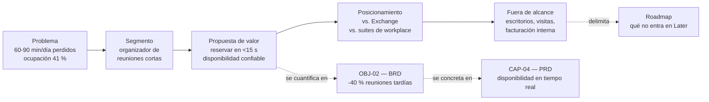

# Vision Document — `DOC-VISION`

## Resumen ejecutivo

El Vision Document es el documento más corto y más releído de un producto: dos a cinco páginas que fijan por qué existe, para quién, qué problema resuelve y qué se decidió deliberadamente no resolver. Sirve para que quinientas decisiones posteriores —de alcance, de prioridad, de arquitectura— tengan un criterio común contra el cual contrastarse, en lugar de resolverse cada una por la opinión de quien esté en la sala.

Su lector no es el desarrollador que busca cómo implementar algo, sino cualquiera que necesite decidir si algo pertenece al producto. Un buen Vision Document se cita en discusiones; uno pobre se archiva el día que se aprueba.

Es propiedad de `ACT-01`, con consulta obligada de `ACT-08` —quien conoce al usuario— y de `ACT-03`, cuya lectura temprana evita que la visión prometa lo estructuralmente imposible.

---

## Definición

### Qué es

Un enunciado razonado del propósito de un producto, dirigido a todos los involucrados y escrito en lenguaje de negocio y de usuario. Fija cinco cosas: el problema, quién lo sufre, la propuesta de valor, el posicionamiento frente a las alternativas existentes y las fronteras del alcance.

Su rasgo distintivo es la **estabilidad**. Todo lo demás en `FAM-VIS` se revisa por trimestre o por release; la visión se revisa por año, y cuando cambia es porque el negocio cambió, no porque el equipo aprendió un detalle. Esa estabilidad es lo que la vuelve utilizable como criterio: un patrón de medida que se mueve no mide.

### Qué problema resuelve

Resuelve la deriva de alcance por acumulación de pedidos razonables. Cada solicitud aislada tiene su lógica; el problema aparece cuando el producto acepta veinte de ellas y deja de ser reconocible. La visión no rechaza pedidos por sí sola, pero convierte el rechazo en un argumento verificable —«esto sirve a un segmento que declaramos fuera de alcance»— en lugar de una preferencia personal.

Resuelve también el problema de la motivación distribuida. Un equipo que sabe qué problema humano está resolviendo toma mejores decisiones de detalle que uno que solo conoce la lista de tareas, porque puede resolver la ambigüedad hacia el lado correcto sin preguntar.

### Qué NO es

No es un documento de requisitos. Si contiene la palabra «el sistema deberá», está invadiendo el SRS. No es un plan: no lleva fechas, esfuerzos ni secuencia, que son del [Roadmap](Roadmap.md). No es un caso de negocio con cifras: la justificación económica es del [BRD](BRD.md). No es una descripción de funcionalidades: enumerar pantallas en un documento de visión es el síntoma más frecuente de que el autor no tenía visión y llenó el espacio con lo que sí sabía.

Tampoco es material de marketing. Comparten el vocabulario del beneficio, pero el marketing persuade a un comprador y la visión guía a un equipo, lo que exige una propiedad que el marketing evita: decir en voz alta qué **no** se va a hacer.

### Con qué se lo confunde

La confusión Vision / BRD / PRD es la más costosa de esta familia, y persiste porque los tres hablan del mismo producto en registros contiguos. La separación operativa es por **pregunta** y por **temporalidad de la respuesta**:

| | Vision Document | BRD | PRD |
|---|---|---|---|
| Pregunta | ¿Por qué existe y para quién? | ¿Qué gana el negocio y qué cuesta? | ¿Qué debe hacer el producto? |
| Unidad de contenido | Problema, segmento, propuesta de valor | Objetivo de negocio medible, restricción | Capacidad de producto con criterio de éxito |
| Cambia cuando | Cambia el negocio o el segmento | Cambia la justificación económica o regulatoria | Se aprende del uso real |
| Frecuencia de revisión | Anual | Semestral | Por release |
| Lo firma | `ACT-01` con el patrocinador | `ACT-01` con finanzas o dirección | `ACT-01` |
| Falla típica | Se vuelve eslogan | Se vuelve lista de deseos sin números | Se vuelve SRS mal escrito |

Un ejemplo del mismo hecho en los tres registros. Visión: «las salas de reunión de la organización se desaprovechan porque nadie sabe cuáles están libres y el sistema actual castiga al que reserva bien». BRD: «`OBJ-02` — reducir en 40 % las reuniones que empiezan tarde por falta de sala, medido sobre el registro de ocupación, en doce meses». PRD: «`CAP-04` — consulta de disponibilidad en tiempo real, con criterio de éxito: el 90 % de las consultas devuelve resultado en menos de un segundo y la tasa de reservas en conflicto baja de 8 % a 1 %».

Otra confusión frecuente, distinta y más silenciosa: **visión de producto versus visión de arquitectura**. Un documento que declara «seremos cloud-native, event-driven y API-first» no es una visión de producto; es un conjunto de decisiones estructurales que corresponden a `FAM-ARQ` y que, presentadas como visión, se vuelven inatacables porque nadie discute una visión. Es un mecanismo habitual para blindar decisiones técnicas de la revisión que merecen.

---

## Aplicación por escenario

| Escenario | ¿Aplica? | Naturaleza | Quién lo produce | Riesgo característico |
|-----------|----------|-----------|------------------|----------------------|
| `ESC-1` Desarrollo nuevo | Sí, es el primer documento | Prescriptiva: compromete | `ACT-01` con `ACT-08` | Escribir una visión genérica que serviría para cualquier producto |
| `ESC-2` Migración | Sí, pero acotada | Prescriptiva sobre el destino | `ACT-01` con `ACT-03` | Confundir la visión del producto con el objetivo del proyecto de migración |
| `ESC-3` Evaluación con código | Sí, reconstruida | Inferencial sobre la intención | `ACT-02` con `ACT-10` | Atribuir al equipo original una intención que nunca tuvo |
| `ESC-4` Evaluación externa | Sí, y es de lo más accesible | Mixta: declarado + observado | `ACT-02` | Tomar el material de marketing como visión real |

### `ESC-1` — Desarrollo de software nuevo

Es el escenario donde el documento nace, y donde se decide su calidad. Se escribe antes que nada porque todo lo demás se justifica contra él, y se escribe corto porque en ese momento la mayor parte del conocimiento del producto todavía no existe: una visión de veinte páginas escrita en la semana uno es en su mayoría invención.

La disciplina que más rinde acá es escribir primero la sección de **fuera de alcance**. Es contraintuitivo y es eficaz: obliga a delimitar antes de entusiasmarse, y produce el único contenido de la visión que sirve para rechazar cosas.

### `ESC-2` — Migración

La visión del producto rara vez cambia en una migración; lo que aparece es un documento distinto que suele redactarse con el mismo nombre y no debería. El producto sigue siendo el sistema de reservas de salas y su visión sigue siendo la misma; lo que se necesita es un enunciado del **objetivo de la migración**: por qué se cambia de plataforma, qué mejora habilita, qué se acepta perder. Ese enunciado pertenece al [BRD](BRD.md) de la migración.

El Vision Document sí se toca cuando la migración es la excusa para ampliar el producto, que es lo habitual. Ahí conviene ser explícito y separar: lo que es paridad no toca la visión; lo que es producto nuevo la modifica y hay que decirlo, porque de esa distinción depende el criterio de terminación de la migración.

### `ESC-3` — Evaluación con acceso al código

El documento se reconstruye, y el ejercicio es más informativo de lo que parece. La visión implícita de un sistema se lee en dónde invirtió esfuerzo: qué módulos tienen pruebas, qué flujos están pulidos, qué entidades del modelo de datos tienen más atributos y más historia de migraciones. Un sistema de reservas cuyo módulo de facturación tiene tres veces más código y pruebas que el de reservas está diciendo algo sobre lo que su equipo consideró el producto.

La regla de `ESC-3` se aplica con severidad: cada afirmación con su evidencia, y la intención declarada separada de la observada. Cuando existe un Vision Document histórico, la brecha entre él y lo construido es el hallazgo principal, no un dato secundario.

### `ESC-4` — Evaluación solo desde afuera

Es el único artefacto de esta guía que un producto suele **publicar** sobre sí mismo: la página de inicio, el «about», el material de posicionamiento y los precios contienen la visión declarada, y las notas de versión contienen la practicada. La confianza alcanzable es alta para el posicionamiento declarado y media para el real, que se infiere del contraste entre lo que dicen y dónde invierten.

La trampa es la que el marco ya señala para este escenario: el material de marketing describe la visión que el producto quiere proyectar. Un producto que se presenta como «plataforma de gestión del espacio de trabajo» y cuyas últimas doce notas de versión hablan solo de integraciones con calendarios corporativos tiene una visión declarada amplia y una practicada estrecha. Ambas se documentan, marcadas.

### Qué cambia según el contexto

En `CTX-1` el usuario cuya necesidad se enuncia es una persona, y la visión puede y debe describir la experiencia que se persigue —cuánto tarda reservar, qué fricción se elimina—. En `CTX-2` el usuario es otro equipo o sistema, y la propuesta de valor se enuncia en términos de integración: qué le cuesta hoy a un consumidor hacer esto sin el servicio. Una visión de backend escrita en lenguaje de usuario final desorienta a su audiencia real, que son los equipos que van a integrar.

En `CTX-3` conviene una precaución: la visión de producto es una sola aunque el sistema tenga dos mitades. Escribir «visión del frontend» y «visión del backend» es la forma más temprana de romper la traza vertical que [`CTX-3`](../00-Marco-de-Referencia/Contextos.md#ctx-3--fullstack) señala como su riesgo dominante.

---

## Ejemplos concretos

### Contexto del ejemplo

Datos sintéticos. Organización de 850 empleados en tres sedes, 47 salas de reunión, sistema actual basado en un calendario compartido de Exchange sin control de conflictos. El producto a construir es una aplicación fullstack (`CTX-3`) con interfaz Blazor *interactive server* y servicios ASP.NET Core, más un cliente MAUI para el uso desde el pasillo.

### Enunciado de visión — versión pobre

> Ser la plataforma líder de gestión inteligente de espacios corporativos, ofreciendo a nuestros usuarios una experiencia moderna, intuitiva y eficiente que optimice la utilización de recursos mediante tecnología de vanguardia.

No se puede rechazar ningún pedido con este texto, no identifica a nadie en particular, y sirve igual de bien para un software de estacionamientos. Cinco adjetivos y ningún hecho.

### Enunciado de visión — versión buena

> **Problema.** En las tres sedes se pierden entre 60 y 90 minutos diarios de reuniones que empiezan tarde o se mueven de sala. La causa no es escasez —la ocupación media es del 41 %— sino falta de información confiable en el momento de decidir: el calendario compartido muestra reservas que nadie canceló y no muestra las salas realmente libres.
>
> **A quién le pasa.** Principalmente a quien organiza reuniones cortas y no planificadas (el 68 % de las reservas duran menos de 45 minutos y se hacen con menos de dos horas de anticipación). Secundariamente, a Facilities, que no puede justificar decisiones de espacio sin datos de uso real.
>
> **Propuesta de valor.** Que reservar una sala disponible desde el pasillo tome menos de quince segundos y que la reserva sea confiable: si el sistema la muestra libre, está libre. La liberación automática de salas no ocupadas devuelve al pool la capacidad que hoy se pierde en reservas fantasma.
>
> **Posicionamiento.** Frente al calendario de Exchange, que es gratuito y ya está instalado, este producto aporta lo que aquel no puede: conflicto imposible por diseño, liberación automática por sensor de presencia y datos de ocupación real. Frente a las plataformas comerciales de *workplace management*, renuncia deliberadamente a la gestión de escritorios, visitas y catering para mantener el costo por empleado por debajo del umbral que Finanzas aprueba sin comité.
>
> **Fuera de alcance en este horizonte.** Reserva de escritorios individuales. Gestión de visitantes. Facturación interna entre centros de costo. Integración con control de acceso físico. Uso por parte de personas externas a la organización.
>
> **Qué haría falsa esta visión.** Si la medición de ocupación muestra que el problema real es escasez y no información, el producto correcto es otro: uno de asignación y priorización, no de visibilidad.

La última línea es la que más rinde y la que casi nunca aparece. Una visión que no declara qué evidencia la refutaría no es una hipótesis sino una creencia, y no se puede revisar de forma ordenada.

### Cómo se encadena con el resto



### Prueba de utilidad, con un caso real de decisión

Seis semanas después de aprobada la visión, Recursos Humanos pide que el sistema gestione también la reserva de los dos autos de la empresa. El pedido es razonable, el esfuerzo es bajo y el solicitante tiene peso político.

Con la visión anterior, la conversación es corta: el problema declarado es de información sobre salas, el segmento es quien organiza reuniones cortas, y los recursos no-sala están fuera de alcance por decisión registrada. Si RR. HH. quiere cambiar eso, lo que corresponde no es agregar una funcionalidad sino modificar la visión, que tiene un firmante y un proceso de revisión. Ese desplazamiento del debate —de «¿hacemos esta feature?» a «¿cambiamos el producto?»— es el rendimiento concreto del documento.

---

### El mismo producto en los tres contextos

La visión no cambia de estructura entre contextos, pero sí cambia quién aparece en la sección de segmento y cómo se enuncia la propuesta de valor. Sobre el mismo caso de reservas:

| Sección | `CTX-1` — cliente MAUI para el pasillo | `CTX-2` — servicio de reservas para otros sistemas | `CTX-3` — el producto completo |
|---------|--------------------------------------|--------------------------------------------------|-------------------------------|
| Quién sufre el problema | El empleado que busca sala con la reunión ya empezando | El equipo de Facilities Analytics, que hoy exporta datos a mano | Ambos, y la organización que pierde tiempo |
| Propuesta de valor | Reservar en menos de quince segundos sin abrir el portátil | Consultar y reservar programáticamente con garantía de no solapamiento | Que la reserva de una sala deje de ser un problema |
| Posicionamiento contra | Abrir Outlook en el móvil | Exportaciones manuales y consultas directas a la base | El calendario compartido actual |
| Métrica de nivel visión | Tiempo desde que se abre la app hasta la confirmación | Equipos integrados sin soporte del equipo dueño | Minutos de reunión perdidos por semana |

El error que esta tabla previene es escribir una visión de `CTX-2` en lenguaje de usuario final. Un servicio cuya visión habla de «experiencia intuitiva» no le sirve a su audiencia real, que son los equipos que deben decidir si integrarse; lo que esos equipos necesitan saber es qué les cuesta hoy hacer esto sin el servicio.

---

## Preguntas guía

- ¿Un lector que no participó de la discusión puede decidir, leyendo esto, si un pedido concreto pertenece al producto?
- ¿La visión nombra un problema observable con magnitud, o solo una aspiración?
- ¿Está escrito qué evidencia demostraría que esta visión es incorrecta?
- ¿La sección de fuera de alcance contiene cosas que alguien realmente pidió, o solo cosas obvias que nadie pediría?
- ¿Este texto serviría igual para el producto de un competidor? Si sí, no dice nada.
- ¿Quién lo firma, y esa persona puede sostener el problema y el segmento ante quien paga?
- ¿Cuándo se revisó por última vez, y qué cambió entonces?

---

## Criterios de calidad

### Buena versión

Cabe en cinco páginas y se lee en diez minutos. Nombra el problema con una magnitud medida o estimada de forma explícita. Identifica un segmento concreto en lugar de «los usuarios». Se posiciona contra alternativas reales, incluida la alternativa de no hacer nada, que en productos internos suele ser la competencia más fuerte. Declara fuera de alcance cosas plausibles. Es citable: contiene frases que alguien puede reproducir en una discusión para zanjarla.

### Versión pobre

Sustituye hechos por adjetivos. Confunde el producto con la tecnología. Enumera funcionalidades. No dice qué queda afuera, o solo excluye lo absurdo. No tiene dueño identificable ni fecha de revisión. Fue escrita una vez, aprobada en una reunión y nunca vuelta a abrir, que es la condición terminal: un documento de visión que no se cita no está cumpliendo su única función.

### Antipatrones frecuentes

**Visión-eslogan.** Una frase de marketing en lugar de un razonamiento. Se detecta preguntando qué pedido concreto permite rechazar; si la respuesta es ninguno, es un eslogan.

**Visión-catálogo.** Lista de módulos previstos. Se produce cuando el autor no tenía una tesis sobre el problema y llenó el documento con lo que sabía.

**Visión-arquitectura.** El conjunto de decisiones técnicas presentado como propósito de producto, con el efecto de volverlas incuestionables. Pertenecen a `FAM-ARQ` y a los ADR, donde se discuten con alternativas.

**Visión retroactiva.** En `ESC-3`, escribir la visión que explica elegantemente el sistema que se encontró. Es cómoda y es falsa: presenta como intención lo que fue acumulación.

**Visión sin fecha de caducidad.** Sin `last_review` ni condición de refutación, envejece sin que nadie lo note, y el equipo sigue optimizando contra un problema que ya no es el problema.

**Visión por comité.** Cada área agrega su párrafo, nada se quita, y el resultado no excluye nada porque excluir requiere que alguien pierda. Se reconoce por su longitud: las visiones largas casi siempre son negociadas, no razonadas.

### Prueba rápida de calidad

Cuatro comprobaciones que se hacen en cinco minutos y detectan la mayoría de los defectos:

**Prueba de la negación.** Invertir cada afirmación de la visión. Si la versión invertida es absurda —«queremos que reservar una sala sea lento y poco confiable»— la afirmación original no aportaba información. Si la versión invertida es una posición defendible que otro producto podría sostener, la afirmación sí decide algo.

**Prueba de la sustitución.** Reemplazar el nombre del producto y del dominio por los de otro. Si el texto sigue teniendo sentido, es genérico.

**Prueba del rechazo.** Tomar tres pedidos reales que llegaron en el último mes y aplicar la visión. Si no permite rechazar ninguno ni aceptar ninguno con argumento, no está funcionando como criterio.

**Prueba de la cita.** Buscar en las actas y los hilos del último trimestre si alguien citó el documento. Un Vision Document que nunca se cita puede ser correcto y aun así ser inútil.

---

## Anexo — Plantilla comentada

```markdown
---
doc_id: DOC-VISION-<producto>
doc_type: tema
title: Vision Document — <producto>
status: vigente | borrador | obsoleto
origin: human | ia-assisted | ia-generated
confidence: alta | media | baja        # solo si origin != human
owner: <persona, no rol abstracto: es quien lo sostiene ante el patrocinador>
last_review: AAAA-MM-DD
audience: [humano, agente]
traces: [DOC-BRD-..., DOC-PRD-...]
---

# Visión — <producto>

## 1. Problema
¿Qué le pasa hoy a alguien, con qué frecuencia y con qué costo?
Exigencia: al menos una magnitud, aunque sea estimada. Si es estimada, decir cómo.
Prohibido: describir la solución acá.

## 2. Quién lo sufre
¿Qué segmento concreto? ¿Cuántos son? ¿Qué hacen hoy para arreglárselas?
La alternativa actual —aunque sea una planilla— es el competidor real.

## 3. Propuesta de valor
¿Qué cambia para esa persona cuando el producto existe?
Redactar en términos del resultado que obtiene, no de las funciones que usa.

## 4. Posicionamiento
¿Contra qué compite, incluida la opción de no hacer nada?
¿Qué hace este producto que la alternativa no puede hacer, y a cambio de qué renuncia?

## 5. Fuera de alcance
¿Qué se decidió no hacer, aunque alguien lo haya pedido o lo vaya a pedir?
Regla: si ningún ítem de esta lista genera resistencia, la lista no sirve.

## 6. Principios de decisión                 # opcional, alto rendimiento
Dos o tres reglas para resolver disyuntivas sin escalar.
Ej.: «ante duda entre velocidad de reserva y completitud del formulario, gana velocidad».

## 7. Qué haría falsa esta visión
¿Qué evidencia obligaría a reescribir este documento?
Sin esta sección, la visión no es revisable: es una creencia.

## 8. Métricas de la visión                  # 2 o 3, no más
Indicadores de nivel de propósito, no de funcionalidad.
El detalle medible vive en el BRD (OBJ-*) y en el PRD.

## 9. Vigencia
- Próxima revisión: AAAA-MM-DD
- Firmante: <persona> — <rol>
- Historial de cambios sustantivos: qué cambió, cuándo, por qué evidencia
```

Los campos 5 y 7 son los que distinguen un Vision Document de una presentación de producto. Si el tiempo alcanza solo para tres secciones, que sean problema, fuera de alcance y condición de refutación: con esas tres, el documento ya sirve para decidir.
