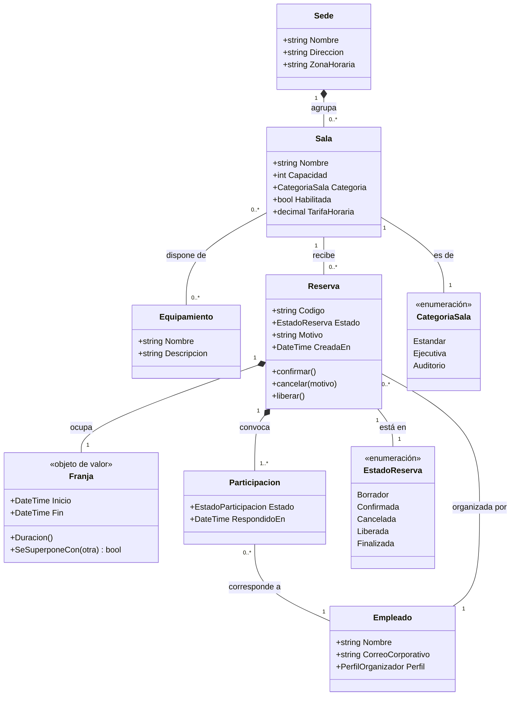
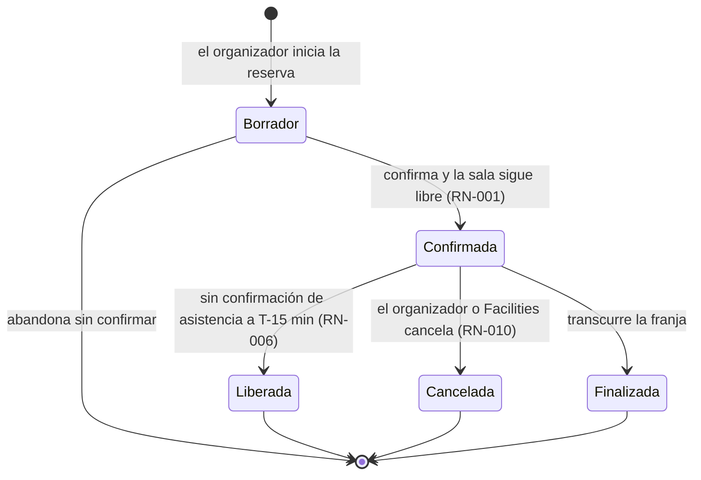

# Modelo de dominio

## Resumen ejecutivo

El modelo de dominio fija de qué habla el sistema: qué conceptos existen en el negocio, cómo se llaman, qué significan exactamente y cómo se relacionan entre sí. Es el vocabulario compartido del que dependen el SRS, la interfaz, la API y la base de datos, y su ausencia produce el defecto más silencioso de un proyecto: tres documentos correctos por separado que nombran la misma cosa de tres maneras distintas.

No es un diseño de datos ni un diseño de software. Un concepto puede estar en el modelo de dominio y no persistirse; una tabla puede existir por razones puramente técnicas y no representar ningún concepto del negocio. Confundir los tres artefactos —modelo de dominio, modelo de datos y diagrama de clases— es tan frecuente que la sección de definición se dedica en buena medida a separarlos.

Su lector principal es el equipo entero, y su prueba de utilidad es conversacional: si al discutir un requisito con alguien del negocio ambos usan los mismos términos con el mismo significado, el modelo está haciendo su trabajo.

---

## Definición

### Qué es

Una representación de los conceptos del dominio del problema, sus atributos significativos, sus relaciones y las restricciones que los gobiernan. Se compone de dos partes inseparables: el **glosario**, que define cada término en prosa con precisión suficiente para resolver discusiones, y el **diagrama**, que muestra la estructura de relaciones. El glosario sin diagrama deja las relaciones implícitas; el diagrama sin glosario deja los significados a interpretación de cada lector.

El marco conceptual más útil para construirlo es el de **Eric Evans**, *Domain-Driven Design: Tackling Complexity in the Heart of Software* (2003), del que esta guía toma cuatro nociones:

**Lenguaje ubicuo.** Un único vocabulario usado por el negocio, por la documentación y por el código, sin traducciones intermedias. Si el negocio dice «franja» y el código dice `TimeSlot` y la base dice `Periodo`, hay tres lenguajes y cada frontera entre ellos es un lugar donde se pierde significado. El compromiso del lenguaje ubicuo es fuerte: cuando el término del negocio cambia, cambia también el nombre de la clase.

**Entidad.** Un concepto con identidad propia que persiste a través del cambio de sus atributos. Una `Reserva` sigue siendo la misma reserva aunque cambien su horario y sus asistentes; se distingue por su identidad, no por sus valores.

**Objeto de valor.** Un concepto definido enteramente por sus atributos, sin identidad propia e intercambiable con otro de iguales valores. Una `Franja` de 10:00 a 11:00 es idéntica a cualquier otra franja de 10:00 a 11:00; no tiene sentido preguntar cuál es. Los objetos de valor son inmutables y son el lugar natural donde viven las reglas de consistencia interna —una franja cuyo fin no es posterior a su inicio no debería poder existir.

**Agregado.** Un grupo de entidades y objetos de valor que se trata como una unidad de consistencia, con una entidad raíz que es el único punto de acceso desde afuera. El agregado define qué invariantes se garantizan de manera transaccional. En el sistema de reservas, `Reserva` es raíz de un agregado que incluye sus participaciones; `Sala` es raíz de otro. Esa frontera decide después cuestiones muy concretas de implementación, como qué se carga junto y dónde se aplica el control de concurrencia.

### Qué problema resuelve

Resuelve la ambigüedad terminológica antes de que se vuelva estructural. En un sistema de reservas, la pregunta «¿qué es una reserva cancelada?» parece trivial hasta que se descubre que Facilities entiende que la sala queda libre inmediatamente, Administración entiende que sigue generando costo si se canceló con menos de dos horas y el equipo de desarrollo entiende que es una fila con un campo de estado. Las tres lecturas conviven sin conflicto mientras nadie las escriba juntas.

Resuelve además un problema de descubrimiento: el ejercicio de modelar obliga a preguntar por conceptos que nadie mencionó. Si en el diagrama aparece que una `Reserva` tiene un organizador y varios asistentes, surge naturalmente la pregunta de si el organizador es también asistente, qué pasa si se va de la empresa y si puede transferir la reserva. Cada una de esas preguntas es un requisito que se estaba por olvidar.

### Qué NO es, y con qué se lo confunde

Tres artefactos usan notación parecida y responden preguntas distintas. La confusión entre ellos es el error más caro de esta familia porque no se nota: el documento parece correcto, y lo que falla es que está respondiendo otra pregunta.

| Dimensión | Modelo de dominio | Modelo de datos | Diagrama de clases |
|-----------|-------------------|-----------------|--------------------|
| Pregunta | ¿De qué conceptos habla el negocio? | ¿Cómo se persiste la información? | ¿Cómo se estructura el código? |
| Familia | `FAM-ANA` análisis | `FAM-DIS` diseño | `FAM-DIS` diseño |
| Dueño | `ACT-02` Analista | `ACT-04` con `ACT-03` | `ACT-04` Desarrollador |
| Vocabulario | Del negocio | De la base de datos | Del lenguaje y los patrones |
| Contiene | Conceptos, relaciones, invariantes | Tablas, columnas, tipos, índices, claves | Clases, interfaces, métodos, dependencias |
| No contiene | Claves foráneas, tipos SQL, métodos | Conceptos sin persistencia | Nada del negocio que no se implemente |
| Notación | `classDiagram` de UML, sin operaciones | Entidad-relación, DBML, DDL | `classDiagram` completo de UML |
| Cambia cuando | Cambia el negocio | Cambia la estrategia de persistencia | Cambia la implementación |

Los ejemplos concretos son más rápidos que la tabla. Una tabla `ReservaAuditoria` con el historial de cambios existe en el modelo de datos y no en el de dominio, porque no es un concepto del que el negocio hable: es un mecanismo. Una tabla intermedia `ReservaAsistente` con dos claves foráneas resuelve una relación de muchos a muchos y no representa ningún concepto, salvo que el negocio distinga la participación como algo con vida propia —con estado de aceptación, por ejemplo—, en cuyo caso sí es una entidad del dominio y el modelo debe nombrarla. Un `ReservaRepository` es una clase del diseño y no tiene lugar alguno en el dominio. Una `Sala` en desuso que el negocio llama «dada de baja» es un concepto de dominio con un estado, mientras que el borrado lógico mediante una columna `EliminadoEn` es una decisión de persistencia.

La regla práctica para separar los tres: si al mostrarle el diagrama a alguien de Facilities entiende todo lo que ve, es modelo de dominio. Si necesita que le expliquen qué es una clave foránea, es modelo de datos. Si necesita que le expliquen qué es una interfaz, es un diagrama de clases.

**Tampoco es el modelo de dominio un diagrama entidad-relación con otro nombre.** La diferencia no está en la notación sino en el criterio de inclusión: el modelo de dominio incluye conceptos que no se persisten —un `PeriodoDeGracia` puede ser una noción central del negocio y no tener tabla— y excluye estructuras que solo existen por razones de almacenamiento.

**No es un modelo de implementación de DDD.** Se pueden usar entidades, objetos de valor y agregados como herramientas conceptuales sin adoptar la arquitectura hexagonal, sin repositorios y sin eventos de dominio. El modelo describe el negocio; qué se hace después con esa descripción es decisión del arquitecto.

---

## Aplicación por escenario

| Escenario | Naturaleza del modelo | Fuente principal | Confianza alcanzable | Riesgo dominante |
|-----------|----------------------|------------------|---------------------|------------------|
| `ESC-1` | Prescriptiva: fija el vocabulario que el equipo se obliga a usar | Talleres con el negocio, PRD | Alta | Modelar la solución en lugar del problema |
| `ESC-2` | Doble: describe el dominio real y lo depura para el destino | Sistema origen más negocio actual | Alta | Arrastrar conceptos que solo existían por limitaciones de la plataforma vieja |
| `ESC-3` | Reconstructiva: inferida de la evidencia | Esquema, código, interfaz | Media a alta | Copiar el modelo de datos y llamarlo dominio |
| `ESC-4` | Inferencial: hipótesis desde la superficie | Interfaz, URLs, mensajes, documentación pública | Media | Confundir la organización de la navegación con el modelo conceptual |

### `ESC-1` — Desarrollo nuevo

El modelo se construye en talleres con el negocio y se corrige en cada iteración del SRS. Un procedimiento que funciona: se recorre el enunciado de los requisitos subrayando los sustantivos, se agrupan los sinónimos y se lleva la lista al negocio con una pregunta por cada agrupación. «Acá dice a veces "solicitud" y a veces "pedido de reserva": ¿son lo mismo? Si son lo mismo, ¿cuál nombre usan ustedes?» El resultado de esa conversación es el lenguaje ubicuo, y su valor no está en el diagrama sino en las tres o cuatro distinciones que aparecen cuando el negocio explica por qué usa dos palabras.

Estabilizar el modelo antes de que el equipo empiece a nombrar clases es una economía significativa. Renombrar un concepto en el mes uno cuesta una búsqueda y reemplazo; en el mes ocho involucra migraciones de base de datos, contratos de API publicados y documentación de usuario.

El error característico del escenario es modelar la solución. Aparecen en el diagrama conceptos como `ReservaDTO`, `ReservaService` o `EstadoManager`, que son artefactos de la implementación imaginada por quien modela. La pregunta que los filtra: ¿alguien de Facilities usaría esta palabra en una reunión?

### `ESC-2` — Migración

Hay un modelo de dominio real —el que el sistema en producción encarna— y uno deseable. La tarea es reconstruir el primero y decidir explícitamente en qué se aparta el segundo, porque una migración es la única oportunidad barata de corregir un vocabulario torcido, y también la ocasión perfecta para arruinar el proyecto intentando corregirlo todo a la vez.

La distinción que ordena el trabajo es entre conceptos del negocio y conceptos que solo existen por limitaciones de la plataforma de origen. Si el sistema viejo tiene una entidad `ReservaTemporal` porque el framework no permitía transacciones largas y hubo que materializar un estado intermedio, esa entidad no pertenece al dominio y no debe migrarse; su presencia en el destino perpetúa una restricción que ya no existe. En cambio, si `ReservaTemporal` corresponde a una reserva provisional que el negocio efectivamente maneja y que caduca sola, es dominio puro y el destino debe conservarla.

Cada cambio de vocabulario que se decida aprovechando la migración necesita una entrada en la tabla de equivalencias, con el término viejo, el nuevo y el motivo. Sin esa tabla, quien lea la documentación de origen dentro de dos años no podrá relacionarla con el sistema que tiene enfrente.

### `ESC-3` — Evaluación con acceso al código

El modelo se reconstruye y se marca lo inferido. El orden importa, porque cada fuente aporta un tipo distinto de información y algunas mienten con más facilidad que otras.

1. **El esquema de la base de datos** da el inventario más completo de conceptos candidatos y, sobre todo, las relaciones y las restricciones. Un índice único revela una regla de identidad; una clave foránea no nula revela una dependencia existencial. Es la fuente más rica y la más engañosa, porque contiene tanto conceptos del negocio como estructuras técnicas —tablas de auditoría, colas, tablas de configuración, tablas de correlación— que hay que descartar conscientemente.
2. **Las clases de dominio del código**, si el sistema las tiene separadas de las de acceso a datos. Sus nombres suelen estar más cerca del lenguaje del negocio que los de las tablas, que arrastran convenciones de bases antiguas y abreviaturas.
3. **Las etiquetas de la interfaz y los textos de usuario**. Son la fuente más confiable sobre cómo se llama cada cosa en el negocio, porque son lo que los usuarios leen todos los días. Cuando la tabla se llama `Booking` y la pantalla dice «Reserva», el término del negocio es «Reserva».
4. **Los enumerados y las máquinas de estado**. Un `enum EstadoReserva { Borrador, Confirmada, Cancelada, Liberada, Vencida }` es un fragmento de modelo de dominio ya escrito, y sus transiciones válidas son invariantes que conviene extraer.
5. **Las validaciones y las restricciones**, que aportan las invariantes del modelo.
6. **Las entrevistas**, si hay alguien disponible, para resolver las ambigüedades que la evidencia dejó abiertas.

El método de marcado es el mismo que el del SRS reconstruido: `[OBS]` para lo que la evidencia sostiene directamente, `[INF]` para lo inferido de un patrón, `[NV]` para lo afirmado sin verificar. Un ejemplo del tipo de anotación que hace útil un modelo reconstruido:

> `[INF]` `Participacion` parece ser una entidad y no una simple relación: la tabla `ReservaAsistente` tiene columnas `Estado` y `RespondidoEn` (`schema.sql:210-218`), lo que sugiere que el negocio distingue el hecho de haber sido invitado del de haber aceptado. **No verificado**: no se encontró código que use esos campos para decidir nada, por lo que la distinción podría estar en desuso.

El antipatrón del escenario es tomar el esquema de la base, dibujarlo con otro estilo y presentarlo como modelo de dominio. El producto resultante hereda todas las decisiones de persistencia —tablas puente, borrados lógicos, desnormalizaciones— y no aporta lo único que el modelo de dominio debía aportar, que es el vocabulario del negocio depurado de la implementación.

### `ESC-4` — Evaluación solo desde afuera

Hay más señal de la que parece, y el modelo alcanza confianza media si se construye con método.

Las **URLs** exponen la jerarquía de conceptos con notable fidelidad: `/espacios/{id}/reservas/{id}/asistentes` declara tres entidades y dos relaciones de composición. Los **formularios** exponen atributos, obligatoriedad y rangos; un campo «Capacidad máxima» con valor mínimo 1 es un atributo con su invariante. Los **filtros y ordenamientos** de un listado exponen qué atributos el negocio considera significativos. Los **desplegables de estado** exponen enumerados completos. Los **mensajes de error** exponen invariantes: «La franja debe terminar después de comenzar» es una regla del objeto de valor. Los **informes exportables** suelen exponer el modelo más completo que la interfaz, porque incluyen columnas que las pantallas no muestran. La **documentación de la API pública**, si existe, es la fuente de mayor confianza disponible en este escenario.

El límite es que la superficie no distingue entidad de objeto de valor, ni revela fronteras de agregado: ambas cosas son decisiones internas sin manifestación externa confiable. Un modelo de `ESC-4` honesto enumera conceptos y relaciones, y declara que la clasificación entre entidad y objeto de valor es hipótesis. Y registra siempre la fecha y la versión del producto observado, porque sin eso el trabajo no es reproducible.

### Variaciones por contexto

En **`CTX-1`** el modelo de dominio compite con un modelo implícito que ya existe: el que la navegación de la aplicación sugiere. Cuando el menú principal tiene «Salas», «Mis reservas» y «Aprobaciones», el usuario deduce que esos son los conceptos, y si el modelo de dominio dice otra cosa, gana el menú. Conviene revisar explícitamente la coherencia entre la estructura de navegación y el modelo. En clientes MAUI con MVVM aparece una tentación específica: modelar los ViewModels como si fueran el dominio. El ViewModel es una proyección para una pantalla; puede combinar dos conceptos o mostrar solo tres atributos de siete, y esas decisiones no pertenecen al modelo de dominio.

En **`CTX-2`** el modelo es la referencia del contrato de la API. Los recursos de una API REST bien diseñada corresponden a conceptos del dominio, y cuando no lo hacen —recursos que agrupan por conveniencia del cliente, endpoints con nombres de operación— conviene registrar por qué. El modelo también determina la granularidad de los eventos publicados: `ReservaConfirmada` es un evento de dominio; `FilaReservaActualizada` es un evento de base de datos disfrazado.

En **`CTX-3`** el modelo es la pieza que sostiene la traza vertical, y su exigencia específica es la coherencia de nombres de punta a punta. La comprobación es mecánica y conviene hacerla periódicamente: tomar cinco conceptos del modelo y verificar cómo se llaman en la interfaz, en el contrato de la API, en el código y en el esquema. Cada divergencia se resuelve renombrando o se registra explícitamente como alias del término canónico en el glosario. Un alias declarado es aceptable; uno tácito es deuda.

---

## Ejemplos concretos

### Diagrama del sistema de reserva de salas



Cuatro decisiones del diagrama merecen explicación, porque son exactamente las que un modelo pobre deja sin tomar.

`Franja` es **objeto de valor** y no entidad: no tiene identidad, es inmutable y encapsula la invariante de que el fin debe ser posterior al inicio. Modelarla como par de columnas `FechaInicio` y `FechaFin` sobre `Reserva` sería adecuado para el modelo de datos y una pérdida en el de dominio, porque el negocio habla de franjas y la operación «se superpone con» pertenece conceptualmente a la franja, no a la reserva.

`Participacion` es **entidad** y no una simple relación de muchos a muchos, porque tiene estado propio: un empleado convocado puede aceptar, rechazar o no responder, y esa distinción importa al negocio. Si el sistema no distinguiera esos estados, la relación sería directa entre `Reserva` y `Empleado` y `Participacion` no existiría. La decisión no es de modelado abstracto: la toma el negocio al responder si le interesa saber quién aceptó.

Las **fronteras de agregado** son dos. `Reserva` es raíz de un agregado que comprende su `Franja` y sus `Participacion`: todo eso se crea, se modifica y se valida junto, y la invariante «los asistentes no superan la capacidad de la sala» se garantiza dentro de esa transacción. `Sala` es raíz de otro agregado, con su `Equipamiento`. La consecuencia práctica es que la regla `RN-001`, que involucra dos agregados `Reserva` distintos, no se puede garantizar con una invariante interna y necesita un mecanismo explícito de concurrencia; el modelo, al mostrar la frontera, hace visible ese problema antes de que lo descubra la primera reserva duplicada en producción.

`Empleado` es un concepto que el sistema de reservas no gobierna: llega del directorio corporativo. El modelo lo incluye porque el dominio habla de él, y el SRS debe especificar qué atributos son de lectura y qué ocurre cuando un empleado con reservas futuras deja la organización. Los conceptos que se referencian pero no se poseen son una de las fuentes habituales de requisitos olvidados.

### Glosario

El diagrama sin definiciones deja los significados a interpretación. Estas son las entradas que resuelven las discusiones reales del dominio.

| Término | Definición | Alias registrados | Notas |
|---------|-----------|-------------------|-------|
| **Reserva** | Compromiso de uso exclusivo de una sala durante una franja, a nombre de un organizador, con un conjunto de convocados. | `Booking` (esquema legado) | La identidad es el código; sobrevive a los cambios de franja y de asistentes. |
| **Franja** | Intervalo temporal semiabierto `[inicio, fin)` durante el cual se ocupa una sala. Dos franjas contiguas no se superponen. | «horario», «slot» | Objeto de valor. El carácter semiabierto es la definición operativa de `RN-001`. |
| **Sala** | Espacio físico reservable, perteneciente a una sede, con capacidad, categoría y equipamiento. | «espacio» | Una sala deshabilitada no admite reservas nuevas y conserva las ya confirmadas. |
| **Organizador** | Empleado responsable de una reserva: la crea, la modifica, la cancela y responde por el uso de la sala. | «solicitante» | No es necesariamente asistente. La transferencia de organizador es un requisito abierto. |
| **Convocado** | Empleado invitado a una reserva. Su participación tiene estado propio. | «asistente», «participante» | «Asistente» se usa en la interfaz; término canónico: convocado. |
| **Liberación** | Pérdida automática de una reserva confirmada cuya asistencia no fue confirmada en los 15 minutos previos al inicio (`RN-006`). | — | Distinta de cancelación: la liberación es del sistema, la cancelación es de una persona. |
| **Cancelación** | Anulación deliberada de una reserva por parte de su organizador o de Facilities, con registro de autor y motivo. | — | Ver `RN-010`. Puede generar costo según `RN-008`. |
| **Capacidad** | Cantidad máxima de personas que la sala admite, declarada por Facilities. | «aforo» | Es un dato administrativo, no una medición física. |

La distinción entre liberación y cancelación es el ejemplo de por qué el glosario tiene más valor que el diagrama. Ambos conceptos terminan con la sala libre y en el esquema son probablemente dos valores de la misma columna de estado, pero tienen dueños distintos, disparadores distintos y consecuencias económicas distintas. Un equipo que las llame a las dos «baja» va a implementar una sola y a descubrir el problema cuando Administración pregunte por qué se está facturando una sala que el sistema liberó solo.

### Máquina de estados de `Reserva`

Las transiciones válidas son parte del modelo, no del diseño: enuncian qué le puede pasar a una reserva según el negocio.



Que no exista transición de `Cancelada` a `Confirmada` es una afirmación sobre el negocio: rehacer una reserva cancelada es crear una nueva, con código nuevo. Si esa regla se implementa sin haberla enunciado, la primera vez que alguien pida «reactivar» una reserva la discusión será sobre la interfaz en lugar de sobre la política.

### Correspondencia con el modelo de datos

Los dos modelos no coinciden, y la tabla de correspondencia es lo que permite navegar entre ellos. El [modelo de datos](../40-Diseno/Modelo-de-Datos.md) desarrolla el lado físico; acá solo se muestra dónde divergen y por qué.

| Concepto del dominio | Representación en datos | Divergencia |
|---------------------|------------------------|-------------|
| `Reserva` | Tabla `Reserva` | Correspondencia directa |
| `Franja` | Columnas `Inicio`, `Fin` en `Reserva` más índice único con `SalaId` | El objeto de valor se aplana; la invariante de solapamiento se implementa como restricción de índice |
| `Participacion` | Tabla `ReservaConvocado` | Correspondencia directa; existe porque es entidad, no por ser relación N:N |
| `Empleado` | Vista sobre el directorio corporativo | No es tabla propia: el sistema no gobierna el concepto |
| `EstadoReserva` | Columna `Estado` con valores restringidos | Las transiciones válidas no se expresan en el esquema; viven en el dominio |
| — | Tabla `ReservaAuditoria` | Sin contraparte en el dominio: mecanismo derivado de `RNF-009` |
| — | Tabla `EventoPendienteCalendario` | Sin contraparte en el dominio: mecanismo derivado de `RNF-005` |

Las dos últimas filas son las importantes. Ambas tablas existen por requisitos no funcionales y ninguna representa un concepto del que el negocio hable, lo que confirma que el modelo de dominio no puede derivarse mecánicamente del esquema ni al revés.

---

## Preguntas guía

- Si le muestro este diagrama a alguien de Facilities, ¿entiende todo lo que ve? Los términos que necesiten traducción son señal de que el modelo se corrió hacia el diseño.
- ¿Cada concepto se llama igual en la interfaz, en el SRS, en la API, en el código y en el esquema? Donde no, ¿está registrado como alias o es una divergencia no advertida?
- ¿Qué conceptos del diagrama tienen identidad propia y cuáles se definen solo por sus valores? ¿La clasificación la sostiene el negocio o la comodidad de implementación?
- ¿Dónde están las fronteras de agregado, y qué invariante garantiza cada una? Las reglas que cruzan agregados, ¿tienen mecanismo definido?
- ¿Qué concepto del modelo no aparece en ningún requisito? ¿Sobra en el modelo o falta un requisito?
- ¿Hay dos términos para la misma cosa, o el mismo término para dos cosas distintas? El segundo caso es el más peligroso y el más difícil de detectar.
- En `ESC-3` y `ESC-4`: ¿qué parte del modelo es evidencia y qué parte es interpretación? ¿Está marcada?
- ¿Qué conceptos el sistema referencia pero no gobierna, y qué pasa cuando cambian fuera de su control?

---

## Criterios de calidad

### Una buena versión

Un modelo de dominio útil se reconoce porque el equipo lo usa para hablar. Sus términos aparecen en las reuniones, en los nombres de las clases y en los textos de la interfaz sin necesidad de traducción. Contiene glosario y diagrama, y el glosario define cada término con precisión suficiente para resolver una discusión concreta, no con una paráfrasis del nombre —«Reserva: una reserva del sistema» es una entrada inútil.

Distingue entidades de objetos de valor con criterio del negocio, declara las fronteras de agregado y las invariantes que cada una garantiza, y registra los alias en lugar de fingir que no existen. Cabe en una pantalla o se divide en vistas por subdominio; un diagrama con cuarenta clases no lo lee nadie.

Y sobre todo, se mantiene: un modelo cuya última revisión precede a los últimos seis meses de desarrollo describe un sistema que ya no existe.

### Una versión pobre

Es el esquema de la base de datos redibujado. Tiene tablas puente, columnas de auditoría y campos `Activo`. Usa nombres en inglés porque el código está en inglés, mientras el negocio habla en español. Confunde el modelo con el diseño e incluye servicios, repositorios y objetos de transferencia. No tiene glosario, con lo cual cada relación queda a interpretación del lector. Muestra multiplicidades genéricas —todo `1..*`— porque nadie preguntó si una reserva puede existir sin convocados.

El síntoma más claro es que nadie lo cita. Cuando surge una discusión terminológica y ninguno de los participantes piensa en abrir el modelo, el documento existe pero no funciona.

### Antipatrones

| Antipatrón | Cómo se ve | Por qué duele |
|-----------|-----------|---------------|
| **Modelo de datos disfrazado** | Tablas puente, claves foráneas, columnas técnicas en el diagrama | Hereda decisiones de persistencia y no aporta vocabulario de negocio |
| **Modelo anémico de conceptos** | Solo cajas con atributos, sin relaciones ni invariantes | No responde ninguna pregunta que el glosario no responda mejor |
| **Diseño anticipado** | `ReservaService`, `IReservaRepository`, `ReservaDTO` en el modelo | Invade el alcance del arquitecto y del desarrollador |
| **Vocabulario dividido** | El modelo dice «convocado», la interfaz «asistente», la tabla `Attendee` | Cada frontera pierde significado; la traza vertical se rompe |
| **Diagrama gigante** | Cuarenta clases en una sola vista | Nadie lo lee; el modelo deja de usarse aunque sea correcto |
| **Sin fronteras de agregado** | Todo conectado con todo, sin unidad de consistencia | Las reglas que cruzan entidades no tienen dueño ni mecanismo |
| **Multiplicidades por defecto** | `1..*` en todas las relaciones | Oculta preguntas de negocio sin responder |
| **Modelo congelado** | Última revisión anterior a seis meses de desarrollo | Describe un sistema que ya no existe; es información engañosa |
| **Entidad por cada tabla** (`ESC-3`) | `ReservaAuditoria` como concepto del dominio | Confunde mecanismo con negocio |
| **Hipótesis sin marcar** (`ESC-4`) | Clasificar entidad y objeto de valor sin evidencia | Presenta como hallazgo lo que es suposición |

### Revisión

El revisor natural del modelo es el negocio, no el equipo técnico: quien puede detectar que «capacidad» significa otra cosa de la que el analista supuso es Facilities. La revisión técnica la aporta `ACT-03`, que verifica que las fronteras de agregado sean sostenibles, y `ACT-04`, que detecta dónde el modelo va a chocar con la implementación. `ACT-09` verifica que el vocabulario del modelo sea el mismo que el de la documentación de usuario. La aprobación es de `ACT-01`.

---

## Anexo — Plantilla comentada

```markdown
---
doc_id: DOMINIO-<producto>       # ¿De qué sistema es este dominio?
doc_type: tema
title: Modelo de dominio — <producto>
status: borrador | vigente | obsoleto
origin: human | ia-assisted | ia-generated
confidence: alta | media | baja   # obligatorio si origin != human
owner: ACT-02 <nombre>
last_review: AAAA-MM-DD
audience: [humano, agente]
traces: [DOC-SRS, DOC-DATOS]
observado_en: <versión y fecha del producto>   # obligatorio en ESC-3 y ESC-4
---

# Modelo de dominio — <producto>

## 1. Alcance del modelo
<!-- ¿Qué parte del negocio cubre? Si el sistema toca varios subdominios,
     ¿este modelo los abarca todos o solo uno? Un modelo sin límite declarado
     crece hasta volverse ilegible. -->

## 2. Glosario
<!-- Una entrada por concepto. La definición debe alcanzar para resolver una
     discusión: si dice "Reserva: una reserva", no sirve.
     ¿Qué alias circulan en la organización, y cuál es el término canónico? -->

| Término | Definición | Alias | Notas |
|---------|-----------|-------|-------|

## 3. Diagrama conceptual
<!-- classDiagram de Mermaid. Sin operaciones salvo las que el negocio nombre.
     Sin claves foráneas, sin tipos de base de datos, sin clases de infraestructura.
     ¿Las multiplicidades están pensadas una por una, o son 1..* por defecto? -->

## 4. Entidades
<!-- Para cada una: ¿qué la identifica? ¿Qué la mantiene siendo la misma
     cuando sus atributos cambian? ¿Cuál es su ciclo de vida? -->

| Entidad | Identidad | Atributos significativos | Ciclo de vida |
|---------|-----------|-------------------------|---------------|

## 5. Objetos de valor
<!-- ¿Por qué este concepto no tiene identidad? ¿Es intercambiable con otro
     de iguales valores? ¿Qué invariante encapsula? -->

| Objeto de valor | Atributos | Invariante que garantiza |
|-----------------|-----------|-------------------------|

## 6. Agregados
<!-- ¿Qué se modifica junto y debe quedar consistente en la misma transacción?
     ¿Cuál es la raíz, único punto de acceso desde afuera?
     Las reglas que cruzan agregados necesitan mecanismo explícito: ¿está identificado? -->

| Agregado | Raíz | Contiene | Invariantes garantizadas |
|----------|------|----------|-------------------------|

## 7. Máquinas de estado
<!-- Para los conceptos con ciclo de vida relevante.
     ¿Qué transiciones NO existen, y por qué? La ausencia es tan informativa
     como la presencia. -->

## 8. Conceptos externos
<!-- ¿Qué conceptos usa el sistema sin gobernarlos? ¿De dónde vienen,
     qué pasa cuando cambian y qué atributos son de solo lectura? -->

## 9. Correspondencia con otros modelos
<!-- ¿Dónde diverge del modelo de datos y por qué? ¿Qué tablas no representan
     conceptos y qué conceptos no se persisten? -->

## 10. Preguntas abiertas
<!-- ¿Qué distinción del negocio quedó sin resolver? ¿Quién puede responderla? -->

## 11. Evidencia   <!-- solo ESC-3 y ESC-4 -->
<!-- ¿Qué sostiene cada afirmación? Marcar [OBS], [INF] o [NV] por concepto,
     con ruta y rango de líneas, o con la pantalla y la fecha de observación. -->

| Concepto | Marca | Evidencia |
|----------|-------|-----------|
```
