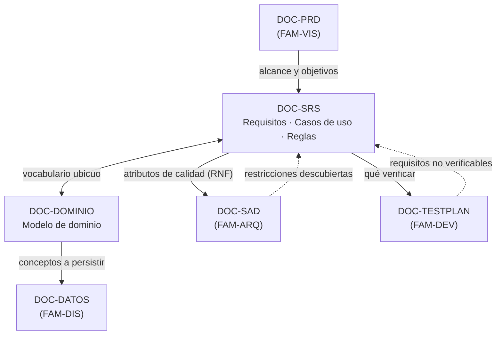

# Documentación de análisis — `FAM-ANA`

## Pregunta que responde la familia

**¿Qué debe hacer el sistema?**

Entre la familia de visión, que responde *por qué construimos esto y para quién*, y la de arquitectura, que responde *cómo se estructura*, hay un tramo que decide el destino del proyecto: convertir una intención de negocio en enunciados que alguien pueda implementar y otro alguien pueda verificar. Ese tramo es el análisis. Su producto no es una lista de deseos ni un diseño anticipado, sino una especificación del comportamiento requerido, con el vocabulario del dominio fijado y las reglas que lo gobiernan escritas de manera que se puedan discutir sin abrir un editor de código.

La familia tiene una propiedad que la distingue del resto: es la única cuyos documentos se leen tanto hacia arriba como hacia abajo. Hacia arriba, el Product Owner comprueba que lo especificado corresponde a lo que pidió. Hacia abajo, arquitectura, diseño y QA los usan como entrada. Un defecto acá se propaga a las tres familias siguientes; un defecto en un LLD se queda en su componente.

---

## Artefactos

| ID | Artefacto | Pregunta específica | Dueño | Archivo |
|----|-----------|--------------------|-------|---------|
| `DOC-SRS` | Software Requirements Specification | ¿Qué debe hacer el sistema, bajo qué reglas y con qué calidad? | `ACT-02` | [SRS.md](SRS.md) |
| `DOC-DOMINIO` | Modelo de dominio | ¿De qué conceptos habla el sistema y cómo se relacionan? | `ACT-02` | [Modelo-de-Dominio.md](Modelo-de-Dominio.md) |

El SRS absorbe deliberadamente dos artefactos que muchas organizaciones mantienen sueltos: los **casos de uso** y las **reglas de negocio**. La decisión no es cosmética. Un caso de uso separado del requisito que lo motiva se desincroniza en tres sprints, y una regla de negocio en una hoja de cálculo aparte termina contradiciendo al requisito que la invoca. Manteniéndolos como secciones internas, la traza `RF- → CU- → RN- → TC-` vive en un solo documento con un solo dueño y una sola fecha de revisión. En organizaciones grandes, donde las reglas de negocio son un activo corporativo compartido por varios sistemas, la separación se justifica; esta guía documenta el caso general.

---

## Relaciones

Las flechas punteadas son las que sostienen la calidad del conjunto. Cuando QA no puede escribir un caso de prueba para `RF-014`, la salida correcta es devolver el requisito al analista, no inventar el comportamiento esperado. Cuando el arquitecto descubre que un requisito no funcional es inalcanzable con el presupuesto disponible, el SRS se corrige en lugar de ignorarse.

La frontera con la familia de visión se cruza constantemente y conviene tenerla nítida: el [PRD](../10-Vision/PRD.md) enuncia problemas y resultados esperados —«reducir el tiempo de coordinación de reuniones»—; el SRS enuncia comportamiento del sistema —«el sistema DEBE rechazar toda reserva que se superponga con otra confirmada en la misma sala»—. Si el SRS empieza a justificar valor de negocio, está invadiendo el PRD; si el PRD empieza a enumerar validaciones de campo, está invadiendo el SRS.

---

## Orden de lectura

En `ESC-1` el orden es de arriba hacia abajo: se lee el PRD, se escribe el SRS con su vocabulario todavía provisorio, se estabiliza el modelo de dominio y se vuelve al SRS a corregir los términos. Ese ida y vuelta es normal y conviene planificarlo en lugar de sufrirlo: el modelo de dominio es la herramienta que detecta que el SRS usa tres nombres para el mismo concepto.

En `ESC-3` y `ESC-4` el orden se invierte. Primero se reconstruye el modelo de dominio, porque los conceptos son observables —tablas, entidades, etiquetas de la interfaz, segmentos de URL— y después se infieren los requisitos, que son intención y por lo tanto interpretación. Cada documento desarrolla el método en su sección de aplicación por escenario.

1. [SRS.md](SRS.md) — el documento troncal de la familia; incluye casos de uso y reglas de negocio.
2. [Modelo-de-Dominio.md](Modelo-de-Dominio.md) — el vocabulario y la estructura conceptual que el SRS presupone.

---

## Enlaces al marco

- [Escenarios](../00-Marco-de-Referencia/Escenarios.md) — `ESC-1` a `ESC-4`.
- [Contextos](../00-Marco-de-Referencia/Contextos.md) — `CTX-1`, `CTX-2`, `CTX-3`.
- [Actores](../00-Marco-de-Referencia/Actores.md) — `ACT-02` es el dueño de esta familia; `ACT-01` aprueba y `ACT-05` es el revisor natural.
- [Convenciones](../00-Marco-de-Referencia/Convenciones.md) — frontmatter, identificadores y estilo.

## Enlaces a familias vecinas

- [PRD](../10-Vision/PRD.md) — entrada de la familia.
- [Modelo de datos](../40-Diseno/Modelo-de-Datos.md) — destino físico de los conceptos del dominio.
- [Test Plan](../60-Desarrollo/Test-Plan.md) — consumidor de los requisitos y las reglas.
