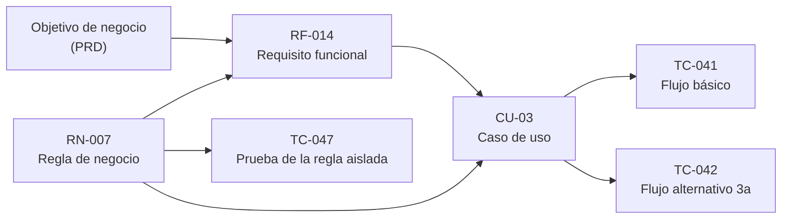

# Software Requirements Specification

## Resumen ejecutivo

El SRS es el documento donde una intención de negocio deja de ser una conversación y se vuelve un compromiso verificable. Enuncia qué debe hacer el sistema, bajo qué reglas, con qué niveles de calidad y dentro de qué restricciones, en términos que permitan a un desarrollador implementarlo sin adivinar y a un tester verificarlo sin negociar. Todo lo demás que se le atribuye —justificar la inversión, describir la arquitectura, detallar la interfaz— pertenece a otros documentos.

Sirve a cuatro lectores con necesidades distintas. El Product Owner (`ACT-01`) comprueba que lo especificado es lo que pidió y firma el alcance. El arquitecto (`ACT-03`) extrae de los requisitos no funcionales las fuerzas que van a determinar la estructura. El desarrollador (`ACT-04`) lo usa como contrato de comportamiento. QA (`ACT-05`) lo convierte en casos de prueba, y en ese acto revela sin piedad qué requisitos estaban mal escritos.

En esta guía el SRS incorpora dos cuerpos que suelen andar sueltos: los **casos de uso**, que narran la interacción completa incluyendo lo que sale mal, y las **reglas de negocio**, que enuncian las restricciones del dominio que existirían aunque el sistema no se construyera. Ambos se desarrollan en profundidad más abajo, con sus plantillas, sus antipatrones y su relación con la traza a pruebas.

---

## Definición

### Qué es

Una especificación del comportamiento externamente observable del sistema y de las propiedades de calidad que ese comportamiento debe exhibir. La norma de referencia es **ISO/IEC/IEEE 29148:2018**, *Systems and software engineering — Life cycle processes — Requirements engineering*, que define tanto el contenido esperado de una especificación de requisitos de software como las características que hacen que un requisito individual y un conjunto de requisitos sean de calidad. Esta guía adopta su vocabulario de características de calidad y su distinción entre requisitos de negocio, de las partes interesadas y del sistema.

El objeto del SRS es el sistema visto desde afuera. La prueba de si una frase pertenece al SRS es sencilla: ¿un usuario o un sistema externo podría notar la diferencia si esto no se cumpliera? «El sistema DEBE liberar la reserva si el organizador no la confirma dentro de los quince minutos previos al inicio» es observable. «El servicio de reservas DEBE implementarse con un `BackgroundService` de .NET que corra cada minuto» no lo es: es diseño, y su lugar está en el HLD.

### Qué problema resuelve

Resuelve la distancia entre lo que el negocio quiere y lo que el equipo entiende, antes de que esa distancia se convierta en código que hay que tirar. El costo de corregir un malentendido crece con el tiempo que tarda en detectarse, y el SRS es el instrumento diseñado para detectarlo temprano: obliga a escribir con precisión suficiente como para que el desacuerdo se vuelva visible. Dos personas pueden asentir durante una hora frente a la frase «hay que evitar reservas superpuestas» y descubrir, al escribir la regla, que una de ellas considera que una reserva de 10:00 a 11:00 y otra de 11:00 a 12:00 se superponen y la otra no.

Resuelve también un problema de propagación: sin un enunciado estable y con identificador, no hay traza. Cuando un requisito cambia y nadie sabe qué casos de prueba, qué pantallas y qué endpoints dependían de él, el impacto se calcula preguntando por los pasillos.

### Qué NO es, y con qué se lo confunde

**El SRS no es el PRD.** Es la confusión más costosa de esta familia porque los dos documentos hablan de funcionalidad y ambos los lee el Product Owner.

| Dimensión | PRD (`FAM-VIS`) | SRS (`FAM-ANA`) |
|-----------|-----------------|-----------------|
| Pregunta | ¿Por qué construimos esto y para quién? | ¿Qué debe hacer exactamente? |
| Sujeto de las frases | El usuario, el mercado, el negocio | El sistema |
| Unidad | Problema, oportunidad, resultado esperado | Requisito con ID y criterio de verificación |
| Éxito | Métrica de negocio: adopción, tiempo ahorrado | Cumplimiento verificable por prueba |
| Dueño | `ACT-01` Product Owner | `ACT-02` Analista funcional |
| Ejemplo | «Reducir a menos de dos minutos el tiempo de coordinar una reunión» | «`RF-014` El sistema DEBE confirmar o rechazar una solicitud de reserva en una única operación atómica» |

Un PRD que enumera validaciones de campo está haciendo el trabajo del SRS y lo hace mal, porque le falta el rigor de identificadores y criterios. Un SRS que argumenta retorno de inversión está haciendo el trabajo del PRD y lo hace mal, porque nadie le pidió esa justificación al analista. El vínculo correcto es de trazabilidad: cada requisito del SRS referencia el objetivo del [PRD](../10-Vision/PRD.md) que lo motiva, y un requisito que no puede señalar ninguno es candidato a eliminarse.

**El SRS no es un backlog de historias de usuario.** Una historia es una promesa de conversación con criterios de aceptación acotados a un incremento; el SRS es el cuerpo acumulado del comportamiento comprometido. Conviven bien —las historias se derivan de los requisitos y los criterios de aceptación se escriben en Gherkin apoyándose en las reglas— pero no se sustituyen. Un equipo que solo tiene historias, al cabo de dos años tiene el comportamiento del sistema disperso en ochocientos tickets cerrados.

**El SRS no es el diseño.** No contiene esquemas de tablas, nombres de clases, firmas de métodos ni topología de despliegue. La excepción legítima son las **restricciones de diseño**, que sí son requisitos porque el negocio o el entorno las imponen: «el sistema DEBE integrarse con el Active Directory corporativo existente» es un requisito, no una decisión del arquitecto.

**El SRS no es la especificación de la interfaz de usuario.** Especifica qué información se necesita y qué comportamiento se espera; no la disposición de los controles. En `CTX-1` la frontera se vuelve porosa y conviene un acuerdo explícito entre `ACT-02` y `ACT-08` sobre qué se documenta dónde.

---

## Aplicación por escenario

| Escenario | Naturaleza del SRS | Fuente principal | Riesgo dominante | Producto característico |
|-----------|-------------------|------------------|------------------|------------------------|
| `ESC-1` | Prescriptiva: compromete comportamiento futuro | PRD, entrevistas, talleres | Especificar de más antes de validar la hipótesis de negocio | SRS versionado con baseline aprobada |
| `ESC-2` | Doble: descriptiva del origen, prescriptiva del destino | Sistema en producción más decisiones nuevas | Confundir defecto heredado con requisito | SRS de línea base más criterio de paridad |
| `ESC-3` | Reconstructiva: hallazgo con evidencia | Código, esquema, pruebas, tickets | Presentar la inferencia con el tono de la observación | SRS reconstruido con columna de evidencia |
| `ESC-4` | Inferencial: hipótesis observables | Producto usado como usuario legítimo | Deducir capacidades del material de marketing | Catálogo funcional con nivel de confianza por requisito |

### `ESC-1` — Desarrollo nuevo

El SRS se escribe después del PRD y antes del SAD, y su unidad de progreso no es el número de requisitos sino la cantidad de desacuerdos resueltos. Conviene escribirlo por incrementos alineados con las áreas funcionales que el negocio prioriza, y mantener explícita la lista de lo que todavía no se especificó, porque un SRS con huecos declarados es más útil que uno completo a fuerza de suposiciones.

La práctica de mayor retorno es la revisión temprana por QA. Antes de que exista una sola línea de código, `ACT-05` intenta convertir cada requisito en un caso de prueba; los que no admiten esa conversión vuelven al analista con la pregunta concreta que falta responder. Es más barato descubrir en la semana tres que nadie definió qué pasa si dos personas confirman la misma sala en el mismo segundo, que descubrirlo en producción.

El SRS debe alcanzar una **baseline**: una versión aprobada, con fecha y firmante, contra la cual se miden los cambios posteriores. Sin baseline no hay control de alcance, y sin control de alcance la discusión sobre si algo «estaba pedido» se resuelve por memoria y por jerarquía.

### `ESC-2` — Migración

Hay dos SRS, o uno con dos capas claramente distinguidas. El de origen fija la **línea base de comportamiento**: qué hace hoy el sistema, incluido lo que nadie especificó nunca y que los usuarios dan por hecho. El de destino registra lo que se decide cambiar aprovechando la migración, que en un proyecto sano es poco y en un proyecto en problemas es mucho.

La pieza que define si la migración termina o no es el **criterio de paridad**, y se escribe como requisito con identificador propio. No alcanza con «debe hacer lo mismo»: hay que decir sobre qué conjunto de casos, con qué tolerancia y quién lo firma. Un ejemplo del dominio de reservas, para una migración de ASP.NET MVC a Blazor interactive server:

> `RF-PAR-003` — Para el conjunto de 240 reservas históricas del período 2025-01 a 2025-06, el sistema destino DEBE producir, ante la misma solicitud, la misma decisión de aceptación o rechazo y el mismo mensaje de motivo que el sistema origen. Las diferencias de formato de fecha en el mensaje no cuentan como discrepancia. Firma el criterio: responsable de QA.

El trabajo más delicado es separar requisito de accidente. Que el sistema viejo permita reservar salas con cero asistentes puede ser una regla de negocio deliberada, un defecto que nadie reportó o una consecuencia de que el campo se agregó después sin migrar los datos existentes. Cada caso se resuelve preguntando al negocio, no decidiendo por cuenta propia, y el resultado se registra con la decisión y su firmante. Lo que se decide **no** migrar necesita el mismo tratamiento: un requisito con estado `descartado` y el motivo, para que dentro de un año nadie lo reporte como regresión.

### `ESC-3` — Evaluación con acceso al código

El SRS reconstruido no dice qué debería hacer el sistema; dice qué hace, y lo respalda. Cada requisito lleva una columna de evidencia con archivo y rango de líneas, y un marcador de si es observación directa o inferencia.

Orden de lectura recomendado, del material que menos interpretación exige al que más:

1. **Pruebas automatizadas**, si existen. Son la especificación más honesta que un sistema legado suele tener: cada test que pasa es un comportamiento que alguien consideró obligatorio. Un `ReservaServiceTests.cs` con un caso `NoPermiteSolapamientoEnLaMismaSala` entrega una regla de negocio prácticamente redactada.
2. **Validaciones y guardas** en el código de aplicación: atributos de validación, `if` que lanzan excepciones de dominio, `FluentValidation`, filtros de autorización. Son reglas de negocio implementadas.
3. **Restricciones del esquema de base de datos**: unicidad, claves foráneas, `CHECK`, disparadores y procedimientos almacenados. Un índice único sobre `(SalaId, FechaInicio)` es una regla que nadie escribió en prosa pero que el sistema hace cumplir. Los disparadores y procedimientos almacenados son el escondite habitual de la lógica de negocio no documentada.
4. **Endpoints, controladores y componentes**: la superficie funcional. Cada acción expuesta es un candidato a caso de uso, y sus rutas de error revelan los flujos alternativos.
5. **Configuración y feature flags**: revelan comportamiento condicional y, a veces, requisitos que solo aplican a un cliente.
6. **Tickets e historial de commits**: aportan intención, que es lo que el código no tiene. Un commit «revertir validación de capacidad, ventas lo pidió» vale más que diez horas de lectura.

La convención de marcado que esta guía usa dentro del SRS reconstruido:

| Marca | Significado | Ejemplo |
|-------|-------------|---------|
| `[OBS]` | Observado directamente en la evidencia citada | `[OBS]` El sistema rechaza reservas superpuestas — `ReservaService.cs:88-104` |
| `[INF]` | Inferido de un patrón consistente, sin enunciado explícito | `[INF]` La antelación mínima de reserva sería de 15 minutos — deducido del filtro en `DisponibilidadQuery.cs:41` |
| `[NV]` | No verificado: existe la afirmación, falta la evidencia | `[NV]` La documentación interna menciona un límite de 8 horas por reserva; no se halló código que lo aplique |

Un requisito `[INF]` presentado con el mismo tono que uno `[OBS]` es el defecto característico del escenario, y el motivo por el que el frontmatter de esta guía exige `origin` y `confidence`.

### `ESC-4` — Evaluación solo desde afuera

Todo lo que se produce es hipótesis, y el catálogo funcional es lo único que alcanza confianza alta porque se apoya en el uso directo del producto. Los requisitos se redactan como comportamiento observado, con la condición exacta en que se observó y la fecha, porque un producto SaaS cambia sin avisar.

El material aprovechable es más rico de lo que parece. Los mensajes de error revelan reglas: si al intentar reservar una sala se recibe «La sala Roble no está disponible entre las 10:00 y las 11:00», hay una regla de solapamiento; si además se ofrecen alternativas, hay una regla sobre cómo se eligen. Los formularios revelan obligatoriedad y rangos de valores. Las notas de versión revelan qué se agregó y cuándo, lo que permite distinguir el núcleo del producto de lo periférico. La estructura de navegación y las URLs revelan el modelo de dominio que el equipo tiene en la cabeza.

El límite es el mismo que fija [Escenarios](../00-Marco-de-Referencia/Escenarios.md): se prueba el producto como se ofrece al público. Forzar límites de tasa, probar credenciales ajenas o extraer datos masivamente no es relevamiento.

Un requisito de `ESC-4` bien escrito lleva su procedencia incorporada:

> `RF-E4-007` — El sistema rechaza solicitudes de reserva cuya duración supera las 4 horas. **Confianza**: media. **Evidencia**: mensaje «La duración máxima permitida es de 4 horas» al intentar reservar de 09:00 a 14:00 en la sala Roble, plan Business, 2026-07-14. **No verificado**: si el límite es configurable por organización o si difiere por plan.

### Variaciones por contexto

**`CTX-1` — Web y cliente interactivo.** El peso se corre hacia los casos de uso y los flujos, y la exigencia específica es especificar los cuatro estados de cada pantalla relevante —vacío, cargando, con datos, con error— porque un SRS que solo describe el camino feliz deja sin especificar la mayor parte del trabajo de implementación. En Blazor interactive server hay un quinto estado que la documentación olvida sistemáticamente: la reconexión del circuito. Qué ve el usuario mientras el circuito se recupera y qué pasa con un formulario a medio completar son requisitos, no detalles de implementación. Los requisitos no funcionales característicos son accesibilidad con criterio verificable —nivel de conformidad **WCAG 2.2 AA**, orden de foco, contraste— y comportamiento responsivo con puntos de quiebre nombrados.

**`CTX-2` — Backend y servicios.** El peso se corre hacia las reglas de negocio y las garantías del contrato. Lo que en `CTX-1` puede quedar implícito acá debe estar escrito: idempotencia y su clave, semántica exacta de cada código de error, garantías de entrega de los eventos, orden y duplicación, comportamiento bajo concurrencia. Un requisito de `CTX-2` que no dice qué pasa ante un reintento está incompleto. Los casos de uso siguen existiendo pero el actor primario suele ser un sistema, y el «flujo básico» se parece más a una secuencia de mensajes que a una navegación.

**`CTX-3` — Fullstack.** Lo específico es la **traza vertical**: cada `RF-` debe poder seguirse hasta la pantalla, el endpoint, la tabla y el caso de prueba. El SRS es el punto de partida de esa cadena, y su responsabilidad es aportar identificadores estables y vocabulario único. El riesgo característico no es la falta de requisitos sino la divergencia de nombres: el SRS habla de «solicitud», la interfaz de «pedido» y la tabla se llama `Reservations`. La disciplina que lo evita es el lenguaje ubicuo del [modelo de dominio](Modelo-de-Dominio.md), y el SRS es su primer consumidor.

---

## Requisitos: cómo se escriben

### Anatomía de un requisito

Un requisito individual del sistema tiene sujeto, verbo modal, comportamiento, condición y criterio de verificación. La forma canónica que esta guía usa:

> `<ID>` — Cuando `<condición>`, el sistema **DEBE** `<comportamiento observable>` `<con qué restricción cuantificada>`.

El verbo modal no es decorativo. **RFC 2119** fija el significado de los términos de obligación, y esta guía usa su equivalente en español con el mismo rigor:

| Término | Equivalente RFC 2119 | Significado |
|---------|---------------------|-------------|
| **DEBE** / NO DEBE | MUST / MUST NOT | Obligación absoluta; su incumplimiento es un defecto |
| **DEBERÍA** / NO DEBERÍA | SHOULD / SHOULD NOT | Recomendación fuerte; apartarse exige justificación registrada |
| **PUEDE** | MAY | Opcional; su ausencia no es un defecto |

Un SRS donde todo es DEBE no prioriza nada; uno donde todo es DEBERÍA no compromete nada. La proporción sana en un sistema de línea de negocio ronda el 80 % de obligaciones, y cada DEBERÍA lleva anotado qué pasa si no se cumple.

### Funcionales y no funcionales

Los **requisitos funcionales** (`RF-`) enuncian qué hace el sistema: qué acepta, qué rechaza, qué calcula, qué notifica. Los **no funcionales** (`RNF-`) enuncian con qué calidad lo hace. La clasificación de estos últimos se apoya en **ISO/IEC 25010**, que define el modelo de calidad del producto software con sus ocho características: adecuación funcional, eficiencia de desempeño, compatibilidad, usabilidad, fiabilidad, seguridad, mantenibilidad y portabilidad. Usar esa taxonomía como lista de verificación evita el olvido más común, que es especificar exhaustivamente el comportamiento y no decir una palabra sobre carga esperada, disponibilidad o recuperación.

Un RNF sin número es una opinión. «El sistema debe ser rápido» no se puede verificar, no se puede diseñar contra él y no se puede incumplir. La versión utilizable nombra la operación, el percentil, el umbral y la condición de carga:

> `RNF-002` — Bajo una carga de 50 usuarios concurrentes, el sistema DEBE responder la consulta de disponibilidad de salas en menos de 800 ms en el percentil 95, medido en el servidor.

Los RNF son además la principal entrada del arquitecto: son las fuerzas que determinan la estructura. Un requisito de disponibilidad de 99,9 % y otro de recuperación en menos de cinco minutos deciden más sobre la topología del sistema que cualquier preferencia tecnológica.

### Características de calidad de los requisitos

**ISO/IEC/IEEE 29148:2018** define las características que debe exhibir un requisito individual y las que debe exhibir el conjunto. Son el criterio de revisión de esta guía, y conviene aplicarlas como una lista de control explícita porque cada una atrapa un defecto distinto.

| Característica | Qué exige | Pregunta de control | Contraejemplo |
|----------------|-----------|--------------------|---------------|
| **No ambiguo** | Una sola interpretación posible | ¿Dos lectores competentes entenderían lo mismo? | «El sistema debe manejar adecuadamente las reservas conflictivas» |
| **Verificable** | Existe un método objetivo para comprobar su cumplimiento | ¿Cómo pruebo que se cumple? | «La interfaz debe ser intuitiva» |
| **Completo** | No requiere información externa para entenderse | ¿Falta la condición, el actor o el valor límite? | «El sistema debe enviar una notificación» — ¿a quién, cuándo, por qué canal? |
| **Consistente** | No contradice a ningún otro requisito | ¿Hay otro requisito que diga lo contrario? | `RF-020` permite reservar sin confirmar y `RF-031` exige confirmación previa |
| **Trazable** | Se puede seguir hacia arriba a su origen y hacia abajo a su verificación | ¿De qué objetivo del PRD viene y qué `TC-` lo prueba? | Requisito huérfano sin origen conocido |
| **Singular** | Enuncia una sola cosa | ¿Puedo partirlo en dos con «y»? | «El sistema debe validar la disponibilidad y enviar el correo de confirmación» |
| **Factible** | Realizable dentro de las restricciones conocidas | ¿Alguien confirmó que es posible con este presupuesto y plazo? | Disponibilidad de 99,999 % sobre infraestructura de un solo nodo |
| **Apropiado** | Corresponde al nivel de abstracción del documento | ¿Estoy especificando comportamiento o diseño? | «El sistema debe usar Redis para la caché de disponibilidad» |

Al conjunto se le exigen además dos propiedades que ningún requisito individual puede tener: **completitud del conjunto**, que no falte comportamiento necesario, y **ausencia de redundancia**, que el mismo comportamiento no esté especificado dos veces con palabras distintas —el mecanismo por el cual un SRS empieza a contradecirse.

La característica de singularidad merece una advertencia práctica: partir requisitos compuestos es la corrección más frecuente en una revisión, y también la más resistida, porque un requisito con «y» se siente más completo. La razón para partirlo es operativa: si el sistema valida la disponibilidad pero no envía el correo, el requisito compuesto está a la vez cumplido e incumplido, y el estado de la prueba deja de ser interpretable.

---

## Casos de uso

### Qué son y qué aportan

Un caso de uso describe la interacción completa entre uno o más actores y el sistema para lograr un objetivo, incluyendo lo que sale mal. Su valor está exactamente ahí: en los flujos alternativos y las excepciones, que es la información que los requisitos sueltos no capturan y que constituye la mayor parte del código real. Un `RF-` dice que el sistema debe confirmar reservas; el caso de uso dice qué ocurre cuando la sala se ocupó entre la consulta y la confirmación, cuando el organizador no tiene permiso sobre esa sala y cuando la conexión se cae en el medio.

El tratamiento canónico es el de **Alistair Cockburn**, *Writing Effective Use Cases* (2000), del que esta guía toma tres ideas que resuelven la mayoría de los problemas de redacción. La primera es el **nivel de objetivo**: un caso de uso puede estar al nivel de un objetivo de usuario —lo que alguien viene a hacer y por lo que se da por satisfecho al terminar—, por encima, al nivel de un proceso de negocio que abarca varias sesiones, o por debajo, al nivel de un subfunción como «autenticarse». Mezclar niveles en un mismo documento es la causa más común de que un catálogo de casos de uso resulte inservible. La segunda es que el caso de uso se escribe como una **narración de intención**, no de mecánica de interfaz: «el organizador indica la franja horaria deseada», no «el organizador hace clic en el selector de fecha». La tercera es el **alcance de diseño**: qué queda dentro de la caja negra que estamos especificando y qué queda afuera.

**UML 2.5** aporta la notación del diagrama de casos de uso, útil para mostrar el mapa de actores y objetivos de un vistazo, y muy poco útil como especificación: el diagrama no dice qué pasa. Las relaciones `include` y `extend` de UML se usan con moderación; un catálogo con veinte `extend` anidados es ilegible para quien tiene que implementarlo.

### Relación con los requisitos y con las pruebas

El caso de uso y el requisito no compiten: se complementan por granularidad. El requisito es la unidad atómica y verificable que se prioriza, se traza y se acepta; el caso de uso es el hilo narrativo que muestra cómo varios requisitos se combinan en una experiencia coherente. La relación práctica es de muchos a muchos, y conviene registrarla explícitamente en cada caso de uso con una línea de requisitos cubiertos.

La cadena de traza completa que esta guía usa:



Cada flujo alternativo y cada excepción de un caso de uso genera al menos un caso de prueba. Esa correspondencia es mecánica y conviene aprovecharla: un caso de uso con seis extensiones y dos casos de prueba está subverificado, y la brecha se detecta contando.

### Plantilla y ejemplo

El nivel de formalidad se elige según el riesgo. Cockburn distingue entre el formato *casual* —un párrafo por flujo— y el *totalmente vestido*, con precondiciones, garantías y extensiones numeradas. Un caso de uso de bajo riesgo no necesita el formato completo; el caso central del sistema sí. La plantilla completa está en el anexo.

**`CU-03` — Reservar sala** (formato completo, dominio de reservas)

| Campo | Contenido |
|-------|-----------|
| **Identificador** | `CU-03` |
| **Nivel** | Objetivo de usuario |
| **Actor primario** | Organizador (`ACT-USR-01`) |
| **Actores secundarios** | Servicio de calendario corporativo, servicio de notificaciones |
| **Alcance** | Sistema de reserva de salas |
| **Interesados y sus intereses** | Organizador: obtener una sala confirmada sin reintentos. Facilities: que la ocupación real coincida con la reservada. Asistentes: recibir la invitación con lugar y hora correctos. |
| **Precondición** | El organizador está autenticado y pertenece a una sede con salas habilitadas. |
| **Garantía mínima** | Ninguna reserva queda en estado parcial; si el flujo se interrumpe, no hay sala bloqueada. |
| **Garantía de éxito** | Existe una reserva confirmada para la sala, la franja y los asistentes indicados, y se notificó a los asistentes. |
| **Disparador** | El organizador inicia una nueva reserva. |
| **Requisitos cubiertos** | `RF-011`, `RF-012`, `RF-014`, `RF-018`, `RNF-002` |
| **Reglas aplicables** | `RN-001`, `RN-002`, `RN-004`, `RN-005`, `RN-009` |

**Flujo básico**

1. El organizador indica sede, fecha y franja horaria deseada.
2. El sistema muestra las salas disponibles para esa franja, con su capacidad y su equipamiento.
3. El organizador selecciona una sala e incorpora los asistentes.
4. El sistema valida la capacidad de la sala contra la cantidad de asistentes (`RN-002`).
5. El organizador confirma la reserva.
6. El sistema verifica que la sala siga libre, registra la reserva en estado *Confirmada* y le asigna un código.
7. El sistema notifica a los asistentes e inserta el evento en el calendario corporativo.
8. El sistema muestra al organizador el código de la reserva.

**Flujos alternativos y excepciones**

| Ext. | Condición | Comportamiento |
|------|-----------|----------------|
| 2a | No hay salas disponibles en la franja | El sistema ofrece las tres franjas libres más cercanas con salas que cumplan la capacidad solicitada, ordenadas por proximidad temporal (`RN-009`). |
| 4a | Los asistentes superan la capacidad de la sala | El sistema rechaza la selección, indica la capacidad y filtra el listado a las salas que sí admiten esa cantidad. |
| 6a | La sala fue reservada por otro organizador entre los pasos 2 y 5 | El sistema rechaza la confirmación con el motivo, conserva los asistentes ya cargados y vuelve al paso 2 con la franja original (`RN-001`). |
| 6b | El organizador no tiene autorización sobre esa sala | El sistema rechaza la confirmación e indica a quién solicitar el permiso (`RN-005`). |
| 7a | El servicio de calendario no responde | La reserva permanece confirmada; el sistema encola la inserción del evento y reintenta hasta tres veces con espera creciente. La reserva no depende del calendario (`RN-011`). |
| 5a | En `CTX-1` sobre Blazor interactive server: el circuito se desconecta entre los pasos 5 y 6 | Al reconectar, el sistema consulta el estado real de la reserva por su clave de idempotencia antes de mostrar cualquier resultado, y nunca reenvía la confirmación a ciegas. |

La extensión 6a es la que justifica el caso de uso. Un requisito aislado diría «el sistema debe evitar reservas superpuestas» y dejaría sin especificar el comportamiento que el usuario efectivamente experimenta: si pierde los asistentes cargados, si vuelve al inicio o si recibe alternativas.

### Antipatrones de casos de uso

**El caso de uso CRUD.** Cuatro casos llamados «Crear sala», «Leer sala», «Modificar sala», «Eliminar sala» no describen ningún objetivo de usuario: describen operaciones sobre una tabla. La administración de salas es un caso de uso; sus cuatro operaciones son pasos. El síntoma es un catálogo cuyo tamaño crece linealmente con la cantidad de entidades del modelo de datos.

**El caso de uso que documenta la interfaz.** «El usuario hace clic en el botón Reservar, se abre el modal, el usuario completa el campo Fecha». El caso de uso queda atado a un diseño que va a cambiar dos veces antes de salir a producción, y la revisión con el negocio se pierde discutiendo si el control es un desplegable o un calendario.

**El caso de uso sin extensiones.** Ocho pasos de flujo básico y ninguna excepción. Significa que nadie se hizo la pregunta difícil, y garantiza que las decisiones sobre qué hacer ante el error las va a tomar el desarrollador solo, en el sprint, sin registro.

**El caso de uso de nivel equivocado.** «Autenticarse» como caso de uso al mismo nivel que «Reservar sala». Es una subfunción; aparece como precondición o como paso, no como objetivo.

**El diagrama sin texto.** Un diagrama UML de casos de uso con dieciocho óvalos y ningún caso escrito. Muestra el mapa y no dice nada sobre el comportamiento; es un índice presentado como especificación.

---

## Reglas de negocio

### Qué son y por qué se separan del requisito

Una regla de negocio es una restricción o una política del dominio que existiría aunque el sistema no se construyera. «Una sala no admite dos reservas confirmadas que se superpongan» es cierto en la organización, con software o con una planilla en la recepción. El requisito, en cambio, es lo que el sistema hace para que esa regla se cumpla: validar antes de confirmar, ofrecer alternativas, registrar el intento rechazado.

La distinción tiene una consecuencia práctica que justifica el esfuerzo de mantenerla: **la regla tiene un dueño en el negocio y el requisito tiene un dueño en el equipo**. Cuando alguien pregunta «¿por qué el sistema no deja reservar con menos de quince minutos de antelación?», la respuesta correcta no es «así se implementó» sino «`RN-004`, política de Facilities, vigente desde 2025-03-01, dueño: gerencia de Facilities». Esa trazabilidad es lo que permite cambiar la regla con conocimiento de causa en lugar de discutir la implementación.

La segunda consecuencia es de reutilización. Una misma regla suele estar invocada por varios requisitos y varios casos de uso. Escrita una vez con identificador, se referencia; escrita en cada lugar donde aplica, diverge. La regla de solapamiento aparece en la creación de reserva, en la modificación, en la extensión de duración y en la importación masiva; si está copiada cuatro veces, al cambiar el criterio de qué cuenta como superposición se corrigen tres.

### Tipos de regla

La taxonomía práctica que esta guía usa distingue cinco clases, porque cada una se verifica de forma distinta:

| Tipo | Qué enuncia | Ejemplo del dominio |
|------|-------------|---------------------|
| **Restricción estructural** | Una condición que los datos deben cumplir siempre | `RN-001` — Dos reservas confirmadas de la misma sala no pueden superponerse en el tiempo |
| **Derivación** | Un valor se calcula a partir de otros | `RN-008` — El costo imputado de una reserva es la tarifa horaria de la sala por su duración en horas, redondeada a la media hora superior |
| **Autorización** | Quién puede hacer qué | `RN-005` — Solo los organizadores con perfil *Dirección* pueden reservar salas de categoría *Ejecutiva* |
| **Política temporal** | Una condición sobre plazos o vigencias | `RN-004` — Una reserva no puede crearse con menos de 15 minutos de antelación respecto de su inicio |
| **Disparador de acción** | Un evento del dominio obliga a una acción | `RN-006` — Una reserva no confirmada por el organizador dentro de los 15 minutos previos a su inicio se libera automáticamente |

Las reglas de derivación son las que más se pierden, porque se implementan en una función y nadie las escribe. Las de autorización son las que más caro cuestan cuando faltan, porque el hueco no se nota hasta que alguien lo aprovecha.

### Cómo se escriben

Una regla bien escrita es atómica, declarativa e independiente de la implementación. Declarativa significa que enuncia qué debe ser cierto, no cómo comprobarlo: «una sala no admite reservas superpuestas» y no «al guardar, consultar la tabla de reservas y verificar que no exista otra en el mismo rango». Independiente de la implementación significa que no menciona tablas, servicios ni pantallas, porque la regla sobrevive a los tres.

Cada regla lleva, además del enunciado, cuatro datos que la vuelven gobernable: **dueño** en el negocio, **vigencia** desde cuándo rige, **origen** —política interna, contrato, norma legal— y **efecto ante violación**, que es lo que el sistema hace cuando la regla se incumple. Ese último campo es el que más se olvida y el que más preguntas resuelve: rechazar con mensaje no es lo mismo que aceptar y alertar, ni que aceptar y registrar para auditoría.

Cuando la regla tiene condiciones combinadas, la prosa se vuelve inmanejable y conviene una **tabla de decisión**, que además se traduce directamente a casos de prueba:

`RN-005` — Autorización de reserva por categoría de sala

| Perfil del organizador | Sala estándar | Sala ejecutiva | Auditorio |
|-----------------------|---------------|----------------|-----------|
| Colaborador | Permitido | Denegado | Requiere aprobación de Facilities |
| Jefatura | Permitido | Permitido hasta 2 h | Requiere aprobación de Facilities |
| Dirección | Permitido | Permitido | Permitido |

Nueve celdas, nueve casos de prueba, ninguna ambigüedad. La misma información en prosa ocuparía dos párrafos y dejaría al menos una combinación sin definir.

### Reglas y criterios de aceptación en Gherkin

El formato **Gherkin** con su estructura *Given-When-Then* —proveniente de la práctica de Behaviour-Driven Development y usado por herramientas como Cucumber y SpecFlow— es el puente natural entre la regla y la prueba, porque expresa la regla como escenario ejecutable sin perder legibilidad para el negocio. Esta guía lo usa para los criterios de aceptación, no para reemplazar la regla: el enunciado declarativo sigue siendo la fuente, y los escenarios son sus casos de verificación.

```gherkin
Característica: RN-001 — No superposición de reservas confirmadas

  Escenario: Rechazo de solicitud superpuesta en la misma sala
    Dado que la sala "Roble" tiene una reserva confirmada de 10:00 a 11:00 el 2026-08-12
    Cuando el organizador "m.alvarez@empresa.com" solicita la sala "Roble" de 10:30 a 11:30 el 2026-08-12
    Entonces el sistema rechaza la solicitud con el motivo "SALA_OCUPADA"
    Y ofrece al menos una franja alternativa para el mismo día

  Escenario: Reservas contiguas no se consideran superpuestas
    Dado que la sala "Roble" tiene una reserva confirmada de 10:00 a 11:00 el 2026-08-12
    Cuando el organizador "m.alvarez@empresa.com" solicita la sala "Roble" de 11:00 a 12:00 el 2026-08-12
    Entonces el sistema acepta la solicitud

  Escenario: Una reserva cancelada no bloquea la franja
    Dado que la sala "Roble" tiene una reserva cancelada de 14:00 a 15:00 el 2026-08-12
    Cuando el organizador "m.alvarez@empresa.com" solicita la sala "Roble" de 14:00 a 15:00 el 2026-08-12
    Entonces el sistema acepta la solicitud
```

El segundo escenario es el que vuelve útil al conjunto: fija que el intervalo es semiabierto y que el límite no cuenta como superposición. Esa precisión, que en prosa cuesta un párrafo enredado, en un escenario ocupa tres líneas y queda verificada automáticamente. El tercero cierra la otra ambigüedad habitual, que es sobre qué estados de reserva aplica la restricción.

### Antipatrones de reglas de negocio

**La regla que solo vive en el código.** El caso más frecuente y el más caro. Se detecta en `ESC-3` leyendo validaciones y descubriendo condiciones que nadie sabe justificar. La contramedida en `ESC-1` es la disciplina de que toda validación implementada tenga un `RN-` referenciado en el comentario o en el nombre de la prueba.

**La regla enunciada como procedimiento.** «Verificar en la tabla Reservas si existe otro registro con la misma SalaId y rangos solapados, y si existe, devolver error 409». Eso es diseño. La regla sobrevive a la base de datos; el procedimiento no.

**La regla sin dueño.** Un enunciado que nadie del negocio puede confirmar ni cambiar. Suele originarse en una suposición del analista o en una decisión de un desarrollador que resolvió un caso borde y siguió adelante. Sin dueño, la regla no se puede modificar porque nadie sabe si romperla es aceptable.

**La regla con excepciones no enumeradas.** «Toda reserva requiere aprobación, salvo casos especiales». La cláusula de escape convierte la regla en no verificable. Los casos especiales se enumeran o no existen.

**La regla contradictoria latente.** `RN-004` prohíbe reservar con menos de quince minutos de antelación y `RN-012` permite a Facilities crear reservas de emergencia inmediatas. No es un error, pero si la precedencia no está escrita, la implementación la resuelve por orden de los `if`. Toda excepción a una regla se declara en la regla que la excepciona.

---

## Ejemplos concretos

El sistema de reserva de salas de esta guía atiende a una organización con tres sedes, 24 salas de categorías estándar, ejecutiva y auditorio, y unos 900 empleados. Los datos son sintéticos.

### Requisitos funcionales

| ID | Enunciado | Origen (PRD) | Reglas | Verificación |
|----|-----------|--------------|--------|--------------|
| `RF-011` | El sistema DEBE mostrar las salas disponibles para una sede, una fecha y una franja horaria dadas, indicando capacidad y equipamiento de cada una. | `OBJ-01` | `RN-003` | `TC-021` |
| `RF-012` | El sistema DEBE impedir la selección de una sala cuya capacidad sea menor que la cantidad de asistentes indicada. | `OBJ-01` | `RN-002` | `TC-024` |
| `RF-014` | Al confirmar una reserva, el sistema DEBE verificar la disponibilidad y registrar la reserva en una única operación atómica, de modo que dos confirmaciones concurrentes sobre la misma sala y franja resulten en exactamente una reserva confirmada. | `OBJ-01` | `RN-001` | `TC-041`, `TC-042` |
| `RF-015` | Cuando una solicitud se rechaza por sala ocupada, el sistema DEBE ofrecer las tres franjas disponibles más cercanas en el mismo día que satisfagan la capacidad solicitada. | `OBJ-02` | `RN-009` | `TC-043` |
| `RF-018` | Al confirmar una reserva, el sistema DEBE notificar por correo a los asistentes dentro de los 60 segundos siguientes. | `OBJ-03` | `RN-011` | `TC-051` |
| `RF-021` | El sistema DEBE liberar automáticamente toda reserva que el organizador no haya confirmado su asistencia dentro de los 15 minutos previos al inicio, y notificarlo al organizador. | `OBJ-04` | `RN-006` | `TC-061` |
| `RF-027` | El sistema DEBE permitir cancelar una reserva hasta el momento de su inicio, conservando el registro de la cancelación con su autor y su marca temporal. | `OBJ-04` | `RN-010` | `TC-071` |

`RF-014` merece atención por lo que hace bien: nombra la condición de concurrencia y define el resultado esperado de manera verificable —«exactamente una»—, en lugar de dejar la atomicidad como un supuesto. Es la clase de precisión que decide si el desarrollador usa una transacción con índice único, un bloqueo optimista o nada.

### Requisitos no funcionales

Clasificados según las características de **ISO/IEC 25010**.

| ID | Característica 25010 | Enunciado | Verificación |
|----|---------------------|-----------|--------------|
| `RNF-002` | Eficiencia de desempeño | Bajo 50 usuarios concurrentes, la consulta de disponibilidad DEBE responder en menos de 800 ms en el percentil 95, medido en servidor. | Prueba de carga `TC-P01` |
| `RNF-004` | Fiabilidad | El sistema DEBE mantener una disponibilidad mensual del 99,5 % en horario laboral (07:00 a 20:00, días hábiles). | Monitoreo, informe mensual |
| `RNF-005` | Fiabilidad | Ante caída del servicio de calendario corporativo, el sistema DEBE seguir aceptando y confirmando reservas, encolando las inserciones pendientes. | `TC-081` con el servicio simulado caído |
| `RNF-007` | Usabilidad | La aplicación web DEBE cumplir el nivel de conformidad **WCAG 2.2 AA** en los flujos de consulta, alta y cancelación de reservas. | Auditoría de accesibilidad sobre `CU-03`, `CU-04` |
| `RNF-009` | Seguridad | El sistema DEBE registrar en bitácora inmutable toda creación, modificación y cancelación de reserva, con autor, marca temporal y valores previos. | `TC-091` |
| `RNF-012` | Compatibilidad | El cliente MAUI DEBE operar sobre Android 10 o superior e iOS 15 o superior. | Matriz de dispositivos |

`RNF-005` es un requisito no funcional con forma de funcional, y está bien que así sea: la degradación elegante ante fallo de una dependencia es una decisión de fiabilidad que hay que especificar, porque la alternativa —que la reserva falle si el calendario no responde— es igualmente implementable y bastante más probable si nadie dice nada.

### Reglas de negocio

| ID | Enunciado | Tipo | Dueño | Vigencia | Efecto ante violación |
|----|-----------|------|-------|----------|----------------------|
| `RN-001` | Dos reservas en estado *Confirmada* de la misma sala no pueden superponerse. El intervalo es semiabierto `[inicio, fin)`: dos reservas contiguas no se superponen. | Restricción | Facilities | 2025-01-01 | Rechazo con motivo `SALA_OCUPADA` |
| `RN-002` | La cantidad de asistentes de una reserva no puede superar la capacidad declarada de la sala. | Restricción | Facilities | 2025-01-01 | Rechazo con motivo `CAPACIDAD_EXCEDIDA` |
| `RN-004` | Una reserva no puede crearse con menos de 15 minutos de antelación respecto de su inicio. Se exceptúa el perfil *Facilities*, que puede crear reservas inmediatas (`RN-012`). | Política temporal | Facilities | 2025-03-01 | Rechazo con motivo `ANTELACION_INSUFICIENTE` |
| `RN-005` | La autorización para reservar depende del perfil del organizador y de la categoría de la sala, según la tabla de decisión de la sección de reglas. | Autorización | Recursos Humanos | 2025-06-15 | Rechazo con motivo `NO_AUTORIZADO` |
| `RN-006` | Una reserva no confirmada por el organizador dentro de los 15 minutos previos a su inicio se libera. | Disparador | Facilities | 2025-01-01 | Liberación automática y notificación |
| `RN-008` | El costo imputado de una reserva es la tarifa horaria de la sala multiplicada por su duración, redondeada a la media hora superior. | Derivación | Administración | 2025-01-01 | No aplica: se calcula, no se valida |
| `RN-009` | Ante rechazo por sala ocupada, las alternativas ofrecidas son las tres franjas libres más cercanas en el mismo día, ordenadas por distancia temporal al horario solicitado, que cumplan la capacidad requerida. | Derivación | Facilities | 2025-04-01 | No aplica |
| `RN-011` | La confirmación de una reserva no depende de la disponibilidad del calendario corporativo ni del servicio de notificaciones. | Restricción | Facilities | 2025-02-01 | No aplica: define alcance transaccional |

`RN-001` ilustra el nivel de precisión que separa una regla utilizable de una decorativa. La aclaración sobre el intervalo semiabierto parece pedante hasta que alguien reporta como defecto que no puede reservar de 11:00 a 12:00 en una sala que se libera a las 11:00.

### Traza vertical (`CTX-3`)

La cadena completa para la funcionalidad central, tal como debería poder leerse sin preguntarle a nadie:

| Eslabón | Artefacto | Identificador |
|---------|-----------|---------------|
| Objetivo | [PRD](../10-Vision/PRD.md) | `OBJ-01 — Coordinar una reunión en menos de dos minutos` |
| Requisito | SRS | `RF-014` |
| Regla | SRS, sección de reglas | `RN-001` |
| Caso de uso | SRS, sección de casos de uso | `CU-03`, extensión 6a |
| Concepto | [Modelo de dominio](Modelo-de-Dominio.md) | `Reserva`, `Sala`, objeto de valor `Franja` |
| Interfaz | LLD de componente (`CTX-1`) | `ReservaEditor.razor` |
| Contrato | API Specification (`CTX-2`) | `POST /reservas`, cabecera `Idempotency-Key` |
| Persistencia | [Modelo de datos](../40-Diseno/Modelo-de-Datos.md) | Tabla `Reserva`, índice único sobre `(SalaId, Franja)` |
| Verificación | [Test Plan](../60-Desarrollo/Test-Plan.md) | `TC-041`, `TC-042` |

### El mismo requisito en los tres contextos

`RF-014` no cambia de enunciado, pero cambia lo que hay que agregarle para que sea implementable.

En **`CTX-1`** con Blazor interactive server, hace falta especificar el comportamiento del formulario mientras la verificación está en curso —botón deshabilitado con indicador—, la conservación de los asistentes cargados ante el rechazo de la extensión 6a, y el comportamiento ante caída del circuito: al reconectar, el componente consulta el estado real de la reserva antes de renderizar. En un cliente MAUI con MVVM, lo equivalente se especifica sobre el ViewModel: qué comando queda deshabilitado, qué estado se persiste localmente y qué ocurre si la aplicación se suspende durante la confirmación.

En **`CTX-2`**, hace falta especificar que `POST /reservas` es idempotente respecto de la cabecera `Idempotency-Key` con una ventana de 24 horas, que un reintento con la misma clave devuelve la reserva ya creada con `200` en lugar de crear otra con `201`, que el conflicto devuelve `409` con un cuerpo que enumera alternativas según `RN-009`, y que el evento `ReservaConfirmada` se publica con garantía *at-least-once*, por lo cual el consumidor deduplica por identificador de reserva.

En **`CTX-3`**, además de ambos, hace falta decidir y registrar dónde vive la verificación de solapamiento. Si el componente Blazor invoca directamente un servicio del lado servidor y además existe el endpoint público, la regla se aplica en el servicio de dominio y no en el controlador, o el sistema tendrá dos comportamientos según por dónde entre la solicitud. Esa decisión es del arquitecto, pero el SRS la vuelve necesaria al exigir que el comportamiento sea el mismo por cualquier vía.

---

## Preguntas guía

- ¿Cada requisito de este documento se puede convertir en un caso de prueba sin pedir aclaraciones? Si no, ¿qué información falta exactamente?
- ¿Hay algún requisito que no pueda señalar el objetivo del PRD que lo motiva? ¿Por qué sigue en el alcance?
- Para cada requisito con un valor numérico: ¿de dónde salió ese número, y quién lo confirmó?
- ¿Qué comportamiento ante error, ante datos vacíos y ante concurrencia quedó sin especificar? ¿Es una decisión o un olvido?
- ¿Cada regla de negocio tiene un dueño en el negocio que pueda confirmarla y cambiarla?
- ¿Los casos de uso tienen extensiones, o solo el camino feliz?
- En `ESC-3` y `ESC-4`: ¿qué afirmación de este documento es observación y cuál es interpretación? ¿Está marcada la diferencia?
- Si el equipo implementara literalmente lo escrito, sin conversar con nadie, ¿qué construiría distinto de lo que el negocio espera?

---

## Criterios de calidad

### Una buena versión

Un SRS de calidad se reconoce por una prueba operativa: un desarrollador que no participó de las reuniones puede implementar un requisito sin preguntar, y un tester puede escribir el caso de prueba leyendo solo el enunciado. Sus requisitos son atómicos, están numerados con identificadores estables y llevan cada uno su criterio de verificación. Los valores numéricos tienen procedencia. Las reglas de negocio están enunciadas una sola vez, con dueño y vigencia, y referenciadas desde donde aplican. Los casos de uso tienen tantas extensiones como caminos de error reales. El vocabulario coincide con el del [modelo de dominio](Modelo-de-Dominio.md), y coincide también con el de la interfaz y el de la base de datos.

Tiene además dos propiedades que se notan con el tiempo: está versionado con una baseline aprobada, de modo que los cambios se pueden discutir como cambios y no como desacuerdos sobre el pasado; y declara explícitamente lo que todavía no especifica, en lugar de disimular los huecos.

### Una versión pobre

Enuncia intenciones en lugar de comportamiento. Usa «debe» y «debería» indistintamente. Mezcla requisitos con diseño, de modo que el arquitecto encuentra decisiones ya tomadas por quien no tenía autoridad para tomarlas. No tiene identificadores, o los tiene pero se renumeran al reordenar el documento, con lo cual toda traza previa se rompe. Sus requisitos no funcionales son adjetivos. Sus casos de uso describen pantallas. Sus reglas están repetidas en tres lugares con tres redacciones que casi coinciden.

El síntoma terminal es la falta de lectores. Un SRS que nadie abre durante el desarrollo no está documentando el sistema: está documentando que hubo un proceso.

### Antipatrones

| Antipatrón | Cómo se ve | Por qué duele |
|-----------|-----------|---------------|
| **Requisito compuesto** | «El sistema debe validar la disponibilidad y notificar a los asistentes» | El estado de cumplimiento deja de ser interpretable |
| **RNF sin número** | «El sistema debe ser rápido y seguro» | No se puede diseñar contra él ni incumplirlo |
| **Diseño disfrazado de requisito** | «El sistema debe usar Redis para cachear la disponibilidad» | Cierra decisiones de arquitectura sin ADR ni autoridad |
| **Traza rota** | Requisitos renumerados al reordenar el documento | Casos de prueba y tickets apuntan a identificadores inexistentes |
| **Especificación por captura de pantalla** | «El sistema debe comportarse como muestra la imagen» | La imagen no dice qué pasa ante error ni bajo concurrencia |
| **SRS exhaustivo prematuro** | 200 páginas antes de validar la hipótesis de negocio | Se especifica en detalle lo que va a cambiar entero |
| **Requisito sin actor** | «Se debe poder exportar el listado» | Falta quién, y con qué permisos |
| **Regla embebida en el requisito** | La condición de solapamiento repetida en cinco requisitos | Al cambiar el criterio se corrigen cuatro de cinco |
| **Inferencia con tono de hecho** (`ESC-3`, `ESC-4`) | «El sistema valida la antelación mínima de 15 minutos» sin marca ni evidencia | El lector no puede saber qué está verificado |
| **Ausencia de comportamiento ante error** | Solo flujos básicos | El desarrollador decide solo, en el sprint, sin registro |

### Revisión

La revisión de un SRS es una actividad con participantes definidos, no una lectura. `ACT-05` verifica verificabilidad requisito por requisito. `ACT-03` verifica que los RNF sean alcanzables y que no haya diseño encubierto. `ACT-01` verifica alcance y prioridad. `ACT-07` busca lo que no está dicho: qué no debe permitir el sistema. `ACT-02` consolida. El criterio de aprobación es que las ocho características de calidad de **ISO/IEC/IEEE 29148:2018** se hayan aplicado sobre cada requisito, y que el conjunto no tenga contradicciones conocidas.

---

## Anexo — Plantillas comentadas

### Plantilla de SRS

```markdown
---
doc_id: SRS-<producto>          # ¿Qué sistema especifica este documento?
doc_type: tema
title: SRS — <producto>
status: borrador | vigente | obsoleto
origin: human | ia-assisted | ia-generated
confidence: alta | media | baja  # obligatorio si origin != human
owner: ACT-02 <nombre>           # ¿Quién firma esto?
last_review: AAAA-MM-DD
audience: [humano, agente]
traces: [DOC-PRD, DOC-DOMINIO, DOC-TESTPLAN]
baseline: v1.2 — aprobada AAAA-MM-DD por <nombre>   # ¿Contra qué versión se miden los cambios?
---

# SRS — <producto>

## 1. Propósito y alcance
<!-- ¿Qué sistema se especifica y cuáles son sus límites? ¿Qué queda explícitamente
     fuera del alcance? La lista de exclusiones evita la mitad de las discusiones. -->

## 2. Definiciones y referencias
<!-- ¿Qué términos del dominio se usan y dónde están definidos? Enlazar al modelo
     de dominio en lugar de redefinir. ¿Qué normas y documentos se referencian? -->

## 3. Descripción general
<!-- ¿En qué entorno opera el sistema? ¿Con qué sistemas externos interactúa?
     ¿Quiénes son los usuarios y qué los caracteriza? ¿Qué supuestos se asumen
     y qué dependencias existen? Un supuesto no escrito es un riesgo. -->

## 4. Requisitos funcionales
<!-- Uno por fila o por bloque, con ID estable. ¿Cada uno es singular, verificable
     y no ambiguo? ¿Cada uno señala su origen en el PRD y su verificación? -->

| ID | Enunciado | Prioridad | Origen | Reglas | Verificación |
|----|-----------|-----------|--------|--------|--------------|

## 5. Requisitos no funcionales
<!-- Recorrer las ocho características de ISO/IEC 25010 como lista de control.
     ¿Cada enunciado tiene magnitud, unidad y condición de medición? -->

| ID | Característica 25010 | Enunciado | Umbral | Verificación |
|----|---------------------|-----------|--------|--------------|

## 6. Restricciones
<!-- ¿Qué le imponen al sistema el entorno, la normativa, los contratos o la
     infraestructura existente? Una restricción es un requisito que no se negocia. -->

## 7. Reglas de negocio
<!-- Ver plantilla de regla. Cada una una sola vez, referenciada desde donde aplique. -->

## 8. Casos de uso
<!-- Ver plantilla de caso de uso. ¿Están todos al mismo nivel de objetivo? -->

## 9. Interfaces externas
<!-- ¿Con qué sistemas se integra, con qué contrato y con qué garantías?
     En CTX-2 esta sección es la más densa del documento. -->

## 10. Matriz de trazabilidad
<!-- ¿Cada requisito tiene origen arriba y verificación abajo?
     Las filas incompletas son el hallazgo, no un defecto de la tabla. -->

| RF/RNF | Objetivo PRD | CU | RN | TC |
|--------|--------------|----|----|----|

## 11. Requisitos pendientes de definición
<!-- ¿Qué se sabe que falta? Un hueco declarado es información;
     un hueco disimulado es una bomba de tiempo. -->

## 12. Historial de cambios
<!-- ¿Qué cambió desde la baseline, por pedido de quién y con qué impacto? -->
```

### Plantilla de caso de uso

```markdown
### CU-<nn> — <objetivo en verbo infinitivo>

- **Nivel**: objetivo de usuario | resumen | subfunción
  <!-- ¿El actor se daría por satisfecho y se iría después de esto?
       Si sí, es objetivo de usuario. -->
- **Actor primario**: <rol>
  <!-- ¿Quién tiene el objetivo? No quién opera el teclado. -->
- **Actores secundarios**: <sistemas o roles que participan>
- **Alcance**: <qué caja negra se especifica>
- **Interesados e intereses**:
  <!-- ¿Quién más se ve afectado por el resultado y qué espera obtener?
       Esta lista suele revelar requisitos que nadie pidió explícitamente. -->
- **Precondición**: <qué es cierto antes de empezar>
  <!-- Estado verificable, no un deseo. -->
- **Garantía mínima**: <qué se cumple aunque el caso falle>
  <!-- ¿En qué estado queda el sistema si el flujo se interrumpe a la mitad? -->
- **Garantía de éxito**: <qué es cierto al terminar bien>
- **Disparador**: <qué inicia el caso>
- **Requisitos cubiertos**: RF-..., RNF-...
- **Reglas aplicables**: RN-...

**Flujo básico**
<!-- Pasos numerados, en voz activa, alternando actor y sistema.
     ¿Cada paso describe intención o describe controles de interfaz?
     El camino feliz completo debería caber en 3 a 9 pasos. -->
1.
2.

**Extensiones**
<!-- Numeradas según el paso que extienden: 3a, 3b, 6a.
     ¿Está cubierto qué pasa ante error, ante vacío, ante falta de permiso,
     ante caída de una dependencia y ante concurrencia? -->

| Ext. | Condición | Comportamiento |
|------|-----------|----------------|

**Variaciones tecnológicas**
<!-- Solo si el comportamiento difiere de verdad entre canales: web, móvil, API.
     Si no difiere, omitir en lugar de inventar distinciones. -->

**Frecuencia y criticidad**
<!-- ¿Cuántas veces por día ocurre y qué pasa si falla?
     Determina cuánto esfuerzo de verificación merece. -->
```

### Plantilla de regla de negocio

```markdown
### RN-<nnn> — <nombre corto de la regla>

- **Enunciado**: <qué debe ser cierto, en forma declarativa>
  <!-- ¿Sobreviviría esta frase si el sistema no existiera?
       Si menciona tablas, servicios o pantallas, no es una regla: es diseño. -->
- **Tipo**: restricción | derivación | autorización | política temporal | disparador
- **Dueño en el negocio**: <rol o área que puede cambiarla>
  <!-- Si no hay nadie que pueda confirmarla, la regla es una suposición. -->
- **Origen**: política interna | contrato | norma legal | decisión de producto
- **Vigencia**: desde AAAA-MM-DD [hasta AAAA-MM-DD]
  <!-- ¿Rigió siempre? Los datos históricos anteriores a la vigencia
       pueden violarla legítimamente. -->
- **Efecto ante violación**: rechazar | aceptar y alertar | aceptar y auditar
  <!-- El campo que más preguntas resuelve y el que más se olvida. -->
- **Mensaje o código asociado**: <código estable, no el texto literal>
- **Excepciones**: <enumeradas, o "ninguna">
  <!-- "Salvo casos especiales" convierte la regla en no verificable. -->
- **Precedencia**: <qué regla prevalece si entra en conflicto con otra>
- **Requisitos que la invocan**: RF-..., RF-...
- **Casos de prueba**: TC-...

**Tabla de decisión** <!-- solo si hay condiciones combinadas -->

| Condición A | Condición B | Resultado |
|-------------|-------------|-----------|

**Criterios de aceptación (Gherkin)**
<!-- Un escenario por camino relevante, incluidos los bordes.
     Los límites exactos —¿el valor límite cuenta?— van en su propio escenario. -->

~~~gherkin
Escenario: <caso>
  Dado <estado inicial con datos concretos>
  Cuando <acción con datos concretos>
  Entonces <resultado observable>
~~~
```
