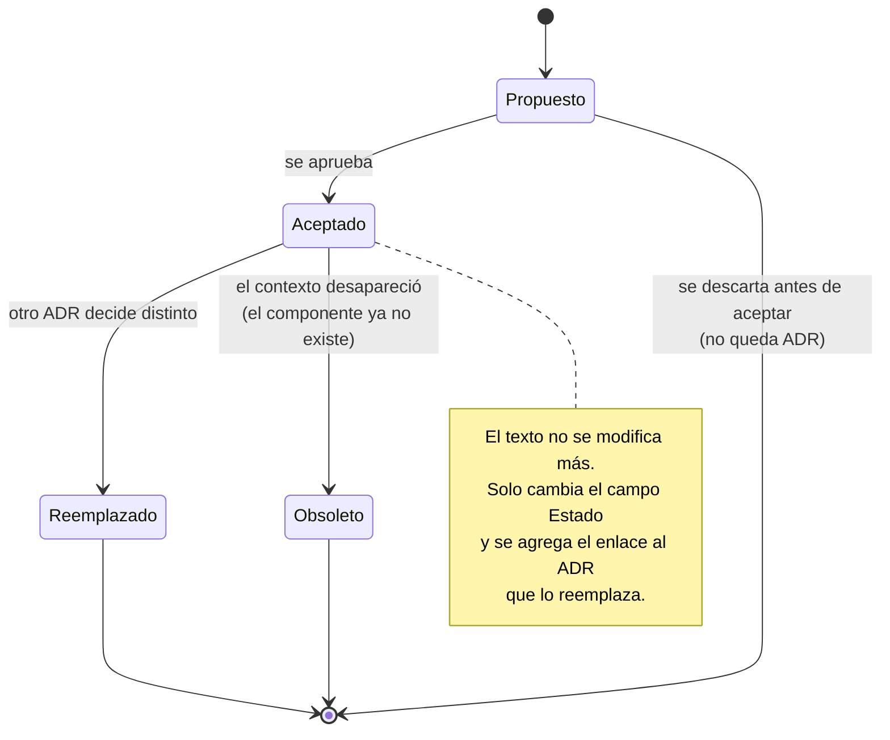

# Architecture Decision Record — `DOC-ADR`

## 1. Resumen ejecutivo

Un ADR es un documento corto que registra una decisión estructural: qué se decidió, en qué situación, qué alternativas se evaluaron y qué consecuencias se aceptan. Uno por decisión, escrito en el momento de tomarla, y no se modifica después: si la decisión cambia, se escribe otro ADR que reemplaza al primero y el original queda como evidencia de lo que se pensaba entonces.

La necesidad que lo origina es concreta y todo equipo con más de un año de vida la reconoce. Alguien pregunta por qué el sistema hace algo de una forma que parece innecesariamente complicada; nadie recuerda; se simplifica; a las tres semanas reaparece el problema que esa complicación resolvía. El ADR es la memoria que evita ese ciclo, y su costo —quince minutos de escritura— es despreciable frente al de repetirlo.

Su valor real no está en la decisión sino en las **alternativas descartadas y en las consecuencias negativas aceptadas**. Un ADR que solo dice qué se eligió no responde la pregunta que el lector futuro trae, que nunca es «qué hicieron» —eso lo ve en el código— sino «por qué no hicieron lo otro».

Lo escribe y lo firma `ACT-03`. `ACT-04` escribe los que surgen de la implementación cuando la decisión desborda su componente; `ACT-06` y `ACT-07` aportan consecuencias que el arquitecto no ve, y sus objeciones se registran en el propio ADR aunque no prosperen.

---

## 2. Definición

### Qué es

Un registro breve —una o dos páginas— de una decisión que afecta la estructura del sistema, sus propiedades no funcionales, sus dependencias o sus interfaces. El formato original es el que propuso **Michael Nygard** en 2011: título, estado, contexto, decisión y consecuencias. Cinco secciones, escritas en prosa, en tiempo presente y en voz activa.

La brevedad es una característica de diseño, no una concesión. Un ADR de diez páginas no se escribe en el momento de decidir, se pospone, y un ADR pospuesto se escribe cuando ya nadie recuerda las alternativas: lo que queda es una justificación retrospectiva de lo que se hizo, que es lo contrario de un registro de decisión.

### Qué problema resuelve

**La amnesia organizativa.** Las decisiones estructurales tienen razones que dejan de ser visibles apenas se implementan. El código muestra el resultado y oculta el motivo, y las restricciones que lo justificaban —un plazo, una limitación del proveedor de entonces, una capacidad que el equipo no tenía— desaparecen del contexto.

**La discusión recurrente.** Sin registro, la misma pregunta vuelve cada seis meses con los mismos argumentos y sin memoria del análisis anterior. Con registro, la conversación empieza donde terminó la última.

**La incorporación.** Un desarrollador nuevo que lee veinte ADR en orden cronológico entiende no solo cómo es el sistema sino cómo llegó a serlo, que es lo que le permite proponer cambios sensatos en lugar de proponer la alternativa que ya se descartó por razones que él desconoce.

**La rendición de cuentas.** Una decisión con nombre y fecha es revisable. Una decisión anónima se defiende sola: nadie sabe quién la tomó y por eso nadie se anima a cambiarla.

### Qué NO es, y con qué se lo confunde

**No es una RFC.** Es la distinción más importante de esta familia y la que más se rompe. La [RFC](RFC.md) es un instrumento de proceso: se abre para recolectar objeciones sobre una propuesta que todavía no es decisión, tiene período de comentarios, y se cierra. El ADR es el registro del resultado: se escribe cuando la decisión ya está tomada, no se debate en su interior, y no se cierra nunca. Una RFC aceptada normalmente produce uno o varios ADR.

| | RFC | ADR |
|---|---|---|
| Momento | Antes de decidir | Al decidir |
| Función | Recolectar objeciones | Registrar el resultado |
| Extensión | Tan larga como haga falta | Una o dos páginas |
| Ciclo | Se abre, se comenta, se cierra | Se acepta y queda |
| Se modifica | Sí, durante los comentarios | No; se reemplaza con otro ADR |
| Puede no prosperar | Sí, se retira o se rechaza | No; si se rechazó, no hay ADR |
| Vida útil | Termina | Permanente |

El síntoma de confusión más habitual es el ADR con una sección de discusión donde tres personas argumentan. Ese documento es una RFC mal etiquetada, y el problema práctico que causa es que el lector futuro no puede saber qué se decidió: encuentra un debate en lugar de un registro.

**No es documentación de diseño.** El ADR registra la decisión, no describe la solución. Cómo quedó la estructura resultante se ve en el [SAD](SAD.md) y en el [HLD](HLD.md); el ADR aporta el eslabón que a esos documentos les falta, que es el porqué.

**No es un ticket ni un commit.** Un ticket describe trabajo a realizar y se cierra; un ADR describe una elección y permanece. El mensaje de commit explica un cambio puntual; el ADR explica una restricción que va a gobernar muchos cambios futuros.

**No es una norma del equipo.** «Usamos `async` en todos los métodos de acceso a datos» es una convención y vive en la guía de desarrollo. «El acceso a datos es asíncrono porque el modelo de hospedaje del contenedor web limita el pool de hilos y las pruebas de carga mostraron agotamiento a 180 usuarios concurrentes» es una decisión con consecuencias, y ahí sí hay ADR.

### Los dos formatos de referencia

#### Michael Nygard

El formato original, y el que esta guía recomienda por defecto. Cinco secciones:

**Título.** Una frase que nombre la decisión, no el problema. «Concurrencia optimista para evitar reservas superpuestas» sirve; «Problema de concurrencia» no, porque el lector que busca en una lista de cuarenta ADR necesita ver la decisión en el índice.

**Estado.** Propuesto, aceptado, reemplazado, obsoleto.

**Contexto.** La situación que obliga a decidir, escrita en presente y de forma neutral: fuerzas en tensión, restricciones, requisitos aplicables. Nygard insiste en la neutralidad —el contexto describe hechos, no argumenta a favor de la opción elegida— y es la parte que peor se escribe, porque quien ya decidió tiende a redactar el contexto de modo que la conclusión parezca inevitable.

**Decisión.** En voz activa y en presente: «Usaremos…», «El sistema valida…». No «se consideró que podría ser conveniente».

**Consecuencias.** Todas: las buenas, las malas y las neutras. Es la sección que separa un ADR real de una justificación, y la que el lector futuro va a leer primero.

#### MADR

**MADR** —*Markdown Any Decision Records*— es una plantilla más estructurada, con campos explícitos para los conductores de la decisión, las opciones consideradas, el resultado con su justificación, y las ventajas y desventajas de cada opción por separado. Se usa cuando la comparación entre alternativas es el corazón del análisis y merece exhibirse en paralelo.

| | Nygard | MADR |
|---|---|---|
| Extensión típica | Media página | Una a dos páginas |
| Alternativas | Dentro del contexto, en prosa | Sección propia, comparadas una a una |
| Fortaleza | Rapidez de escritura; se escribe en el momento | Trazabilidad del análisis comparativo |
| Debilidad | Las alternativas quedan difusas | Fricción mayor; se pospone más |
| Cuándo conviene | Decisión clara con una alternativa obvia | Tres o más opciones con compromisos reales |

Mezclarlos es aceptable siempre que el equipo use uno solo. Un repositorio con ADR en tres formatos distintos pierde la propiedad que los hace útiles, que es poder leer cuarenta en una tarde sin reaprender la estructura cada vez.

### Estados y su ciclo



**Propuesto.** Escrito pero sin aprobar. Es un estado breve: si un ADR lleva semanas en propuesto, lo que hay en curso es una discusión y le corresponde una [RFC](RFC.md).

**Aceptado.** La decisión rige. A partir de acá el texto es inmutable.

**Reemplazado.** Otra decisión posterior lo sustituye. El ADR viejo **no se borra ni se edita**: cambia su estado y se agrega el enlace cruzado en ambas direcciones. La razón es que el histórico es el activo: saber que en 2024 se eligió un monolito modular por tamaño de equipo, y que en 2026 se separó el módulo de disponibilidad por presión de carga, explica el sistema mucho mejor que solo conocer el estado final.

**Obsoleto.** La decisión ya no aplica porque su contexto desapareció, sin que otra la reemplace. Se usa cuando el componente se eliminó o la restricción que la motivaba dejó de existir.

Dos estados que aparecen en algunas implementaciones y esta guía no adopta: *rechazado* —si no se aceptó, no hubo decisión, y el análisis de las alternativas descartadas pertenece a la RFC— y *en revisión*, por la misma razón que *propuesto* debe ser breve.

### Qué merece un ADR y qué no

El criterio operativo: **¿revertir esto en seis meses costaría más que una tarde?** Si sí, hay ADR.

Tres preguntas auxiliares, cualquiera afirmativa lo justifica. ¿La decisión obliga a otro equipo o a otro componente a hacer algo? ¿Compromete un atributo de calidad, sacrificando uno para ganar otro? ¿Alguien va a preguntar por qué dentro de un año?

| Merece ADR | No merece ADR |
|-----------|---------------|
| Elegir render mode de Blazor para las pantallas transaccionales | Elegir el color primario de la interfaz |
| Estrategia de concurrencia para evitar reservas superpuestas | Nombre de una variable local |
| Que la aplicación web no consuma su propia API | Orden de los parámetros de un método |
| Introducir mensajería asíncrona entre dos componentes | Elegir entre `for` y `foreach` |
| Adoptar EF Core en lugar de Dapper | Actualizar EF Core de 8.0.3 a 8.0.4 |
| Que los datos personales no salgan de la región | Nombre de una tabla |
| Aceptar consistencia eventual entre reservas y calendario | La convención de nombres de los tests |
| Publicar los eventos de reserva con patrón de bandeja de salida en lugar de emitirlos tras el commit | El nombre de la tabla de la bandeja |

La última fila ilustra por qué el criterio no es la dificultad técnica sino el costo de revertir. La bandeja de salida agrega una tabla, un despachador y un modo degradado observable, y quitarla después obliga a rehacer el manejo de reintentos de cada consumidor del evento; el [Integration Guide](../40-Diseno/Integration-Guide.md) y el [LLD](../40-Diseno/LLD.md) la dan por decidida y solo describen sus efectos, de modo que sin el registro de la decisión nadie puede reconstruir contra qué alternativa se eligió.

La frontera con las convenciones es la que más discusión genera. Una convención se aplica cientos de veces y su costo de cambio es mecánico; una decisión de arquitectura se aplica una vez y su costo de cambio es estructural. Que el equipo formatee con `dotnet format` es convención; que el acceso a datos sea asíncrono por una restricción medida del modelo de hospedaje es decisión.

### Granularidad

Un ADR, una decisión. La regla se rompe en las dos direcciones y ambas duelen.

**Demasiado grueso.** «ADR-001 — Arquitectura del sistema» que abarca estilo, base de datos, autenticación y despliegue. Cuando seis meses después cambia la base de datos, no se puede reemplazar sin invalidar de paso cuatro decisiones que siguen vigentes. Síntoma: la sección de consecuencias tiene dos páginas.

**Demasiado fino.** Un ADR por cada paquete NuGet incorporado. El repositorio acumula ciento veinte documentos, nadie los lee, y las cinco decisiones que de verdad explican el sistema quedan enterradas. Síntoma: la sección de alternativas dice «no se evaluaron alternativas».

La prueba práctica: **si al reemplazar este ADR quedara invalidada alguna decisión que sigue siendo correcta, es demasiado grueso**. Si el título necesita una conjunción —«y», «además»— probablemente sean dos ADR.

---

## 3. Aplicación por escenario

| Escenario | Naturaleza del ADR | Qué se produce | Confianza |
|-----------|-------------------|----------------|-----------|
| `ESC-1` Desarrollo nuevo | Prescriptiva; se escribe al decidir | Un ADR por decisión estructural, en el momento | Alta |
| `ESC-2` Migración | Doble: ADR del destino que declaran qué reemplazan del origen | ADR nuevos + ADR retrospectivos del origen cuando hacen falta para justificar | Alta en destino |
| `ESC-3` Evaluación con código | Retrospectiva y reconstructiva | ADR retrospectivos de las decisiones evidentes, con la motivación marcada como inferida | Alta en la decisión, baja en la motivación |
| `ESC-4` Evaluación externa | No aplica salvo como conjetura | Nada, o hipótesis explícitas fuera del formato ADR | Muy baja |

### `ESC-1` — Desarrollo de software nuevo

El ADR se escribe en la reunión donde se decide o inmediatamente después, no al final del sprint. La demora es el enemigo del formato: pasadas dos semanas, quien escribe ya no recuerda con precisión las alternativas ni las objeciones, y produce una justificación en lugar de un registro.

El disparador operativo más efectivo que un equipo puede adoptar: cuando una discusión técnica supera los veinte minutos o vuelve por segunda vez, alguien abre un ADR. No para cerrarla en ese momento, sino para que el contexto quede escrito mientras las fuerzas en tensión están frescas.

Los ADR viven en el repositorio del código, no en un wiki. Versionados junto al sistema que gobiernan, revisables en el mismo *pull request* que los implementa. La convención habitual es una carpeta `docs/adr/` con archivos numerados correlativamente, `0012-concurrencia-optimista-reservas.md`, y la numeración nunca se reutiliza aunque un ADR quede obsoleto.

### `ESC-2` — Migración a otro lenguaje o plataforma

Cada ADR del destino debería contestar explícitamente qué decisión del origen reemplaza y si el reemplazo es deliberado o forzado por la plataforma. La distinción importa: migrar de `TempData` de ASP.NET MVC al estado del circuito de Blazor Server es forzado —el mecanismo viejo no existe—; elegir mantener el mismo modelo de autorización por roles cuando la plataforma nueva permitiría políticas es deliberado, y merece justificarse.

El campo adicional que conviene agregar al formato en este escenario:

```markdown
## Relación con el sistema origen
- Decisión equivalente en el origen: <cuál era, dónde se observa>
- Naturaleza del cambio: forzado por la plataforma | deliberado | sin equivalente
- Impacto en la paridad: <afecta el comportamiento observable? cómo se verifica?>
```

La tercera línea conecta el ADR con el criterio de paridad que define `ACT-05`, y evita el defecto característico de las migraciones: una decisión técnica razonable que cambia el comportamiento observable sin que nadie lo note hasta que un usuario lo reporta.

### `ESC-3` — Evaluación de software existente con acceso al código

Se escriben **ADR retrospectivos**: registros de decisiones que ya están tomadas y que nadie documentó. Es una de las tareas más delicadas de la guía, porque la tentación de inventar motivaciones es enorme y el resultado se lee exactamente igual que un ADR legítimo.

#### Qué se puede afirmar y qué no

La evidencia sostiene **la decisión**; casi nunca sostiene **la motivación**.

Encontrar `[Timestamp] public byte[] Version { get; set; }` en la entidad `Reserva`, un índice único sobre `(SalaId, Inicio, Fin)` en las migraciones y un manejador de `DbUpdateConcurrencyException` en el servicio de aplicación permite afirmar sin ninguna duda que el sistema usa concurrencia optimista para prevenir reservas superpuestas. No permite afirmar por qué se eligió eso en lugar de bloqueo pesimista, ni qué alternativas se evaluaron, ni si alguien las evaluó.

La forma correcta de escribirlo separa las dos cosas de manera visible:

```markdown
## Contexto (reconstruido)
El sistema previene reservas superpuestas mediante concurrencia optimista.
**Evidencia**: `Domain/Reserva.cs:34` (`[Timestamp]`),
`Infrastructure/Migrations/20240912_AddReservaConstraints.cs:22` (índice único
`IX_Reserva_Sala_Intervalo`), `Application/ConfirmarReservaHandler.cs:61-78`
(captura de `DbUpdateConcurrencyException` y respuesta 409 con alternativas).

**Motivación: no verificada.** No hay ADR, comentario ni descripción de commit
que explique la elección. El historial muestra que la restricción se agregó en
2024-09-12, cuatro días después del ticket #418 «reservas duplicadas en sala
Directorio», lo que **sugiere** que respondió a un incidente en producción y no
a un diseño previo. No se confirmó con el equipo original.
```

Ese párrafo hace tres cosas que un ADR retrospectivo honesto tiene que hacer: afirma lo observable con su ubicación exacta, marca explícitamente la motivación como no verificada, y ofrece la inferencia disponible declarándola como inferencia y exponiendo el dato que la sostiene, de modo que el lector pueda evaluarla por su cuenta.

#### Reglas del ADR retrospectivo

**El frontmatter lo declara.** `origin: ia-assisted` o `human` según quien lo produjo, `confidence` según la evidencia, y un campo `retrospectivo: true` con la fecha de reconstrucción. Un lector debe poder distinguir de un vistazo un ADR escrito en el momento de decidir de uno reconstruido dos años después.

**Nunca se inventa una alternativa evaluada.** Si no hay rastro de que se consideró bloqueo pesimista, la sección de alternativas dice «no se encontró evidencia de alternativas evaluadas», no enumera las que el reconstructor habría considerado. Escribir «se evaluó bloqueo pesimista y se descartó por contención» cuando eso no consta es falsificar un registro histórico, y la falsificación es indetectable para el lector futuro.

**Las consecuencias sí se pueden completar.** A diferencia de la motivación, las consecuencias son observables: se ven en el código, en los defectos reportados y en el comportamiento del sistema. Un ADR retrospectivo puede afirmar legítimamente «consecuencia: el usuario puede recibir un rechazo tras haber visto la sala disponible; el sistema mitiga ofreciendo alternativas (`ConfirmarReservaHandler.cs:74`)».

**Solo las decisiones evidentes.** Un sistema mediano tiene cientos de decisiones implícitas y reconstruirlas todas es imposible e inútil. Se documentan las que explican la forma del sistema y las que un mantenedor futuro podría revertir por desconocimiento. Entre diez y veinte ADR retrospectivos cubren un sistema de tamaño medio; cien indican que se está documentando implementación en lugar de arquitectura.

**Se declara lo que no se pudo reconstruir.** Un inventario de decisiones evidentes cuya motivación quedó opaca es en sí mismo un entregable, y es lo que permite dirigir las preguntas cuando aparece alguien del equipo original.

### `ESC-4` — Evaluación de un producto solo desde afuera

No aplica. Una decisión de arquitectura no es observable desde afuera: se observan sus consecuencias, y de una consecuencia se derivan varias decisiones posibles. Que la aplicación pierda el trabajo en curso al reconectar es observable; que eso responda a una decisión sobre el estado de sesión, a una limitación del proveedor o a un defecto no reparado es indistinguible desde el navegador.

Lo que corresponde producir es una lista de **comportamientos observados con sus explicaciones posibles**, fuera del formato ADR y con otro nombre —«hipótesis de diseño observadas»— para que nadie confunda una conjetura con un registro. Usar el formato ADR acá contamina el género: si en algún momento se consigue el código y se pasa a `ESC-3`, esos documentos se mezclarían con los retrospectivos y ya no se distinguiría lo verificado de lo conjeturado.

### Variación por contexto

**`CTX-1` — Web y cliente interactivo.** Las decisiones que más ADR generan son las de estado y ciclo de vida: dónde vive el estado de sesión, qué se pierde en una desconexión, qué se renderiza en servidor y qué en cliente. En Blazor el render mode es la decisión estructural por excelencia, y en MAUI lo es la estrategia de sincronización sin conexión. Un ADR de `CTX-1` que no mencione qué ocurre ante interrupción está incompleto.

**`CTX-2` — Backend y servicios.** Predominan las decisiones de contrato y garantía: idempotencia, versionado de API, garantías de entrega, consistencia entre almacenes. Tienen una propiedad que las hace especialmente merecedoras de ADR: son casi irreversibles una vez que hay consumidores externos, porque revertirlas rompe a terceros.

**`CTX-3` — Fullstack.** Aparece la clase de decisión que ningún otro contexto tiene: dónde está la frontera. Qué operación se expone como API y cuál se invoca en proceso, qué validación se duplica deliberadamente en ambos lados, qué lógica vive en el componente. Sin un ADR que lo fije, cada módulo resuelve distinto y el sistema termina con tres criterios conviviendo.

---

## 4. Ejemplos concretos — sistema de reserva de salas

Dos ADR completos, en los dos formatos de referencia. Datos sintéticos.

### 4.1 `ADR-007` — Render mode de Blazor (formato Michael Nygard)

```markdown
---
doc_id: ADR-007
title: Render mode interactive server para las pantallas de reserva
status: aceptado
date: 2026-02-11
deciders: [ACT-03 arquitecto, ACT-04 equipo de producto, ACT-06 SRE]
consulted: [ACT-07 seguridad]
traces: [SAD-reservas, RNF-004, RNF-011, ADR-009]
---

# ADR-007 — Render mode interactive server para las pantallas de reserva

## Estado

Aceptado (2026-02-11).

## Contexto

El sistema de reserva de salas se construye sobre ASP.NET Core 8 con Blazor.
Blazor admite elegir el modo de render por componente: estático en servidor,
interactivo en servidor sobre un circuito SignalR, interactivo en el cliente
mediante WebAssembly, o automático.

Las pantallas centrales del producto son transaccionales y consultan
disponibilidad en tiempo real. La validación de solapamiento debe ser
autoritativa en el servidor (RN-007), de modo que cualquier modo elegido
requiere igualmente una verificación del lado servidor en la confirmación.

Fuerzas en tensión:

- El equipo tiene cuatro desarrolladores con experiencia sólida en C# y ASP.NET
  MVC, y ninguna experiencia en WebAssembly ni en el modelo de despliegue de
  cliente que exige.
- El acceso es exclusivamente desde la red corporativa y desde la VPN, con
  latencia medida entre 12 ms y 40 ms al centro de datos (medición de
  2026-01-28, 30 días de telemetría de red).
- RNF-004 exige que la confirmación de una reserva se complete en menos de
  800 ms en el percentil 95.
- RNF-011 exige que los datos de asistentes no se descarguen al cliente más
  allá de lo que la pantalla muestra.
- Se espera un pico de 400 usuarios concurrentes a las 9:00 de días hábiles.
- La aplicación móvil se construye aparte con .NET MAUI y consume la API
  (ADR-009); el render mode no la afecta.

## Decisión

Las pantallas de reserva, disponibilidad y aprobación usan render mode
**interactive server**. Las pantallas de contenido estático —ayuda, políticas
de uso, listado público de salas— usan render estático en servidor.

No se adopta WebAssembly en esta fase, ni en modo automático.

## Consecuencias

**Positivas.** El código de interfaz corre en el servidor con acceso directo a
los servicios de aplicación, sin necesidad de una capa HTTP intermedia ni de
duplicar modelos de transferencia; esto elimina una fuente habitual de
divergencia entre validación de cliente y de servidor. La carga inicial es
pequeña. Ningún dato de asistentes viaja al cliente más allá de lo renderizado,
lo que satisface RNF-011 por construcción. El equipo trabaja con el modelo
mental que ya tiene.

**Negativas, aceptadas.** El estado de cada sesión vive en la memoria del
servidor durante toda la interacción, lo que impone tres cosas: afinidad de
sesión en el Application Gateway, dimensionamiento de memoria proporcional a
usuarios concurrentes (medido en 210 KB por circuito en la prueba de carga del
2026-02-05, con 400 circuitos ≈ 84 MB por instancia), y un procedimiento de
despliegue que drene circuitos activos en lugar de reciclar el proceso. La
aplicación no funciona sin conexión, ni siquiera para lectura. Una pérdida de
conectividad interrumpe la interacción, y el comportamiento de reconexión es un
estado de interfaz que hay que especificar explícitamente en cada pantalla
transaccional.

**Neutras.** El escalado horizontal requiere agregar instancias antes del pico,
no durante, porque los circuitos existentes no se redistribuyen. Esto se resume
en una regla de operación: la capacidad se provisiona a las 8:30 y no en
respuesta a la carga.

**Riesgo declarado.** Si el producto se abre a usuarios externos con
conectividad no controlada, la premisa de latencia baja deja de sostenerse y
esta decisión debe revisarse. El disparador de revisión es explícito: cualquier
requisito de acceso desde fuera de la red corporativa o de la VPN.

## Alternativas consideradas

**Blazor WebAssembly.** Descartada por el costo de aprendizaje del equipo, por
requerir una API completa antes de tener producto (adelantando trabajo que
ADR-009 posterga) y porque el modelo de descarga de datos al cliente complica
el cumplimiento de RNF-011.

**Render mode automático.** Descartada por producir dos comportamientos
distintos de la misma pantalla según el momento de la sesión, lo que duplica la
superficie de prueba sin un beneficio claro en este perfil de latencia.

**ASP.NET MVC con render en servidor y JavaScript puntual.** Es lo que el equipo
domina, y se descartó porque la interactividad requerida —recálculo de
disponibilidad al cambiar sala u horario, sin recargar— produciría una cantidad
de JavaScript ad-hoc que nadie del equipo mantiene con comodidad.
```

Lo que hace útil a este ADR es que sus consecuencias negativas son **específicas y medidas**. «Consume más memoria en el servidor» no le sirve a nadie; «210 KB por circuito, 400 circuitos, 84 MB por instancia, medido el 2026-02-05» le permite a `ACT-06` dimensionar sin volver a preguntar. Y el riesgo declarado incluye su disparador de revisión, que es lo que convierte un ADR en un documento vivo: alguien sabrá cuándo hay que reabrirlo.

### 4.2 `ADR-012` — Estrategia de concurrencia (formato MADR)

```markdown
---
doc_id: ADR-012
title: Concurrencia optimista con restricción única para evitar reservas superpuestas
status: aceptado
date: 2026-02-24
deciders: [ACT-03 arquitecto]
consulted: [ACT-04 equipo, ACT-05 QA, ACT-08 UX]
informed: [ACT-01 product owner]
traces: [SAD-reservas, RN-007, RF-014, RNF-004, ADR-007]
---

# ADR-012 — Concurrencia optimista con restricción única para evitar reservas superpuestas

## Contexto y planteo del problema

RN-007 establece que una sala no admite reservas superpuestas en el tiempo. La
regla debe cumplirse de forma absoluta: una doble reserva de la sala Directorio
produce un conflicto presencial entre dos reuniones y es el defecto que el
producto no puede permitirse.

El patrón de uso concentra la contención en ventanas cortas y previsibles: entre
las 8:50 y las 9:10 de los días hábiles se registra el 34 % de las reservas
diarias (telemetría del sistema anterior, enero de 2026), y la contención real
se produce sobre las cuatro salas grandes del edificio central. El resto del día
prácticamente no hay competencia por el mismo recurso.

El intervalo entre que un usuario ve la disponibilidad y confirma la reserva
ronda los 40 segundos en la mediana, con un percentil 90 de 3 minutos: el
usuario elige sala, carga asistentes y recién entonces confirma.

¿Qué mecanismo garantiza RN-007 sin degradar la experiencia ni el desempeño en
el pico?

## Conductores de la decisión

- RN-007 debe cumplirse sin excepción, incluso ante fallo parcial o reintento.
- RNF-004: confirmación en menos de 800 ms en el percentil 95.
- El intervalo entre consulta y confirmación es largo y variable.
- La app MAUI reintenta automáticamente ante error de red (ADR-009), de modo
  que la operación debe ser idempotente.
- La solución no debe depender de que la aplicación esté en una sola instancia:
  hay tres instancias web y dos de API escribiendo sobre la misma base.

## Opciones consideradas

1. Concurrencia optimista con `rowversion` más restricción única en base de datos
2. Bloqueo pesimista sobre la sala durante la edición
3. Serialización por cola: toda confirmación pasa por un consumidor único
4. Nivel de aislamiento serializable en la transacción de confirmación

## Decisión

**Opción 1: concurrencia optimista con `rowversion` más restricción única en la
base de datos.**

La entidad `Reserva` lleva una columna `Version` de tipo `rowversion` mapeada
como token de concurrencia en EF Core. La base de datos impone además una
restricción de exclusión sobre `(SalaId, Intervalo)` que rechaza el solapamiento
a nivel de motor, de modo que la garantía no depende del código de aplicación.

La confirmación es idempotente respecto de la cabecera `Idempotency-Key`: un
reintento con la misma clave devuelve la reserva ya creada con 200 en lugar de
crear una segunda con 201.

Ante violación de la restricción, el servicio responde 409 con las tres
alternativas de horario más cercanas para la misma sala, preservando los
asistentes ya cargados en el formulario.

### Justificación

El mecanismo de garantía vive en el motor de base de datos, que es el único
punto por donde pasan todas las escrituras de las cinco instancias de
aplicación. Cualquier solución implementada en la capa de aplicación —incluidas
las opciones 2 y 3— agrega un componente que puede fallar sin que la garantía se
pierda, lo cual es exactamente la propiedad que RN-007 no admite.

El costo del optimismo es el rechazo tardío, y el perfil de contención lo hace
tolerable: con el 34 % de la carga concentrada en veinte minutos sobre cuatro
salas, la tasa de conflicto estimada es del orden del 2 % de las confirmaciones
del pico, y el 409 con alternativas convierte ese rechazo en una interacción de
un clic en lugar de en un reinicio del flujo.

## Ventajas y desventajas de las opciones

### Opción 1 — Concurrencia optimista con restricción única

- Bueno: la garantía la impone el motor; no depende del código ni del número de
  instancias.
- Bueno: sin estado compartido entre instancias, sin componente adicional que
  operar.
- Bueno: desempeño en el camino feliz equivalente a una escritura normal.
- Bueno: resistente al reintento automático de la app MAUI mediante la clave de
  idempotencia.
- Malo: el usuario descubre el conflicto al confirmar, después de haber
  invertido tiempo cargando la reserva.
- Malo: exige un tratamiento de interfaz específico para el 409 en cada cliente
  —Blazor y MAUI—, lo que se especifica en el HLD.

### Opción 2 — Bloqueo pesimista sobre la sala durante la edición

- Bueno: el usuario nunca pierde trabajo; sabe desde el inicio que la sala es
  suya.
- Malo: con una mediana de 40 segundos y un percentil 90 de 3 minutos entre
  consulta y confirmación, el bloqueo inmoviliza salas durante el pico
  exactamente cuando más se las necesita.
- Malo: requiere gestión de expiración y liberación ante abandono, cierre del
  navegador o caída del circuito Blazor, que es precisamente el escenario
  frecuente que ADR-007 introduce.
- Malo: el bloqueo huérfano es un modo de fallo nuevo, con su propio
  procedimiento de operación.

### Opción 3 — Serialización por cola con consumidor único

- Bueno: elimina la concurrencia por construcción; la regla se verifica en un
  único punto secuencial.
- Malo: convierte una operación síncrona en asíncrona, y el usuario deja de
  recibir confirmación inmediata; incompatible con RNF-004 tal como está escrito.
- Malo: el consumidor único es un punto de fallo y un límite de rendimiento
  fijo.
- Malo: complejidad desproporcionada para un dominio con contención baja fuera
  de una ventana de veinte minutos.

### Opción 4 — Aislamiento serializable en la transacción de confirmación

- Bueno: garantía correcta sin estructuras adicionales.
- Malo: la contención se traslada a bloqueos de rango en el motor durante el
  pico, con riesgo de interbloqueo entre transacciones que tocan salas
  distintas en distinto orden.
- Malo: el manejo de reintento por interbloqueo termina siendo equivalente en
  complejidad al manejo del 409, sin la ventaja de poder ofrecer alternativas al
  usuario.

## Consecuencias

El modelo de datos incorpora la columna `Version` y la restricción sobre
`(SalaId, Intervalo)`; ambas quedan documentadas en la vista de datos del SAD.
El manejo del 409 con alternativas se especifica en el HLD y genera los casos de
prueba TC-041 y TC-042, que QA ejecuta con dos clientes concurrentes reales y no
con dobles de prueba: una condición de carrera verificada con simulación no
verifica nada.

Riesgo residual aceptado: si el perfil de contención cambiara —por ejemplo, si
se incorporaran salas de alta demanda con reserva por franjas de 15 minutos— la
tasa de conflicto podría volverse molesta. Disparador de revisión: tasa de 409
sobre confirmaciones superior al 5 % sostenida durante una semana. La métrica se
instrumenta desde el primer despliegue.
```

Los dos ADR ilustran cuándo conviene cada formato. El de render mode tenía una opción claramente favorecida por el contexto y una alternativa seria; Nygard alcanza. El de concurrencia tenía cuatro opciones con compromisos genuinos, y la comparación en paralelo de MADR es lo que permite que un lector futuro evalúe si la decisión sigue siendo correcta bajo condiciones distintas.

---

## 5. Preguntas guía

**Antes de escribirlo.** ¿Esta decisión costaría más de una tarde revertirla dentro de seis meses? ¿Alguien de fuera de mi componente tiene que convivir con ella? ¿Es una decisión o es una convención?

**Sobre el contexto.** ¿Está escrito de forma que alguien que discrepe con la decisión reconocería los hechos como suyos? Si el contexto solo admite una conclusión, probablemente se escribió después de decidir y para justificar.

**Sobre las alternativas.** ¿Están las que se evaluaron de verdad, o las que quedan bien? ¿Se dice por qué se descartó cada una, con el criterio concreto? Una alternativa descartada «por complejidad» sin decir qué complejidad no aporta nada.

**Sobre las consecuencias.** ¿Hay consecuencias negativas escritas? Si no las hay, o la decisión es trivial o el ADR es propaganda. ¿Están cuantificadas donde se puede cuantificar?

**Sobre la revisión.** ¿Bajo qué condición esta decisión dejaría de ser correcta? ¿Está escrito ese disparador?

**Sobre la granularidad.** Si mañana hay que reemplazar este ADR, ¿quedaría invalidada alguna decisión que sigue siendo buena? ¿El título necesita una conjunción?

**Específicas de `ESC-3`.** ¿Qué parte de esto es evidencia y qué parte es inferencia? ¿Está la motivación marcada como no verificada donde corresponde? ¿Estoy inventando una alternativa que nadie evaluó?

---

## 6. Criterios de calidad y antipatrones

### Qué distingue un ADR bueno de uno pobre

Se reconoce por una prueba: **alguien que discrepa con la decisión reconoce el contexto como una descripción justa de la situación**. Si el contexto está escrito de modo que la conclusión parece la única posible, no es un registro sino una defensa.

Las propiedades que sostienen esa prueba:

**Es corto.** Una o dos páginas. Se escribe en el momento, y lo que no se puede escribir en veinte minutos se pospone hasta perder el contexto.

**Es inmutable una vez aceptado.** El texto no se toca; cambia el estado y se agregan enlaces cruzados. Editar un ADR aceptado destruye el histórico, que es su razón de ser.

**Tiene alternativas reales.** Con el criterio de descarte explícito, y no las tres opciones obvias que nadie consideró en serio.

**Tiene consecuencias negativas.** Escritas, específicas y, donde se puede, medidas.

**Tiene fecha y firmantes.** Una decisión anónima no es revisable.

**Tiene disparador de revisión.** Bajo qué condición habría que reabrirla.

**Está en el repositorio.** Versionado junto al código que gobierna, revisable en el mismo *pull request*.

### Antipatrones

**El ADR-justificación.** Escrito después de implementar, con el contexto redactado para que la decisión tomada parezca inevitable y con alternativas de relleno. Se detecta porque las consecuencias son todas positivas. No registra nada; ratifica.

**El ADR-debate.** Contiene la discusión con posiciones de tres personas en lugar del resultado. Es una [RFC](RFC.md) mal etiquetada, y deja al lector futuro sin saber qué se decidió.

**El ADR-manifiesto.** «ADR-001 — Arquitectura general del sistema», con veinte decisiones dentro. Imposible de reemplazar por partes; cuando una queda obsoleta, arrastra a las demás.

**El ADR-cambiante.** Alguien edita el texto de un ADR aceptado porque la decisión evolucionó. Destruye el histórico y produce el peor resultado posible: un documento que afirma haberse decidido en 2024 algo que se decidió en 2026.

**El ADR sin consecuencias negativas.** Toda decisión estructural sacrifica algo. Si el documento no dice qué, o el autor no lo sabe —y entonces la decisión está poco analizada— o no quiso escribirlo.

**El ADR huérfano.** Sin fecha, sin firmante, sin enlaces al SAD ni a los requisitos. No se puede evaluar si sigue vigente ni a quién preguntarle.

**El ADR de convención.** Documenta la nomenclatura de variables o el estilo de indentación. Diluye el conjunto: cuando hay ochenta ADR y setenta son convenciones, nadie lee ninguno.

**El ADR retrospectivo con motivación inventada.** Específico de `ESC-3` y el más dañino de todos, porque es indetectable. Un lector futuro no tiene forma de saber que «se evaluó bloqueo pesimista y se descartó por contención» es una conjetura del auditor y no un hecho del equipo original. La regla que lo evita no admite excepción: la motivación no verificada se marca como no verificada.

**El ADR que nadie enlaza.** Existe en `docs/adr/` y ningún documento lo referencia. El [SAD](SAD.md) debe tener su tabla índice de decisiones, y cada componente cuya forma responde a un ADR debería mencionarlo. Un ADR que solo se encuentra buscando en la carpeta no se encuentra.

---

## 7. Anexo — Plantillas comentadas

### Formato Michael Nygard

```markdown
---
doc_id: ADR-<nnn>                 # Correlativo, nunca reutilizado
title: <la decisión, no el problema>   # ¿Se entiende en el índice sin abrir el archivo?
status: propuesto | aceptado | reemplazado | obsoleto
date: AAAA-MM-DD                  # Fecha de la decisión, no de la escritura si difieren
deciders: [<quiénes decidieron>]  # ¿A quién se le pregunta dentro de dos años?
consulted: [<quiénes aportaron>]  # Especialmente ACT-06 y ACT-07 si hay impacto
supersedes: ADR-<nnn>             # Si reemplaza a otro; enlace en ambas direcciones
superseded_by: ADR-<nnn>          # Se agrega al ser reemplazado; único campo editable
retrospectivo: true               # Solo en ESC-3. ¿Se escribió al decidir o al auditar?
traces: [SAD-<sistema>, RF-<nnn>, RNF-<nnn>]
---

# ADR-<nnn> — <título>

## Estado
<Estado y fecha. Si fue reemplazado, enlace al ADR que lo sustituye.>

## Contexto
¿Qué situación obliga a decidir? Hechos, restricciones y fuerzas en tensión, en
presente y de forma neutral. Prueba de neutralidad: ¿alguien que prefiera otra
opción reconocería esta descripción como justa?
En ESC-3: cada afirmación con su evidencia (archivo:línea), y la motivación
marcada explícitamente como no verificada si no consta en ningún lado.

## Decisión
¿Qué se decide? Voz activa, presente: «Usaremos…», «El sistema valida…».
Una decisión por ADR. Si necesita una conjunción, probablemente sean dos.

## Consecuencias
¿Qué pasa a partir de ahora? Positivas, negativas y neutras, cuantificadas donde
se pueda. Si no hay ninguna negativa, falta análisis.
Incluir el riesgo residual y, sobre todo, el disparador de revisión: ¿bajo qué
condición esta decisión dejaría de ser correcta?

## Alternativas consideradas
¿Qué más se evaluó y por qué se descartó, con el criterio concreto?
En ESC-3, si no hay evidencia de que se evaluaran alternativas, escribir
«no se encontró evidencia de alternativas evaluadas». No inventarlas.
```

### Formato MADR

Para decisiones con tres o más opciones que compiten de verdad.

```markdown
---
doc_id: ADR-<nnn>
title: <la decisión>
status: propuesto | aceptado | reemplazado | obsoleto
date: AAAA-MM-DD
deciders: [...]
consulted: [...]
informed: [...]
traces: [...]
---

# ADR-<nnn> — <título>

## Contexto y planteo del problema
¿Cuál es la situación y qué pregunta hay que responder? Cerrar con la pregunta
explícita: si no se puede formular en una línea, el problema no está claro.

## Conductores de la decisión
¿Qué criterios gobiernan la elección? Requisitos aplicables, restricciones,
atributos de calidad en juego. Son los ejes contra los que se comparan las
opciones; si una opción gana en un eje que no está acá, falta un conductor.

## Opciones consideradas
1. <opción>
2. <opción>
3. <opción>

## Decisión
**Opción elegida: <cuál>.**

### Justificación
¿Por qué esta y no las otras, contra los conductores enunciados arriba?

## Ventajas y desventajas de las opciones
### <Opción 1>
- Bueno: <por qué, contra qué conductor>
- Malo: <por qué, contra qué conductor>
### <Opción 2>
...

## Consecuencias
¿Qué cambia en el sistema, en el proceso y en la operación? ¿Qué riesgo residual
se acepta y bajo qué condición se revisa esta decisión?
```

El campo `superseded_by` es el único que se edita en un ADR aceptado, y esa excepción es lo que hace posible la inmutabilidad del resto: sin ella, la única forma de indicar que una decisión fue reemplazada sería tocar el texto.
