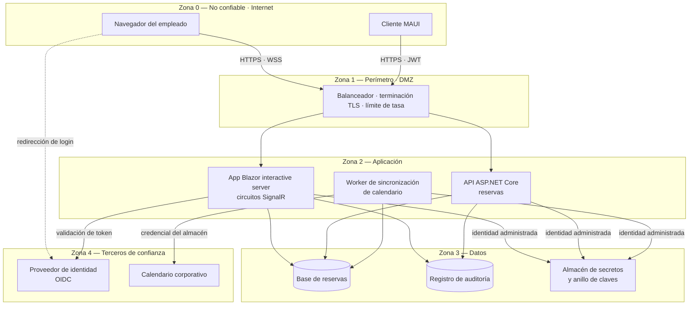

# Arquitectura de seguridad — `DOC-SECARQ`

## 1. Resumen ejecutivo

La arquitectura de seguridad fija la postura de seguridad del sistema: quién es cada quien, qué puede hacer, dónde viven los límites de confianza, cómo viajan y se guardan los datos sensibles, dónde se custodian los secretos y qué queda registrado. Es un documento prescriptivo y normativo, hermano del [SAD](SAD.md) y sujeto a la misma disciplina de decisión: cada control exigido se sostiene en un riesgo identificado y en un atributo de calidad concreto, no en una costumbre corporativa.

Le sirve al arquitecto, que necesita saber qué restricciones estructurales impone la seguridad antes de dibujar componentes; al desarrollador, que necesita saber qué política de autorización aplica a cada operación y de dónde saca la cadena de conexión; a DevOps, que debe materializar zonas de red, certificados y rotación de secretos; y a QA, que debe convertir cada control en un caso de prueba negativo. Su relación con el [Threat Model](Threat-Model.md) es de ida y vuelta permanente: la arquitectura propone controles, el modelo de amenazas los somete a la pregunta de qué pasa si fallan, y las respuestas vuelven acá como controles nuevos o como riesgo residual aceptado con nombre y fecha.

Un documento de arquitectura de seguridad que no puede responder «¿qué operación exactamente exige el rol de administrador de instalaciones, y dónde está escrito?» no está describiendo una postura: está describiendo una intención.

---

## 2. Definición

### Qué es

Un documento que especifica la postura de seguridad exigida a un sistema, expresada en decisiones verificables sobre siete ejes: identidad, autenticación, autorización, zonas de confianza, gestión de secretos, protección de datos —en tránsito y en reposo— y auditoría. Cada eje se resuelve con controles nombrados, con su alcance, su responsable de implementación y el modo en que se verifica que están activos.

El nivel de detalle sigue la misma regla que el resto de la familia de arquitectura: se documenta lo estructural y lo que ata al equipo. «Toda operación de escritura sobre reservas exige un principal autenticado con claim de tenant coincidente» es arquitectura de seguridad. «El método `ConfirmarReservaAsync` valida el parámetro `salaId` con `Guid.TryParse`» es diseño detallado y vive en el [LLD](../40-Diseno/LLD.md).

### Qué problema resuelve

Evita que la seguridad se decida por acumulación. Sin este documento, la postura del sistema termina siendo la suma no intencional de lo que cada desarrollador consideró prudente en el momento de escribir su endpoint: tres esquemas de autorización distintos, dos lugares donde viven los secretos, un módulo con auditoría y cuatro sin ella. El resultado no es inseguro por una decisión mala sino por la ausencia de decisión, que es el modo más frecuente en que los sistemas de línea de negocio fallan.

También resuelve un problema de coordinación. La seguridad es el atributo de calidad —en los términos de ISO/IEC 25010— que más responsabilidades cruza: identidad la resuelve el proveedor corporativo, el cifrado en tránsito lo termina de resolver el balanceador, los secretos los administra la plataforma, la autorización la implementa la aplicación y la auditoría la consume alguien que no está en el equipo. Un documento único con dueño único es lo que impide que cada parte suponga que la otra se ocupó.

### Qué NO es, y con qué se lo confunde

**No es el threat model.** La confusión es la más frecuente y la que más daño hace, porque los dos documentos hablan de lo mismo con métodos opuestos. La arquitectura de seguridad es **prescriptiva**: parte de los activos y de la política, y declara los controles que el sistema DEBE tener —en el sentido de RFC 2119—. El [Threat Model](Threat-Model.md) es **analítico e iterativo**: parte del sistema tal como está diseñado, lo recorre elemento por elemento y pregunta qué puede salir mal, quién tendría motivo y capacidad para provocarlo, y qué se hace al respecto. Uno define controles; el otro los justifica y, sobre todo, descubre los que faltan.

La consecuencia práctica de la distinción está en el orden de trabajo. Si se escribe solo la arquitectura de seguridad, se obtiene una lista de controles razonables que nadie sometió a contradicción, y el sistema queda protegido contra las amenazas que el autor ya tenía en la cabeza. Si se escribe solo el threat model, se obtiene un catálogo de amenazas sin una postura coherente donde alojar las mitigaciones, y cada amenaza se resuelve con un parche local. Ninguno sustituye al otro y ninguno se escribe una sola vez.

| Dimensión | Arquitectura de seguridad | Threat Model |
|-----------|---------------------------|--------------|
| Naturaleza | Prescriptiva, normativa | Analítica, exploratoria |
| Punto de partida | Activos y política | Diseño y flujos de datos |
| Pregunta | ¿Qué controles exige el sistema? | ¿Qué puede salir mal y quién lo haría? |
| Producto | Postura: controles, zonas, políticas | Amenazas, mitigaciones, riesgo residual |
| Cadencia | Se revisa al cambiar la estructura | Se rehace ante cada cambio de superficie |
| Falla típica | Controles sin amenaza que los motive | Amenazas sin postura donde alojarlas |

**No es un pentest.** El pentest es una actividad de verificación empírica, ejecutada contra un sistema desplegado y en un momento dado, que produce evidencia de explotabilidad. La arquitectura de seguridad produce el criterio contra el cual ese pentest se juzga: sin postura declarada, un informe de pentest solo dice qué encontró quien lo hizo, no qué faltaba. Cronológicamente van al revés de como suele creerse: la postura primero, la verificación después.

**No es una auditoría de cumplimiento.** El cumplimiento responde a un marco externo —normativa sectorial, política corporativa, requisitos contractuales— y su pregunta es si existe evidencia documental de que cierto control está implementado. Se puede cumplir enteramente un marco y ser vulnerable, y se puede tener una postura sólida y no cumplir, porque el marco pedía un artefacto que nadie produjo. La arquitectura de seguridad puede tomar de un catálogo como NIST SP 800-53 la organización por familias de control —control de acceso, identificación y autenticación, auditoría y rendición de cuentas, protección de sistemas y comunicaciones— sin convertirse por eso en un ejercicio de cumplimiento.

**No es el capítulo de seguridad del SAD.** El [SAD](SAD.md) enuncia la posición y las restricciones estructurales que la seguridad impone —«la aplicación no accede a la base de datos con credenciales de usuario final»—; este documento desarrolla la postura completa. Cuando la sección de seguridad del SAD empieza a listar políticas de autorización, corresponde extraerla acá y dejar un enlace.

**No es la especificación de controles de plataforma.** Reglas de firewall, grupos de seguridad de red y configuración del proveedor de nube son la materialización de las zonas de confianza que este documento define, y viven en la documentación operativa. Acá se dice qué zonas hay y qué tráfico se permite entre ellas; allá, con qué recurso concreto se implementa.

Los modelos de arquitectura que condicionan dónde puede alojarse un control —capas, hexagonal, microservicios— no se desarrollan en este documento: están en [Modelos de arquitectura](../90-Modelos-de-Arquitectura/README.md).

---

## 3. Aplicación por escenario

| Escenario | Naturaleza del documento | Fuente principal | Riesgo dominante |
|-----------|--------------------------|------------------|------------------|
| `ESC-1` | Prescriptiva: decide la postura antes del código | Requisitos no funcionales del [SRS](../20-Analisis/SRS.md), política corporativa | Postura declarada que nadie implementa |
| `ESC-2` | Doble: describe la postura vigente y decide la destino | Configuración y código del sistema origen | Migrar el mecanismo y perder la política |
| `ESC-3` | Reconstructiva: documenta la postura real, no la deseada | Código, configuración, esquema, despliegue | Documentar la intención del código en lugar de su efecto |
| `ESC-4` | Inferencial: hipótesis sobre la postura observable | Comportamiento del producto como usuario legítimo | Afirmar controles que solo se supusieron |

### `ESC-1` — Desarrollo nuevo

La postura se decide antes de que exista superficie de ataque, lo cual es la única oportunidad barata de tomar las decisiones que después son estructurales: si la identidad la resuelve un proveedor externo por OIDC o se implementa en casa, si la autorización es por rol o por política, si el multi-tenant se aísla por fila o por base. Cambiar cualquiera de las tres en el mes ocho cuesta una reescritura, y por eso cada una merece su [ADR](ADR.md).

El orden que funciona empieza por el inventario de activos y no por el catálogo de controles. Primero se enumera qué hay que proteger y qué pasa si se pierde, se altera o se filtra; recién con eso sobre la mesa se eligen controles proporcionados. Invertir el orden produce sistemas que cifran el nombre de las salas y dejan los correos de los asistentes en un log en claro.

Este escenario es también donde la relación con el [Threat Model](Threat-Model.md) rinde más: la primera pasada de modelado se hace sobre el diseño de alto nivel, cuando mover un límite de confianza todavía es editar un diagrama.

### `ESC-2` — Migración

Aparecen dos posturas y hay que mantenerlas separadas en el documento. La del origen es un hallazgo, se reconstruye con el método de `ESC-3` y sirve para una sola cosa que importa mucho: fijar qué controles existen hoy, incluidos los implícitos que nadie documentó y de los que el sistema depende. La del destino es una decisión y se escribe con el método de `ESC-1`.

Entre ambas hace falta la pieza que casi siempre falta, que es la tabla de equivalencias de controles: qué mecanismo del origen se reemplaza por cuál del destino, y qué control se decide deliberadamente no migrar. Una migración de ASP.NET MVC con autenticación por formularios hacia ASP.NET Core con OIDC no traslada un mecanismo: cambia el modelo de identidad completo, y con él la vida de la sesión, el manejo del cierre de sesión y el lugar donde se toma la decisión de autorización. Declarar paridad funcional sin declarar paridad de postura es el modo habitual de perder controles en el camino.

El caso más peligroso es el control que vivía fuera del código. Sistemas viejos que confiaban en que solo se accedía desde la red interna arrastran, al migrar a una plataforma expuesta, endpoints que nunca tuvieron autorización porque la red hacía de control. Ese control implícito no aparece en ningún archivo y solo se detecta preguntando por qué el endpoint no valida nada.

### `ESC-3` — Evaluación con acceso al código

La postura se reconstruye desde evidencia y toda afirmación se ancla a un archivo. El recorrido productivo, en un sistema .NET, es este:

**Autenticación.** El registro de esquemas en el arranque de la aplicación —`AddAuthentication`, `AddOpenIdConnect`, `AddJwtBearer`, `AddCookie`— dice qué mecanismos existen y cuál es el predeterminado. La configuración de la cookie de autenticación revela el tiempo de expiración, si es deslizante, y las banderas `HttpOnly`, `SecurePolicy` y `SameSite`. Un esquema registrado no implica que se use: hay que ver el pipeline.

**Autorización.** Los atributos `[Authorize]` y `[AllowAnonymous]` sobre controladores, páginas y componentes; las políticas registradas con `AddAuthorization` y sus requisitos; los `AuthorizationHandler` propios, donde suele vivir la lógica real. En Blazor, además, `<AuthorizeView>` en el marcado y el `AuthorizeRouteView`. Un hallazgo que conviene buscar explícitamente: componentes que ocultan un botón con `<AuthorizeView>` pero cuyo servidor no revalida la operación. La interfaz oculta; no autoriza.

**Pipeline de middleware.** El orden de `UseAuthentication`, `UseAuthorization`, `UseHttpsRedirection`, `UseHsts` y `UseCors` determina qué se aplica y a qué. Middleware propio insertado antes de la autenticación es un hallazgo de primer orden. La política CORS con origen comodín junto a credenciales, también.

**Configuración.** Los archivos `appsettings.json` y sus variantes por entorno, comparados entre sí: la diferencia entre `appsettings.Development.json` y el de producción suele contener la postura real. Se busca `DetailedErrors`, niveles de log, banderas de características y cualquier valor que relaje un control en desarrollo y que alguien pueda haber promovido sin querer.

**Cadenas de conexión y secretos.** Dónde están: literales en el repositorio, `appsettings`, variables de entorno, `dotnet user-secrets`, un almacén gestionado. Qué identidad usan: una cuenta con permisos amplios o una identidad administrada con permisos acotados. El historial de commits es fuente legítima acá, porque un secreto rotado sigue expuesto en el historial si nunca se revocó.

**Protección de datos.** La configuración de `DataProtection`: dónde persiste el anillo de claves y si está protegido en reposo. En una aplicación con más de una instancia, un anillo no compartido invalida cookies al cambiar de instancia; un anillo compartido sin protección es material de suplantación.

**Auditoría.** Qué operaciones dejan registro, con qué campos, dónde se almacena y cuánto se retiene. Se verifica en el código, no en la afirmación de que existe auditoría.

Todo lo que no se pudo verificar se marca. La forma que esta guía usa es una anotación explícita en la propia fila o párrafo —`[no verificado: no hay acceso a la configuración del entorno productivo]`—, porque un hueco silencioso se lee como ausencia de control y un hueco declarado se lee como pregunta pendiente. Son cosas distintas y el lector no puede distinguirlas si el autor no lo dice.

### `ESC-4` — Evaluación solo desde afuera

Lo observable como usuario legítimo alcanza para una hipótesis de postura, nunca para una afirmación sobre controles internos.

| Observable | Qué sugiere | Confianza |
|------------|-------------|-----------|
| Cabeceras de respuesta (`Strict-Transport-Security`, `Content-Security-Policy`, `X-Content-Type-Options`) | Madurez de la configuración de plataforma | Alta sobre la cabecera; baja sobre lo que implica del resto |
| Atributos de la cookie de sesión visibles en el navegador | Política de sesión y protección ante robo de cookie | Alta sobre el atributo; media sobre la vida real de la sesión |
| Flujo de inicio de sesión: redirección a otro dominio, parámetros de la URL | Uso de un proveedor de identidad federado | Media-alta si la redirección y los parámetros son los de un flujo estándar |
| Presencia y forma del segundo factor | Existencia de autenticación multifactor | Alta si se ofrece; nula sobre si es obligatorio para otros roles |
| Mensajes de error en el inicio de sesión | Si se distingue usuario inexistente de contraseña incorrecta | Alta sobre el mensaje; media sobre si hay enumeración real |
| Política de contraseñas publicada en el registro | Requisitos mínimos exigidos | Alta sobre lo declarado; nula sobre lo verificado en servidor |
| Comportamiento tras varios intentos fallidos con la cuenta propia | Existencia de bloqueo o limitación de tasa | Media; el umbral observado puede no ser el configurado |

La regla de conducta es la misma que fija [Escenarios](../00-Marco-de-Referencia/Escenarios.md) y acá se vuelve más estricta que en cualquier otro artefacto de la guía: **no se prueban controles ajenos**. Observar que el formulario de registro exige diez caracteres es relevamiento; enviar contraseñas cortas variando el patrón para ver dónde corta es prueba de control. Ver que la sesión expira es observación; manipular la cookie propia para ver si el servidor la valida es prueba de control. Intentar acceder a un recurso ajeno cambiando un identificador en la URL —aunque sea «solo para confirmar»— es acceso no autorizado, con consecuencias legales que no dependen de la intención ni del daño causado, y con el agravante de que un control que sí funcionaba deja registro del intento.

Cuando la evaluación necesita ir más allá de lo observable, la salida es contractual y no técnica: se pide acceso, se acuerda alcance por escrito y se pasa a `ESC-3`, o se contrata una prueba de intrusión con autorización explícita del titular del sistema. El informe debe registrar la fecha, la versión observada y la configuración de la cuenta usada, porque una postura observada sin fecha no es reproducible.

### Variación por contexto

En `CTX-1` el peso se desplaza a la sesión y a la superficie del cliente: política de cookies, protección contra falsificación de solicitud entre sitios, política de seguridad de contenido, y todo lo que un componente expone al navegador. Con Blazor en modo *interactive server* aparece un tema propio que no existe en las otras variantes y que se desarrolla en la sección 4: la vida del circuito frente a la vida de la autenticación.

En `CTX-2` el centro es el contrato: qué esquema de credencial acepta cada endpoint, qué claims son obligatorios, cómo se validan audiencia y emisor de un token, qué pasa con un token válido pero revocado, y cómo se limita la tasa por consumidor. La autorización se documenta por operación en la especificación de API, y esa especificación es el lugar donde un control ausente se ve de un vistazo.

En `CTX-3` el problema es la costura. La misma regla de negocio se evalúa en el componente que decide mostrar un botón y en el servicio que ejecuta la operación, y hay que declarar cuál de las dos es la autoritativa. La respuesta correcta es siempre la del servidor, y el valor de escribirla está en que obliga a revisar dónde se está confiando en la interfaz. La traza vertical que exige [Contextos](../00-Marco-de-Referencia/Contextos.md) aplica también a los controles: un requisito de seguridad debe poder seguirse desde el enunciado hasta la política que lo implementa y el caso de prueba negativo que lo verifica.

---

## 4. Ejemplos concretos

Los ejemplos usan el dominio recurrente de la guía —un sistema de reserva de salas— sobre las tecnologías de referencia: ASP.NET Core como plataforma, Blazor con render mode *interactive server* para la aplicación interna, ASP.NET MVC en el sistema legado que se migra y .NET MAUI con MVVM para el cliente móvil de consulta. Los datos son sintéticos.

### Inventario de activos

La tabla de activos es la primera del documento y la que ordena todo lo demás. Sin ella, los controles no tienen contra qué justificarse.

| ID | Activo | Clasificación | Qué pasa si se compromete | Control dominante |
|----|--------|---------------|---------------------------|-------------------|
| `AST-01` | Identidades y sesiones de empleados | Crítico | Suplantación de cualquier usuario, incluidos administradores | Identidad federada, sesión corta, MFA para roles elevados |
| `AST-02` | Datos personales de asistentes (nombre, correo) | Alto | Exposición de datos personales; obligación de notificación | Cifrado en reposo, minimización, auditoría de lectura masiva |
| `AST-03` | Agenda de reservas | Medio-alto | Revela estructura, proyectos y presencia física de la organización | Autorización por tenant, límite de consulta agregada |
| `AST-04` | Credenciales de integración con el calendario corporativo | Crítico | Acceso a calendarios de toda la organización | Almacén gestionado, identidad administrada, rotación |
| `AST-05` | Registro de auditoría | Alto | Encubrimiento de acciones; pérdida de no repudio | Escritura sin borrado, retención definida, acceso restringido |
| `AST-06` | Anillo de claves de protección de datos | Crítico | Falsificación de cookies y tokens de la aplicación | Almacén compartido y cifrado, acceso solo por identidad de la app |
| `AST-07` | Configuración de salas y equipamiento | Bajo | Desorganización operativa | Autorización de escritura por rol |

El activo `AST-06` es el que más se olvida y el de mayor impacto por unidad de descuido: quien controla el anillo de claves de `DataProtection` puede emitir cookies válidas para cualquier usuario, y ningún control de autenticación posterior lo detecta.

### Roles y permisos

Cuatro roles cubren el dominio. La tabla es la fuente de la que se derivan las políticas de autorización, y su valor está en las celdas que dicen «no».

| Operación | Empleado | Recepción | Administrador de instalaciones | Integración de calendario |
|-----------|----------|-----------|-------------------------------|---------------------------|
| Ver disponibilidad de salas | Sí | Sí | Sí | Sí (solo lectura) |
| Crear reserva a nombre propio | Sí | Sí | Sí | Sí (en nombre del titular del evento) |
| Crear reserva a nombre de otro | No | Sí (con motivo registrado) | Sí | No |
| Cancelar reserva propia | Sí | Sí | Sí | Sí (solo las que creó) |
| Cancelar reserva ajena | No | Sí (con motivo registrado) | Sí | No |
| Ver asistentes de una reserva ajena | No | Solo nombre | Sí | No |
| Alta y baja de salas | No | No | Sí | No |
| Cambiar reglas de aforo y horarios | No | No | Sí | No |
| Consultar el registro de auditoría | No | No | Solo lectura | No |
| Exportar la agenda completa | No | No | Sí (con registro de la exportación) | No |

Tres decisiones quedan fijadas por esta tabla y merecen explicitarse porque no se deducen de ella. La primera: el rol de recepción puede actuar en nombre de terceros pero no puede ver la lista completa de asistentes, porque su necesidad operativa es coordinar espacios y no conocer participantes; es una aplicación directa de mínimo privilegio sobre `AST-02`. La segunda: la integración de calendario es un principal de servicio con permisos estrictamente menores que los de cualquier humano, lo cual contradice la práctica habitual de darle a la cuenta de integración permisos amplios «porque es un sistema». La tercera: el administrador de instalaciones no puede modificar ni borrar el registro de auditoría, porque un rol que audita sus propias acciones no produce no repudio.

La operación de exportación aparece en la tabla por una razón que no es funcional: es la única que convierte un permiso de lectura legítimo en una extracción masiva de `AST-02`, y por eso se autoriza aparte y se audita aparte.

### Decisiones de identidad

**Proveedor y protocolo.** La autenticación se delega en el proveedor de identidad corporativo mediante OpenID Connect con flujo de código de autorización y PKCE. La aplicación no almacena contraseñas y por lo tanto queda fuera de su alcance la política de complejidad, el bloqueo por intentos y el segundo factor, que pasan a ser responsabilidad del proveedor y quedan documentados como dependencia externa. El costo de la decisión es real y hay que registrarlo en el [ADR](ADR.md) correspondiente: la disponibilidad del sistema queda acoplada a la del proveedor, y el cierre de sesión pasa a ser un problema de dos partes.

**Cookies frente a tokens.** La decisión no es de gusto sino de superficie de consumo, y el criterio es dónde se termina la sesión.

| Superficie | Credencial de sesión | Razón |
|------------|---------------------|-------|
| Aplicación Blazor interactive server | Cookie de autenticación, `HttpOnly`, `Secure`, `SameSite=Lax` | El navegador nunca ve un token; el robo por script queda fuera de alcance |
| API consumida por el cliente MAUI | Token de acceso JWT de vida corta, con refresco | No hay navegador ni cookie; el cliente custodia la credencial |
| Integración de calendario | Credenciales de cliente contra el proveedor, sin usuario | Es un principal de servicio, no una sesión humana |

El token de acceso se valida por emisor, audiencia, vigencia y firma en cada solicitud. La revocación anticipada no se resuelve con el token en sí —un JWT válido lo sigue siendo hasta expirar— sino acotando su vida a quince minutos y verificando el estado de la cuenta al refrescar. Esa es la clase de compromiso que corresponde escribir explícitamente, porque el hueco existe y quien lo lea después necesita saber que fue una elección.

**El circuito de Blazor Server y la sesión.** En modo *interactive server*, el estado del componente vive en el servidor y el navegador mantiene un circuito SignalR sobre WebSocket. La autenticación se establece al abrir la conexión y el `AuthenticationState` del circuito no se reevalúa solo porque la cookie haya expirado: el circuito puede sobrevivir a la sesión que lo autenticó. Las consecuencias documentables son cuatro.

El circuito debe tener un límite de vida propio, independiente de la cookie, tras el cual se fuerza la reautenticación. Las operaciones sensibles —cancelar reservas ajenas, exportar la agenda, cambiar reglas de aforo— revalidan la autorización en el servicio del lado servidor en el momento de ejecutarse, y no confían en el estado que el circuito trajo al conectarse. La reconexión del circuito, que [Contextos](../00-Marco-de-Referencia/Contextos.md) trata como un estado de interfaz, es también un momento de seguridad: al reconectar se verifica que el principal sigue siendo válido antes de restaurar nada. Y el estado del circuito es memoria del servidor asociada a un usuario, lo que lo convierte en un recurso agotable y en vector de denegación de servicio; el límite de circuitos concurrentes por usuario es un control, no una configuración de rendimiento.

`<AuthorizeView>` controla lo que se muestra. No controla lo que se ejecuta. Todo componente que oculte una acción por rol tiene su contraparte de autorización en el servicio invocado, y esa duplicación es deliberada.

### Gestión de secretos

| Secreto | Dónde vive | Cómo llega a la aplicación | Rotación |
|---------|-----------|---------------------------|----------|
| Cadena de conexión a la base de reservas | No existe como secreto | Identidad administrada de la plataforma; la aplicación se autentica sin credencial | No aplica |
| Credencial de la integración de calendario | Almacén de secretos gestionado | Lectura al arranque y refresco periódico, nunca en el repositorio | Cada 90 días, automatizada |
| Clave de firma de tokens de la API | Almacén de secretos gestionado | Referencia por identificador; la clave no sale del almacén | Con solapamiento de dos claves válidas |
| Anillo de claves de `DataProtection` | Almacén compartido entre instancias, cifrado en reposo | Configuración de arranque | Automática por la plataforma |
| Credenciales de desarrollo local | `dotnet user-secrets`, fuera del árbol del repositorio | Solo entorno local, valores distintos de producción | No aplica |

La regla que ordena la tabla: un secreto que la aplicación no necesita conocer es un secreto que no puede filtrarse. Por eso la primera fila elimina el problema en lugar de administrarlo. Donde no se puede eliminar, se acota la vida y se automatiza la rotación, porque una rotación manual documentada es una rotación que ocurre una vez.

El repositorio se verifica contra secretos versionados como parte de la integración continua, y la verificación alcanza al historial y no solo al árbol actual. Un secreto que estuvo en un commit sigue comprometido después de borrarlo del archivo; la única respuesta válida es revocarlo.

### Cifrado en tránsito y en reposo

Todo tráfico externo va sobre TLS con HSTS activo y redirección desde HTTP. El tráfico entre la aplicación y la base de datos también va cifrado, decisión que se toma explícitamente porque la alternativa —confiar en el aislamiento de la red— es exactamente el control implícito que `ESC-2` enseña a desconfiar. La base de datos aplica cifrado en reposo a nivel de motor, y los campos de `AST-02` que se usan para búsqueda quedan documentados como no cifrados a nivel de columna, con la consecuencia asumida: quien obtenga acceso de lectura al motor los ve. Es un riesgo residual y como tal necesita firma.

### Auditoría

Se registran las operaciones que cambian estado sobre `AST-03` y `AST-07`, las lecturas de `AST-02` que superen un umbral de volumen, y todo acceso al propio registro. Cada entrada lleva quién —principal autenticado, no el nombre mostrado en la interfaz—, qué, sobre qué recurso, cuándo con marca temporal de servidor, desde dónde y con qué resultado. Cuando la acción se ejecuta en nombre de otro, se registran los dos principales: el que actúa y aquel en cuyo nombre actúa. Sin ese par, el rol de recepción es indistinguible del usuario suplantado.

El registro se escribe en un almacén donde la aplicación tiene permiso de escritura y no de modificación ni borrado. La retención se fija en el documento y no se deja a la configuración por defecto de la plataforma.

### Zonas de confianza



Las reglas que el diagrama fija, y que la documentación operativa materializa: nada de la zona 0 alcanza la zona 3 sin pasar por la zona 2; la zona 3 no inicia conexiones hacia afuera; el almacén de secretos solo acepta las identidades administradas de los tres componentes de la zona 2; y el registro de auditoría acepta escrituras de la zona 2 pero lecturas solo desde una identidad distinta, para que un compromiso de la aplicación no habilite a borrar sus propias huellas.

El límite entre la zona 0 y la zona 1 es el que todo diseño reconoce. El que se olvida es el de la zona 4: el proveedor de identidad y el calendario corporativo son de confianza, pero son sistemas ajenos con su propia superficie, y los datos que devuelven se validan. Un claim que llega firmado por el proveedor es auténtico; no es necesariamente correcto para autorizar en este sistema.

---

## 5. Preguntas guía

Sobre los activos y la proporción:

- ¿Cuál es el activo que este control protege, y qué pasa concretamente si se compromete?
- ¿El costo del control es proporcional al riesgo, o estamos encareciendo el sistema por precaución no argumentada?
- ¿Hay algún activo de la tabla sin ningún control asignado?

Sobre identidad y autorización:

- ¿Dónde se toma la decisión de autorización para cada operación, y es esa la instancia autoritativa?
- ¿Qué ve un usuario que llegó con una sesión válida a una operación que su rol no permite, y qué queda registrado?
- ¿Existe alguna operación cuya autorización dependa exclusivamente de que la interfaz no muestre el botón?

Sobre secretos y datos:

- ¿Qué secretos podría eliminar en lugar de administrar?
- Si el repositorio se hiciera público hoy, ¿qué habría que revocar antes de esta tarde?
- ¿Qué campo de datos personales queda legible para alguien con acceso de lectura a la base?

Sobre verificación y responsabilidad:

- ¿Cómo se prueba que cada control declarado está efectivamente activo en producción?
- ¿Qué control existe hoy solo porque la red lo hace posible, y qué pasa cuando la topología cambie?
- ¿Quién firmó la aceptación de cada riesgo residual, y con qué fecha?

---

## 6. Criterios de calidad y antipatrones

### Qué distingue una versión buena

Una arquitectura de seguridad sólida se reconoce por tres propiedades. Cada control está atado a un activo y a una amenaza concreta del [Threat Model](Threat-Model.md), de modo que se puede responder por qué existe. Cada control tiene un modo declarado de verificación, sea un caso de prueba negativo, una regla del pipeline o una comprobación de configuración, porque un control que nadie verifica es una intención. Y el documento dice explícitamente qué no está protegido: la lista de riesgos residuales aceptados, con quién los aceptó y cuándo.

La cuarta propiedad es de forma y se nota enseguida: el documento distingue con precisión de RFC 2119 lo obligatorio de lo recomendado. «Toda operación de escritura DEBE ejecutarse bajo un principal autenticado» y «los tokens DEBERÍAN acotarse a quince minutos» son afirmaciones de fuerza distinta, y mezclarlas produce documentos donde nadie sabe qué se puede negociar.

### Antipatrones

**El catálogo de controles sin activos.** Una lista de buenas prácticas correctas y ordenadas, sin una sola línea sobre qué protege cada una. Se detecta preguntando por el activo de un control cualquiera; si la respuesta es «es una buena práctica», el documento se copió.

**Seguridad por diagrama de red.** Un dibujo de zonas y firewalls presentado como arquitectura de seguridad, sin identidad, sin autorización y sin auditoría. Cubre un eje de siete.

**La delegación circular.** El documento de arquitectura dice que la autorización se detalla en el diseño, el diseño dice que sigue la política de seguridad, y la política no existe. Cada documento remite al siguiente y ninguno decide.

**El control declarado y no implementado.** La postura dice que se audita toda operación sensible; el código audita tres de once. En `ESC-3` es un hallazgo; en `ESC-1` es un documento que envejeció sin que nadie lo revisara, que es peor, porque el equipo cree que el control existe.

**Confundir ocultar con prohibir.** Se documenta que cierta acción «solo está disponible para el administrador» cuando lo que ocurre es que el botón no se renderiza. En Blazor y en MVC el síntoma es idéntico y el diagnóstico también: no hay autorización del lado del servidor.

**El principal de servicio omnipotente.** La cuenta de integración recibe permisos superiores a los de cualquier humano porque «es un sistema y necesita acceder a todo». Es el vector de elevación de privilegio más disponible en sistemas de línea de negocio, y el más fácil de corregir mientras el sistema es nuevo.

**La postura sin fecha.** Un documento sin `last_review` reciente frente a un sistema que cambió de plataforma, de proveedor de identidad o de topología. La postura documentada pasa a describir un sistema que ya no existe, y quien la lea tomará decisiones sobre esa ficción.

**El riesgo residual huérfano.** Se enumeran los riesgos aceptados sin decir quién los aceptó. Cuando el riesgo se materializa, nadie recuerda haber decidido nada, y la conversación posterior consume más tiempo que el que habría llevado escribir un nombre y una fecha.

---

## 7. Anexo — Plantilla comentada

```markdown
---
doc_id: SEC-<sistema>
doc_type: tema
title: Arquitectura de seguridad — <sistema>
status: borrador | vigente | obsoleto
origin: human | ia-assisted | ia-generated
confidence: alta | media | baja
owner: <ACT-07 y persona concreta que firma>
last_review: AAAA-MM-DD
audience: [humano, agente]
traces: [DOC-SAD, DOC-THREAT, DOC-ADR, ...]
---

# Arquitectura de seguridad — <sistema>

## 1. Alcance y encuadre
<!-- ¿Qué sistema y qué versión cubre? ¿Escenario ESC-_ y contexto CTX-_?
     ¿Qué queda explícitamente fuera de alcance y por qué? -->

## 2. Activos
<!-- ¿Qué hay que proteger? Tabla AST-: activo, clasificación,
     impacto concreto si se compromete, control dominante.
     Regla: ningún control puede aparecer más abajo sin activo acá. -->

## 3. Identidad y autenticación
<!-- ¿Quién es cada quien y cómo lo demuestra? ¿Proveedor propio o federado?
     ¿Qué protocolo y qué flujo? ¿Qué exige MFA y para qué roles?
     ¿Qué pasa con las cuentas de servicio y quién las administra? -->

## 4. Autorización
<!-- ¿Qué puede hacer cada rol y qué NO puede? Tabla de roles por operación.
     ¿Dónde se toma la decisión, y cuál es la instancia autoritativa?
     ¿El modelo es por rol, por política, por recurso, o combinado? -->

## 5. Zonas de confianza
<!-- ¿Cuáles son los límites y qué tráfico se permite entre ellos?
     Diagrama Mermaid + reglas de tránsito.
     ¿Qué componente puede iniciar conexión hacia dónde? -->

## 6. Sesión y estado
<!-- ¿Cuánto vive una sesión y qué la termina? ¿Cookie o token, y por qué?
     En Blazor Server: ¿cuánto vive el circuito y cuándo se revalida?
     ¿Qué pasa al reconectar? ¿Qué estado sobrevive a una desconexión? -->

## 7. Gestión de secretos
<!-- ¿Qué secretos existen, dónde viven, cómo llegan a la aplicación
     y cada cuánto rotan? ¿Cuál de ellos podría eliminarse
     usando identidad administrada en lugar de credencial? -->

## 8. Protección de datos
<!-- ¿Qué va cifrado en tránsito y entre qué puntos?
     ¿Qué va cifrado en reposo y a qué nivel: motor, columna, campo?
     ¿Qué dato sensible queda legible, para quién, y está aceptado? -->

## 9. Auditoría
<!-- ¿Qué eventos se registran y con qué campos?
     ¿Quién actúa y en nombre de quién, cuando aplica?
     ¿Dónde se almacena, cuánto se retiene, quién puede leerlo
     y quién NO puede modificarlo? -->

## 10. Controles exigidos y verificación
<!-- Tabla: control (CTL-), activo protegido, amenaza que mitiga (TH- del
     Threat Model), fuerza (DEBE / DEBERÍA), responsable, cómo se verifica.
     Un control sin columna de verificación no está implementado: está previsto. -->

## 11. Riesgo residual aceptado
<!-- ¿Qué NO está protegido, con qué impacto potencial,
     quién lo aceptó y en qué fecha?
     Sin nombre y fecha, la fila no cuenta. -->

## 12. Dependencias externas de seguridad
<!-- ¿Qué controles dependen de terceros —proveedor de identidad, plataforma,
     integración— y qué pasa con la postura si ese tercero falla o cambia? -->

## 13. Huecos y no verificado
<!-- En ESC-3 y ESC-4, obligatorio: qué no se pudo verificar,
     por qué, y qué haría falta para cerrarlo. -->
```

Las secciones 10 y 11 son las que convierten el documento en un compromiso. Un documento que llega hasta la 9 describe una postura; uno que completa la 10 permite verificarla, y uno que completa la 11 admite que la postura tiene límites conocidos, que es la única forma honesta de tenerla.

---

## Enlaces

- Familia: [Documentación de arquitectura](README.md) — `FAM-ARQ`.
- Documento hermano: [Threat Model](Threat-Model.md) — `DOC-THREAT`.
- [SAD](SAD.md), [HLD](HLD.md), [ADR](ADR.md) — estructura, componentes y decisiones registradas.
- [SRS](../20-Analisis/SRS.md) — requisitos no funcionales de seguridad que este documento realiza.
- [LLD](../40-Diseno/LLD.md) — implementación de cada control en su componente.
- [Modelos de arquitectura](../90-Modelos-de-Arquitectura/README.md) — dónde puede alojarse un control según el modelo elegido.
- Marco: [Escenarios](../00-Marco-de-Referencia/Escenarios.md) · [Contextos](../00-Marco-de-Referencia/Contextos.md) · [Actores](../00-Marco-de-Referencia/Actores.md) · [Convenciones](../00-Marco-de-Referencia/Convenciones.md).
