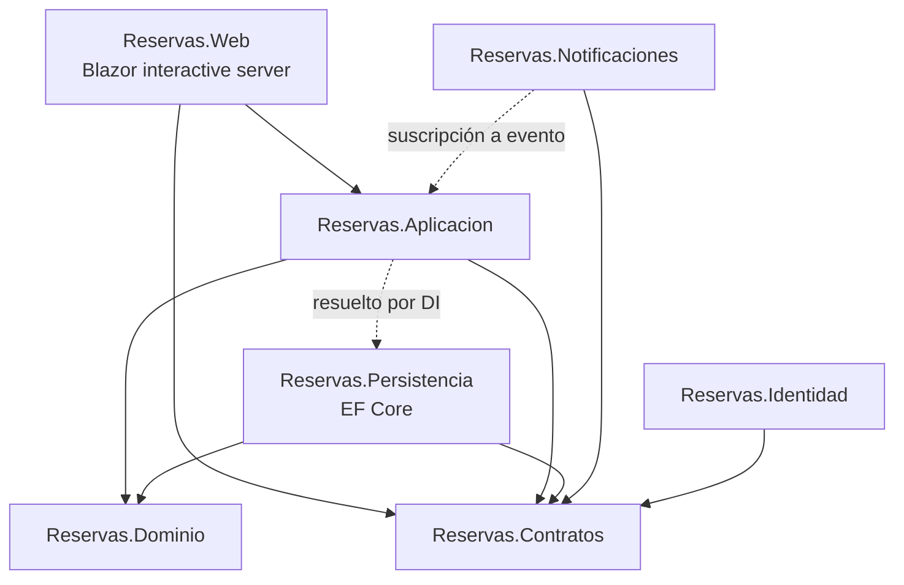
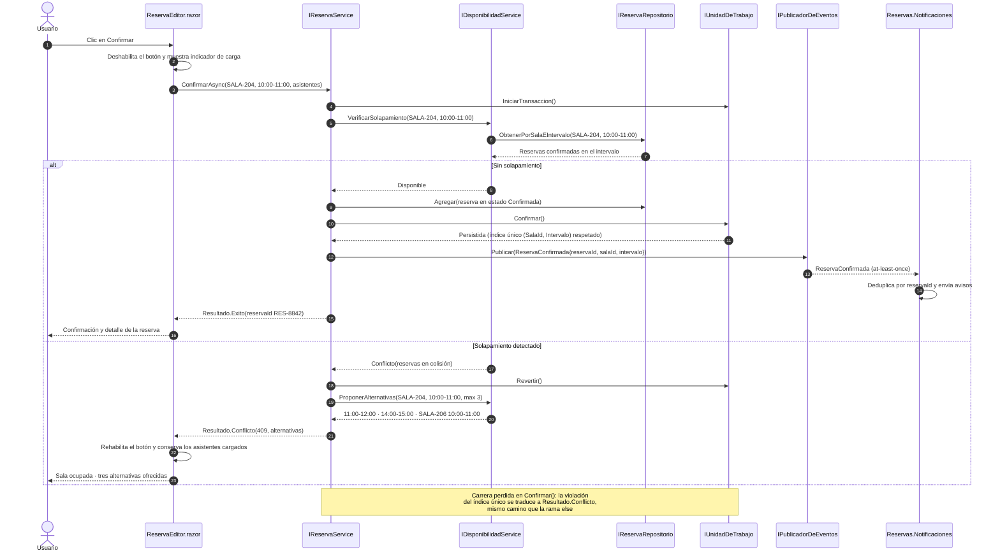

# High Level Design — `DOC-HLD`

## 1. Resumen ejecutivo

El High Level Design es el documento que convierte una arquitectura en un plan de construcción repartible. El [SAD](SAD.md) dice que el sistema se estructura en tres partes y explica por qué; el HLD dice cuáles son los módulos concretos, qué responsabilidad tiene cada uno, qué interfaces expone hacia adentro del sistema y cómo se encadenan durante los flujos que importan. Es el nivel en el que un equipo puede repartirse el trabajo sin que dos personas escriban la misma validación ni ninguna descubra, tres semanas después, que su módulo esperaba una firma que nadie iba a producir.

Su lector típico es el desarrollador que va a implementar uno de esos módulos y necesita saber qué recibe, qué debe devolver y contra qué otros módulos se apoya. Su autor es `ACT-03`, con `ACT-04` como revisor obligatorio: un HLD que los desarrolladores no pueden usar para empezar a codificar falló, aunque sea correcto.

La distinción que gobierna todo el documento es la del alcance de un cambio. Lo que al modificarse obliga a coordinar con otra persona pertenece al HLD; lo que se resuelve dentro de un componente sin que nadie más se entere pertenece al [LLD](../40-Diseno/LLD.md). Esa regla, aplicada con honestidad, resuelve el noventa por ciento de las discusiones sobre dónde va cada cosa.

---

## 2. Definición

### Qué es

Una descripción de la descomposición interna del sistema en módulos, con sus responsabilidades, sus dependencias y las interfaces que los conectan, más los flujos que atraviesan esos módulos para satisfacer los casos de uso relevantes del [SRS](../20-Analisis/SRS.md).

Tres elementos lo constituyen, y la ausencia de cualquiera lo degrada:

**El catálogo de módulos.** Qué unidades de construcción existen, qué hace cada una y de qué depende. En un sistema .NET esto suele mapear a proyectos o a carpetas de primer nivel dentro de un proyecto, pero el mapeo es consecuencia, no definición: el módulo es una responsabilidad, y el proyecto es la forma en que esa responsabilidad se empaqueta.

**El contrato entre módulos.** Las interfaces internas —en C#, típicamente interfaces registradas en el contenedor de inyección de dependencias— con su firma conceptual, sus precondiciones y sus modos de fallo. No las firmas exactas con todos sus parámetros opcionales, que son LLD; sí la operación, lo que consume, lo que produce y qué pasa cuando no puede producirlo.

**Los flujos.** La secuencia de colaboraciones entre módulos para resolver un caso de uso, incluidos los caminos de error. Un HLD que solo documenta el camino feliz deja sin especificar la parte del sistema donde se concentran los defectos.

### Qué problema resuelve

Sin HLD, la descomposición del sistema se decide implícitamente: la toma quien escribe el primer archivo, en función de lo que necesitaba esa tarde. El resultado no es la ausencia de arquitectura interna sino una arquitectura interna accidental, que nadie eligió y que nadie puede defender. Los síntomas aparecen tarde y son caros: dos módulos que validan la misma regla de forma distinta, un servicio que terminó conociendo el `DbContext` porque era el camino corto, un ciclo de dependencias que impide probar nada en aislamiento.

El HLD también resuelve un problema de coordinación. Cuando cinco personas trabajan sobre el mismo sistema, la interfaz entre sus piezas es el punto donde el trabajo se integra o se rompe. Fijarla por escrito antes de implementar permite que las cinco avancen en paralelo contra un contrato acordado, en lugar de en serie contra código que aún no existe.

### Qué NO es

**No es el SAD.** El SAD identifica interesados, atributos de calidad, decisiones estructurales y vistas del sistema; el HLD presupone todo eso resuelto y desciende a la descomposición. Si el HLD explica por qué se eligió Blazor interactive server en lugar de WebAssembly, está duplicando material que pertenece al SAD o a un [ADR](ADR.md).

**No es el LLD.** El LLD entra en clases concretas, firmas completas, algoritmos, estructuras de datos internas y manejo de detalles. Un HLD que documenta el algoritmo de detección de solapamiento se pasó de nivel; le corresponde decir que existe una operación de verificación de disponibilidad, quién la ofrece y qué devuelve cuando falla.

**No es una especificación de API.** La confusión es frecuente en `CTX-2` y merece un párrafo propio. La especificación de API —OpenAPI, `.proto`— es un contrato externo, versionado, dirigido a consumidores que no controlamos y que puede generarse o validarse contra el código. El HLD describe interfaces *internas*, entre piezas que se despliegan juntas y que pueden cambiar de común acuerdo dentro del equipo. Ambos documentos hablan de contratos, pero uno compromete frente a terceros y el otro organiza el trabajo propio. En un sistema que expone una API pública, el HLD explica qué módulo la implementa y cómo se conecta con el resto; la forma exacta de cada endpoint vive en la especificación.

**No es un modelo de arquitectura.** Decidir entre monolito modular, hexagonal, capas o microservicios es materia del SAD y de los [modelos de arquitectura](../90-Modelos-de-Arquitectura/README.md). El HLD *aplica* el modelo elegido: si el SAD fijó arquitectura hexagonal, el HLD enumera qué puertos existen, qué adaptadores los implementan y quién depende de quién.

### El criterio de corte SAD / HLD / LLD

| Dimensión | SAD | HLD | LLD |
|-----------|-----|-----|-----|
| Pregunta | ¿Cómo se estructura el sistema y por qué? | ¿Qué módulos hay y cómo colaboran? | ¿Cómo se implementa cada módulo? |
| Unidad de descripción | Sistema, contenedores, decisiones | Módulo, interfaz interna, flujo | Clase, método, algoritmo |
| Lector principal | `ACT-03`, `ACT-06`, `ACT-07`, `ACT-01` | `ACT-04` que va a implementar | `ACT-04` que mantiene ese componente |
| Dueño | `ACT-03` | `ACT-03` con revisión de `ACT-04` | `ACT-04` |
| Estabilidad esperada | Alta: cambia con decisiones mayores | Media: cambia al agregar capacidades | Baja: cambia con cada refactor |
| Equivalente en C4 Model | Context y Container | Component | Code (opcional en C4) |

La regla operativa, formulada para aplicarse sin consultar la tabla: **si cambiarlo obliga a hablar con otro equipo o con otra persona, es HLD; si no sale de mi componente, es LLD.** Renombrar un método privado no obliga a nadie a nada. Cambiar qué devuelve `IReservaService.Confirmar` cuando la sala está ocupada obliga a avisar a quien consume esa interfaz, y por lo tanto pertenece al contrato documentado.

La regla simétrica hacia arriba: si el cambio invalida un atributo de calidad comprometido o una decisión registrada en un ADR, subió de nivel y ya no es HLD. Mover la validación de solapamiento de la aplicación a un índice único en la base de datos es HLD mientras sea una reorganización de responsabilidades; se vuelve SAD si implica cambiar el motor de persistencia.

### Referencias de industria

`ISO/IEC/IEEE 42010` establece que una descripción arquitectónica se organiza en vistas gobernadas por puntos de vista, cada uno atendiendo preocupaciones de interesados identificados. El HLD, en ese marco, no es un documento del estándar sino la materialización de la vista de desarrollo o de módulos.

En `arc42`, el material del HLD se reparte principalmente entre la sección 5 (*Vista de bloques de construcción*, en su nivel 2 y siguientes) y la sección 6 (*Vista de tiempo de ejecución*, que documenta escenarios dinámicos). Quien use arc42 como plantilla no necesita un archivo separado llamado HLD; necesita esas dos secciones desarrolladas.

En el `C4 Model` de Simon Brown, el nivel de **componentes** es el que más se acerca al HLD: describe los bloques dentro de un contenedor y sus relaciones, un peldaño por debajo del nivel de contenedores que corresponde al SAD y por encima del nivel de código.

En el modelo `4+1` de Kruchten, el HLD ocupa la *vista lógica* en su nivel de subsistemas y la *vista de procesos* cuando documenta colaboración e interacción en tiempo de ejecución.

Los verbos normativos, cuando el HLD fija obligaciones sobre quien implementa, siguen `RFC 2119`: DEBE, NO DEBE, DEBERÍA, PUEDE.

---

## 3. Aplicación por escenario

| Escenario | Naturaleza del HLD | Fuente principal | Confianza alcanzable | Riesgo dominante |
|-----------|-------------------|------------------|---------------------|------------------|
| `ESC-1` Desarrollo nuevo | Prescriptiva: fija el contrato antes de codificar | SAD, SRS, ADR | Alta | Sobreespecificar y congelar decisiones que convenía diferir |
| `ESC-2` Migración | Doble: describe la descomposición origen y decide la destino | Código legado más SAD destino | Alta en destino, media en origen | Arrastrar módulos del origen sin revisar si su razón de ser sigue vigente |
| `ESC-3` Evaluación con código | Reconstructiva: es un hallazgo, no una decisión | Solución, ensamblados, registro de DI, puntos de entrada | Media a alta según acoplamiento | Documentar la estructura de carpetas y llamarla módulos |
| `ESC-4` Evaluación externa | Prácticamente inalcanzable | Comportamiento observable | Baja | Presentar una hipótesis con tono de descripción |

### `ESC-1` — Desarrollo de software nuevo

El HLD se escribe después de que el SAD fijó la estructura mayor y antes de que empiece la implementación de los módulos. Su valor está en el momento: escrito una semana antes, reparte trabajo; escrito una semana después, documenta lo que ya se hizo y sirve mucho menos.

La trampa característica es la sobreespecificación. Un HLD que define veinte interfaces con quince operaciones cada una, antes de que exista una sola línea de código, está tomando decisiones sin la información que solo aparece al implementar. La contención práctica es fijar por escrito únicamente las interfaces que cruzan responsabilidades entre personas, y dejar el interior de cada módulo abierto hasta que quien lo implemente proponga su diseño. La primera versión debería cubrir los flujos de los tres o cuatro casos de uso de mayor riesgo, no los treinta del SRS.

Conviene tratar el HLD de `ESC-1` como un documento vivo durante las primeras iteraciones y estabilizarlo cuando los módulos troncales están implementados. Cada divergencia entre lo escrito y lo construido es una decisión: o el código se corrige, o el documento se actualiza y se registra por qué cambió.

### `ESC-2` — Migración

Se necesitan dos HLD y una tabla que los una. El del origen se reconstruye con el método de `ESC-3` y sirve para un propósito específico: identificar qué módulos del sistema viejo encapsulan comportamiento que nadie documentó nunca. El del destino se decide con el método de `ESC-1`.

El puente es la tabla de equivalencias a nivel de módulo, que responde por cada módulo del origen si se migra tal cual, si se descompone en varios, si se fusiona con otro o si se descarta. Migrar un sistema ASP.NET MVC a Blazor interactive server ilustra bien la asimetría: los controladores del origen no tienen equivalente directo en el destino, porque su responsabilidad —recibir la petición, orquestar, elegir la vista— se reparte entre el componente Razor y el servicio de aplicación. Un HLD destino que conserve un módulo llamado `Controllers` con la misma responsabilidad está migrando estructura en lugar de comportamiento.

La pregunta que hay que contestar módulo por módulo: ¿esta separación existía por una razón del dominio o por una limitación de la plataforma vieja? Las del dominio se conservan; las de la plataforma se revisan.

### `ESC-3` — Evaluación de software existente con acceso al código

Es el escenario donde el HLD se reconstruye, y donde el método importa más que el resultado. La reconstrucción avanza de lo que la evidencia sostiene con menos interpretación hacia lo que exige inferencia.

**Paso 1 — Inventario de proyectos.** El archivo de solución (`.sln`) y los `.csproj` dan la primera partición del sistema. Cada proyecto es un candidato a módulo, y su nombre suele declarar la intención de quien lo creó: `Reservas.Dominio`, `Reservas.Infraestructura`, `Reservas.Web`. La intención declarada se verifica contra el contenido; un proyecto llamado `Dominio` que referencia `Microsoft.EntityFrameworkCore` está diciendo algo sobre el acoplamiento real que su nombre niega.

**Paso 2 — Grafo de referencias entre ensamblados.** Las `ProjectReference` y `PackageReference` de cada `.csproj` producen el grafo de dependencias declaradas, que es evidencia dura: si `Reservas.Dominio` no referencia `Reservas.Infraestructura`, esa dependencia no existe, sin importar lo que digan los comentarios. El grafo permite además detectar ciclos, dependencias que atraviesan capas y proyectos que nadie referencia. Herramientas como `dotnet list reference` o el análisis del grafo de compilación bastan para levantarlo.

**Paso 3 — Registro de inyección de dependencias.** Acá aparecen las interfaces internas reales. El `Program.cs` de una aplicación ASP.NET Core moderna, o los métodos de extensión `AddXxx` que agrupan registros por módulo, enumeran qué abstracciones existen, qué implementación se les asigna y con qué tiempo de vida. Ese registro es la tabla de interfaces internas del sistema, escrita por el propio código. El tiempo de vida es información arquitectónica y no cosmética: un servicio registrado como *singleton* que mantiene estado impone restricciones de concurrencia que el HLD debe declarar.

**Paso 4 — Puntos de entrada.** Toda ejecución del sistema empieza en algún lado: controladores y *minimal API endpoints*, componentes Razor con directiva `@page`, `IHostedService` y trabajos en segundo plano, manejadores de mensajes, comandos de CLI, disparadores de funciones. Enumerarlos delimita la superficie del sistema y permite trazar los flujos hacia adentro. Un flujo reconstruido desde un punto de entrada real es evidencia; un flujo dibujado desde la estructura de carpetas es adivinanza.

**Paso 5 — Flujos y confirmación.** Con los cuatro insumos anteriores se recorren los casos de uso principales, siguiendo llamadas desde cada punto de entrada. Donde el recorrido estático se vuelve ambiguo —despacho dinámico, reflexión, mediadores que resuelven manejadores por convención— conviene confirmar con ejecución instrumentada o con trazas de observabilidad, y si no se puede, marcarlo.

**Qué se marca como no verificado.** La honestidad del documento depende de esta parte. Se marca explícitamente, con `confidence: baja` en el bloque correspondiente o con una anotación en la propia sección:

- La **intención** de una separación: que dos proyectos existan es un hecho; que se hayan separado para permitir despliegue independiente es interpretación, salvo que un ADR o un commit lo declare.
- Las **rutas de código no ejercitadas**: manejadores registrados sin consumidor observable, ramas condicionadas por *feature flags* apagados.
- El **comportamiento en concurrencia y en fallo**, que rara vez se deduce leyendo.
- Todo lo que dependa de **configuración de entorno** no disponible: si el módulo de notificaciones se activa según una clave de `appsettings` que no se tuvo a la vista, se documenta como condicional.
- Las **dependencias por reflexión o convención**, que no aparecen en el grafo de referencias y sin embargo existen en tiempo de ejecución.

Cada afirmación del HLD reconstruido debería poder señalar el archivo que la sostiene. Cuando no puede, o baja de confianza o se convierte en pregunta para quien mantiene el sistema.

### `ESC-4` — Evaluación de un producto solo desde afuera

El HLD es, en la práctica, **inalcanzable** desde afuera, y conviene decirlo sin rodeos en lugar de entregar un documento con forma de HLD y contenido de conjetura. La descomposición interna en módulos, las interfaces entre ellos y la asignación de responsabilidades no dejan huella observable: dos sistemas con arquitecturas internas opuestas pueden comportarse de manera indistinguible para un usuario.

Lo poquísimo que se puede inferir, siempre con confianza **baja** y marcado como hipótesis:

- **Fronteras funcionales gruesas**, cuando la navegación, los dominios o los prefijos de ruta las exponen: un `/admin` con sesión y estilo propios sugiere un módulo administrativo separado, sin decir nada sobre cómo se separa.
- **Existencia de procesamiento asíncrono**, cuando una acción confirma de inmediato y su efecto —un correo, un informe— aparece después. Sugiere una cola o un trabajo en segundo plano; no dice cuál ni cómo se integra.
- **Presencia de un servicio de terceros**, cuando el producto lo declara: una pasarela de pago visible en el flujo de compra es un integrante del sistema, aunque su acoplamiento interno permanezca opaco.
- **Pistas tecnológicas declaradas por el propio producto**: cabeceras de respuesta, rutas de recursos estáticos, formato de los identificadores en la URL, textos de error no capturados. Son indicios de plataforma, no de descomposición.

Lo que no se puede inferir y por lo tanto no se escribe: cuántos módulos hay, qué interfaces los conectan, dónde vive cada regla de negocio, cómo se reparte la responsabilidad entre capas. La salida honesta en `ESC-4` es un mapa de capacidades observadas con las fronteras que se sospechan, rotulado como hipótesis, y la recomendación explícita de pasar a `ESC-3` si el HLD es realmente necesario.

### Variación por contexto

**`CTX-1` Web y cliente interactivo.** El HLD describe la descomposición de la interfaz en componentes con responsabilidad definida, y sobre todo dónde vive el estado. En Blazor interactive server, un módulo que mantiene estado en el circuito impone una restricción que el documento debe declarar: qué sobrevive a una reconexión de SignalR y qué se pierde. En MAUI con MVVM, el HLD enumera los ViewModels como módulos, sus servicios de soporte —navegación, diálogos, almacenamiento local— y quién orquesta el ciclo de vida; los bindings concretos son LLD.

**`CTX-2` Backend y servicios.** El peso se corre a los módulos de dominio, aplicación e infraestructura, y a los contratos entre ellos. Se agrega material que en cliente no existe: qué módulo posee cada agregado, dónde se demarcan las transacciones, qué operaciones son idempotentes y con qué clave, qué eventos publica cada módulo y con qué garantía de entrega. La frontera con la especificación de API debe quedar explícita: el HLD dice que el módulo de reservas expone su capacidad por HTTP, la especificación dice con qué forma exacta.

**`CTX-3` Fullstack.** Aparece la decisión que ninguno de los otros dos contextos tiene: dónde se corta entre cliente y servidor. En una aplicación Blazor Server con ASP.NET Core, el HLD debe declarar qué lógica vive en el componente, qué se invoca como servicio del lado servidor sin pasar por HTTP y qué se expone además como API porque otro consumidor la necesita. Esa frontera es la fuente principal de discusión repetida en el equipo; documentarla con su criterio —no solo con su resultado— es lo que evita repetirla. El HLD también sostiene acá la traza vertical: cada módulo debería poder señalar qué requisitos del SRS satisface.

---

## 4. Ejemplos concretos

Los ejemplos usan el dominio recurrente de la guía —un sistema de reserva de salas— sobre .NET 8, ASP.NET Core, Blazor interactive server y EF Core. Los datos son sintéticos.

### 4.1 Catálogo de módulos

Fragmento del catálogo para el subsistema de reservas. La columna de dependencias registra únicamente dependencias salientes directas; el sentido de las flechas es información arquitectónica y no un detalle.

| Módulo | Responsabilidad | Depende de | Prohibido depender de |
|--------|----------------|------------|----------------------|
| `Reservas.Web` | Componentes Blazor, enrutamiento, estado del circuito, presentación de errores | `Reservas.Aplicacion`, `Reservas.Contratos` | `Reservas.Persistencia` |
| `Reservas.Aplicacion` | Casos de uso, orquestación, demarcación transaccional, publicación de eventos de dominio | `Reservas.Dominio`, `Reservas.Contratos` | `Reservas.Web`, EF Core |
| `Reservas.Dominio` | Entidades, invariantes, reglas de negocio `RN-001` a `RN-012` | — | Todo lo demás |
| `Reservas.Persistencia` | Implementación de repositorios con EF Core, migraciones, configuración de mapeo | `Reservas.Dominio`, `Reservas.Contratos` | `Reservas.Web`, `Reservas.Aplicacion` |
| `Reservas.Notificaciones` | Envío de avisos por correo y calendario, reintentos | `Reservas.Contratos` | `Reservas.Dominio` |
| `Reservas.Contratos` | Interfaces internas, DTOs y contratos de evento compartidos | — | Todo lo demás |
| `Reservas.Identidad` | Autenticación, resolución de usuario actual y sus permisos | `Reservas.Contratos` | `Reservas.Dominio` |

`Reservas.Dominio` y `Reservas.Contratos` sin dependencias salientes no es una casualidad estética: es la condición que permite compilar y probar las reglas de negocio sin base de datos ni servidor web. La columna de prohibiciones convierte esa intención en una regla verificable, y conviene automatizarla —con pruebas de arquitectura o con analizadores— porque una restricción que solo vive en un documento se viola en el primer sprint apurado.

`Reservas.Notificaciones` depende solo de contratos y se suscribe al evento `ReservaConfirmada`; esa elección desacopla el envío de avisos del caso de uso de confirmación, con la consecuencia de que un fallo en el correo no impide confirmar la reserva. El costo es que la confirmación no garantiza el aviso, y esa garantía debilitada DEBE estar declarada en el HLD para que QA la pruebe como corresponde.



Las flechas punteadas son dependencias de tiempo de ejecución que no aparecen en el grafo de referencias entre ensamblados: `Reservas.Aplicacion` compila contra `IReservaRepositorio` y recibe la implementación de `Reservas.Persistencia` por inyección. Esa distinción entre dependencia de compilación y dependencia de ejecución es exactamente el tipo de información que el HLD aporta y que el código no muestra de un vistazo.

### 4.2 Interfaces internas

| Interfaz | Módulo que la define | Implementa | Operación principal | Modos de fallo declarados |
|----------|---------------------|-----------|---------------------|--------------------------|
| `IReservaService` | `Reservas.Contratos` | `Reservas.Aplicacion` | Confirmar una reserva sobre sala, intervalo y asistentes | `Conflicto` si hay solapamiento; `NoAutorizado`; `SalaInexistente` |
| `IDisponibilidadService` | `Reservas.Contratos` | `Reservas.Aplicacion` | Consultar disponibilidad y proponer alternativas | Ninguno: devuelve conjunto vacío si no hay huecos |
| `IReservaRepositorio` | `Reservas.Contratos` | `Reservas.Persistencia` | Persistir y recuperar reservas por sala e intervalo | Excepción de infraestructura; violación de índice único como conflicto |
| `IUnidadDeTrabajo` | `Reservas.Contratos` | `Reservas.Persistencia` | Confirmar o revertir la transacción del caso de uso | Fallo de confirmación revierte todo el caso de uso |
| `IPublicadorDeEventos` | `Reservas.Contratos` | `Reservas.Aplicacion` | Publicar eventos de dominio tras la confirmación | Entrega *at-least-once*; el consumidor deduplica por `reservaId` |
| `IUsuarioActual` | `Reservas.Contratos` | `Reservas.Identidad` | Resolver identidad y permisos del solicitante | `NoAutenticado` |

La columna de modos de fallo es la que distingue un HLD útil de un inventario de nombres. Que `IReservaRepositorio` traduzca la violación del índice único en un resultado de conflicto —en lugar de dejar escapar una excepción de proveedor— es una decisión de diseño con consecuencias para todos los llamadores, y por lo tanto es HLD. Cómo se detecta esa violación en el proveedor de SQL Server concreto es LLD.

Tres precisiones que el HLD DEBE fijar sobre estas interfaces y que suelen omitirse: el **tiempo de vida** con el que se registran (`IReservaService` y `IUnidadDeTrabajo` con alcance de operación, `IPublicadorDeEventos` como singleton), si son **seguras para uso concurrente**, y si sus operaciones son **idempotentes**. En Blazor interactive server el alcance importa especialmente, porque el ciclo de vida no coincide con el de una petición HTTP tradicional y un servicio de alcance mal elegido produce fugas de estado entre operaciones del mismo circuito.

### 4.3 Flujo de confirmación de una reserva

Caso de uso `CU-03 — Confirmar reserva`, que implementa `RF-014` y verifica la regla `RN-007` (una sala no admite reservas superpuestas). El diagrama incluye el camino de conflicto, que es donde el sistema se juega su calidad percibida.

Precondiciones: el usuario está autenticado, ya eligió sala `SALA-204`, intervalo `2026-07-22 10:00–11:00` y cargó tres asistentes. Resultado esperado en el camino feliz: reserva persistida con estado confirmado y evento publicado. Resultado esperado en el camino de conflicto: la reserva no se crea, el usuario recibe alternativas y conserva los asistentes cargados.



La nota final documenta el caso que distingue un HLD escrito con criterio de uno escrito de memoria. La verificación previa de solapamiento no elimina la condición de carrera: entre la consulta y la escritura, otro usuario puede confirmar la misma sala. La defensa real es el índice único `(SalaId, Intervalo)` en la base de datos, y la responsabilidad de traducir su violación a un resultado de conflicto es de `Reservas.Persistencia`. La consulta previa existe para dar una respuesta útil en el caso frecuente; el índice existe para garantizar la corrección en el caso raro. Ambas cosas son necesarias y el documento debe decir por qué.

El código `409` aparece en el diagrama porque el mismo caso de uso se expone además por HTTP para consumidores externos. Dentro del circuito Blazor no viaja ningún `409`: la llamada a `IReservaService` es una invocación en proceso y devuelve un `Resultado.Conflicto`. Que el HLD nombre ambos es correcto siempre que aclare cuál corresponde a cada camino; la forma exacta del cuerpo de la respuesta HTTP pertenece a la especificación de API.

Lo que el diagrama deliberadamente **no** muestra, por ser LLD: cómo se comparan los intervalos, qué estructura tiene el objeto `Resultado`, cómo se serializa el evento, qué política de reintentos usa el módulo de notificaciones.

### 4.4 El mismo flujo en otras plataformas

En **ASP.NET MVC**, el punto de entrada es un `ReservasController` que recibe el `POST`, invoca `IReservaService` y elige entre una vista de confirmación y una revista con errores. Los módulos de aplicación, dominio y persistencia no cambian: la única diferencia de HLD es el módulo de presentación y la ausencia de estado de circuito, lo que elimina la pregunta sobre qué sobrevive a la reconexión y agrega la de cómo se preserva el formulario entre peticiones.

En **.NET MAUI con MVVM**, el punto de entrada es un comando del `ReservaEditorViewModel`. Aparecen dos módulos que en Blazor Server no existen: un cliente de API que reemplaza la invocación en proceso, y un módulo de almacenamiento local para operar sin conexión. Ese último introduce en el HLD una responsabilidad nueva —resolución de conflictos al sincronizar— que ningún otro contexto tiene, y que el documento debe asignar explícitamente a un módulo en lugar de dejarla implícita en el cliente.

---

## 5. Preguntas guía

Para producir un HLD:

- ¿Cada módulo tiene una responsabilidad que se pueda enunciar en una frase sin la palabra «y»?
- ¿Puede un desarrollador empezar a implementar un módulo leyendo solo el HLD y el SRS, sin preguntar?
- ¿Está documentado qué pasa cuando cada interfaz falla, o solo qué devuelve cuando funciona?
- ¿El grafo de dependencias tiene ciclos? Si los tiene, ¿son deliberados y están justificados?
- ¿Los flujos documentados incluyen los caminos de error y las condiciones de carrera, o solo el camino feliz?
- ¿Qué restricción del documento se puede convertir en una prueba automática de arquitectura?

Para evaluar un HLD ajeno:

- ¿Se puede predecir, leyendo el documento, dónde habría que tocar para agregar una funcionalidad concreta?
- ¿Hay alguna afirmación que sea cierta hoy solo por accidente de la implementación actual?
- ¿El documento repite lo que el SAD ya dijo, o parte de ahí?
- ¿Alguna sección describe algo que no obliga a coordinar con nadie? Si es así, sobra: es LLD.
- En `ESC-3`: ¿cada módulo declarado se puede señalar en la solución, y cada interfaz en el registro de DI?

---

## 6. Criterios de calidad y antipatrones

### Criterios

Un HLD está bien hecho cuando permite **repartir trabajo**: dos personas pueden tomar dos módulos y avanzar en paralelo sin coordinarse a diario, porque el contrato entre ellos ya está escrito. Ese es el criterio operativo y resume a los demás.

Los criterios verificables, alineados con los atributos de `ISO/IEC 25010` que el documento sirve:

| Criterio | Cómo se comprueba |
|----------|-------------------|
| Completitud de módulos | Todo punto de entrada del sistema llega a un módulo declarado |
| Completitud de contratos | Toda dependencia entre módulos tiene interfaz documentada con sus modos de fallo |
| Cobertura de flujos | Los casos de uso de mayor riesgo del SRS tienen su secuencia, con caminos de error |
| Ausencia de ciclos | El grafo de dependencias es acíclico, o cada ciclo está justificado por escrito |
| Trazabilidad | Cada módulo se puede vincular a los requisitos que satisface |
| Verificabilidad | Las restricciones estructurales están automatizadas en pruebas de arquitectura |
| Nivel correcto | Ninguna sección describe algo que no sale del componente que la implementa |

### Antipatrones

**El HLD que parafrasea el código.** Enumera clases y métodos con una descripción que repite el nombre del método. No agrega información —el código ya la tiene, y actualizada— y sí agrega costo de mantenimiento. Síntoma: se puede regenerar con una herramienta de documentación automática. Corrección: documentar lo que el código no puede expresar —por qué la responsabilidad está ahí y no en el módulo vecino, qué garantía ofrece cada contrato, qué pasa en el camino de error.

**El diagrama de cajas sin interfaces.** Siete rectángulos con flechas sin etiqueta. Se ve bien en una presentación y es inútil para implementar, porque una flecha entre dos cajas no dice qué operación se invoca, qué se pasa ni qué se recibe. Síntoma: el equipo mira el diagrama, asiente y sigue preguntando en el chat. Corrección: por cada flecha, una fila en la tabla de interfaces.

**El HLD que invade el LLD.** Especifica firmas completas, algoritmos y estructuras internas. El daño es doble: se desactualiza en el primer refactor —quedando como documentación engañosa— y le quita al desarrollador el margen de diseño que le corresponde por rol. Síntoma: cambiar el nombre de una variable obliga a actualizar el HLD. Corrección: aplicar el criterio de corte; si el cambio no sale del componente, se borra del documento.

**El HLD que duplica el SAD.** Reexplica decisiones, atributos de calidad e interesados. El problema no es la redundancia sino la divergencia: cuando ambos documentos afirman lo mismo con palabras distintas, tarde o temprano se contradicen y nadie sabe cuál manda. Síntoma: las primeras tres secciones del HLD se podrían pegar en el SAD sin que se note. Corrección: enlazar por identificador y empezar donde el SAD termina.

**El HLD escrito después.** Producido al cerrar el desarrollo para cumplir con un entregable. Documenta lo que quedó, no lo que se decidió, y por eso presenta como diseño lo que fue improvisación. No es inútil —sirve a quien mantenga el sistema— pero no debe presentarse como si hubiera guiado la construcción. En `ESC-3` esto es legítimo y se declara con `origin` y `confidence`; en `ESC-1` es una falla de proceso.

**El HLD sin caminos de error.** Documenta el flujo exitoso de cada caso de uso y omite conflictos, tiempos de espera agotados, reintentos y condiciones de carrera. Deja sin especificar justamente la parte donde se concentran los defectos y las decisiones difíciles. Síntoma: ningún `alt` en ningún diagrama de secuencia.

---

## 7. Anexo — Plantilla comentada

Estructura mínima para un HLD de un subsistema. Cada comentario enuncia la pregunta que el campo responde; si el campo no la responde, sobra o está mal completado. Se adapta al tamaño del sistema: para un módulo aislado, las secciones 4 y 5 pueden reducirse a una tabla.

````markdown
---
doc_id: HLD-<subsistema>          # ¿Qué parte del sistema cubre este documento?
doc_type: tema
title: High Level Design — <subsistema>
status: borrador | vigente | obsoleto
origin: human | ia-assisted | ia-generated
confidence: alta | media | baja   # ¿Cuánto de esto está verificado contra el código?
owner: ACT-03 <nombre>            # ¿Quién firma la descomposición?
last_review: AAAA-MM-DD
audience: [humano, agente]
traces: [DOC-SAD, DOC-SRS, ADR-00X, DOC-LLD]
---

# High Level Design — <subsistema>

## 1. Alcance y encuadre
<!-- ¿Qué parte del sistema describe este HLD y qué queda explícitamente afuera?
     ¿En qué escenario (ESC-) y contexto (CTX-) se produce? -->

## 2. Entradas
<!-- ¿De qué SAD parte? ¿Qué ADR condicionan esta descomposición?
     ¿Qué requisitos del SRS deben quedar cubiertos por los módulos de acá? -->

| Documento | ID | Qué aporta a este HLD |
|-----------|----|-----------------------|

## 3. Catálogo de módulos
<!-- ¿Cuáles son las unidades de construcción y qué hace cada una?
     La responsabilidad debe enunciarse sin la palabra "y".
     La columna de prohibiciones convierte la intención en regla verificable. -->

| Módulo | Responsabilidad | Depende de | Prohibido depender de | Requisitos que satisface |
|--------|----------------|------------|----------------------|--------------------------|

## 4. Grafo de dependencias
<!-- ¿Hay ciclos? Si los hay, ¿están justificados?
     ¿Qué dependencias son de compilación y cuáles se resuelven en ejecución por DI? -->

```mermaid
flowchart TD
```

## 5. Interfaces internas
<!-- ¿Qué contrato cruza cada frontera entre módulos?
     Los modos de fallo son obligatorios: un contrato sin errores declarados
     está a medio escribir. -->

| Interfaz | Define | Implementa | Operación | Modos de fallo | Tiempo de vida | ¿Idempotente? |
|----------|--------|-----------|-----------|----------------|----------------|---------------|

## 6. Flujos
<!-- ¿Cómo colaboran los módulos para resolver los casos de uso de mayor riesgo?
     Cada flujo DEBE incluir su camino de error. Un flujo sin rama alternativa
     está incompleto salvo que se justifique por qué no puede fallar. -->

### FLU-<n> — <nombre del flujo> (satisface CU-<n>)
<!-- Precondiciones, resultado esperado en el camino feliz,
     resultado esperado en cada camino de error. -->

```mermaid
sequenceDiagram
```

## 7. Estado y concurrencia
<!-- ¿Qué módulo guarda estado y con qué alcance?
     ¿Qué operaciones pueden ejecutarse en paralelo sobre el mismo dato?
     ¿Qué protege la corrección cuando la verificación previa pierde la carrera? -->

## 8. Transacciones y consistencia
<!-- ¿Dónde empieza y termina cada transacción?
     ¿Qué queda eventualmente consistente y cuál es la ventana aceptable? -->

## 9. Frontera cliente/servidor (solo CTX-1 y CTX-3)
<!-- ¿Qué lógica vive en el componente, qué en el servidor,
     qué se expone además como API y con qué criterio se decidió? -->

## 10. Restricciones verificables
<!-- ¿Cuáles de las reglas anteriores están automatizadas?
     Una restricción que solo vive en el documento se viola sin que nadie se entere. -->

| Restricción | Cómo se verifica | ¿Automatizada? |
|-------------|------------------|----------------|

## 11. Huecos y supuestos
<!-- ¿Qué quedó sin decidir y quién lo decide?
     En ESC-3: ¿qué no se pudo verificar contra el código y por qué? -->

| Ítem | Tipo (hueco / supuesto / no verificado) | Responsable | Fecha límite |
|------|----------------------------------------|-------------|--------------|
````

Las secciones 10 y 11 son las que más se omiten y las que más rendimiento dan. La décima convierte el documento en algo que la integración continua puede hacer cumplir; la undécima evita que el lector confunda una decisión tomada con una que nadie tomó todavía.

---

## Enlaces

- [Documentación de arquitectura](README.md) — índice de `FAM-ARQ`.
- [SAD](SAD.md) — estructura, decisiones y vistas de las que parte este documento.
- [ADR](ADR.md) — registro de las decisiones que condicionan la descomposición.
- [LLD](../40-Diseno/LLD.md) — el nivel siguiente: clases, firmas y algoritmos.
- [SRS](../20-Analisis/SRS.md) — requisitos y casos de uso que los módulos deben satisfacer.
- [Modelos de arquitectura](../90-Modelos-de-Arquitectura/README.md) — monolito, capas, hexagonal, microservicios.
- [Escenarios](../00-Marco-de-Referencia/Escenarios.md) · [Contextos](../00-Marco-de-Referencia/Contextos.md) · [Actores](../00-Marco-de-Referencia/Actores.md)
