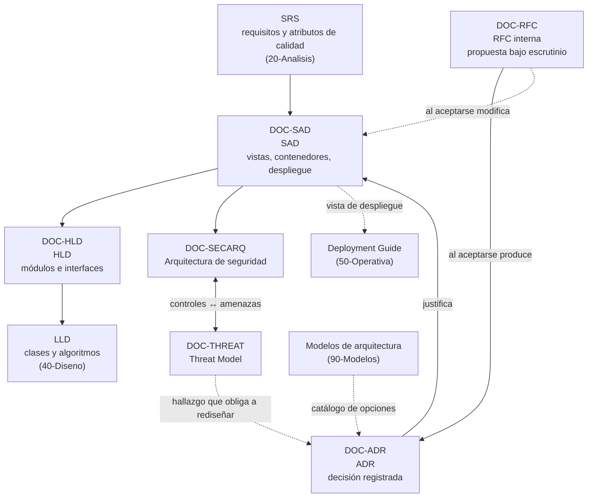

# Documentación de arquitectura — `FAM-ARQ`

## Pregunta que responde la familia

> **¿Cómo estará organizado el sistema, y por qué de esa manera y no de otra?**

La primera mitad de la pregunta produce diagramas; la segunda produce el valor. Un conjunto de cajas y flechas describe una estructura sin explicar qué obligó a elegirla, y esa omisión es la razón por la cual la misma discusión —monolito o servicios, estado en el servidor o en el cliente, bloqueo optimista o pesimista— se repite cada seis meses con los mismos argumentos y sin memoria del resultado anterior. Los artefactos de esta familia existen para que la estructura sea legible y para que las decisiones que la produjeron queden fechadas, atribuidas y revisables.

## Resumen ejecutivo

La familia cubre seis artefactos que se reparten tres funciones distintas. El [SAD](SAD.md) describe la arquitectura completa organizada en vistas, con sus interesados y sus atributos de calidad; incorpora además los diagramas de arquitectura y la vista de despliegue, que esta guía agrupa allí en lugar de tratarlos como documentos sueltos. El [HLD](HLD.md) baja del sistema a los módulos y sus interfaces internas, quedando entre el SAD y el [LLD](../40-Diseno/LLD.md). El [ADR](ADR.md) registra decisiones individuales, una por documento, inmutables una vez aceptadas. La [arquitectura de seguridad](Arquitectura-de-Seguridad.md) fija la postura defensiva —identidad, zonas de confianza, controles exigidos— y el [Threat Model](Threat-Model.md) la somete a la pregunta contraria: qué puede salir mal y quién lo aprovecharía. La [RFC interna](RFC.md) es el instrumento de proceso que pone una propuesta estructural bajo escrutinio antes de que se convierta en decisión.

El dueño natural de toda la familia es `ACT-03`, el arquitecto de software, con dos excepciones: la arquitectura de seguridad y el threat model pertenecen a `ACT-07`, y se producen en conversación permanente con el arquitecto. `ACT-06` es consultado en todo lo que toque despliegue y operabilidad, con poder de veto sobre topologías inoperables.

---

## Artefactos de la familia

| ID | Artefacto | Pregunta que responde | Dueño | Naturaleza |
|----|-----------|----------------------|-------|-----------|
| `DOC-SAD` | [Software Architecture Document](SAD.md) | ¿Cuál es la estructura del sistema, para quién y con qué compromisos de calidad? | `ACT-03` | Descripción completa, viva |
| `DOC-HLD` | [High Level Design](HLD.md) | ¿En qué módulos se descompone y cómo se hablan entre sí? | `ACT-03` | Descripción de segundo nivel |
| `DOC-ADR` | [Architecture Decision Record](ADR.md) | ¿Por qué se decidió esto y qué se descartó? | `ACT-03` | Registro puntual, inmutable |
| `DOC-SECARQ` | [Arquitectura de seguridad](Arquitectura-de-Seguridad.md) | ¿Qué se protege, con qué controles y bajo qué modelo de identidad? | `ACT-07` | Prescripción de controles |
| `DOC-THREAT` | [Threat Model](Threat-Model.md) | ¿Qué puede salir mal, quién lo haría y qué riesgo queda? | `ACT-07` | Análisis iterativo |
| `DOC-RFC` | [RFC interna](RFC.md) | ¿Esta propuesta resiste el escrutinio del equipo? | `ACT-03` | Proceso, con cierre |

Los **modelos de arquitectura** —capas, cliente-servidor, monolito modular, hexagonal, microservicios— no se desarrollan acá. Son opciones de estructura, no artefactos documentales, y viven en [`../90-Modelos-de-Arquitectura/`](../90-Modelos-de-Arquitectura/README.md). Esta familia explica cómo se documenta la elección; aquella explica entre qué se elige.

---

## Relaciones entre artefactos

Las flechas continuas indican derivación —un artefacto se apoya en el anterior— y las punteadas, alimentación o consulta. La única relación bidireccional es la de seguridad: cada control de la arquitectura defensiva debería responder a una amenaza identificada, y cada amenaza sin control asignado es riesgo residual que alguien tiene que aceptar por escrito.

### Cadena de granularidad

La confusión más frecuente de la familia no es entre documentos lejanos sino entre vecinos. Este es el corte:

| Nivel | Artefacto | Unidad que describe | Ejemplo en el sistema de reservas |
|-------|-----------|---------------------|-----------------------------------|
| Sistema y su entorno | `DOC-SAD` | Contenedores, nodos, interesados, vistas | «La aplicación Blazor Server y la API de reservas comparten proceso; el calendario corporativo se integra por webhook» |
| Módulo | `DOC-HLD` | Componentes internos e interfaces entre ellos | «`Disponibilidad` expone `IConsultaDisponibilidad`; `Reservas` la consume y no accede a su almacenamiento» |
| Clase | LLD | Tipos, firmas, algoritmos | «`ValidadorSolapamiento.Verificar(SalaId, Intervalo)` compara contra el índice `(SalaId, Intervalo)`» |

Y el corte entre los dos artefactos de decisión:

| | `DOC-RFC` | `DOC-ADR` |
|---|---|---|
| Momento | Antes de decidir | Al decidir |
| Función | Recolectar objeciones | Registrar el resultado |
| Ciclo | Se abre, se comenta, se cierra | Se acepta y no se toca más |
| Vida útil | Termina | Permanente |
| Reversión | Se retira | Se marca reemplazado por otro ADR |

---

## Orden de lectura

Para quien estudia la familia por primera vez, el recorrido eficiente empieza por lo estructural y termina por lo procedimental:

1. **[SAD](SAD.md)** — es el documento vertebral y el que fija el vocabulario de vistas, interesados y atributos de calidad que los demás reutilizan. Su sección de diagramas y su vista de despliegue son la referencia que el resto de la guía asume conocida.
2. **[ADR](ADR.md)** — se lee inmediatamente después porque el SAD sin ADR es una estructura sin memoria. Acá está el formato de Michael Nygard, MADR, los estados y el criterio de granularidad.
3. **[HLD](HLD.md)** — una vez claro qué queda arriba, se entiende qué baja acá y qué corresponde al [LLD](../40-Diseno/LLD.md).
4. **[Arquitectura de seguridad](Arquitectura-de-Seguridad.md)** y **[Threat Model](Threat-Model.md)** — en ese orden, porque el modelo de amenazas se aplica sobre una postura ya descrita.
5. **[RFC](RFC.md)** — cierra la familia. Es el único artefacto de proceso y solo tiene sentido cuando ya se sabe qué producen los otros cinco.

Quien llega con un problema concreto en lugar de con intención de estudio puede entrar por la pregunta:

| Situación | Entrar por |
|-----------|-----------|
| Hay que arrancar un sistema nuevo y no existe documentación | [SAD](SAD.md), sección de aplicación en `ESC-1` |
| Se heredó un repositorio y nadie sabe cómo está armado | [SAD](SAD.md), `ESC-3` (reconstrucción) y luego [ADR](ADR.md) retrospectivos |
| El equipo discute lo mismo por tercera vez | [ADR](ADR.md) |
| Alguien propone un cambio estructural grande | [RFC](RFC.md) |
| Auditoría o revisión de seguridad inminente | [Threat Model](Threat-Model.md) |
| Hay que explicarle la topología a operaciones | [SAD](SAD.md), vista de despliegue |

---

## Cómo la familia varía por escenario

Cada documento desarrolla su propia sección de aplicación; el resumen del comportamiento de la familia completa:

| Escenario | Qué pasa con `FAM-ARQ` |
|-----------|------------------------|
| `ESC-1` Desarrollo nuevo | La familia es prescriptiva y produce compromisos. El SAD precede al código y el ADR se escribe en el momento de decidir, no después. |
| `ESC-2` Migración | Se duplica: un SAD descriptivo del origen y uno prescriptivo del destino, más la tabla de equivalencias entre ambos. Los ADR del destino deben decir explícitamente qué decisión del origen reemplazan. |
| `ESC-3` Evaluación con código | Todo se reconstruye desde evidencia. El SAD se arma leyendo proyectos, referencias y configuración; los ADR retrospectivos registran la decisión observable sin inventarle motivación al equipo original. |
| `ESC-4` Evaluación externa | La confianza cae a baja. Se puede esbozar una vista de contexto y poco más; el HLD es prácticamente inalcanzable y la RFC no aplica. Todo se marca como hipótesis. |

La variación por contexto es más sutil: en `CTX-1` el peso se va a la estructura de componentes de interfaz y al estado de sesión —en Blazor con render mode *interactive server*, qué vive en el circuito es una decisión arquitectónica de pleno derecho—; en `CTX-2` se va a servicios, contratos e integraciones; en `CTX-3` la frontera entre cliente y servidor deja de ser obvia y pasa a ser lo primero que hay que documentar.

---

## Enlaces al marco

- [Escenarios](../00-Marco-de-Referencia/Escenarios.md) — `ESC-1` a `ESC-4`, el eje que define si estos documentos deciden, describen o infieren.
- [Contextos](../00-Marco-de-Referencia/Contextos.md) — `CTX-1` a `CTX-3`, el eje que desplaza el centro de gravedad de cada artefacto.
- [Actores](../00-Marco-de-Referencia/Actores.md) — `ACT-03` y `ACT-07` como dueños, `ACT-06` con veto de operabilidad, `ACT-04` como lector principal.
- [Convenciones](../00-Marco-de-Referencia/Convenciones.md) — frontmatter, identificadores, estructura de siete secciones y política de no duplicar.
- [Mapa conceptual](../01-Mapa-Conceptual/Mapa-Conceptual.md) — cruce completo de escenarios y contextos contra todos los artefactos de la guía.

## Familias vecinas

- [`../20-Analisis/SRS.md`](../20-Analisis/SRS.md) — entrada de la familia: los requisitos y, sobre todo, los atributos de calidad que el SAD tiene que satisfacer.
- [`../40-Diseno/LLD.md`](../40-Diseno/LLD.md) — salida: donde termina el HLD y empieza la implementación.
- [`../90-Modelos-de-Arquitectura/README.md`](../90-Modelos-de-Arquitectura/README.md) — catálogo de estilos entre los que se elige.
- [`../50-Operativa/`](../50-Operativa/) — la vista de despliegue del SAD es el insumo de las guías de instalación y despliegue.

---

## Referencias de industria usadas en la familia

Se citan por designación exacta y solo cuando lo atribuido es verificable: **ISO/IEC/IEEE 42010** para el modelo de descripción de arquitectura mediante vistas, puntos de vista e interesados; **arc42** como plantilla de doce secciones para el SAD; el **C4 Model** de Simon Brown para la notación de contexto, contenedores y componentes; el modelo **4+1** de Kruchten como organización clásica de vistas; **ISO/IEC 25010** para el vocabulario de atributos de calidad; **ATAM** del SEI como método de evaluación de arquitectura frente a escenarios de calidad; **STRIDE** de Microsoft, **OWASP ASVS**, **OWASP Top 10** y **MITRE ATT&CK** en los dos documentos de seguridad; **RFC 2119** para el vocabulario normativo; el **formato ADR de Michael Nygard** y **MADR** para el registro de decisiones.
