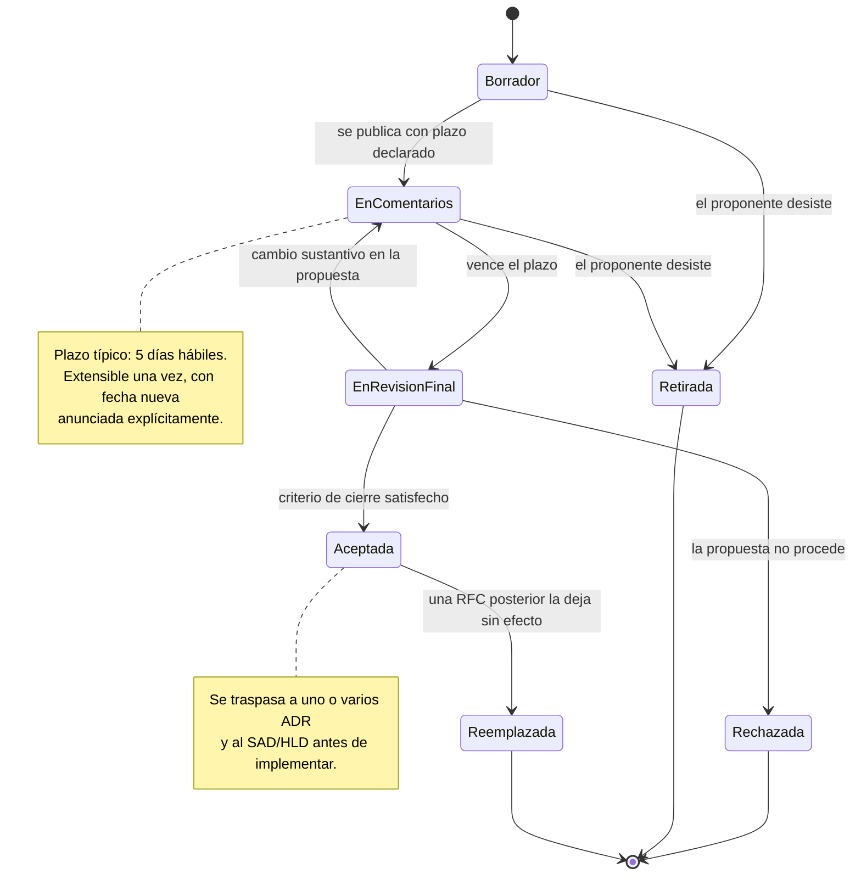

# RFC interna (Request for Comments)

## 1. Resumen ejecutivo

Una propuesta de cambio estructural tiene un momento crítico: el intervalo entre que alguien la concibe y el momento en que el equipo la da por decidida. Si ese intervalo se resuelve en una reunión de cuarenta minutos, deciden los que hablan más fuerte y los que estaban disponibles ese martes. La RFC interna existe para ensanchar deliberadamente ese intervalo, hacerlo asíncrono y dejarlo escrito: se publica una propuesta razonada, se abre un plazo para que quien tenga algo que objetar lo objete por escrito, y recién después se decide.

El artefacto sirve a tres audiencias con necesidades distintas. Al proponente lo obliga a articular alternativas y consecuencias antes de defenderlas en vivo, lo que descarta buena parte de las malas ideas sin costo social. A los afectados —desarrolladores que van a convivir con el resultado, operaciones que va a tener que sostenerlo, seguridad que va a tener que auditarlo— les da una ventana de intervención antes de que el cambio sea caro de revertir. Al equipo futuro le deja el rastro de qué se discutió, incluida la objeción que se registró y se asumió igual.

Es el instrumento propio de `ACT-03` para las decisiones que no puede ni debe tomar solo: aquellas cuyo costo de error se paga en meses de trabajo ajeno. Su rendimiento depende de una disciplina simple y frecuentemente incumplida: la RFC se abre antes del código y se cierra en una fecha declarada.

---

## 2. Definición

Una RFC interna es un documento de propuesta sometido a comentarios de un conjunto identificado de revisores, durante un período acotado, con un criterio de cierre explícito. Propone un cambio estructural —introducir un servicio, cambiar un modelo de persistencia, alterar la frontera entre cliente y servidor, adoptar una tecnología troncal— y pide que se lo intente refutar antes de que se convierta en compromiso.

El problema que resuelve no es la falta de ideas sino la asimetría de información en el momento de decidir. Quien propone conoce su propuesta; quien la va a sufrir conoce restricciones que el proponente ignora. Un despliegue que el arquitecto considera trivial puede ser inviable con el pipeline actual, y `ACT-06` es el único que lo sabe. Una separación de servicios que simplifica el modelo de dominio puede duplicar la superficie de autenticación, y eso lo ve `ACT-07`. La RFC es el mecanismo que fuerza a que esa información aparezca antes y no durante la implementación.

La asincronía no es un detalle logístico. Una objeción bien fundada suele requerir revisar código, medir algo o consultar un contrato con un tercero; ninguna de esas cosas ocurre dentro de una reunión. Un plazo de cinco días hábiles produce objeciones de una calidad que ninguna sala produce.

### 2.1 Qué no es

**No es un documento de propuesta de diseño (*design doc*).** La distinción es de propósito, no de contenido: ambos pueden contener el mismo texto técnico. Un design doc existe para **explicar** cómo se va a construir algo ya decidido, y su lector natural es quien lo va a implementar. Una RFC existe para **recolectar objeciones** sobre algo todavía no decidido, y su lector natural es quien podría oponerse. El síntoma de confusión es la RFC redactada en futuro afirmativo —«el servicio expondrá tres endpoints»— cuando debería estar redactada como propuesta sujeta a refutación. Un design doc que se llama RFC no consigue comentarios porque nadie percibe que haya algo abierto.

**No es un ADR.** Esta es la confusión más consecuente y merece precisión. La RFC es un instrumento de proceso: tiene estados, tiene plazo, tiene comentaristas, y **se cierra**. El ADR es el registro del resultado: no tiene plazo, no se comenta, y existe para siempre porque su función es contestar dentro de tres años por qué el sistema es como es. Una RFC aceptada normalmente **termina convertida en uno o varios ADR** más el cambio correspondiente en el [SAD](SAD.md) y en el [HLD](HLD.md). El ADR hereda la decisión y su justificación; la RFC conserva el debate, que es material distinto y de valor menor una vez cerrado.

La consecuencia práctica de mezclarlas es concreta: si la decisión vive solo en la RFC, el lector futuro tiene que leer treinta páginas de discusión para extraer una decisión de un párrafo, y peor, no sabe si lo que leyó fue lo que se acordó o lo que alguien propuso y se descartó en el comentario 14. El formato de ADR de Michael Nygard y su derivado MADR son deliberadamente breves por esa razón.

**No es una RFC de la IETF.** El nombre proviene de la serie de documentos del Internet Engineering Task Force —los que especifican HTTP, TCP o SMTP—, pero lo que esta guía llama RFC interna no tiene relación con esa serie más allá del préstamo terminológico y de la idea de someter una propuesta a comentario público antes de fijarla. Una RFC interna no se publica, no recibe número de la IETF y no especifica un protocolo interoperable. De ese cuerpo conviene tomar prestada una sola cosa además del nombre: el vocabulario normativo de **RFC 2119**, que define el significado preciso de DEBE, NO DEBE, DEBERÍA, NO DEBERÍA y PUEDE. Usarlo en la propuesta elimina la ambigüedad más costosa de este tipo de documentos, que es no saber si una recomendación es obligatoria o sugerida. Si la RFC dice que el consumidor DEBE deduplicar por `reservaId`, no queda margen de interpretación; si dice que «conviene deduplicar», sí queda.

### 2.2 Cuándo corresponde y cuándo no

| Situación | ¿RFC? | Instrumento adecuado |
|-----------|-------|---------------------|
| Cambio estructural que afecta a más de un equipo o componente | Sí | RFC, luego ADR |
| Decisión estructural evidente, sin alternativas reales en disputa | No | ADR directo |
| Elección de nombre de una tabla o de un método | No | Convención de código |
| Introducción de una dependencia nueva con impacto operativo | Sí | RFC, luego ADR |
| Diseño interno de un componente ya delimitado | No | [HLD](HLD.md) o LLD |
| Cambio de alcance funcional | No | [SRS](../20-Analisis/SRS.md), decide `ACT-01` |
| Adopción de un estilo arquitectónico para el sistema | Sí | RFC, luego ADR y [SAD](SAD.md) |

El criterio operativo que separa las dos primeras filas es el desacuerdo previsible. Si el arquitecto puede anticipar que alguien va a objetar con fundamento, corresponde RFC; si la decisión es una consecuencia mecánica de restricciones ya acordadas, un ADR alcanza y una RFC solo agrega latencia.

Los estilos y patrones que una RFC puede proponer —hexagonal, por capas, orientado a eventos— se tratan en [Modelos de arquitectura](../90-Modelos-de-Arquitectura/README.md); acá interesa el mecanismo por el cual se decide adoptarlos, no su contenido. La relación de este artefacto con el resto de la familia está en el [README de arquitectura](README.md).

---

## 3. Aplicación por escenario

| Escenario | ¿Aplica? | Qué propone la RFC | Quién comenta con más peso |
|-----------|----------|--------------------|----------------------------|
| `ESC-1` Desarrollo nuevo | Sí, selectivamente | Decisiones troncales todavía abiertas: estilo, frontera cliente/servidor, persistencia | `ACT-03`, `ACT-04`, `ACT-06` |
| `ESC-2` Migración | Sí, uso intensivo | Estrategia de corte, orden de migración, qué no se migra, criterio de paridad | `ACT-03`, `ACT-05`, `ACT-06`, `ACT-01` |
| `ESC-3` Evaluación con código | Se lee, no se escribe | Nada; las RFC existentes son evidencia de intención histórica | — |
| `ESC-4` Evaluación externa | No aplica | — | — |

### `ESC-1` — Desarrollo de software nuevo

El riesgo específico es el exceso: un equipo que abre RFC para todo en las primeras semanas produce mucha discusión y poco código, porque en un sistema que no existe casi todo es discutible y casi nada tiene evidencia que resuelva la discusión. La regla que funciona es reservar la RFC para las decisiones cuyo costo de reversión ya es alto en la semana dos —modelo de persistencia, esquema de autenticación, frontera entre el cliente Blazor y los servicios— y resolver el resto con ADR directo o con la convención del equipo.

Hay un beneficio secundario que en `ESC-1` pesa más que en los demás escenarios: la RFC es el vehículo por el cual un equipo recién formado descubre sus desacuerdos tácitos. La primera RFC de un proyecto casi siempre revela que dos personas entendían cosas distintas por la misma palabra.

### `ESC-2` — Migración

Es el escenario donde la RFC rinde más, porque las decisiones de migración son irreversibles en la práctica, afectan a todos los roles a la vez y se toman bajo información parcial sobre el sistema origen. Una RFC de estrategia de corte —big bang contra estrangulamiento progresivo— es exactamente el tipo de propuesta que necesita que `ACT-06` diga si el rollback es posible, que `ACT-05` diga si el criterio de paridad es verificable, y que `ACT-01` diga si el negocio tolera la ventana de riesgo. Ninguno de los tres lo sabe de antemano sin verlo escrito.

La propuesta de qué se decide deliberadamente **no** migrar merece RFC propia. Es la decisión que más se toma por omisión y la que más se lamenta después.

### `ESC-3` — Evaluación de software existente con acceso al código

Las RFC históricas de un repositorio son una de las fuentes más ricas para reconstruir intención, porque contienen lo que ningún otro artefacto conserva: las alternativas que se descartaron y los motivos. Un SAD dice qué se hizo; una RFC vieja dice qué más se consideró y quién se opuso. Cuando la evaluación busca entender por qué el sistema tiene una forma que parece subóptima, ahí suele estar la respuesta.

La advertencia es severa y hay que aplicarla sin excepción: **una RFC no aceptada describe un sistema que no existe**. El directorio de RFC de un repositorio mezcla propuestas aceptadas, rechazadas, retiradas y abandonadas a medio camino, y el texto de todas ellas está redactado en el mismo tono afirmativo. Antes de citar una RFC como evidencia hay que leer su estado y su fecha de cierre; si la RFC no declara estado, la evidencia es el código, no el documento. El error de tomar por descripción lo que era propuesta produce informes de auditoría que describen arquitecturas imaginarias con total seguridad.

Tampoco se escriben RFC retrospectivas. La reconstrucción de decisiones pasadas se hace con ADR retrospectivos, marcados como tales y con la evidencia que los sostiene, según se describe en [ADR](ADR.md). El motivo es de fondo: **una RFC sin comentaristas vivos no es una RFC**. El artefacto es el registro de un proceso de comentario que ocurrió; escribir hoy una RFC fechada en 2019, con una sección de comentarios vacía porque nadie de entonces está disponible, es fabricar el registro de una deliberación que no sucedió. Lo que queda es un design doc retrospectivo con el nombre equivocado.

### `ESC-4` — Evaluación de un producto solo desde afuera

**No aplica.** La RFC es un instrumento interno del proceso de decisión de un equipo: requiere proponente, revisores identificados, autoridad para declarar el cierre y acceso al sistema sobre el que se propone actuar. Desde afuera no hay nada de eso. Lo que puede producirse es una hipótesis sobre decisiones que el proveedor tomó, con la confianza baja que la tabla de `ESC-4` asigna a las inferencias de arquitectura, y esa hipótesis no es una RFC ni debe presentarse con ese formato: llamarla así le prestaría una autoridad de proceso que no tiene.

### Variación por contexto

En `CTX-1` las RFC que más valor generan son las que tocan estado y ciclo de vida: qué vive en el circuito de Blazor *interactive server*, cómo se comporta la aplicación ante una reconexión, cómo se comparte estado entre componentes. Son decisiones que parecen locales y no lo son, porque una vez que cien componentes asumen un modelo de estado, cambiarlo es una reescritura.

En `CTX-2` el objeto típico es el contrato: versionado de API, garantías de entrega de eventos, política de idempotencia, esquema de errores. Acá la RFC gana un revisor externo natural —el consumidor del contrato—, y conviene invitarlo aunque pertenezca a otro equipo. Una RFC de cambio de contrato comentada solo por quien lo implementa no verifica nada.

En `CTX-3` aparece un tipo de RFC que los otros contextos no tienen: la que decide **dónde vive una responsabilidad**. Si la validación de disponibilidad de sala ocurre en el componente Blazor, en un servicio del lado servidor invocado directamente o detrás de un endpoint público, es una decisión de frontera que afecta traza, pruebas y seguridad a la vez, y que se vuelve a discutir cada tres meses si no queda escrita.

---

## 4. Ciclo de vida de una RFC

### 4.1 Estados

| Estado | Significado | Quién lo declara | Salidas posibles |
|--------|-------------|------------------|------------------|
| `borrador` | El proponente redacta; no se esperan comentarios todavía | Proponente | `en comentarios`, `retirada` |
| `en comentarios` | Período abierto con fecha de cierre declarada | Proponente | `en revisión final`, `retirada` |
| `en revisión final` | Comentarios cerrados; se resuelven objeciones pendientes | `ACT-03` | `aceptada`, `rechazada`, `en comentarios` |
| `aceptada` | Decisión tomada; se traspasa a ADR e implementación | `ACT-03` (o el escalamiento) | `reemplazada` |
| `rechazada` | La propuesta no procede; el documento se conserva | `ACT-03` | — |
| `retirada` | El proponente la abandona antes de la decisión | Proponente | — |
| `reemplazada` | Otra RFC posterior la deja sin efecto | `ACT-03` | — |

Los estados terminales —`aceptada`, `rechazada`, `retirada`, `reemplazada`— no se borran ni se archivan fuera del repositorio. Una RFC rechazada tiene valor duradero: evita que la misma propuesta vuelva a discutirse desde cero en dos años, y contiene el razonamiento por el cual no procedió.



La transición de `en revisión final` de vuelta a `en comentarios` es la que más se omite y la que preserva la honestidad del proceso: si durante la revisión la propuesta cambia de forma sustantiva, los revisores comentaron otra cosa, y sus comentarios ya no la avalan. Un cambio cosmético no reabre; un cambio de alternativa elegida, sí.

### 4.2 El período de comentarios

El plazo se declara en el momento de publicar, con fecha y hora, y no se deja implícito. Cinco días hábiles funciona bien como valor por defecto para una propuesta de tamaño medio: da tiempo a que alguien revise código antes de objetar y no tanto como para que la propuesta se enfríe. Las propuestas grandes —una estrategia de migración completa— justifican diez días; las urgentes pueden bajar a dos, siempre que la urgencia se declare y se justifique en el propio documento, porque un plazo corto no anunciado es indistinguible de una decisión ya tomada.

Se extiende una sola vez, con fecha nueva anunciada a todos los revisores. La RFC que extiende su plazo por tercera vez no tiene un problema de calendario: tiene un problema de propuesta.

### 4.3 Revisores y autoridad

| Actor | Cuándo es revisor obligatorio | Autoridad sobre la RFC |
|-------|-------------------------------|------------------------|
| `ACT-03` Arquitecto | Siempre | Declara el cierre; decide en caso de empate técnico |
| `ACT-04` Desarrolladores afectados | Cuando la propuesta cambia código que mantienen | Objetan viabilidad y costo de implementación |
| `ACT-06` DevOps / SRE | Cuando cambia topología, despliegue u observabilidad | Veto sobre lo inoperable |
| `ACT-07` Seguridad | Cuando cambia superficie de exposición, autenticación o datos sensibles | Veto sobre controles exigidos |
| `ACT-01` Product Owner | Cuando hay impacto de alcance, plazo o costo visible para el negocio | Decide sobre alcance y aceptación de riesgo |
| `ACT-05` QA | Opcional; recomendable si cambia la estrategia de verificación | Objeta verificabilidad |
| `ACT-02` Analista | Opcional; obligatorio si la propuesta toca reglas de negocio | Objeta correspondencia con el requisito |

La lista de revisores obligatorios se declara en el frontmatter de la RFC, y su silencio dentro del plazo se interpreta según el criterio de cierre que la propia RFC declaró. Los vetos de `ACT-06` y `ACT-07` no son vetos sobre la decisión completa sino sobre condiciones específicas: operaciones no puede rechazar una separación de servicios porque prefiera el monolito, pero sí puede exigir que la propuesta incluya un plan de observabilidad antes de aceptarse. La distinción entre «me parece peor» y «esto no se puede operar» es la que hace utilizable el veto.

`ACT-01` merece una nota aparte. Su intervención no es técnica: entra cuando la propuesta consume plazo que el negocio tenía asignado a funcionalidad, o cuando introduce un riesgo residual que alguien tiene que aceptar con nombre y fecha. Convocarlo para opinar sobre la estructura interna de un servicio es ruido; no convocarlo cuando la migración propuesta cuesta seis semanas de roadmap es un error de proceso.

### 4.4 Tratamiento de los comentarios

Cada comentario recibido termina en uno de tres estados, y ninguno puede quedar sin registrar:

1. **Resuelto** — la propuesta se modificó para incorporar la objeción, y el cambio se describe. Es el resultado deseable y el que justifica el mecanismo entero.
2. **Aceptado como no aplicable** — el proponente explica por qué la objeción no procede, y el comentarista lo da por bueno. La explicación queda escrita; el «lo hablamos por chat y quedó claro» no cuenta como resolución.
3. **Desacuerdo asumido** — el comentarista mantiene la objeción, el proponente mantiene la propuesta, y se registra que se avanza igual, con nombre de quien objeta y de quien asume el riesgo. Este estado es la razón principal por la que una RFC vale más que una reunión: deja constancia de que el problema se vio, sin obligar a que todo el mundo esté de acuerdo.

El desacuerdo asumido se propaga al ADR resultante como consecuencia negativa conocida. Un ADR que hereda una decisión con desacuerdo registrado y no lo menciona pierde la información más útil que la RFC produjo.

### 4.5 Criterio de cierre

El criterio se declara en la propia RFC, antes de abrir el período de comentarios, y admite variantes según el peso de la decisión. El más usado en equipos pequeños es la ausencia de objeciones bloqueantes al vencer el plazo, con acuerdo explícito de los revisores obligatorios. En decisiones de mayor alcance se exige acuerdo positivo —no silencio— de cada revisor obligatorio, lo que es más lento y más honesto.

Lo que no es criterio de cierre válido es el silencio sin plazo declarado. Una propuesta que nadie comentó durante un período que nadie sabía que estaba corriendo no fue revisada; fue publicada. La diferencia se paga cuando la implementación choca con la objeción que nunca se hizo.

Quien declara el cierre es `ACT-03`, en su rol de dueño de las decisiones estructurales. Declarar el cierre no significa decidir a favor: significa afirmar que el proceso de comentario terminó y que la decisión —aceptación o rechazo— queda tomada con la información disponible.

### 4.6 Cuando no hay consenso

El primer paso es distinguir el tipo de desacuerdo, porque cada uno tiene salida distinta. Un desacuerdo sobre hechos —cuánto cuesta, cuánto tarda, si la biblioteca soporta el escenario— no se resuelve discutiendo sino midiendo: la salida correcta es una prueba de concepto acotada, con criterio de evaluación fijado de antemano, y la RFC vuelve a `en comentarios` con el resultado incorporado. Un desacuerdo sobre criterios —cuánta complejidad vale la pena por cuánto desacoplamiento— no se resuelve con datos, y ahí `ACT-03` decide y registra el desacuerdo asumido.

Cuando el desacuerdo es entre `ACT-03` y un actor con veto legítimo, la salida no es que uno ceda sino que la propuesta cambie hasta satisfacer la condición vetada, o que se rechace. Si eso no ocurre, escala a quien tenga autoridad sobre ambos, y la RFC registra que la decisión se tomó por escalamiento, con nombre. Es información que el equipo futuro va a necesitar cuando la decisión se cuestione.

La peor salida disponible, y la más frecuente, es dejar la RFC abierta indefinidamente. Un desacuerdo no resuelto no desaparece: se convierte en implementación divergente, porque mientras la RFC no cierra cada uno sigue trabajando con el supuesto que prefiere.

### 4.7 Traspaso a ADR

Una RFC aceptada no está terminada hasta que su decisión vive en otro lado. El traspaso es mecánico y conviene hacerlo el mismo día:

- Cada decisión estructural discreta contenida en la propuesta se escribe como un ADR con su formato propio —contexto, decisión, alternativas, consecuencias—, y no como un enlace a la RFC. Una RFC puede generar tres o cuatro ADR.
- Los desacuerdos asumidos se transfieren a la sección de consecuencias del ADR correspondiente.
- El [SAD](SAD.md) y el [HLD](HLD.md) se actualizan con la estructura resultante; el ADR registra la decisión, no la reemplaza.
- Si la propuesta introduce controles o superficie de exposición nueva, se actualiza [Arquitectura de seguridad](Arquitectura-de-Seguridad.md).
- La RFC pasa a `aceptada`, registra en su encabezado los ADR que la implementan, y deja de editarse.

El ADR referencia la RFC como origen del debate; la RFC referencia los ADR como resultado. Esa doble referencia es lo que permite, dos años después, ir de la decisión al debate cuando alguien pregunta por qué.

---

## 5. Ejemplos concretos

El sistema de reserva de salas de la guía está construido con ASP.NET Core y Blazor *interactive server*, con EF Core sobre SQL Server y una aplicación móvil MAUI con patrón MVVM para el registro de asistencia en sala. La disponibilidad de salas —la lógica que decide si un intervalo está libre— vive hoy dentro del mismo proyecto que la gestión de reservas.

### 5.1 RFC-004 — Extraer la gestión de disponibilidad de salas a un servicio propio

> Ejemplo ilustrativo con datos sintéticos. No proviene de un sistema real.

```markdown
---
rfc_id: RFC-004
title: Extraer la gestión de disponibilidad de salas a un servicio propio
estado: aceptada
proponente: ACT-03 Arquitecto de software
revisores_obligatorios: [ACT-04 equipo Reservas, ACT-06 DevOps, ACT-07 Seguridad]
revisores_opcionales: [ACT-05 QA, ACT-01 Product Owner]
publicada: 2026-05-11
cierre_comentarios: 2026-05-18 18:00
criterio_cierre: acuerdo explícito de los tres revisores obligatorios
decidida: 2026-05-21
implementada_por: [ADR-017, ADR-018, ADR-019]
---
```

**Contexto.** El módulo de disponibilidad recibe tres tipos de consumidor con perfiles de carga incompatibles. La aplicación Blazor lo consulta de forma interactiva mientras el usuario elige sala, con picos de veinte consultas por alta de reserva y expectativa de respuesta bajo 300 ms. El panel de recepción lo consulta en bucle cada quince segundos por cada una de las 47 salas. El proceso nocturno de liberación de reservas no confirmadas lo recorre entero. En los últimos dos trimestres, las tres incidencias de degradación registradas —`INC-2026-014`, `INC-2026-031`, `INC-2026-039`— siguieron el mismo patrón: el proceso nocturno saturó el pool de conexiones y las consultas interactivas superaron los cuatro segundos. Escalar el monolito completo para absorber un pico que afecta al 6 % del código cuesta, según la medición de `ACT-06` sobre el entorno actual, 340 USD mensuales de instancia adicional.

**Propuesta.** Extraer la disponibilidad a un servicio ASP.NET Core independiente, `Salas.Disponibilidad`, con base de datos propia y un modelo de lectura desnormalizado de ocupación por sala e intervalo. El servicio DEBE exponer `GET /disponibilidad?salaId&desde&hasta` y `POST /disponibilidad/reservas-tentativas` con semántica idempotente sobre la cabecera `Idempotency-Key`. El monolito de reservas conserva la confirmación y la persistencia de la reserva, y publica `ReservaConfirmada` y `ReservaCancelada`, que el servicio nuevo consume para mantener su modelo de lectura. La consistencia entre ambos es eventual, con ventana objetivo de un segundo al percentil 95.

El cliente Blazor consulta el servicio a través de la capa de aplicación existente; no se expone el servicio nuevo directamente al navegador. La aplicación MAUI no cambia: no consulta disponibilidad.

**Alternativas evaluadas.**

| Alternativa | Por qué se descartó |
|-------------|--------------------|
| Caché en memoria sobre el módulo actual | Resuelve la lectura, no el agotamiento del pool por el proceso nocturno. Invalidación conflictiva con Blazor Server multiinstancia |
| Réplica de lectura de SQL Server | Costo de licencia comparable al servicio nuevo, sin resolver el acoplamiento de despliegue. El proceso nocturno seguiría compitiendo por el mismo esquema |
| Reescribir el proceso nocturno en lotes | Mitiga sin resolver: la carga interactiva crece 18 % trimestral y el techo vuelve en seis meses |
| Extraer también la confirmación de reserva | Rechazada por alcance: la confirmación contiene la regla `RN-007` de no superposición, cuya distribución exige consenso y triplica el riesgo |

**Impacto en operación.** Un servicio más para desplegar, monitorear y respaldar. Requiere pipeline propio, alertas sobre el retraso de consumo de eventos y un tablero de latencia por endpoint. `ACT-06` estimó nueve días de trabajo para el pipeline y la observabilidad, y exigió que la primera versión funcione en modo degradado consultando el monolito si el servicio nuevo no responde. Se agrega un punto de fallo: la caída del servicio de disponibilidad degrada el alta de reservas a un flujo sin verificación previa, con detección de conflicto recién en la confirmación.

**Impacto en seguridad.** Aparece un contrato interno nuevo. `ACT-07` exigió autenticación mutua entre monolito y servicio, que el servicio no exponga identidad del reservante —solo ocupación por intervalo— y que la traza de auditoría de reservas siga siendo única y siga viviendo en el monolito. Se registra en el modelo de amenazas el escenario de enumeración de ocupación por un consumidor interno comprometido.

**Plan de migración.** Cuatro etapas, con vuelta atrás en cada una:

1. Construcción del servicio y del modelo de lectura; consumo de eventos en paralelo, sin tráfico de lectura real. Verificación de que el modelo nuevo coincide con el monolito sobre las mismas consultas durante dos semanas.
2. Enrutamiento del panel de recepción al servicio nuevo. Es el consumidor de mayor volumen y menor criticidad. Vuelta atrás por configuración.
3. Enrutamiento del flujo interactivo de Blazor, con modo degradado activo.
4. Traslado del proceso nocturno y retiro del módulo de disponibilidad del monolito.

**Preguntas abiertas para los comentaristas.**

- ¿La ventana de consistencia eventual de un segundo es aceptable para el flujo interactivo, o hay que verificar contra el monolito en la confirmación?
- ¿El modo degradado debe permitir crear reservas o debe bloquear el alta?
- ¿La reserva tentativa expira por tiempo en el servicio, o el monolito la libera explícitamente?
- ¿Alguien depende del módulo actual de una forma que esta propuesta no contempla?

**Comentarios recibidos.**

| # | Comentarista | Objeción o pregunta | Resolución |
|---|--------------|--------------------|------------|
| 1 | `ACT-06` | Sin modo degradado, la caída del servicio bloquea el alta de reservas por completo | Resuelto: se incorpora modo degradado como requisito de la etapa 3 |
| 2 | `ACT-04` (equipo Reservas) | La consistencia eventual puede mostrar una sala libre que acaba de ocuparse | Resuelto: la confirmación mantiene la verificación transaccional contra el monolito; el servicio solo alimenta la selección |
| 3 | `ACT-07` | El servicio no debe conocer quién reservó | Resuelto: el modelo de lectura almacena `salaId`, `intervalo` y `estado`; sin identidad |
| 4 | `ACT-04` | Duplicar la lógica de solapamiento en dos lugares hace que diverjan | Desacuerdo asumido: se extrae a un paquete compartido `Salas.Reglas`, aunque el comentarista sostiene que el paquete compartido reintroduce acoplamiento. Riesgo asumido por `ACT-03` el 2026-05-21 |
| 5 | `ACT-05` | ¿Cómo se verifica la paridad entre modelo de lectura y monolito? | Resuelto: la etapa 1 incorpora una comparación automatizada diaria sobre 500 consultas muestreadas |
| 6 | `ACT-01` | ¿Cuánto roadmap consume? | Resuelto: 9 días de `ACT-06` más 14 de desarrollo. Aceptado contra el costo de las tres incidencias del trimestre |
| 7 | `ACT-04` | La reserva tentativa sin expiración deja ocupación fantasma | Resuelto: expiración por tiempo en el servicio, 10 minutos, configurable |

**Cierre.** Aceptada el 2026-05-21 por `ACT-03`, con acuerdo explícito de los tres revisores obligatorios y un desacuerdo asumido registrado (comentario 4). Traspasada a:

- `ADR-017` — Separación del servicio de disponibilidad de salas
- `ADR-018` — Consistencia eventual entre reservas y disponibilidad, con verificación transaccional en la confirmación
- `ADR-019` — Regla de solapamiento en paquete compartido; incluye el desacuerdo del comentario 4 como consecuencia conocida

Actualizados en la misma iteración: el [SAD](SAD.md) (vista de componentes y vista de despliegue), el [HLD](HLD.md) del módulo de reservas y [Arquitectura de seguridad](Arquitectura-de-Seguridad.md) con el contrato interno nuevo.

### 5.2 Dos propuestas que no merecían RFC

Del mismo repositorio, para contraste. Una propuesta de cambiar el prefijo de los ViewModels de la aplicación MAUI se abrió como RFC, recibió once comentarios sobre preferencias de nomenclatura y se cerró sin decisión a las tres semanas; correspondía una convención de código y una discusión de diez minutos. Una propuesta de actualizar EF Core a la versión mayor siguiente se abrió como RFC cuando no había alternativa real en disputa —la versión anterior salía de soporte— y solo generó latencia; correspondía un ADR directo registrando la fecha de fin de soporte como motivo.

---

## 6. Preguntas guía

- ¿Esta propuesta tiene alguien que pueda objetarla con fundamento? Si no, ¿por qué es una RFC y no un ADR?
- ¿Está declarada la fecha y hora de cierre del período de comentarios, y la conocen todos los revisores obligatorios?
- ¿Quién es revisor obligatorio y quién opcional, y por qué? ¿Falta alguien que va a tener que convivir con el resultado?
- ¿El documento está redactado como propuesta refutable, o como descripción de algo ya decidido?
- ¿Las alternativas evaluadas incluyen la de no hacer nada, y está dicho por qué se descarta?
- ¿Cada comentario recibido está resuelto, aceptado como no aplicable o registrado como desacuerdo asumido?
- ¿Qué se sacrifica si la propuesta se acepta? Si la respuesta es «nada», falta análisis.
- ¿En qué ADR va a terminar esto, y quién lo escribe?
- Si la RFC lleva más de tres semanas abierta, ¿cuál es el desacuerdo real que nadie está nombrando?

---

## 7. Criterios de calidad y antipatrones

### 7.1 Qué distingue una RFC buena

Una RFC de calidad se reconoce antes de leer la propuesta, en tres señales estructurales: tiene fecha de cierre, tiene revisores nombrados y tiene preguntas abiertas dirigidas a ellos. Las tres indican que el proponente espera genuinamente ser contradicho.

En el contenido, la señal más confiable es el tratamiento de las alternativas. Una RFC que presenta alternativas con sus motivos de descarte —incluida la de no hacer nada— fue escrita para decidir; una que presenta una sola opción con tres párrafos de justificación fue escrita para conseguir aprobación. La segunda no produce comentarios útiles porque no ofrece dónde discrepar.

El impacto tiene que estar cuantificado donde se pueda cuantificar. «Mejora el rendimiento» no es material comentable; «reduce la latencia p95 del alta de reserva de 4 s a menos de 300 ms bajo la carga del proceso nocturno, medido sobre el entorno de preproducción el 2026-05-08» sí lo es, porque alguien puede refutar la medición.

El vocabulario normativo de RFC 2119 se usa donde hay obligación. Que el consumidor DEBE deduplicar y DEBERÍA registrar el descarte son afirmaciones distintas, y la diferencia importa cuando alguien implemente el contrato seis meses después.

Y la RFC termina. La calidad se mide en el cierre: una RFC aceptada cuyos ADR no se escribieron es una RFC que falló, porque la decisión quedó donde nadie la va a buscar.

### 7.2 Antipatrones

**La RFC escrita después de que el código ya está en main.** Es el antipatrón más común y el que vacía el mecanismo de contenido. Los comentarios recibidos son cosméticos porque nadie objeta con fuerza algo que ya funciona, y el proponente no está pidiendo opinión sino cobertura. Se reconoce por el desfase entre la fecha del documento y la del primer commit del cambio. La salida honesta es escribir un ADR que registre la decisión ya tomada, con su fecha real, en lugar de simular una deliberación que no ocurrió.

**La RFC que nadie comenta y se aprueba por silencio sin plazo declarado.** Sin fecha de cierre anunciada, el silencio no significa acuerdo: significa que nadie sabía que tenía que responder. El proponente interpreta el silencio como consenso, y la objeción que no se hizo reaparece durante la implementación, cuando ya cuesta semanas. La corrección es de una línea: declarar la fecha al publicar y confirmar recepción con los revisores obligatorios.

**La RFC eterna.** Lleva cuatro meses abierta, acumula ochenta comentarios y nadie recuerda cuál era la propuesta original. Suele indicar un desacuerdo de criterios que nadie quiere elevar a decisión, y produce el peor resultado posible: mientras no cierra, cada equipo implementa con el supuesto que prefiere, y la divergencia se descubre en integración. Una RFC que pasó dos veces su plazo se cierra —aceptada, rechazada o retirada— aunque el cierre incomode.

**La RFC para decidir algo trivial.** Abrir el mecanismo completo para una decisión sin alternativas reales enseña al equipo que las RFC son burocracia, y el costo se cobra en la siguiente RFC importante, que nadie lee con atención porque las anteriores no lo merecían. El filtro es el desacuerdo previsible: si nadie va a objetar, no hay comentarios que recolectar.

**La RFC que reemplaza al ADR.** La decisión se toma, la RFC se marca aceptada y nadie escribe el ADR, con el argumento razonable de que todo está en la RFC. Dos años después, alguien pregunta por qué la disponibilidad de salas es un servicio aparte, busca en los ADR, no encuentra nada, y termina leyendo cuarenta páginas de debate del que no puede distinguir lo acordado de lo propuesto y descartado. La decisión existía y era inencontrable, que a efectos prácticos equivale a no haberla registrado.

---

## Anexo — Plantilla comentada

Cada campo lleva la pregunta que lo justifica. Los campos que no apliquen se omiten; no se dejan con texto de relleno.

```markdown
---
rfc_id: RFC-NNN                  # Correlativo estable. Nunca se reutiliza, ni siquiera si la RFC se retira
title:                           # ¿Qué se propone, en una línea que un revisor entienda sin abrir el documento?
estado:                          # borrador | en comentarios | en revisión final | aceptada | rechazada | retirada | reemplazada
proponente:                      # ¿Quién responde por esta propuesta y resuelve los comentarios?
revisores_obligatorios: []       # ¿Quiénes tienen que pronunciarse para que esto se pueda cerrar?
revisores_opcionales: []         # ¿A quiénes conviene invitar aunque su silencio no bloquee?
publicada: AAAA-MM-DD            # ¿Desde cuándo corre el plazo?
cierre_comentarios: AAAA-MM-DD HH:MM   # ¿Cuándo deja de aceptarse comentarios? Sin esto no hay RFC
criterio_cierre:                 # ¿Qué tiene que pasar para poder aceptarla? ¿Acuerdo explícito o ausencia de bloqueo?
decidida: AAAA-MM-DD             # ¿Cuándo se declaró el cierre? Se completa al decidir
implementada_por: []             # ¿En qué ADR terminó? Obligatorio si el estado es aceptada
reemplaza_a:                     # ¿Deja sin efecto alguna RFC anterior?
---

## Contexto

¿Qué situación concreta hace necesario decidir esto ahora? Datos, incidentes,
mediciones o restricciones verificables. Si no hay nada medible, ¿por qué es
un problema y no una preferencia?

## Propuesta

¿Qué se propone exactamente? Vocabulario normativo de RFC 2119 —DEBE,
DEBERÍA, PUEDE— donde haya obligación o recomendación. ¿Qué queda fuera
del alcance de esta propuesta?

## Alternativas evaluadas

¿Qué otras opciones se consideraron y por qué se descarta cada una? Incluir
siempre la alternativa de no hacer nada. Si hay una sola alternativa, la
propuesta todavía no está lista para comentarios.

## Impacto

¿Qué cambia en operación (ACT-06), en seguridad (ACT-07), en las pruebas
(ACT-05), en el alcance o el plazo (ACT-01)? ¿Qué se sacrifica a cambio de
lo que se gana?

## Plan de migración

¿Cómo se llega desde el estado actual al propuesto, en etapas verificables?
¿Cuál es la vuelta atrás de cada etapa? ¿Qué se despliega primero?

## Preguntas abiertas

¿Qué es lo que el proponente todavía no sabe y necesita que los revisores
respondan? Dirigidas a personas concretas cuando corresponda.

## Comentarios recibidos

| # | Comentarista | Objeción o pregunta | Resolución |
|---|--------------|--------------------|------------|

Resolución: resuelto (qué cambió) | aceptado como no aplicable (por qué) |
desacuerdo asumido (quién objeta, quién asume el riesgo, en qué fecha).
Ningún comentario queda sin fila.

## Cierre

¿Quién declaró el cierre, en qué fecha y con qué resultado? ¿En qué ADR
quedó registrada la decisión? ¿Qué documentos —SAD, HLD, arquitectura de
seguridad— se actualizaron en consecuencia?
```

La plantilla es de esta guía y no de ninguna norma. Cuando el equipo quiera alinearse con un formato de la industria para los ADR resultantes, las referencias verificables son el formato de Michael Nygard y MADR; para la descripción arquitectónica que la RFC modifica, ISO/IEC/IEEE 42010 y arc42.
