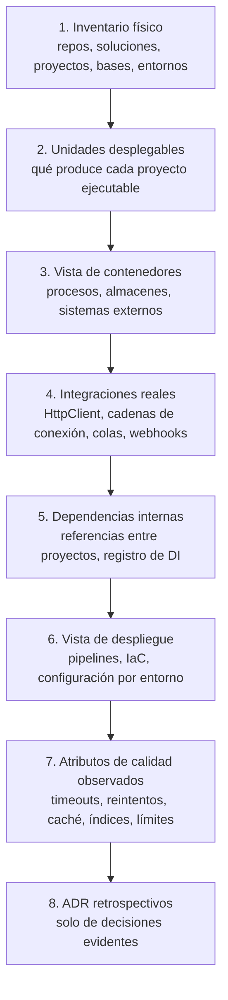
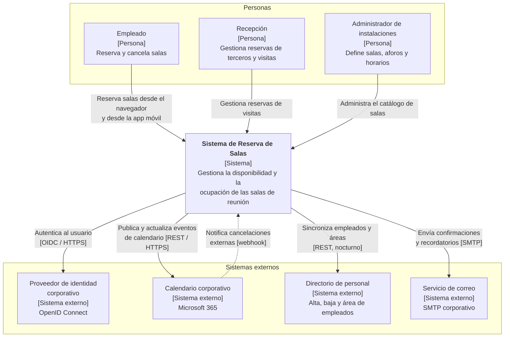
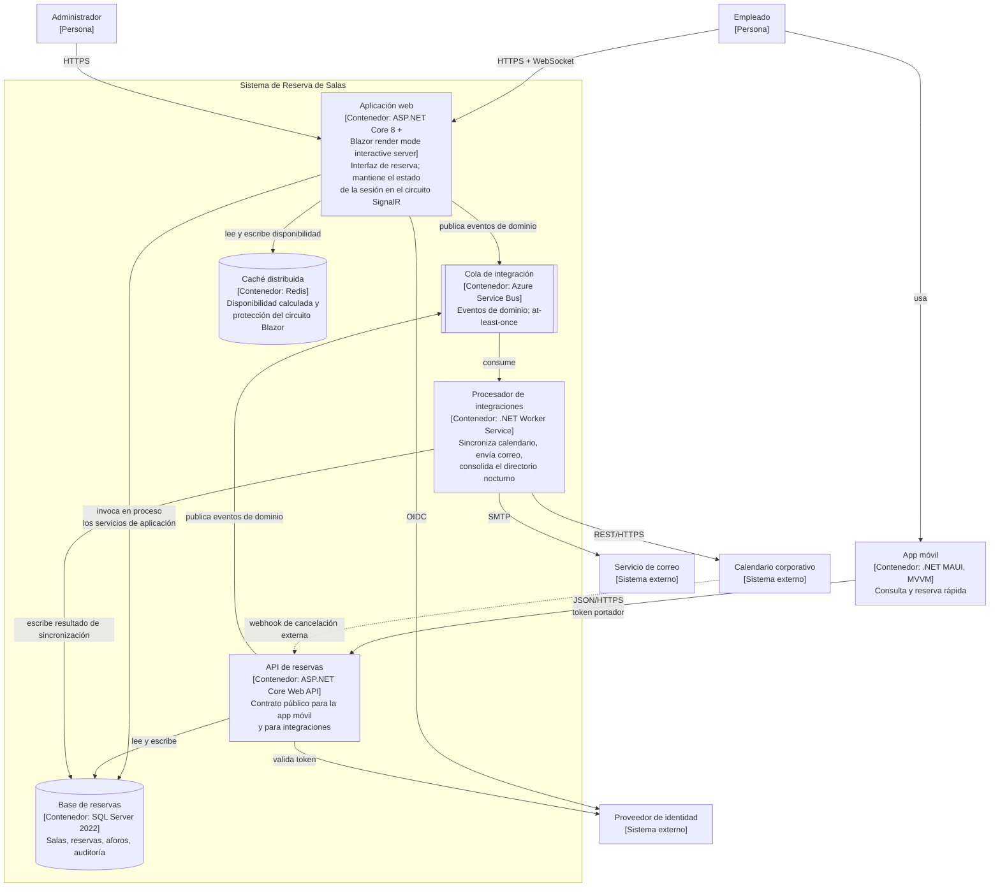
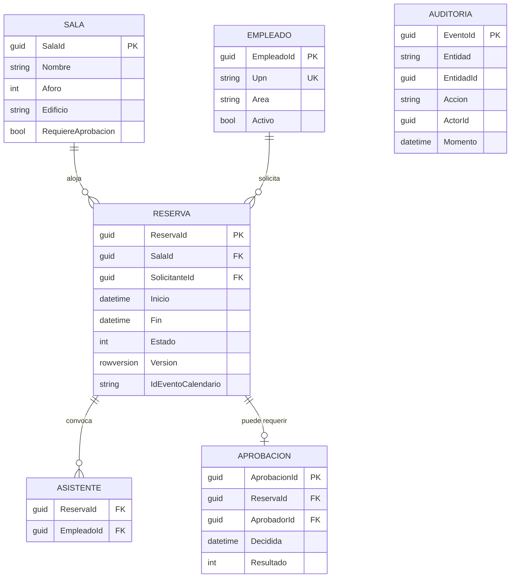
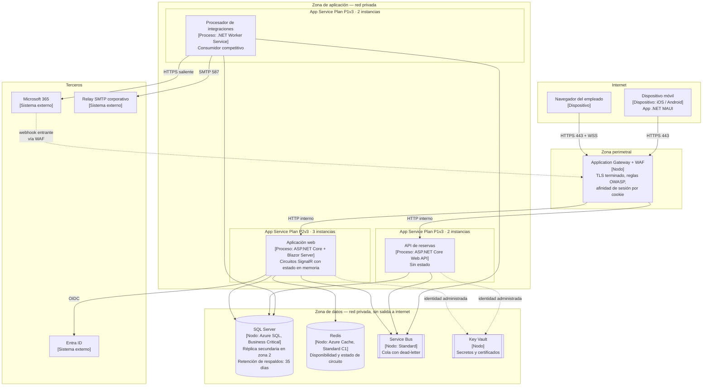

# Software Architecture Document — `DOC-SAD`

## 1. Resumen ejecutivo

El SAD es el documento que permite que alguien que nunca vio el sistema entienda cómo está organizado en una tarde, y que quien lo mantiene sepa qué puede cambiar sin romper una promesa. Describe la estructura del software desde varias perspectivas simultáneas, porque ninguna sola alcanza: la que le sirve al desarrollador para ubicar su código no es la que le sirve al responsable de operaciones para dimensionar servidores, ni la que necesita el auditor para verificar dónde vive un dato personal.

Su valor no está en el inventario de componentes sino en la unión de tres cosas que los documentos pobres separan: qué hay, qué propiedad de calidad se estaba persiguiendo, y qué se sacrificó a cambio. Un SAD que enumera contenedores sin mencionar un solo compromiso es un mapa de un territorio que nadie eligió.

Esta guía agrupa dentro del SAD dos temas que a veces circulan como documentos independientes. Los **diagramas de arquitectura** —qué vistas dibujar, con qué notación, cuándo conviene C4 y cuándo la estructura de arc42— se tratan en la sección 4.1 porque son el vehículo del SAD, no un artefacto aparte. La **arquitectura de despliegue** —nodos, entornos, topología— se trata en la sección 4.4 como una vista más, la que responde dónde corre cada cosa; separarla produce el defecto habitual de un SAD que describe una estructura lógica sin decir nunca cuántos procesos hay ni dónde viven.

Lo escribe `ACT-03` y lo aprueba `ACT-03`. `ACT-06` es consultado en todo lo que toque la vista de despliegue y tiene poder de veto sobre topologías que no se pueden operar; `ACT-07` revisa buscando lo que no está dicho; `ACT-04` es el lector principal y el mejor evaluador de su utilidad real, porque si un desarrollador no puede ubicar dónde va su cambio leyendo el SAD, el documento falló.

---

## 2. Definición

### Qué es

Una descripción de la arquitectura de un sistema organizada en **vistas**, donde cada vista responde a las preocupaciones de un conjunto identificado de **interesados**. Esa formulación no es arbitraria: es el modelo conceptual de **ISO/IEC/IEEE 42010**, que define una descripción de arquitectura como el conjunto de vistas que expresan la arquitectura, cada una gobernada por un **punto de vista** que declara qué preocupaciones atiende, para qué interesados y con qué convenciones de modelado. La norma no impone qué vistas usar ni con qué notación; impone que la elección esté declarada y que cada vista tenga destinatario.

De ahí se desprende el criterio práctico más útil para escribir un SAD: **una vista sin interesado identificado sobra**. Si nadie va a tomar una decisión distinta al leerla, se está dibujando por costumbre.

### Qué problema resuelve

Tres, y conviene distinguirlos porque un mismo SAD puede resolver uno y fallar en los otros.

El problema de **orientación**: dónde vive cada cosa y por dónde entra un cambio. Es el que consume más tiempo en un equipo sin documentación, y se paga en interrupciones —cada incorporación cuesta semanas del tiempo de alguien que ya está ocupado.

El problema de **compromiso**: qué propiedades se prometieron y cuáles no. Un sistema que se diseñó para tolerar la caída de un nodo pero no para responder en cincuenta milisegundos tomó una decisión legítima, y esa decisión tiene que estar escrita para que nadie la contradiga por accidente seis meses después.

El problema de **memoria**: por qué la estructura es esta. El SAD no registra las decisiones en detalle —eso es el [ADR](ADR.md)— pero sí las referencia, de modo que el lector pueda saltar del componente a la razón por la que existe.

### Qué NO es, y con qué se lo confunde

**No es el HLD.** Ésta es la confusión dominante y vale la pena fijarla con un criterio operativo en lugar de con adjetivos como «más alto» o «más detallado». El SAD trabaja al nivel del sistema y su entorno: qué unidades desplegables existen, qué sistemas externos hay alrededor, qué atributos de calidad gobiernan, qué decisiones estructurales se tomaron. El [HLD](HLD.md) trabaja al nivel del interior de esas unidades: en qué módulos se descompone cada contenedor, qué interfaz expone cada uno y cómo se coordinan en un flujo concreto. La prueba: si la afirmación deja de ser cierta cuando cambio el interior de un contenedor sin cambiar su contrato externo, era HLD.

**No es el LLD.** El [LLD](../40-Diseno/LLD.md) entra en clases, firmas, estructuras de datos y algoritmos. La frontera que suele romperse es la de la persistencia: describir la existencia de una base relacional con un esquema de tablas normalizado es SAD; describir el índice compuesto `(SalaId, Intervalo)` y su tipo es LLD. Un SAD que nombra métodos ya invadió dos niveles.

**No es el catálogo de modelos de arquitectura.** Elegir hexagonal, monolito modular o microservicios es una decisión que el SAD registra y que un ADR justifica; la explicación de qué es cada estilo, qué implica y cuándo conviene vive en [`../90-Modelos-de-Arquitectura/`](../90-Modelos-de-Arquitectura/README.md).

**No es la especificación de API.** El SAD dice que existe una interfaz entre dos contenedores y qué naturaleza tiene —síncrona HTTP, mensajería asíncrona con garantía *at-least-once*—; el contrato campo por campo es OpenAPI y vive con el backend.

**No es el diagrama de la estructura de carpetas.** Documentar `src/`, `tests/` y `docs/` y llamar a eso arquitectura es el antipatrón más común de `ESC-3`. La estructura de carpetas es una convención de repositorio; la arquitectura es el conjunto de decisiones que restringen cómo el sistema puede evolucionar.

### Relación con las plantillas y modelos de referencia

| Referencia | Qué aporta | Cómo se usa en esta guía |
|-----------|-----------|--------------------------|
| **ISO/IEC/IEEE 42010** | Modelo conceptual: vista, punto de vista, interesado, preocupación | El fundamento; obliga a declarar destinatario de cada vista |
| **arc42** | Plantilla de doce secciones para el documento completo | Estructura de referencia del SAD; libre y ampliamente usada |
| **C4 Model** (Simon Brown) | Notación jerárquica: contexto, contenedores, componentes, código | Notación por defecto de los diagramas de esta guía |
| **4+1** (Kruchten) | Cinco vistas clásicas: lógica, proceso, desarrollo, física, más escenarios | Organización histórica de vistas; útil como lista de control |
| **ISO/IEC 25010** | Vocabulario de atributos de calidad del producto | Nombres canónicos de los atributos en la sección de calidad |
| **ATAM** (SEI) | Método de evaluación de arquitectura contra escenarios de calidad | Cómo se somete un SAD a revisión y qué produce esa revisión |

Ninguna de estas referencias es obligatoria y combinarlas es lo habitual: arc42 como esqueleto del documento, C4 como notación de los diagramas de las secciones estructurales, 25010 como vocabulario de la sección de calidad.

---

## 3. Aplicación por escenario

| Escenario | Naturaleza del SAD | Qué se produce | Confianza |
|-----------|-------------------|----------------|-----------|
| `ESC-1` Desarrollo nuevo | Prescriptiva: compromete | SAD completo antes del código troncal, con ADR asociados | Alta, pero provisional hasta la primera entrega |
| `ESC-2` Migración | Doble | SAD del origen (descriptivo) + SAD del destino (prescriptivo) + tabla de equivalencias | Alta en destino; media en origen según evidencia |
| `ESC-3` Evaluación con código | Reconstructiva | SAD observado, con evidencia rastreable por afirmación | Alta en estructura, media en intención |
| `ESC-4` Evaluación externa | Inferencial | Vista de contexto y poco más, marcada como hipótesis | Baja |

### `ESC-1` — Desarrollo de software nuevo

El SAD se escribe cuando hay suficiente requisito para decidir y todavía no hay código que revertir. El error de calendario más caro es el opuesto en cada dirección: escribirlo antes del [SRS](../20-Analisis/SRS.md) produce una arquitectura para un producto que después resulta ser otro; escribirlo después de tres sprints produce un documento que ratifica lo que ya se hizo, con lo cual no decide nada.

Lo que hace que un SAD de `ESC-1` sirva es que sus atributos de calidad vengan del SRS con número, no con adjetivo. «El sistema debe ser escalable» no permite elegir entre dos topologías; «hasta 400 reservas concurrentes en el pico de las 9:00, con confirmación en menos de 800 ms en el percentil 95» sí. Cuando el SRS no trae esa precisión, el arquitecto no puede inventarla: la devuelve a `ACT-02` y `ACT-01`, porque estar decidiendo estructura sin criterio cuantificado es adivinar.

El SAD de este escenario tiene estado `borrador` mientras el sistema no exista, y pasa a `vigente` con la primera entrega a producción. Esa transición importa porque cambia su naturaleza: deja de ser una promesa y pasa a ser una descripción que hay que mantener sincronizada.

### `ESC-2` — Migración a otro lenguaje o plataforma

Se necesitan dos SAD y una tercera pieza que casi siempre falta. El SAD del origen se reconstruye con las técnicas de `ESC-3` y su función es fijar qué hay que preservar; el SAD del destino se escribe con las de `ESC-1`. La pieza que falta es la **tabla de equivalencias**, que dice qué componente viejo se convierte en cuál nuevo, cuál desaparece y cuál se agrega.

Sobre el sistema de reservas, migrando de ASP.NET MVC a Blazor con render mode *interactive server*:

| Componente origen (ASP.NET MVC) | Componente destino (Blazor Server) | Decisión |
|--------------------------------|-----------------------------------|----------|
| `ReservasController` + vistas Razor | Componente `ReservaEditor.razor` + servicio de aplicación | Se separa lógica de presentación; la coordinación baja al servicio |
| `TempData` para el mensaje post-redirect | Estado en el circuito + notificación en componente | Cambia el modelo de estado; requiere ADR propio |
| Validación por `ModelState` en el POST | Validación en el componente + revalidación en el servicio | Se duplica deliberadamente; la del servidor es la autoritativa |
| Filtro `[Authorize]` sobre la acción | Política de autorización sobre el componente y sobre el servicio | Se mueve el punto de control; alimenta `DOC-SECARQ` |
| Job nocturno de recordatorios (Windows Service) | Servicio hospedado en el mismo proceso | Migrado; alternativa de servicio propio descartada en ADR |
| Reportes en Crystal Reports | — | **No se migra**; se reemplaza por exportación CSV |

La última fila es la que da valor a la tabla. Lo que se decide no migrar tiene que estar escrito con la misma prolijidad que lo que se migra, o reaparece como defecto tres meses después de la salida a producción.

### `ESC-3` — Evaluación de software existente con acceso al código

El SAD deja de ser una decisión y pasa a ser un hallazgo. La regla que gobierna todo el trabajo: **cada afirmación se rastrea a un archivo, y lo que no se pudo verificar se marca como no verificado en lugar de completarse con lo razonable**.

#### Cómo se reconstruye un SAD desde el código

El orden importa porque va de la evidencia dura a la interpretación blanda. Subir demasiado rápido al nivel de intención es lo que produce SAD reconstruidos que suenan bien y son falsos.



Las fuentes de evidencia, por paso, en un sistema .NET:

| Paso | Dónde se lee | Qué se puede afirmar | Qué NO |
|------|-------------|---------------------|--------|
| Unidades desplegables | Archivos `.sln`, `.csproj` con `OutputType`, `Dockerfile`, `docker-compose.yml` | Cuántos procesos hay y qué produce cada uno | Si esa separación fue deliberada |
| Integraciones | Registros de `HttpClient`, `appsettings.*.json`, cadenas de conexión, clientes de mensajería | Con qué habla el sistema y por qué protocolo | Qué garantías reales ofrece el otro extremo |
| Dependencias internas | `ProjectReference`, `Program.cs` y extensiones de registro de servicios | Qué módulo depende de cuál | Si la dependencia es intencional o accidental |
| Persistencia | `DbContext`, `OnModelCreating`, carpeta de migraciones | Entidades, relaciones, índices, restricciones | Reglas de negocio que viven en la aplicación |
| Despliegue | Pipelines de CI/CD, manifiestos, Terraform o Bicep, variables de entorno | Cuántos entornos hay y cómo se promociona | Si el entorno documentado es el que corre hoy |
| Calidad | Políticas de reintento, `CommandTimeout`, configuración de caché, rate limiting | Qué preocupaciones estaban activas | El número objetivo que se perseguía |

El caso más instructivo es el último. Encontrar una política de reintento con tres intentos y espera exponencial permite afirmar «el sistema tolera fallos transitorios del servicio de calendario mediante reintento (`ServicioCalendario.cs`, registro de resiliencia en `Program.cs`)». No permite afirmar «el sistema fue diseñado para una disponibilidad del 99,9 %». Lo primero es observación; lo segundo es una motivación que nadie declaró.

Un SAD reconstruido debería llevar, además del frontmatter con `origin` y `confidence`, una marca por sección. La convención de esta guía: cada afirmación estructural va acompañada de su evidencia entre paréntesis, y las secciones enteras que no pudieron verificarse llevan un bloque explícito.

> **No verificado.** No se encontró configuración de respaldo ni de recuperación en el repositorio ni en los pipelines. Se desconoce si existe fuera del alcance revisado. Consultar a `ACT-06`.

Ese bloque es más valioso que una sección completada con lo que suele hacerse, porque le dice al lector exactamente dónde tiene que preguntar.

#### La distancia entre el SAD existente y el sistema real

Cuando ya hay un SAD escrito, la comparación con lo observado es en sí misma el hallazgo principal. Documentación desactualizada no es ausencia de información: es información engañosa, y suele producir peores decisiones que la ausencia total. La forma de registrarlo es una tabla de divergencias con tres columnas —qué dice el documento, qué muestra la evidencia, qué prevalece— y la evidencia gana siempre.

### `ESC-4` — Evaluación de un producto solo desde afuera

Se puede escribir una vista de contexto y prácticamente nada más. Lo que la observación externa sostiene, y con qué confianza:

| Afirmación | Confianza | Base observable |
|-----------|-----------|-----------------|
| Existe una aplicación web con estado en servidor | Media | Conexión WebSocket persistente; pérdida de estado al cortar la conexión |
| Hay una API HTTP detrás de la interfaz | Media-alta | Patrón de URLs, códigos de respuesta, cabeceras |
| Se integra con un proveedor de identidad externo | Alta si el flujo de login redirige a un dominio de terceros | Redirecciones observables en el navegador |
| Existe un componente de notificación por correo | Alta | Se recibe el correo; sus cabeceras revelan el proveedor de envío |
| El sistema usa base relacional | Baja | Inferencia por comportamiento transaccional; no observable |
| Cuántos procesos o servicios hay | Muy baja | No observable; no afirmar |
| Qué framework implementa el backend | Baja, salvo declaración propia | Cabeceras y páginas de error pueden revelarlo o pueden estar saneadas |

La regla de redacción: cada afirmación de esta sección lleva su base entre paréntesis y el tiempo verbal de la hipótesis. «Se observa una conexión WebSocket persistente durante toda la sesión, lo que sugiere estado en servidor» es correcto; «el sistema usa Blazor Server» no lo es salvo que el producto lo declare.

El límite es también ético. Probar autenticación ajena, forzar límites de tasa o eludir controles para conseguir más evidencia no es relevamiento sino intrusión, y queda fuera de lo que esta guía trata. Cuando el trabajo necesita más, corresponde pedir acceso y pasar a `ESC-3`.

### Variación por contexto

**`CTX-1` — Web y cliente interactivo.** La vista de componentes de interfaz gana peso y aparece una preocupación que en backend no existe: dónde vive el estado de sesión. En Blazor con render mode *interactive server* esto es estructural, no de detalle, porque el circuito SignalR mantiene el estado del componente en la memoria del servidor: eso condiciona la afinidad de sesión en el balanceador, el dimensionamiento de memoria por usuario concurrente y el comportamiento ante reconexión. Un SAD de una aplicación Blazor Server que no menciona el circuito está omitiendo su restricción arquitectónica más fuerte. En MAUI el equivalente es la estrategia de sincronización y trabajo sin conexión.

**`CTX-2` — Backend y servicios.** El centro se desplaza a los contratos y a las garantías: idempotencia, orden de eventos, consistencia entre almacenes, política de versionado de API. La vista de despliegue gana precisión porque las decisiones de escalado son directamente observables en costo.

**`CTX-3` — Fullstack.** Aparece la decisión que los otros dos contextos no tienen que tomar: dónde está la frontera. En una aplicación Blazor Server con ASP.NET Core, un servicio puede invocarse directamente desde el componente sin pasar por HTTP, y la pregunta de qué operaciones además se exponen como API pública —y por qué— merece su propio ADR. El SAD debe dibujar esa frontera explícitamente, porque si no queda escrita se resuelve por costumbre y termina siendo distinta en cada módulo.

---

## 4. Ejemplos concretos — sistema de reserva de salas

El sistema de ejemplo permite a los empleados de una organización reservar salas de reunión, con reglas de aforo, horarios de disponibilidad, aprobación para salas restringidas e integración con el calendario corporativo. Los datos son sintéticos.

### 4.1 Diagramas de arquitectura: qué vistas, con qué notación

Un SAD sin diagramas es ilegible y un SAD que es solo diagramas no dice nada. La proporción sana ronda un diagrama por vista, acompañado de la prosa que explica lo que el dibujo no puede: los compromisos y las razones.

#### Qué vistas incluir

**ISO/IEC/IEEE 42010** no prescribe un conjunto; obliga a declarar el propio. El conjunto que esta guía recomienda como punto de partida, y que cubre las preocupaciones habituales:

| Vista | Interesado principal | Preocupación que atiende | Notación sugerida |
|-------|---------------------|-------------------------|-------------------|
| Contexto | `ACT-01`, cualquiera nuevo | ¿Con qué habla el sistema y quién lo usa? | C4 nivel 1 |
| Contenedores | `ACT-03`, `ACT-04`, `ACT-06` | ¿Qué unidades desplegables hay y cómo se comunican? | C4 nivel 2 |
| Componentes | `ACT-04` | ¿Qué hay dentro de cada contenedor? | C4 nivel 3, casi siempre en el [HLD](HLD.md) |
| Datos | `ACT-04`, `ACT-07` | ¿Qué se persiste, dónde y con qué relaciones? | Entidad-relación |
| Despliegue | `ACT-06`, `ACT-07` | ¿Dónde corre cada cosa, en qué entornos? | Diagrama de nodos |
| Proceso / concurrencia | `ACT-03`, `ACT-04` | ¿Qué corre en paralelo y dónde hay contención? | Secuencia o actividad, solo si hay complejidad real |

La vista de proceso lleva la advertencia adosada porque es la que más frecuentemente se dibuja sin necesidad. Si el sistema no tiene concurrencia interesante, la vista sobra; si tiene una regla como «una sala no admite reservas superpuestas» bajo carga concurrente, la vista es obligatoria y es el corazón del documento.

El modelo **4+1** de Kruchten organiza esto en lógica, proceso, desarrollo y física, más los escenarios que las atraviesan. Sigue siendo una lista de control útil: si ninguna de las cuatro está cubierta, probablemente falte algo.

#### Qué notación

**C4** propone una jerarquía de cuatro niveles de zoom —contexto, contenedores, componentes, código— con una regla que resuelve el problema más común de los diagramas de arquitectura: cada diagrama tiene un solo nivel de abstracción. Mezclar en la misma lámina un servidor físico, un componente de dominio y una clase produce el diagrama que nadie puede leer porque no sabe qué está mirando. El cuarto nivel, el de código, rara vez se mantiene a mano: si hace falta, se genera.

**arc42** es una plantilla para el documento completo, no una notación. Sus doce secciones —introducción y objetivos, restricciones, contexto y alcance, estrategia de solución, vista de bloques, vista de ejecución, vista de despliegue, conceptos transversales, decisiones, escenarios de calidad, riesgos y deuda técnica, glosario— se combinan bien con C4: arc42 dice qué capítulos escribir, C4 dice cómo dibujar los de las vistas estructurales.

La convención de esta guía, coherente con [Convenciones](../00-Marco-de-Referencia/Convenciones.md): los diagramas van en **Mermaid**, dentro del propio documento, porque así son diffeables y revisables en el mismo *pull request* que el cambio de código que los motiva. Una imagen binaria exportada de una herramienta de dibujo se desactualiza el día que alguien no encuentra el archivo fuente.

#### Vista de contexto — C4 nivel 1



Lo que este diagrama decide, y que la prosa tiene que hacer explícito: el sistema **no** es la fuente de verdad de la identidad ni del personal, y la integración con el calendario es bidireccional, lo que introduce el problema de reconciliación entre dos sistemas que pueden modificar la misma reserva. Esa flecha punteada de vuelta es la fuente de la mitad de la complejidad del producto, y un diagrama de contexto que la omitiera haría parecer el sistema mucho más simple de lo que es.

#### Vista de contenedores — C4 nivel 2



Cuatro decisiones estructurales quedan visibles acá, y cada una remite a su ADR:

La aplicación web **no consume su propia API**. Los servicios de aplicación se invocan en proceso desde el componente Blazor, y la API existe solo para consumidores externos —la app MAUI y el webhook del calendario—. La alternativa, que la web fuera un cliente más de la API, se descartó por latencia y por duplicación de validación; la contrapartida es que hay dos caminos hacia el mismo caso de uso y hay que probar los dos. Esa es exactamente la clase de compromiso que un SAD debe declarar y que un diagrama solo no comunica.

La **caché cumple dos funciones distintas** —disponibilidad precalculada y protección del estado del circuito Blazor ante reconexión— y esa doble función es deuda declarada, no elegancia.

La comunicación con sistemas externos pasa **siempre** por el procesador de integraciones, salvo la autenticación. La consecuencia: una caída del calendario corporativo no bloquea la confirmación de una reserva, solo demora su publicación externa. Ese es un atributo de calidad conseguido por estructura, y merece estar escrito junto al diagrama.

El **webhook entra por la API**, no por el worker, porque necesita superficie HTTP pública. Eso convierte a la API en un elemento de la frontera de confianza y la conecta con el [Threat Model](Threat-Model.md).

#### Vista de datos



Dos campos de esta vista son decisiones arquitectónicas y no detalle de modelado. `Version` de tipo `rowversion` implementa la concurrencia optimista que resuelve la regla `RN-007` —una sala no admite reservas superpuestas— y está justificado en `ADR-012`. `IdEventoCalendario` es la clave de correlación con el sistema externo y su ausencia en una reserva indica que la publicación quedó pendiente, lo cual convierte a ese campo en el mecanismo de reconciliación entre los dos sistemas.

### 4.2 Atributos de calidad y compromisos

La sección más difícil de escribir y la primera que se omite. Sin ella, el SAD describe una estructura sin decir qué la justifica.

Los nombres de atributo siguen el vocabulario de **ISO/IEC 25010**. Cada fila requiere un escenario de calidad concreto —estímulo, entorno, respuesta esperada, medida— porque un atributo sin escenario no se puede verificar ni usar para elegir entre alternativas.

| Atributo (25010) | Escenario de calidad | Objetivo | Cómo lo consigue la arquitectura | Qué se sacrifica |
|-----------------|---------------------|----------|----------------------------------|------------------|
| Eficiencia de desempeño | 400 usuarios concurrentes a las 9:00 consultan disponibilidad de la semana | p95 < 800 ms | Disponibilidad precalculada en Redis, invalidada por evento | Ventana de hasta 5 s de disponibilidad obsoleta; se compensa con validación autoritativa en la confirmación |
| Fiabilidad (tolerancia a fallos) | El calendario corporativo no responde durante 20 minutos | La reserva se confirma igual | Publicación externa desacoplada por cola | El usuario ve su reserva confirmada sin evento en su calendario durante ese lapso |
| Seguridad (integridad) | Dos empleados confirman la misma sala y horario con 50 ms de diferencia | Exactamente una prospera | Índice único `(SalaId, Intervalo)` más concurrencia optimista | Un usuario recibe un rechazo tras haber visto disponibilidad; se mitiga ofreciendo alternativas |
| Mantenibilidad (modularidad) | Cambiar el proveedor de correo | Sin tocar el dominio | Integraciones aisladas en el worker tras una interfaz propia | Un salto de proceso más y un punto de fallo adicional |
| Capacidad de ser usado | El circuito Blazor se cae durante la confirmación | El usuario no pierde el trabajo ni duplica la reserva | Estado del formulario persistido en caché + clave de idempotencia | Complejidad extra en el componente, documentada en el [HLD](HLD.md) |
| Portabilidad | — | No es objetivo | — | Se asume acoplamiento a SQL Server y al ecosistema de la organización |

La última fila merece existir. Declarar un atributo como **no objetivo** es una decisión arquitectónica de pleno derecho y evita que alguien invierta esfuerzo en una portabilidad que nadie pidió.

El método **ATAM** del SEI formaliza precisamente esta revisión: se someten escenarios de calidad a la arquitectura propuesta y se identifican los puntos donde dos atributos entran en conflicto. Las filas primera y tercera de la tabla son un ejemplo de ese conflicto: la caché mejora el desempeño y degrada la exactitud de la información mostrada, y la arquitectura resuelve el conflicto poniendo la verificación autoritativa en el punto de confirmación en lugar de en el de consulta.

### 4.3 Registro de decisiones en el SAD

El SAD no contiene las decisiones en detalle: las **referencia**. La sección correspondiente es una tabla de índice, y el desarrollo completo vive en documentos [ADR](ADR.md) individuales.

| ID | Decisión | Estado | Afecta a |
|----|----------|--------|----------|
| `ADR-007` | Render mode *interactive server* para las pantallas de reserva | Aceptado | Contenedor web, dimensionamiento, afinidad de sesión |
| `ADR-009` | La aplicación web no consume la API propia | Aceptado | Frontera cliente/servidor, estrategia de pruebas |
| `ADR-012` | Concurrencia optimista con `rowversion` e índice único para evitar solapamientos | Aceptado | Modelo de datos, manejo de errores, experiencia de usuario |
| `ADR-015` | Publicación al calendario desacoplada por cola con entrega *at-least-once* | Aceptado | Worker, idempotencia de consumidores |
| `ADR-023` | Autorización basada en políticas, no en roles embebidos | Aceptado | Arquitectura de seguridad, API |
| `ADR-004` | Monolito modular sobre microservicios en la fase inicial | Reemplazado por `ADR-021` | Estructura completa |

Mantener esta tabla en el SAD y el desarrollo en archivos separados resuelve la tensión entre dos necesidades opuestas: el SAD debe poder leerse de corrido, y las decisiones deben poder consultarse individualmente sin cargar el documento entero.

### 4.4 Arquitectura de despliegue

La vista que responde dónde corre cada cosa. Es la más consultada por `ACT-06`, la que más rápido se desactualiza y la que con más frecuencia falta, con el resultado de un SAD que describe una estructura lógica impecable sobre una topología que nadie escribió.

#### Qué debe fijar

Cuatro cosas, y ninguna es opcional: qué **nodos** existen y qué artefacto corre en cada uno; qué **entornos** hay y en qué difieren realmente; qué **topología** de red los conecta, con las fronteras de confianza marcadas; y cómo se **promociona** un cambio entre entornos.

La tercera es la que conecta esta vista con la [arquitectura de seguridad](Arquitectura-de-Seguridad.md): las zonas de confianza se dibujan acá y se justifican allá.

#### Vista de despliegue — entorno de producción



La afinidad de sesión en el gateway no es un detalle de configuración: es una consecuencia directa de `ADR-007`. El circuito de Blazor Server vive en la memoria de una instancia concreta, de modo que las peticiones de un usuario deben volver siempre a la misma. Eso restringe el escalado —agregar instancias no redistribuye la carga existente— y obliga a que el despliegue sin corte contemple el drenaje de circuitos activos en lugar del reciclado inmediato. Un SAD que dibuja tres instancias sin explicar esto describe una topología que operaciones va a implementar mal.

La zona de datos sin salida a internet es la razón por la cual toda comunicación con terceros pasa por el procesador de integraciones. Estructura y seguridad coinciden acá, y esa coincidencia no es casual: se decidió así.

#### Entornos

| Entorno | Propósito | Diferencias reales con producción | Datos |
|---------|-----------|----------------------------------|-------|
| Local | Desarrollo | SQL Server en contenedor; Service Bus emulado; correo a un capturador local; sin WAF | Semilla sintética |
| Integración | Pruebas automatizadas en cada *pull request* | Instancia única de cada servicio; calendario simulado por doble de prueba | Regenerados en cada ejecución |
| Preproducción | Verificación de paridad y ensayo de despliegue | Misma topología, menor dimensionamiento; calendario contra un inquilino de prueba real | Copia anonimizada, refrescada semanalmente |
| Producción | Servicio | — | Reales |

La columna de diferencias reales es la que da valor a la tabla. Un entorno que se describe como «igual a producción» y no lo es produce el fallo característico de los despliegues: todo pasa en preproducción y algo se rompe en producción, en el punto exacto donde la descripción mentía. Acá la diferencia que importa es el calendario simulado en integración: la lógica de reconciliación bidireccional no se ejercita de verdad hasta preproducción, y eso es un riesgo declarado, no un descuido.

#### Promoción y vuelta atrás

El artefacto es el mismo binario en los cuatro entornos y la configuración se inyecta por entorno; construir por entorno reintroduce la clase de defecto que esta separación evita. La secuencia de despliegue tiene un orden obligatorio derivado de la topología: primero las migraciones de base compatibles hacia atrás, después el procesador de integraciones, después la API, y al final la aplicación web con drenaje de circuitos. El orden inverso deja consumidores viejos recibiendo mensajes de formato nuevo.

La vuelta atrás es asimétrica y conviene decirlo en el SAD aunque el procedimiento viva en la [guía de despliegue](../50-Operativa/): los procesos se revierten en minutos, las migraciones de base no. De ahí la restricción de que toda migración sea compatible con la versión anterior del código durante al menos un ciclo de despliegue.

---

## 5. Preguntas guía

**Sobre el propósito.** ¿Qué decisión concreta va a tomar alguien leyendo este documento? Si la respuesta es ninguna, el SAD se está escribiendo para el proceso y no para un lector. ¿Quién es el destinatario de cada vista, y qué preocupación suya atiende?

**Sobre los compromisos.** ¿Qué atributo de calidad está optimizando cada decisión estructural, y qué se sacrifica a cambio? ¿Hay algún atributo declarado explícitamente como no objetivo? Un SAD donde todo está optimizado no describe una arquitectura: describe un deseo.

**Sobre la verificabilidad.** ¿Los objetivos de calidad tienen número y escenario, o son adjetivos? ¿Alguien podría comprobar si el sistema los cumple?

**Sobre la vigencia.** Si un desarrollador compara este documento con el repositorio hoy, ¿qué encontraría distinto? ¿Cuándo fue la última vez que alguien hizo esa comparación?

**Específicas de `ESC-3`.** ¿Qué evidencia sostiene cada afirmación estructural, y dónde está? ¿Qué parte de este documento es observación y qué parte es interpretación? ¿Está marcado lo que no se pudo verificar, o se completó con lo razonable?

**Específicas de `ESC-4`.** ¿Esto lo vi comportarse así, o lo estoy suponiendo? ¿Qué versión del producto observé y en qué fecha?

**Sobre el despliegue.** ¿Está escrito dónde corre cada proceso, o se asume conocido? ¿En qué difiere realmente cada entorno de producción? ¿Alguien de operaciones leyó y aprobó la vista de despliegue?

---

## 6. Criterios de calidad y antipatrones

### Qué distingue un SAD bueno de uno pobre

Un SAD útil se reconoce por una prueba simple: **un desarrollador nuevo ubica dónde va su primer cambio sin preguntarle a nadie**. Esa prueba se puede ejecutar de verdad, con una persona real, y su resultado es más informativo que cualquier lista de verificación.

Más allá de eso, las propiedades que se sostienen:

**Cada vista tiene destinatario declarado.** Coherente con **ISO/IEC/IEEE 42010**: si nadie va a decidir distinto leyendo una vista, no debería estar.

**Cada decisión estructural remite a un ADR.** El SAD dice qué; el [ADR](ADR.md) dice por qué y qué se descartó.

**Los atributos de calidad son verificables.** Con escenario, medida y valor objetivo, en el vocabulario de **ISO/IEC 25010**.

**Los diagramas mantienen un solo nivel de abstracción cada uno.** Regla de **C4** y el remedio más efectivo contra el diagrama ilegible.

**Está fechado, tiene dueño y tiene momento de revisión.** Un SAD sin `last_review` no permite saber si describe el sistema o un recuerdo.

**Se distingue lo observado de lo inferido.** Obligatorio en `ESC-3` y `ESC-4`; sano siempre.

### Antipatrones

**El SAD-carpeta.** Documentar la estructura de directorios del repositorio y llamarla arquitectura. Describe una convención de organización de archivos, no las restricciones que gobiernan la evolución del sistema. Síntoma: el documento cambiaría si alguien renombra una carpeta.

**El diagrama sin prosa.** Cinco láminas de cajas y flechas sin un párrafo que explique qué compromiso representan. El lector ve la estructura y no puede reconstruir por qué es esa; cuando quiera cambiarla, no sabrá qué está rompiendo.

**La prosa sin diagrama.** El defecto simétrico: doce páginas de texto para una topología que se entendería en una lámina. Cuesta más leerla que reconstruir el sistema desde el código, que es exactamente lo que el lector termina haciendo.

**El SAD que invade el LLD.** Nombres de clases, firmas de métodos, decisiones de estructura de datos interna. Se desactualiza con el primer refactor y arrastra la credibilidad del resto del documento.

**El SAD de una sola vista.** Habitualmente la de contenedores, porque es la más fácil de dibujar. Deja sin atender a operaciones, a seguridad y a quien necesita entender el modelo de datos.

**El SAD escrito después.** Redactado cuando el sistema ya está construido para cumplir un requisito de proceso. No decide nada, nadie lo lee y su única función es existir en una carpeta. Distinto es el SAD reconstruido de `ESC-3`, que se escribe después a propósito y se declara como hallazgo.

**El SAD sin compromisos.** Presenta una arquitectura donde todo está bien resuelto. Toda estructura sacrifica algo; si el documento no dice qué, o el autor no lo sabe o no quiere escribirlo, y ambas cosas son un problema.

**El SAD huérfano.** Sin dueño, sin fecha de revisión, sin momento en el proceso donde se compare con la realidad. Deriva silenciosamente hasta volverse engañoso, que es peor que estar ausente.

**La arquitectura aspiracional.** Describe el sistema que al equipo le gustaría tener. Se detecta rápido: el lector no encuentra en el código nada de lo que el documento dice. Si hay una arquitectura objetivo distinta de la actual, se documentan ambas y se marca la brecha; presentar la deseada como vigente es engañar al lector.

---

## 7. Anexo — Plantilla comentada

Estructura basada en **arc42**, con las vistas en notación **C4** y el vocabulario de calidad de **ISO/IEC 25010**. Cada campo lleva la pregunta que lo guía. Las secciones que no apliquen se declaran como no aplicables con su razón, no se borran.

```markdown
---
doc_id: SAD-<sistema>            # Identificador estable. ¿Se puede enlazar desde otro documento sin usar la ruta?
doc_type: tema
title: Software Architecture Document — <sistema>
status: borrador | vigente | obsoleto   # ¿Este documento describe el sistema que corre hoy?
origin: human | ia-assisted | ia-generated
confidence: alta | media | baja   # Obligatorio si origin != human. En ESC-3, ¿cuánta evidencia sostiene esto?
owner: ACT-03 <nombre>            # ¿Quién lo firma y a quién se le reclama si está desactualizado?
last_review: AAAA-MM-DD           # ¿Cuándo se comparó por última vez contra el sistema real?
audience: [humano, agente]
traces: [SRS-<sistema>, ADR-007, ADR-012, ...]
escenario: ESC-1 | ESC-2 | ESC-3 | ESC-4   # ¿Este SAD decide, describe o infiere?
---

# SAD — <sistema>

## 1. Introducción y objetivos
¿Qué hace el sistema en tres párrafos, y qué tres objetivos de calidad gobiernan
las decisiones que siguen? Si no puede nombrar los tres, todavía no puede
decidir la arquitectura.

## 2. Restricciones
¿Qué NO se puede elegir, y quién lo impuso? Técnicas (la base es el SQL Server
corporativo), organizativas (el equipo tiene cuatro personas .NET),
regulatorias (los datos personales no salen del país). Distinguir restricción
real de preferencia heredada: si nadie sabe quién la impuso, quizá no exista.

## 3. Contexto y alcance
### 3.1 Contexto de negocio
¿Quiénes usan el sistema y con qué sistemas externos intercambia información?
Diagrama C4 nivel 1. ¿Está dibujado lo que ENTRA además de lo que sale?
### 3.2 Contexto técnico
¿Por qué protocolo y con qué formato se comunica cada frontera?
### 3.3 Fuera de alcance
¿Qué se decidió explícitamente que el sistema NO hace? Es la sección que evita
discusiones dentro de seis meses.

## 4. Estrategia de solución
¿Cuáles son las cuatro o cinco decisiones que explican la forma del sistema?
Cada una con su enlace al ADR. Si un lector solo leyera esta sección, ¿entendería
la lógica de la arquitectura?

## 5. Vista de bloques (estructura estática)
Diagrama C4 nivel 2 (contenedores). Para cada contenedor: responsabilidad en una
frase, tecnología, qué NO le corresponde. La última columna es la que evita que
la responsabilidad se desborde con el tiempo.
El nivel 3 (componentes) va en el HLD, no acá.

## 6. Vista de ejecución (comportamiento)
¿Qué flujos vale la pena narrar porque atraviesan varios contenedores o exhiben
concurrencia interesante? Dos o tres, no todos. Si no hay concurrencia ni
coordinación distribuida, decirlo y omitir la sección.

## 7. Vista de despliegue
### 7.1 Nodos
¿Qué corre dónde, con qué dimensionamiento y en cuántas instancias?
### 7.2 Entornos
¿En qué difiere REALMENTE cada entorno de producción? La columna de diferencias
es el contenido; el resto es formulario.
### 7.3 Topología y zonas de confianza
¿Qué se conecta con qué, por qué puerto, y dónde están las fronteras de
confianza? Enlazar con la arquitectura de seguridad.
### 7.4 Promoción y vuelta atrás
¿En qué orden se despliega, y qué pasa si hay que revertir el paso 3 de 5?

## 8. Conceptos transversales
¿Qué se resuelve igual en todo el sistema y no debería reinventarse por módulo?
Manejo de errores, registro y trazas, autorización, validación, transacciones,
internacionalización, idempotencia. Cada uno en un párrafo con enlace al detalle.

## 9. Decisiones de arquitectura
Tabla índice: ID, título, estado, qué afecta. El desarrollo va en documentos ADR
individuales. ¿Toda decisión estructural del documento tiene su ADR?

## 10. Escenarios y objetivos de calidad
Por atributo de ISO/IEC 25010: escenario (estímulo, entorno, respuesta, medida),
objetivo numérico, cómo lo consigue la arquitectura, qué se sacrifica.
¿Hay algún atributo declarado como NO objetivo? Debería haberlo.

## 11. Riesgos y deuda técnica
¿Qué sabemos que está mal o frágil, y qué pasaría si no se corrige? Cada ítem con
dueño y con una consecuencia concreta, no con un adjetivo. La deuda sin
consecuencia escrita nunca se prioriza.

## 12. Glosario
Términos del dominio y del sistema. ¿El mismo concepto se llama igual en la
interfaz, en la API y en la base de datos? Si no, registrar el alias y el término
canónico.

---
## Evidencia (solo ESC-2 origen, ESC-3 y ESC-4)
| Afirmación | Evidencia | Confianza |
|-----------|-----------|-----------|
| ... | archivo:línea / observación con fecha | alta / media / baja |

## No verificado (solo ESC-2 origen, ESC-3 y ESC-4)
Qué no se pudo comprobar, por qué, y a quién habría que preguntarle.
```

La sección 12 y las dos últimas son las que separan un SAD que envejece bien de uno que se vuelve engañoso. El glosario mantiene el vocabulario unido cuando el sistema crece; el registro de evidencia deja constancia de qué se supo, cómo, y cuándo.
