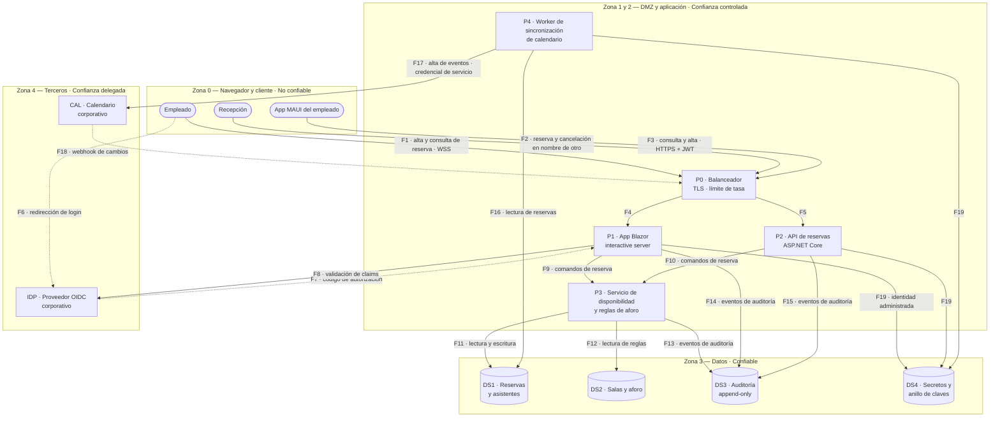

# Threat Model — `DOC-THREAT`

## 1. Resumen ejecutivo

El threat model toma el sistema tal como está diseñado, lo recorre elemento por elemento y responde cuatro preguntas en orden: qué estamos construyendo, qué puede salir mal, qué vamos a hacer al respecto y si el trabajo hecho fue suficiente. Su producto no es una lista de vulnerabilidades sino un conjunto de amenazas identificadas con su mitigación y su riesgo residual, trazable hasta un elemento concreto del diseño.

Se apoya en dos artefactos y produce un tercero. Consume el diseño —el [SAD](SAD.md) y el [HLD](HLD.md)— para construir el diagrama de flujo de datos con sus límites de confianza, y consume la [arquitectura de seguridad](Arquitectura-de-Seguridad.md) para saber qué controles existen. Produce la lista de controles que faltan, que es lo que justifica el ejercicio: los controles que el equipo ya había pensado no necesitan un modelo de amenazas para aparecer.

Su lector natural es el arquitecto, que descubre acá que un límite de confianza estaba mal puesto; el desarrollador, que encuentra el caso que su validación no cubre; y QA, para quien cada amenaza mitigada es un caso de prueba negativo con nombre. Es un documento vivo: se rehace ante cada cambio de superficie, y un threat model con dos años y tres funcionalidades nuevas sin modelar describe un sistema que ya no existe.

---

## 2. Definición

### Qué es

Un análisis estructurado del diseño de un sistema orientado a identificar amenazas antes de que se conviertan en incidentes. El método que esta guía usa como referencia es **STRIDE**, desarrollado en Microsoft, que clasifica las amenazas en seis categorías —suplantación, manipulación, repudio, divulgación de información, denegación de servicio y elevación de privilegio— y las aplica sistemáticamente a cada elemento de un diagrama de flujo de datos. La sistematicidad es el punto: la diferencia entre un threat model y una sesión de lluvia de ideas sobre seguridad es que el primero garantiza cobertura por construcción.

El diagrama de flujo de datos con límites de confianza es el corazón del ejercicio y no una ilustración. Un límite de confianza es el lugar donde los datos pasan de un ámbito con ciertas garantías a otro con garantías distintas, y es donde se concentran las amenazas: casi todo lo interesante ocurre cuando algo cruza una frontera. Dibujar mal las fronteras produce un modelo que enumera amenazas irrelevantes y omite las reales.

### Qué problema resuelve

Convierte la seguridad de una lista de buenas prácticas en un ejercicio dirigido por el diseño concreto. Un equipo que aplica controles de un catálogo protege lo que el catálogo previó; un equipo que modela amenazas descubre las que su sistema tiene por cómo está armado —el identificador de sala que viaja en el cuerpo de la petición, el trabajo en segundo plano que corre con permisos amplios, la cancelación que no deja rastro— y que ningún catálogo genérico podía anticipar.

Resuelve además un problema de momento. Encontrar que la autorización de una operación se decide en el cliente cuesta una tarde de rediseño si se descubre modelando el HLD, y cuesta una versión de emergencia si se descubre cuando alguien lo explota. El retorno del ejercicio es mayor cuanto más temprano se hace, y por eso la primera pasada se hace sobre un diagrama, no sobre código.

### Qué NO es, y con qué se lo confunde

**No es la arquitectura de seguridad.** Los dos documentos tratan sobre lo mismo desde métodos opuestos, y la confusión produce que uno de los dos no se escriba. La [arquitectura de seguridad](Arquitectura-de-Seguridad.md) es **prescriptiva**: declara la postura —identidad, autenticación, autorización, zonas de confianza, gestión de secretos, cifrado en tránsito y en reposo, auditoría— y fija los controles exigidos. El threat model es **analítico e iterativo**: parte del sistema tal como está diseñado y pregunta qué puede salir mal, quién lo haría y qué se hace al respecto. Uno define los controles; el otro los justifica y descubre los que faltan.

La prueba de que se confundieron es un documento único donde las amenazas se enumeran después de los controles y cada una tiene, casualmente, un control que ya estaba previsto. Un modelo de amenazas que no encuentra nada nuevo no se hizo: se redactó.

| Dimensión | Threat Model | Arquitectura de seguridad |
|-----------|--------------|---------------------------|
| Naturaleza | Analítica, iterativa | Prescriptiva, normativa |
| Entrada | Diseño, flujos de datos, límites de confianza | Activos, política, requisitos no funcionales |
| Pregunta | ¿Qué puede salir mal y quién lo haría? | ¿Qué controles exige el sistema? |
| Salida | Amenazas, mitigaciones, riesgo residual | Postura: controles, zonas, políticas |
| Momento | Ante cada cambio de superficie | Al fijar o revisar la estructura |
| Señal de mala calidad | No encuentra controles faltantes | Controles sin amenaza que los motive |

**No es un pentest.** El pentest verifica empíricamente, contra un sistema desplegado, si una vulnerabilidad es explotable; el threat model razona sobre el diseño, antes de que exista qué atacar. Se complementan en un orden natural: el modelo dice dónde mirar y el pentest confirma si el control aguanta. Un pentest sin modelo previo prueba lo que al equipo de prueba se le ocurre; un modelo sin verificación posterior asume que las mitigaciones funcionan.

**No es una auditoría de cumplimiento.** El cumplimiento comprueba la existencia de evidencia documental de controles frente a un marco externo. El threat model no comprueba nada: descubre. Un sistema puede tener todos los controles que un marco exige y una amenaza no cubierta por ese marco, porque los marcos son genéricos por definición y las amenazas son específicas del diseño.

**No es un análisis de riesgo de negocio.** El modelo evalúa riesgo técnico y propone mitigaciones; la decisión de aceptar un riesgo residual pertenece al dueño del producto, según fija [Actores](../00-Marco-de-Referencia/Actores.md) para `ACT-07`. El especialista que acepta riesgos por su cuenta está tomando una decisión que no le corresponde, y el que no los escribe deja al negocio sin la posibilidad de tomarla.

**No es una lista de las diez vulnerabilidades más comunes.** OWASP Top 10 es un instrumento de concientización sobre categorías de riesgo prevalentes y OWASP ASVS es un catálogo de requisitos de verificación; ambos son insumos útiles y ninguno es un modelo de amenazas del sistema propio. Recorrerlos como lista de comprobación es un ejercicio distinto, complementario y mucho más barato, que no sustituye al análisis por elemento.

Los modelos de arquitectura que cambian la forma del diagrama de flujo —capas, hexagonal, microservicios— se tratan en [Modelos de arquitectura](../90-Modelos-de-Arquitectura/README.md); acá se los toma como dados.

---

## 3. Aplicación por escenario

| Escenario | Sobre qué se modela | Quién participa | Producto característico |
|-----------|--------------------|-----------------|------------------------|
| `ESC-1` | El diseño de alto nivel, antes del código | `ACT-03` y `ACT-07`, con `ACT-04` | Requisitos de seguridad que entran al [SRS](../20-Analisis/SRS.md) |
| `ESC-2` | Las dos arquitecturas, y sobre todo la superficie nueva | `ACT-03`, `ACT-07`, `ACT-06` | Amenazas introducidas por el cambio de plataforma |
| `ESC-3` | El sistema real reconstruido desde el código | `ACT-07` con quien mantiene el sistema | Brecha entre postura documentada y postura efectiva |
| `ESC-4` | La superficie observable, como hipótesis | `ACT-07` en solitario | Modelo de confianza baja, útil para decidir si comprar |

### `ESC-1` — Desarrollo nuevo

El modelo se construye sobre el diagrama de componentes del HLD, y su valor está en que a esa altura mover un límite de confianza cuesta editar un archivo. La primera pasada se hace apenas hay una topología estable, aunque falten detalles: modelar tarde para tener más información es el modo más común de perder la oportunidad.

Lo que el ejercicio produce en este escenario tiene una forma concreta y no queda solo en este documento. Cada mitigación aceptada se convierte en un requisito no funcional del [SRS](../20-Analisis/SRS.md) con identificador propio, en un control de la [arquitectura de seguridad](Arquitectura-de-Seguridad.md) y en un caso de prueba negativo. Un threat model cuyas mitigaciones no atraviesan esa cadena es un documento que se archiva.

La cadencia importa tanto como la primera pasada: se remodela cuando aparece un actor nuevo, cuando se agrega una integración externa, cuando cambia el modelo de autorización o cuando un componente cruza de zona. Esos cuatro disparadores conviene escribirlos en el propio documento, porque «cuando cambie algo relevante» no dispara nunca.

### `ESC-2` — Migración

Se modelan dos sistemas y la comparación es el entregable. La superficie del origen suele estar mitigada por accidentes de plataforma que el destino no reproduce: una aplicación ASP.NET MVC que renderizaba en servidor y solo aceptaba envíos de formulario tiene una superficie muy distinta de la misma funcionalidad expuesta como API para un cliente MAUI. El destino agrega, típicamente, endpoints directamente alcanzables, credenciales que viajan fuera del navegador y estado de sesión en un lugar nuevo.

La trampa específica es asumir que la paridad funcional implica paridad de seguridad. Una operación que en el origen solo era invocable desde una pantalla a la que se llegaba tras tres pasos, en el destino es una petición HTTP que cualquiera con un token válido puede construir en cualquier orden. La amenaza no existía antes y no aparece en ninguna prueba de paridad, porque las pruebas de paridad verifican que lo permitido siga permitido, no que lo impedido siga impedido.

### `ESC-3` — Evaluación con acceso al código

El diagrama de flujo se reconstruye desde evidencia antes de modelar nada, y esa reconstrucción es la mitad del trabajo. Los flujos reales se derivan del registro de rutas y controladores, de las llamadas salientes por cliente HTTP, de los trabajos en segundo plano registrados como servicios alojados y de las cadenas de conexión, que revelan almacenes que el diagrama oficial suele omitir. Los límites de confianza se derivan de la configuración de despliegue, no del diagrama que el equipo dibujó.

Los controles efectivos se leen con el método que detalla la [arquitectura de seguridad](Arquitectura-de-Seguridad.md) en su sección de `ESC-3`: atributos `[Authorize]` y políticas, orden del middleware, `appsettings` por entorno, manejo de secretos. El aporte propio del threat model es la comparación: para cada amenaza identificada sobre el diagrama, se busca en el código el control que la mitiga. Las tres respuestas posibles —control presente y efectivo, control presente pero eludible, control ausente— son los tres tipos de hallazgo del escenario, y la segunda es la más valiosa porque es invisible desde la documentación.

Todo lo que no se pudo verificar se marca como tal en la propia fila. Un modelo que declara una amenaza mitigada sin haber visto el control es peor que uno que declara la duda.

### `ESC-4` — Evaluación solo desde afuera

El modelo se construye sobre hipótesis y su confianza es baja por definición: se infiere la existencia de un almacén de datos porque hay persistencia observable, se infiere un límite de confianza porque el flujo de inicio de sesión redirige a otro dominio, se infiere un proceso en segundo plano porque una acción produce efectos diferidos. Cada elemento del diagrama lleva su marca de confianza y el documento entero se etiqueta como hipótesis.

Lo que se puede inferir desde afuera, y con qué crédito:

| Observable | Qué permite inferir | Confianza |
|------------|--------------------|-----------|
| Cabeceras de seguridad de la respuesta | Existencia y madurez de controles de plataforma | Alta sobre la cabecera; baja sobre lo que implica del resto |
| Atributos de la cookie de sesión | Política de sesión y exposición ante robo de cookie | Alta sobre el atributo; media sobre la vida real de la sesión |
| Flujo de inicio de sesión y sus redirecciones | Identidad federada, límite de confianza con un tercero | Media-alta |
| Mensajes de error diferenciados en el login | Posibilidad de enumeración de usuarios | Media |
| Política de contraseñas publicada en el registro | Requisitos exigidos al usuario | Alta sobre lo declarado; nula sobre su validación en servidor |
| Estructura de URLs y de identificadores visibles | Superficie de manipulación de parámetros | Media |
| Notas de versión y changelog público | Áreas de cambio reciente, y por lo tanto de superficie nueva | Media |

El límite es el mismo que fija [Escenarios](../00-Marco-de-Referencia/Escenarios.md) y en este documento se enuncia sin matices: **no se prueban controles ajenos**. Modelar la amenaza de que un identificador de reserva sea manipulable es análisis legítimo y se escribe con su marca de hipótesis. Manipularlo para ver qué devuelve el servidor es acceso no autorizado, con consecuencias legales que no dependen de que haya daño ni de la intención declarada, y con el detalle práctico de que un control que sí funciona deja registro del intento y lo atribuye a quien lo hizo. Cuando el análisis necesita confirmación empírica, la salida es pedir acceso y pasar a `ESC-3`, o contratar una prueba de intrusión con autorización escrita del titular del sistema.

### Variación por contexto

En `CTX-1` el modelo se concentra en el cliente y en la sesión: manipulación de lo que viaja desde el navegador, robo de cookie, falsificación de solicitud entre sitios, inyección de contenido en la interfaz. Con Blazor *interactive server* aparece una superficie propia: el estado vive en el servidor y el circuito SignalR es a la vez un canal de confianza y un recurso agotable, lo que convierte la creación masiva de circuitos en una denegación de servicio barata y el estado del circuito en un objetivo de manipulación.

En `CTX-2` el peso se desplaza a la manipulación de parámetros del contrato, a la autorización a nivel de objeto —el caso clásico del identificador ajeno en una petición autenticada—, a la validación de tokens y al abuso de tasa. Aquí el diagrama de flujo tiende a ser más rico en almacenes y en flujos entre servicios, y los límites de confianza internos entre servicios propios son los que más se olvidan.

En `CTX-3` el problema es la doble evaluación: la misma regla se verifica en el componente y en el servicio, y el modelo debe decir cuál de las dos instancias es autoritativa. Cuando la respuesta es «el componente», hay una amenaza. La traza vertical de [Contextos](../00-Marco-de-Referencia/Contextos.md) aplica también acá: cada amenaza debe poder seguirse hasta la política que la mitiga y el caso de prueba que lo verifica.

---

## 4. Ejemplos concretos

El sistema modelado es el de reserva de salas de la guía, con una aplicación Blazor *interactive server* para el uso interno, una API ASP.NET Core consumida por un cliente .NET MAUI, un trabajo en segundo plano que sincroniza con el calendario corporativo y una base de datos relacional. Los datos son sintéticos y el modelo es ilustrativo.

### Diagrama de flujo de datos con límites de confianza



Cuatro límites de confianza importan y conviene nombrarlos, porque el análisis de la sección siguiente se organiza por ellos. El **límite 0→1** es el que todo diseño reconoce: todo lo que llega del navegador o del cliente móvil es entrada no confiable, incluidos los valores que la propia aplicación puso ahí. El **límite 1/2→3** separa la aplicación de los datos y es donde se decide si un compromiso de la aplicación se convierte en un compromiso de los datos. El **límite hacia la zona 4** es el más olvidado: `F7` trae claims de un tercero de confianza y `F18` trae un webhook desde fuera, que es entrada no confiable con apariencia de interna. Y hay un cuarto límite que no se dibuja como zona pero se comporta como tal: `P4` corre sin usuario, con credencial propia, y por lo tanto todo lo que lo alcance opera con los permisos de un principal de servicio.

El flujo `F18` merece atención por sí solo. Un webhook entrante desde el calendario corporativo llega a la zona 1 con el aspecto de una integración de confianza y sin ningún usuario detrás; si no se autentica y no se valida su origen, es un canal directo desde Internet hacia la lógica de reservas.

Conviene señalar también qué no aparece en el diagrama y por qué. No se dibujan los componentes de observabilidad ni el pipeline de despliegue, porque el alcance declarado en la sección 1 de la plantilla es el sistema en ejecución; ambos tienen su propia superficie y merecen un modelo aparte, decisión que se registra en lugar de dejarla implícita. Tampoco se dibuja la caché en memoria de reglas de aforo dentro de `P3`: al no cruzar ningún límite de confianza, no agrega amenazas de manipulación desde afuera, aunque sí explica por qué un cambio de aforo tarda en propagarse. Ese criterio —dibujar lo que cruza fronteras, omitir con nota lo que no— es lo que mantiene el diagrama legible sin volverlo incompleto.

### Análisis STRIDE por elemento

Las amenazas se identifican con prefijo `TH-`, los controles con `CTL-`, y el riesgo residual se califica tras aplicar el control. Cada control declarado acá tiene su contraparte en la [arquitectura de seguridad](Arquitectura-de-Seguridad.md); las filas donde el control no existe todavía son el producto real del ejercicio.

**Suplantación (Spoofing)**

| ID | Elemento | Amenaza concreta | Control propuesto | Riesgo residual |
|----|----------|------------------|-------------------|-----------------|
| `TH-01` | `F1`, `P1` | Robo de la cookie de sesión y uso del circuito Blazor como el empleado legítimo | Cookie `HttpOnly`, `Secure`, `SameSite=Lax`; TLS con HSTS; política de seguridad de contenido estricta | Bajo. Persiste el robo por compromiso del dispositivo del usuario |
| `TH-02` | `DS4` | Obtención del anillo de claves y emisión de cookies válidas para cualquier usuario, incluida la del administrador de instalaciones | Anillo cifrado en reposo; acceso solo por identidad administrada de `P1`, `P2` y `P4`; sin credencial estática | Bajo, pero de impacto crítico: no hay detección posterior. Se compensa con alerta sobre accesos al almacén |
| `TH-03` | `F18` | Un tercero envía un webhook falso simulando ser el calendario corporativo y provoca altas o cancelaciones | Autenticación mutua o firma verificada del webhook; lista de origen; el webhook nunca ejecuta comandos, solo encola una verificación contra `CAL` | Bajo |
| `TH-04` | `F3`, `P2` | Reutilización de un token de acceso extraído del almacenamiento del dispositivo MAUI | Token de quince minutos; refresco ligado al dispositivo; almacenamiento en el llavero del sistema operativo | Medio. Un dispositivo comprometido opera hasta que el refresco falle |

**Manipulación (Tampering)**

| ID | Elemento | Amenaza concreta | Control propuesto | Riesgo residual |
|----|----------|------------------|-------------------|-----------------|
| `TH-05` | `F1`, `F3`, `P3` | Manipulación del identificador de sala o del identificador de titular en la petición de alta, para reservar en nombre de otro empleado | Autorización a nivel de objeto en `P3`: el titular se toma del principal autenticado y nunca del cuerpo de la petición; la excepción para recepción exige claim de rol y motivo obligatorio | Bajo. Depende de que ningún endpoint nuevo acepte el titular como parámetro; se cubre con revisión de contrato |
| `TH-06` | `F1`, `P1` | Manipulación del estado del circuito Blazor para saltar una validación que el componente ya había ejecutado | Revalidación de reglas de aforo y autorización en `P3` en el momento de ejecutar; el componente valida para experiencia de usuario, no para seguridad | Bajo |
| `TH-07` | `F11`, `DS1` | Escritura de reservas superpuestas explotando la ventana entre la comprobación de disponibilidad y la confirmación | Índice único sobre sala e intervalo en `DS1`; transacción con detección de conflicto y respuesta `409` | Muy bajo. Es también un requisito funcional, `RN-007` en el [SRS](../20-Analisis/SRS.md) |
| `TH-08` | `F17`, `P4` | Un compromiso de `P4` altera eventos en el calendario corporativo de toda la organización | Credencial de `P4` acotada al calendario de recursos, sin permiso sobre calendarios personales; rotación automática | Medio. El alcance mínimo del proveedor sigue siendo mayor que el necesario; aceptado y firmado |

**Repudio (Repudiation)**

| ID | Elemento | Amenaza concreta | Control propuesto | Riesgo residual |
|----|----------|------------------|-------------------|-----------------|
| `TH-09` | `F2`, `DS3` | Recepción cancela la reserva de un empleado y luego niega haberlo hecho; sin registro, la disputa no se resuelve | Auditoría obligatoria de toda cancelación con principal que actúa, principal en cuyo nombre actúa, motivo, marca temporal de servidor y origen | Bajo, si la escritura de auditoría es parte de la misma transacción que la cancelación |
| `TH-10` | `DS3` | Un administrador de instalaciones borra o edita entradas de auditoría que lo comprometen | Almacén sin permiso de modificación ni borrado para la aplicación; lectura desde una identidad distinta; retención definida en el documento | Bajo. Persiste el compromiso de la plataforma subyacente |
| `TH-11` | `F17` | Un evento creado por la integración no puede atribuirse a nadie, porque `P4` actúa sin usuario | Todo evento de `P4` referencia la reserva de origen y su titular; la auditoría registra el principal de servicio y la reserva que motivó la acción | Bajo |

**Divulgación de información (Information disclosure)**

| ID | Elemento | Amenaza concreta | Control propuesto | Riesgo residual |
|----|----------|------------------|-------------------|-----------------|
| `TH-12` | `F9`, `F10`, `P3` | Un empleado consulta reservas ajenas y obtiene la lista de asistentes, revelando con quién se reúne cada persona | Autorización por operación: la lista de asistentes solo se devuelve al titular y al administrador de instalaciones; recepción recibe nombres sin correos | Bajo |
| `TH-13` | `P1`, `P2` | Mensajes de error detallados exponen consultas, rutas o versiones de componentes | `DetailedErrors` deshabilitado fuera de desarrollo; respuestas de error genéricas con identificador de correlación para el soporte | Muy bajo |
| `TH-14` | `DS1` | Acceso de lectura al motor de base de datos expone correos de asistentes en claro | Cifrado en reposo a nivel de motor; minimización de campos; acceso solo desde identidades administradas | Medio. Los campos usados en búsqueda quedan legibles con acceso al motor; riesgo aceptado y firmado en la [arquitectura de seguridad](Arquitectura-de-Seguridad.md) |
| `TH-15` | `F16`, `P4` | La agenda completa se filtra por una exportación abusiva del administrador de instalaciones | La exportación es una operación aparte, autorizada aparte y auditada con volumen y filtro aplicado; alerta sobre exportaciones fuera de patrón | Medio. Un rol legítimo con intención maliciosa sigue pudiendo extraer; se detecta, no se impide |

**Denegación de servicio (Denial of service)**

| ID | Elemento | Amenaza concreta | Control propuesto | Riesgo residual |
|----|----------|------------------|-------------------|-----------------|
| `TH-16` | `F1`, `F3`, `P3` | Reserva masiva automatizada: un script autenticado ocupa todas las salas del trimestre y bloquea la operación de la organización | Límite de tasa por principal en `P0`; cuota de reservas futuras por empleado y por ventana temporal; detección de patrón y alerta a recepción, que puede cancelar en bloque | Medio. Un actor interno con varias cuentas legítimas puede diluir el patrón |
| `TH-17` | `P1` | Apertura masiva de circuitos SignalR agota memoria del servidor y deja la aplicación sin servicio para el resto | Límite de circuitos concurrentes por usuario y global; expiración agresiva de circuitos desconectados; escalado horizontal con anillo de claves compartido | Medio. La superficie es intrínseca al modelo *interactive server* y se compensa con capacidad y alertas |
| `TH-18` | `F8`, `IDP` | La indisponibilidad del proveedor de identidad deja el sistema inutilizable | Caché de claves de firma y tolerancia a la caída del proveedor para sesiones ya establecidas; degradación documentada: no hay inicios de sesión nuevos | Alto por diseño. Consecuencia asumida de la identidad federada, registrada en el [ADR](ADR.md) correspondiente |

**Elevación de privilegio (Elevation of privilege)**

| ID | Elemento | Amenaza concreta | Control propuesto | Riesgo residual |
|----|----------|------------------|-------------------|-----------------|
| `TH-19` | `P1`, `P3` | Un empleado alcanza operaciones del rol de administrador de instalaciones invocando el servicio del lado servidor cuya única protección era que `<AuthorizeView>` no renderizaba el botón | Política de autorización declarada sobre cada operación de `P3`, verificada en el servidor; el marcado condicional se documenta como recurso de interfaz, sin valor de control | Bajo. Se sostiene con revisión de código sobre operaciones nuevas |
| `TH-20` | `F7`, `IDP` | Un claim de grupo emitido por el proveedor se acepta sin validar y otorga el rol de administrador de instalaciones | Correspondencia explícita entre grupos del proveedor y roles de la aplicación, mantenida en la aplicación; se aceptan solo los claims de la lista, con emisor y audiencia verificados | Bajo |
| `TH-21` | `P4`, `DS4` | Un compromiso del worker, que corre sin usuario, otorga acceso a secretos y a la base con permisos de servicio | Identidad administrada propia de `P4`, distinta de la de `P1` y `P2`, con permisos limitados a lectura de reservas y a su credencial de calendario | Medio. `P4` sigue siendo el componente con mayor privilegio efectivo por unidad de superficie |
| `TH-22` | `F2`, `P3` | El permiso de actuar en nombre de otro, propio de recepción, se usa para crear una reserva y con ella obtener acceso físico a una sala restringida | El motivo es obligatorio y auditado; las salas con restricción de acceso exigen aprobación del administrador de instalaciones; revisión periódica del uso de la delegación | Medio. Es un control detectivo, no preventivo; aceptado por el negocio |

Dos observaciones sobre la tabla en conjunto. La categoría de repudio es la que más controles ausentes revela en sistemas reales, porque la auditoría se construye pensando en diagnóstico y no en atribución, y un registro que no distingue quién actúa de en nombre de quién actúa no sirve para resolver una disputa. Y la elevación de privilegio hacia el rol de administrador de instalaciones concentra tres amenazas de origen distinto —interfaz que no autoriza, claims sin validar, principal de servicio sobredimensionado—, lo que sugiere que ese rol merece un tratamiento aparte en la [arquitectura de seguridad](Arquitectura-de-Seguridad.md) y no una fila más en la tabla de permisos.

Para vincular estas amenazas con técnicas adversarias observadas en incidentes reales, MITRE ATT&CK ofrece un vocabulario común; su utilidad acá es de contraste, para preguntarse si el modelo cubre las técnicas que efectivamente se usan contra sistemas de este tipo.

---

## 5. Preguntas guía

Sobre el diagrama, que es donde se decide la calidad del resto:

- ¿El diagrama refleja el sistema real, o el sistema que el equipo cree que construyó?
- ¿Está dibujado cada almacén de datos, incluidos los caches, las colas y los registros?
- ¿Cada límite de confianza corresponde a un cambio real de garantías, o se dibujó por simetría?
- ¿Qué flujo entra desde afuera con apariencia de interno?

Sobre las amenazas:

- Para cada elemento, ¿se recorrieron las seis categorías, o se saltaron las que parecían no aplicar?
- ¿Quién querría hacer esto, con qué motivo y con qué capacidad? Si no hay respuesta, la amenaza es teórica.
- ¿Qué amenaza proviene de un usuario legítimo actuando dentro de sus permisos?
- ¿Cuál de estas amenazas no existía en la versión anterior del sistema?

Sobre las mitigaciones y el cierre:

- ¿El control propuesto está implementado, previsto o solo escrito?
- ¿Cómo se verifica que funciona, y quién escribió ese caso de prueba?
- ¿El riesgo residual está calificado y firmado por quien tiene autoridad para aceptarlo?
- ¿Qué encontró este ejercicio que el equipo no supiera antes de empezarlo?

---

## 6. Criterios de calidad y antipatrones

### Qué distingue una versión buena

Un threat model útil se reconoce en que **encontró algo**. Si todas las amenazas identificadas ya tenían control previsto, el ejercicio se documentó pero no se hizo, y la causa habitual es haber modelado sobre la arquitectura de seguridad en lugar de sobre el diseño.

La segunda propiedad es la trazabilidad en las dos direcciones: cada amenaza se ancla a un elemento identificado del diagrama, y cada mitigación se ancla a un control con dueño y a un caso de prueba. Un modelo cuyas amenazas no dicen sobre qué elemento aplican no se puede revisar cuando el diseño cambia, porque nadie sabe qué filas quedaron obsoletas.

La tercera es la calificación honesta del riesgo residual. Toda mitigación deja algo sin cubrir, y el modelo que declara riesgo residual nulo en todas sus filas está describiendo una aspiración. La utilidad del documento para el negocio está justamente en esa columna: es la que permite decidir si se invierte más o se acepta.

Sobre la forma, dos exigencias. El diagrama va en Mermaid, versionado junto al documento, porque un modelo de amenazas cuyo diagrama vive en una imagen exportada deja de actualizarse en el primer cambio. Y las amenazas se enuncian en el vocabulario del dominio —«reservar en nombre de otro», «cancelar sin dejar rastro»— y no en el del catálogo, porque una amenaza que el equipo funcional no entiende no se prioriza.

### Antipatrones

**El modelo que confirma lo que ya se sabía.** Ninguna amenaza descubierta, ningún control faltante, ninguna discusión. Es el resultado de escribir el modelo después de la arquitectura de seguridad y usando esta como guion.

**El diagrama sin límites de confianza.** Cajas y flechas sin zonas. El análisis que sigue enumera amenazas genéricas sobre cada caja, porque sin fronteras no hay dónde concentrar la atención, y termina siendo una lista de comprobación disfrazada.

**STRIDE como formulario.** Seis filas por elemento, rellenadas todas para que la matriz quede completa, con amenazas inventadas donde la categoría no aplicaba. La cobertura sistemática es el valor del método; forzar filas para que no haya huecos lo destruye. Cuando una categoría no aplica a un elemento, se dice así en una línea y se explica por qué.

**Amenazas sin actor.** «Un atacante podría manipular el parámetro.» ¿Quién, con qué acceso, con qué motivo? Sin actor no hay probabilidad, sin probabilidad no hay riesgo y sin riesgo no hay prioridad, y el equipo termina tratando igual la amenaza del empleado curioso y la del estado nación.

**Ignorar al usuario legítimo.** Se modela contra el atacante externo y se omite al interno que actúa dentro de sus permisos. `TH-15`, `TH-16` y `TH-22` son de esa clase, son las más frecuentes en sistemas de línea de negocio y las que peor se cubren, porque su mitigación es detectiva y no preventiva.

**El modelo de una sola vez.** Se hace en el diseño inicial, se archiva y el sistema agrega tres integraciones y un cliente móvil. El documento sigue siendo correcto sobre un sistema que ya no es el que está en producción.

**Mitigaciones sin destino.** El modelo propone controles que nunca entran al backlog, al [SRS](../20-Analisis/SRS.md) ni a la [arquitectura de seguridad](Arquitectura-de-Seguridad.md). El ejercicio se hizo bien y no cambió nada.

**Aceptar el riesgo desde el rol equivocado.** El especialista en seguridad califica el riesgo residual como aceptable y nadie del negocio firma. Cuando el riesgo se materializa, la decisión no tiene dueño.

---

## 7. Anexo — Plantilla comentada

```markdown
---
doc_id: THREAT-<sistema>
doc_type: tema
title: Threat Model — <sistema> — <versión o alcance>
status: borrador | vigente | obsoleto
origin: human | ia-assisted | ia-generated
confidence: alta | media | baja
owner: <ACT-07 y persona concreta que firma>
last_review: AAAA-MM-DD
audience: [humano, agente]
traces: [DOC-SECARQ, DOC-SAD, DOC-HLD, DOC-ADR, ...]
---

# Threat Model — <sistema>

## 1. Alcance y encuadre
<!-- ¿Qué versión y qué parte del sistema se modela?
     ¿Escenario ESC-_ y contexto CTX-_?
     ¿Qué queda fuera del modelo, y por qué?
     ¿Quiénes participaron de la sesión y en qué fecha? -->

## 2. Qué estamos construyendo — diagrama de flujo de datos
<!-- Primera de las cuatro preguntas del método.
     Mermaid, con subgraphs por zona de confianza.
     Cada elemento con ID: E- entidades externas, P- procesos,
     DS- almacenes, F- flujos.
     ¿Está dibujado TODO almacén, incluidos caches, colas y logs? -->

## 3. Límites de confianza
<!-- ¿Dónde cambian las garantías, y cuáles son a cada lado?
     Para cada límite: qué lo cruza, en qué dirección,
     qué se valida al cruzarlo.
     ¿Qué flujo entra desde afuera con apariencia de interno? -->

## 4. Actores de amenaza
<!-- ¿Quién querría atacar esto? Externo anónimo, usuario legítimo,
     usuario con rol elevado, principal de servicio comprometido,
     tercero integrado.
     Para cada uno: motivo plausible y capacidad supuesta.
     Sin actor, una amenaza no se puede priorizar. -->

## 5. Qué puede salir mal — análisis STRIDE
<!-- Segunda pregunta. Una tabla por categoría o una por elemento.
     Columnas: ID (TH-), elemento afectado, amenaza EN VOCABULARIO
     DEL DOMINIO, actor, control propuesto, riesgo residual.
     Cuando una categoría no aplica a un elemento: decirlo y explicar
     por qué, en lugar de omitir la fila o inventar una amenaza. -->

## 6. Qué vamos a hacer al respecto — plan de mitigación
<!-- Tercera pregunta. Para cada amenaza: mitigar, transferir, evitar
     o aceptar. ¿Dónde entra cada mitigación: SRS, arquitectura de
     seguridad, backlog, configuración de plataforma?
     ¿Quién es el responsable y con qué fecha comprometida? -->

## 7. Riesgo residual
<!-- ¿Qué queda sin cubrir después de aplicar todo lo anterior?
     Impacto, probabilidad, calificación.
     Quién lo acepta —con nombre y fecha— y hasta cuándo.
     Una fila sin firma no cuenta como riesgo aceptado. -->

## 8. Verificación
<!-- Cuarta pregunta: ¿hicimos un buen trabajo?
     ¿Qué caso de prueba negativo verifica cada mitigación?
     ¿Qué se delega a una prueba de intrusión?
     ¿Qué control se comprueba automáticamente en el pipeline? -->

## 9. Disparadores de revisión
<!-- ¿Qué cambio obliga a rehacer este modelo?
     Ejemplos: actor nuevo, integración externa nueva, cambio del
     modelo de autorización, componente que cambia de zona.
     "Cuando cambie algo relevante" no dispara nunca. -->

## 10. Supuestos y no verificado
<!-- ¿Qué se dio por cierto sin comprobar?
     En ESC-3 y ESC-4, obligatorio: qué es observación,
     qué es inferencia y con qué confianza. -->
```

La sección 9 es la que decide si el documento sigue vivo dentro de un año. Las nueve anteriores describen el sistema de hoy; los disparadores son lo único que hace que alguien vuelva a abrirlo cuando ese sistema cambie.

---

## Enlaces

- Familia: [Documentación de arquitectura](README.md) — `FAM-ARQ`.
- Documento hermano: [Arquitectura de seguridad](Arquitectura-de-Seguridad.md) — `DOC-SECARQ`.
- [SAD](SAD.md), [HLD](HLD.md), [ADR](ADR.md) — entrada del modelo y destino de las decisiones que produce.
- [SRS](../20-Analisis/SRS.md) — destino de las mitigaciones que se vuelven requisito.
- [LLD](../40-Diseno/LLD.md) — implementación concreta de cada mitigación.
- [Modelos de arquitectura](../90-Modelos-de-Arquitectura/README.md) — cómo cambia el diagrama de flujo según el modelo estructural.
- Marco: [Escenarios](../00-Marco-de-Referencia/Escenarios.md) · [Contextos](../00-Marco-de-Referencia/Contextos.md) · [Actores](../00-Marco-de-Referencia/Actores.md) · [Convenciones](../00-Marco-de-Referencia/Convenciones.md).
