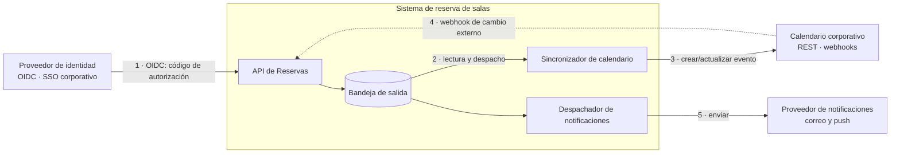
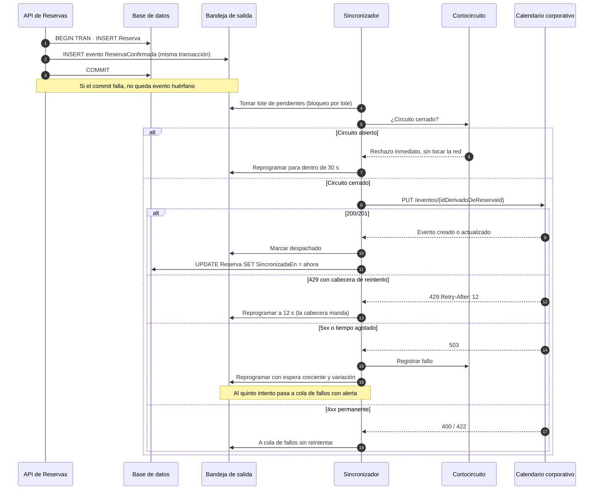

# Integration Guide — `DOC-INTEGRACION`

## 1. Resumen ejecutivo

La Integration Guide explica cómo este sistema y los ajenos se conectan: qué sistemas externos se consumen y con qué contrato, cómo se autentican entre sí, qué pasa cuando el otro lado no responde, qué eventos se publican y con qué garantías, y qué debe hacer un equipo externo para integrarse desde cero hasta producción. Es narrativa donde la [API Specification](API-Specification.md) es de referencia: contesta «cómo resuelvo mi caso» en lugar de «qué devuelve este endpoint».

Su lector típico llega con una tarea concreta y un plazo. Un desarrollador de otra área que debe consultar disponibilidad de salas desde su propio sistema; un integrador de un proveedor que va a publicar reservas en el calendario corporativo; el propio equipo, seis meses después, tratando de entender por qué la sincronización con el calendario tiene un reintento con espera creciente y qué pasa si se lo quita. Sirve a `ACT-04` como productor, y `ACT-06` y `ACT-07` son consultados de forma sustantiva: la operación de una integración —qué se monitorea, qué alerta— y su superficie de riesgo —credenciales, datos que salen del perímetro— no las decide quien escribe el cliente.

---

## 2. Definición

### Qué es

El documento que describe los puntos de contacto entre sistemas que no comparten equipo, despliegue ni ciclo de vida, y las decisiones que hacen que esos contactos sobrevivan a la falla del otro lado. Cubre las dos direcciones: cómo se consume lo ajeno y cómo un tercero consume lo propio. Y cubre las dos formas de acoplamiento: la llamada sincrónica, donde el que llama espera y sufre la latencia y la caída del otro, y el evento asincrónico, donde el acoplamiento se traslada al contrato del mensaje y a las garantías de entrega.

### Qué problema resuelve

Que la falla ajena no se convierta en falla propia. Un sistema que llama sincrónicamente a otro hereda su disponibilidad: si el calendario corporativo tarda treinta segundos, las reservas tardan treinta segundos, y si sus conexiones se agotan, las del sistema propio se agotan detrás. Las técnicas que lo evitan —tiempo límite, reintento con espera creciente, cortocircuito, degradación— son conocidas, y sin embargo lo que falta casi siempre no es la técnica sino la **decisión documentada**: qué integración es crítica y cuál se puede degradar, qué se hace cuando el otro lado no responde, y qué le decimos al usuario.

Resuelve también el problema del integrador nuevo. El tiempo entre «quiero integrarme» y «tengo la primera llamada funcionando» es una métrica real de calidad documental, y cuando se mide en semanas, casi siempre lo que falta no es contrato sino camino: cómo se piden credenciales, dónde está el sandbox, qué límites tiene, cómo se sabe que algo funcionó.

### Qué NO es

**No es la API Specification.** Una describe cada operación de forma exhaustiva; la otra explica cómo se combinan para resolver un caso. La guía dice «para reprogramar una reserva desde un sistema externo: obtenga el token con el alcance `reservas:escribir`, consulte disponibilidad, envíe la reprogramación con `If-Match` usando el `ETag` que recibió, y maneje el `412` reconsultando». Ninguno de esos cuatro pasos está mal documentado en la especificación; el orden y el porqué no están en ninguna parte.

**No es el Developer Guide.** El [Developer Guide](../60-Desarrollo/Developer-Guide.md) sirve a quien trabaja dentro del sistema: cómo se levanta el entorno, qué convenciones rigen, cómo se ejecutan las pruebas. La Integration Guide sirve a quien está afuera y no tiene ni tendrá acceso al repositorio. Cuando se mezclan, el integrador externo lee instrucciones que no puede ejecutar.

**No es el HLD.** El [HLD](../30-Arquitectura/HLD.md) decide que existe una integración con el calendario corporativo y que es asincrónica. La Integration Guide especifica el contrato, el manejo de errores y el procedimiento operativo de esa integración ya decidida.

---

## 3. Aplicación por escenario

| Escenario | Naturaleza | Fuente principal | Riesgo característico |
|-----------|-----------|------------------|----------------------|
| `ESC-1` Desarrollo nuevo | Prescriptiva; se escribe antes de integrar | Documentación del tercero | Diseñar suponiendo que el tercero siempre responde |
| `ESC-2` Migración | Inventario del origen más contrato del destino | Configuración y tráfico reales | Descubrir integraciones no documentadas después del corte |
| `ESC-3` Evaluación con código | Descriptiva: inventario de lo que hay | Configuración, secretos, registros de red | Confundir integración configurada con integración activa |
| `ESC-4` Evaluación externa | Inferencial, confianza baja | Comportamiento observable y material público | Afirmar integraciones a partir de logotipos en el sitio |

En `ESC-1` la guía se escribe antes de integrar, no después, y su primera versión es el resumen de la documentación del tercero contrastado con lo que se probó. La distancia entre ambos es el hallazgo más valioso: los límites reales de frecuencia, la latencia observada en el percentil alto, los códigos de error que la documentación no menciona. Diseñar sin esa evidencia produce el defecto característico del escenario, que es asumir disponibilidad perfecta del otro lado.

En `ESC-2` el inventario de integraciones es de las tareas que más sorpresas guardan. Un sistema con diez años acumula integraciones que nadie recuerda: un archivo depositado cada noche en una carpeta compartida, un servicio que consulta la base directamente, un correo automático que otra área procesa. Ninguna aparece en un diagrama y todas fallan el día del corte. El método que las encuentra es el tráfico real —conexiones entrantes y salientes observadas durante un período representativo, incluido un cierre de mes— más el inventario de credenciales, que suele revelar consumidores olvidados.

En `ESC-3` el hallazgo relevante no es qué integraciones están configuradas sino cuáles están vivas. Un archivo de configuración con seis puntos de conexión puede corresponder a dos integraciones activas, dos apagadas por bandera y dos que apuntan a servicios que ya no existen. Los registros y las métricas de salida lo resuelven. Se documenta además lo que la evaluación busca y raras veces encuentra: dónde viven las credenciales, cuándo se rotaron por última vez y quién las conoce.

En `ESC-4` se puede observar bastante: los proveedores de identidad que la pantalla de acceso ofrece revelan las integraciones de SSO, las notificaciones recibidas revelan el proveedor de correo por sus cabeceras, la documentación pública y el estado de servicio del producto suelen enumerar dependencias. Todo eso es observación fechada. Lo que no se puede es inferir integraciones internas a partir del material comercial: un logotipo en una página de asociados no prueba integración técnica.

### Variación por contexto

En **`CTX-1`** las integraciones son pocas y específicas: el proveedor de identidad para el inicio de sesión, y las notificaciones push en MAUI. Ambas comparten una característica que las distingue del resto: **el usuario está mirando**. Un error de SSO no se puede reintentar en silencio; hay que decidir qué pantalla ve el usuario, si puede reintentar y qué pasa con la sesión a medias. La documentación de esas integraciones incluye estados de interfaz, cosa que en backend no tiene sentido.

En **`CTX-2`** el peso es máximo y el problema es de resiliencia y garantías: qué se reintenta, con qué límite, qué se deduplica, qué se compensa cuando una operación de dos pasos falla en el segundo.

En **`CTX-3`** aparece la propagación de la falla hasta la interfaz. Si el calendario corporativo no responde, la reserva se crea igual y la sincronización queda pendiente —esa es la decisión de degradación—, y el usuario debe enterarse de que su reserva existe pero todavía no aparece en su calendario. Documentar la degradación sin documentar qué ve el usuario deja el trabajo a medias, y produce la situación en que el sistema se comporta correctamente y el usuario cree que falló.

---

## 4. Ejemplos concretos — las tres integraciones del sistema de reservas



Las tres integraciones tienen criticidad distinta, y esa clasificación es la decisión de la que se derivan todas las demás.

| Integración | Criticidad | Si no responde | Máximo tolerable |
|-------------|-----------|----------------|------------------|
| Proveedor de identidad | Crítica | Nadie puede iniciar sesión; el sistema queda inaccesible | Sin degradación posible |
| Calendario corporativo | Degradable | La reserva se crea; la sincronización queda pendiente y se reintenta | 4 horas de retraso |
| Notificaciones | Degradable | La reserva se crea; el aviso se encola | 1 hora de retraso |

### 4.1 SSO — autenticación de personas

Integración sincrónica con el proveedor de identidad corporativo mediante OpenID Connect, flujo de código de autorización con PKCE tanto para la aplicación web como para MAUI. Lo que la guía documenta y la configuración no dice: qué reclamo del token identifica de forma estable al usuario y por qué no es el correo —el correo cambia cuando alguien se casa o cambia de área, y usarlo como identificador rompe todas las referencias históricas—; cómo se aprovisiona un usuario la primera vez que inicia sesión; qué ocurre cuando alguien deja la organización y su cuenta se deshabilita en el proveedor, dado que el token emitido sigue siendo válido hasta su vencimiento; y qué se hace si el proveedor está caído, que en este caso es nada, porque no hay degradación posible y decirlo con claridad evita que alguien proponga un acceso de emergencia que se convierta en la puerta trasera permanente.

### 4.2 Calendario corporativo — sincronización bidireccional

La integración más compleja de las tres, y la que ilustra todas las técnicas de resiliencia.

**Salida.** Cada reserva confirmada genera un evento en la bandeja de salida, escrito en la misma transacción que la reserva. El sincronizador lee la bandeja y crea o actualiza el evento en el calendario. La operación es idempotente porque el sistema propio provee el identificador del evento externo derivado del identificador de reserva, de modo que un reintento actualiza en lugar de duplicar. Cuando el proveedor no permite fijar identificador, la alternativa es una tabla de correspondencia escrita antes de la llamada, y el reintento consulta esa tabla antes de crear.

**Entrada.** El calendario notifica cambios externos por webhook —alguien movió la reunión desde su cliente de correo—. Los webhooks entrantes se verifican por firma, se aceptan devolviendo `202` de inmediato y se procesan en segundo plano: un webhook que se procesa sincrónicamente hace que la lentitud propia se convierta en reintentos y desactivaciones del lado del proveedor. Se deduplican por el identificador de entrega, porque los proveedores reenvían ante cualquier duda.

**Reintentos y espera creciente.** Solo se reintenta lo transitorio: fallo de red, tiempo agotado, `429`, y `5xx` salvo `501`. No se reintenta `400`, `401`, `403`, `404` ni `422`, porque el resultado será el mismo y el reintento consume cuota. La espera crece de forma exponencial desde un segundo hasta un máximo de cinco minutos, con **variación aleatoria**, y ese detalle no es adorno: sin aleatoriedad, cuando el proveedor vuelve de una caída todos los reintentos pendientes llegan simultáneamente y lo tiran de nuevo. Cinco intentos y el evento pasa a una cola de fallos con alerta.

Cuando el proveedor devuelve `429` con la cabecera que indica cuándo reintentar, ese valor manda sobre el cálculo propio. Ignorarlo es la forma más rápida de que un proveedor bloquee la integración.

**Cortocircuito.** Tras un número consecutivo de fallos —cinco en la configuración actual—, el circuito se abre y las llamadas fallan de inmediato sin intentar la red durante treinta segundos. Después deja pasar una llamada de prueba: si tiene éxito, se cierra; si falla, vuelve a abrirse. El beneficio no es solo propio: dejar de golpear un servicio que se está recuperando es lo que le permite recuperarse. Lo que hay que documentar además del umbral es el **comportamiento visible con el circuito abierto**: las reservas se siguen creando, la bandeja de salida acumula, y la interfaz muestra la reserva con sincronización pendiente. Sin esa definición, cada desarrollador implementa una degradación distinta.

El recorrido completo de una sincronización, desde la confirmación hasta el evento en el calendario ajeno, incluido el camino en que el tercero falla:



El detalle que el diagrama fija y que se implementa mal cuando no está escrito es el paso 2: el evento se escribe **en la misma transacción** que la reserva. Publicarlo después del commit deja una ventana en la que el proceso puede morir con la reserva creada y sin evento; publicarlo antes produce eventos de reservas inexistentes cuando el commit falla. La bandeja de salida elimina ambas ventanas al costo de un despachador aparte.

**Parámetros de resiliencia.** Se documentan con su valor, su unidad y la razón del valor, porque un número sin razón nadie se anima a cambiarlo.

| Parámetro | Valor | Razón |
|-----------|-------|-------|
| Tiempo límite de la llamada | 10 s | Percentil 99 observado del proveedor: 3,2 s |
| Intentos máximos | 5 | Cubre las interrupciones típicas del proveedor, de hasta 20 minutos |
| Espera inicial | 1 s | Menor que el reintento interno del proveedor |
| Factor de crecimiento | 2 | Exponencial: 1, 2, 4, 8, 16 s |
| Espera máxima | 5 min | Techo del retraso tolerado por el negocio: 4 h |
| Variación aleatoria | ±25 % | Dispersa la avalancha al recuperarse el proveedor |
| Umbral del cortocircuito | 5 fallos consecutivos | Distingue una falla real de un error aislado |
| Duración del circuito abierto | 30 s | Da margen a la recuperación sin retrasar de más |

**Conflictos.** Si la reserva se reprogramó en ambos lados, la regla es que el sistema de reservas gana, porque es el que hace cumplir la no superposición; el cambio del calendario se revierte y se notifica al usuario. La regla es discutible y por eso está escrita: lo inaceptable no es elegir mal sino no elegir.

### 4.3 Notificaciones

El caso más simple y el que mejor ilustra por qué la garantía de entrega debe declararse. El proveedor ofrece entrega *al menos una vez*, lo que significa que un aviso puede llegar dos veces. Se acepta esa duplicación para las notificaciones —recibir dos correos molesta, perderlos es peor— y se documenta que el consumidor no debe suponer entrega única. Para el push de MAUI, en cambio, la deduplicación se hace en el cliente por identificador de notificación, porque dos avisos idénticos en la pantalla de bloqueo se leen como un defecto del producto.

---

## 5. Contratos de eventos y garantías de entrega

Un evento publicado es un contrato tan obligante como un endpoint, y con una diferencia que lo hace más difícil de gobernar: quien lo consume no necesita permiso para empezar, con lo cual el publicador suele no saber quiénes son sus consumidores. La consecuencia práctica es que un cambio en la forma del evento rompe integraciones que nadie tenía registradas, y por eso el registro de consumidores no es burocracia: es el único mecanismo que permite deprecar.

El contrato de un evento se documenta con esquema —JSON Schema, o el formato del sistema de mensajería— y con la semántica que el esquema no expresa.

| Campo del contrato | Qué fija | Ejemplo en `ReservaConfirmada` |
|--------------------|----------|-------------------------------|
| Nombre y versión | Identidad del evento y su forma | `reservas.ReservaConfirmada.v2` |
| Clave de partición | Qué eventos conservan orden entre sí | `reservaId`: se ordenan los de una misma reserva |
| Garantía de entrega | Qué debe soportar el consumidor | Al menos una vez; deduplicar por `eventoId` |
| Clave de deduplicación | Con qué identificador se descarta el repetido | `eventoId`, único por publicación |
| Retención | Cuánto se puede releer | 7 días en el tema; luego solo desde el origen |
| Significado | Qué ocurrió, no qué debe hacerse | La reserva quedó confirmada; el consumidor decide qué hacer |

La última fila es la que más consecuencias tiene y la que más se viola. Un evento nombrado `EnviarNotificacionDeReserva` no es un evento sino un comando disfrazado: acopla al publicador con lo que el consumidor debe hacer, y cuando aparezca un segundo consumidor habrá que publicar un segundo evento. `ReservaConfirmada` describe un hecho, y cualquier número de consumidores decide qué hacer con él sin que el publicador se entere.

Las tres garantías posibles conviene nombrarlas sin ambigüedad. *Como máximo una vez* no duplica pero puede perder, y solo sirve para telemetría donde una muestra faltante no importa. *Al menos una vez* no pierde pero puede duplicar, y es la elección por defecto: exige que el consumidor sea idempotente, lo que se logra registrando los identificadores de evento procesados durante una ventana al menos igual a la retención. *Exactamente una vez* de punta a punta no existe como propiedad del transporte; lo que existe es entrega *al menos una vez* más un consumidor idempotente, y llamarlo por su nombre evita que alguien construya suponiendo una garantía que nadie le dio.

El orden merece la misma precisión. Los sistemas de mensajería particionados garantizan orden dentro de una partición y no entre particiones. Si el consumidor necesita procesar `ReservaConfirmada` antes que `ReservaCancelada` de la misma reserva, la clave de partición debe ser el identificador de reserva. Si además el consumidor puede recibirlos desordenados por un reintento, necesita un número de secuencia o una marca de versión para descartar lo viejo. Documentar «los eventos llegan en orden» sin decir en qué ámbito es la clase de imprecisión que produce estados corruptos difíciles de reproducir.

La evolución de un evento sigue las mismas reglas de compatibilidad que la API: agregar campos opcionales es compatible; quitar, renombrar o cambiar tipos no lo es. Cuando hace falta un cambio incompatible, se publican ambas versiones en paralelo mientras los consumidores migran, y solo entonces se retira la vieja. Sin registro de consumidores, ese «entonces» nunca llega con certeza.

---

## 6. Entornos de prueba y sandbox

Un integrador que no puede probar antes de producción va a probar en producción. Ofrecer un sandbox no es cortesía: es control de riesgo propio.

El sandbox del sistema de reservas es un despliegue completo con datos sintéticos, que se reinicia cada domingo a un estado conocido. Lo que la documentación debe declarar sobre él, porque cada punto es fuente de un incidente cuando se omite: **en qué difiere de producción** —no envía notificaciones reales, el calendario corporativo está sustituido por un doble que acepta todo, los límites de frecuencia son más estrictos para forzar al integrador a manejarlos—; **qué datos hay** y qué identificadores puede usar el integrador para probar cada caso, incluido el conjunto de datos que provoca deliberadamente un `409`, que es el escenario que nadie prueba y que todos encuentran en producción; **cuánto duran las credenciales** y cómo se renuevan; y **qué garantías de disponibilidad no tiene**, para que nadie construya una integración continua que dependa de él sin contemplar su indisponibilidad.

Del otro lado, para probar el consumo de sistemas externos hace falta decidir contra qué se prueba. Contra el sandbox del proveedor, cuando existe y es fiel; contra un doble propio, más rápido y estable pero que solo refleja lo que el equipo entendió del contrato. La combinación que funciona es dobles para las pruebas rápidas del día a día, más una batería reducida contra el sandbox real que corre a diario y detecta el día en que el proveedor cambió algo. Ese conjunto reducido es lo que convierte un cambio no anunciado del tercero en una alerta de la mañana en lugar de un incidente de la tarde.

---

## 7. Checklist de onboarding de un integrador

Secuencia ejecutable, pensada para que un equipo externo llegue a producción sin conversaciones. El indicador de calidad de esta guía es el tiempo que toma completarla sin ayuda.

1. **Encuadre.** Identificar el caso de uso, las operaciones necesarias y los volúmenes esperados. Si el volumen supera los límites publicados, corresponde acordarlo antes y no descubrirlo con `429`.
2. **Registro.** Solicitar credenciales de sandbox indicando responsable técnico y canal de contacto para avisos de cambio. Sin ese canal, el integrador no se entera de las deprecaciones.
3. **Primera llamada.** Obtener token con el alcance mínimo necesario y ejecutar una consulta de solo lectura. Punto de control: se recibió `200` con datos.
4. **Caso completo en sandbox.** Consultar disponibilidad, crear una reserva con `Idempotency-Key`, verificar el `201` y el encabezado `Location`.
5. **Caminos de error.** Reenviar la misma petición con la misma clave y verificar el `200` con la misma reserva. Provocar un `409` con los datos de prueba previstos y verificar que el cliente procesa las alternativas. Enviar un cuerpo inválido y verificar el manejo del `422`.
6. **Resiliencia.** Verificar que el cliente respeta la cabecera de reintento ante `429`, que aplica espera creciente con variación, y que no reintenta los errores permanentes.
7. **Eventos**, si aplica. Suscribirse en sandbox, verificar la recepción, y comprobar la deduplicación reprocesando un evento ya procesado.
8. **Seguridad.** Confirmar que las credenciales no están en el repositorio, que se conoce el procedimiento de rotación y quién lo ejecuta, y que se verificó la firma de los webhooks entrantes.
9. **Observabilidad.** Confirmar que el cliente registra el identificador de correlación que la API devuelve. Sin él, diagnosticar un problema entre dos organizaciones exige comparar marcas de tiempo a mano.
10. **Paso a producción.** Solicitar credenciales productivas, acordar la ventana de puesta en marcha y el contacto de guardia de ambos lados, y ejecutar una transacción de verificación de punta a punta.
11. **Después.** Registrarse en el canal de avisos de cambio y confirmar que el equipo propio quedó anotado en el registro de consumidores.

El paso 11 es el que se omite siempre y el que decide si la integración sobrevive al primer cambio incompatible.

---

## 8. Preguntas guía

- ¿Qué pasa exactamente si este sistema externo no responde durante una hora? ¿Y durante un día?
- ¿Esta integración es crítica o degradable? ¿Quién lo decidió y qué ve el usuario en cada caso?
- ¿Qué errores se reintentan y cuáles no? ¿El reintento tiene variación aleatoria o todos los clientes vuelven a la vez?
- ¿Qué operación de esta integración es idempotente, y con qué clave? Si el reintento duplica, ¿quién lo detecta?
- ¿Qué garantía de entrega ofrece cada evento, y el consumidor está construido para soportarla?
- ¿Quién consume nuestros eventos hoy? Si no lo sabemos, ¿cómo pensamos deprecar alguno?
- ¿En qué difiere el sandbox de producción, y está escrito?
- ¿Cuándo se rotaron por última vez las credenciales de esta integración, y quién sabe hacerlo?
- ¿Cuánto tarda un integrador nuevo en su primera llamada exitosa sin preguntarle a nadie?

---

## 9. Criterios de calidad y antipatrones

### Criterios

Una Integration Guide de calidad es **ejecutable**: sus pasos se siguen y funcionan, y sus ejemplos se copian al sandbox tal cual. Es **completa en la falla**: para cada integración dice qué ocurre cuando el otro lado no responde, cuánto se tolera, qué se degrada y qué ve el usuario. Es **explícita en las garantías**: idempotencia, entrega, orden y deduplicación están escritas, con el nombre correcto y sin promesas que el transporte no da. **Inventaría de verdad**, incluidas las integraciones incómodas —el archivo nocturno, el proceso que lee la base directamente— que no aparecen en los diagramas y sí en los incidentes. Y **registra consumidores**, que es lo que separa un contrato gobernable de uno que solo se puede crecer.

### Antipatrones

**El reintento sin límite ni variación.** Todos los clientes reintentan cada segundo hasta que funcione. Cuando el proveedor vuelve de una caída, la avalancha simultánea lo tira otra vez, y el sistema propio pasa de víctima a causa.

**El reintento de lo permanente.** Se reintenta el `400` con la misma esperanza que el `503`. Consume cuota, retrasa lo que sí podría funcionar y esconde el defecto real, que es un cliente que envía mal el dato.

**El evento que es un comando.** `EnviarCorreoDeConfirmacion` publicado como evento de dominio. El publicador decide qué hace el consumidor, y el segundo consumidor obliga a un evento nuevo.

**La garantía supuesta.** El consumidor se construye asumiendo entrega exactamente una vez porque nunca vio un duplicado en pruebas. El primer reintento del transporte produce una reserva doble en producción.

**El webhook procesado sincrónicamente.** La ruta que recibe el aviso hace todo el trabajo antes de responder. Cuando el trabajo se demora, el proveedor considera fallida la entrega, reintenta, y con suficientes reintentos desactiva la suscripción.

**La integración sin dueño.** Funciona hace tres años, nadie recuerda quién la escribió, la credencial no se rotó nunca y el contacto del proveedor es una persona que ya no trabaja ahí. Se descubre el día que vence el certificado.

**El sandbox que no se parece.** Responde siempre en cincuenta milisegundos, nunca devuelve `429` y acepta cualquier dato. El integrador construye un cliente sin manejo de errores y descubre en producción que hacía falta.

**La documentación del tercero copiada.** La guía transcribe la documentación del proveedor en lugar de decir cómo se lo usa aquí: qué alcance se pidió, qué campos se envían, qué se decidió no usar. Se desactualiza con cada cambio del proveedor y nunca contestó la pregunta propia.

---

## 10. Anexo — Plantilla comentada

```markdown
---
doc_id: DOC-INTEGRACION
doc_type: tema
title: Integration Guide — <sistema>
status: borrador | vigente | obsoleto
origin: human | ia-assisted | ia-generated
confidence: alta | media | baja
owner: ACT-04 <persona>
last_review: AAAA-MM-DD
audience: [humano, agente]
traces: [DOC-API, DOC-HLD, DOC-LLD]
---

# Integration Guide — <sistema>

## 1. Mapa de integraciones
<!-- Diagrama y tabla: sistema, dirección, protocolo, criticidad, dueño de ambos lados.
     ¿Está TODO, incluidos el archivo nocturno y el proceso que lee la base? -->

## 2. Por cada integración externa que consumimos
<!-- ¿Qué necesitamos de este sistema y con qué frecuencia?
     ¿Qué contrato, qué versión, dónde está su documentación y desde cuándo no se revisó?
     ¿Es crítica o degradable? ¿Qué pasa si no responde 1 hora? ¿1 día?
     ¿Qué se reintenta, cuántas veces, con qué espera y qué variación?
     ¿Hay cortocircuito? ¿Con qué umbral y qué comportamiento con el circuito abierto?
     ¿Qué ve el usuario mientras tanto?
     ¿Dónde viven las credenciales, cuándo se rotaron y quién sabe rotarlas? -->

## 3. Por cada evento que publicamos
<!-- Nombre, versión, esquema, ejemplo.
     ¿Qué hecho representa? ¿Es un hecho o un comando disfrazado?
     Garantía de entrega, clave de deduplicación, clave de partición y ámbito del orden.
     Retención: ¿cuánto tiempo se puede releer?
     ¿Quiénes son los consumidores registrados hoy? -->

## 4. Por cada evento que consumimos
<!-- ¿Somos idempotentes? ¿Con qué clave y con qué ventana?
     ¿Qué hacemos con un evento que no podemos procesar? ¿Cola de fallos? ¿Quién la mira? -->

## 5. Webhooks entrantes
<!-- ¿Cómo se verifica la firma? ¿Qué se responde y en cuánto tiempo?
     ¿El procesamiento es asincrónico? ¿Cómo se deduplica la reentrega? -->

## 6. Autenticación entre sistemas
<!-- Mecanismo, alcance mínimo por operación, vida del token, rotación.
     ¿Qué se hace si una credencial se compromete, y en cuánto tiempo? -->

## 7. Entornos de prueba
<!-- URL, credenciales, datos disponibles, frecuencia de reinicio.
     ¿En qué difiere de producción? Lista explícita.
     ¿Qué datos provocan cada caso de error a propósito? -->

## 8. Onboarding de un integrador
<!-- Pasos numerados desde cero hasta producción, con punto de control por paso.
     ¿Alguien lo ejecutó de principio a fin sin ayuda? ¿Cuánto tardó? -->

## 9. Operación y diagnóstico
<!-- ¿Qué se monitorea de cada integración y qué dispara alerta?
     ¿Cómo se rastrea una operación de punta a punta entre dos organizaciones?
     ¿A quién se escala, de cada lado, y en qué horario? -->
```

El apartado 9 pertenece a `ACT-06` tanto como a `ACT-04`, y su ausencia es la razón habitual por la que una integración que falla a las tres de la mañana tarda dos horas en diagnosticarse: nadie escribió qué mirar ni a quién llamar.
