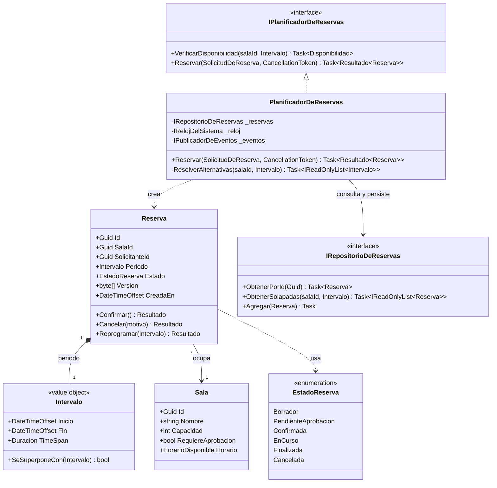
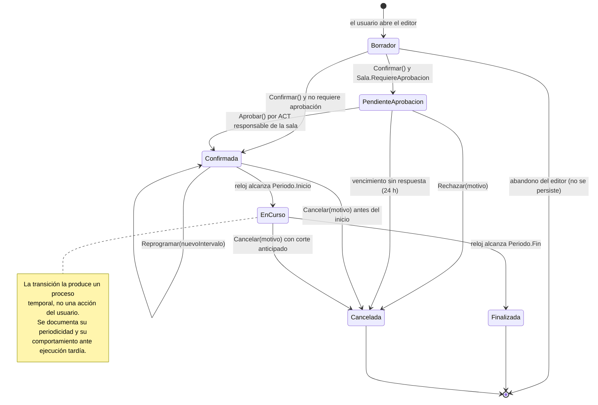

# Low Level Design — `DOC-LLD`

## 1. Resumen ejecutivo

El Low Level Design especifica el interior de un componente con detalle suficiente para que alguien lo implemente sin reconstruir las decisiones que ya se tomaron. Describe las clases y sus responsabilidades, los mensajes que se intercambian en las operaciones que no son triviales, los estados que atraviesan las entidades con ciclo de vida, y las interfaces por las que un componente se deja usar por otro. Su lector típico es un desarrollador que se incorpora al equipo, o el mismo desarrollador dentro de nueve meses, cuando ya no recuerda por qué el desempate de salas se resuelve por capacidad y no por proximidad.

Sirve a `ACT-04`, que lo produce y lo consume; a `ACT-03`, que lo aprueba verificando que no contradiga la arquitectura; y a `ACT-05`, que lo usa para diseñar pruebas sobre los caminos que el requisito no menciona pero el diseño expone. En `CTX-1` es el documento donde se define qué ve el usuario mientras algo carga y qué ocurre cuando el circuito se cae; en `CTX-2`, donde se fija cómo se comporta el sistema cuando dos personas reservan la misma sala en el mismo segundo.

---

## 2. Definición

### Qué es

Una especificación del diseño interno de uno o varios componentes, expresada con el vocabulario de la implementación: tipos, firmas, colaboraciones, estados, invariantes y algoritmos. Trabaja al nivel en el que las decisiones ya no se discuten en abstracto —«usaremos bloqueo optimista»— sino en concreto: qué columna almacena la versión, qué excepción se lanza al detectar el conflicto, qué le devuelve el servicio al llamador y qué ve el usuario.

El LLD no cubre todo el código. Cubre lo que costaría reconstruir: reglas con excepciones, algoritmos con criterios de desempate, protocolos de colaboración entre varios objetos, máquinas de estados, decisiones de concurrencia y todo aquello donde una implementación razonable y otra igualmente razonable producen comportamientos distintos.

### Qué problema resuelve

Tres, y conviene distinguirlos porque cada uno justifica un tipo de contenido diferente.

El primero es la **transferencia**: que alguien que no participó de la discusión pueda implementar o modificar el componente. El segundo es la **coordinación**: cuando tres personas implementan piezas que colaboran, el diagrama de secuencia acordado antes de escribir código evita la semana de integración en la que cada quien supuso que el otro validaba. El tercero, menos evidente, es la **detección temprana de contradicciones**: dibujar la máquina de estados de una reserva obliga a responder qué pasa si se cancela una reserva ya iniciada, y esa pregunta muchas veces no está en el SRS porque nadie la formuló.

### Qué NO es

**No es el HLD.** La confusión es la más común de la familia y tiene una prueba nítida: el HLD responde *qué componentes existen y cómo se relacionan*; el LLD responde *cómo funciona por dentro cada uno*. Si un documento introduce un componente nuevo, decide un mecanismo de comunicación entre servicios o cambia un límite de responsabilidad, es arquitectura, y su lugar es el [HLD](../30-Arquitectura/HLD.md) con su ADR correspondiente. Si describe qué clases hay dentro de un componente ya decidido, es LLD. El síntoma de un LLD que invadió arquitectura es que su aprobación se demora semanas: nadie tarda en aprobar un diseño de clases; todos tardan en aprobar una decisión estructural disfrazada.

**No es documentación de código.** El comentario XML sobre un método, el README de una carpeta y la documentación generada por herramientas describen la superficie del código tal como está. El LLD describe la intención y el porqué, y sobrevive a la refactorización que renombra todos los métodos. Un LLD que parafrasea firmas es trabajo desperdiciado: se desactualiza en el primer sprint y no aportaba nada que el propio código no dijera mejor.

**No es el modelo de dominio.** El [modelo de dominio](../20-Analisis/Modelo-de-Dominio.md) habla el lenguaje del negocio y es independiente de la tecnología; el LLD habla el lenguaje de la implementación. Una `Reserva` en el modelo de dominio es un concepto con reglas; en el LLD es una clase con constructor privado, un método de fábrica que valida el intervalo y una propiedad de concurrencia mapeada a `rowversion`.

**No es la especificación de API.** La [API Specification](API-Specification.md) fija el contrato con consumidores externos y compromete compatibilidad. El LLD documenta interfaces internas, que el equipo cambia cuando quiere. Ambas describen firmas; solo una obliga.

---

## 3. Aplicación por escenario

| Escenario | Qué es el LLD | Alcance recomendado | Riesgo característico |
|-----------|---------------|---------------------|----------------------|
| `ESC-1` Desarrollo nuevo | Compromiso previo a la implementación | Solo los componentes con lógica no trivial | Diseñar en papel más de lo que se implementará |
| `ESC-2` Migración | Doble: reconstruido del origen, decidido para el destino | Componentes con reglas embebidas que hay que preservar | Migrar la estructura de clases en lugar del comportamiento |
| `ESC-3` Evaluación con código | Hallazgo reconstruido desde el repositorio | Los componentes críticos y los que nadie entiende | Parafrasear el código y llamar a eso diseño |
| `ESC-4` Evaluación externa | No aplica en sentido estricto | Solo hipótesis de comportamiento observable | Presentar una inferencia con tono de hallazgo |

En `ESC-1` el LLD antecede al código y por eso es reversible barato. La tentación es diseñar de más: producir el LLD completo de los treinta componentes antes de escribir la primera línea, y descubrir en el componente siete que el modelo de datos estaba mal. La práctica que sostiene el valor sin pagar ese costo es diseñar en profundidad solo aquello cuya implementación divergiría según quién la haga, y dejar el resto para que el código lo exprese. Un repositorio con cuatro métodos CRUD no necesita LLD; el planificador que resuelve solapamientos, sí.

En `ESC-2` el LLD aparece dos veces con naturalezas opuestas. Hacia atrás se reconstruye el diseño del sistema origen, y lo que se busca no es su estructura de clases sino las **reglas embebidas**: la validación escondida en un evento de la interfaz, el cálculo dentro de un procedimiento almacenado, el caso particular que un `if` resuelve sin comentario y que corresponde a un cliente que lo pidió en 2014. Hacia adelante se diseña el destino, y la trampa es arrastrar la estructura vieja: una clase de dos mil líneas del sistema origen no debe convertirse en una clase de dos mil líneas del destino porque «así estaba». La tabla de equivalencias que el escenario exige se materializa aquí como una columna que dice qué clase origen se convierte en qué clases destino, y qué comportamiento se decidió deliberadamente no migrar.

En `ESC-3` cada afirmación debe rastrearse a un archivo y a un rango de líneas. El método productivo empieza por los puntos de entrada —controladores, handlers, páginas— y sigue las llamadas hasta la persistencia, dibujando el diagrama de secuencia de las tres o cuatro operaciones que concentran el valor del sistema. Lo que aparece en ese recorrido y no tiene explicación se anota como pregunta abierta, no se completa con lo que sería razonable. Un LLD reconstruido que afirma más de lo que la evidencia sostiene es peor que no tenerlo, porque el siguiente lector lo tratará como verificado.

En `ESC-4` no hay LLD. Lo único legítimo es registrar comportamiento observable —«al confirmar una reserva ya tomada, el producto devuelve un mensaje que enumera tres alternativas»— y marcarlo como observación, sin inferir qué clases lo producen. Cuando la evaluación necesita ese nivel, corresponde pedir acceso al código y pasar a `ESC-3`.

### Variación por contexto

En **`CTX-1`** el LLD describe ViewModels, componentes y estados. El objeto difícil no es la lógica sino el ciclo de vida frente a la interrupción: qué se carga en qué momento del ciclo del componente, qué estado vive en el circuito y qué se pierde al desconectarse, cómo se cancela una consulta cuando el usuario cambia de filtro antes de que termine, qué ve el usuario en cada uno de los cuatro estados de pantalla. Un LLD de `CTX-1` que documenta métodos y omite estados no especifica el trabajo real.

En **`CTX-2`** el LLD describe contratos, esquema y algoritmos. El objeto difícil es la corrección bajo concurrencia y falla parcial: qué transacción abarca qué operaciones, qué nivel de aislamiento se usa y por qué, qué pasa si el evento se publica y la transacción se revierte, cómo se comporta el algoritmo cuando el rango pedido cruza el cambio de horario de verano.

En **`CTX-3`** aparece la costura. La decisión documentable es dónde vive cada responsabilidad: la validación de solapamiento pertenece al servicio de dominio, pero el componente Blazor la anticipa para dar respuesta inmediata, con lo cual la regla queda expresada dos veces y hay que decir explícitamente cuál es la autoritativa y qué ocurre cuando difieren. Un LLD que no resuelve esa pregunta produce sistemas donde el frontend valida una cosa y el backend otra.

---

## 4. Diagramas UML aplicables al diseño detallado

UML 2.5 define catorce tipos de diagrama. El diseño detallado usa cuatro con regularidad, y el criterio de selección no es completitud sino qué pregunta cuesta responder sin dibujo.

| Diagrama | Pregunta que responde | Cuándo vale el esfuerzo |
|----------|----------------------|------------------------|
| Clases | ¿Qué tipos existen, qué saben y cómo se relacionan? | Siempre que haya más de tres colaboradores con relaciones no obvias |
| Secuencia | ¿Quién le habla a quién, en qué orden y qué devuelve? | Operaciones con tres o más participantes, o con compensación |
| Estados | ¿Qué situaciones atraviesa una entidad y qué transiciones son legales? | Toda entidad con campo `Estado` y reglas de transición |
| Actividad | ¿Cómo se decide, dónde se bifurca, qué corre en paralelo? | Procesos con ramificación real o pasos concurrentes |

Los diagramas van en Mermaid, no en imágenes binarias: se versionan, se comparan en un *diff* y se corrigen sin volver a abrir una herramienta de dibujo. La contrapartida es que Mermaid no cubre toda la notación UML —no expresa, por ejemplo, restricciones OCL ni estereotipos arbitrarios—, y esa limitación es aceptable en diseño detallado, donde lo que hay que comunicar cabe en la notación disponible.

Un diagrama sin texto que lo interprete comunica la mitad. La regla de esta guía es que cada diagrama va seguido de la prosa que explica lo que el dibujo no puede decir: por qué la relación es de composición y no de agregación, por qué esa transición no existe, qué pasa en el camino que el diagrama no dibuja.

### 4.1 Diagrama de clases — el alta de reserva



El diagrama fija tres decisiones que el código no explicaría por sí solo. `Intervalo` es un objeto de valor con composición sobre `Reserva`, lo cual significa que no tiene identidad propia ni existencia independiente: mapea a dos columnas de la tabla de reservas y no a una tabla propia, y la comparación es por valor. `Reserva` referencia a `Sala` pero no la contiene, porque una sala sobrevive a todas sus reservas y su ciclo de vida es independiente. Y `PlanificadorDeReservas` depende de `IRelojDelSistema` en lugar de llamar a `DateTimeOffset.UtcNow`, decisión que parece cosmética hasta que hay que probar el comportamiento de una reserva que empieza en cinco minutos.

Lo que el diagrama deliberadamente no incluye: las entidades de configuración, los DTO de transporte y los repositorios CRUD sin lógica. Incluirlos duplicaría el tamaño sin agregar una sola decisión.

### 4.2 Diagrama de secuencia — confirmación con conflicto

```mermaid
sequenceDiagram
    autonumber
    actor U as Usuario
    participant C as ReservaEditor.razor
    participant P as PlanificadorDeReservas
    participant R as IRepositorioDeReservas
    participant DB as SQL Server
    participant E as IPublicadorDeEventos

    U->>C: Confirmar reserva (Sala Roble, 10:00–11:00)
    C->>C: Estado = Enviando; botón deshabilitado
    C->>P: Reservar(solicitud, ct)
    P->>R: ObtenerSolapadas(salaId, 10:00–11:00)
    R->>DB: SELECT ... WHERE SalaId = @s AND Fin > @i AND Inicio < @f
    DB-->>R: 0 filas
    R-->>P: lista vacía
    P->>R: Agregar(reserva)
    P->>DB: SaveChangesAsync (INSERT dentro de transacción)
    alt Índice único de solapamiento violado
        DB-->>P: 2601 unique index violation
        P->>P: Traducir a ConflictoDeReservaException
        P->>R: ObtenerSolapadas para calcular alternativas
        R-->>P: reserva ajena 10:30–11:30
        P-->>C: Resultado.Conflicto(alternativas: 09:00, 11:30, 14:00)
        C->>C: Estado = Conflicto; conserva asistentes cargados
        C-->>U: "La sala se ocupó. Alternativas cercanas: …"
    else Inserción exitosa
        DB-->>P: 1 fila afectada
        P->>E: Publicar(ReservaConfirmada)
        P-->>C: Resultado.Ok(reserva)
        C->>C: Estado = Confirmada
        C-->>U: Confirmación con identificador de reserva
    end
```

La consulta previa de solapamiento no garantiza nada: entre el `SELECT` y el `INSERT` otra transacción puede insertar la reserva en conflicto. La consulta existe para dar un mensaje bueno en el caso frecuente, y la corrección la garantiza el índice de la base, no el código. Ese es el punto que el diagrama documenta y que sin diagrama se implementa mal la primera vez: **el chequeo previo es una optimización de experiencia; la restricción de base de datos es la regla**. Un desarrollador que lea solo el requisito «no se permiten reservas superpuestas» escribirá el `SELECT` y creerá que terminó.

La publicación del evento ocurre después de que la transacción confirma, y esa ubicación tampoco es libre: publicar dentro de la transacción produce eventos de reservas que nunca existieron si el commit falla. La alternativa robusta —patrón de bandeja de salida, con la escritura del evento en la misma transacción y un despachador aparte— pertenece al [HLD](../30-Arquitectura/HLD.md) porque afecta la topología, y el LLD solo consume la decisión.

### 4.3 Diagrama de estados — ciclo de vida de una reserva



Tres decisiones quedan fijadas por el dibujo y merecen quedar por escrito además. Reprogramar no crea una reserva nueva: es una transición reflexiva sobre `Confirmada` que reevalúa el solapamiento con el intervalo nuevo, lo que preserva el identificador y todas sus referencias externas —la entrada en el calendario corporativo, la notificación ya enviada— a costa de necesitar historial para saber cuál era el horario anterior. Una reserva finalizada no se cancela: si alguien quiere «deshacer» una reunión que ya ocurrió, eso es una corrección administrativa con su propio caso de uso y no una transición de este diagrama. Y las transiciones temporales las produce un proceso de fondo, lo que obliga a especificar qué pasa cuando ese proceso no corrió durante dos horas: el diseño elegido calcula el estado por comparación con el reloj en lugar de depender de haber ejecutado a tiempo, y el proceso solo materializa lo que ya es cierto.

La utilidad práctica de este diagrama es que se convierte en tabla de decisión para QA sin traducción: cada flecha que existe es un caso positivo, y cada par de estados sin flecha es un caso negativo que hay que verificar que el sistema rechace.

### 4.4 Diagrama de actividad — cuándo usarlo

El diagrama de actividad se justifica cuando el proceso tiene bifurcaciones reales o paralelismo, no cuando es una secuencia lineal que la prosa describe mejor. En el sistema de reservas hay un caso que lo amerita: la confirmación con aprobación, donde se notifica al responsable, se espera respuesta con vencimiento, y en paralelo se mantiene un bloqueo tentativo de la sala que hay que liberar tanto si se rechaza como si vence. Ese proceso tiene dos flujos concurrentes y tres finales distintos, y describirlo en prosa produce un párrafo que hay que leer tres veces.

Cuando el proceso es lineal —validar, guardar, notificar— el diagrama de actividad es ruido: repite en cajas lo que una frase dice mejor. La prueba antes de dibujar es simple: si al describirlo en voz alta no aparece ningún «salvo que» ni ningún «mientras tanto», no hace falta el diagrama.

---

## 5. Interfaces y contratos internos

Una interfaz interna es la superficie por la que un componente se deja usar por otro dentro del mismo despliegue. En .NET se materializa como `interface` o como clase abstracta, y lo que el LLD documenta no es su firma —el código la expresa mejor— sino lo que la firma no puede expresar.

**El contrato de comportamiento.** Qué precondiciones asume el llamador, qué garantiza el implementador, qué invariantes se preservan. Que `ObtenerSolapadas` devuelva lista vacía y no `null` cuando no hay coincidencias es contrato; que el orden de la lista sea por hora de inicio ascendente también, si alguien depende de él.

**El comportamiento ante error.** Qué excepciones son parte del contrato y cuáles indican defecto. `ConflictoDeReservaException` es esperada y el llamador debe manejarla; una `DbUpdateException` sin traducir indica que alguien olvidó mapear un caso. Esta distinción es la que evita el `catch` genérico que se traga defectos reales.

**Las garantías de concurrencia y ciclo de vida.** Si la implementación es segura para uso concurrente, con qué tiempo de vida se registra en el contenedor de inyección de dependencias, y si mantiene estado entre llamadas. Un `DbContext` de EF Core registrado como *singleton* por descuido produce fallas intermitentes bajo carga que cuestan días de diagnóstico; el LLD que declara «tiempo de vida *scoped*, no seguro para uso concurrente» las evita.

**Las garantías temporales.** Si la operación es cancelable —y en .NET moderno toda operación asíncrona de duración no acotada debería aceptar `CancellationToken`—, si tiene tiempo límite propio y qué ocurre al vencerse.

RFC 2119 aporta un vocabulario útil también aquí: distinguir lo que una implementación **DEBE** cumplir de lo que **DEBERÍA** cumplir separa el contrato de la recomendación, y evita la discusión de si una implementación alternativa es válida.

La frontera con la [API Specification](API-Specification.md) es de compromiso, no de forma. Ambas describen operaciones con entradas, salidas y errores; solo una obliga a mantener compatibilidad. Cuando una interfaz interna adquiere consumidores fuera del equipo —otro equipo la referencia, se publica como paquete NuGet, se expone a través de un endpoint—, deja de ser modificable a voluntad y su documentación asciende a `DOC-API` con política de versionado. Esa promoción conviene decidirla explícitamente en lugar de descubrirla el día que un cambio rompe a alguien.

---

## 6. Ejemplos concretos

### 6.1 LLD de un componente Blazor — `ReservaEditor.razor`

Componente interactivo con render mode *interactive server*, usado en el flujo `FLU-03` para dar de alta y reprogramar reservas. Implementa `RF-014` y hace visible `RN-007`.

**Parámetros de entrada.**

| Parámetro | Tipo | Obligatorio | Semántica |
|-----------|------|-------------|-----------|
| `ReservaId` | `Guid?` | No | `null` abre en alta; con valor, abre en edición y carga la reserva |
| `SalaPreseleccionada` | `Guid?` | No | Preselecciona la sala cuando se llega desde el detalle de una sala |
| `OnGuardado` | `EventCallback<Reserva>` | No | Notifica al contenedor tras confirmar; el contenedor decide si navega o refresca |
| `SoloLectura` | `bool` | No | Por defecto `false`; en `true` muestra los datos sin acciones |

**Estado interno.** Vive en el circuito y se pierde ante desconexión no recuperada: el borrador en edición, la lista de disponibilidad consultada, el token de cancelación de la consulta en vuelo, la marca de cambios sin guardar y la clave de idempotencia generada al abrir el editor. Esa clave se genera una vez por sesión de edición y no por clic, decisión sin la cual el doble clic del usuario crea dos reservas.

**Estados de pantalla.** Los cuatro obligatorios más los específicos del render mode:

| Estado | Cuándo | Qué ve el usuario | Qué acciones quedan habilitadas |
|--------|--------|-------------------|--------------------------------|
| Cargando | Entre `OnInitializedAsync` y la primera respuesta | Esqueleto del formulario | Ninguna |
| Vacío | Sala sin horarios configurados | Mensaje explicativo con enlace a la configuración de la sala | Cambiar de sala |
| Con datos | Caso normal | Formulario editable con disponibilidad visible | Todas |
| Error | Fallo de la consulta de disponibilidad | Mensaje con causa y acción de reintento | Reintentar, cancelar |
| Enviando | Entre el clic en Confirmar y la respuesta | Botón deshabilitado con indicador | Ninguna, salvo cancelar |
| Conflicto | El servidor devolvió `409` | Mensaje con hasta tres alternativas cercanas | Elegir alternativa, cambiar horario |
| Reconectando | Circuito SignalR caído | Sobreimpreso del framework más el aviso propio de cambios sin guardar | Ninguna |

**Reconexión del circuito.** Es el estado que más se omite y el que más soporte genera. El diseño fija tres reglas. Mientras el circuito se recupera, el usuario ve el indicador del framework y, si había cambios sin guardar, un aviso de que no se han enviado. Si el circuito se recupera, el componente **no** asume que su estado sigue siendo válido: reconsulta la disponibilidad, porque durante la desconexión otro pudo tomar el horario. Si el circuito se cayó justo después de enviar la confirmación y antes de recibir respuesta, al reconectar el componente consulta el estado real por la clave de idempotencia en lugar de reenviar; ahí se conecta con el `Idempotency-Key` que la [API Specification](API-Specification.md) define. Si el circuito no se recupera, el estado se pierde: decisión explícita, tomada porque persistir borradores parciales exigiría almacenamiento del lado servidor cuyo costo no se justifica para un formulario de cuatro campos.

**Ciclo de vida y cancelación.** La carga inicial ocurre en `OnInitializedAsync`. Los cambios de parámetro se atienden en `OnParametersSetAsync`, con guarda contra recargas redundantes cuando el parámetro no cambió de valor. Toda consulta de disponibilidad se lanza con un `CancellationTokenSource` propio que se cancela al disparar la siguiente, para que una respuesta lenta de un filtro anterior no sobrescriba la vista actual. `IAsyncDisposable` cancela lo pendiente al destruirse el componente.

**Accesibilidad.** El mensaje de conflicto se anuncia en una región `aria-live="assertive"`, porque el usuario que no ve el cambio visual necesita enterarse de que su reserva no se creó. Los criterios verificables completos viven en el documento de UX; aquí queda la consecuencia de implementación.

### 6.2 LLD de un ViewModel MAUI con MVVM — `ReservaEditorViewModel`

El equivalente móvil del componente anterior. Se documenta con la misma estructura, y las diferencias son informativas: en MVVM el estado sobrevive a la navegación, la conectividad es intermitente por diseño y no una excepción, y la separación entre vista y lógica es un contrato que la herramienta no fuerza.

**Propiedades observables.** `Salas` como colección solo lectura para el selector; `SalaSeleccionada`, cuyo cambio dispara la consulta de disponibilidad; `Inicio` y `Fin`; `Asistentes`; `Estado`, del mismo enumerado de estados de pantalla que el componente Blazor, deliberadamente compartido para que la especificación de comportamiento sea una sola; y `MensajeError` con `Alternativas`. Las propiedades notifican cambio mediante los generadores del *toolkit* MVVM de la comunidad; el LLD documenta qué propiedad dispara qué efecto secundario, que es lo que el atributo no dice.

**Comandos.**

| Comando | Puede ejecutarse cuando | Efecto | Cancelable |
|---------|------------------------|--------|-----------|
| `CargarAsync` | Siempre, al aparecer la página | Carga salas y, si hay `ReservaId`, la reserva | Sí |
| `ConsultarDisponibilidadAsync` | Hay sala e intervalo válido | Consulta y actualiza `Alternativas` | Sí, y se cancela al relanzarse |
| `ConfirmarAsync` | Formulario válido y `Estado != Enviando` | Envía con `Idempotency-Key`, navega al detalle si tuvo éxito | No: iniciada, se completa |
| `ElegirAlternativaAsync` | `Estado == Conflicto` | Ajusta el intervalo y reintenta | Sí |

El `CanExecute` de `ConfirmarAsync` es la única defensa contra el doble toque en pantallas táctiles con latencia, y por eso el LLD exige que se reevalúe explícitamente al entrar y salir del estado `Enviando`. Confiar en que el usuario no toque dos veces produce reservas duplicadas de forma reproducible.

**Navegación.** El ViewModel no conoce páginas: depende de una abstracción de navegación que recibe por constructor y a la que pide rutas por nombre lógico, con los parámetros como diccionario. Sin esa indirección el ViewModel no es verificable sin interfaz gráfica, que es el motivo por el cual se eligió MVVM.

**Ciclo de vida y conectividad.** El estado sobrevive a la navegación de ida y vuelta, a diferencia del componente Blazor. Al volver a primer plano tras más de dos minutos, la disponibilidad se reconsulta antes de permitir confirmar. Sin conectividad, `ConfirmarAsync` no encola el envío: informa y deja el formulario intacto. Aceptar reservas en modo desconectado exigiría resolución de conflictos diferida, y esa es una decisión de arquitectura con un [ADR](../30-Arquitectura/HLD.md) propio, no una decisión de diseño de un ViewModel.

---

## 7. Preguntas guía

- ¿Qué decisión de este documento no se deduce leyendo el código, y por qué es esa la que hay que escribir?
- Si dos desarrolladores implementaran este LLD por separado, ¿en qué punto divergirían sus resultados observables?
- ¿La regla de negocio que este diseño implementa queda garantizada por el código o por una restricción de la base de datos? ¿Cuál de los dos es la autoridad?
- ¿Están documentados los cuatro estados de pantalla, o solo el camino feliz?
- ¿Qué ocurre si la operación se interrumpe entre el paso tres y el cuatro del diagrama de secuencia?
- ¿Cuál es el tiempo de vida y la seguridad ante concurrencia de cada dependencia que este componente recibe?
- ¿Este documento introduce algún componente o mecanismo de comunicación nuevo? Si es así, ¿por qué no es un ADR?
- En `ESC-3`: ¿qué archivo y qué líneas sostienen cada afirmación de este documento?

---

## 8. Criterios de calidad y antipatrones

### Criterios

Un LLD de calidad es **implementable sin consultas**: un desarrollador ajeno al diseño lo lee y produce código cuyo comportamiento observable coincide con el esperado. Es **selectivo**: cubre lo que costaría reconstruir y omite lo evidente, con lo cual su extensión es proporcional a la dificultad del componente y no a su tamaño. Es **verificable**: cada regla se traduce a caso de prueba sin interpretación, y el diagrama de estados sirve directamente como matriz de transiciones válidas e inválidas. Es **honesto sobre su alcance**: dice qué componentes cubre y cuáles no, en lugar de dejar al lector suponiendo que lo que falta es que nadie lo pensó. Y en `ESC-3`, es **trazable**: cada afirmación apunta a evidencia con ruta y rango de líneas.

El criterio de mantenimiento merece renglón aparte porque decide si el documento sirve al año. Un LLD sin momento de revisión definido se desactualiza en silencio, y su peligro es superior al de no tenerlo: quien lo lea creerá que describe el sistema. La práctica que sostiene la vigencia es acotar el alcance a lo estable —decisiones, invariantes, protocolos— y dejar fuera lo volátil —firmas exactas, nombres de campos privados—, de modo que una refactorización normal no lo invalide.

### Antipatrones

**El LLD que parafrasea el código.** Enumera cada clase con cada método y cada parámetro, en prosa. Es el más frecuente, cuesta días de escritura, se desactualiza en el primer sprint y nadie lo lee dos veces. Su señal es que el documento se puede regenerar con una herramienta.

**El diagrama sin interpretación.** Cinco diagramas seguidos, sin una línea que explique qué decisión ilustran ni qué alternativa se descartó. El lector ve la estructura y no entiende el porqué, que es lo único que el diagrama no puede mostrar.

**El LLD que decide arquitectura.** Introduce una biblioteca nueva, cambia el modelo de concurrencia o agrega una dependencia entre servicios, y lo presenta como detalle de implementación. La consecuencia práctica es que la decisión no pasa por la revisión que le corresponde, y aparece en producción sin que el arquitecto se entere.

**El camino feliz exclusivo.** El diagrama de secuencia dibuja la confirmación exitosa y nada más. El error, el vencimiento, la cancelación a mitad y la falla parcial —que es donde se va la mayor parte del esfuerzo real de implementación— quedan sin especificar, y cada desarrollador los resuelve como le parece.

**La máquina de estados incompleta.** El diagrama muestra las transiciones que existen y no dice nada de las que están prohibidas. Sin esa segunda mitad, nadie verifica que el sistema rechace cancelar una reserva finalizada, y el defecto aparece en producción el día que alguien lo intenta.

**El LLD de todo.** Documentar los treinta componentes con el mismo nivel de detalle, incluidos los cinco repositorios CRUD sin lógica. Diluye la atención del lector justo donde hacía falta y garantiza que el documento no se mantenga.

**La entidad de dominio anémica documentada como si tuviera comportamiento.** El diagrama de clases muestra métodos en `Reserva` que en el código son propiedades públicas escritas desde un servicio. La documentación describe el diseño que se quiso, no el que se hizo, y el lector confía en invariantes que nadie hace cumplir.

---

## 9. Anexo — Plantilla comentada

```markdown
---
doc_id: DOC-LLD-<componente>        # ¿Qué componente cubre? Un LLD por componente o por grupo cohesivo
doc_type: tema
title: LLD — <nombre del componente>
status: borrador | vigente | obsoleto
origin: human | ia-assisted | ia-generated
confidence: alta | media | baja      # En ESC-3, refleja cuánta evidencia sostiene el documento
owner: ACT-04 <persona>              # ¿Quién lo firma y lo mantiene?
last_review: AAAA-MM-DD
audience: [humano, agente]
traces: [DOC-HLD, DOC-DOMINIO, DOC-DATOS, RF-…, RN-…]
---

# LLD — <componente>

## 1. Alcance y encuadre
<!-- ¿Qué componentes cubre este documento y cuáles quedan deliberadamente fuera?
     ¿Escenario y contexto? ¿Qué decisiones de arquitectura da por sentadas y dónde están? -->

## 2. Responsabilidad del componente
<!-- En dos o tres frases: ¿qué hace y qué no hace?
     ¿Qué requisitos (RF-) y reglas (RN-) implementa? -->

## 3. Estructura estática
<!-- Diagrama de clases en Mermaid.
     Después del diagrama: ¿qué relación no es obvia y por qué es esa y no otra?
     ¿Qué se dejó fuera del diagrama a propósito? -->

## 4. Colaboraciones
<!-- Diagrama de secuencia de las operaciones no triviales.
     ¿Qué pasa cuando el paso N falla? ¿Hay compensación? ¿Quién la ejecuta?
     ¿Qué garantiza la corrección: el código o una restricción de base? -->

## 5. Ciclo de vida y estados
<!-- stateDiagram-v2 de las entidades con estado.
     ¿Qué transiciones NO existen, y qué debe hacer el sistema si alguien las intenta?
     ¿Qué transiciones las dispara el tiempo y qué pasa si el proceso no corrió? -->

## 6. Interfaces internas
<!-- Por cada interfaz: precondiciones, garantías, errores esperados vs. defectos,
     tiempo de vida en el contenedor, seguridad ante concurrencia, cancelación.
     ¿Alguna tiene consumidores fuera del equipo? Entonces pertenece a DOC-API. -->

## 7. Algoritmos y reglas no evidentes
<!-- Solo los que tienen criterios de desempate, casos límite o costo relevante.
     ¿Cómo se comporta con entrada vacía, con volumen alto, en el cambio de horario? -->

## 8. Concurrencia, transacciones y errores
<!-- ¿Qué abarca cada transacción? ¿Qué nivel de aislamiento y por qué?
     ¿Optimista o pesimista? ¿Qué se reintenta y con qué límite?
     ¿Qué excepciones cruzan la frontera del componente? -->

## 9. Estados de interfaz            <!-- Solo CTX-1 y CTX-3 -->
<!-- Vacío, cargando, con datos, con error, y los propios de la tecnología.
     En Blazor Server: ¿qué pasa al caer y al recuperarse el circuito?
     ¿Qué estado se pierde y se decidió que se pierda? -->

## 10. Verificación
<!-- ¿Qué casos de prueba (TC-) cubren este diseño?
     ¿Qué caso límite del diseño no está cubierto todavía? -->

## 11. Pendientes y supuestos
<!-- ¿Qué quedó sin decidir? ¿Qué se asumió sin confirmar y quién debe confirmarlo?
     En ESC-3: ¿qué no se pudo verificar contra el código? -->
```

Los apartados 8 y 11 son los que distinguen un LLD útil de uno decorativo. El primero concentra lo que la implementación hará mal si nadie lo escribe; el segundo es la única parte del documento que envejece bien, porque una pregunta abierta sigue siendo verdadera aunque el código cambie.
