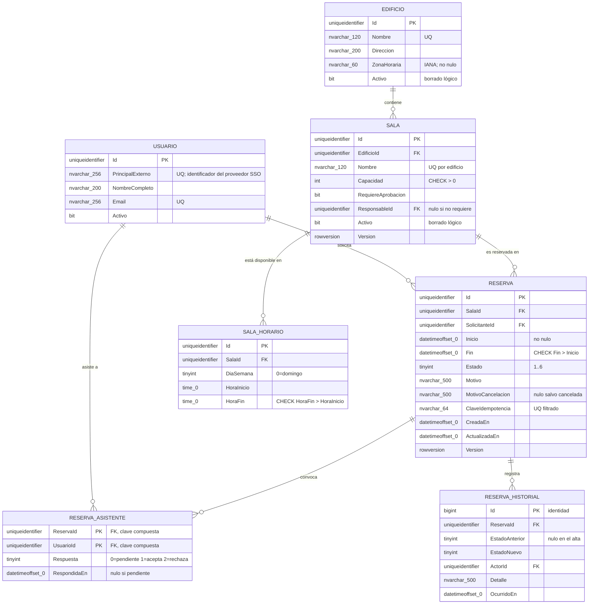

# Modelo de datos — `DOC-DATOS`

## 1. Resumen ejecutivo

El modelo de datos especifica cómo se estructura, se relaciona y se restringe la información persistida: qué entidades existen como tablas, qué atributos con qué tipos y qué nulabilidad, qué claves las identifican, qué índices sostienen las consultas y qué restricciones hacen cumplir las reglas que el código no puede garantizar por sí solo. Es el artefacto de mayor vida útil de toda la guía. El framework se reemplaza, la interfaz se rediseña, el equipo rota; el esquema sobrevive, y con él los datos, que son lo único del sistema que no se puede volver a generar.

Su lector inmediato es `ACT-04`, que escribe las migraciones y las consultas. Su lector menos obvio es `ACT-07`, que necesita saber dónde vive el dato personal para decir cómo se protege, y `ACT-06`, que necesita saber qué migración se ejecuta en qué orden para desplegar sin cortar el servicio. En `ESC-3` es el punto de entrada de toda la reconstrucción, porque el esquema es la evidencia más difícil de falsear que un sistema existente ofrece.

---

## 2. Definición

### Qué es

La especificación de la estructura persistente en tres niveles de abstracción sucesivos, y la distinción entre esos niveles no es académica: cada uno tiene un dueño, un lector y un momento distintos.

El **modelo conceptual** enumera las entidades del negocio y sus relaciones, sin tipos ni claves. Responde qué cosas existen y cómo se vinculan, en el vocabulario del dominio. Se discute con el negocio y cabe en una hoja. Es el nivel del modelo entidad-relación tal como lo propuso Chen: entidades, relaciones, cardinalidades.

El **modelo lógico** agrega atributos, tipos abstractos, claves primarias y foráneas, y aplica normalización. Es independiente del motor: sirve igual para SQL Server que para PostgreSQL. Es el nivel donde se decide si el intervalo de la reserva son dos columnas o una, si el estado es un entero o una cadena, y si las salas y los edificios son una tabla o dos.

El **modelo físico** compromete el motor concreto: tipos exactos, índices con sus columnas incluidas, particionamiento, colaciones, restricciones de comprobación, esquemas de la base. Es donde `datetimeoffset(0)` se distingue de `datetime2(7)` y donde el índice filtrado que impide solapamientos se vuelve DDL ejecutable.

Muchos equipos saltan directamente al físico, y en sistemas pequeños se lo pueden permitir. El costo aparece cuando hay que explicar el sistema a alguien nuevo, cuando hay que migrar de motor, o cuando el negocio pregunta algo que el esquema físico no permite contestar sin traducción.

### Qué problema resuelve

Que las reglas del negocio sobrevivan a la aplicación. Un sistema tiene, con el tiempo, más de un escritor: la aplicación web, un proceso batch nocturno, una integración, un script de corrección que alguien ejecutó a mano un viernes. La regla que solo vive en el código de la aplicación se viola por cualquiera de las otras vías. La que vive en el esquema —una clave foránea, una restricción única, un `CHECK`— no se viola nunca. El modelo de datos es donde se decide qué reglas merecen esa protección.

Resuelve también un problema de rendimiento que no admite corrección posterior barata. Un índice se agrega en producción; un tipo de dato mal elegido sobre veinte millones de filas se corrige con una ventana de mantenimiento y un plan de contingencia.

### Qué NO es

**No es el modelo de dominio.** La confusión es la más costosa de la familia porque produce esquemas que copian la estructura de objetos y objetos que copian la estructura de tablas. El [modelo de dominio](../20-Analisis/Modelo-de-Dominio.md) describe conceptos y reglas del negocio, sin decidir cómo se almacenan; el modelo de datos decide el almacenamiento. Difieren de forma habitual y legítima: `Intervalo` es un concepto del dominio con comportamiento propio y no tiene tabla, porque se persiste como dos columnas de `Reserva`; la tabla `ReservaAsistente` existe en el modelo de datos y no en el de dominio, porque el dominio ve una colección de asistentes dentro de la reserva y la base necesita una tabla para la relación de muchos a muchos. Cuando ambos coinciden atributo por atributo, casi siempre es que uno de los dos no se pensó.

**No es el diagrama de EF Core.** La visualización que una herramienta genera desde las clases de entidad muestra el mapeo actual; el modelo de datos documenta las decisiones y sus razones. Que `Reserva.Estado` se persista como `tinyint` en lugar de cadena es una decisión con consecuencias —ahorro de espacio, ilegibilidad en consultas ad hoc, riesgo si alguien reordena el enumerado— y esa cadena de razonamiento no la genera ninguna herramienta.

**No es el diccionario de datos exhaustivo.** Un catálogo con las trescientas columnas y su tipo se genera desde el catálogo del sistema y se mantiene solo. El modelo de datos documenta lo que ese catálogo no dice: por qué la columna admite nulos, qué significa cada valor del enumerado, qué se hace con las filas antiguas.

---

## 3. Aplicación por escenario

| Escenario | Naturaleza del documento | Punto de partida | Riesgo característico |
|-----------|-------------------------|------------------|----------------------|
| `ESC-1` Desarrollo nuevo | Prescriptiva: decide el esquema | Modelo de dominio | Normalizar por reflejo, sin conocer las consultas |
| `ESC-2` Migración | Doble: esquema origen relevado, esquema destino decidido | Base de producción actual | Descubrir tarde las reglas embebidas en el esquema legado |
| `ESC-3` Evaluación con código | Descriptiva: reconstruye lo que hay | Catálogo del sistema y migraciones | Confundir lo que el esquema permite con lo que el negocio quiere |
| `ESC-4` Evaluación externa | Inferencial, confianza baja | Formularios, filtros, URLs | Presentar la hipótesis con tono de hallazgo |

En `ESC-1` el modelo de datos se deriva del dominio, pero no mecánicamente: la derivación necesita conocer las consultas que el sistema hará. Normalizar hasta la tercera forma normal por reflejo, sin saber que la pantalla principal muestra reservas con nombre de sala y de solicitante y se consulta ochenta veces por minuto, produce un esquema correcto y lento. El orden productivo es modelar normalizado, listar las consultas críticas y sus volúmenes esperados, y desnormalizar solo donde la medición lo justifique, dejando registrada la razón junto a la redundancia introducida.

En `ESC-2` el esquema legado es la fuente más rica y más traicionera. Rica porque contiene reglas que ningún documento registró: una restricción `CHECK` que impide un estado, un disparador que mantiene un total, un procedimiento almacenado con quince años de casos particulares. Traicionera porque contiene también los restos de tres rediseños: columnas que nadie escribe hace ocho años, tablas duplicadas con nombres parecidos, valores centinela como `9999-12-31` que significan «sin fecha de fin». El trabajo consiste en separar lo que es regla de lo que es cicatriz, y esa separación se hace con datos: consultar la distribución real de valores revela qué columnas están vivas y qué código es papel mojado. El migrador de datos es un artefacto propio y conviene planificarlo desde el principio, con su estrategia de conciliación entre el origen y el destino.

En `ESC-3` la reconstrucción se ordena de lo más verificable a lo más interpretativo. Se extrae el esquema del catálogo del sistema; se cruza con el historial de migraciones si existe, que revela cuándo y por qué cambió cada cosa; se examina la distribución de datos para distinguir columnas activas de vestigios; y recién ahí se infiere el significado de negocio, que es la parte discutible. Una columna llamada `Tipo` con valores del 1 al 4 no tiene significado deducible del esquema, y adivinarlo es lo que convierte un buen relevamiento en uno peligroso.

En `ESC-4` lo alcanzable es una hipótesis de entidades y relaciones, con confianza baja y marcada como tal. Los campos de un formulario sugieren atributos; los filtros disponibles sugieren índices; un mensaje de error de clave duplicada revela una restricción única; el patrón de las URLs revela identificadores y jerarquías. Nada de eso permite afirmar tipos, nulabilidad ni claves, y el informe debe decirlo.

### Variación por contexto

En **`CTX-1`** el modelo de datos tiene peso bajo: el cliente web no persiste. Aparece en dos lugares acotados que igual conviene documentar: el estado de sesión —qué se guarda, dónde y por cuánto tiempo— y, en MAUI, la caché local, que es una base de datos completa con su propio esquema, su propia versión y su propio problema de migración cuando el usuario actualiza la aplicación después de seis meses.

En **`CTX-2`** el peso es máximo. El esquema es donde el dominio se vuelve físico y donde las decisiones sobre normalización, índices y transaccionalidad tienen consecuencias que ninguna capa superior puede corregir.

En **`CTX-3`** lo que se agrega es la traza vertical: cada tabla debe poder conectarse con el concepto del dominio que representa, con el endpoint que la expone y con la pantalla que la muestra. El riesgo típico es la divergencia de nombres —`Reserva` en el dominio, `reservas` en la API, `Bookings` en la base—, que hace que tres documentos correctos por separado no se puedan unir. La convención que lo evita es simple y cuesta disciplina: el nombre canónico se fija en el glosario y las desviaciones se registran como alias explícitos.

---

## 4. Ejemplo concreto — el esquema de reservas

Datos sintéticos e ilustrativos, sobre SQL Server con EF Core.

### 4.1 Modelo conceptual

Un **edificio** tiene **salas**. Una sala tiene capacidad y un horario de disponibilidad, y puede requerir aprobación de un responsable. Un **usuario** solicita **reservas** de una sala para un intervalo de tiempo, e invita a otros usuarios como **asistentes**. Una reserva atraviesa estados y no puede superponerse con otra confirmada de la misma sala. Toda modificación queda registrada.

Cinco entidades y una regla. El modelo conceptual se discute con el negocio en esta forma, sin una sola mención a tipos o claves.

### 4.2 Modelo lógico y físico



### 4.3 Notación: `erDiagram` y dbml

El diagrama anterior usa `erDiagram` de Mermaid, que alcanza para comunicar entidades, atributos y cardinalidades dentro de un documento de estudio o de una revisión. Sus límites aparecen pronto en un esquema real: no expresa índices, no distingue restricciones únicas de claves primarias con precisión, y no se puede convertir en DDL.

Cuando el modelo tiene que ser fuente de verdad y no ilustración, dbml es la alternativa razonable: es un lenguaje textual específico para esquemas, versionable como cualquier archivo, que sí expresa índices, valores por defecto, notas por columna y acciones de integridad referencial, y del que existen herramientas de conversión a DDL y de importación desde una base existente. Ese último punto lo vuelve especialmente útil en `ESC-3`, donde permite extraer el esquema real y versionarlo como documento desde el primer día de la evaluación.

```
Table reserva {
  id uniqueidentifier [pk]
  sala_id uniqueidentifier [not null, ref: > sala.id]
  solicitante_id uniqueidentifier [not null, ref: > usuario.id]
  inicio datetimeoffset(0) [not null]
  fin datetimeoffset(0) [not null, note: 'CHECK fin > inicio']
  estado tinyint [not null, note: '1 borrador … 6 cancelada']
  clave_idempotencia varchar(64) [null]
  version rowversion

  indexes {
    (sala_id, inicio, fin) [name: 'IX_Reserva_Sala_Periodo']
    clave_idempotencia [unique, name: 'UQ_Reserva_Idempotencia']
  }
}
```

La elección entre ambas notaciones se resuelve por destino: Mermaid cuando el diagrama acompaña a un texto que alguien lee, dbml cuando el modelo debe poder compararse con la base real de forma automatizada. Mantener las dos a mano reproduce el problema que el documento intenta resolver.

### 4.4 Normalización, y hasta dónde llevarla

Las formas normales de Codd son una herramienta de diagnóstico antes que un objetivo. Cada una elimina una clase de anomalía concreta, y conocer cuál permite decidir con criterio en lugar de por reflejo.

La primera forma normal exige valores atómicos: una columna `Asistentes` con correos separados por comas la viola, y su consecuencia práctica es que no se puede indexar ni consultar «las reservas donde participa este usuario» sin recorrer texto. La segunda elimina la dependencia parcial de una clave compuesta: si `RESERVA_ASISTENTE` guardara el nombre de la sala, ese dato dependería solo de la reserva y no del par, y actualizar el nombre exigiría tocar todas las filas de asistentes. La tercera elimina la dependencia transitiva: guardar `CapacidadDeSala` en `RESERVA` haría que un cambio de capacidad dejara inconsistentes las reservas viejas —salvo que se quiera exactamente eso, que es el caso del historial y por eso el historial se exceptúa de forma consciente.

Más allá de la tercera forma normal, el rendimiento manda. La regla operativa de esta guía: **normalizar por defecto, desnormalizar por medición**. Una redundancia introducida sin un número que la respalde es deuda; una introducida con la consulta, el volumen y el tiempo medido antes y después es una decisión, y se documenta junto a la columna redundante indicando qué proceso la mantiene sincronizada y qué pasa si ese proceso falla. La pregunta que hay que poder contestar por cada dato duplicado es simple y suele no tener respuesta: ¿quién lo actualiza, y qué ocurre si se desincroniza?

### 4.5 Decisiones y su justificación

**Claves.** Identificadores `uniqueidentifier` generados por la aplicación, no `int` autoincremental. La razón no es estética: la clave se necesita antes de insertar, porque la clave de idempotencia y el evento publicado la referencian, y porque el cliente MAUI puede construir la reserva sin conexión al servidor. El costo es conocido —claves más anchas y fragmentación de índice si se generan aleatorias— y se mitiga generando valores secuenciales. En `RESERVA_HISTORIAL` la clave es `bigint` de identidad porque nunca se referencia desde afuera y el volumen crece sin techo. `RESERVA_ASISTENTE` usa clave compuesta natural, sin identificador propio, porque no tiene existencia fuera del par que la define.

**Normalización.** El esquema está en tercera forma normal siguiendo las formas normales de Codd, con una excepción deliberada: `RESERVA_HISTORIAL.Detalle` guarda el nombre del actor además de su identificador. La redundancia es intencional y su razón es la naturaleza del historial, que debe reflejar lo que era cierto al momento del hecho y no lo que es cierto ahora. Si un usuario cambia de nombre, el historial debe seguir diciendo quién canceló la reserva con el nombre de entonces. Esa es la distinción entre datos operativos, que se normalizan, y datos históricos, que se congelan.

**Tipos y nulabilidad.** `datetimeoffset` y no `datetime2`: una reserva ocurre en un instante absoluto y el sistema opera en edificios de zonas horarias distintas, de modo que perder el desplazamiento haría ambigua toda reserva durante los cambios de horario estacional. La precisión `(0)` porque los segundos alcanzan y reducen el índice. `SALA_HORARIO` usa `time` sin zona, porque «de nueve a dieciocho» es hora local del edificio y se interpreta contra `EDIFICIO.ZonaHoraria`; mezclar ambos criterios en una columna es una fuente recurrente de defectos de una hora que aparecen dos veces al año.

La nulabilidad se decide por semántica, no por comodidad. `MotivoCancelacion` es nulo mientras la reserva no esté cancelada, y una restricción de comprobación exige que no sea nulo cuando el estado es cancelado: el nulo significa «no aplica», y esa es la única razón legítima para admitirlo. `RESERVA_ASISTENTE.RespondidaEn` nulo significa «todavía no respondió», distinto de una fecha centinela, que obligaría a todo consultor a conocer la convención.

**Estado como `tinyint`.** Ahorra espacio en una tabla que crece y permite índices compactos, a costa de que las consultas ad hoc devuelvan números. La compensación es documentar el mapeo aquí y en el LLD, y mantener una vista de solo lectura que lo traduzca para el análisis. La alternativa —una tabla de catálogo `ESTADO_RESERVA` con clave foránea— se descartó porque el conjunto de estados es cerrado y cambia con el código, no con los datos: una fila nueva en esa tabla no haría que el sistema supiera qué hacer con ese estado.

### 4.6 Índices, y el que impide superponerse

Los índices se justifican por consulta, no por intuición. Cada uno cuesta escritura y espacio, y un índice que ninguna consulta usa es puro costo.

| Índice | Columnas | Consulta que lo justifica |
|--------|----------|--------------------------|
| `PK_Reserva` | `Id` | Acceso por identificador |
| `IX_Reserva_Sala_Periodo` | `SalaId, Inicio, Fin` incluyendo `Estado, SolicitanteId` | Disponibilidad de una sala en un rango; agenda diaria |
| `IX_Reserva_Solicitante` | `SolicitanteId, Inicio DESC` | «Mis reservas», ordenadas por proximidad |
| `UQ_Reserva_Idempotencia` | `ClaveIdempotencia`, filtrado a no nulos | Resolución del reintento con `Idempotency-Key` |
| `IX_Historial_Reserva` | `ReservaId, OcurridoEn DESC` | Línea de tiempo de una reserva |

La regla `RN-007` —una sala no admite reservas superpuestas— no se puede expresar con un índice único común, porque la unicidad de columnas no captura la intersección de rangos. SQL Server no ofrece restricción de exclusión sobre rangos, a diferencia de PostgreSQL con `EXCLUDE USING gist`. El diseño elegido la garantiza con una **vista indexada** que materializa la ocupación en franjas de quince minutos por sala, con índice único sobre `(SalaId, Franja)` y filtro por estado en `Confirmada` o `EnCurso`. Una reserva que pise una franja ocupada falla en el `INSERT` con violación de unicidad, y el `PlanificadorDeReservas` traduce ese error a `ConflictoDeReservaException`.

La decisión no es gratuita y su costo se documenta junto con ella: la granularidad de quince minutos obliga a que toda reserva se alinee a esa grilla, restricción que el negocio aceptó explícitamente; las reservas canceladas no ocupan franja, lo que exige que el filtro de la vista se mantenga sincronizado con el enumerado de estados; y las vistas indexadas imponen requisitos de opciones de sesión en toda conexión que escriba la tabla, incluidos los scripts manuales. La alternativa evaluada —bloqueo pesimista de la sala durante la transacción— se descartó por su costo de contención en las salas populares, y el razonamiento completo vive en `ADR-012`, desarrollado en el documento de [decisiones de arquitectura](../30-Arquitectura/ADR.md).

Lo que ningún diseño puede hacer es garantizar la regla solo desde el código de la aplicación. Ese es el punto que hay que dejar escrito en letras grandes: la consulta previa reduce los conflictos visibles; la restricción de base los hace imposibles.

### 4.7 Borrado lógico

`EDIFICIO`, `SALA` y `USUARIO` usan borrado lógico mediante `Activo`, porque tienen referencias históricas que deben seguir resolviendo: una reserva de 2023 en una sala que ya no existe debe seguir mostrando el nombre de la sala. `RESERVA` no se borra en absoluto, ni lógica ni físicamente; se cancela, que es un estado del dominio y no una marca técnica.

El borrado lógico tiene tres consecuencias que hay que documentar o se descubren mal. Toda consulta debe filtrar por `Activo`, y el olvido produce datos fantasma en un listado; en EF Core esto se resuelve con un filtro de consulta global declarado en el modelo, y hay que documentar cómo se lo omite deliberadamente cuando hace falta. Las restricciones de unicidad deben contemplar las filas inactivas: si una sala inactiva conserva su nombre, no se puede crear otra con el mismo nombre salvo que el índice único se filtre por `Activo = 1`, decisión que se toma según si el negocio quiere reutilizar nombres. Y el borrado lógico no satisface una solicitud de supresión de datos personales: una fila marcada como inactiva sigue conteniendo el dato. El procedimiento de anonimización —reemplazar nombre y correo por valores irreversibles conservando el identificador para no romper referencias— es un requisito distinto, con dueño en `ACT-07`.

---

## 5. Versionado del esquema y migraciones

El esquema evoluciona, y la pregunta que el documento debe contestar no es cómo se aplica un cambio sino cómo se aplica **sin cortar el servicio y con vuelta atrás posible**.

Las migraciones de EF Core se generan desde el modelo de código y se revisan a mano antes de aceptarse. Esa revisión no es formalidad: el generador produce operaciones correctas y a veces destructivas —renombrar una propiedad puede materializarse como eliminar una columna y crear otra, con pérdida de datos— y detectarlo en revisión cuesta un minuto, en producción cuesta una restauración. Cada migración se versiona junto con el código que la necesita, y el historial de migraciones queda en la propia base, lo que convierte al esquema en autodescriptivo respecto de su versión.

El versionado del esquema sigue Semantic Versioning 2.0.0 solo por analogía, y la analogía tiene un límite que conviene explicitar: en un esquema el criterio de compatibilidad se define respecto de las versiones de aplicación que conviven con él durante un despliegue, no respecto de consumidores externos. Un cambio es compatible hacia atrás si la versión anterior de la aplicación sigue funcionando contra el esquema nuevo. Agregar una columna nula lo es; agregarla no nula sin valor por defecto, no; renombrarla, tampoco.

La técnica que hace posible el despliegue sin corte es la **expansión y contracción** en tres fases, separadas por despliegues distintos. Primero se expande: se agrega la estructura nueva, siempre compatible, y se escribe en ambos lugares. Después se migra: se copia el dato histórico en lotes, se despliega la aplicación que lee de la estructura nueva, y se verifica. Por último se contrae: cuando ninguna versión activa usa la estructura vieja, se la elimina. Renombrar una columna, que parece la operación más trivial del mundo, requiere las tres fases si el servicio no puede cortarse. Documentar esa secuencia por adelantado es la diferencia entre un despliegue de veinte minutos y uno con reversión a medianoche.

Las migraciones de datos masivas —recalcular una columna sobre veinte millones de filas— no van en la migración de esquema. Van en un proceso propio, ejecutable en lotes, reanudable e idempotente, con su registro de avance. Una migración de EF Core que tarda cuarenta minutos bloquea el despliegue y no se puede interrumpir sin dejar la base a mitad de camino.

---

## 6. Datos históricos y auditoría

Tres necesidades distintas se confunden con frecuencia bajo la misma palabra, y cada una exige un mecanismo diferente.

La **auditoría** responde quién hizo qué y cuándo, con fines de responsabilidad. Se implementa con `RESERVA_HISTORIAL`, escrita explícitamente por el dominio en la misma transacción que el cambio, y es inmutable: no se actualiza ni se borra. Su contenido está congelado en el momento del hecho, incluidos los nombres.

El **historial de estados** responde cómo era una entidad en un momento dado. Cuando la pregunta es frecuente y se hace sobre muchas entidades, el mecanismo adecuado son las tablas temporales del sistema, que el motor mantiene sin que la aplicación intervenga y que se consultan con la cláusula temporal correspondiente. Su ventaja es que no se puede olvidar de escribir; su costo es crecimiento y una interacción no trivial con las migraciones de esquema, que hay que documentar.

La **retención** responde cuánto tiempo se conserva cada cosa. Es una decisión de negocio y de cumplimiento, no técnica, y su ausencia produce bases que crecen sin límite hasta que alguien borra a mano lo que le parece. El modelo de datos debe registrar, por tabla, cuánto se conserva, qué se hace después —archivar, agregar, anonimizar, eliminar— y quién lo aprobó. En el sistema de reservas: las reservas se conservan siete años por política contable de facturación interna; el historial, lo mismo; los datos personales de usuarios dados de baja se anonimizan a los noventa días de la baja.

---

## 7. Preguntas guía

- ¿Qué regla de negocio está garantizada por el esquema y cuál depende de que el código se acuerde?
- Si alguien escribiera en esta base con un script SQL, ¿qué invariante podría romper sin que el motor lo impida?
- ¿Cada índice tiene una consulta concreta que lo justifica, y cada consulta crítica tiene un índice que la sostiene?
- ¿Qué significa exactamente un nulo en esta columna? ¿«No aplica», «no se sabe» o «todavía no»? ¿Son distinguibles?
- ¿Esta migración se puede aplicar con la versión anterior de la aplicación corriendo? ¿Y se puede revertir?
- ¿Cuánto tiempo se conservan estos datos y quién firmó esa decisión?
- ¿Dónde vive el dato personal, y qué pasa si alguien pide que se lo eliminen?
- En `ESC-3`: ¿esta columna se escribe hoy, o es un vestigio? ¿Qué dice la distribución de valores reales?

---

## 8. Criterios de calidad y antipatrones

### Criterios

Un modelo de datos de calidad **justifica sus decisiones**, no solo las enumera: por cada índice, la consulta; por cada nulo, su semántica; por cada desnormalización, la medición que la motivó. Es **verificable contra la base real**, y en un sistema maduro esa verificación está automatizada, comparando el esquema documentado con el desplegado y fallando la integración cuando divergen. **Distingue los tres niveles**, de modo que el lector de negocio pueda leer el conceptual sin tropezar con tipos. **Documenta las reglas que el esquema hace cumplir** y, sobre todo, las que no: la lista de invariantes que dependen exclusivamente del código de la aplicación es la información más valiosa del documento, porque es la lista de lo que se puede romper.

### Antipatrones

**El esquema que copia el modelo de objetos.** Una tabla por clase, incluidos los objetos de valor, con identificador autoincremental en cada una. Produce fragmentación innecesaria y consultas con seis uniones para armar una entidad. Su síntoma es la tabla `Intervalo` con dos columnas y una clave.

**El registro genérico de atributos.** Tablas `Entidad`, `Atributo` y `Valor` para «no tener que migrar nunca». Se paga con la imposibilidad de aplicar tipos, restricciones e índices, y con consultas que ningún optimizador puede resolver. Aparece siempre por la misma razón —evitar el costo de las migraciones— y siempre cuesta más de lo que evita.

**El nulo polisémico.** Una columna donde el nulo significa a veces «no aplica», a veces «se desconoce» y a veces «cero». Nadie puede escribir una consulta correcta sobre esa columna, y la ambigüedad se descubre cuando un informe da un total que no cierra.

**La regla que solo vive en el código.** El sistema evita las reservas superpuestas mediante una consulta previa y ninguna restricción de base. Funciona en las pruebas y falla bajo concurrencia, con datos corruptos que nadie detecta hasta que dos equipos se encuentran en la misma sala.

**El borrado físico sin evaluar referencias.** Eliminar un usuario y descubrir que quinientas reservas históricas quedaron sin solicitante, o que la eliminación en cascada se llevó también las reservas.

**La fecha centinela.** `9999-12-31` para «sin vencimiento», `1900-01-01` para «desconocido». Todo consultor debe conocer la convención, y todo cálculo de duración produce números absurdos cuando alguien la ignora.

**La documentación que se generó una vez.** Un diccionario de datos exportado el día del lanzamiento y jamás actualizado. Describe un esquema que ya no existe, y su peligro está en que parece autoritativo.

---

## 9. Anexo — Plantilla comentada

```markdown
---
doc_id: DOC-DATOS
doc_type: tema
title: Modelo de datos — <sistema o contexto acotado>
status: borrador | vigente | obsoleto
origin: human | ia-assisted | ia-generated
confidence: alta | media | baja      # En ESC-4 rara vez pasa de baja
owner: ACT-04 <persona>
last_review: AAAA-MM-DD
audience: [humano, agente]
traces: [DOC-DOMINIO, DOC-LLD, DOC-API, RN-…]
---

# Modelo de datos — <sistema>

## 1. Alcance
<!-- ¿Qué bases y qué esquemas cubre? ¿Qué queda fuera y dónde está documentado?
     ¿Qué motor, qué versión, qué nivel de compatibilidad? -->

## 2. Modelo conceptual
<!-- Entidades y relaciones en vocabulario de negocio, sin tipos ni claves.
     ¿Un lector de negocio reconocería aquí su realidad? -->

## 3. Modelo lógico
<!-- erDiagram con atributos, claves y cardinalidades.
     ¿Hasta qué forma normal se llegó? ¿Dónde se desnormalizó y qué medición lo justifica? -->

## 4. Modelo físico
<!-- Por tabla: tipos exactos, nulabilidad con su semántica, valores por defecto,
     colación, restricciones CHECK, esquema.
     ¿Por qué este tipo y no el vecino? ¿Qué precisión y por qué? -->

## 5. Claves e identidad
<!-- ¿Naturales o subrogadas? ¿Quién genera el valor y en qué momento?
     ¿Alguna clave se expone en URLs o eventos? ¿Eso condiciona su formato? -->

## 6. Índices
<!-- Por índice: columnas, si es único, si es filtrado, columnas incluidas,
     y la consulta concreta que lo justifica.
     ¿Qué consulta crítica no tiene índice, y fue decisión o descuido? -->

## 7. Restricciones e invariantes
<!-- ¿Qué reglas de negocio hace cumplir el esquema y con qué mecanismo?
     ¿Qué invariantes dependen SOLO del código de la aplicación? Lista explícita:
     es lo que un script externo puede romper. -->

## 8. Ciclo de vida del dato
<!-- Borrado lógico o físico, y por qué. Efecto sobre unicidad y consultas.
     Retención por tabla, destino final del dato, quién aprobó el plazo.
     Datos personales: dónde están y cómo se anonimizan. -->

## 9. Historia y auditoría
<!-- ¿Qué se audita, con qué mecanismo, y quién puede leerlo?
     ¿El historial congela valores o referencia entidades vivas? ¿Por qué? -->

## 10. Versionado y migraciones
<!-- ¿Cómo se genera, revisa y aplica una migración? ¿Quién la aprueba?
     ¿Qué cambios exigen expansión y contracción?
     ¿Cómo se revierte? ¿Cómo se migran datos masivos sin bloquear el despliegue? -->

## 11. Supuestos y pendientes
<!-- ¿Qué no se pudo verificar? ¿Qué columna es sospechosa de vestigio?
     ¿Qué decisión se pospuso y qué la destrabaría? -->
```

El apartado 7 es el que conviene escribir primero aunque quede séptimo: la lista de invariantes que el esquema no protege define dónde el sistema es frágil, y esa lista casi nunca existe en la documentación de un sistema que ya lleva años funcionando.
