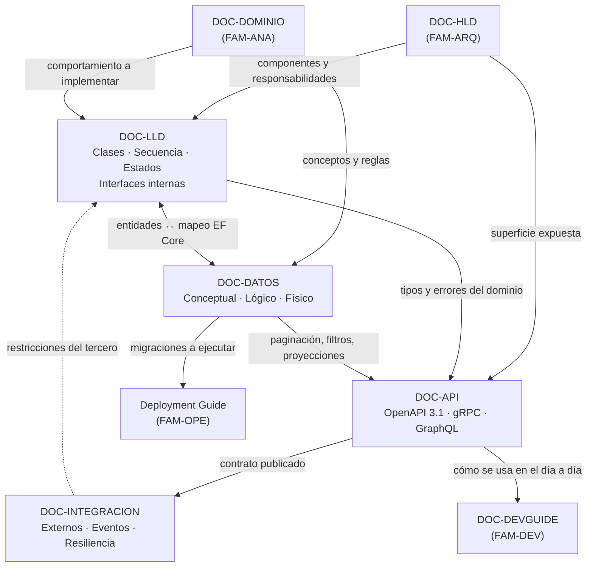

# Documentación de diseño — `FAM-DIS`

## Pregunta que responde la familia

**¿Cómo se implementa cada componente?**

La arquitectura fija los límites: qué componentes existen, qué responsabilidad tiene cada uno, qué atributos de calidad se privilegian y qué se sacrifica a cambio. Lo que no fija es el interior de las cajas. Entre el diagrama de componentes y el primer archivo `.cs` hay un tramo donde alguien decide qué clases existen, qué mensajes se intercambian, qué estados atraviesa una entidad, qué tablas la persisten, qué firma expone el servicio hacia afuera y qué contrato se pactó con el sistema de terceros que hay que consumir. Ese tramo es el diseño.

Su producto característico es la **especificación implementable**: un documento que un desarrollador que no participó de las reuniones puede leer y convertir en código sin adivinar. La prueba es operativa y dura. Si dos desarrolladores implementan el mismo documento por separado y producen comportamientos observables distintos, el documento no era diseño: era una descripción.

La familia tiene una tensión propia que conviene nombrar desde el principio. Buena parte de lo que aquí se escribe puede quedar obsoleto en un sprint, porque el código lo reemplaza como fuente de verdad. La regla práctica que gobierna toda la familia es una sola: **documentar lo que el código no puede expresar por sí mismo**. Una clase con nombres claros no necesita que se parafraseen sus métodos. Un algoritmo de asignación de salas con cinco reglas de prioridad y dos criterios de desempate sí necesita que alguien explique por qué el orden es ese. La superposición de reservas necesita que se documente el índice que la impide, porque el índice está en una migración que nadie lee.

---

## Artefactos

| ID | Artefacto | Pregunta específica | Dueño | Archivo |
|----|-----------|--------------------|-------|---------|
| `DOC-LLD` | Low Level Design | ¿Cómo está construido por dentro cada componente? | `ACT-04` | [LLD.md](LLD.md) |
| `DOC-DATOS` | Modelo de datos | ¿Cómo se persiste y se relaciona la información? | `ACT-04` | [Modelo-de-Datos.md](Modelo-de-Datos.md) |
| `DOC-API` | API Specification | ¿Qué contrato expone el sistema a otros programas? | `ACT-04` | [API-Specification.md](API-Specification.md) |
| `DOC-INTEGRACION` | Integration Guide | ¿Cómo se conecta este sistema con los ajenos? | `ACT-04` | [Integration-Guide.md](Integration-Guide.md) |

Dos agrupaciones deliberadas merecen justificación, porque en otras taxonomías aparecen como documentos independientes.

Los **diagramas UML** de nivel detallado —clases, secuencia, estados, actividad— viven como secciones internas del LLD y no como un artefacto propio. Un catálogo de diagramas separado del texto que los interpreta envejece peor que el texto: el diagrama sobrevive, la razón por la que se dibujó se pierde. Manteniéndolos dentro del LLD, cada diagrama aparece junto a la decisión que ilustra y comparte su dueño y su fecha de revisión.

Las **interfaces y contratos internos** —las abstracciones que un componente expone a otro dentro del mismo proceso o de la misma solución— también son sección del LLD. La distinción con `DOC-API` no es de formato sino de audiencia y de compromiso: una interfaz interna la puede cambiar el equipo en una tarde con una refactorización; un contrato de API publicado obliga a un ciclo de deprecación. Cuando una interfaz interna empieza a tener consumidores fuera del equipo, deja de pertenecer al LLD y asciende a `DOC-API`, y esa promoción es en sí misma una decisión que corresponde registrar.

---

## Relaciones

La flecha punteada es la que más problemas evita. Los sistemas externos imponen restricciones que el diseño interno tiene que absorber: un calendario corporativo que solo acepta actualizaciones cada quince minutos obliga a que el modelo de estados de la reserva contemple un estado de sincronización pendiente. Descubrir esa restricción cuando el LLD ya está implementado cuesta una reescritura del componente; descubrirla leyendo la documentación del tercero antes de diseñar cuesta una tarde.

La frontera con la familia de arquitectura se cruza en cada reunión y conviene tenerla nítida. El [HLD](../30-Arquitectura/HLD.md) decide que existe un `ServicioDeReservas` responsable de la disponibilidad y que se comunica con el módulo de notificaciones por eventos; el LLD decide que ese servicio tiene una clase `PlanificadorDeReservas` con un método que resuelve solapamientos consultando un índice de rangos. Si el LLD introduce un componente nuevo que nadie previó, o cambia el mecanismo de comunicación entre dos componentes, dejó de ser diseño y necesita un ADR. Si el HLD especifica firmas de métodos, invadió el LLD.

La frontera con la familia de análisis es simétrica. El [modelo de dominio](../20-Analisis/Modelo-de-Dominio.md) dice que una `Reserva` pertenece a una `Sala` y tiene un intervalo temporal, con la regla de que dos reservas confirmadas de la misma sala no se superponen. El [modelo de datos](Modelo-de-Datos.md) dice en qué tabla vive, con qué tipo se representa el intervalo, qué índice hace cumplir la regla y qué pasa con las reservas canceladas. Son documentos distintos porque responden preguntas distintas, y la confusión entre ambos es el error más frecuente de la familia.

---

## Orden de lectura

En `ESC-1` la familia se recorre de arriba hacia abajo, y el orden importa porque cada documento consume decisiones del anterior. Se lee el HLD, se escribe el modelo de datos —que es donde el dominio se vuelve físico y donde aparecen las primeras contradicciones del análisis—, se escribe el LLD de los componentes con lógica no trivial, y recién después se fija la API, que es la superficie más cara de cambiar una vez publicada. La Integration Guide se escribe en paralelo, apenas se conocen los sistemas externos, porque sus restricciones condicionan todo lo demás.

En `ESC-3` el orden se invierte y el punto de entrada es el esquema de la base de datos. Es la evidencia más estable de un sistema existente: el código se refactoriza, los nombres cambian, los comentarios mienten, pero las tablas y sus datos sobreviven a varias generaciones de desarrolladores. Desde el esquema se reconstruye el modelo de datos real, desde ahí las entidades del LLD, y la API se recupera de los controladores o de la especificación generada. Lo que la evidencia no sostiene se marca como no verificado.

En `ESC-4` la familia se reduce casi a nada, y decirlo con claridad ahorra trabajo inútil. Sin código no hay LLD posible; el modelo de datos es una hipótesis construida sobre formularios y filtros; solo la API tiene alguna chance de documentarse, y únicamente si el producto la publica.

1. [Modelo-de-Datos.md](Modelo-de-Datos.md) — dónde el dominio se vuelve estructura persistente y restricción verificable.
2. [LLD.md](LLD.md) — el interior de los componentes, con sus diagramas UML e interfaces internas.
3. [API-Specification.md](API-Specification.md) — el contrato hacia afuera, con su formato y su política de versionado.
4. [Integration-Guide.md](Integration-Guide.md) — el camino inverso: cómo se consume lo ajeno y cómo un tercero nos consume.

Quien llega a la guía buscando resolver un problema concreto y no estudiar la familia completa puede entrar directo por el documento que corresponda; cada uno se sostiene solo y enlaza lo que presupone.

---

## Variación por contexto

El peso relativo de los cuatro artefactos cambia de forma pronunciada según el contexto, más que en ninguna otra familia.

| Artefacto | `CTX-1` Web | `CTX-2` Backend | `CTX-3` Fullstack |
|-----------|-------------|-----------------|-------------------|
| `DOC-LLD` | Peso máximo: ViewModels, componentes, estados de pantalla, ciclo de vida | Peso alto: algoritmos, concurrencia, transaccionalidad | Alto en ambas mitades, con la costura documentada |
| `DOC-DATOS` | Peso bajo: el cliente no persiste, salvo caché local en MAUI | Peso máximo: el esquema es el activo más duradero | Peso máximo, con traza hasta la pantalla |
| `DOC-API` | Peso medio: se consume, no se define | Peso máximo: es el documento de mayor uso diario | Alto, y es la costura entre las dos mitades |
| `DOC-INTEGRACION` | Bajo, salvo SSO y notificaciones push | Peso máximo | Alto |

En `CTX-1` el LLD describe ViewModels, componentes y estados; en `CTX-2` describe contratos, esquema y algoritmos. No es una diferencia de estilo sino de objeto: lo difícil de un componente Blazor es su máquina de estados frente a la interrupción —el circuito que se cae, el usuario que abandona a la mitad, la validación que llega tarde—, y lo difícil de un servicio es la corrección bajo concurrencia. Documentar un componente como si fuera un servicio produce un LLD que describe métodos y omite lo único que costará trabajo implementar.

---

## Enlaces al marco

- [Escenarios](../00-Marco-de-Referencia/Escenarios.md) — `ESC-1` a `ESC-4`.
- [Contextos](../00-Marco-de-Referencia/Contextos.md) — `CTX-1`, `CTX-2`, `CTX-3`.
- [Actores](../00-Marco-de-Referencia/Actores.md) — `ACT-04` produce esta familia, `ACT-03` la aprueba, `ACT-05` y `ACT-07` son consultados.
- [Convenciones](../00-Marco-de-Referencia/Convenciones.md) — frontmatter, identificadores y estilo.

## Enlaces a familias vecinas

- [HLD](../30-Arquitectura/HLD.md) — entrada de la familia: los componentes cuyo interior aquí se especifica.
- [Modelo de dominio](../20-Analisis/Modelo-de-Dominio.md) — los conceptos que el modelo de datos vuelve físicos.
- [Developer Guide](../60-Desarrollo/Developer-Guide.md) — consumidor principal: convierte estos documentos en práctica cotidiana.
