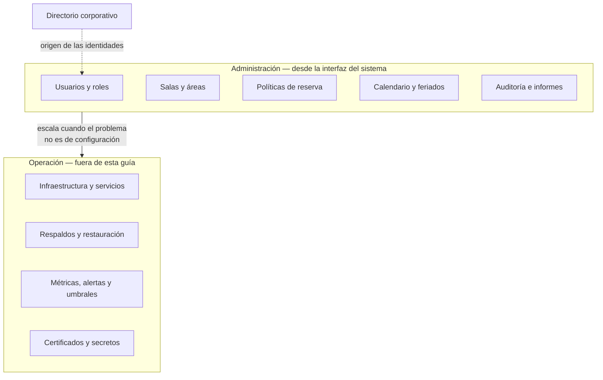

# Administrator Guide — `DOC-ADMIN`

## 1. Resumen ejecutivo

La guía de administración se dirige a quien configura el sistema para que sus usuarios puedan usarlo: da de alta personas, asigna roles, define el catálogo de recursos, ajusta las reglas de negocio parametrizables y responde a las consultas de primer nivel. Es documentación de usuario en sentido normativo —**ISO/IEC/IEEE 26511** y **26514** le aplican— aunque su usuario tenga privilegios elevados.

Su lector no es técnico y ése es el dato que gobierna todo lo demás. En una implantación real, el administrador del sistema de reservas de salas suele ser alguien de Recursos Humanos, de Servicios Generales o de la oficina de administración: entiende el negocio perfectamente y no tiene por qué saber qué es un contenedor. Una guía escrita con el vocabulario del equipo de plataforma es inutilizable para esa persona, y el costo se traslada al soporte.

El documento comparte frontera con dos vecinos y se define mejor por contraste con ellos. Hacia abajo, el [Operations Guide](Operations-Guide.md) trata la infraestructura que sostiene al sistema; hacia el costado, el User Manual trata lo que hace un usuario sin privilegios. La administración ocupa la franja intermedia: todo lo que se hace desde la interfaz del propio sistema y que afecta a otros usuarios.

---

## 2. Definición

### Qué es

El manual de las funciones administrativas del sistema, organizado por tarea y no por pantalla. Cubre la gestión de identidades y accesos, la configuración funcional, el catálogo de entidades maestras, las políticas parametrizables, la auditoría, los informes administrativos y el diagnóstico de primer nivel.

Su unidad de contenido es el **procedimiento con propósito de negocio**: no «cómo usar la pantalla de usuarios» sino «cómo dar de baja a alguien que dejó la organización», que es una tarea real con consecuencias que exceden a una pantalla —hay reservas futuras a su nombre, delegaciones activas y un registro de auditoría que debe preservarse.

### Qué problema resuelve

Traslada la autonomía al cliente. Sin este documento, cada cambio de configuración —un rol nuevo, una sala que se remodela, un cambio en el horario laboral— llega al equipo técnico como un ticket, y el equipo técnico se convierte en el cuello de botella de decisiones que no le corresponden. La guía de administración es lo que convierte a un sistema entregado en un sistema apropiado por quien lo usa.

Resuelve además un problema de gobierno: al documentar qué puede hacer cada rol administrativo, hace explícita la distribución de autoridad dentro del sistema, que de otro modo queda implícita en la configuración de permisos y solo se descubre cuando alguien hace algo que no debía poder hacer.

### Qué NO es

**No es el Operations Guide.** La distinción es de capa y de audiencia, y es la que más se pierde en equipos pequeños donde ambos roles recaen sobre la misma persona. La operación mantiene la plataforma: procesos, recursos, respaldos, certificados, umbrales. La administración configura el sistema para sus usuarios: altas, roles, catálogo, políticas. El corte práctico es de superficie de ejecución: **si el procedimiento se ejecuta desde la interfaz del propio sistema, es administración; si se ejecuta contra la infraestructura que lo sostiene, es operación**.

El caso límite se resuelve con la misma regla. Purgar reservas antiguas es administración si hay una pantalla que lo hace con una política de retención configurable; es operación si requiere ejecutar un script contra la base de datos. La misma tarea de negocio cae de un lado o del otro según cómo esté construido el sistema, y esa es exactamente la información que el lector necesita.

**No es el User Manual.** Comparten vocabulario, convenciones y tono, y conviene que compartan también el sistema de plantillas. Se separan por el alcance del efecto: el usuario actúa sobre sus propios datos, el administrador sobre los de todos. Cuando el sistema tiene roles intermedios —un jefe de área que administra las salas de su piso— la guía debe decir con qué rol se ejecuta cada procedimiento, porque el lector puede no ser administrador global.

**No es la referencia de configuración de la instalación.** Las variables de entorno, las cadenas de conexión y los secretos pertenecen a la [Installation Guide](Installation-Guide.md). Un parámetro se documenta en un lugar o en el otro según dónde se cambie: si requiere reiniciar el servicio, es instalación; si se cambia en caliente desde una pantalla, es administración.

---

## 3. Aplicación por escenario

| Escenario | ¿Aplica? | Naturaleza | Qué se produce |
|-----------|----------|-----------|----------------|
| `ESC-1` Desarrollo nuevo | Sí, al aproximarse la entrega | Prescriptiva | Se escribe con la funcionalidad administrativa terminada, antes de la primera implantación |
| `ESC-2` Migración | Sí, y comparativa | Doble | Guía del destino, más la tabla de equivalencias administrativas entre origen y destino |
| `ESC-3` Evaluación con código | Sí, reconstructiva | Descriptiva | Se reconstruye desde el modelo de permisos, las pantallas administrativas y las tablas de parámetros |
| `ESC-4` Evaluación externa | **Parcialmente** | Observacional | Aplica si el producto publica su documentación o si la evaluación se hace con una cuenta con privilegios |

### `ESC-1` — Desarrollo de software nuevo

El momento correcto es tarde, y anticiparlo produce descarte: una guía escrita sobre pantallas administrativas que todavía van a cambiar se reescribe entera. Lo que sí conviene decidir temprano es el **modelo de roles**, porque es una decisión de diseño con consecuencias en toda la aplicación y porque escribir la guía obliga a descubrir sus incoherencias.

Ese efecto merece atención: redactar el procedimiento de baja de un usuario suele revelar que nadie decidió qué pasa con sus reservas futuras. La documentación administrativa, escrita antes de la primera implantación y no después, funciona como revisión de diseño de bajo costo. Las preguntas que no tienen respuesta en la pantalla son huecos funcionales, y es preferible encontrarlos escribiendo que en la reunión de capacitación con el cliente.

En `CTX-1` el documento es voluminoso porque casi todo se administra desde la interfaz. En `CTX-2` es mínimo o inexistente: un servicio sin interfaz humana se administra por API o por configuración, y lo que sería la guía de administración se convierte en una sección de la especificación de API con las operaciones privilegiadas. En `CTX-3` es voluminoso y tiene una obligación adicional: cuando una acción administrativa afecta al comportamiento del backend —cambiar la política de solapamiento de reservas modifica una validación del servidor— la guía debe decir en cuánto tiempo el cambio surte efecto y si hay caché de por medio. Un administrador que cambia una política, prueba de inmediato y ve el comportamiento anterior concluye que el sistema no funciona.

### `ESC-2` — Migración a otro lenguaje o plataforma

El administrador es la persona que más sufre una migración, porque conoce el sistema viejo con detalle y el nuevo le resulta ajeno. La pieza de mayor valor no es la guía completa sino la **tabla de equivalencias administrativas**: dónde estaba antes cada función y dónde está ahora, qué cambió de nombre, qué desapareció y con qué se reemplaza.

Esa tabla también obliga a registrar las **funciones que no se migraron**, que es donde las migraciones acumulan sorpresas. Una opción de configuración que el sistema viejo tenía y el nuevo no, descubierta por el administrador tres semanas después del corte, es un incidente de adopción que se podía haber evitado declarándola de antemano como fuera de alcance.

Conviene además documentar la **migración de datos administrativos**: si los roles, los permisos y el catálogo se trasladaron automáticamente o hay que recargarlos, y qué debe verificar el administrador después del corte para confirmar que su configuración llegó completa.

### `ESC-3` — Evaluación de software existente con acceso al código

La reconstrucción tiene cuatro fuentes y una trampa.

El **modelo de autorización** —políticas de ASP.NET Core, atributos `[Authorize(Roles = ...)]`, claims, tablas de roles y permisos— dice qué roles existen y qué puede hacer cada uno. Es la evidencia más fuerte, porque es la que el sistema efectivamente aplica.

Las **pantallas administrativas** —componentes bajo rutas protegidas, áreas de tipo `/admin`— dicen qué se puede configurar desde la interfaz, que es la definición operativa de lo que pertenece a este documento.

Las **tablas de parámetros** —entidades de configuración, tablas maestras, registros de política— dicen qué es parametrizable sin tocar código. Un sistema con muchas de ellas delega mucho al administrador; uno con pocas convierte cada cambio funcional en un ticket de desarrollo, y eso es un hallazgo sobre el modelo de operación del producto, no solo sobre su código.

El **registro de auditoría**, si existe, dice qué acciones se consideraron sensibles. Su ausencia en un sistema con datos de personas es un hallazgo de cumplimiento.

La trampa es el **privilegio implícito**: la cuenta administrativa que además tiene acceso directo a la base de datos, o el rol que puede modificar su propio conjunto de permisos. Se detecta comparando lo que la interfaz ofrece con lo que la autorización permite, y la diferencia entre ambos suele ser mayor de lo que el equipo cree.

### `ESC-4` — Evaluación de un producto solo desde afuera

Aplica de forma parcial y con confianza desigual, y conviene separar los dos casos.

Cuando el producto **publica su guía de administración** —habitual en software empresarial, donde la documentación es argumento de venta— el material es evidencia de primera mano y de confianza alta. De él se extrae el modelo de roles, la profundidad de la parametrización, las capacidades de integración con directorios corporativos y el grado de autonomía que el proveedor concede al cliente. Un producto donde toda configuración requiere intervención del proveedor tiene un modelo comercial distinto de uno donde el administrador puede todo, y esa diferencia es material para una decisión de compra.

Cuando la evaluación se hace con una **cuenta de prueba con privilegios administrativos**, lo observado es directo y se documenta como observación: qué se puede configurar, con cuántos pasos, qué valida el sistema. Es de las áreas donde `ESC-4` alcanza mayor confianza, porque el producto se está usando tal como se ofrece.

Lo que **no** aplica: inferir el modelo interno de permisos a partir de lo que la interfaz muestra. Que una opción no aparezca puede deberse a la licencia contratada, al rol de la cuenta o a que la funcionalidad no existe, y desde afuera esas tres causas son indistinguibles. Se registra lo observado con la fecha y el plan contratado, y se marca la inferencia como tal.

---

## 4. Ejemplos concretos

Sistema de reserva de salas, versión `CTX-3`, con administración desde la propia aplicación Blazor y autenticación federada contra el directorio corporativo.

### 4.1 Modelo de roles

La tabla de roles es la primera sección sustantiva de cualquier guía de administración, porque todo procedimiento posterior se ejecuta con uno de ellos.

| Rol | Alcance | Puede | No puede |
|-----|---------|-------|----------|
| Usuario | Sus propias reservas | Crear, modificar y cancelar sus reservas | Ver el detalle de reservas ajenas |
| Responsable de área | Salas de su área | Todo lo anterior, más cancelar reservas de su área y consultar su ocupación | Crear salas, modificar políticas |
| Administrador funcional | Toda la organización | Gestionar usuarios, roles, salas, políticas y feriados; consultar auditoría | Modificar la configuración técnica; eliminar el registro de auditoría |
| Auditor | Toda la organización, solo lectura | Consultar auditoría e informes | Modificar cualquier cosa |

La columna «No puede» es la que más consultas evita y la que más guías omiten. Un administrador que no encuentra una opción necesita saber si le falta un permiso, si la funcionalidad no existe o si está en otro sitio; declarar los límites del rol contesta la primera posibilidad sin abrir un ticket.

La existencia del rol Auditor separado del Administrador funcional responde a un principio de control interno: quien puede modificar la configuración no debería ser la única persona capaz de revisar qué se modificó.

### 4.2 La superficie administrativa y su frontera

Un diagrama de qué se administra desde dónde ahorra la consulta más repetida de toda implantación, que es dónde está cada cosa.



La flecha entre ambos bloques es la única relación que el administrador necesita entender, y está redactada como criterio y no como jerarquía: escala cuando lo que falla no se explica por la configuración. La flecha punteada del directorio corporativo señala un límite frecuente y confuso: si las identidades provienen de un directorio externo, el alta y la baja de personas ocurren allí y no acá, y esta guía debe decirlo en la primera pantalla del capítulo de usuarios en lugar de dejar que el administrador busque un botón que no existe.

### 4.3 Un procedimiento administrativo completo

El estilo de la familia se mantiene —pasos numerados, imperativos, con resultado esperado— y se adapta a un lector no técnico: sin comandos, con nombres de pantalla exactos y con las consecuencias de negocio explicadas antes de que ocurran. Es ilustrativo, con datos sintéticos.

> ### Dar de baja a un usuario que dejó la organización
>
> **Cuándo se usa.** La persona ya no forma parte de la organización y debe perder el acceso. No usar este procedimiento para ausencias temporales: para eso existe **Suspender**, que conserva las reservas.
>
> **Quién puede ejecutarlo.** Administrador funcional.
>
> **Antes de empezar, tenga a mano.** La dirección de correo corporativa de la persona y la fecha efectiva de baja. Si la persona tenía reservas de sala futuras, decida con su responsable de área si se cancelan o se transfieren; el sistema no lo decide por usted.
>
> **Consecuencias.** La persona pierde el acceso de inmediato. Sus reservas pasadas se conservan en el historial y en los informes de ocupación. Sus reservas futuras se tratan según lo que usted elija en el paso 4. El registro de auditoría de sus acciones se conserva íntegro: dar de baja a un usuario nunca borra su historial.
>
> 1. **Abra** *Administración → Usuarios* y busque a la persona por su correo corporativo.
>    *Resultado esperado:* la ficha muestra el estado **Activo** y el número de reservas futuras a su nombre.
>
> 2. **Revise** el recuadro **Reservas futuras**. Si muestra `0`, continúe al paso 5.
>    *Resultado esperado:* una lista con fecha, sala y asistentes de cada reserva pendiente.
>
> 3. **Consulte** con el responsable del área correspondiente qué hacer con esas reservas. Es una decisión de negocio y el sistema no la toma por usted.
>
> 4. **Elija** una de las dos opciones del recuadro:
>    - **Cancelar todas**: las salas quedan libres y se notifica a los asistentes.
>    - **Transferir a**: seleccione a la persona que asume las reservas; se notifica a los asistentes del cambio de organizador.
>    *Resultado esperado:* el recuadro **Reservas futuras** pasa a mostrar `0`.
>
> 5. **Pulse** **Dar de baja** e introduzca la fecha efectiva.
>    *Resultado esperado:* el estado cambia a **Dado de baja** con la fecha, y la persona desaparece de los selectores de asistentes en reservas nuevas.
>
> 6. **Verifique** en *Administración → Auditoría* que figura el asiento `USUARIO_BAJA` con su nombre, la fecha y la persona afectada.
>    *Resultado esperado:* el asiento aparece en menos de un minuto.
>
> **Si algo no salió como se esperaba.** Un usuario dado de baja por error se reactiva desde la misma ficha con **Reactivar**, dentro de los 30 días. Las reservas canceladas en el paso 4 **no** se restauran: hay que volver a crearlas. Pasados los 30 días, el registro se anonimiza por política de retención y la reactivación deja de ser posible; en ese caso hay que dar de alta a la persona como usuario nuevo.

Tres decisiones de redacción sostienen este procedimiento. Las **consecuencias van antes del primer paso**, porque quien administra necesita saber qué va a provocar antes de provocarlo, no después. La **decisión de negocio está señalada como tal** en el paso 3, en lugar de dejar que el administrador la tome sin advertir que la está tomando. Y la sección final distingue lo **reversible de lo irreversible** con precisión, incluida la ventana de 30 días, que es exactamente el dato que alguien va a buscar con urgencia el día que se equivoque.

### 4.4 Parámetros de configuración funcional

Se documentan por efecto de negocio y no por nombre de campo, con el dato que más se pregunta: cuándo surte efecto el cambio.

| Parámetro | Dónde se configura | Efecto | Surte efecto |
|-----------|-------------------|--------|--------------|
| Horario laboral | *Administración → Políticas* | Fuera de él no se pueden crear reservas | Inmediato; no afecta a las ya creadas |
| Antelación máxima de reserva | *Administración → Políticas* | Días máximos con los que se puede reservar | Inmediato |
| Antelación mínima de cancelación | *Administración → Políticas* | Horas antes del inicio hasta las que se admite cancelar | Inmediato |
| Duración máxima por reserva | *Administración → Políticas* | Límite en minutos | Inmediato |
| Calendario de feriados | *Administración → Calendario* | Días sin reservas disponibles | Hasta 5 minutos, por caché de disponibilidad |
| Capacidad de una sala | *Administración → Salas* | Máximo de asistentes admitidos | Inmediato; no invalida reservas existentes que la excedan |
| Estado de una sala | *Administración → Salas* | Fuera de servicio: no admite reservas nuevas | Inmediato; ver nota |

Dos filas exigen nota y ambas describen situaciones que generan consultas repetidas. El calendario de feriados tarda hasta cinco minutos porque la disponibilidad se cachea, y sin esa advertencia el administrador que verifica de inmediato concluye que el cambio no se guardó. Poner una sala fuera de servicio **no cancela** sus reservas existentes: hay que cancelarlas explícitamente, y el sistema lo advierte pero no lo hace solo, decisión deliberada porque cancelar reuniones ajenas de forma automática es peor que el problema que resuelve.

Ese nivel de detalle —qué no hace el sistema, y por qué se decidió así— es lo que distingue una guía de administración escrita para el lector de un catálogo de campos.

### 4.5 Auditoría

Qué queda registrado es una decisión de diseño con consecuencias legales y de control interno, y el administrador necesita conocerla porque a él se le va a preguntar. La tabla declara el asiento, qué conserva y cuánto tiempo.

| Asiento | Se registra cuando | Datos conservados | Retención |
|---------|-------------------|-------------------|-----------|
| `USUARIO_ALTA` / `USUARIO_BAJA` | Se crea o se da de baja una cuenta | Quién, a quién, cuándo, fecha efectiva | 5 años |
| `ROL_CAMBIO` | Se modifica el rol de una persona | Rol anterior y nuevo, quién lo cambió | 5 años |
| `POLITICA_CAMBIO` | Se modifica cualquier parámetro de *Políticas* | Parámetro, valor anterior y nuevo | 5 años |
| `SALA_ESTADO` | Una sala pasa a fuera de servicio o vuelve | Sala, estado, motivo si se indicó | 2 años |
| `RESERVA_CANCELACION_ADMIN` | Un administrador cancela una reserva ajena | Reserva, organizador, quién canceló | 2 años |
| `AUDITORIA_CONSULTA` | Alguien consulta o exporta la auditoría | Quién, qué filtro, cuántos registros | 5 años |

El último asiento cumple una función que suele pasarse por alto: registra el acceso al propio registro. Sin él, la persona con permiso de auditoría puede consultar la actividad de cualquiera sin dejar rastro, y el control interno queda incompleto justo en su punto más sensible.

Ninguna acción administrativa borra asientos de auditoría, incluida la baja de un usuario. Cuando la retención vence, los registros se anonimizan —se sustituye la identidad por un identificador irreversible— en lugar de eliminarse, de modo que las estadísticas históricas siguen siendo consistentes. Si la organización tiene obligaciones de retención legal distintas de las de esta tabla, prevalecen las legales y hay que registrarlo acá.

### 4.6 Diagnóstico de primer nivel

Una sección de síntomas frecuentes con lo que el administrador puede resolver por su cuenta, y el criterio explícito de cuándo escalar. Es la sección que más reduce el volumen de soporte.

| El usuario reporta | Verifique | Si eso no lo explica |
|--------------------|-----------|---------------------|
| «No puedo entrar» | Estado del usuario en *Usuarios*: ¿Activo? ¿Suspendido? ¿Dado de baja? | Escale a soporte técnico: puede ser el proveedor de identidad |
| «No veo la sala X» | Estado de la sala y área asignada; el rol del usuario | Escale: puede ser un problema de permisos |
| «No me deja reservar para el mes que viene» | Antelación máxima en *Políticas* | Escale con el mensaje de error exacto |
| «La pantalla dice que se está reconectando» | Si le pasa a varios usuarios a la vez | Escale de inmediato: es un problema de plataforma, no de configuración |
| «Reservé y no aparece» | *Auditoría*, filtrando por el usuario y la última hora | Escale con la marca de tiempo exacta |

La cuarta fila es la frontera con el [Operations Guide](Operations-Guide.md), y está redactada para que el administrador la identifique sin saber qué es un circuito de Blazor: el criterio que se le da —le pasa a varios a la vez— es observable desde donde él está y suficiente para decidir. Traducir los síntomas técnicos a señales que el lector pueda percibir es la habilidad central de este documento.

---

## 5. Preguntas guía

- ¿Quién es realmente el lector de este documento, y qué se puede suponer que sabe? ¿Alguien lo verificó preguntándole?
- ¿Los procedimientos están organizados por tarea de negocio o por pantalla del sistema?
- Para cada procedimiento: ¿están declaradas las consecuencias antes del primer paso? ¿Qué es reversible y qué no?
- ¿Cada procedimiento dice con qué rol se ejecuta?
- ¿Está documentado qué **no** puede hacer cada rol?
- ¿Los parámetros de configuración declaran cuándo surten efecto?
- ¿Dónde termina la administración y empieza la operación? ¿El documento lo dice, o el lector tiene que descubrirlo abriendo un ticket?
- ¿La sección de diagnóstico está escrita con síntomas observables por el administrador, o con vocabulario del equipo técnico?
- ¿Qué acciones administrativas quedan registradas en auditoría, y quién puede consultarla?

---

## 6. Criterios de calidad y antipatrones

### Criterios de calidad

La prueba definitiva es de campo: **un administrador nuevo, sin capacitación previa, ejecuta las cinco tareas más frecuentes leyendo solo este documento**. Lo que tenga que preguntar es el hueco, y lo que haga mal siguiendo las instrucciones es un defecto del documento y no de la persona.

Los criterios que la sostienen: organización por tarea de negocio; vocabulario del dominio y no de la implementación; rol requerido declarado en cada procedimiento; consecuencias antes de los pasos; distinción explícita entre lo reversible y lo irreversible, con sus ventanas de tiempo; nombres de pantalla y de botón exactos, coherentes con la interfaz vigente; efecto y latencia de cada parámetro; y una sección de diagnóstico con criterio de escalamiento redactado en términos observables.

La coherencia terminológica con el User Manual es un criterio propio y se verifica cruzando glosarios: si la guía de administración llama «recurso» a lo que el usuario ve como «sala», el administrador y el usuario no pueden hablar entre ellos, que es justamente lo que hacen todo el día.

### Antipatrones

**La guía escrita por quien construyó el sistema, para sí mismo.** Habla de entidades, endpoints y estados internos. El administrador la abre, no reconoce nada y llama a soporte, que era exactamente lo que el documento debía evitar.

**Organización por pantalla.** Un capítulo por menú, en el orden en que aparecen. El lector llega con una tarea —«se fue Marta, ¿qué hago?»— y tiene que reconstruirla juntando piezas de cuatro capítulos.

**Capturas de pantalla como contenido principal.** Envejecen en el primer cambio de interfaz, no son consultables por texto y no dicen qué pasa después de pulsar. Sirven como apoyo puntual, nunca como sustituto del procedimiento.

**Procedimientos sin consecuencias.** «Pulse Dar de baja.» El administrador descubre después que se cancelaron nueve reuniones y que nadie fue avisado. Las consecuencias van antes.

**Silencio sobre lo irreversible.** No decir que la reactivación caduca a los 30 días garantiza que alguien lo descubra el día 31.

**Fusión con el Operations Guide.** Produce un documento donde el administrador funcional lee sobre contenedores y el operador sobre políticas de cancelación. Ninguno encuentra lo suyo y ambos dejan de abrirlo.

**Parámetros sin latencia declarada.** El administrador cambia el calendario de feriados, verifica en el acto, ve el comportamiento anterior y reporta un defecto que no existe.

**Diagnóstico sin criterio de escalamiento.** O el administrador escala todo, y el soporte se satura de consultas triviales, o no escala nada, e intenta resolver por su cuenta un problema de plataforma mientras el sistema se degrada.

---

## 7. Anexo — Plantilla comentada

```markdown
---
doc_id: ADMIN-<sistema>
doc_type: operativa
title: Guía del administrador — <sistema> <versión>
status: vigente
origin: human
owner: <ACT-09 Technical Writer, con ACT-06 como revisor técnico>
last_review: AAAA-MM-DD
applies_to_version: <versión de la interfaz que se documenta>
audience: [humano]
---

# Guía del administrador — <sistema>

## 1. Para quién es esta guía
<!-- Decir explícitamente qué conocimientos se suponen y cuáles no. Remitir
     al User Manual para lo que hace un usuario sin privilegios y al equipo
     técnico para lo que excede a la administración. Esta sección fija el
     contrato de lectura y evita que el lector se sienta perdido en la 3. -->

## 2. Conceptos del sistema
<!-- Los términos del dominio con los que trabaja el administrador: usuario,
     rol, sala, área, política, reserva. Definidos en lenguaje de negocio.
     Mismo glosario que el User Manual, sin excepciones. -->

## 3. Roles y permisos
<!-- Tabla: rol | alcance | puede | NO puede. La última columna evita la
     mitad de las consultas. Indicar qué rol puede otorgar cada rol. -->

## 4. Tareas frecuentes
<!-- Organizadas por tarea de negocio, no por pantalla. Cada una:
     - Cuándo se usa, y cuándo NO (con la alternativa correcta)
     - Quién puede ejecutarla
     - Qué hay que tener a mano antes de empezar
     - Consecuencias, ANTES de los pasos
     - Pasos numerados, imperativos, con resultado esperado
     - Qué es reversible, cómo, y hasta cuándo -->

### 4.1 Alta de usuario
### 4.2 Baja de usuario
### 4.3 Cambio de rol
### 4.4 Alta y baja de recursos del catálogo
### 4.5 Cambio de políticas
### 4.6 Gestión del calendario

## 5. Parámetros de configuración
<!-- Tabla: parámetro | dónde | efecto de negocio | CUÁNDO SURTE EFECTO.
     La última columna es la que más consultas evita. Marcar qué parámetros
     NO se configuran acá y remitir a la guía de instalación. -->

## 6. Auditoría e informes
<!-- Qué queda registrado, cuánto tiempo, quién puede consultarlo y cómo se
     exporta. Si hay obligaciones de retención legal, declararlas. -->

## 7. Diagnóstico de primer nivel
<!-- Tabla: síntoma reportado por el usuario | qué verificar | cuándo escalar.
     Los síntomas se redactan como los expresa un usuario, no como los
     nombra el equipo técnico. El criterio de escalamiento debe ser
     observable desde donde está el administrador. -->

## 8. Límites de la administración
<!-- Qué NO se puede hacer desde acá y a quién corresponde. Es la frontera
     con el Operations Guide, escrita explícitamente para que el lector no
     la busque a ciegas. -->

## 9. Glosario
<!-- Compartido con el User Manual. Alias registrados cuando el sistema y la
     organización usan nombres distintos para lo mismo. -->
```

La sección 8 no aparece en la mayoría de las guías de administración y es la que más tiempo ahorra a ambos lados. Un administrador que sabe qué está fuera de su alcance escala en el primer minuto en lugar de intentar durante media hora; un equipo técnico que recibe esa escalada con el síntoma correcto empieza a diagnosticar en lugar de reconstruir qué se intentó.
