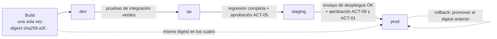
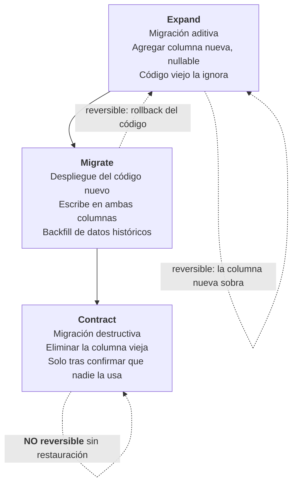

# Deployment Guide — `DOC-DEPLOY`

## 1. Resumen ejecutivo

La guía de despliegue describe cómo una versión del software llega a un entorno que ya está en funcionamiento, con usuarios conectados, datos que preservar y una versión anterior a la que volver. Es el procedimiento de cambio más ejecutado de un producto vivo y el que concentra la mayor densidad de incidentes: buena parte de las caídas de producción no ocurren mientras el sistema funciona, sino mientras alguien lo está actualizando.

Su contenido gira alrededor de cuatro decisiones que el documento tiene que dejar cerradas: qué entornos existen y qué garantiza cada uno, cómo se promueve una versión de uno al siguiente, con qué estrategia se reemplaza la versión en ejecución, y cómo se coordina el cambio del esquema de base de datos con el del código. La cuarta es la que más despliegues rompe y la que menos guías tratan con seriedad.

El criterio de calidad dominante no es la elegancia del procedimiento sino la **reversibilidad**. Un despliegue del que no se puede volver no es un despliegue: es una apuesta.

---

## 2. Definición

### Qué es

El procedimiento por el cual un artefacto versionado —una imagen de contenedor, un paquete, un conjunto de ficheros— pasa a estar en ejecución en un entorno determinado, junto con los cambios de configuración y de esquema que ese artefacto requiere, y con un camino de retorno definido.

Comprende la definición de entornos, las condiciones de promoción entre ellos, la estrategia de reemplazo, la coordinación con la base de datos, la verificación posterior y el rollback. En un equipo maduro el procedimiento está automatizado casi por completo, y la guía documenta lo que la automatización no expresa: por qué se eligió cada estrategia, qué decide un humano, qué se hace cuando el pipeline se detiene a la mitad.

### Qué problema resuelve

Hace que publicar una versión sea una operación aburrida. Ese es literalmente el objetivo: un despliegue que requiere atención, coordinación previa y una persona experimentada al teclado es un despliegue que se hace poco, y desplegar poco aumenta el tamaño de cada cambio, que a su vez aumenta el riesgo. El círculo se rompe documentando y automatizando hasta que el procedimiento sea repetible por cualquiera.

Resuelve también un problema de responsabilidad: deja escrito quién autoriza el paso a producción, contra qué criterios, y qué evidencia queda registrada. Es el punto de contacto con la gestión de cambios de **ITIL 4**.

### Qué NO es

**No es la guía de instalación.** El despliegue supone el entorno ya existente y provisto: motores instalados, red configurada, certificados vigentes, esquema base creado. Si el procedimiento de despliegue instala runtimes o crea bases de datos, está haciendo el trabajo de [`DOC-INSTALL`](Installation-Guide.md), y eso significa que el entorno no está definido como tal sino que se improvisa en cada release.

**No es el pipeline de CI/CD.** La construcción del artefacto —compilación, pruebas, análisis estático, firma, publicación en el registro— pertenece a la sección de integración y entrega continua del [Developer Guide](../60-Desarrollo/Developer-Guide.md). La frontera es el artefacto publicado: hasta ahí es desarrollo; desde que ese artefacto se promueve a un entorno, es esta guía. En la práctica ambos viven en el mismo fichero YAML, lo cual no es razón para documentarlos juntos.

**No son las notas de versión.** Esta guía dice *cómo* se publica; las [Release Notes](../60-Desarrollo/Release-Notes.md) dicen *qué* trae la versión publicada. Se referencian mutuamente y no se mezclan: quien despliega necesita saber si esta versión trae migraciones destructivas, y ese dato viaja en las notas de versión con un formato acordado.

**No es un runbook.** El despliegue es una operación planificada que se ejecuta en régimen normal. Cuando algo sale mal durante el despliegue, se entra en régimen degradado y se pasa al [Runbook](Runbook.md) correspondiente. La guía de despliegue contiene el rollback —que es parte del procedimiento previsto— y no el diagnóstico de un sistema que quedó a mitad de camino.

---

## 3. Aplicación por escenario

| Escenario | ¿Aplica? | Naturaleza | Qué se produce |
|-----------|----------|-----------|----------------|
| `ESC-1` Desarrollo nuevo | Sí, desde el primer entorno compartido | Prescriptiva | Entornos, promoción, estrategia y rollback decididos antes del primer release |
| `ESC-2` Migración | Sí, con una pieza adicional crítica | Doble, más el corte | Despliegue del destino y **plan de corte con vuelta atrás**, que es su documento más importante |
| `ESC-3` Evaluación con código | Sí, reconstructiva | Descriptiva | Se reconstruye el procedimiento real desde pipelines, scripts y configuración |
| `ESC-4` Evaluación externa | **No aplica** | — | No se despliega lo que no se controla |

### `ESC-1` — Desarrollo de software nuevo

La decisión que conviene tomar temprano, aunque el sistema todavía no exista, es la **estrategia de despliegue**, porque condiciona el diseño. Un sistema que va a desplegarse con blue-green necesita ser capaz de correr dos versiones en paralelo; uno que va a usar rolling necesita que sus instancias sean intercambiables y sin estado local; uno que va a usar canary necesita poder enrutar por porcentaje y distinguir en la telemetría a qué versión pertenece cada señal. Esas capacidades no se agregan después sin retrabajo.

En `CTX-1` con Blazor Server aparece una restricción de diseño temprana y poco intuitiva: el circuito mantiene estado en el servidor, de modo que reemplazar una instancia corta las sesiones activas. La decisión de si eso se acepta —con un cartel de reconexión y pérdida del trabajo en curso— o se evita —con drenaje y afinidad de sesión— es arquitectónica y va en un ADR, no en esta guía. Acá se documenta la consecuencia operativa.

En `CTX-2` la decisión temprana es la **compatibilidad de contratos**: si la API debe soportar convivencia de versiones, eso restringe cómo se pueden cambiar los endpoints y hace posible el despliegue independiente de frontend y backend.

### `ESC-2` — Migración a otro lenguaje o plataforma

Al procedimiento habitual se le agrega el documento que decide el éxito de la migración: el **plan de corte**. Fija el momento del cambio, quién lo autoriza, en qué orden se redirige el tráfico, qué se hace con las transacciones en vuelo, cuánto tiempo se mantiene el sistema origen disponible y —lo esencial— cuál es el criterio de aborto y hasta qué instante el retorno sigue siendo posible.

Ese último punto se documenta con precisión de reloj, porque hay operaciones que cruzan un umbral de irreversibilidad. Una vez que el sistema destino escribió datos nuevos en un esquema que el origen no entiende, volver atrás dejó de ser cambiar un DNS. El plan debe decir explícitamente en qué minuto ocurre eso.

La estrategia habitual en migraciones es canary por segmento de usuarios en lugar de por porcentaje aleatorio: se corta primero un área de la organización con tolerancia al ruido, se observa una semana, y se avanza. Requiere que ambos sistemas coexistan sobre los mismos datos, que es la restricción que hay que resolver en el diseño de la migración y no en el despliegue.

### `ESC-3` — Evaluación de software existente con acceso al código

Es el escenario donde este documento hay que **reconstruirlo**, y la reconstrucción es de las más productivas de la guía porque el despliegue deja huellas abundantes.

El procedimiento de reconstrucción, en orden:

Se empieza por los **ficheros de pipeline** (`.github/workflows/`, `azure-pipelines.yml`, `.gitlab-ci.yml`). Ahí está el procedimiento efectivamente ejecutado: los *jobs*, sus dependencias, las condiciones de disparo (`on: push: branches:`), los entornos declarados y —dato clave— las **aprobaciones manuales**, que en GitHub Actions aparecen como *environments* con *required reviewers* y en Azure DevOps como *approvals and checks*. Cada aprobación manual es una decisión humana en el procedimiento, y quién puede darla revela la estructura de autoridad real.

Se continúa por el **historial de ejecuciones**, que suele ser más revelador que la definición. La frecuencia de despliegue, la tasa de fallo, el tiempo entre la aprobación y la ejecución, cuántas veces se usó el *job* de rollback: son las cuatro métricas DORA leídas directamente de la evidencia, y describen el proceso real y no el declarado.

Se sigue por los **manifiestos de despliegue**: `docker-compose.yml`, charts de Helm, plantillas de Bicep o ARM, definiciones de App Service. De ahí salen la estrategia efectiva —`strategy: RollingUpdate` con `maxUnavailable` y `maxSurge`, o la existencia de *deployment slots* en Azure App Service, que es blue-green con otro nombre—, las sondas de salud, los límites de recursos y la política de reinicio.

Se examinan las **migraciones de base de datos**: la carpeta `Migrations/` de EF Core, los scripts numerados, o la configuración de una herramienta como DbUp o Flyway. Lo que hay que determinar es **quién las aplica y cuándo**: si hay un paso explícito en el pipeline, si la aplicación ejecuta `Database.Migrate()` al arrancar —patrón frecuente y peligroso, porque en un despliegue rolling varias instancias intentan migrar a la vez— o si las aplica una persona a mano antes de avisar.

Se revisa la **configuración por entorno**: ficheros `appsettings.<Entorno>.json`, grupos de variables, referencias a Key Vault. La diferencia entre la configuración de *staging* y la de producción muestra qué se está probando de verdad antes de publicar. Cuando *staging* apunta a una base de datos con tres registros y producción a una con cuatro millones, lo que *staging* verifica es que el sistema arranca.

Y se cierra con lo que la evidencia estática **no** dice: el paso manual que alguien ejecuta y nadie automatizó. Se descubre observando un despliegue real o preguntando; si no puede hacerse ninguna de las dos cosas, se registra como hueco y no se completa con lo que sería razonable. La distancia entre el procedimiento reconstruido y el ejecutado es, en sí misma, el hallazgo.

### `ESC-4` — Evaluación de un producto solo desde afuera

**No aplica.** El despliegue es una operación que se ejecuta sobre infraestructura bajo control propio, y en `ESC-4` no hay ni infraestructura ni control: hay un producto que alguien más opera. No existe artefacto que producir.

Lo que sí puede observarse desde afuera es el **ritmo y el estilo de despliegue del proveedor**, y eso pertenece a otro análisis. Las notas de versión revelan la frecuencia de entrega; una cabecera de respuesta con número de build revela versionado; la aparición gradual de una funcionalidad entre sesiones sugiere despliegue por canary; un aviso de mantenimiento programado sugiere lo contrario, una estrategia con indisponibilidad. Todo eso es inferencia de segundo orden sobre la ingeniería del proveedor, se marca con confianza baja y no constituye una guía de despliegue.

---

## 4. Entornos y promoción

### 4.1 Definición de entornos

Un entorno no es una máquina: es un conjunto de garantías. Documentarlo consiste en declarar qué se puede afirmar de él, no qué servidores lo componen.

| Entorno | Propósito | Datos | Quién despliega | Aprobación | Paridad con producción |
|---------|-----------|-------|-----------------|-----------|------------------------|
| `dev` | Integración continua del equipo | Sintéticos, regenerables | Automático en cada merge a `main` | Ninguna | Baja: instancia única, sin balanceador |
| `qa` | Verificación funcional y de regresión | Sintéticos, volumen medio, estables | Automático tras `dev` verde | Ninguna | Media: misma topología, menor escala |
| `staging` | Ensayo del despliegue a producción | Copia anonimizada de producción | Manual, desde el pipeline | `ACT-05` QA | **Alta: obligatoria** |
| `prod` | Servicio real | Reales | Manual, con ventana declarada | `ACT-06` + `ACT-01` | — |

La fila de `staging` es la que sostiene todo el esquema. Su función no es probar el software —eso ya se hizo en `qa`— sino **probar el despliegue**: la misma estrategia, la misma coordinación con la base, el mismo rollback, sobre un volumen de datos comparable. Un *staging* que difiere de producción en topología, en versión del motor de base o en orden de magnitud de datos no ensaya nada, y su aprobación es un trámite. La paridad entre entornos es uno de los doce factores de **The Twelve-Factor App** y es el que más se incumple con más justificaciones de costo.

### 4.2 Promoción

La regla que hace confiable la cadena es que **se promueve el artefacto, no el código**. La misma imagen que se construyó una vez, con el mismo digest, atraviesa los cuatro entornos; lo único que cambia entre uno y otro es la configuración inyectada. Reconstruir por entorno introduce una variable que anula el valor de haber probado en el anterior.



Cada flecha lleva una **condición de promoción explícita y verificable**. La ausencia de esas condiciones convierte la cadena en una secuencia de entornos que el artefacto atraviesa por costumbre.

---

## 5. Estrategias de despliegue

Cuatro estrategias cubren prácticamente todos los casos. Elegir entre ellas es una decisión de compromiso entre indisponibilidad, costo de infraestructura, velocidad de rollback y complejidad de la aplicación.

| Estrategia | Indisponibilidad | Convivencia de versiones | Costo | Rollback | Cuándo elegirla |
|-----------|------------------|-------------------------|-------|----------|-----------------|
| **Recreate** | Sí, la del arranque | No | Mínimo | Redesplegar la anterior, con nueva indisponibilidad | Entornos internos; sistemas con ventana de mantenimiento aceptada; cambios de esquema incompatibles |
| **Rolling** | No | Sí, transitoria e inevitable | Bajo | Rolling inverso, lento | Servicios sin estado con contratos compatibles hacia atrás; opción por defecto en Kubernetes |
| **Blue-green** | No | Sí, controlada | Alto: doble infraestructura | Inmediato, se conmuta el enrutador | Cuando el rollback debe ser en segundos; cuando conviene ensayar la versión nueva en producción sin tráfico |
| **Canary** | No | Sí, prolongada y deliberada | Medio-alto | Inmediato para el subconjunto expuesto | Cambios de riesgo alto o de comportamiento incierto; requiere telemetría capaz de segmentar por versión |

### Criterios de elección

La primera pregunta no es cuál es mejor sino **qué tolera el sistema**. Si la aplicación no puede correr dos versiones a la vez —porque escriben en el mismo esquema de forma incompatible, o porque comparten un recurso exclusivo— rolling, blue-green y canary quedan descartadas de entrada y la conversación se acaba: es recreate con ventana, o hay que cambiar la aplicación.

La segunda es **cuánto cuesta un minuto de indisponibilidad**. Un sistema interno de reservas de salas que se actualiza a las 21:00 no necesita blue-green; el costo de la doble infraestructura no compra nada que el negocio valore. Un sistema de pagos sí.

La tercera es **cuánto tarda en manifestarse un fallo**. Si los problemas aparecen en segundos —errores de arranque, dependencias faltantes— el rollback rápido de blue-green alcanza. Si aparecen en horas —fugas de memoria, degradación bajo carga real, corrupción lenta de datos— hace falta canary con un período de observación explícito, porque una conmutación instantánea no protege contra un fallo que todavía no se manifestó.

La cuarta, específica de `CTX-1` con Blazor Server: **el estado del circuito**. Con rolling, cada instancia que se retira corta las sesiones alojadas en ella; los usuarios ven el cartel de reconexión y, si el estado del componente no se persistió, pierden el trabajo en curso. Las mitigaciones documentables son el drenaje —dejar de admitir circuitos nuevos y esperar a que los existentes terminen, con un tiempo máximo declarado— y la ventana horaria. Blue-green no resuelve esto por sí solo: si el enrutador conmuta de golpe, los circuitos del entorno azul mueren igual. Lo que se necesita es conmutación de tráfico nuevo con drenaje del antiguo, y un tiempo máximo tras el cual se corta lo que quede.

---

## 6. Migraciones de base de datos coordinadas con el código

Es el punto donde más despliegues se rompen y donde la reversibilidad se pierde sin que nadie lo note.

### El problema

Durante cualquier estrategia sin indisponibilidad conviven, aunque sea por segundos, la versión vieja y la nueva del código sobre **un solo esquema de base de datos**. De ahí se derivan las dos reglas que gobiernan la coordinación: el esquema debe ser compatible con ambas versiones durante la ventana de convivencia, y toda migración debe poder aplicarse antes que el código nuevo sin romper al viejo.

### El patrón expand / contract

La técnica estándar descompone todo cambio incompatible en tres despliegues separados en el tiempo.



Cada etapa es un despliegue independiente, con su propia verificación y su propia ventana de observación. La tercera es la única irreversible, y de ahí la regla operativa: **la fase de contracción no se ejecuta en el mismo despliegue que introduce el cambio**, sino días o semanas después, cuando la versión nueva ya demostró estabilidad y el rollback dejó de ser una posibilidad realista.

### Cambios y su tratamiento

| Cambio | ¿Compatible hacia atrás? | Tratamiento |
|--------|-------------------------|-------------|
| Agregar tabla | Sí | Migración directa antes del código |
| Agregar columna nullable o con valor por defecto | Sí | Migración directa antes del código |
| Agregar índice | Sí, con cuidado | `WITH (ONLINE = ON)` en SQL Server Enterprise; fuera de ventana pico en Standard |
| Renombrar columna | **No** | Expand/contract: agregar, escribir en ambas, migrar lectores, eliminar |
| Cambiar tipo de dato | **No** | Columna nueva + backfill + conmutación de lectura + eliminación |
| Eliminar columna o tabla | **No** | Solo fase de contracción, tras confirmar cero uso en telemetría |
| Agregar restricción `NOT NULL` | **No** | Backfill primero, restricción después, en despliegue separado |

### Quién aplica la migración

Tres opciones, con consecuencias distintas y una que conviene descartar.

Aplicarla como **paso explícito del pipeline**, antes de desplegar el código, es lo recomendable: hay un momento identificable, un registro, y el despliegue se detiene si la migración falla, sin haber tocado el código en ejecución.

Aplicarla **desde la aplicación al arrancar** —`Database.Migrate()` en el `Program.cs`— es cómodo en desarrollo y problemático en producción: con rolling, varias instancias arrancan a la vez y compiten por aplicar la misma migración; el bloqueo del historial de EF Core evita la corrupción pero produce arranques lentos y tiempos de espera; y una migración larga hace fallar la sonda de disponibilidad, con lo cual el orquestador mata al contenedor a mitad de una operación de esquema.

Aplicarla **a mano** es la opción que existe en más organizaciones de las que lo admiten. Cuando ese sea el caso real, la guía lo documenta como tal en lugar de describir el procedimiento ideal: una guía que describe un pipeline que nadie usa es peor que una que describe un procedimiento manual que todos siguen.

### Rollback con datos de por medio

Volver el código atrás es barato; volver los datos, no. La guía tiene que declarar por cada release cuál es su **punto de no retorno**, y esa declaración viaja en las [Release Notes](../60-Desarrollo/Release-Notes.md) con una marca acordada, del estilo `MIGRACIÓN DESTRUCTIVA` o `ROLLBACK LIMITADO`.

El procedimiento de rollback se documenta en tres variantes, porque no son la misma operación. Rollback **solo de código**, cuando el esquema es compatible: se promueve el digest anterior y termina en minutos. Rollback **de código y esquema**, cuando la migración era reversible: se aplica la migración inversa y luego se promueve el código anterior, en ese orden. Y **restauración desde respaldo**, cuando la migración fue destructiva: deja de ser un rollback y pasa a ser un procedimiento de recuperación, con pérdida de datos igual al tiempo transcurrido desde el respaldo, y se ejecuta bajo el [Runbook](Runbook.md) correspondiente y no bajo esta guía.

---

## 7. Orden de despliegue en fullstack (`CTX-3`)

Cuando frontend y backend se despliegan por separado, el orden no es indiferente y depende de la dirección de la incompatibilidad.

**Regla general: primero lo que acepta más, después lo que exige más.** El backend nuevo debe aceptar las peticiones del frontend viejo, de modo que se despliega primero. El frontend nuevo, que puede depender de campos o endpoints que solo existen en el backend nuevo, va después.

La secuencia completa para el sistema de reservas, con Blazor Server, ASP.NET Core y SQL Server:

1. **Migración aditiva** del esquema. Verificación: el historial de migraciones avanzó y la aplicación en ejecución —todavía la vieja— sigue respondiendo `Healthy`.
2. **Backend**, con rolling. Verificación: `/health/ready` en todas las instancias, tasa de error 5xx sin variación respecto de la línea base, contrato viejo todavía atendido.
3. **Período de observación**, con duración declarada. Para un sistema interno, quince minutos; para uno crítico, el tiempo que tarde en aparecer el patrón de uso completo, que puede ser un ciclo diario.
4. **Frontend**, con drenaje de circuitos. Verificación: circuito nuevo establecido, navegación de un flujo completo, ausencia de errores de deserialización en los logs del cliente.
5. **Fase de contracción**, en un despliegue posterior y separado.

En `CTX-3` con Blazor Server hay un matiz que la regla general no cubre y que sorprende a equipos acostumbrados a SPA: con render mode *interactive server*, buena parte del «frontend» se ejecuta en el servidor y viaja en el mismo artefacto que el backend. Cuando ambos están en un único proceso, los pasos 2 y 4 se funden y desaparece la ventana de convivencia entre capas —lo cual simplifica— pero desaparece también la posibilidad de desplegarlos por separado, y cualquier incompatibilidad se resuelve en un solo salto. Si además hay una API pública consumida por terceros dentro del mismo proceso, esos terceros son un tercer actor que sí necesita compatibilidad hacia atrás y que no se despliega con usted.

Ese detalle es exactamente la clase de cosa que hay que documentar: no es evidente, condiciona la estrategia, y quien lo descubre durante un despliegue lo descubre tarde.

---

## 8. Ejemplos concretos

### 8.1 Procedimiento de despliegue a producción — sistema de reservas

Ilustrativo y con datos sintéticos. Muestra el estilo exigible: precondición, pasos imperativos, resultado esperado, verificación, y punto de decisión de aborto.

> **Precondiciones.** La versión candidata está desplegada en `staging` desde hace al menos 24 h sin alertas. Las Release Notes de `1.8.0` están publicadas y **no** declaran `MIGRACIÓN DESTRUCTIVA`. La ventana acordada es de 21:00 a 22:00. Existe respaldo completo de `ReservasDb` posterior a las 20:30, verificado. El responsable de guardia está disponible y avisado.
>
> **Paso 1 — Registrar el inicio del cambio.**
> Cree la entrada de cambio con el identificador de release y notifique en el canal `#despliegues`.
> *Resultado esperado:* mensaje publicado con versión, ventana y responsable.
>
> **Paso 2 — Confirmar la línea base.**
> Registre, del tablero de operación, los valores actuales de: tasa de 5xx, latencia p95 de `POST /reservas`, circuitos Blazor activos, conexiones activas del pool.
> *Resultado esperado:* cuatro valores anotados. Sin línea base no hay forma de decidir si la versión nueva empeoró algo.
>
> **Paso 3 — Aplicar la migración aditiva.**
> ```bash
> gh workflow run deploy-db.yml -f environment=prod -f version=1.8.0
> ```
> *Resultado esperado:* `Applied 2 migrations. Current: 20260714_AddReservaRecurrenciaId.`
> *Verificación:* `/health/ready` sigue devolviendo `200` con la versión `1.7.3` en ejecución. La aplicación vieja convive con el esquema nuevo.
> *Si falla:* la migración es transaccional; la base queda en el estado previo. **Aborte el despliegue** y escale. No continúe al paso 4.
>
> **Paso 4 — Promover el artefacto.**
> ```bash
> gh workflow run deploy-app.yml -f environment=prod -f digest=sha256:a3f1c8…
> ```
> *Resultado esperado:* rolling completado, 4 de 4 réplicas en `Ready`, ninguna en `CrashLoopBackOff`.
> *Verificación:* `/health/ready` devuelve `200` y `"version":"1.8.0"` en las cuatro réplicas.
> *Si una réplica no pasa a `Ready` en 5 minutos:* el rolling se detiene solo con `maxUnavailable: 1`; el servicio sigue atendido por las réplicas viejas. Vaya al paso 7.
>
> **Paso 5 — Verificación funcional.**
> Ejecute el flujo completo con la cuenta de verificación `qa.deploy@interna`: iniciar sesión, crear una reserva para mañana en «Belgrano — piso 3», confirmarla, verla en la grilla, cancelarla.
> *Resultado esperado:* los cinco pasos completan sin error visible y sin cartel de reconexión del circuito.
>
> **Paso 6 — Observación.**
> Durante 15 minutos, compare contra la línea base del paso 2. **Criterio de aborto:** tasa de 5xx superior al doble de la línea base, o p95 de `POST /reservas` por encima de 800 ms sostenido 5 minutos, o cualquier alerta de la familia `ALT-0xx` activa.
> *Si se cumple el criterio de aborto:* vaya al paso 7 sin discusión previa. El análisis se hace después del rollback, no en lugar del rollback.
>
> **Paso 7 — Rollback (solo si corresponde).**
> ```bash
> gh workflow run deploy-app.yml -f environment=prod -f digest=sha256:9b02e4…
> ```
> *Resultado esperado:* 4 de 4 réplicas ejecutando `1.7.3`; los valores vuelven a la línea base en menos de 10 minutos.
> *Nota:* la migración del paso 3 es aditiva y **no** se revierte. La versión `1.7.3` ignora las columnas nuevas.
> *Después:* abra el [Postmortem](Postmortem.md) si hubo impacto sobre usuarios.
>
> **Paso 8 — Cierre.**
> Registre el resultado en la entrada de cambio, publique en `#despliegues` y actualice el historial de despliegues con la duración real.

El paso 6 contiene la decisión que distingue una guía útil de una decorativa: el criterio de aborto está **escrito y es numérico**. Cuando el criterio no está escrito, la decisión de revertir se toma discutiendo, y discutir mientras el sistema se degrada agrega minutos de indisponibilidad a un problema que ya se sabía cómo resolver.

### 8.2 Extracto de configuración de entornos en GitHub Actions

El pipeline en sí pertenece al [Developer Guide](../60-Desarrollo/Developer-Guide.md); lo que corresponde documentar acá es la parte que expresa el procedimiento de despliegue: entornos, aprobaciones y estrategia.

| Elemento del pipeline | Qué expresa del procedimiento |
|----------------------|-------------------------------|
| `environment: production` con *required reviewers* | Quién autoriza el paso a producción, y que es una decisión humana |
| `concurrency: group: deploy-prod, cancel-in-progress: false` | Que no se permiten dos despliegues simultáneos al mismo entorno |
| `deployment_branch_policy: protected_branches` | Que solo se despliega desde ramas protegidas |
| Un job `rollback` con `workflow_dispatch` | Que la vuelta atrás es una operación de primera clase y no una improvisación |
| Secretos definidos por entorno | Que la misma imagen recibe configuración distinta según destino |

---

## 9. Preguntas guía

- ¿Qué garantiza cada entorno, y en qué difiere `staging` de producción? ¿Esa diferencia invalida lo que se ensayó?
- ¿Se promueve el mismo artefacto o se reconstruye por entorno?
- ¿Cuál es la condición explícita de promoción entre cada par de entornos, y quién la aprueba?
- ¿La aplicación tolera correr dos versiones a la vez? Si no, ¿qué estrategia queda disponible?
- ¿Cuánto tarda un rollback completo, medido y no estimado? ¿Cuándo se cronometró por última vez?
- ¿Cuál es el punto de no retorno de este release, y está declarado en las notas de versión?
- ¿Quién aplica las migraciones, en qué momento, y qué pasa si dos instancias las aplican a la vez?
- ¿El criterio de aborto está escrito con números, o se decide discutiendo?
- En `CTX-1` con Blazor Server: ¿qué le pasa a un usuario que está confirmando una reserva en el instante del despliegue?

---

## 10. Criterios de calidad y antipatrones

### Criterios de calidad

Un buen Deployment Guide se reconoce porque **el rollback se ejecutó de verdad en los últimos tres meses**, en producción o en un ensayo sobre *staging*, y hay una medición del tiempo que tardó. Un rollback documentado y nunca ejecutado es una hipótesis.

Los demás criterios: entornos definidos por garantías y no por servidores; condiciones de promoción explícitas; estrategia elegida con criterio registrado y no por defecto de la herramienta; migraciones tratadas con expand/contract y punto de no retorno declarado por release; criterio de aborto numérico; línea base registrada antes de cada despliegue; el procedimiento cabe en una página y el resto es contexto; y coherencia con el pipeline real, verificable leyendo el YAML.

Un indicador indirecto pero fiable es la **frecuencia de despliegue**. Un equipo que despliega varias veces por semana tiene, necesariamente, un procedimiento confiable; uno que despliega una vez por trimestre tiene un procedimiento que teme, y el miedo se documenta mal.

### Antipatrones

**Rollback teórico.** Documentado, nunca ejecutado. Se descubre que no funciona en el único momento en que hace falta. La contramedida es barata: ensayarlo en *staging* una vez por trimestre y cronometrarlo.

**Reconstruir por entorno.** Compilar de nuevo para producción anula el valor de haber probado en *staging*. Se promueve el digest.

**Migración y código en el mismo salto irreversible.** Renombrar una columna y desplegar el código que la usa en la misma operación deja el sistema sin vuelta atrás desde el primer segundo, sin que nadie lo haya decidido conscientemente.

**`Database.Migrate()` al arrancar en producción.** Cómodo en desarrollo, fuente de arranques en competencia, sondas que expiran y contenedores muertos a mitad de una operación de esquema.

**Staging de juguete.** Tres registros, una réplica, otra versión del motor. Aprueba despliegues que no ensayó.

**Criterio de aborto por consenso.** «Si vemos que algo raro pasa, volvemos.» Nadie quiere ser quien aborta, la degradación se tolera, y se revierte tarde y peor.

**Ventana de mantenimiento como estrategia permanente.** Aceptable como decisión consciente y documentada; problemática cuando es la consecuencia no examinada de una aplicación que nunca se hizo capaz de otra cosa.

**Guía que describe el pipeline ideal.** Si el procedimiento real incluye tres pasos manuales, la guía los documenta. La versión aspiracional se lee una vez, se descubre incompleta, y a partir de ahí nadie vuelve a abrirla.

**Confundir despliegue con instalación.** Un despliegue que instala runtimes revela que el entorno no está definido y se improvisa en cada release.

---

## 11. Anexo — Plantilla comentada

```markdown
---
doc_id: DEPLOY-<sistema>
doc_type: operativa
title: Guía de despliegue — <sistema>
status: vigente
origin: human
owner: <ACT-06 responsable>
last_review: AAAA-MM-DD
rollback_tested_on: AAAA-MM-DD    # si esta fecha tiene más de un trimestre, el rollback es hipotético
audience: [humano, agente]
---

# Guía de despliegue — <sistema>

## 1. Alcance
<!-- Qué cubre y qué no. Enlazar explícitamente a la guía de instalación
     (entorno preexistente), al Developer Guide (pipeline) y a las Release
     Notes (contenido de la versión). -->

## 2. Entornos
<!-- Tabla: entorno | propósito | datos | quién despliega | aprobación |
     paridad con producción. Declarar las diferencias con producción y qué
     invalidan. Un entorno se define por sus garantías, no por sus servidores. -->

## 3. Promoción
<!-- Diagrama Mermaid de la cadena. Por cada flecha: condición explícita de
     promoción, quién aprueba, qué evidencia queda. Declarar que se promueve
     el artefacto y no el código. -->

## 4. Estrategia de despliegue
<!-- Cuál se usa en cada entorno y POR QUÉ: qué toleraba el sistema, cuánto
     costaba la indisponibilidad, en cuánto tiempo se manifiestan los fallos.
     Si la decisión fue estructural, enlazar al ADR. -->

### 4.1 Restricciones de la aplicación
<!-- ¿Tolera convivencia de versiones? ¿Hay estado en el proceso? En Blazor
     Server: qué le pasa al circuito, cuál es la política de drenaje y su
     tiempo máximo. -->

## 5. Coordinación con la base de datos
<!-- Quién aplica las migraciones y cuándo. Clasificación de cambios
     compatibles / incompatibles. Patrón expand/contract con las tres fases
     separadas en el tiempo. Punto de no retorno por release. -->

## 6. Orden de despliegue
<!-- Solo en CTX-3 o cuando hay varios artefactos. Secuencia numerada con
     verificación por paso y período de observación entre piezas. -->

## 7. Procedimiento
<!-- Precondiciones verificables → pasos numerados imperativos → resultado
     esperado → verificación independiente → criterio de aborto NUMÉRICO.
     Incluir el registro de la línea base antes de tocar nada. -->

## 8. Rollback
<!-- Las tres variantes por separado:
     8.1 Solo código (esquema compatible)
     8.2 Código y esquema (migración reversible)
     8.3 Restauración desde respaldo (migración destructiva) — remite al runbook
     Tiempo objetivo y tiempo medido de cada una, con fecha de la medición. -->

## 9. Verificación posterior
<!-- Qué se mira, durante cuánto tiempo, y contra qué línea base. -->

## 10. Historial de despliegues
<!-- Fecha | versión | estrategia | duración | incidencias | ¿rollback?
     Alimenta las métricas DORA y es la evidencia de que el procedimiento se
     usa. Una tabla vacía en un producto de tres años significa que el
     procedimiento real está en otro lado. -->
```

La fila `rollback_tested_on` del frontmatter existe para que un lector pueda decidir, antes de empezar, cuánta confianza depositar en la sección 8. Es el mismo principio que el historial de verificación de la guía de instalación: el documento declara su propio grado de vigencia en lugar de dejar que el lector lo suponga.
