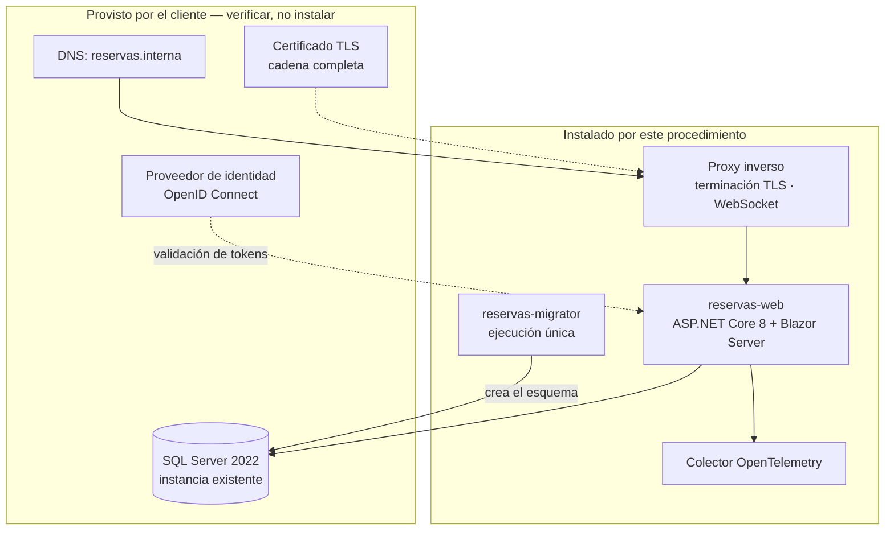

# Installation Guide — `DOC-INSTALL`

## 1. Resumen ejecutivo

La guía de instalación lleva a un sistema desde la nada hasta el primer arranque verificado. Su lector típico no participó del desarrollo: es un integrador que recibió el producto, un administrador de sistemas del cliente, un desarrollador que se incorpora y necesita un entorno local, o el propio equipo reprovisionando después de perder una máquina.

Es el documento que más se prueba a sí mismo y el que menos se prueba en la práctica. Cada paso tiene un resultado observable —un servicio que responde, una tabla que existe, un certificado que valida— y por eso admite verificación mecánica: se ejecuta en una máquina limpia y se comprueba si funciona. Que esa prueba sea trivial de hacer y aun así rara de ver es el rasgo más característico del artefacto.

El error que lo arruina no es la falta de detalle sino el **conocimiento tácito del autor**. Quien escribe la guía tiene el entorno funcionando desde hace meses; las dependencias que instaló hace un año no aparecen en el texto porque en su máquina ya estaban. La guía funciona para él y falla para todos los demás.

---

## 2. Definición

### Qué es

Un procedimiento ordenado y verificable que, ejecutado sobre un entorno que cumple ciertos prerrequisitos, deja el sistema operativo, accesible y con un usuario administrador capaz de continuar la configuración. Termina en un estado nombrable —«instalación base completa»— y no en «ya está».

Cubre cuatro bloques: **prerrequisitos** (hardware, sistema operativo, motores, red, certificados, permisos), **procedimiento** (pasos numerados con verificación), **configuración inicial** (variables, cadenas de conexión, secretos, datos maestros mínimos) y **desinstalación** (que casi siempre falta y que se necesita justamente cuando algo salió mal).

### Qué problema resuelve

Convierte conocimiento tácito en procedimiento transferible. Sin ella, poner el sistema en una máquina nueva requiere a la persona que lo hizo la última vez, y ese cuello de botella se manifiesta en el peor momento: cuando hay que reconstruir un entorno de urgencia y esa persona está de licencia.

Resuelve también un problema contractual. En software entregado a terceros, la guía de instalación es parte del producto: define qué se espera del cliente, qué provee el proveedor y dónde está la frontera de soporte cuando algo no arranca.

### Qué NO es

**No es una guía de despliegue.** La distinción es la que ordena toda la familia: la instalación crea un entorno donde no había nada; el despliegue actualiza uno que ya existe y tiene datos, usuarios y una versión previa. El [Deployment Guide](Deployment-Guide.md) tiene que contestar dos preguntas que la instalación no se plantea: qué pasa con lo que ya estaba y cómo se vuelve atrás. Si su guía de despliegue incluye «instale el runtime de .NET», o su definición de entorno está mal, o está escribiendo dos veces el mismo documento.

**No es un manual de administración.** La instalación termina cuando existe el primer administrador y el sistema responde. Todo lo que ese administrador haga después —crear salas, dar de alta usuarios, configurar el horario laboral— pertenece al [Administrator Guide](Administrator-Guide.md).

**No es un tutorial de las tecnologías que usa.** No enseña Docker ni SQL Server. Declara la versión exigida, remite a la documentación del fabricante y verifica que el prerrequisito se cumple. La guía que explica cómo instalar Docker en tres distribuciones distintas envejece al ritmo de Docker y no al del producto.

**No es el script.** Cuando la instalación está automatizada —Terraform, Bicep, Ansible, un `docker compose up`— el script es la fuente de verdad y la guía documenta lo que el script no puede expresar: qué prerrequisitos externos supone, qué decisiones toma por usted, qué hacer cuando falla a la mitad, y cómo verificar que hizo lo que dijo. Una guía que parafrasea un script se desincroniza en la primera modificación.

### Con qué más se confunde

Con la guía de *getting started* del desarrollador. Comparten pasos, pero no audiencia ni objetivo: el desarrollador necesita un entorno modificable con datos de prueba y depuración habilitada; el instalador necesita un entorno productivo con secretos reales y superficie mínima. Cuando el mismo documento sirve a ambos, la parte de desarrollo vive en el [Developer Guide](../60-Desarrollo/Developer-Guide.md) y esta guía se limita a lo desplegable.

---

## 3. Aplicación por escenario

| Escenario | ¿Aplica? | Naturaleza | Qué se produce |
|-----------|----------|-----------|----------------|
| `ESC-1` Desarrollo nuevo | Sí, tardío | Prescriptiva, escrita a medida que se instala | La guía nace del primer entorno real, no del diseño |
| `ESC-2` Migración | Sí, y duplicada | Doble | Instalación del destino, más el procedimiento de coexistencia con el origen |
| `ESC-3` Evaluación con código | Sí, reconstructiva | Descriptiva | Se reconstruye desde scripts, `Dockerfile`, IaC y configuración |
| `ESC-4` Evaluación externa | **Parcialmente** | Inferencial | Solo si el producto publica su guía o se instala una versión de prueba |

### `ESC-1` — Desarrollo de software nuevo

La trampa es escribirla antes de haber instalado nada. Una guía redactada desde el diseño describe la instalación que el arquitecto imagina, y la primera instalación real la desmiente en el paso tres. El momento correcto es durante el primer despliegue a un entorno que no sea la máquina de un desarrollador: se ejecuta y se anota, incluido lo que salió mal.

La disciplina que sostiene la calidad es simple y poco practicada: cada vez que alguien instala el sistema, corrige la guía con lo que tuvo que averiguar por su cuenta. Tres instalaciones con esa regla producen un documento que funciona; treinta sin ella producen un documento que nadie cree.

En `CTX-1` los prerrequisitos giran alrededor del servidor web, los certificados TLS y —con Blazor Server— la configuración de WebSockets a través del balanceador y del proxy inverso, que es el punto donde más instalaciones se traban. En `CTX-2` giran alrededor del motor de base de datos, del broker de mensajería y de la conectividad hacia sistemas externos. En `CTX-3` hay que declarar explícitamente el orden: base de datos, esquema, backend, frontend, y la verificación cruzada al final.

### `ESC-2` — Migración a otro lenguaje o plataforma

Se necesitan dos instalaciones y, sobre todo, la documentación de la **coexistencia**. Durante el corte ambos sistemas existen a la vez, y las preguntas que hay que contestar por escrito son operativas: si comparten base de datos o cada uno tiene la suya, cómo se sincronizan si son dos, quién resuelve los nombres de host durante la transición, qué pasa con las sesiones abiertas en el sistema viejo cuando el nuevo empieza a recibir tráfico.

La guía de instalación del destino tiene además una responsabilidad que no tiene en `ESC-1`: **registrar qué prerrequisitos del sistema origen dejan de ser necesarios**. Un componente de infraestructura que nadie desinstala porque nadie está seguro de que ya no se use es el residuo típico de las migraciones, y sobrevive años consumiendo licencias.

### `ESC-3` — Evaluación de software existente con acceso al código

Nadie va a entregarle una guía de instalación fiel. Lo que hay es evidencia dispersa, y el trabajo consiste en reconstruir el procedimiento real a partir de ella, con cada afirmación rastreable a un archivo.

Las fuentes, en orden de fiabilidad decreciente: los ficheros de infraestructura como código (`main.tf`, `main.bicep`, `docker-compose.yml`, charts de Helm) declaran el estado deseado y son la evidencia más fuerte; el `Dockerfile` revela runtime, dependencias del sistema y puertos; las migraciones de Entity Framework —o los scripts en `/db`— revelan el esquema y su orden de aplicación; `appsettings.json` y sus variantes por entorno revelan qué se configura y qué claves espera el sistema, aunque no sus valores; los ficheros de pipeline (`.github/workflows/*.yml`, `azure-pipelines.yml`) revelan el procedimiento efectivamente ejecutado, que suele diferir del documentado; y el `README` del repositorio, que es la fuente menos fiable y la más citada.

Lo que la evidencia estática nunca dice: qué se hizo a mano una vez y nadie automatizó. Los certificados instalados manualmente, la cuenta de servicio creada por el administrador de dominio, la regla de firewall que alguien pidió por ticket. Esa capa se descubre instalando en un entorno limpio y anotando cada cosa que falta, o entrevistando a quien lo hizo. Todo lo que no se pudo verificar se marca como no verificado.

### `ESC-4` — Evaluación de un producto solo desde afuera

Aplica de forma limitada y por una razón concreta: la instalación es de los pocos artefactos operativos que a veces se publica. Un producto que se ofrece *on-premise* o autohospedado documenta sus requisitos de sistema, su procedimiento y sus dependencias, y ese material es evidencia legítima de primera mano.

Lo que se puede afirmar con confianza alta: los prerrequisitos declarados, las versiones soportadas, el modelo de licenciamiento y —dato revelador— el esfuerzo que el proveedor supone para la puesta en marcha. Una guía de cuarenta páginas y una de cuatro dicen cosas muy distintas sobre la madurez del producto y sobre a quién está dirigido.

Lo que **no** aplica: si el producto es solamente SaaS, no hay nada que instalar y la fila se cierra ahí. Que exista un botón de «crear cuenta» no es una instalación; es alta de inquilino, y pertenece al [Administrator Guide](Administrator-Guide.md).

Toda inferencia sobre la instalación real del proveedor a partir de su comportamiento observable es hipótesis y se marca como tal.

---

## 4. Ejemplos concretos

El sistema de reserva de salas, en su versión `CTX-3`: Blazor Server con render mode *interactive server* sobre ASP.NET Core 8, SQL Server 2022, todo en contenedores, detrás de un proxy inverso con terminación TLS.

### 4.1 Tabla de prerrequisitos

Los prerrequisitos se declaran con versión mínima, versión probada y forma de verificarlos. «Versión probada» es el dato que más ahorra soporte, porque distingue lo que debería funcionar de lo que se sabe que funciona.

| Componente | Versión mínima | Versión probada | Verificación |
|-----------|----------------|-----------------|--------------|
| Docker Engine | 24.0 | 26.1 | `docker --version` |
| SQL Server | 2019 (15.x) | 2022 (16.0.4145) | `SELECT @@VERSION` |
| CPU / RAM del host | 4 vCPU / 8 GB | 8 vCPU / 16 GB | `nproc`, `free -g` |
| Almacenamiento de datos | 50 GB | 200 GB SSD | `df -h /var/opt/mssql` |
| Certificado TLS | — | Cadena completa, PEM | `openssl x509 -noout -dates -in cert.pem` |
| Puertos entrantes | 443 | 443 | `ss -lntp \| grep 443` |
| Cuenta de servicio SQL | — | Login `app_reservas`, no `sa` | `SELECT name FROM sys.server_principals` |

Nótese la fila del puerto: 443 y ninguno más. Enumerar los puertos que **no** hacen falta es tan útil como enumerar los que sí, porque el instalador que abre el 1433 al mundo lo hace por prudencia mal aplicada, no por maldad.

### 4.2 Alcance de la instalación

Antes del procedimiento conviene mostrar qué se va a instalar y qué se supone ya existente. El diagrama no reemplaza al [SAD](../30-Arquitectura/SAD.md): omite deliberadamente la estructura interna de la aplicación y muestra solo lo que el instalador tiene que crear, configurar o verificar.



La separación entre ambos bloques es la frontera de soporte y merece figurar en el documento aunque el sistema se instale de puertas adentro: cuando la instalación se traba, la primera pregunta útil es de qué lado de esa línea está el problema.

### 4.3 Procedimiento, con el estilo que corresponde

El fragmento siguiente muestra la forma exigible: precondición, paso imperativo numerado, resultado esperado, verificación y vuelta atrás. Es ilustrativo y los valores son sintéticos.

> **Precondición del bloque.** Los prerrequisitos de la tabla anterior están verificados. Dispone de la cadena de conexión al servidor SQL con un login capaz de crear bases de datos, y del fichero `reservas-secrets.env` provisto por el equipo de plataforma.
>
> **Paso 3 — Crear la base de datos y el login de aplicación.**
> Ejecute, desde el host que tiene acceso al motor:
> ```bash
> sqlcmd -S sql-prod.interna:1433 -U instalador -i ./db/00-create-database.sql
> ```
> *Resultado esperado:* la salida termina con `Base de datos ReservasDb creada. Login app_reservas creado.` y ningún mensaje de nivel 16 o superior.
> *Verificación:*
> ```sql
> SELECT name, state_desc FROM sys.databases WHERE name = 'ReservasDb';
> ```
> debe devolver exactamente una fila con `state_desc = ONLINE`.
> *Si falla:* el script es idempotente y puede reejecutarse. Si el error es `Login already exists`, continúe al paso 4: el login ya estaba creado por una instalación anterior.
> *Vuelta atrás:* `DROP DATABASE ReservasDb; DROP LOGIN app_reservas;` — destructivo, solo en instalación limpia.
>
> **Paso 4 — Aplicar el esquema.**
> ```bash
> docker run --rm --env-file reservas-secrets.env \
>   registry.interna/reservas-migrator:1.7.0 --apply
> ```
> *Resultado esperado:* `Applied 23 migrations. Current: 20260612_AddSalaCapacidad.`
> *Verificación:*
> ```sql
> SELECT COUNT(*) FROM __EFMigrationsHistory;
> ```
> debe devolver `23`.
> *Si falla a la mitad:* cada migración corre en su propia transacción; la base queda en la última migración aplicada con éxito. Reejecute el mismo comando: retoma desde donde quedó. **No** ejecute migraciones a mano ni edite `__EFMigrationsHistory`.
> *Vuelta atrás:* `--rollback --target 0` deja la base vacía pero existente.

Tres rasgos hacen a este fragmento utilizable y son los que se pierden en las guías malas. El resultado esperado es **textual y comparable**, no «debería funcionar». La verificación es **independiente del paso**: no confía en el código de salida del propio comando sino que consulta el estado real. Y el caso de fallo parcial está contemplado, que es exactamente el momento en que alguien abre la guía con nervios.

### 4.4 Configuración inicial y secretos

La configuración se declara por clave, con origen y obligatoriedad. Los valores de ejemplo son sintéticos y ningún secreto aparece en el documento: la guía dice dónde va, no cuál es.

| Clave | Origen | Obligatoria | Ejemplo / formato |
|-------|--------|-------------|-------------------|
| `ConnectionStrings__ReservasDb` | Gestor de secretos | Sí | `Server=sql-prod.interna;Database=ReservasDb;...` |
| `Auth__Authority` | Variable de entorno | Sí | `https://login.interna/realms/corp` |
| `Blazor__CircuitRetentionMinutes` | `appsettings.Production.json` | No (por defecto 3) | Entero, minutos |
| `Reservas__HorarioLaboral` | Base de datos, vía administrador | No | Se configura en la interfaz, no acá |
| `OTEL_EXPORTER_OTLP_ENDPOINT` | Variable de entorno | Sí en producción | `http://otel-collector:4317` |

La última fila del cuerpo del sistema —`Reservas__HorarioLaboral`— está deliberadamente incluida para señalar la frontera: es configuración funcional, se hace desde la interfaz y su lugar es el [Administrator Guide](Administrator-Guide.md). Nombrarla acá y remitir evita que alguien la busque en un fichero que no la contiene.

### 4.5 Verificación de instalación completa

La guía termina con una lista de comprobación de extremo a extremo, no con el último paso del procedimiento. Para el sistema de reservas:

1. `GET https://reservas.interna/health/ready` devuelve `200` y `{"status":"Healthy"}` con las tres comprobaciones: base de datos, proveedor de identidad, almacenamiento de adjuntos.
2. Un navegador abre la portada, el circuito de Blazor establece la conexión WebSocket —verificable en la pestaña de red— y no aparece el cartel de reconexión.
3. El usuario administrador inicial inicia sesión y accede al panel de administración.
4. Una reserva de prueba se crea, aparece en la grilla y se elimina; el registro correspondiente existe y luego desaparece de la tabla `Reserva`.
5. La traza de esa operación aparece en el backend de observabilidad con el `trace_id` completo.

El punto 2 es específico de `CTX-1` con Blazor Server y es el que más falla en instalaciones detrás de proxies mal configurados: la aplicación responde, la portada carga y la interactividad no funciona. Una verificación que solo mira el código HTTP da esa instalación por buena.

---

### 4.6 Problemas frecuentes

La sección de problemas se llena con lo que efectivamente ocurrió en instalaciones anteriores, no con lo que podría ocurrir. Una tabla de veinte fallos hipotéticos es menos útil que una de cinco reales, y se distingue de inmediato: los fallos reales tienen mensajes de error textuales.

| Síntoma | Causa habitual | Acción |
|---------|---------------|--------|
| La portada carga pero la interfaz no responde a los clics | El proxy inverso no reenvía la conexión WebSocket del circuito | Habilitar `Upgrade` y `Connection` en el proxy; verificar que no haya tiempo de espera inferior a 100 s |
| `Login failed for user 'app_reservas'` | El login existe a nivel de servidor pero no está mapeado como usuario de la base | `CREATE USER app_reservas FOR LOGIN app_reservas;` dentro de `ReservasDb` |
| El contenedor arranca y muere a los pocos segundos | Falta una variable obligatoria de la tabla 4.4 | Revisar los registros del contenedor: la validación de configuración enumera la clave faltante al arrancar |
| La aplicación funciona para unos usuarios y no para otros | Balanceador sin afinidad de sesión, con más de una réplica | Activar afinidad; ver [Operations Guide](Operations-Guide.md#7-operación-específica-de-blazor-server-ctx-1) |
| `The certificate chain was issued by an authority that is not trusted` | Se instaló el certificado de servidor sin la cadena intermedia | Reinstalar el PEM con la cadena completa |

La primera y la cuarta filas son específicas de Blazor Server y concentran, con diferencia, la mayor parte del tiempo perdido en instalaciones reales de `CTX-1`. Ambas comparten la característica que las vuelve difíciles: el sistema responde `200` en todas las comprobaciones automáticas y está roto para el usuario.

---

## 5. Preguntas guía

- ¿Alguien que nunca vio este sistema puede instalarlo con esta guía, en una máquina limpia, sin preguntar nada? ¿Cuándo fue la última vez que se comprobó?
- Para cada paso: ¿cómo sabe quien lo ejecuta que salió bien, sin confiar en el código de retorno del comando?
- ¿Qué pasa si el paso N falla a la mitad? ¿El procedimiento es reanudable, es idempotente, o hay que empezar de cero?
- ¿Qué prerrequisitos están en la máquina del autor y no en el documento?
- ¿Están declaradas las versiones probadas, o solo las mínimas?
- ¿Existe procedimiento de desinstalación, y deja el entorno realmente limpio?
- ¿Qué configuración es de instalación y cuál es de administración? ¿La guía lo dice o el lector tiene que deducirlo?

---

## 6. Criterios de calidad y antipatrones

### Criterios de calidad

Una guía de instalación es buena cuando **se ejecutó completa sobre un entorno limpio en los últimos tres meses** y quien la ejecutó no era su autor. Todo lo demás es secundario frente a esa condición.

Junto a ella: prerrequisitos verificables con un comando cada uno; pasos numerados en imperativo, con un solo verbo principal por paso; resultado esperado textual y comparable; verificación independiente; comportamiento ante fallo parcial declarado; secretos referenciados y nunca incluidos; versión del producto a la que corresponde la guía en el frontmatter; y un procedimiento de desinstalación que se probó al menos una vez.

En sistemas entregados a terceros se agrega un criterio contractual: la guía delimita responsabilidades. Qué provee el cliente, qué provee el proveedor, y a partir de qué punto un fallo deja de ser problema de instalación.

### Antipatrones

**La guía del autor.** Escrita por quien tiene el entorno funcionando, omite todo lo que en su máquina ya estaba. Se detecta con la prueba de la máquina limpia y no se detecta de ninguna otra forma.

**El paso sin resultado.** «Ejecute el script de migración.» ¿Y cómo sé si funcionó? Un paso sin resultado esperado obliga a quien instala a inventar su propio criterio de éxito, y a seguir adelante sobre un estado que no verificó.

**Prosa entre pasos.** Tres párrafos explicando por qué el esquema se aplica antes que el servicio, en medio del procedimiento. El contexto va antes o al final; entre el paso 4 y el 5 va el paso 5.

**Versiones abiertas.** «Requiere .NET 8 o superior.» Nadie probó con .NET 12, y la frase promete que funciona. Versión mínima y versión probada son datos distintos y ambos hacen falta.

**Secretos en el documento.** Aparece una vez en un ejemplo, sobrevive en el historial de Git y termina en un repositorio público. La guía nombra la clave y dice de dónde se obtiene el valor.

**Guía que parafrasea un script.** Cuando existe automatización, duplicar sus pasos en prosa garantiza que ambos se contradigan. La guía documenta el contorno del script: qué supone, qué decide, cómo se verifica, qué hacer cuando falla.

**Instalación sin desinstalación.** Se necesita precisamente cuando algo salió mal, que es cuando nadie tiene ganas de averiguar qué dejó suelto el procedimiento.

**Confusión con el despliegue.** Una guía de instalación que se reescribe en cada release está haciendo el trabajo del [Deployment Guide](Deployment-Guide.md); una guía de despliegue que instala runtimes está haciendo el de esta.

---

## 7. Anexo — Plantilla comentada

```markdown
---
doc_id: INST-<sistema>
doc_type: operativa
title: Guía de instalación — <sistema> <versión>
status: vigente
origin: human
owner: <ACT-06 responsable>
last_review: AAAA-MM-DD
applies_to_version: <versión exacta del producto>   # sin esto la guía no es verificable
verified_on: AAAA-MM-DD                             # fecha de la última ejecución en entorno limpio
verified_by: <quien la ejecutó, que no debería ser el autor>
audience: [humano, agente]
---

# Guía de instalación — <sistema> <versión>

## 1. Alcance y resultado
<!-- Qué deja instalado y qué NO. Estado final nombrable: "instalación base
     completa: sistema accesible por HTTPS con administrador inicial creado".
     Enumerar explícitamente lo que queda fuera y remitir a dónde vive. -->

## 2. Arquitectura de la instalación
<!-- Diagrama Mermaid de los componentes que se van a instalar y sus puertos.
     No repite el SAD: muestra solo lo que el instalador necesita ver. -->

## 3. Prerrequisitos
<!-- Tabla: componente | versión mínima | versión probada | comando de verificación.
     Incluir prerrequisitos organizativos: cuentas, permisos, certificados,
     reglas de firewall, DNS. Son los que más demoran instalaciones reales. -->

### 3.1 Prerrequisitos que provee el cliente
### 3.2 Prerrequisitos que provee el proveedor
<!-- Solo en software entregado a terceros. Es la frontera de soporte. -->

## 4. Procedimiento
<!-- Un bloque por fase. Cada paso:
     N. <verbo imperativo> <objeto>
        Comando / acción exacta
        Resultado esperado: <texto comparable>
        Verificación: <comprobación independiente del propio paso>
        Si falla: <reanudable / idempotente / requiere limpieza>
        Vuelta atrás: <cómo deshacer solo este paso> -->

### 4.1 Preparación del host
### 4.2 Base de datos y esquema
### 4.3 Servicios de aplicación
### 4.4 Proxy inverso, TLS y red
### 4.5 Observabilidad
<!-- Si el sistema arranca sin telemetría, el primer incidente se diagnostica a ciegas. -->

## 5. Configuración inicial
<!-- Tabla: clave | origen (entorno / secreto / fichero) | obligatoria | formato.
     Valores NUNCA. Marcar qué es configuración de instalación y qué es
     administración funcional, con enlace al Administrator Guide. -->

## 6. Alta del administrador inicial
<!-- Fin de la instalación y comienzo de la administración. Incluir el cambio
     obligatorio de credencial inicial y qué pasa si se pierde. -->

## 7. Verificación de instalación completa
<!-- Lista de comprobación de extremo a extremo, no repetición de los pasos.
     Debe ejercitar el camino real de un usuario, no solo endpoints de salud. -->

## 8. Desinstalación
<!-- Qué borra, qué preserva, en qué orden. Distinguir desinstalación limpia
     de retirada conservando datos. -->

## 9. Problemas frecuentes
<!-- Síntoma observable → causa probable → acción. Se llena con lo que
     realmente pasó en instalaciones anteriores, no con lo que podría pasar. -->

## 10. Historial de verificación
<!-- Fecha | versión | entorno | quién ejecutó | qué hubo que corregir.
     Esta tabla es el indicador de confianza del documento: si la última
     entrada tiene dos años, la guía es ficción bien formateada. -->
```

La sección 10 es la que distingue una guía viva de una heredada. Un lector que abre el documento no tiene forma de saber si funciona, salvo que el documento se lo diga; el historial de verificación convierte esa incógnita en un dato consultable antes de empezar.
