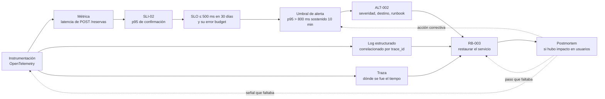

# Operations Guide — `DOC-OPERACION`

## 1. Resumen ejecutivo

La guía de operación describe cómo se mantiene sano un sistema en producción durante los años en que presta servicio: qué se mira, con qué umbrales, qué se hace periódicamente, cómo crece la capacidad y qué se hace cuando el sistema entero deja de existir.

Se distingue del resto de la familia por su horizonte. La instalación ocurre una vez y el despliegue cincuenta veces al año; la operación es continua, y su documentación describe un régimen antes que un procedimiento. Por eso admite prosa donde el runbook no la admite: se lee en calma, para entender, no para ejecutar bajo presión.

Contiene la definición de qué significa **sano** para este sistema en particular, y esa definición es la pieza de mayor valor de todo el documento. Sin un umbral escrito, cada persona de guardia decide por su cuenta si 400 ms de latencia son un problema, y esa decisión se toma distinto a las diez de la mañana que a las cuatro de la madrugada.

Este documento incluye además, como sección propia, el tratamiento de **Disaster Recovery** —continuidad, RTO/RPO, respaldo, restauración y pruebas de recuperación—, que en el catálogo de esta guía no tiene documento independiente porque su contenido es inseparable de las tareas periódicas y de la gestión de capacidad que lo rodean.

---

## 2. Definición

### Qué es

El documento de referencia de quien mantiene el sistema en funcionamiento. Reúne cinco cuerpos de contenido: la **observabilidad** —qué señales emite el sistema y qué significan—, los **umbrales y alertas** —cuándo una señal deja de ser normal y quién se entera—, las **tareas periódicas** —lo que hay que hacer aunque nada falle—, la **gestión de capacidad** —cómo se anticipa el crecimiento en lugar de padecerlo— y la **continuidad** —qué se hace cuando lo anterior no alcanzó.

Su unidad de contenido no es el paso sino el **indicador**: cada señal se documenta con su definición, su fuente, su valor normal, su umbral, la alerta que dispara y el runbook al que apunta.

### Qué problema resuelve

Convierte la operación en una actividad con criterio en lugar de una reacción. Un equipo sin este documento opera por síntoma: espera a que alguien se queje, mira lo que se le ocurre mirar, y aprende el sistema incidente a incidente. Un equipo con él sabe qué mira y por qué, detecta la degradación antes de que sea caída, y —lo más difícil de conseguir— puede rotar la guardia sin que la capacidad de operar dependa de quién esté esa semana.

Resuelve también la pregunta que ninguna otra documentación contesta: **cuánta fiabilidad es suficiente**. Un SLO explícito convierte una discusión de opiniones en una comparación contra un compromiso.

### Qué NO es

**No es un runbook.** Ésta es la confusión más costosa de la familia y merece la distinción precisa. El Operations Guide describe el régimen normal y se navega por índice; el [Runbook](Runbook.md) describe el régimen degradado y se encuentra por el nombre de una alerta. El primero explica qué significa la métrica `pool_conexiones_activas` y por qué su umbral es 80 %; el segundo dice qué hacer, paso por paso, cuando ese umbral se supera. La relación entre ambos es de referencia cruzada: **toda alerta definida en el Operations Guide apunta a un runbook, y toda alerta sin runbook está incompleta.**

La segunda diferencia es de tolerancia a la prosa. Acá un párrafo de contexto es bienvenido, porque el lector está aprendiendo el sistema. En el runbook, un párrafo entre dos pasos es tiempo de indisponibilidad.

**No es la guía de administración.** El corte es de capa y de audiencia. La operación mantiene la **plataforma**: procesos, recursos, respaldos, certificados. La administración configura el **sistema para sus usuarios**: altas, roles, catálogo de salas, horarios. Regla utilizable: si el procedimiento se ejecuta desde la interfaz del propio sistema, es [administración](Administrator-Guide.md); si se ejecuta contra la infraestructura que lo sostiene, es operación.

**No es la guía de despliegue.** Publicar una versión es una operación planificada con documento propio. Este documento empieza cuando la versión ya está en ejecución.

**No es la configuración de las herramientas de monitoreo.** Los tableros y las reglas de alerta viven como código en su propio repositorio. La guía documenta el **criterio**: por qué ese umbral, qué se decidió no alertar y por qué, qué acción se espera de quien recibe la notificación.

---

## 3. Aplicación por escenario

| Escenario | ¿Aplica? | Naturaleza | Qué se produce |
|-----------|----------|-----------|----------------|
| `ESC-1` Desarrollo nuevo | Sí, y conviene anticiparla | Prescriptiva | SLIs, SLOs y umbrales definidos antes del primer despliegue: condicionan el diseño |
| `ESC-2` Migración | Sí, duplicada y comparativa | Doble | Operación de ambos sistemas, más la línea base del origen como criterio de paridad operativa |
| `ESC-3` Evaluación con código | Sí, reconstructiva | Descriptiva | Se reconstruye desde instrumentación, reglas de alerta, tareas programadas y configuración de respaldos |
| `ESC-4` Evaluación externa | **No aplica** | — | No se opera un sistema al que solo se accede como usuario |

### `ESC-1` — Desarrollo de software nuevo

Es el único documento de la familia que conviene empezar **antes** de que exista el sistema, y por una razón que no es de disciplina sino de diseño: definir los SLIs obliga a decidir qué significa que el sistema funcione, y esa definición condiciona la arquitectura. Un SLO de disponibilidad del 99,9 % mensual —43 minutos de indisponibilidad tolerada— es compatible con un despliegue de tipo recreate y con una única instancia; uno del 99,99 % —4 minutos— no lo es, y esa incompatibilidad hay que descubrirla en el SAD y no en el primer trimestre de operación.

La instrumentación se decide en la misma etapa. Un sistema que no emite trazas correlacionadas no se instrumenta después sin tocar cada punto de entrada, y **OpenTelemetry** —que en .NET se integra con `System.Diagnostics.Activity` y `Meter`— es la referencia que hace portable esa decisión entre herramientas.

En `CTX-1` los SLIs giran alrededor de la experiencia percibida: tiempo hasta interactividad y, con Blazor Server, tasa de reconexión y de pérdida de circuito. En `CTX-2` giran alrededor del contrato: disponibilidad y latencia por endpoint, antigüedad de la cola, tasa de mensajes en la cola de descarte. En `CTX-3` hay que resolver un problema que los otros no tienen: correlacionar la señal del cliente con la del servidor bajo un mismo identificador de traza, de modo que una queja de usuario pueda seguirse hasta la consulta SQL que la causó.

### `ESC-2` — Migración a otro lenguaje o plataforma

La operación se documenta dos veces y aparece una pieza que no existe en los otros escenarios: la **línea base operativa del sistema origen**. Antes de migrar hay que medir cómo se comporta lo que existe —latencias reales, patrón de carga por hora, consumo, frecuencia de incidentes— porque ése es el criterio contra el cual se juzgará el destino. Sin esa medición, cualquier degradación posterior se discute con memorias en lugar de con datos, y la memoria colectiva siempre recuerda que el sistema viejo andaba bien.

Durante la coexistencia hay que operar dos sistemas con un solo equipo, lo cual duplica la superficie de guardia en el peor momento. La guía debe decir explícitamente qué alertas del sistema origen se silencian durante el corte y cuáles no, porque un origen que sigue alertando sobre tráfico que ya se fue produce ruido, y el ruido durante un corte cuesta atención.

### `ESC-3` — Evaluación de software existente con acceso al código

La operación se reconstruye desde cinco fuentes de evidencia, y el orden importa porque cada una condiciona la lectura de la siguiente.

La **instrumentación en el código** —llamadas a `ILogger`, creación de `Activity`, registro de `Meter` y contadores— dice qué se decidió observar. Su ausencia es un hallazgo tan fuerte como su presencia: un sistema con logs solo en los bloques `catch` se opera a ciegas y sus incidentes se diagnostican por eliminación.

Las **reglas de alerta** —en Prometheus, Azure Monitor, Grafana— dicen qué se consideró digno de despertar a alguien, y sobre todo con qué umbral. Un umbral con un valor redondo y sin comentario suele ser una conjetura inicial que nadie revisó; uno con un valor extraño como `0,73` suele venir de un incidente real, y vale la pena buscar cuál.

Las **tareas programadas** —cron, Hangfire, Azure Functions con disparador temporal, SQL Server Agent— dicen qué se hace periódicamente. Es donde suelen aparecer los procesos que nadie recuerda haber creado.

La **configuración de respaldos** —planes de mantenimiento, políticas de retención, reglas de ciclo de vida del almacenamiento— dice cuál es el RPO real, que casi nunca coincide con el declarado. La pregunta que sigue es la que decide el hallazgo: **cuándo fue la última restauración probada**. Si no hay registro de ninguna, el sistema tiene respaldos y no tiene recuperación, y eso se escribe con esas palabras.

Los **postmortems anteriores**, cuando existen, son la fuente más densa: cuentan cómo se rompe realmente el sistema. Su ausencia en un producto de varios años tampoco es neutra: o los incidentes no se analizan, o el análisis vive en un canal de chat.

### `ESC-4` — Evaluación de un producto solo desde afuera

**No aplica.** Operar significa disponer de acceso a la infraestructura, a la telemetría y a los controles del sistema; en `ESC-4` no hay ninguno de los tres. No existe artefacto que producir, y pretender lo contrario produciría un documento de inferencias sobre umbrales que nadie puede verificar.

Lo que sí puede observarse pertenece a otro análisis y se registra con confianza explícita. Una página de estado pública revela qué componentes el proveedor considera separables y cuál es su historial de disponibilidad; un SLA publicado revela el compromiso contractual, que no es lo mismo que el comportamiento real; los postmortems públicos, cuando el proveedor los publica, son la ventana más honesta que existe a su ingeniería y a su cultura de incidentes. Nada de eso es una guía de operación: es evidencia sobre la operación ajena.

---

## 4. Observabilidad

### 4.1 Las tres señales

**OpenTelemetry** organiza la instrumentación en tres señales que responden preguntas distintas y que no se sustituyen entre sí.

Las **métricas** son agregados numéricos en el tiempo y contestan *cuánto* y *desde cuándo*: cuántas peticiones por segundo, qué latencia en el percentil 95, cuántas conexiones activas hay en el pool. Son baratas de almacenar y son la base de las alertas, porque permiten comparar contra un umbral.

Los **logs** son eventos discretos con contexto y contestan *qué pasó exactamente* en una ejecución concreta. Son caros en volumen y su valor depende por completo de que estén estructurados: un log de texto libre no se consulta, se lee, y a las tres de la mañana nadie lee cuatro millones de líneas.

Las **trazas** siguen una operación a través de los componentes que atraviesa y contestan *dónde se fue el tiempo*. Son la señal que más se omite y la que más rápido resuelve el tipo de incidente más frecuente en sistemas distribuidos, que es la degradación sin errores: todo responde `200`, todo tarda el triple, y sin traza hay que adivinar cuál de los siete saltos es el culpable.

La propiedad que las vuelve utilizables en conjunto es la **correlación**: el mismo `trace_id` presente en la traza, en los logs de cada componente y como ejemplar adjunto a la métrica. Con correlación, un pico en el tablero se convierte en dos clics en la petición concreta que lo produjo. Sin ella, se convierte en una búsqueda por marca de tiempo.

### 4.2 Del SLI al umbral

Un **SLI** (*service level indicator*) es una medida de la calidad del servicio desde la perspectiva del usuario. Un **SLO** (*service level objective*) es el valor objetivo de ese indicador durante una ventana de tiempo. El **error budget** es lo que resta: si el objetivo es 99,9 % mensual, el presupuesto es 43 minutos de incumplimiento, y su función es convertir la fiabilidad en un recurso administrable en lugar de una aspiración. El vocabulario y la práctica provienen del **Google SRE Book**.

La consecuencia operativa del presupuesto de error es la que suele resistirse: un presupuesto sobrante indica que se está siendo demasiado conservador y que se puede desplegar más rápido; un presupuesto agotado indica que hay que frenar los cambios y estabilizar. Es una regla de decisión, no una métrica de tablero.

Para el sistema de reservas de salas, con `CTX-3`, Blazor Server y ASP.NET Core:

| ID | SLI | Definición operativa | SLO | Ventana |
|----|-----|---------------------|-----|---------|
| `SLI-01` | Disponibilidad de la aplicación | Peticiones no-5xx / peticiones totales | ≥ 99,5 % | 30 días |
| `SLI-02` | Latencia de confirmación de reserva | p95 de `POST /reservas` | ≤ 500 ms | 30 días |
| `SLI-03` | Estabilidad del circuito Blazor | Circuitos que terminan sin desconexión no solicitada / total | ≥ 99 % | 7 días |
| `SLI-04` | Frescura de la disponibilidad de salas | Retraso entre la confirmación y su visibilidad en la grilla | ≤ 2 s en p99 | 7 días |
| `SLI-05` | Éxito del respaldo | Respaldos completos verificados / programados | 100 % | 30 días |

`SLI-03` es específico de `CTX-1` con Blazor Server y no tiene equivalente en una aplicación web tradicional: el circuito es un recurso con estado en el servidor y su pérdida es una degradación real de la experiencia aunque el servidor esté disponible según `SLI-01`. Un sistema puede cumplir el 99,9 % de disponibilidad HTTP mientras corta circuitos permanentemente, y los usuarios reportarán que «se cae todo el tiempo». La discrepancia entre lo que la métrica dice y lo que el usuario percibe se resuelve agregando el indicador que faltaba, no explicándole al usuario que técnicamente está disponible.

### 4.3 Umbrales y alertas

Una alerta se define por cinco datos, y si falta cualquiera de ellos la alerta está incompleta: qué condición la dispara, con qué duración sostenida, qué severidad tiene, a quién notifica y **qué runbook resuelve**.

| ID | Condición | Duración | Severidad | Destino | Runbook |
|----|-----------|----------|-----------|---------|---------|
| `ALT-001` | Tasa de 5xx > 2 % | 5 min | Crítica | Guardia, con llamada | [`RB-001`](Runbook.md) |
| `ALT-002` | p95 de `POST /reservas` > 800 ms | 10 min | Alta | Guardia, sin llamada | [`RB-003`](Runbook.md) |
| `ALT-012` | Conexiones activas del pool > 80 % del máximo | 3 min | Alta | Guardia, sin llamada | [`RB-012`](Runbook.md) |
| `ALT-013` | Tasa de reconexión de circuitos > 5 % | 10 min | Media | Canal del equipo | [`RB-012`](Runbook.md) |
| `ALT-020` | Espacio libre en el volumen de datos < 15 % | 30 min | Alta | Guardia | [`RB-020`](Runbook.md) |
| `ALT-021` | Último respaldo completo con más de 26 h | inmediata | Crítica | Guardia, con llamada | [`RB-021`](Runbook.md) |
| `ALT-030` | Certificado TLS con menos de 14 días | diaria | Media | Canal del equipo | [`RB-030`](Runbook.md) |

Dos criterios gobiernan esta tabla y ambos se incumplen con frecuencia.

El primero: **se alerta sobre síntomas, no sobre causas**. Un uso de CPU del 90 % no es un problema si nadie lo percibe; una latencia de 3 segundos lo es aunque la CPU esté al 20 %. Alertar sobre causas produce notificaciones que no requieren acción, y las notificaciones que no requieren acción entrenan al equipo a ignorarlas. `ALT-012` es una excepción deliberada y conviene decir por qué: la saturación del pool es un precursor confiable de una degradación que, cuando se manifiesta como síntoma, ya afecta a todos los usuarios a la vez. Las excepciones a la regla se justifican en el documento; no se acumulan en silencio.

El segundo: **toda alerta con llamada telefónica implica una acción humana inmediata y posible**. Si quien recibe la llamada no puede hacer nada distinto de lo que el sistema ya intenta solo, la alerta no debía despertar a nadie. La medida de salud de un sistema de alertas es la proporción de notificaciones que terminaron en una acción; por debajo de la mitad, el equipo ya dejó de leerlas aunque nadie lo haya dicho.



El umbral de la alerta es más laxo que el objetivo del indicador, y esa holgura es deliberada: el SLO se incumple con lentitud a lo largo de la ventana mientras que la alerta debe despertar a alguien solo cuando la degradación ya es visible. Las tres flechas punteadas son el único mecanismo por el cual esta cadena mejora; un [Postmortem](Postmortem.md) que no termina modificando alguno de esos tres puntos dejó el sistema exactamente como estaba.

### 4.4 Qué se registra en los logs

En `CTX-3` con .NET, la disciplina se reduce a tres reglas. Logs **estructurados** con `ILogger` y plantillas con marcadores nombrados —`_logger.LogWarning("Conflicto de reserva para sala {SalaId} en {Intervalo}", salaId, intervalo)`— para que el campo sea consultable y no parte de una cadena. **Sin datos personales ni secretos**: nombres de usuarios, direcciones de correo y tokens no van al log, y esa restricción se verifica en revisión de código porque una vez emitidos son muy difíciles de retirar. Y **niveles con significado acordado**: `Error` es algo que requiere intervención humana, `Warning` es algo anómalo que el sistema resolvió por su cuenta, `Information` es el rastro del comportamiento normal. Cuando `Error` se usa para todo lo que no salió bien, deja de ser señal.

---

## 5. Tareas periódicas

Lo que hay que hacer aunque nada falle. Se documentan con frecuencia, dueño, duración estimada y criterio de éxito; las que están automatizadas se marcan como tales, con el detalle de qué se verifica manualmente de todos modos.

| Tarea | Frecuencia | Automatizada | Verificación |
|-------|-----------|--------------|--------------|
| Verificar éxito de respaldos | Diaria | Sí (`ALT-021`) | Tablero de respaldos sin entradas rojas en 7 días |
| Restauración de prueba en entorno aislado | Mensual | Parcial | Base restaurada, conteo de filas coherente, aplicación arranca contra ella |
| Revisión del presupuesto de error | Mensual | No | Consumo por SLI registrado y decisión sobre el ritmo de cambios |
| Depuración de datos según retención | Semanal | Sí | Reservas anteriores a 24 meses archivadas; conteo registrado |
| Reindexación y actualización de estadísticas | Semanal | Sí | Fragmentación de los índices principales por debajo del 30 % |
| Rotación de secretos de aplicación | Trimestral | No | Secretos con antigüedad menor a 90 días |
| Renovación de certificados TLS | Automática, verificada mensualmente | Sí (`ALT-030`) | Vencimiento a más de 30 días |
| Revisión de accesos privilegiados | Trimestral | No | Cada cuenta con privilegios tiene dueño identificado y activo |
| Simulacro de recuperación ante desastre | Semestral | No | Ver [sección 8](#8-disaster-recovery-y-continuidad) |
| Revisión de alertas: ruido y huecos | Trimestral | No | Proporción de alertas accionadas; alertas sin runbook: cero |

La última fila es la que mantiene vivo el resto del documento. Un sistema de alertas nunca está terminado: acumula reglas que dejaron de tener sentido y le faltan las que el último incidente reveló. Sin una revisión periódica, se degrada hacia dos extremos igualmente inútiles, el que notifica todo y el que no notifica nada.

---

## 6. Gestión de capacidad

Consiste en saber, para cada recurso limitado, cuál es el límite, a qué distancia se está de él y en cuánto tiempo se alcanzará al ritmo actual. El propósito es que el crecimiento sea una decisión planificada y no un incidente.

| Recurso | Límite actual | Uso típico | Señal de agotamiento | Horizonte estimado |
|---------|--------------|-----------|---------------------|-------------------|
| Pool de conexiones SQL | 100 por instancia | 25-40 en hora pico | `pool_conexiones_activas` > 80 % | Sensible al patrón de uso, no al volumen |
| Almacenamiento de datos | 200 GB | 68 GB, +2,1 GB/mes | Espacio libre < 15 % | ~60 meses |
| Circuitos Blazor concurrentes | ~1200 por instancia (memoria) | 180 en hora pico | Memoria del proceso > 75 % | Depende de altas de usuarios |
| Memoria por instancia | 4 GB | 2,2 GB | Reinicios por presión de memoria | — |
| Peticiones por segundo | ~450 por instancia | 60 en hora pico | Latencia p95 creciente | ~24 meses al ritmo actual |

La fila del pool merece comentario porque es la que rompe la intuición sobre capacidad. Su agotamiento no llega por crecimiento de usuarios sino por un cambio en el patrón de uso: una consulta que empieza a tardar 2 segundos en lugar de 50 ms multiplica por cuarenta el tiempo que cada petición retiene su conexión, y el pool se satura con el mismo tráfico de siempre. Por eso su horizonte no se proyecta linealmente y por eso la alerta es sobre porcentaje de ocupación y no sobre tendencia. El incidente correspondiente está desarrollado en el [Runbook](Runbook.md).

La proyección se revisa trimestralmente contra el consumo real. Una proyección hecha una vez y nunca contrastada da la sensación de estar gestionando la capacidad sin gestionarla, que es peor que no tener proyección: la falsa tranquilidad impide mirar.

---

## 7. Operación específica de Blazor Server (`CTX-1`)

Tres particularidades del render mode *interactive server* que la operación tiene que conocer y que no aparecen en un sistema web tradicional.

El **circuito es estado en el servidor**. Cada usuario conectado consume memoria en la instancia que lo atiende, de modo que la capacidad se mide en circuitos concurrentes y no solo en peticiones por segundo. Reiniciar una instancia mata sus circuitos: el usuario ve el cartel de reconexión y, según la implementación, pierde lo que estaba haciendo. Toda operación que implique reiniciar —despliegue, escalado hacia abajo, reciclado por memoria— es visible para los usuarios conectados, y esa visibilidad se planifica.

La **afinidad de sesión es obligatoria** cuando hay más de una instancia. El circuito vive en una máquina concreta y la conexión WebSocket debe volver siempre a ella. Un balanceador mal configurado produce el síntoma más confuso del inventario: la aplicación funciona para algunos usuarios y no para otros, de forma aparentemente aleatoria, sin errores en el servidor.

La **reconexión tiene ventana**. Cuando el circuito se pierde, el cliente reintenta durante un período configurable y el servidor conserva el estado durante `CircuitOptions.DisconnectedCircuitRetentionPeriod`. Pasado ese lapso, el estado se descarta y la reconexión falla definitivamente. Ese parámetro es una decisión operativa con consecuencia directa sobre el consumo de memoria —conservar circuitos huérfanos cuesta— y su valor debe estar documentado con su razón, no heredado del ejemplo de la plantilla.

---

## 8. Disaster Recovery y continuidad

Las secciones anteriores tratan un sistema que funciona con problemas. Ésta trata el caso en que el sistema deja de existir: la base de datos corrupta, el centro de datos inaccesible, el borrado accidental irrecuperable, el ataque de cifrado.

El catálogo de esta guía agrupa el tratamiento acá en lugar de darle documento propio porque su contenido es inseparable de lo anterior: los respaldos son una tarea periódica, su verificación es un SLI, el espacio que consumen es capacidad, y el procedimiento de restauración es un runbook. Separarlo produciría un documento que solo se abre cuando ya es tarde. **ISO 22301** es la norma de referencia para el sistema de gestión de la continuidad del negocio, y **NIST SP 800-34** aporta la tipología de planes de contingencia y la práctica de ejercitarlos con regularidad.

### 8.1 RTO y RPO

Dos parámetros ordenan todas las decisiones de continuidad y ambos son decisiones de negocio con consecuencias técnicas, no al revés.

El **RTO** (*recovery time objective*) es el tiempo máximo tolerable entre la interrupción y la restauración del servicio. El **RPO** (*recovery point objective*) es la cantidad máxima tolerable de datos perdidos, expresada en tiempo: un RPO de una hora significa que es aceptable perder el trabajo de la última hora.

La confusión frecuente consiste en tratarlos como objetivos técnicos que el equipo elige. Los fija el dueño del negocio, porque expresan cuánto está dispuesto a perder, y cada reducción tiene un costo que hay que poner sobre la mesa antes de comprometerlos. Un RPO de 15 minutos requiere respaldos de log frecuentes; un RPO de cero requiere replicación síncrona, con su penalización de latencia en cada escritura y su costo de infraestructura duplicado.

Para el sistema de reservas, con su criticidad real —un sistema interno cuyo fallo genera molestia y reuniones sin sala, no pérdida financiera directa:

| Escenario de desastre | RTO comprometido | RPO comprometido | Estrategia |
|----------------------|------------------|------------------|-----------|
| Corrupción lógica de datos | 4 h | 15 min | Restauración completa + logs de transacciones |
| Pérdida de la instancia de aplicación | 15 min | 0 | Redespliegue desde el registro de imágenes |
| Pérdida del servidor de base de datos | 2 h | 15 min | Restauración en instancia nueva |
| Pérdida de la región completa | 24 h | 24 h | Respaldo replicado en región secundaria |
| Cifrado por ransomware | 8 h | 24 h | Restauración desde copia inmutable, aislada |

La última fila exige un tratamiento distinto y suele faltar en los planes que solo contemplan fallos de infraestructura. Un ataque de cifrado alcanza también a los respaldos accesibles desde la red comprometida, de modo que la única copia útil es la que no se puede modificar desde el entorno productivo: almacenamiento inmutable con retención bloqueada, o copia fuera de línea. Un plan de continuidad cuyos respaldos comparten credenciales con producción protege contra el fallo del disco y no contra el atacante.

### 8.2 Estrategia de respaldo

Se documenta por objeto protegido, no en general. Lo que no está en la tabla no está respaldado, y esa afirmación tiene que poder hacerse con confianza.

| Objeto | Método | Frecuencia | Retención | Destino | Verificación |
|--------|--------|-----------|-----------|---------|--------------|
| `ReservasDb` — completo | Backup nativo SQL Server, comprimido | Diario, 02:00 | 35 días | Almacenamiento en región primaria + copia inmutable | `RESTORE VERIFYONLY` automático |
| `ReservasDb` — diferencial | Backup diferencial | Cada 6 h | 7 días | Ídem | `RESTORE VERIFYONLY` |
| `ReservasDb` — log de transacciones | Backup de log | Cada 15 min | 7 días | Ídem | Continuidad de la cadena de LSN |
| Adjuntos y documentos | Replicación de objetos con versionado | Continua | 90 días | Cuenta de almacenamiento secundaria | Recuento y suma de verificación semanal |
| Secretos y certificados | Exportación cifrada del almacén | Ante cada cambio | Últimas 5 versiones | Almacén secundario, acceso separado | Restauración de prueba trimestral |
| Configuración de infraestructura | Repositorio de IaC | Cada commit | Historial completo | Repositorio remoto | Reprovisionamiento en simulacro |
| Imágenes de aplicación | Registro de contenedores con retención | Cada release | 20 versiones | Registro replicado | Redespliegue en simulacro |

Las tres últimas filas son las que distinguen un plan completo de uno que solo cubre datos. Una base restaurada sin la aplicación que la consume, sin los secretos para conectarse y sin la infraestructura donde correr no es un servicio recuperado: es un archivo. El RTO se mide sobre el servicio funcionando, no sobre la base montada.

La cadena de respaldo determina el RPO real. Con log cada 15 minutos, el peor caso de pérdida es de 15 minutos —siempre que la cadena esté íntegra. Un solo respaldo de log fallido rompe la cadena y el RPO se degrada al último respaldo completo o diferencial disponible, silenciosamente. De ahí que la verificación de continuidad de LSN esté en la tabla y no sea opcional.

### 8.3 Restauración

El procedimiento de restauración vive en el [Runbook](Runbook.md) `RB-021`, porque se ejecuta bajo presión y necesita ese formato. Acá se documenta lo que el runbook supone: qué se restaura, en qué orden, y qué decisiones tiene que tomar quien lo ejecuta.

El **orden de restauración** para una pérdida total del servicio: infraestructura desde IaC, almacén de secretos, base de datos —completo, luego diferencial, luego cadena de logs hasta el punto elegido—, aplicación desde el registro de imágenes, y verificación funcional de extremo a extremo antes de reabrir el acceso a los usuarios. Reabrir antes de verificar convierte una recuperación en dos incidentes.

La **decisión de punto de recuperación** es la única que no puede automatizarse y la que más demora las restauraciones reales. Ante una corrupción lógica hay que determinar el instante anterior al daño, y ese instante rara vez es obvio: si una migración defectuosa empezó a corromper datos a las 14:10 y se detectó a las 17:30, restaurar a las 14:09 pierde tres horas y media de trabajo legítimo, mientras que restaurar a las 17:29 preserva la corrupción. La guía debe declarar quién tiene autoridad para tomar esa decisión —es del dueño del negocio, no del operador— y qué información necesita para tomarla.

### 8.4 Pruebas de recuperación

Un plan de recuperación no probado es una hipótesis redactada con confianza. Las razones por las que fallan las restauraciones reales son casi siempre mundanas y todas se descubren ensayando: el respaldo estaba cifrado con una clave que también se perdió; la instancia de destino tiene una versión menor del motor y no acepta el fichero; nadie tiene permisos sobre la cuenta de almacenamiento secundaria; el procedimiento supone una herramienta instalada en una máquina que ya no existe; la restauración funciona pero tarda seis horas contra un RTO comprometido de dos.

Ese último punto justifica por sí solo el ejercicio: **el RTO no se cumple si no se cronometró**. Un objetivo de recuperación sin una medición que lo respalde es un número que alguien escribió.

Tres niveles de prueba, con frecuencia distinta:

La **restauración de prueba**, mensual, verifica un objeto: se restaura `ReservasDb` en un entorno aislado, se comprueba que la aplicación arranca contra ella y que los conteos son coherentes. Es barata, automatizable y detecta la mayoría de los fallos silenciosos de la cadena de respaldo.

El **simulacro de escritorio**, trimestral, no toca sistemas: el equipo recorre el procedimiento sobre un escenario planteado y detecta huecos de responsabilidad, contactos desactualizados y pasos que suponen a alguien disponible. Cuesta dos horas y encuentra los problemas de coordinación, que son los que más alargan las recuperaciones reales.

El **simulacro completo**, semestral, ejecuta la recuperación de extremo a extremo en un entorno secundario y se cronometra. Es el único que valida el RTO. Su resultado se registra con la misma estructura que un postmortem —qué se tardó, qué falló, qué acciones correctivas quedaron abiertas con dueño y fecha— y su hallazgo más frecuente es que el tiempo real duplica al estimado.

| Prueba | Frecuencia | Qué valida | Registro |
|--------|-----------|-----------|----------|
| Restauración de un objeto | Mensual | Integridad del respaldo y de la cadena | Automático, con alerta ante fallo |
| Simulacro de escritorio | Trimestral | Roles, contactos, decisiones, huecos | Acta con acciones correctivas |
| Recuperación completa cronometrada | Semestral | RTO y RPO reales | Informe con estructura de postmortem |

---

## 9. Preguntas guía

- ¿Qué significa exactamente que este sistema está sano, y quién lo firmó?
- ¿Cada alerta apunta a un runbook? ¿Cada runbook es alcanzable desde la notificación que lo necesita?
- De las notificaciones del último mes, ¿qué proporción terminó en una acción humana? ¿Cuáles se podrían haber resuelto solas?
- ¿Un incidente de degradación sin errores se puede diagnosticar con la telemetría actual, o hay que adivinar?
- ¿Cuál es el recurso que se agota primero, y en cuánto tiempo al ritmo actual?
- ¿Cuándo fue la última restauración probada? ¿Y la última cronometrada?
- ¿El RTO comprometido se midió alguna vez, o se estimó?
- ¿Los respaldos son accesibles con las mismas credenciales que producción? ¿Qué pasa si esas credenciales se comprometen?
- ¿Quién decide el punto de recuperación ante una corrupción lógica, y qué necesita saber para decidirlo?
- En `CTX-1` con Blazor Server: ¿está documentado qué le pasa a un usuario conectado cuando se recicla una instancia?

---

## 10. Criterios de calidad y antipatrones

### Criterios de calidad

Un buen Operations Guide permite que **alguien que se incorporó hace un mes tome la guardia** con este documento y los runbooks a los que apunta. Es la prueba que resume todas las demás, y es verificable: se hace, y lo que la persona tenga que preguntar es el hueco.

Los criterios específicos: SLIs definidos desde la perspectiva del usuario y no de la infraestructura; SLOs con dueño de negocio identificable; cada alerta con condición, duración, severidad, destino y runbook; el criterio de cada umbral explicado, no solo su valor; tareas periódicas con dueño y criterio de éxito; capacidad con horizonte proyectado y revisión trimestral; RTO y RPO comprometidos y **medidos**; y una fecha de última prueba de recuperación visible sin buscarla.

La coherencia con la realidad es verificable de forma directa: las reglas de alerta del documento deben corresponder una a una con las reglas configuradas en la herramienta. Cualquier divergencia significa que uno de los dos está desactualizado, y la experiencia dice que es el documento.

### Antipatrones

**Alertas sin runbook.** Producen la peor combinación posible: alguien despierto a las tres de la mañana, con información de que algo está mal y sin instrucción sobre qué hacer.

**Alertar sobre causas.** CPU, memoria y disco alertan sobre el estado de la máquina, no sobre la experiencia del usuario. Producen notificaciones sin acción, y las notificaciones sin acción entrenan a ignorar el canal entero.

**Umbral sin criterio.** «Latencia mayor a 500 ms.» ¿Por qué 500? Sin la razón escrita, nadie se atreve a cambiarlo cuando el sistema evoluciona, y el umbral sobrevive a las condiciones que lo justificaban.

**El documento que describe la herramienta.** Capturas de pantalla del tablero y explicaciones de cómo se usa Grafana. Envejece con cada actualización de la herramienta y no dice nada sobre el sistema.

**SLO sin dueño.** Un objetivo de disponibilidad que el equipo técnico se fijó a sí mismo no sirve para negociar nada: cuando llega el momento de decidir entre estabilizar y entregar funcionalidad, no hay contra qué contrastar.

**Respaldos sin restauración probada.** El antipatrón más extendido y el más caro. Se descubre en el peor día posible que el respaldo no era restaurable, o que restaurarlo tarda cuatro veces lo comprometido.

**Respaldos con las credenciales de producción.** Protegen contra el fallo del hardware y no contra el atacante ni contra el borrado accidental con privilegios.

**RTO aspiracional.** Un número acordado en una reunión, nunca medido. La primera medición ocurre durante el desastre real y produce una conversación desagradable.

**Plan de continuidad que solo cubre datos.** Base restaurada, aplicación sin desplegar, secretos inaccesibles, infraestructura inexistente. El servicio sigue caído mientras el informe declara la recuperación completa.

**Fundir operación y administración.** Produce un manual donde el administrador funcional del cliente lee sobre contenedores y el operador lee sobre políticas de cancelación. Ninguno de los dos encuentra lo suyo.

---

## 11. Anexo — Plantilla comentada

```markdown
---
doc_id: OPS-<sistema>
doc_type: operativa
title: Guía de operación — <sistema>
status: vigente
origin: human
owner: <ACT-06 responsable>
last_review: AAAA-MM-DD
dr_test_last_run: AAAA-MM-DD      # última recuperación completa cronometrada
dr_test_rto_measured: <HH:MM>     # tiempo real medido, no el comprometido
audience: [humano, agente]
---

# Guía de operación — <sistema>

## 1. El sistema en operación
<!-- Qué componentes hay en ejecución, dónde, y de qué depende cada uno.
     Diagrama Mermaid de topología operativa: no repite el SAD, muestra lo
     que hay que poder señalar durante un incidente. -->

## 2. Definición de "sano"
<!-- SLIs con definición operativa (la fórmula exacta, no la idea), SLO,
     ventana y dueño de negocio. Error budget y qué decisión dispara su
     agotamiento. Sin esta sección el resto del documento no tiene criterio. -->

## 3. Observabilidad
### 3.1 Métricas — nombre, unidad, fuente, valor normal
### 3.2 Logs — dónde están, cuánto se retienen, cómo se consultan, qué NO se registra
### 3.3 Trazas — qué operaciones están instrumentadas, cómo se correlacionan
<!-- Documentar el criterio, no la herramienta. La configuración vive como
     código en su repositorio; acá va el porqué. -->

## 4. Alertas
<!-- Tabla: ID | condición | duración | severidad | destino | runbook.
     Ninguna fila sin runbook. Cada umbral con su razón. Registrar además
     qué se decidió NO alertar y por qué: evita rediscutirlo cada semestre. -->

## 5. Tareas periódicas
<!-- Tabla: tarea | frecuencia | dueño | automatizada | criterio de éxito.
     Incluir la revisión de las propias alertas. -->

## 6. Capacidad
<!-- Por recurso limitado: límite, uso actual, tendencia, señal de
     agotamiento, horizonte. Fecha de la última revisión de la proyección. -->

## 7. Particularidades de la plataforma
<!-- Lo que no es evidente y sorprende a quien opera por primera vez.
     En Blazor Server: circuitos, afinidad de sesión, ventana de reconexión. -->

## 8. Disaster Recovery
### 8.1 Escenarios contemplados, con RTO y RPO por escenario
<!-- Comprometidos por el dueño del negocio, con su nombre y la fecha del
     compromiso. Incluir el escenario de cifrado malicioso, que exige copia
     inmutable y no solo copia remota. -->
### 8.2 Estrategia de respaldo
<!-- Tabla por objeto protegido. Incluir secretos, infraestructura e imágenes,
     no solo datos: sin ellos hay archivo, no servicio. -->
### 8.3 Orden de restauración y decisiones humanas
<!-- El procedimiento ejecutable va al runbook; acá el orden, los supuestos
     y quién decide el punto de recuperación. -->
### 8.4 Calendario y resultados de pruebas
<!-- Fecha | tipo de prueba | RTO medido | hallazgos | acciones abiertas.
     Si esta tabla está vacía, el plan es una hipótesis. -->

## 9. Contactos y escalamiento
<!-- Rotación de guardia, niveles, y a partir de qué criterio se escala.
     Incluir proveedores externos con su número de contrato y su SLA. -->

## 10. Historial de cambios del documento
```

Los dos campos de recuperación en el frontmatter —`dr_test_last_run` y `dr_test_rto_measured`— cumplen la misma función que el historial de verificación de la guía de instalación: exponen el grado de vigencia del documento sin obligar a leerlo entero. Un RTO medido que supera al comprometido es un hallazgo que debe ser visible desde la primera pantalla, no una nota al pie de la sección 8.
