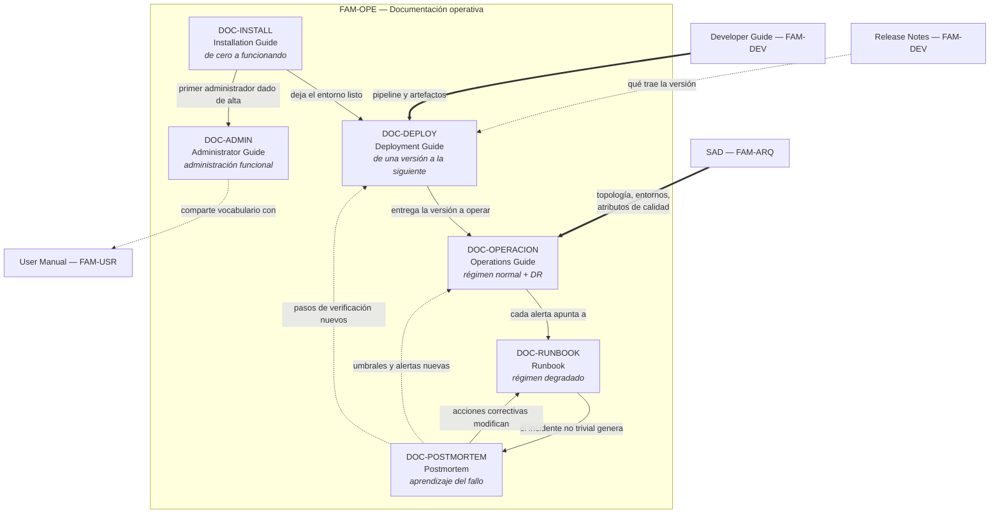

# Documentación operativa — `FAM-OPE`

## Resumen ejecutivo

Seis artefactos responden juntos a la pregunta **«¿cómo se instala, mantiene y opera?»**. Empiezan donde termina el desarrollo: el software existe, compila, pasa las pruebas, y ahora alguien tiene que ponerlo a funcionar en una máquina que no es la suya, mantenerlo vivo durante años y arreglarlo cuando se rompe a las tres de la mañana.

Esta familia tiene una propiedad que ninguna otra comparte: **se lee bajo presión y por alguien que no la escribió**. Un SAD se lee con café; un runbook se lee con el teléfono sonando. Esa condición de uso determina todo lo demás —el estilo imperativo, los pasos numerados, el resultado esperado por paso, la vuelta atrás explícita— y explica por qué la documentación operativa desactualizada es peor que su ausencia: quien no encuentra un runbook improvisa con cuidado; quien encuentra uno viejo ejecuta con confianza pasos que ya no corresponden.

El actor dueño es `ACT-06` DevOps / SRE, según la [matriz de responsabilidad](../00-Marco-de-Referencia/Actores.md#matriz-de-responsabilidad-por-familia-documental). El arquitecto es consultado —la topología que documenta la operación es la que él decidió— y tiene poder de veto sobre lo inoperable en sentido inverso: si un componente no se puede desplegar por partes ni observar, esa objeción vuelve al ADR.

---

## La pregunta que responde la familia

«¿Cómo se instala, mantiene y opera?» se descompone en seis preguntas que suelen confundirse entre sí, y esa confusión es el problema de arranque de la familia:

| Documento | ID | Pregunta específica | Momento de uso | Quién lo lee |
|-----------|----|--------------------|----------------|--------------|
| [Installation Guide](Installation-Guide.md) | `DOC-INSTALL` | ¿Cómo pongo este software en una máquina desde cero? | Una vez por instalación | Quien recibe el software: cliente, integrador, desarrollador nuevo |
| [Deployment Guide](Deployment-Guide.md) | `DOC-DEPLOY` | ¿Cómo llevo una versión nueva a un entorno existente? | En cada release | Quien publica: DevOps, responsable de release |
| [Operations Guide](Operations-Guide.md) | `DOC-OPERACION` | ¿Cómo se mantiene esto sano en el día a día? | Continuo | Quien opera: guardia, SRE, mesa de operaciones |
| [Administrator Guide](Administrator-Guide.md) | `DOC-ADMIN` | ¿Cómo configuro y administro el sistema para sus usuarios? | Ante cada cambio administrativo | Administrador funcional del cliente |
| [Runbook](Runbook.md) | `DOC-RUNBOOK` | ¿Qué hago exactamente ante *este* síntoma? | Durante un incidente | Quien está de guardia, con presión |
| [Postmortem](Postmortem.md) | `DOC-POSTMORTEM` | ¿Qué pasó, por qué, y qué cambiamos para que no se repita? | Después del incidente | Todo el equipo, y a veces el cliente |

La progresión no es temporal sino de estabilidad decreciente y frecuencia creciente. La guía de instalación se ejecuta pocas veces y cambia poco; el runbook se consulta seguido y envejece rápido; el postmortem no se ejecuta nunca —se lee una vez y su valor se mide por las acciones correctivas que produjo.

---

## Las cuatro confusiones que hay que resolver primero

Cuatro de estos artefactos tienen nombres tan parecidos que en la práctica se solapan, se duplican y se contradicen. Distinguirlos no es purismo taxonómico: cada confusión produce un fallo concreto y observable.

### Installation Guide contra Deployment Guide

La instalación **crea** un entorno donde antes no había nada; el despliegue **actualiza** un entorno que ya existe. La primera se ejecuta una vez y termina con un sistema funcionando desde cero: provisionar la base, crear el esquema, cargar datos maestros, configurar certificados, dar de alta el primer administrador. El segundo se ejecuta cincuenta veces al año sobre algo que ya está corriendo y que tiene usuarios conectados, datos que preservar y una versión anterior a la que volver.

La diferencia práctica está en dos preguntas que solo el despliegue tiene que contestar: **qué pasa con lo que ya estaba** y **cómo vuelvo atrás**. Una instalación fallida se descarta y se rehace; un despliegue fallido deja un sistema en producción a mitad de camino, que es el peor estado posible.

El síntoma de confusión más frecuente: una guía de despliegue que empieza con «instale SQL Server». Si en cada release hay que instalar el motor de base de datos, algo está mal en la definición de entorno.

### Operations Guide contra Administrator Guide

La distinción es de **audiencia y de capa**, no de profundidad. El Operations Guide se dirige a quien mantiene viva la **infraestructura y la plataforma**: métricas, umbrales, logs, capacidad, respaldos, continuidad. El Administrator Guide se dirige a quien administra el **sistema para sus usuarios**: dar de alta personas, asignar roles, definir el catálogo de salas, configurar el horario laboral, ajustar la política de cancelación.

Un operador reinicia el servicio y consulta el uso de CPU; no sabe ni necesita saber qué es una sala de reuniones. Un administrador crea la sala «Belgrano — piso 3, capacidad 12»; no sabe ni necesita saber qué es el pool de conexiones. Cuando ambos roles recaen sobre la misma persona —que es lo habitual en una instalación pequeña— la tentación es fundir los documentos, y el costo aparece cuando el sistema se vende a un cliente cuyo administrador funcional es alguien de Recursos Humanos: la mitad del manual que recibe habla de contenedores.

Regla de corte utilizable: si el procedimiento se ejecuta desde la interfaz del propio sistema, es administración; si se ejecuta contra la infraestructura que lo sostiene, es operación.

### Runbook contra Operations Guide

El Operations Guide describe el **régimen normal**: cómo se supone que el sistema se comporta, qué se mira, qué se hace todos los martes. El Runbook describe el **régimen degradado**: qué hacer cuando una señal concreta se dispara.

La diferencia formal es que el runbook tiene **disparador**. Empieza con un síntoma observable —«la alerta `ALT-012` está activa», «los usuarios reportan que el circuito de Blazor se reconecta en bucle»— y no con un tema. Un documento de operación se navega por índice; un runbook se encuentra por el nombre de la alerta que lo referencia, y si una alerta no apunta a un runbook, esa alerta está incompleta.

La segunda diferencia es de tolerancia a la prosa. El Operations Guide admite explicación y contexto porque se lee en calma. El runbook no: cada párrafo explicativo entre dos pasos es tiempo de indisponibilidad. El contexto va al final, en una sección de fondo que el lector apurado se saltea sin perder nada ejecutable.

### Y la cuarta: qué NO vive en esta familia

CI/CD —la construcción del pipeline, las convenciones de rama, la estrategia de versionado y de artefactos— se trata en la sección correspondiente del [Developer Guide](../60-Desarrollo/Developer-Guide.md), no acá. Esta familia consume el resultado del pipeline; no lo diseña. La frontera es el artefacto publicado: lo que ocurre hasta producir la imagen firmada es desarrollo; lo que ocurre desde que esa imagen se promueve a un entorno es operación.

El contenido de cada versión entregada vive en [Release Notes](../60-Desarrollo/Release-Notes.md). El Deployment Guide dice *cómo* se publica una versión; las Release Notes dicen *qué* trae.

---

## Cómo se relacionan

Las flechas continuas son dependencias de ejecución: no hay despliegue sin un entorno instalado, no hay operación sin una versión desplegada. Las punteadas son realimentación, y son la parte que casi nunca se documenta: el ciclo `RUN → PM → RUN` es el que convierte a esta familia en un cuerpo vivo en lugar de un conjunto de manuales que envejecen. Un postmortem cuyas acciones correctivas no terminan modificando un runbook, un umbral o un paso de verificación del despliegue no cerró el ciclo; produjo un documento.

---

## Orden de lectura

Para estudiar la familia por primera vez conviene el orden de ejecución real: [Installation Guide](Installation-Guide.md) → [Deployment Guide](Deployment-Guide.md) → [Operations Guide](Operations-Guide.md) → [Runbook](Runbook.md) → [Postmortem](Postmortem.md), dejando el [Administrator Guide](Administrator-Guide.md) para el final porque pertenece a otra audiencia y se entiende mejor una vez que la línea operativa está clara.

Para quien entra a un equipo que ya opera un sistema en producción, el orden útil es otro: primero el Runbook —porque puede tocarle una guardia en la primera semana—, después el Operations Guide para entender qué se mira y por qué, y recién luego despliegue e instalación. Los postmortems recientes son, sin competencia, el material de incorporación más denso que existe: cuentan cómo se rompe realmente este sistema, que es lo que ningún diagrama dice.

Para producir la familia desde cero en `ESC-1`, el orden es el inverso del natural: se escriben primero los umbrales y las alertas del Operations Guide, porque son los que obligan a decidir qué significa «sano» antes de haber desplegado nada, y esa definición condiciona el diseño.

---

## Aplicación por escenario, en una línea cada uno

| Escenario | Peso de la familia | Qué cambia |
|-----------|-------------------|-----------|
| [`ESC-1`](../00-Marco-de-Referencia/Escenarios.md#esc-1--desarrollo-de-software-nuevo) Desarrollo nuevo | Creciente hacia el final | Se escribe junto con el primer despliegue real, no antes ni después; anticiparla produce ficción, postergarla produce conocimiento tácito |
| [`ESC-2`](../00-Marco-de-Referencia/Escenarios.md#esc-2--migración-a-otro-lenguaje-o-plataforma) Migración | Máximo, y duplicado | Conviven la operación del sistema origen y la del destino, más el plan de corte y su vuelta atrás, que es documentación operativa pura |
| [`ESC-3`](../00-Marco-de-Referencia/Escenarios.md#esc-3--evaluación-de-software-existente-con-acceso-al-código) Evaluación con código | Alto y revelador | Todo se reconstruye desde pipelines, scripts y configuración; el hueco entre lo documentado y lo ejecutado es el hallazgo principal |
| [`ESC-4`](../00-Marco-de-Referencia/Escenarios.md#esc-4--evaluación-de-un-producto-solo-desde-afuera) Evaluación externa | Mínimo | Deployment, Operations y Runbook **no aplican**: no se opera lo que no se controla. Installation y Administrator pueden observarse si el producto los publica; los postmortems públicos, cuando existen, son la ventana más honesta a la ingeniería del proveedor |

Cada documento desarrolla las cuatro entradas con detalle y explica por qué no aplica cuando corresponde, en lugar de omitir la fila.

Respecto de los contextos, el peso cambia de forma marcada. En [`CTX-1`](../00-Marco-de-Referencia/Contextos.md#ctx-1--web-y-cliente-interactivo) la operación gira alrededor del versionado de recursos estáticos, la invalidación de caché y —en Blazor Server— la salud del circuito y el drenaje de sesiones antes de reiniciar. En [`CTX-2`](../00-Marco-de-Referencia/Contextos.md#ctx-2--backend-y-servicios) gira alrededor de contratos, colas, reintentos y compatibilidad entre versiones de API. En [`CTX-3`](../00-Marco-de-Referencia/Contextos.md#ctx-3--fullstack) aparece el problema que los otros dos no tienen: el **orden de despliegue** entre las piezas y la ventana durante la cual conviven versiones distintas, que se desarrolla en el [Deployment Guide](Deployment-Guide.md#7-orden-de-despliegue-en-fullstack-ctx-3).

---

## Referencias de industria pertinentes a la familia

**ITIL 4** aporta la separación entre gestión de incidentes —restaurar el servicio cuanto antes—, gestión de problemas —eliminar la causa— y gestión de cambios. Esa distinción ordena la familia entera: el runbook pertenece a la gestión de incidentes y su objetivo es la restauración, no el diagnóstico completo; el postmortem pertenece a la gestión de problemas; el Deployment Guide es el procedimiento de un cambio.

El **Google SRE Book** aporta el vocabulario de SLI, SLO y *error budget*, y la práctica del postmortem sin culpa. Su contribución más operativa a esta familia es el criterio de que la fiabilidad es un objetivo negociado y no un máximo absoluto: sin un SLO explícito, no hay forma de decidir si un incidente ameritaba despertar a alguien.

**ISO/IEC 20000** es la norma certificable de gestión de servicios de TI y define requisitos para la gestión del servicio que enmarcan lo que acá se documenta a nivel de procedimiento.

**ISO 22301** especifica los requisitos de un sistema de gestión de la continuidad del negocio, y es la referencia de la sección de Disaster Recovery del [Operations Guide](Operations-Guide.md#8-disaster-recovery-y-continuidad). **NIST SP 800-34** —*Contingency Planning Guide for Federal Information Systems*— aporta la tipología de planes de contingencia y la práctica de ejercitarlos periódicamente.

**OpenTelemetry** es el estándar de instrumentación para métricas, logs y trazas, y define la semántica común que hace que la observabilidad documentada sea portable entre herramientas.

**The Twelve-Factor App** aporta principios que esta familia da por sentados: configuración en el entorno y no en el artefacto, paridad entre entornos, procesos sin estado, logs como flujo de eventos. Varios antipatrones documentados en la familia son violaciones directas de alguno de ellos.

**ISO/IEC/IEEE 26511** —gestión de la documentación de usuario— e **ISO/IEC/IEEE 26514** —diseño y desarrollo de información de usuario— aplican al [Administrator Guide](Administrator-Guide.md), que es documentación de usuario en sentido normativo aunque su usuario tenga privilegios.

---

## Índice de la familia

- [`DOC-INSTALL` — Installation Guide](Installation-Guide.md)
- [`DOC-DEPLOY` — Deployment Guide](Deployment-Guide.md)
- [`DOC-OPERACION` — Operations Guide](Operations-Guide.md) — incluye Disaster Recovery
- [`DOC-ADMIN` — Administrator Guide](Administrator-Guide.md)
- [`DOC-RUNBOOK` — Runbook](Runbook.md)
- [`DOC-POSTMORTEM` — Postmortem / Incident Report](Postmortem.md)

### Marco de referencia

- [Escenarios](../00-Marco-de-Referencia/Escenarios.md) — `ESC-1` a `ESC-4`
- [Contextos](../00-Marco-de-Referencia/Contextos.md) — `CTX-1` a `CTX-3`
- [Actores](../00-Marco-de-Referencia/Actores.md) — `ACT-01` a `ACT-10`
- [Convenciones](../00-Marco-de-Referencia/Convenciones.md) — frontmatter, IDs, estilo

### Familias vecinas

- [`FAM-ARQ` — Arquitectura](../30-Arquitectura/SAD.md): fija la topología, los entornos y los atributos de calidad que la operación tiene que sostener
- [`FAM-DEV` — Desarrollo](../60-Desarrollo/Developer-Guide.md): dueño del pipeline de CI/CD y de las [Release Notes](../60-Desarrollo/Release-Notes.md)
- [`FAM-USR` — Usuarios](../70-Usuarios/): el Administrator Guide comparte vocabulario y convenciones con el User Manual

---

## Criterio de suficiencia de la familia

Un sistema interno de veinte usuarios no necesita seis documentos: necesita las seis respuestas, y la mayoría caben en tres archivos. La consolidación razonable es fundir instalación y despliegue cuando el entorno se reprovisiona entero en cada release —caso habitual con contenedores efímeros— y mantener separados el Operations Guide y los runbooks, porque se leen en momentos distintos y con distinto grado de urgencia.

La prueba práctica es una sola y no admite matices: **tome a alguien que no participó del desarrollo, entréguele la documentación y pídale que ponga el sistema en funcionamiento en un entorno limpio, sin ayuda**. Lo que tenga que preguntar es el hueco. Repita el ejercicio con un despliegue y con la alerta más frecuente del último trimestre. Tres ejercicios de media jornada dicen más sobre la calidad de esta familia que cualquier revisión de escritorio.
