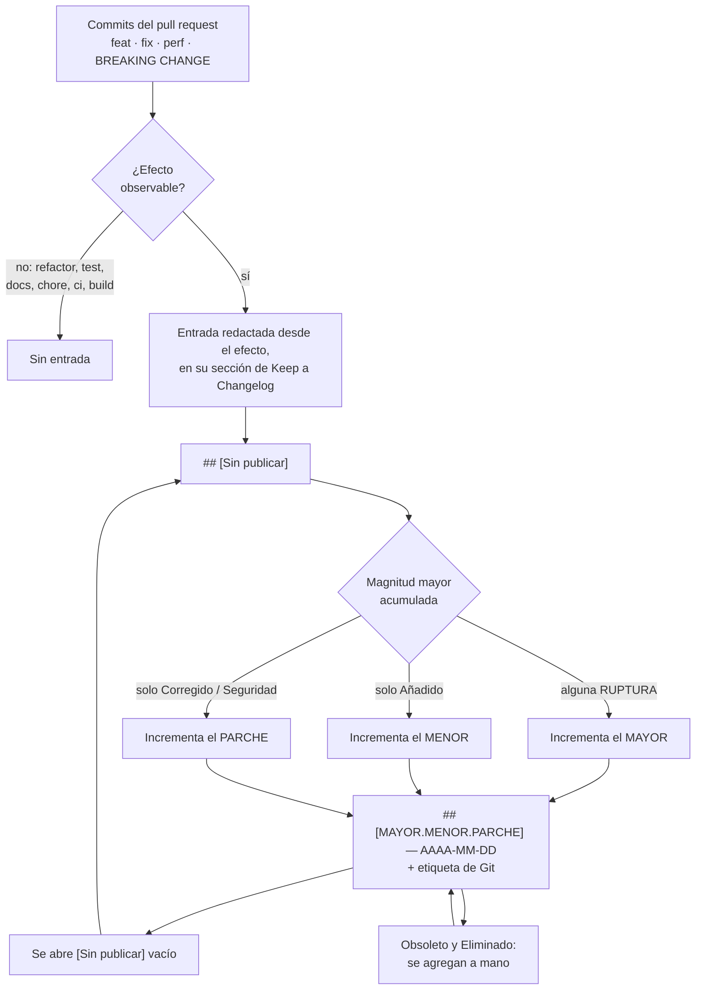

# Change Log — `DOC-CHANGELOG`

## 1. Resumen ejecutivo

Un servicio empieza a rechazar solicitudes que ayer aceptaba. La pregunta operativa es siempre la misma: qué cambió, y cuándo. Responderla leyendo seiscientos commits toma una tarde; responderla leyendo un registro de cambios ordenado por versión toma tres minutos. Esa diferencia es la razón de existir del documento.

El Change Log es el registro exhaustivo y cronológico de todo cambio con efecto observable, agrupado por versión. Vive en `CHANGELOG.md` en la raíz del repositorio, lo escribe `ACT-04` en el mismo pull request que introduce el cambio, y lo consumen quien depura una regresión, quien decide si actualizar una dependencia y quien redacta las [Release Notes](Release-Notes.md).

Su virtud es la exhaustividad y su tono es neutro. No persuade, no selecciona y no interpreta: registra. Todo lo que suena a comunicación pertenece al otro documento, y esa frontera es la que se cruza más seguido en esta familia.

---

## 2. Definición

### Qué es

Archivo versionado junto al código que enumera, por versión y en orden cronológico inverso, los cambios con efecto observable. La referencia de formato es **Keep a Changelog 1.1.0**, que fija seis categorías —`Añadido`, `Cambiado`, `Obsoleto`, `Eliminado`, `Corregido`, `Seguridad`— y una convención de encabezados por versión con fecha. La numeración sigue **Semantic Versioning 2.0.0**.

Su tesis fundacional se resume en una frase: los registros de cambios son para personas, no para máquinas. Un volcado del historial de Git no es un Change Log, porque el historial registra unidades de trabajo del desarrollador y el registro debe enumerar cambios perceptibles por quien usa el software.

### Qué problema resuelve

Responde tres preguntas caras. **¿En qué versión entró este cambio?** —imprescindible para correlacionar una regresión con un despliegue—. **¿Qué pasa si actualizo de 1.3 a 1.6?** —la pregunta de todo consumidor de una biblioteca, que sin registro se responde probando—. **¿Qué cambió entre lo que probé y lo que se publicó?**

Resuelve además un problema de disciplina que se nota recién a los seis meses. Escribir la entrada del registro en el pull request obliga al autor a formular el cambio en términos de efecto observable, y esa formulación expone dos cosas: los cambios que en realidad rompen compatibilidad sin que nadie lo hubiera notado, y los cambios que no producen ningún efecto y por lo tanto no había por qué anunciar.

### Qué NO es, y con qué se lo confunde

**No es el registro de commits.** El historial de Git es exhaustivo respecto del trabajo; el Change Log es exhaustivo respecto de los efectos. Cinco commits que construyen una funcionalidad producen una entrada; un commit que arregla un error de tipeo en un comentario no produce ninguna. La generación automática desde Conventional Commits ayuda, pero el resultado exige edición: sin ella, el registro se llena de entradas que no significan nada para quien lo lee.

**No son las Release Notes.** La confusión central de la familia, tratada en detalle en el [documento de Release Notes](Release-Notes.md) con su tabla comparativa; conviene fijar acá el lado del registro. El Change Log **no omite nada** con efecto observable, incluida la actualización de dependencias y el cambio de versión mínima de plataforma, que a nadie le interesan hasta el día que rompen algo. **No traduce a beneficio**: dice que `POST /reservas` responde `409` en lugar de `400`, no que ahora la experiencia es mejor. **No se ordena por audiencia** sino por versión y por tipo. Y **no se escribe al publicar** sino de forma continua.

La consecuencia práctica: si al escribir una entrada aparece la tentación de explicar por qué el cambio es bueno, ese contenido pertenece a las notas de versión. El registro responde qué cambió; las notas, qué significa.

**No es un registro de auditoría.** No documenta quién hizo qué ni por qué se aprobó. Esa información vive en el historial de Git, en los pull requests y en los ADR.

**No es documentación de migración.** El registro señala la ruptura; el procedimiento para adaptarse vive en una guía de migración enlazada. Un Change Log con instrucciones paso a paso deja de ser consultable de un vistazo.

---

## 3. Aplicación por escenario

| Escenario | Rol del registro | Quién lo mantiene | Particularidad |
|-----------|-----------------|-------------------|----------------|
| `ESC-1` | Registro continuo desde el primer commit | `ACT-04` en cada pull request | Empieza antes de que exista una versión publicada |
| `ESC-2` | Doble: cierre del origen y registro del destino | `ACT-04` con `ACT-03` | Distinguir cambios de migración de cambios funcionales |
| `ESC-3` | Se reconstruye del historial y de las etiquetas | `ACT-10` con `ACT-04` | Marcar lo reconstruido como tal |
| `ESC-4` | No accesible; se observa su equivalente público | — | Lo público es una nota de versión, no un registro |

### `ESC-1` — Desarrollo nuevo

El registro arranca con el primer cambio, mucho antes de la primera versión publicada, bajo un encabezado `[Sin publicar]` que acumula las entradas hasta que se etiqueta. Cuando llega la versión, el encabezado se renombra con el número y la fecha, y se abre uno nuevo vacío. Esta mecánica es lo que hace que el registro esté siempre listo y que preparar una versión no sea un trabajo de arqueología.



El ciclo se cierra sobre `[Sin publicar]`, y esa es la propiedad que hace que preparar una versión no requiera reconstruir nada: el número de versión ya está determinado por lo acumulado en el momento del corte. Las dos entradas que el ciclo no puede derivar de los commits ingresan por el costado, porque anunciar un retiro es una decisión que ningún cambio individual expresa.

La diferencia entre `CTX-1`, `CTX-2` y `CTX-3` es de peso, no de forma: el registro se escribe casi igual en los tres. La única variación relevante aparece en `CTX-2`, donde el registro es contrato de facto para quien integra, y por eso la marca de ruptura tiene consecuencias que en una interfaz de usuario no tiene: alguien decide actualizar o no leyendo esa línea.

### `ESC-2` — Migración

El registro se lleva por partida doble y con una distinción que hay que sostener: qué entrada corresponde a la migración —cambio de plataforma sin cambio de comportamiento— y cuál corresponde a un cambio funcional deliberado. Sin la distinción, al investigar una regresión post-corte nadie puede separar lo que cambió porque cambió la tecnología de lo que cambió porque alguien lo decidió.

Una convención simple lo resuelve: un ámbito reservado en el commit —`feat(migracion): …`— y una sección propia en el registro de la versión de corte, que enumera las diferencias declaradas como deseadas en el criterio de paridad del [Test Plan](Test-Plan.md). Esa sección es la que un usuario consultará cuando note que algo se comporta distinto.

El sistema origen recibe su última entrada: la versión final, congelada, con la fecha de fin de soporte.

### `ESC-3` — Evaluación con acceso al código

Se reconstruye del historial cuando no existe, y el resultado tiene un valor doble: sirve como documento y sirve como diagnóstico. Se parte de las etiquetas de Git, que dan las versiones y sus fechas; se agrupan los commits entre etiquetas; se clasifican por tipo, con ayuda de Conventional Commits si el equipo los usaba; y se redacta cada entrada en términos de efecto, descartando lo que no lo tuvo.

El diagnóstico surge de lo que el trabajo revela. Si los mensajes de commit no permiten reconstruir qué cambió, ese es el hallazgo principal y afecta a la mantenibilidad mucho más allá del registro. Si no hay etiquetas, no hay versiones identificables y por lo tanto no hay forma de correlacionar un incidente con un despliegue. Si el intervalo entre etiquetas es de nueve meses, el ritmo de entrega es un riesgo en sí mismo.

Todo lo reconstruido se marca como tal en el encabezado del archivo, con su método y su fecha: un registro reconstruido tiene menor confianza que uno escrito en el momento, y presentarlo sin esa advertencia le da una autoridad que no tiene.

### `ESC-4` — Evaluación externa

No hay acceso al registro interno. Lo que un producto publica bajo el nombre «changelog» es casi siempre una nota de versión —selectiva, redactada para persuadir— y su análisis, junto con lo que revela sobre ritmo, inversión y áreas frágiles, se trata en el [documento de Release Notes](Release-Notes.md). La fila se conserva porque la distinción importa: confundir un registro con un anuncio lleva a suponer exhaustividad donde hay selección, y a concluir de una ausencia lo que la ausencia no prueba.

---

## 4. Ejemplos concretos

### 4.1 Formato Keep a Changelog aplicado

```markdown
# Registro de cambios

Todos los cambios notables de este proyecto se documentan en este archivo.
El formato sigue [Keep a Changelog 1.1.0](https://keepachangelog.com/es/1.1.0/)
y el versionado sigue [Semantic Versioning 2.0.0](https://semver.org/lang/es/).

## [Sin publicar]

### Añadido
- Reserva recurrente semanal con hasta 12 ocurrencias (`RF-016`).

### Corregido
- La búsqueda de disponibilidad ignoraba los feriados provinciales (#1204).

## [1.4.0] — 2026-08-03

### Añadido
- El conflicto de reserva devuelve las tres alternativas de horario más
  cercanas en el cuerpo de la respuesta 409, ordenadas por proximidad
  al intervalo solicitado (`RF-014`).
- Endpoint `GET /salas/{id}/disponibilidad` con parámetros `desde` y `hasta`.

### Cambiado
- **RUPTURA** `POST /reservas` responde `409 Conflict` en lugar de
  `400 Bad Request` cuando la sala está ocupada. El cuerpo pasa a ser
  `ProblemDetails` con `type = "/errores/sala-ocupada"` e incluye
  `reservaEnConflicto` y `alternativas[]` (`RN-007`).
  El comportamiento anterior se mantiene disponible enviando la cabecera
  `X-Compat-Conflicto: 400` hasta el 2026-09-30.
- La versión mínima soportada de .NET pasa de 8.0 a 9.0.

### Obsoleto
- Cabecera `X-Compat-Conflicto`: se retira el 2026-09-30 junto con la
  respuesta `400` para conflictos de sala.
- `GET /salas/disponibles`: reemplazado por
  `GET /salas/{id}/disponibilidad`. Se retira en 2.0.0.

### Corregido
- El editor de reservas conservaba el formulario vacío tras un rechazo;
  ahora preserva asistentes, motivo y fecha (#1182).
- Las reservas que cruzaban el cambio de horario de verano se persistían
  con una hora de desfase (#1191).

### Seguridad
- Se corrige una comprobación de autorización que permitía a un usuario
  cancelar reservas de otra sede si conocía el identificador (CVE-2026-XXXXX).
  Afecta a 1.2.0–1.3.1. Actualización recomendada de inmediato.

## [1.3.1] — 2026-07-14

### Corregido
- Falla intermitente al confirmar reservas con más de 15 asistentes (#1170).
```

Cinco decisiones de este ejemplo merecen justificarse.

La marca **RUPTURA** va en la entrada y no solo en el número de versión, porque quien evalúa actualizar escanea el texto y no compara números. La entrada de ruptura incluye además la vía de compatibilidad y su fecha de retiro, que es la información que permite planificar en lugar de reaccionar.

La sección **Obsoleto** existe separada de **Eliminado** por un motivo operativo: anuncia con antelación lo que va a desaparecer. Un elemento que aparece directamente en `Eliminado` sin haber pasado nunca por `Obsoleto` rompió a alguien sin aviso.

La entrada de **Seguridad** declara el rango de versiones afectadas. Sin ese dato, cada consumidor tiene que averiguar si le corresponde, y la mayoría no lo hace.

El cambio de versión mínima de plataforma aparece aunque no sea funcionalidad. Es exactamente la clase de entrada que las notas de versión omiten y que el registro no puede omitir, porque es lo que rompe una compilación ajena.

Cada entrada relevante enlaza a su requisito o a su ticket. Es lo que permite navegar del síntoma al contexto sin salir del archivo.

### 4.2 Cómo se escribe una entrada

La entrada se redacta desde el efecto observable, en pasado o presente, sin narrar la implementación.

| En lugar de | Escribir | Por qué |
|-------------|----------|---------|
| «Refactorizado `ReservaService`» | Nada: sin efecto observable, no va | El registro enumera efectos, no trabajo |
| «Se agregó el campo `Recurrencia` a la entidad» | «Reserva recurrente semanal con hasta 12 ocurrencias» | El lector no ve entidades |
| «Se arregló un bug en la validación» | «Se rechazan reservas de duración cero, que antes se aceptaban» | «Un bug» no permite saber si me afectaba |
| «Mejoras de rendimiento» | «La búsqueda de disponibilidad pasa de ~1,2 s a ~180 ms con 500 salas» | Sin número, la afirmación no es verificable |
| «Cambios en la API» | «**RUPTURA** `POST /reservas` responde 409 en lugar de 400 ante conflicto» | Quien integra necesita el detalle exacto |

La cuarta fila señala un criterio que conviene sostener: una afirmación de rendimiento sin cifra y sin condiciones de medición no es información. Si no se midió, la entrada correcta describe el cambio sin prometer una mejora.

### 4.3 Generación desde Conventional Commits

El [Developer Guide](Developer-Guide.md) fija **Conventional Commits 1.0.0** como formato de mensaje, y el registro se genera agrupando los commits desde la última etiqueta.

| Tipo de commit | Sección de Keep a Changelog | Efecto en la versión |
|----------------|----------------------------|---------------------|
| `feat` | Añadido | Incrementa el menor |
| `fix` | Corregido | Incrementa el parche |
| `perf` | Cambiado | Incrementa el parche |
| `refactor`, `test`, `docs`, `chore`, `ci`, `build` | No aparece | Ninguno |
| Cualquiera con `!` o `BREAKING CHANGE:` | Cambiado, marcado **RUPTURA** | Incrementa el mayor |
| Etiquetado como corrección de seguridad | Seguridad | Según el caso |

La generación resuelve el ordenamiento, la clasificación y el cálculo de la versión. **No resuelve la redacción**, y esa es la parte que decide si el archivo sirve. Un registro generado y publicado sin editar contiene entradas escritas para el equipo, no para quien lee: `fix(reservas): corregir cálculo de solapamiento` es un buen mensaje de commit y una mala entrada de registro. La edición al preparar la versión toma quince minutos y es la diferencia entre un archivo que se consulta y uno que se ignora.

Las secciones `Obsoleto` y `Eliminado` casi nunca se derivan bien de los commits, porque anunciar una obsolescencia es una decisión de producto que rara vez coincide con un commit individual. Se agregan a mano.

### 4.4 El mismo cambio, ambos formatos

El contraste entre la entrada del registro de `1.4.0` reproducida más arriba y la nota de versión correspondiente está desarrollado en el [documento de Release Notes](Release-Notes.md), sección 4.1, y conviene leerlo desde ambos lados. Visto desde acá, lo que llama la atención es lo que las notas descartaron: el cambio de versión mínima de .NET, el endpoint nuevo de disponibilidad, la corrección del horario de verano y las dos obsolescencias no aparecen en ningún lado de la comunicación al usuario final. Todo eso está acá, y estar acá es lo que permite que alguien, dentro de ocho meses, encuentre por qué su integración dejó de compilar.

### 4.5 Versionado semántico desde el lado del registro

El registro es donde el número de versión se decide, porque es la única lista completa de lo que entró. La mecánica: se lee el conjunto de entradas desde la última etiqueta, y el cambio de mayor magnitud determina el incremento. Una sola ruptura eleva el mayor aunque todo lo demás sean correcciones; sin rupturas, una sola entrada en `Añadido` eleva el menor; solo con `Corregido` y `Seguridad`, se eleva el parche.

Tres reglas de **Semantic Versioning 2.0.0** que el registro hace cumplir en la práctica. Una versión publicada es inmutable: si se descubre un defecto en `1.4.0`, se publica `1.4.1`, y la sección de `1.4.0` del registro no se reescribe —se corrige con una entrada nueva, porque alguien puede estar corriendo esa versión exacta—. La rama `0.y.z` no promete estabilidad, y usarla mientras el contrato se mueve es más honesto que publicar `1.0.0` y romper compatibilidad en la versión siguiente. Y la definición de «API pública» tiene que estar escrita: sin ella, nadie puede juzgar si un cambio es ruptura. En este proyecto, la API pública es el contrato HTTP documentado en la [especificación de API](../40-Diseno/API-Specification.md) más el esquema de los eventos publicados; el esquema de base de datos y las firmas internas no lo son.

La sección `Obsoleto` es el mecanismo que permite evolucionar sin agotar el número mayor. Un elemento se marca obsoleto en una versión menor, con fecha de retiro, y se elimina en la mayor siguiente. Esa secuencia da a los consumidores un período para adaptarse, y es la diferencia entre un producto con el que se puede integrar y uno con el que no.

---

## 5. Preguntas guía

- ¿Esta entrada describe un efecto que alguien puede percibir, o el trabajo que hice?
- Si un consumidor lee solo esta entrada, ¿sabe si le afecta?
- ¿Este cambio rompe a alguien? Si la respuesta es «no lo sé», es ruptura hasta demostrar lo contrario.
- ¿Qué es exactamente la API pública de este proyecto, y está escrito en alguna parte?
- ¿Lo que se eliminó pasó antes por `Obsoleto` con fecha de retiro?
- ¿El registro se escribe en el pull request o se reconstruye el día de publicar?
- Si hoy hubiera una regresión, ¿el registro alcanzaría para acotar en qué versión entró?
- En `ESC-3`: ¿está marcado qué parte del registro se reconstruyó y con qué método?

---

## 6. Criterios de calidad y antipatrones

### Criterios de calidad

**Es exhaustivo respecto de los efectos observables.** Todo lo que alguien puede notar está, incluidas las actualizaciones de plataforma y dependencias que no interesan hasta que rompen algo.

**Cada entrada se entiende sin abrir el código.** Escrita para quien usa o integra, no para quien la escribió.

**Las rupturas se marcan en el texto.** No basta con el número de versión; quien evalúa actualizar escanea el archivo.

**Toda eliminación tuvo su período de obsolescencia.** Anunciada, con fecha, en una versión anterior.

**Se escribe con el cambio, no al publicar.** La entrada nace en el pull request. Reconstruirla a fin de mes produce omisiones y redacción apurada.

**Cada versión tiene fecha.** Sin fecha, el registro no permite correlacionar con incidentes, que es la mitad de su utilidad.

**Las entradas de seguridad declaran el alcance.** Versiones afectadas, severidad y urgencia de actualización.

**Enlaza al requisito o al ticket.** Un identificador `RF-` o un número de incidencia convierte la entrada en el punto de partida de una investigación.

### Antipatrones

**El volcado del historial de Git.** Publicar la salida de `git log` con formato. Todas las líneas son ciertas y ninguna está escrita para el lector; se ignora en la segunda consulta.

**El registro escrito al publicar.** Reconstruir de memoria dos semanas de cambios el día de la versión. Se omite lo que no se recuerda, que suele ser lo que se hizo con apuro, que suele ser lo que rompe.

**«Correcciones varias».** La entrada que ocupa espacio sin informar. Impide a un consumidor decidir si actualizar.

**La ruptura sin marcar.** Un cambio de contrato descrito en tono neutro entre dos entradas menores. Se descubre en producción del lado de quien integra.

**La eliminación sin obsolescencia previa.** Un elemento que aparece en `Eliminado` sin haber pasado por `Obsoleto`. Rompe a todos los consumidores a la vez y sin aviso.

**El registro con tono de comunicación.** Entradas que explican el beneficio o usan superlativos. Ese contenido pertenece a las notas de versión, y acá degrada la propiedad que hace útil al registro, que es la neutralidad.

**El archivo sin fechas.** Versiones enumeradas sin cuándo se publicaron. La correlación con incidentes se vuelve imposible.

**La generación automática publicada sin editar.** Sesenta entradas, veintiocho de ellas actualizaciones de dependencias sin agrupar, redactadas en el lenguaje interno del equipo.

**El registro reconstruido presentado como original.** En `ESC-3`, omitir que el archivo se infirió del historial le da una autoridad que no tiene: las entradas reconstruidas se apoyan en mensajes de commit que pueden ser incompletos o falsos.

---

## 7. Anexo — Plantilla comentada

```markdown
# Registro de cambios

<!-- Encabezado fijo: declara el formato y el esquema de versionado.
     Enlazar a Keep a Changelog 1.1.0 y a Semantic Versioning 2.0.0. -->

Todos los cambios notables de este proyecto se documentan en este archivo.
El formato sigue Keep a Changelog 1.1.0 y el versionado, Semantic Versioning 2.0.0.

<!-- Declarar qué es la API pública de este proyecto. Sin esta definición,
     nadie puede juzgar si un cambio constituye ruptura. -->
API pública de este proyecto: <contrato HTTP documentado en … + esquema de
eventos publicados>. NO forman parte: el esquema de base de datos ni las
firmas internas.

<!-- En ESC-3, si el registro se reconstruyó, declararlo acá con método y
     fecha: "Las versiones anteriores a X se reconstruyeron del historial
     de Git el AAAA-MM-DD; su exhaustividad no está garantizada." -->

## [Sin publicar]
<!-- Acumula entradas hasta etiquetar. Al publicar se renombra con número
     y fecha, y se abre una nueva sección vacía. -->

## [MAYOR.MENOR.PARCHE] — AAAA-MM-DD
<!-- Orden cronológico inverso: lo más reciente arriba.
     Las seis secciones se incluyen solo si tienen contenido. -->

### Añadido
<!-- Funcionalidad nueva. Redactar desde el efecto observable, con
     referencia al RF- que la motiva. -->

### Cambiado
<!-- Comportamiento que cambió sin ser nuevo. Marcar **RUPTURA** en el
     texto cuando corresponda, e indicar la vía de compatibilidad y su
     fecha de retiro si existe. -->

### Obsoleto
<!-- Lo que se va a retirar: qué, en qué versión y en qué fecha.
     Toda eliminación futura pasa primero por acá. -->

### Eliminado
<!-- Lo que ya no está. Debe haber figurado antes en Obsoleto. -->

### Corregido
<!-- Qué fallaba y qué se comporta distinto ahora. "Se arregló un bug"
     no permite al lector saber si le afectaba. Referencia al ticket. -->

### Seguridad
<!-- Vulnerabilidad corregida, versiones afectadas, severidad e
     identificador público si lo hay. Sin el rango afectado, cada
     consumidor tiene que averiguar si le corresponde. -->

<!-- Enlaces de comparación entre versiones al pie, si el alojamiento
     los soporta: facilitan ver el diff exacto entre dos etiquetas. -->
```
