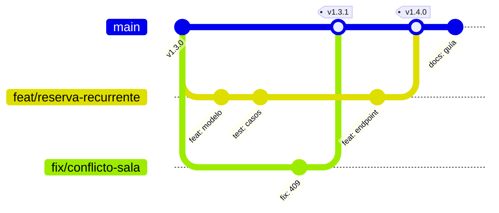

# Developer Guide — `DOC-DEVGUIDE`

## 1. Resumen ejecutivo

Un desarrollador se incorpora un lunes a la mañana. A la una del mediodía debería tener el sistema corriendo en su máquina, haber ejecutado la batería de pruebas, entendido dónde vive cada cosa y sabido qué rama crear para su primer cambio. El Developer Guide es el documento que hace posible ese lunes sin que nadie del equipo pierda el día explicándolo.

Su contenido es el acuerdo de trabajo del equipo sobre el código: cómo se prepara el entorno, cómo está organizada la solución, con qué convenciones se escribe, por qué ramas viaja un cambio, qué lo revisa, y qué hace el pipeline entre el `git push` y el artefacto publicado. Lo consumen `ACT-04` a diario y `ACT-03` cuando necesita comprobar que la estructura real corresponde a la decidida. En `ESC-3` se invierte: deja de ser un acuerdo a respetar y se vuelve un hallazgo a reconstruir, porque las convenciones verdaderas de un repositorio están en el código y en el historial, no en el documento que alguien escribió en el primer mes.

Este documento incorpora como secciones internas cuatro temas que suelen circular sueltos —Coding Standards, Git Workflow, Convenciones y CI/CD— por la razón expuesta en el [índice de la familia](README.md): son cuatro vistas del mismo acuerdo, y separarlas produce documentos que se contradicen.

---

## 2. Definición

### Qué es

Documento operativo dirigido a quien escribe código sobre el proyecto. Describe el entorno de desarrollo, la organización física del código, las reglas que gobiernan su escritura y el circuito por el que un cambio llega a producción. Su unidad de medida no es la completitud sino el tiempo que ahorra: cada sección justifica su existencia por las preguntas que evita.

### Qué problema resuelve

El conocimiento operativo de un equipo es tácito por defecto. Vive en la cabeza de las tres personas que llevan más tiempo, se transmite por interrupción y se pierde con la rotación. El costo no se ve porque está repartido: media hora acá, una consulta allá, un pull request devuelto porque el autor no sabía que el proyecto usa inyección por constructor y nunca por propiedad. El Developer Guide convierte ese conocimiento en algo consultable, y con ello vuelve auditable una decisión que antes era costumbre.

Resuelve además un problema de consistencia. Sin convenciones escritas, un repositorio con seis años acumula seis estilos, y el costo de leer código ajeno crece hasta que reescribir parece más barato que entender.

### Qué NO es, y con qué se lo confunde

**No es el README del repositorio.** El README es la puerta: qué es este proyecto, cómo se ejecuta en tres comandos, dónde está el resto de la documentación. Se lee en dos minutos y responde «¿es este el repositorio que busco y cómo lo arranco?». El Developer Guide se lee en una hora y responde «¿cómo trabajo acá?». La regla práctica: si el contenido deja de ser cierto cuando cambia una convención interna del equipo, va en el Developer Guide; si sigue siendo cierto para cualquiera que solo quiera compilar, va en el README. Un README que crece hasta las mil líneas está pidiendo un Developer Guide.

**No es el Onboarding.** El Onboarding es un proceso con fechas, responsables y una lista de verificación: pedir accesos, asignar mentor, presentar el equipo, agendar la sesión de dominio funcional, dar de alta en la nómina. Cubre a la persona, no al código, e incluye tareas que no son técnicas. El Developer Guide es una de sus estaciones, no su reemplazo. La distinción importa porque cuando se fusionan, el documento técnico se llena de contenido con fecha de vencimiento —nombres de personas, enlaces a herramientas de RRHH— y deja de mantenerse.

**No es documentación de arquitectura.** El [SAD](../30-Arquitectura/SAD.md) explica por qué la solución está partida en esos proyectos y no en otros; el Developer Guide dice cuáles son y dónde poner cada archivo nuevo. Cuando el Developer Guide empieza a justificar decisiones estructurales, está escribiendo un ADR en el lugar equivocado.

**No es el Deployment Guide.** El pipeline descrito acá termina en el artefacto publicado. Todo lo posterior —entornos, ventanas de despliegue, aprobaciones, vuelta atrás, verificación post-despliegue— vive en el [Deployment Guide](../50-Operativa/Deployment-Guide.md).

---

## 3. Aplicación por escenario

| Escenario | Naturaleza del documento | Quién lo produce | Entrada principal | Criterio de terminación |
|-----------|--------------------------|------------------|-------------------|------------------------|
| `ESC-1` | Prescriptiva: fija acuerdos antes de que haya código que los contradiga | `ACT-04` con aprobación de `ACT-03` | SAD, decisiones de plataforma | Un desarrollador ajeno levanta el entorno en menos de una hora |
| `ESC-2` | Doble: convenciones del destino, más el registro de qué no se arrastra del origen | `ACT-04` y `ACT-03` | Convenciones observadas del origen, SAD del destino | Están escritas las reglas de traducción entre convención vieja y nueva |
| `ESC-3` | Descriptiva y reconstructiva: se infiere del código y del historial | `ACT-04` con `ACT-10` | Repositorio, historial, configuración de CI | Cada convención afirmada tiene evidencia y frecuencia medida |
| `ESC-4` | No aplica en su forma habitual | — | — | — |

### `ESC-1` — Desarrollo nuevo

El documento nace antes que el código y se escribe en dos tiempos. En el primero se fijan las decisiones que son caras de revertir una vez que hay volumen: estructura de la solución, estrategia de ramas, formato de commits, convenciones de nomenclatura, herramienta de análisis estático. En el segundo, que dura toda la vida del proyecto, se incorpora lo que se descubre por fricción, siempre a partir de un caso real.

El error característico es escribir en la semana uno un documento de sesenta páginas con convenciones para situaciones que el proyecto todavía no tuvo. Convenciones inventadas en abstracto se ignoran, y un documento con reglas que nadie sigue enseña que el documento es opcional. La versión sana arranca corta y crece por incidente: cada regla nueva se agrega cuando una discusión se repitió por segunda vez.

En `CTX-1` la sección de convenciones se llena de reglas de componente: cómo se nombra un componente Blazor, dónde vive su código, qué va en `.razor` y qué en `.razor.cs`, cómo se manejan los estados de carga y error, qué se hace ante la caída del circuito. En `CTX-2` el peso se desplaza a convenciones de servicio: forma de los DTO, manejo de errores del contrato, idempotencia, versionado de la API. En `CTX-3` aparece la exigencia adicional de que las dos mitades compartan un solo vocabulario, y conviene una tabla de nombres canónicos que fije que lo que el SRS llama «reserva» se llama `Reserva` en el dominio, `ReservaDto` en el contrato y `Reservas` en la base, sin sinónimos intermedios.

### `ESC-2` — Migración

Aparece un contenido que ningún otro escenario tiene: las **reglas de traducción**. No basta con enunciar la convención del destino; hay que decir en qué se convierte cada patrón del origen, y qué patrones del origen quedan prohibidos en el destino aunque funcionaran.

Migrando de ASP.NET MVC a Blazor con render mode *interactive server*, el guía del destino debe fijar explícitamente que un controlador con lógica de negocio se traduce en un servicio de aplicación inyectado más un componente delgado, y no en un componente con la misma lógica adentro; que `Session` desaparece y su reemplazo es un servicio con ámbito de circuito documentado como tal; que las validaciones que vivían en `ModelState` pasan a un validador del dominio invocable desde ambos lados. Sin esas reglas escritas, cada desarrollador inventa su propia traducción y la migración produce un sistema con dos arquitecturas conviviendo.

La segunda pieza propia del escenario es el **inventario de deuda heredada aceptada**: qué convenciones viejas se mantienen deliberadamente en los módulos aún no migrados, con fecha de revisión. Sin ese registro, un desarrollador que abre un archivo del origen no sabe si lo que ve es una regla vigente o un resto que nadie tocó.

### `ESC-3` — Reconstruir las convenciones reales de un repositorio

Este es el uso menos evidente del documento y el más útil cuando se hereda un sistema. La pregunta no es «¿qué dice el documento de convenciones?» sino «¿qué convenciones sigue realmente este equipo?», y se responde midiendo. Una convención existe si se cumple con regularidad alta; lo que se cumple en el sesenta por ciento de los casos no es una convención sino una preferencia de algunos.

El método tiene tres fuentes y conviene recorrerlas en orden.

**Lo declarado.** Antes que nada, lo que la configuración impone por sí sola: `.editorconfig`, `Directory.Build.props`, `*.ruleset`, la versión del SDK en `global.json`, los analizadores referenciados, la configuración de los flujos de trabajo de CI, las reglas de protección de rama. Esto no es interpretación: es la regla que la máquina aplica hoy, y tiene precedencia sobre cualquier documento en prosa que diga otra cosa.

**Lo practicado en el código.** Se mide sobre el árbol actual. La estructura real de la solución se lee de los `.csproj` y sus referencias, no de las carpetas: dos proyectos en carpetas hermanas pueden tener una dependencia que la estructura de directorios oculta. Las convenciones de nomenclatura se miden contando: cuántas interfaces empiezan con `I`, cuántos servicios terminan en `Service`, cuántos métodos asíncronos terminan en `Async`. Los patrones de inyección se leen del registro de servicios: si todo se registra como `AddScoped` salvo tres casos, esos tres son la excepción a documentar y probablemente el próximo defecto de concurrencia. El manejo de errores se reconstruye buscando dónde se capturan excepciones y qué se hace con ellas; un `catch` vacío repetido en veinte archivos es una convención de facto, mala pero real, y ocultarla en el documento reconstruido sería falsear el hallazgo.

**Lo practicado en el historial.** El historial de Git responde lo que el código no puede. La forma real de trabajo con ramas se ve en el grafo de fusiones: ramas de vida corta que se integran en menos de dos días indican trunk-based o GitHub Flow; ramas de release y hotfix con fusiones cruzadas indican GitFlow; ramas de seis meses indican que el equipo cree tener un flujo y practica otro. La política de revisión se mide en los pull requests: cuántos tuvieron al menos un comentario sustantivo, cuánto tardaron en aprobarse, cuántos se fusionaron con la aprobación de una sola persona en menos de cinco minutos —lo que indica que la revisión es un trámite—. El formato de commits se mide sobre los últimos quinientos mensajes: si el ochenta por ciento cumple Conventional Commits, hay convención; si el treinta, hubo un intento.

Toda afirmación del documento reconstruido lleva su evidencia y su frecuencia: «el noventa y cuatro por ciento de los métodos que devuelven `Task` terminan en `Async` (n=612); las excepciones se concentran en `Legacy.Reservas`». Un enunciado sin frecuencia no distingue la regla de la coincidencia.

En `CTX-3` este trabajo se hace dos veces, y el hallazgo más frecuente es la divergencia entre mitades: frontend con una convención de nombres y backend con otra, cada una internamente consistente. Es un hallazgo válido y hay que reportarlo como tal, no promediarlo.

### `ESC-4` — Evaluación externa

No aplica en su forma habitual: no hay repositorio, no hay entorno que levantar y no hay convenciones que reconstruir. Se conserva la fila porque la ausencia informa. Lo único observable desde afuera son rastros indirectos —la estructura de las URLs, los nombres de los parámetros de un formulario, el formato de los identificadores expuestos, las cabeceras de respuesta— y de ellos se infiere, con confianza baja y marcada como hipótesis, el vocabulario que el equipo usa internamente. Si el producto publica un portal de desarrolladores o un SDK, ahí sí hay convenciones observables de primera mano, pero son las del contrato público, no las del código.

---

## 4. Ejemplos concretos

Sistema de reserva de salas. Solución .NET sobre ASP.NET Core, con interfaz Blazor *interactive server*, un módulo MVC heredado que aún no se migró y una aplicación móvil MAUI con MVVM. Pruebas con xUnit, componentes con bUnit, extremo a extremo con Playwright, integración continua en GitHub Actions.

### 4.1 Puesta en marcha del entorno

El criterio de calidad es explícito y verificable: **un desarrollador que nunca vio el proyecto debe tener el sistema corriendo y las pruebas en verde en menos de una hora**. No es una aspiración; se mide cronometrando la próxima incorporación, y cuando se incumple, el documento tiene un defecto, no la persona.

Lo que hace posible ese número es reducir los prerrequisitos manuales y convertir el resto en un solo comando. La base de datos local corre en contenedor con datos de semilla ya cargados; los secretos de desarrollo no se piden por chat sino que tienen valores por defecto inofensivos en `appsettings.Development.json`; las herramientas se instalan desde un manifiesto de herramientas locales en lugar de una lista en prosa.

```
Prerrequisitos (verificados por script)
  .NET SDK 9.0.x            → global.json fija la banda
  Docker Desktop            → SQL Server y Azure Storage locales
  Node 20 LTS               → solo para Playwright

Puesta en marcha
  1. git clone …/salas.git && cd salas
  2. ./scripts/setup.ps1        crea contenedores, aplica migraciones, siembra datos
  3. dotnet build Salas.sln     compila con analizadores en modo error
  4. dotnet test                unitarias + integración con Testcontainers (~4 min)
  5. dotnet run --project src/Salas.Web
     → https://localhost:7043  usuario demo: ana.perez@demo.local / Demo!2345

Verificación de que salió bien
  · la home lista tres salas sembradas (Roble, Cedro, Sauce)
  · GET /health devuelve 200 con las tres dependencias en "Healthy"
  · dotnet test cierra con 0 fallidos
```

El bloque de verificación es la parte que más se omite y la que evita el peor modo de falla: alguien cree que terminó, empieza a programar y descubre dos horas después que las migraciones no se aplicaron. Los tres puntos de verificación tardan treinta segundos y convierten «creo que anda» en «anda».

Los problemas conocidos se documentan con síntoma y causa, no solo con solución: el puerto 1433 ocupado por una instancia local de SQL Server, la falla de `dotnet test` en la primera corrida porque los navegadores de Playwright aún no se descargaron, el certificado de desarrollo no confiado. Tres párrafos que ahorran tres consultas cada mes.

### 4.2 Estructura de la solución

La estructura se documenta con su regla de dependencia, porque una lista de proyectos sin regla no impide que alguien agregue la referencia que rompe la arquitectura.

```
Salas.sln
├── src/
│   ├── Salas.Domain/            entidades, valores, reglas (RN-). Sin dependencias externas.
│   ├── Salas.Application/       casos de uso, puertos, DTO. Depende solo de Domain.
│   ├── Salas.Infrastructure/    EF Core, mensajería, correo. Implementa los puertos.
│   ├── Salas.Api/               ASP.NET Core: endpoints, autenticación, OpenAPI.
│   ├── Salas.Web/               Blazor interactive server.
│   ├── Salas.Web.Legacy/        módulo ASP.NET MVC en migración. Congelado salvo defectos.
│   └── Salas.Mobile/            .NET MAUI con MVVM.
└── tests/
    ├── Salas.Domain.Tests/           xUnit, sin E/S
    ├── Salas.Application.Tests/      xUnit con dobles de prueba
    ├── Salas.Integration.Tests/      xUnit + Testcontainers (SQL Server real)
    ├── Salas.Web.ComponentTests/     bUnit
    └── Salas.E2E.Tests/              Playwright
```

La regla de dependencia se enuncia en una línea y se verifica con una prueba de arquitectura, no con buena voluntad: *las dependencias apuntan hacia adentro; `Domain` no referencia a nadie; `Web`, `Api` y `Mobile` no referencian a `Infrastructure` salvo en su punto de composición*. Una prueba en `Salas.Domain.Tests` que inspecciona los ensamblados referenciados y falla si aparece uno prohibido convierte la regla en algo que el pipeline hace cumplir. El racional de esta estructura vive en el [SAD](../30-Arquitectura/SAD.md); acá solo se enuncia la regla y dónde poner cada archivo nuevo.

---

## 4.3 Coding Standards

Los estándares de código responden una sola pregunta: qué tiene que ser igual entre desarrolladores para que el código se lea como escrito por una persona. Todo lo demás es preferencia y no pertenece al documento.

### Qué se automatiza y qué se acuerda

La distinción es la decisión más importante de esta sección y la que determina si el resto se cumple.

**Se automatiza todo lo que una herramienta puede decidir sin criterio**: formato, indentación, orden de los `using`, llaves, longitud de línea, sufijos de nomenclatura, uso de `var`, expresiones redundantes. Una regla automatizable que se deja al acuerdo humano genera discusiones en la revisión de código, y esas discusiones desplazan a las que importan. Si dos personas discuten dónde va la llave de apertura, el `.editorconfig` está incompleto.

**Se acuerda lo que exige juicio**: cuándo una clase es demasiado grande, qué merece un comentario, cuándo una abstracción está justificada, qué se prueba y qué no, cuándo un `Result` es mejor que una excepción. Estas reglas se escriben con ejemplo y contraejemplo, porque enunciadas en abstracto no se aplican.

La frontera se mueve con el tiempo en una sola dirección: cada vez que un acuerdo se vuelve mecánico, se automatiza y se borra del texto.

### Nomenclatura .NET

Se adopta la convención de nombres de .NET tal como la publica Microsoft, sin variantes locales. Adoptar una convención ampliamente conocida tiene un valor que ninguna convención propia mejor puede igualar: todo desarrollador de .NET ya la conoce.

| Elemento | Convención | Ejemplo del dominio |
|----------|-----------|--------------------|
| Clase, registro, estructura | PascalCase, sustantivo | `Reserva`, `SalaOcupadaException` |
| Interfaz | PascalCase con prefijo `I` | `IReservaRepository` |
| Método | PascalCase, verbo | `ConfirmarReserva` |
| Método asíncrono | PascalCase + sufijo `Async` | `ConfirmarReservaAsync` |
| Parámetro y variable local | camelCase | `salaId`, `intervaloSolicitado` |
| Campo privado | `_camelCase` | `_reservaRepository` |
| Constante | PascalCase | `DuracionMaximaHoras` |
| Componente Blazor | PascalCase, sustantivo | `ReservaEditor.razor` |
| ViewModel MAUI | PascalCase + sufijo `ViewModel` | `ReservaEditorViewModel` |
| Proyecto de pruebas | `<Proyecto>.Tests` | `Salas.Domain.Tests` |
| Método de prueba | `Metodo_Escenario_ResultadoEsperado` | `Confirmar_SalaOcupada_LanzaConflicto` |

El idioma es una decisión que hay que tomar explícitamente y no dejar que se resuelva sola. La regla de este proyecto: **los conceptos del dominio se nombran en español** —`Reserva`, `Sala`, `ConfirmarReserva`— porque coinciden con el vocabulario del [modelo de dominio](../20-Analisis/Modelo-de-Dominio.md) y con el que usa el negocio; **la terminología técnica queda en inglés** —`Repository`, `Handler`, `Options`, `Async`— porque es el idioma de las bibliotecas con las que se mezcla. Mezclar dentro de un mismo identificador está prohibido: `ReservaRepository` sí, `ReservationRepositorio` no. Cualquiera de las tres políticas posibles funciona; lo que no funciona es no tener ninguna, porque el resultado es un dominio bilingüe donde `Room` y `Sala` coexisten sin que nadie sepa cuál es el canónico.

### `.editorconfig` y análisis estático

El `.editorconfig` es el contrato ejecutable de esta sección. Se versiona en la raíz, lo consumen igual el IDE y el compilador, y su propiedad decisiva es la severidad: una regla en `suggestion` es una sugerencia que nadie atiende. Las reglas que el equipo considera obligatorias van en `error`, y entonces dejan de necesitar mención en la revisión de código.

```ini
# .editorconfig (extracto comentado)
root = true

[*.cs]
indent_style = space
indent_size = 4
end_of_line = crlf
insert_final_newline = true
charset = utf-8

# Estilo del lenguaje elevado a error: no se discute en revisión.
dotnet_diagnostic.IDE0055.severity = error   # formato
csharp_style_var_when_type_is_apparent = true:error
dotnet_style_require_accessibility_modifiers = always:error
csharp_prefer_braces = true:error            # sin if de una línea sin llaves

# Correctitud: error, porque son defectos, no estilo.
dotnet_diagnostic.CA2007.severity = error    # ConfigureAwait en bibliotecas
dotnet_diagnostic.CA1062.severity = error    # validar argumentos públicos
dotnet_diagnostic.CS8618.severity = error    # no-nullable sin inicializar

# Ruido conocido: silenciado con motivo escrito, no borrado en silencio.
dotnet_diagnostic.CA1848.severity = none     # LoggerMessage: se evaluará en 2026-Q4
```

La última línea ilustra la práctica que mantiene sano el archivo: **toda supresión lleva motivo y fecha de revisión**. Un `.editorconfig` con quince reglas apagadas sin explicación es un archivo que nadie se anima a tocar.

La configuración se completa en `Directory.Build.props`, que aplica a todos los proyectos a la vez y evita que uno nuevo nazca sin las reglas:

```xml
<Project>
  <PropertyGroup>
    <Nullable>enable</Nullable>
    <TreatWarningsAsErrors>true</TreatWarningsAsErrors>
    <EnforceCodeStyleInBuild>true</EnforceCodeStyleInBuild>
    <AnalysisLevel>latest-recommended</AnalysisLevel>
  </PropertyGroup>
</Project>
```

`TreatWarningsAsErrors` es la decisión que separa un estándar real de uno decorativo. Con advertencias tolerables, el proyecto acumula cuatrocientas y nadie ve la número cuatrocientos uno, que era la importante. La adopción en un repositorio existente se hace por proyecto y con fecha, no de golpe.

Las reglas anuladas en el código —`#pragma warning disable`— exigen comentario en la misma línea explicando por qué. Es la clase de deuda que el análisis estático no puede evaluar y la revisión humana sí.

### Reglas que exigen acuerdo

Se escriben pocas y con ejemplo. Las de este proyecto:

Los métodos públicos del dominio validan sus argumentos y lanzan excepciones específicas; los privados asumen invariantes ya verificadas. Un comentario explica **por qué**, nunca **qué**: `// El proveedor rechaza más de 50 ítems por lote (ticket OPS-441)` es útil; `// recorre la lista` es ruido que además envejece. Los métodos que superan las cuarenta líneas o los tres niveles de anidamiento se revisan, no se prohíben: el umbral abre una conversación, no la cierra. Una abstracción se introduce con dos casos de uso reales, no con uno hipotético.

---

## 4.4 Git Workflow

### Elegir el flujo

Las tres familias de flujo resuelven el mismo problema con compromisos distintos, y la elección no es cuestión de gusto sino de tres variables: la frecuencia con que se publica, la cantidad de versiones que hay que sostener en simultáneo, y la madurez de la automatización de pruebas.

| Flujo | Ramas de larga vida | Publica | Exige | Cuándo elegirlo |
|-------|--------------------|---------|-------|-----------------|
| **Trunk-based** | Solo `main` | Continuamente desde `main` | Pruebas rápidas y confiables, banderas de funcionalidad, integración diaria | Equipos que publican a diario o más; una sola versión viva en producción |
| **GitHub Flow** | Solo `main` | Al fusionar cada rama de funcionalidad | Entornos de vista previa por rama, revisión ágil | Aplicaciones web con despliegue frecuente; el caso más común |
| **GitFlow** | `main` y `develop`, más `release/` y `hotfix/` | En hitos de versión planificados | Disciplina de fusión y tolerancia a la sobrecarga de ramas | Producto instalable con varias versiones soportadas simultáneamente |

Trunk-based lleva la integración al extremo: ramas de menos de un día, o commits directos sobre `main` en equipos que lo dominan. Su ventaja es que elimina la fusión dolorosa, porque nunca hay divergencia acumulada; su costo es que exige que lo incompleto pueda convivir en `main`, lo que traslada complejidad a las banderas de funcionalidad y obliga a mantenerlas —una bandera olvidada durante un año es deuda con forma de `if`—. Sin una batería de pruebas rápida y confiable, trunk-based publica defectos con la misma eficiencia con la que publica funcionalidades.

GitFlow paga por soportar versiones múltiples. Si el producto es un servicio web con una única versión en producción, sus ramas `develop` y `release` no resuelven ningún problema real y agregan un paso de fusión que se convierte en el lugar donde se pierden los cambios. Si en cambio hay clientes en la versión 2.4 mientras se desarrolla la 3.0, la rama de mantenimiento deja de ser burocracia y pasa a ser necesidad.

**Elección de este proyecto: GitHub Flow con ramas de vida corta.** El producto es una aplicación web con una sola versión en producción y despliegue semanal; el equipo tiene siete personas y una batería de pruebas de nueve minutos. GitFlow agregaría dos ramas que nadie necesita; trunk-based exigiría una inversión en banderas de funcionalidad que hoy no se justifica. La decisión se revisa si la frecuencia de publicación pasa a diaria o si aparece una versión instalable que haya que mantener.



El grafo muestra la propiedad que define al flujo: `main` siempre es desplegable, y toda rama sale de `main` y vuelve a `main` en días, no en semanas. La corrección de `409` se publica sin esperar a la funcionalidad en curso, que es precisamente lo que GitFlow complicaría.

**Nomenclatura de ramas**: `<tipo>/<descripcion-corta-en-kebab>`, con tipo tomado del mismo vocabulario que los commits: `feat/`, `fix/`, `chore/`, `docs/`, `refactor/`. Cuando existe ticket, se antepone: `feat/RF-014-reserva-recurrente`. La rama se borra al fusionar; las ramas fusionadas que sobreviven convierten la lista de ramas en un cementerio ilegible.

**Estrategia de fusión**: *squash merge* hacia `main`. Cada rama produce un commit en `main` cuyo mensaje es el título del pull request en formato Conventional Commits, lo que hace que el historial de `main` sea exactamente la lista de cambios y alimente directamente el Change Log. El costo es perder el detalle de los commits intermedios, aceptable en ramas de vida corta y no aceptable en ramas largas —otro motivo por el que las ramas son cortas—.

### Conventional Commits

Los mensajes siguen **Conventional Commits 1.0.0**. La estructura es `<tipo>(<ámbito>)!: <descripción>`, con cuerpo y pies opcionales.

```
feat(reservas): rechazar reservas superpuestas con 409 y alternativas

Al confirmar, si la sala tiene una reserva confirmada que se superpone,
el endpoint devuelve 409 con los tres horarios libres más cercanos en
lugar de 400 genérico. Implementa RN-007.

Refs: RF-014
```

Los tipos en uso: `feat` funcionalidad nueva, `fix` corrección de defecto, `refactor` cambio interno sin efecto observable, `perf` mejora de rendimiento, `test` solo pruebas, `docs` solo documentación, `build` compilación o dependencias, `ci` configuración del pipeline, `chore` tareas de mantenimiento. El `!` antes de los dos puntos, o un pie `BREAKING CHANGE:`, marca ruptura de compatibilidad.

El valor de la convención no está en la prolijidad sino en dos consecuencias mecánicas. La primera: el incremento de versión semántica se deriva del historial sin decisión humana —un `fix` eleva el parche, un `feat` eleva el menor, una ruptura eleva el mayor—. La segunda: el [Change Log](Change-Log.md) se genera agrupando por tipo, y deja de depender de que alguien se acuerde de escribirlo. La convención se verifica en el pipeline sobre el título del pull request, que es lo que termina en `main` tras el squash.

Un detalle que decide si la convención sirve: la descripción se escribe en imperativo y describe el efecto observable, no la mecánica. `feat(reservas): permitir reservas recurrentes semanales` sirve; `feat(reservas): agregar campo Recurrencia a la entidad` obliga a quien lee el Change Log a inferir qué ganó el usuario.

### Política de revisión de código

Los criterios siguen las **Google Engineering Practices** para revisión de código, cuya tesis central es aplicable a cualquier equipo: el revisor aprueba cuando el cambio **mejora la salud general del código**, aunque no sea perfecto. Bloquear un pull request en busca de la versión ideal es la forma más eficaz de que la revisión deje de tomarse en serio.

Las reglas del proyecto:

**Un aprobador para cambios ordinarios; dos cuando el cambio toca `Salas.Domain`, el contrato público de la API, migraciones de base de datos o configuración del pipeline.** El segundo aprobador de los cambios de dominio es `ACT-03`, porque son los cambios que redefinen reglas compartidas.

**El autor no aprueba su propio cambio, y las reglas de protección de rama lo impiden**, incluidos los administradores. Una política que depende de la disciplina individual se rompe el día del apuro, que es exactamente el día en que más importa.

**Plazo objetivo de primera respuesta: un día hábil.** El plazo se acuerda porque la revisión lenta produce ramas largas, y las ramas largas producen fusiones dolorosas. Es preferible una revisión imperfecta en cuatro horas a una exhaustiva en cuatro días.

**Los comentarios se clasifican por severidad.** `bloqueante:` impide la fusión; `sugerencia:` mejora que el autor decide tomar o no; `nit:` cuestión menor que no bloquea; `pregunta:` pedido de contexto. Sin clasificación, el autor no distingue lo obligatorio de lo opcional y termina atendiendo todo por igual o ignorando todo por igual.

**Qué mira el revisor**, en este orden: si el cambio hace lo que dice el requisito, si las pruebas cubren el comportamiento y no la implementación, si respeta la regla de dependencia entre proyectos, si el manejo de errores y el registro de eventos siguen las convenciones, si introduce dependencias o decisiones que exceden el componente y por lo tanto exigen un ADR. Lo que el revisor **no** mira es formato ni nomenclatura mecánica: eso lo resolvió el análisis estático antes de que el pull request existiera.

El tamaño es la variable con mayor efecto sobre la calidad de una revisión. Un pull request de doscientas líneas recibe comentarios sustantivos; uno de dos mil recibe «me parece bien». El límite orientativo de este proyecto son cuatrocientas líneas de cambio efectivo, y superarlo obliga a explicar en la descripción por qué no se pudo partir.

---

## 4.5 Convenciones

Donde los Coding Standards fijan la forma, esta sección fija las decisiones recurrentes de implementación: las que cada desarrollador tomaría distinto si no estuvieran escritas, y cuyo desacuerdo produce un sistema con varias personalidades.

### Ubicación por capa

La pregunta que resuelve es la más frecuente del día a día: dónde va este archivo nuevo.

| Si el código… | Va en | Ejemplo |
|---------------|-------|---------|
| Expresa una regla del negocio sin depender de nada | `Salas.Domain` | `RN-007` en `Reserva.PuedeConfirmarse` |
| Orquesta un caso de uso y coordina puertos | `Salas.Application` | `ConfirmarReservaHandler` |
| Habla con algo de afuera | `Salas.Infrastructure` | `EfReservaRepository`, `SmtpNotificador` |
| Expone comportamiento por HTTP | `Salas.Api` | `ReservasEndpoints` |
| Presenta y captura interacción | `Salas.Web` / `Salas.Mobile` | `ReservaEditor.razor`, `ReservaEditorViewModel` |

La regla de decisión ante la duda: si el código dejaría de tener sentido al cambiar la base de datos, no pertenece al dominio. Si dejaría de tener sentido al cambiar de Blazor a MAUI, no pertenece a la aplicación.

Una consecuencia que conviene enunciar porque se viola por comodidad: las entidades del dominio no salen del dominio. Lo que cruza hacia la API o la interfaz son DTO, y el mapeo se hace en la capa de aplicación. Devolver una entidad de EF Core directamente desde un endpoint acopla el contrato público al esquema de la base, y el día que la tabla cambia, rompe a los clientes.

### Manejo de errores

Las tres categorías se distinguen porque exigen tratamientos distintos, y confundirlas produce el antipatrón de la excepción como control de flujo.

**Violaciones de regla de negocio** son resultados esperados del dominio. El intento de reservar una sala ocupada no es una falla del sistema: es una respuesta legítima. Se modelan con un tipo de resultado explícito, no con excepciones, para que el compilador obligue a considerar la rama de error.

```csharp
// Salas.Application: el caso de uso devuelve resultado, no lanza.
public async Task<Result<ReservaConfirmada>> HandleAsync(ConfirmarReserva cmd, CancellationToken ct)
{
    var sala = await _salas.ObtenerAsync(cmd.SalaId, ct);
    if (sala is null)
        return Result.NoEncontrado($"Sala {cmd.SalaId}");

    var conflicto = await _reservas.BuscarSuperpuestaAsync(cmd.SalaId, cmd.Intervalo, ct);
    if (conflicto is not null)
        return Result.Conflicto(RN.SalaOcupada, alternativas: await _agenda.HuecosCercanosAsync(cmd, 3, ct));

    // …
}
```

**Errores de validación de entrada** se resuelven en el borde, antes de tocar el dominio, y se devuelven todos juntos. Devolver el primer error obliga al usuario a corregir de a uno.

**Fallas técnicas** —la base caída, el tiempo de espera agotado, el disco lleno— sí son excepciones, y no se capturan localmente. Suben hasta un manejador único que las registra con su identificador de correlación y devuelve `500` con un cuerpo `ProblemDetails` que no filtra detalles internos. La regla es tajante: **un `catch` solo se justifica si hace algo más que registrar y relanzar**, y si lo único que agrega es contexto, ese contexto va en el ámbito del registro, no en un `try`.

La traducción a HTTP se fija de una vez y se respeta en toda la API, porque la coherencia del contrato es lo que permite que un cliente maneje errores sin casos especiales: `400` entrada inválida, `401` sin autenticar, `403` autenticado sin permiso, `404` recurso inexistente, `409` conflicto de regla de negocio —el caso de la sala ocupada, con las alternativas en el cuerpo—, `422` entrada bien formada pero semánticamente imposible, `500` falla técnica. El detalle de cada respuesta vive en la [especificación de API](../40-Diseno/API-Specification.md).

### Registro de eventos

Se usa el registro estructurado de .NET con plantillas de mensaje, nunca con interpolación de cadenas: `_logger.LogInformation("Reserva {ReservaId} confirmada para sala {SalaId}", id, salaId)`. La diferencia no es estética. Con plantilla, el sistema de observabilidad indexa `ReservaId` como campo consultable; con interpolación, obtiene una cadena que solo se puede buscar por texto.

Los niveles se acuerdan porque el uso intuitivo los degrada: `Trace` y `Debug` solo en desarrollo; `Information` para hitos de negocio —reserva confirmada, cancelada, notificación enviada—, no para cada paso del método; `Warning` para lo que se recuperó solo pero conviene mirar —reintento exitoso, caché frío—; `Error` para la operación que falló; `Critical` para lo que compromete al sistema entero. El síntoma de mal uso es un `Information` por línea de código, que produce volumen sin información.

Tres reglas que evitan incidentes reales: **nunca se registran datos personales ni credenciales** —ni el correo del usuario, ni el cuerpo completo de una solicitud, ni un token, ni siquiera truncado—; **todo registro lleva el identificador de correlación** que viaja en el encabezado `traceparent` y atraviesa el circuito Blazor, la llamada a la API y la consulta a la base, porque sin él un incidente se investiga leyendo veinte archivos sueltos; y **el registro de una excepción se hace una sola vez**, en el manejador global, no en cada capa por la que pasó.

### Inyección de dependencias

Se inyecta **siempre por constructor**, con campos `private readonly`. La inyección por propiedad y el localizador de servicios quedan prohibidos: ocultan las dependencias y hacen que una clase compile aunque le falte lo que necesita.

Los ámbitos se documentan con su motivo, porque el error de ámbito es de los que no se detectan en desarrollo y aparecen bajo carga:

| Ámbito | Se usa para | Trampa conocida |
|--------|-------------|-----------------|
| `Singleton` | Configuración, caché en memoria, clientes HTTP con fábrica | No debe capturar nada `Scoped`; `DbContext` acá corrompe estado entre usuarios |
| `Scoped` | `DbContext`, repositorios, unidad de trabajo, contexto del usuario | En Blazor Server el ámbito es el **circuito**, no la petición: un `Scoped` vive mientras el usuario tenga la pestaña abierta |
| `Transient` | Validadores, mapeadores, servicios sin estado | Costoso si el objeto es pesado y se pide en un bucle |

La fila de Blazor es la que más incidentes produce en `CTX-1` y `CTX-3`, y por eso se documenta con ejemplo: un `DbContext` `Scoped` en un componente Blazor de larga vida acumula entidades rastreadas durante horas. La convención del proyecto es usar `IDbContextFactory<SalasDbContext>` en los componentes y crear un contexto por operación.

El registro se agrupa por módulo en métodos de extensión —`services.AddSalasDomain()`, `AddSalasInfrastructure(configuration)`— en lugar de acumularse en `Program.cs`, y cada uno vive en su proyecto. Así, el punto de composición sigue siendo el único lugar que conoce todas las capas, y agregar un servicio no obliga a tocar un archivo que todos modifican a la vez.

---

## 4.6 CI/CD

El pipeline es la ejecución automática de todo lo acordado en las secciones anteriores. Documentarlo importa porque un desarrollador necesita saber tres cosas antes de abrir un pull request: qué se va a verificar, cuánto va a tardar, y qué hacer cuando falle una etapa que él no rompió.

### Etapas

```mermaid
flowchart LR
    PR["Pull request<br/>a main"] --> B["1 · Build<br/>restore + compile<br/>warnings = errors"]
    B --> L["2 · Análisis<br/>editorconfig + analizadores<br/>+ formato de commit"]
    L --> U["3 · Unitarias<br/>xUnit · ~90 s"]
    U --> C["4 · Componente<br/>bUnit · ~70 s"]
    C --> I["5 · Integración<br/>Testcontainers + SQL · ~4 min"]
    I --> S["6 · Seguridad<br/>dependencias vulnerables<br/>+ secretos filtrados"]
    S --> G{"Puertas<br/>de calidad"}
    G -->|"falla"| X["Fusión bloqueada"]
    G -->|"pasa"| M["Squash merge a main"]
    M --> E["7 · E2E<br/>Playwright sobre efímero"]
    E --> P["8 · Empaquetado<br/>versión semántica<br/>contenedor + SBOM"]
    P --> R["9 · Publicación<br/>registro de artefactos<br/>etiqueta + Change Log"]
    R -.->|"consume el artefacto"| D["Deployment Guide<br/>(FAM-OPE)"]
```



El orden no es arbitrario: **lo barato y lo que falla seguido va primero**. Un error de compilación detectado a los cuarenta segundos ahorra los seis minutos de las pruebas de integración. Las pruebas extremo a extremo, que son las más lentas y las más frágiles, corren después de la fusión sobre un entorno efímero, para no bloquear al equipo con fallas intermitentes; el precio de esa decisión es que un defecto detectado ahí llega a `main`, y se acepta porque las etapas anteriores ya cubrieron el comportamiento.

La línea punteada final marca el límite de este documento. El pipeline produce un artefacto versionado, firmado, con su lista de materiales de software; qué entornos lo reciben, con qué aprobaciones y con qué estrategia de vuelta atrás es materia del [Deployment Guide](../50-Operativa/Deployment-Guide.md).

### Puertas de calidad

Una puerta es una condición que bloquea la fusión, y solo merece serlo lo que el equipo está dispuesto a sostener un viernes a las seis de la tarde. Una puerta que se elude «por esta vez» deja de ser una puerta.

| Puerta | Umbral | Motivo |
|--------|--------|--------|
| Compilación sin advertencias | 0 advertencias | El proyecto usa `TreatWarningsAsErrors` |
| Pruebas unitarias y de componente | 100 % en verde | No hay pruebas «conocidas como rojas»; una prueba inestable se arregla o se borra |
| Cobertura de `Salas.Domain` | ≥ 85 %, sin descenso respecto de `main` | El dominio concentra las reglas; el umbral aplica donde importa, no al total |
| Cobertura del cambio | ≥ 70 % de las líneas nuevas | Evita que la cobertura global oculte código nuevo sin probar |
| Dependencias vulnerables | 0 de severidad alta o crítica | `dotnet list package --vulnerable` |
| Secretos en el diff | 0 hallazgos | Escaneo previo; un secreto filtrado se rota, no se borra del historial y se olvida |
| Formato de commit | Conforme a Conventional Commits | Habilita la derivación de versión y Change Log |

Un umbral de cobertura global es una métrica engañosa y conviene decir por qué: se sube generando pruebas triviales sobre código trivial. Por eso el umbral alto aplica al dominio y a las líneas nuevas, que es donde la cobertura correlaciona con algo. Los criterios de qué se prueba en cada nivel están en el [Test Plan](Test-Plan.md).

### Artefactos y promoción

El pipeline produce, por cada fusión a `main`, un conjunto de artefactos inmutables identificados por la misma versión semántica: la imagen de contenedor de `Salas.Api` y de `Salas.Web`, los paquetes de `Salas.Mobile` para las tiendas, la lista de materiales de software, el informe de cobertura y el fragmento de Change Log generado.

La regla que sostiene todo el esquema es **construir una vez y promover el mismo artefacto**. La imagen que se valida en pruebas es bit a bit la que llega a producción; lo único que cambia entre entornos es la configuración inyectada. Reconstruir por entorno invalida todo lo verificado antes, porque el artefacto de producción es uno que nunca se probó.

La versión se deriva de los commits desde la última etiqueta, según **Semantic Versioning 2.0.0** y los tipos de Conventional Commits. Las construcciones que no corresponden a una versión publicada llevan sufijo de preestreno —`1.5.0-rc.3+a1b2c3d`— para que nunca haya dos artefactos distintos con el mismo número.

### Secretos

Ningún secreto vive en el repositorio, y esto incluye los de desarrollo: el hábito de tolerar credenciales «de mentira» en `appsettings.json` es el que hace que un día entre una real. El pipeline los toma de la bóveda de secretos del proveedor y los inyecta como variables de entorno con el mínimo alcance posible.

Cuatro reglas operativas: los secretos de los entornos productivos solo son accesibles desde flujos de trabajo que corren sobre `main`, nunca desde un pull request —un pull request de un fork podría, si no, exfiltrarlos con un paso agregado—; se prefiere la federación de identidad de carga de trabajo sobre las credenciales de larga vida, porque un token efímero no se puede filtrar de forma útil; el registro de eventos del pipeline se enmascara y no se imprimen variables de entorno completas al depurar; y todo secreto tiene fecha de rotación documentada. En desarrollo local se usa el almacén de secretos de usuario de .NET —`dotnet user-secrets`—, que guarda los valores fuera del árbol del repositorio.

---

## 5. Preguntas guía

- ¿Cuánto tardó la última persona que se incorporó en tener las pruebas en verde? Si nadie lo midió, el criterio de la hora es una declaración de intención.
- ¿Qué convenciones de este documento las hace cumplir una máquina y cuáles dependen de que alguien se acuerde? De las segundas, ¿cuáles se pueden automatizar esta semana?
- Si un desarrollador nuevo tiene que crear un archivo, ¿el documento le dice dónde va sin que tenga que preguntar?
- ¿El flujo de ramas que dice el documento es el que muestra el grafo de los últimos tres meses?
- ¿Cuánto tarda el pipeline hasta la primera señal de falla? Si supera los diez minutos, la gente deja de esperarlo y empieza a integrar a ciegas.
- ¿Alguna puerta de calidad se eludió el último trimestre? ¿Qué pasó después?
- ¿Qué pasa si el desarrollador que armó el entorno de desarrollo se va mañana?

---

## 6. Criterios de calidad y antipatrones

### Criterios de calidad

**Se verifica ejecutándolo.** El criterio decisivo: alguien ajeno al proyecto sigue el documento en una máquina limpia y llega al sistema corriendo en menos de una hora, sin preguntar. Todo lo demás es opinión.

**Cada instrucción tiene resultado esperado.** Un paso que dice qué ejecutar pero no cómo se ve el éxito deja al lector sin saber si continuar.

**Las reglas mecánicas están automatizadas.** Una convención de formato escrita en prosa y no en el `.editorconfig` es una convención que se va a violar.

**Las decisiones llevan racional.** «Usamos GitHub Flow» sin explicar por qué se descartaron los otros dos condena al equipo a rediscutirlo cada vez que entra alguien con experiencia distinta.

**Está actualizado o declara que no lo está.** Una sección con fecha de última verificación es más útil que una sección que aparenta vigencia. En `ESC-3`, cada afirmación reconstruida lleva evidencia y frecuencia.

**Es proporcional.** Un proyecto de tres personas y seis meses no necesita cuarenta páginas de convenciones. La extensión se justifica por las preguntas que el documento evita, no por la exhaustividad.

### Antipatrones

**El documento que parafrasea el código.** Una sección que enumera las clases del proyecto con una línea de descripción cada una envejece en el primer sprint y no aporta nada que el código no diga mejor. El documento existe para lo que el código no puede expresar: por qué, dónde poner lo nuevo, qué está prohibido.

**Las convenciones aspiracionales.** Reglas que el código actual viola masivamente y que nadie va a corregir. Su efecto es enseñar que el documento es decorativo, y desde entonces también se ignoran las reglas que sí importaban. La salida correcta es registrar la brecha con plan y fecha, o bajar la regla al nivel que el equipo sostiene.

**El pipeline no documentado.** El flujo de trabajo de CI es código y se lee, pero el desarrollador que ve fallar la etapa cinco a las nueve de la noche necesita saber qué verifica, si la falla es suya, y a quién llamar. Un pipeline sin documentación de sus etapas convierte cada falla en una investigación.

**La revisión de código sin criterios escritos.** Sin acuerdo sobre qué se revisa, la revisión se llena de comentarios de estilo —que el analizador debió atrapar— y omite lo estructural. La consecuencia visible es la revisión que depende de quién toca: exigente con un revisor, trámite con otro.

**El flujo de ramas declarado que no es el practicado.** El documento dice trunk-based y el grafo muestra ramas de dos meses. En `ESC-3` este es el hallazgo más común, y no se resuelve corrigiendo el documento: se resuelve averiguando por qué el equipo no puede practicar lo que declaró.

**Los secretos «de desarrollo» en el repositorio.** Se toleran porque son inofensivos hasta que uno deja de serlo. Un repositorio sin ningún secreto es una regla verificable; uno con secretos falsos permitidos exige que alguien juzgue cada caso.

**El Developer Guide que absorbe el Onboarding.** Nombres de personas, enlaces a herramientas internas, pasos de alta administrativa. Contenido con vencimiento corto dentro de un documento técnico: cuando se desactualiza esa parte, el lector desconfía del resto.

---

## 7. Anexo — Plantilla comentada

```markdown
---
doc_id: DEVGUIDE-<producto>
doc_type: tema
title: Developer Guide — <producto>
status: vigente | borrador | obsoleto
origin: human | ia-assisted | ia-generated
confidence: alta | media | baja        # obligatorio si origin != human
owner: <persona o equipo que lo firma>
last_review: AAAA-MM-DD
audience: [humano, agente]
traces: [DOC-SAD, DOC-TESTPLAN, DOC-CHANGELOG, DOC-DEPLOY]
---

# Developer Guide — <producto>

## 1. Alcance y a quién sirve
<!-- ¿Para quién es? ¿Qué NO cubre y dónde está eso? Enlazar README,
     Onboarding, SAD y Deployment Guide para cerrar las cuatro confusiones. -->

## 2. Puesta en marcha
### 2.1 Prerrequisitos
<!-- Versión exacta y cómo se verifica. Preferir un script que las valide
     a una lista que el lector compruebe a mano. -->
### 2.2 Pasos
<!-- Numerados, copiables, con tiempo estimado. Objetivo: < 1 hora total. -->
### 2.3 Verificación de que salió bien
<!-- ¿Cómo sabe el lector que funcionó? Tres comprobaciones observables.
     Sin esto, "creo que anda" reemplaza a "anda". -->
### 2.4 Problemas conocidos
<!-- Síntoma → causa → solución. Se alimenta de cada consulta recibida. -->

## 3. Estructura de la solución
<!-- Árbol de proyectos con una línea de propósito cada uno. -->
### 3.1 Regla de dependencia
<!-- ¿Qué puede referenciar a qué? ¿Qué prueba lo verifica?
     El racional estructural va en el SAD, no acá. -->
### 3.2 Dónde va cada cosa
<!-- Tabla "si el código hace X → va en Y". Resuelve la duda más frecuente. -->

## 4. Coding Standards
### 4.1 Qué se automatiza y qué se acuerda
<!-- Declararlo primero: define si el resto se cumple. -->
### 4.2 Nomenclatura
<!-- Tabla con ejemplos del dominio real, no genéricos.
     Fijar la política de idioma explícitamente. -->
### 4.3 Configuración: .editorconfig, analizadores, Directory.Build.props
<!-- Con severidades. Toda supresión con motivo y fecha de revisión. -->
### 4.4 Reglas que exigen acuerdo humano
<!-- Pocas, con ejemplo y contraejemplo. Comentarios, tamaño, abstracción. -->

## 5. Git Workflow
### 5.1 Flujo elegido y por qué
<!-- Nombrar los descartados y el criterio. Diagrama gitGraph.
     Incluir la condición que obligaría a revisar la elección. -->
### 5.2 Nomenclatura de ramas y estrategia de fusión
### 5.3 Formato de commits
<!-- Conventional Commits 1.0.0 si aplica: tipos en uso y qué deriva de ellos. -->
### 5.4 Política de revisión
<!-- Cuántos aprobadores y para qué. Plazo de respuesta. Severidad de
     comentarios. Qué mira el revisor y qué NO (lo que ya automatizó el
     analizador). Tamaño máximo orientativo. -->

## 6. Convenciones
### 6.1 Capas y ubicación
### 6.2 Manejo de errores
<!-- Regla de negocio vs validación vs falla técnica. Mapeo a códigos HTTP. -->
### 6.3 Registro de eventos
<!-- Niveles, estructurado, correlación, qué nunca se registra. -->
### 6.4 Inyección de dependencias
<!-- Ámbitos con su motivo y su trampa. En Blazor Server, aclarar que
     Scoped es por circuito. -->

## 7. CI/CD
### 7.1 Etapas
<!-- Diagrama. Lo barato primero. Duración de cada etapa. -->
### 7.2 Puertas de calidad
<!-- Umbral y motivo. Solo lo que el equipo sostiene un viernes a la tarde. -->
### 7.3 Artefactos, versionado y promoción
<!-- Construir una vez, promover el mismo artefacto. Cómo se deriva la versión. -->
### 7.4 Secretos
<!-- Dónde viven, quién accede, cómo se rotan, qué pasa en local. -->
### 7.5 Frontera con el despliegue
<!-- Enlace al Deployment Guide. Este documento termina en el artefacto. -->

## 8. Glosario del repositorio
<!-- Solo términos propios del proyecto que no están en el glosario general. -->
```
