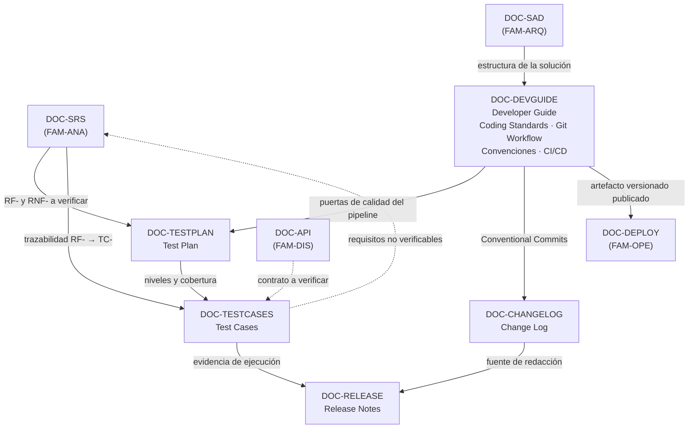

# Documentación para desarrollo — `FAM-DEV`

## Pregunta que responde la familia

**¿Cómo trabajamos sobre el proyecto?**

Las familias anteriores fijan qué se construye y cómo se estructura. Esta fija el modo de trabajo: cómo se levanta el entorno, bajo qué convenciones se escribe el código, por qué ramas viaja un cambio, qué lo verifica antes de integrarse, y cómo se comunica hacia afuera una vez publicado. Es la familia que un desarrollador nuevo consume el primer día y la que el equipo consulta a diario sin darse cuenta de que existe.

Tiene una particularidad frente al resto: sus documentos se validan solos. Un SAD puede estar equivocado durante un año sin que nadie lo note. Un Developer Guide equivocado se detecta en la primera hora del primer día de la primera incorporación, porque el comando que indica no funciona. Un Test Plan que no describe la estrategia real se descubre cuando falla la primera entrega. Esa retroalimentación rápida es la razón por la que estos documentos suelen ser los más actualizados de un repositorio, y también por la que su ausencia se siente de inmediato.

---

## Artefactos

| ID | Artefacto | Pregunta específica | Dueño | Archivo |
|----|-----------|--------------------|-------|---------|
| `DOC-DEVGUIDE` | Developer Guide | ¿Cómo me pongo a trabajar y bajo qué reglas escribo código? | `ACT-04` | [Developer-Guide.md](Developer-Guide.md) |
| `DOC-TESTPLAN` | Test Plan | ¿Qué se prueba, con qué estrategia y bajo qué criterio se acepta? | `ACT-05` | [Test-Plan.md](Test-Plan.md) |
| `DOC-TESTCASES` | Test Cases | ¿Qué se ejecuta exactamente y qué resultado se espera? | `ACT-05` | [Test-Cases.md](Test-Cases.md) |
| `DOC-RELEASE` | Release Notes | ¿Qué cambió para quien usa el producto? | `ACT-01` con `ACT-09` | [Release-Notes.md](Release-Notes.md) |
| `DOC-CHANGELOG` | Change Log | ¿Qué cambió, cuándo y en qué versión? | `ACT-04` | [Change-Log.md](Change-Log.md) |

El Developer Guide absorbe cuatro temas que muchas organizaciones mantienen como documentos independientes: **Coding Standards**, **Git Workflow**, **Convenciones** y **CI/CD**. La razón es la misma que llevó al SRS a absorber casos de uso y reglas de negocio: son cuatro caras del mismo acuerdo de trabajo, con el mismo dueño y el mismo momento de revisión, y separarlas produce cuatro documentos que se contradicen entre sí. La convención de nombres de un servicio, la regla de `.editorconfig` que la verifica, el commit que la introduce y la puerta de calidad del pipeline que la impone son un solo hecho contado desde cuatro ángulos. Cuando el equipo supera las cincuenta personas y las convenciones se vuelven política corporativa transversal, la separación se justifica; esta guía documenta el caso general.

---

## Decisión propia de la guía sobre el alcance de la familia

El catálogo original del que parte esta guía no asigna familia a cuatro artefactos: Test Plan, Test Cases, Release Notes y Change Log. Quedan sueltos, y esa orfandad es habitual en los catálogos de documentación porque los cuatro se resisten a la clasificación por fase: las pruebas atraviesan análisis, diseño y operación; el versionado nace en el repositorio y muere en manos del usuario.

Esta guía los ubica aquí, y lo declara como **criterio propio**, no como práctica estándar de la industria. El razonamiento es el del ciclo de vida del cambio: los cuatro artefactos son producidos y mantenidos dentro del flujo de trabajo del repositorio, por gente que trabaja sobre el código, en el mismo ritmo que el código. El Test Plan se actualiza cuando cambia la estrategia de ramas; los Test Cases viven junto a los tests automatizados que los implementan; el Change Log se escribe en el pull request; las Release Notes se derivan del Change Log al etiquetar una versión. Ubicarlos en otra parte obligaría a cruzar la frontera de familia en cada cambio.

Las alternativas razonables, para que el lector pueda discrepar con criterio: una familia de calidad propia que agrupe Test Plan y Test Cases junto a las revisiones y las métricas, defendible en organizaciones con QA como área separada; y la ubicación de Release Notes y Change Log en la familia de operativa o en la de usuarios, defendible si quien las redacta es soporte o producto y no el equipo de desarrollo. Ninguna de las tres es incorrecta. Lo incorrecto es no decidir, que es lo que produce el artefacto huérfano que nadie mantiene.

Consecuencia práctica de la decisión: la frontera con [`FAM-OPE`](../50-Operativa/) queda en el artefacto publicado. El pipeline descrito en el Developer Guide termina cuando produce un paquete versionado y firmado en el registro de artefactos; qué se hace con ese paquete —entornos, ventanas, aprobaciones, vuelta atrás— es materia del [Deployment Guide](../50-Operativa/Deployment-Guide.md).

---

## Relaciones

Dos flechas merecen atención. La que va del Change Log a las Release Notes marca la dirección correcta de derivación: las notas de versión se escriben leyendo el registro de cambios, nunca al revés, porque el registro es exhaustivo y las notas son selectivas. La punteada que va de los Test Cases al SRS es el circuito de calidad más rentable y más omitido: cuando QA no logra escribir un caso ejecutable para un requisito, el defecto está en el requisito.

---

## Orden de lectura

En `ESC-1` la familia se consume casi en el orden en que aparece. El Developer Guide es lo primero que existe, porque sin entorno reproducible no hay código; el Test Plan se escribe en paralelo al SRS y no después, para que los requisitos nazcan verificables; los Test Cases aparecen cuando hay comportamiento concreto que fijar; y el Change Log empieza en el primer commit, mucho antes de que haya una versión que anunciar.

En `ESC-3` el orden se invierte por completo: no se lee documentación, se reconstruye. Las convenciones reales de un repositorio se infieren del código y del historial, y el Developer Guide resultante describe lo que el equipo hace, no lo que un documento viejo dice que hace. En `ESC-4` sobrevive un solo artefacto observable, y es sorprendentemente rico: las release notes públicas de un producto ajeno.

1. [Developer-Guide.md](Developer-Guide.md) — entorno, estructura, estándares de código, flujo de ramas, convenciones y pipeline.
2. [Test-Plan.md](Test-Plan.md) — la estrategia: qué niveles, con qué alcance, bajo qué criterios de entrada y salida.
3. [Test-Cases.md](Test-Cases.md) — la ejecución: casos concretos, trazables y derivados con técnica.
4. [Change-Log.md](Change-Log.md) — el registro técnico continuo.
5. [Release-Notes.md](Release-Notes.md) — la comunicación puntual hacia quien usa el producto.

El Change Log se lee antes que las Release Notes por la misma razón por la que se escribe antes.

---

## Enlaces al marco

- [Escenarios](../00-Marco-de-Referencia/Escenarios.md) — `ESC-1` a `ESC-4`.
- [Contextos](../00-Marco-de-Referencia/Contextos.md) — `CTX-1`, `CTX-2`, `CTX-3`.
- [Actores](../00-Marco-de-Referencia/Actores.md) — `ACT-04` es el dueño principal de la familia; `ACT-05` es dueño de los dos documentos de pruebas; `ACT-03` aprueba las convenciones estructurales y `ACT-06` es consultado sobre el pipeline.
- [Convenciones](../00-Marco-de-Referencia/Convenciones.md) — frontmatter, identificadores y estilo.

## Enlaces a familias vecinas

- [SRS](../20-Analisis/SRS.md) — origen de los requisitos que el Test Plan verifica y los Test Cases trazan.
- [API Specification](../40-Diseno/API-Specification.md) — contrato que las pruebas de integración validan.
- [Deployment Guide](../50-Operativa/Deployment-Guide.md) — continúa donde termina el pipeline de esta familia.
